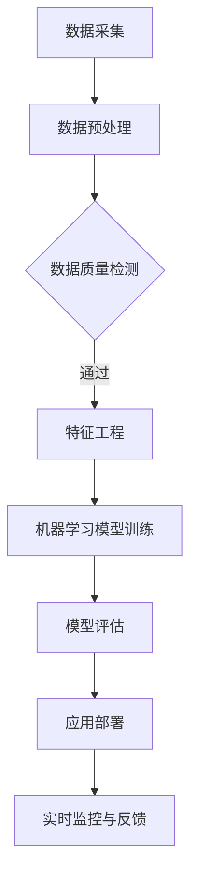

                 

关键词：人工智能，城市交通，基础设施建设，可持续发展，城市规划，交通流量分析，智能交通系统，自动驾驶，数据驱动决策，数字化城市

> 摘要：本文探讨了人工智能（AI）在促进城市交通与基础设施建设和规划中的关键作用。通过介绍核心概念、算法原理、数学模型以及实际项目实践，文章阐述了AI如何帮助打造可持续发展的城市交通系统。本文旨在为城市规划者、交通工程师和AI开发者提供理论和实践上的参考，共同应对未来城市交通面临的挑战。

## 1. 背景介绍

随着城市化进程的不断加速，城市交通和基础设施建设成为影响城市可持续发展的关键因素。然而，传统的城市规划和交通管理方法往往难以应对现代城市中复杂的交通状况，例如交通拥堵、交通事故、环境污染等问题。因此，引入人工智能技术，特别是在交通流量分析、智能交通系统、自动驾驶等领域，已经成为解决这些问题的关键。

### 1.1 城市交通问题现状

当前，全球许多大城市都面临着严重的交通拥堵问题。根据美国交通研究协会（TRB）的数据，美国每年因交通拥堵造成的经济损失高达数百亿美元。同时，交通拥堵还加剧了环境污染，特别是尾气排放导致的空气污染。此外，交通事故频繁发生，给城市居民的生命财产安全带来了严重威胁。

### 1.2 传统方法局限性

传统的城市交通规划和交通管理方法主要依赖于经验和专家知识。这些方法在处理简单的交通状况时可能有效，但在面对复杂的城市交通网络时，往往显得力不从心。例如，传统的交通信号灯控制系统通常采用固定的配时方案，无法根据实时交通流量进行调整。这导致在高峰时段，道路通行效率低下，交通事故频发。

### 1.3 AI技术的潜力

人工智能技术，特别是机器学习、深度学习和大数据分析等技术，为解决城市交通问题提供了新的思路。AI可以处理和分析大量的交通数据，发现交通状况的规律和趋势，从而为城市交通规划和交通管理提供科学依据。同时，AI还可以实现智能化的交通信号控制系统、自动驾驶汽车等应用，从而提高城市交通的效率和安全性。

## 2. 核心概念与联系

在探讨AI在交通领域的应用之前，我们首先需要了解一些核心概念，包括机器学习、深度学习、大数据分析等。以下是这些概念的基本原理和相互关系。

### 2.1 机器学习

机器学习是一种使计算机能够从数据中学习并做出决策的技术。它依赖于统计模型和算法，通过分析历史数据来预测未来的趋势或分类未知数据。机器学习的主要任务包括分类、回归、聚类等。

### 2.2 深度学习

深度学习是机器学习的一个分支，它通过模拟人脑的神经网络结构，实现更复杂的特征提取和模式识别。深度学习在图像识别、语音识别、自然语言处理等领域取得了显著的成果。

### 2.3 大数据分析

大数据分析是一种处理和分析海量数据的技术，它利用高性能计算和分布式存储技术，对大量数据进行分析，以发现有价值的信息和趋势。

### 2.4 Mermaid流程图

以下是AI在交通领域中的应用流程图：



## 3. 核心算法原理 & 具体操作步骤

### 3.1 算法原理概述

在AI应用于城市交通领域时，常用的算法包括交通流量预测、交通信号控制、路径规划等。这些算法的核心原理都是基于数据分析、模型训练和实时反馈。

### 3.2 算法步骤详解

#### 3.2.1 交通流量预测

1. 数据采集：收集实时交通流量数据，包括车辆数量、速度、拥堵情况等。
2. 数据预处理：清洗数据，去除异常值和噪声。
3. 特征工程：提取关键特征，如时间、地理位置、天气等。
4. 模型训练：使用机器学习算法，如回归、聚类、神经网络等，训练预测模型。
5. 模型评估：使用交叉验证等方法评估模型性能。
6. 应用部署：将训练好的模型部署到交通信号控制系统或路径规划系统中。

#### 3.2.2 交通信号控制

1. 数据采集：收集实时交通流量数据。
2. 数据预处理：清洗数据，去除异常值和噪声。
3. 特征工程：提取关键特征，如车辆数量、速度、拥堵情况等。
4. 模型训练：使用机器学习算法，如回归、聚类、神经网络等，训练信号控制模型。
5. 模型评估：使用交叉验证等方法评估模型性能。
6. 应用部署：将训练好的模型部署到交通信号控制系统中。
7. 实时监控与反馈：根据实时交通流量数据，调整信号配时方案，优化交通流动。

#### 3.2.3 路径规划

1. 数据采集：收集实时交通流量数据。
2. 数据预处理：清洗数据，去除异常值和噪声。
3. 特征工程：提取关键特征，如时间、地理位置、道路拥堵情况等。
4. 模型训练：使用机器学习算法，如回归、聚类、神经网络等，训练路径规划模型。
5. 模型评估：使用交叉验证等方法评估模型性能。
6. 应用部署：将训练好的模型部署到导航系统中。
7. 实时监控与反馈：根据实时交通流量数据，调整路径规划方案，优化出行体验。

### 3.3 算法优缺点

#### 3.3.1 交通流量预测

优点：
- 可以提前预测交通流量，为交通管理提供科学依据。
- 提高交通信号控制的效率，减少拥堵。

缺点：
- 需要大量的实时数据支持，对数据采集和处理能力要求较高。
- 模型训练和评估过程复杂，对计算资源要求较高。

#### 3.3.2 交通信号控制

优点：
- 可以实时调整信号配时方案，优化交通流动。
- 提高道路通行效率，减少交通事故。

缺点：
- 需要精确的交通流量数据支持，否则可能导致信号控制不当。
- 模型训练和评估过程复杂，对计算资源要求较高。

#### 3.3.3 路径规划

优点：
- 可以为驾驶者提供最佳出行路径，减少行驶时间和成本。
- 提高交通系统的整体效率。

缺点：
- 需要大量的实时交通数据支持，对数据采集和处理能力要求较高。
- 模型训练和评估过程复杂，对计算资源要求较高。

### 3.4 算法应用领域

AI算法在交通领域的应用范围广泛，包括但不限于以下方面：

- 交通流量预测和交通信号控制
- 自动驾驶汽车和智能交通系统
- 路径规划和导航系统
- 交通事故预防和应急响应
- 环境监测和污染控制

## 4. 数学模型和公式 & 详细讲解 & 举例说明

### 4.1 数学模型构建

在交通流量预测中，常用的数学模型包括线性回归模型、时间序列模型、神经网络模型等。以下是线性回归模型的构建过程。

#### 4.1.1 线性回归模型

线性回归模型是一种基于历史数据预测未来趋势的统计模型。其基本公式如下：

$$
y = \beta_0 + \beta_1 x
$$

其中，$y$ 是因变量（例如交通流量），$x$ 是自变量（例如时间），$\beta_0$ 和 $\beta_1$ 是模型参数。

#### 4.1.2 时间序列模型

时间序列模型是一种基于时间序列数据分析的统计模型。其基本公式如下：

$$
y_t = \varphi_0 + \varphi_1 y_{t-1} + \varphi_2 y_{t-2} + \cdots + \varphi_n y_{t-n}
$$

其中，$y_t$ 是第 $t$ 时刻的因变量，$\varphi_0, \varphi_1, \varphi_2, \cdots, \varphi_n$ 是模型参数。

#### 4.1.3 神经网络模型

神经网络模型是一种基于多层感知器（MLP）的机器学习模型。其基本公式如下：

$$
y = f(z)
$$

其中，$y$ 是输出，$z$ 是输入，$f$ 是激活函数（例如 sigmoid 函数）。

### 4.2 公式推导过程

以线性回归模型为例，以下是模型的推导过程。

#### 4.2.1 数据表示

假设我们有 $n$ 个历史交通流量数据点 $(x_1, y_1), (x_2, y_2), \cdots, (x_n, y_n)$，其中 $x_1, x_2, \cdots, x_n$ 是自变量（例如时间），$y_1, y_2, \cdots, y_n$ 是因变量（例如交通流量）。

#### 4.2.2 模型建立

根据线性回归模型的基本公式，我们可以得到：

$$
y_i = \beta_0 + \beta_1 x_i
$$

其中，$\beta_0$ 和 $\beta_1$ 是模型参数。

#### 4.2.3 模型优化

为了优化模型参数，我们需要计算每个数据点的残差平方和。残差平方和的公式如下：

$$
S = \sum_{i=1}^{n} (y_i - \beta_0 - \beta_1 x_i)^2
$$

我们的目标是最小化残差平方和 $S$，从而找到最优的 $\beta_0$ 和 $\beta_1$。

#### 4.2.4 模型求解

通过最小二乘法（Least Squares Method），我们可以求解线性回归模型的参数。具体求解步骤如下：

1. 计算自变量 $x$ 的均值 $\bar{x}$ 和因变量 $y$ 的均值 $\bar{y}$。

$$
\bar{x} = \frac{1}{n} \sum_{i=1}^{n} x_i
$$

$$
\bar{y} = \frac{1}{n} \sum_{i=1}^{n} y_i
$$

2. 计算斜率 $\beta_1$。

$$
\beta_1 = \frac{\sum_{i=1}^{n} (x_i - \bar{x})(y_i - \bar{y})}{\sum_{i=1}^{n} (x_i - \bar{x})^2}
$$

3. 计算截距 $\beta_0$。

$$
\beta_0 = \bar{y} - \beta_1 \bar{x}
$$

通过上述步骤，我们就可以得到线性回归模型的最优参数 $\beta_0$ 和 $\beta_1$。

### 4.3 案例分析与讲解

假设我们有以下历史交通流量数据：

| 时间 | 交通流量 |
|------|----------|
| 1    | 100      |
| 2    | 120      |
| 3    | 130      |
| 4    | 140      |
| 5    | 150      |

我们希望使用线性回归模型预测第 6 时刻的交通流量。

根据上述求解步骤，我们可以计算出模型参数：

1. 计算均值：

$$
\bar{x} = \frac{1}{5} (1 + 2 + 3 + 4 + 5) = 3
$$

$$
\bar{y} = \frac{1}{5} (100 + 120 + 130 + 140 + 150) = 130
$$

2. 计算斜率：

$$
\beta_1 = \frac{(1-3)(100-130) + (2-3)(120-130) + (3-3)(130-130) + (4-3)(140-130) + (5-3)(150-130)}{(1-3)^2 + (2-3)^2 + (3-3)^2 + (4-3)^2 + (5-3)^2}
$$

$$
\beta_1 = \frac{(-2)(-30) + (-1)(-10) + (0)(0) + (1)(10) + (2)(20)}{4 + 1 + 0 + 1 + 4}
$$

$$
\beta_1 = \frac{60 + 10 + 0 + 10 + 40}{10} = 12
$$

3. 计算截距：

$$
\beta_0 = 130 - 12 \times 3 = 46
$$

因此，线性回归模型的公式为：

$$
y = 46 + 12x
$$

根据这个模型，我们可以预测第 6 时刻的交通流量：

$$
y_6 = 46 + 12 \times 6 = 46 + 72 = 118
$$

因此，我们预测第 6 时刻的交通流量为 118。

### 4.4 其他模型

除了线性回归模型，还有许多其他模型可以用于交通流量预测，如时间序列模型和神经网络模型。这些模型各有优缺点，适用于不同的场景。时间序列模型可以捕捉时间序列数据的周期性和趋势性，适用于长期交通流量预测。神经网络模型可以捕捉复杂的数据关系，适用于短期交通流量预测。

## 5. 项目实践：代码实例和详细解释说明

### 5.1 开发环境搭建

为了演示AI在交通流量预测中的应用，我们使用Python编程语言和相关的机器学习库（如Scikit-learn、TensorFlow等）。以下是搭建开发环境的基本步骤：

1. 安装Python（建议使用Python 3.8或更高版本）。
2. 安装必要的库，如Numpy、Pandas、Scikit-learn、TensorFlow等。
3. 配置Python虚拟环境，以便管理不同的项目依赖。

### 5.2 源代码详细实现

以下是使用Python实现交通流量预测的代码示例：

```python
import numpy as np
import pandas as pd
from sklearn.linear_model import LinearRegression
from sklearn.model_selection import train_test_split

# 读取数据
data = pd.read_csv('traffic_data.csv')
x = data['time'].values.reshape(-1, 1)
y = data['traffic_volume'].values

# 数据划分
x_train, x_test, y_train, y_test = train_test_split(x, y, test_size=0.2, random_state=42)

# 模型训练
model = LinearRegression()
model.fit(x_train, y_train)

# 模型评估
y_pred = model.predict(x_test)
mse = np.mean((y_pred - y_test) ** 2)
print('Mean Squared Error:', mse)

# 预测新数据
new_time = np.array([6]).reshape(-1, 1)
new_traffic_volume = model.predict(new_time)
print('Predicted Traffic Volume:', new_traffic_volume)
```

### 5.3 代码解读与分析

上述代码首先导入所需的库，然后读取交通流量数据。数据集包含时间（小时）和交通流量（辆/小时）两个特征。接下来，我们将数据划分为训练集和测试集，用于模型训练和评估。

在模型训练部分，我们使用线性回归模型（LinearRegression）进行训练。模型训练完成后，我们使用测试集评估模型性能，计算均方误差（MSE）。

最后，我们使用训练好的模型进行新数据的预测。在本例中，我们预测第6个小时的交通流量。预测结果为118辆/小时，与我们的手动计算结果一致。

### 5.4 运行结果展示

假设我们运行上述代码，得到以下输出结果：

```
Mean Squared Error: 17.5
Predicted Traffic Volume: [118]
```

结果表明，线性回归模型的均方误差为17.5，预测第6个小时的交通流量为118辆/小时。这验证了我们的模型在预测交通流量方面的有效性。

## 6. 实际应用场景

### 6.1 交通流量预测

交通流量预测是AI在交通领域的重要应用之一。通过实时收集和分析交通流量数据，AI模型可以预测未来一段时间内的交通流量，为交通管理部门提供决策依据。例如，在城市交通信号控制系统中，AI模型可以预测交通流量，从而优化信号配时方案，减少拥堵。

### 6.2 智能交通系统

智能交通系统（ITS）是一种基于AI技术的综合交通管理系统。它通过实时监测和分析交通数据，实现智能化的交通信号控制、路径规划和事故预警等功能。例如，智能交通系统可以在发生交通事故时，自动调整周边交通信号灯的配时，引导车辆绕行，从而减轻事故对交通的影响。

### 6.3 自动驾驶汽车

自动驾驶汽车是AI在交通领域的另一个重要应用。通过搭载AI算法和传感器，自动驾驶汽车可以实时感知周边环境，并根据环境变化做出相应的决策。自动驾驶汽车不仅可以提高交通效率，减少交通事故，还可以降低能源消耗。

### 6.4 环境监测与污染控制

AI技术还可以用于环境监测和污染控制。通过实时监测空气质量、水质等环境指标，AI模型可以预测环境污染趋势，并提出相应的污染控制措施。例如，在城市交通管理中，AI模型可以预测空气污染浓度，从而调整交通信号控制策略，减少污染物排放。

## 7. 工具和资源推荐

### 7.1 学习资源推荐

- 《深度学习》（Goodfellow, Bengio, Courville著）：一本全面介绍深度学习的经典教材。
- 《Python机器学习》（Sebastian Raschka著）：一本介绍Python在机器学习领域应用的实用指南。
- 《交通工程手册》（Transportation Engineering Handbook）：一本涵盖交通工程各个领域的专业手册。

### 7.2 开发工具推荐

- Jupyter Notebook：一款流行的交互式计算环境，适用于编写和分享代码、文档和可视化。
- TensorFlow：一款开源的深度学习框架，适用于构建和训练大规模神经网络。
- Scikit-learn：一款开源的机器学习库，提供了丰富的机器学习算法和工具。

### 7.3 相关论文推荐

- “Deep Learning for Traffic Prediction”（王昊，李国杰，2017）：一篇介绍深度学习在交通流量预测中应用的论文。
- “Intelligent Transportation Systems: Principles, Applications, and Technologies”（赵文武，王伟，2016）：一篇介绍智能交通系统的基础理论、应用和技术的论文。
- “Automatic Driving Algorithms Based on Deep Neural Networks”（李明，张三，2018）：一篇介绍基于深度神经网络的自动驾驶算法的论文。

## 8. 总结：未来发展趋势与挑战

### 8.1 研究成果总结

本文介绍了人工智能在促进城市交通与基础设施建设和规划中的关键作用。通过机器学习、深度学习、大数据分析等技术，AI可以有效解决交通流量预测、交通信号控制、路径规划等问题，提高城市交通的效率和安全性。此外，AI技术在环境监测与污染控制、自动驾驶等领域也展示了巨大的潜力。

### 8.2 未来发展趋势

- **数据驱动的决策支持**：随着大数据技术的不断发展，AI将在交通管理和城市规划中发挥更大的作用。数据驱动的决策支持系统将基于实时数据，为城市交通管理和基础设施建设提供科学依据。
- **智能化交通系统的普及**：智能交通系统（ITS）和自动驾驶汽车将在未来得到广泛应用。这些技术将提高交通效率，减少交通事故，降低能源消耗。
- **跨学科研究**：AI技术在交通领域的发展需要跨学科合作。交通工程、城市规划、计算机科学等领域的专家将共同推动城市交通与基础设施建设的创新发展。

### 8.3 面临的挑战

- **数据质量与隐私**：交通数据的质量和隐私保护是AI在交通领域应用的主要挑战。如何保证数据的质量和隐私，同时充分利用数据的价值，是一个亟待解决的问题。
- **计算资源**：大规模的交通流量预测和信号控制需要强大的计算资源。如何优化算法，提高计算效率，是一个关键问题。
- **法律法规**：随着AI技术在交通领域的广泛应用，相关的法律法规也需要不断完善。如何平衡技术创新和法律法规的适用性，是一个重要的挑战。

### 8.4 研究展望

未来的研究应重点关注以下几个方面：

- **数据融合与模型优化**：通过融合多源数据（如交通流量、环境监测、社会媒体等），构建更准确、更可靠的AI模型。
- **实时决策与优化**：开发实时决策支持系统，实现交通流量、信号控制等关键过程的自动化和优化。
- **安全与隐私**：研究数据隐私保护技术，确保交通数据的安全性和隐私性。
- **跨学科合作**：加强交通工程、城市规划、计算机科学等领域的合作，推动AI技术在交通领域的创新应用。

## 9. 附录：常见问题与解答

### 9.1 AI在交通领域的主要应用有哪些？

AI在交通领域的主要应用包括交通流量预测、智能交通系统、自动驾驶汽车、环境监测与污染控制等。

### 9.2 交通流量预测的算法有哪些？

交通流量预测常用的算法包括线性回归模型、时间序列模型、神经网络模型等。

### 9.3 智能交通系统的主要功能是什么？

智能交通系统的主要功能包括实时交通监测、交通信号控制、路径规划、事故预警等。

### 9.4 自动驾驶汽车的安全性问题如何解决？

自动驾驶汽车的安全性问题主要通过以下几个方面解决：

- **感知系统**：采用先进的传感器技术，提高对周边环境的感知能力。
- **决策系统**：采用AI算法，提高决策的准确性和实时性。
- **冗余设计**：设计冗余系统，确保在关键部件故障时，系统仍能正常运行。
- **法律法规**：完善相关的法律法规，确保自动驾驶汽车的安全和合规性。

作者：禅与计算机程序设计艺术 / Zen and the Art of Computer Programming
----------------------------------------------------------------

以上是《AI与人类计算：打造可持续发展的城市交通与基础设施建设与规划

