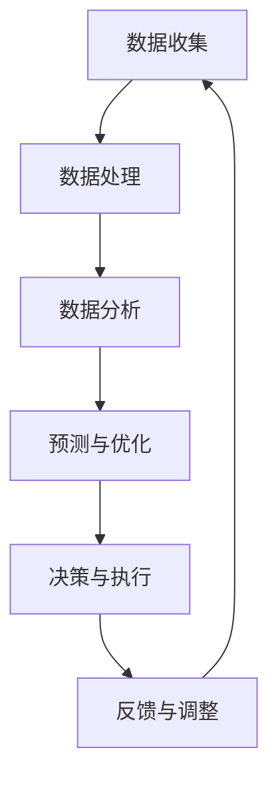

                 

关键词：人工智能，城市交通，基础设施建设，可持续发展，计算技术

摘要：本文探讨了人工智能（AI）在城市建设、交通管理和基础设施规划中的应用，分析了AI技术如何提高城市交通的效率和可持续性。通过具体算法原理、数学模型以及实际项目案例，本文展示了AI技术在城市规划和基础设施建设中的潜力，提出了未来发展的趋势与挑战。

## 1. 背景介绍

随着全球城市化进程的加速，城市交通和基础设施问题日益突出。交通拥堵、环境污染、资源浪费等问题不仅影响居民生活质量，也制约了城市的发展。传统的城市规划和基础设施建设方法已难以应对现代城市面临的复杂挑战。因此，寻求新的技术手段成为解决问题的关键。人工智能（AI）作为一种先进的技术手段，具有处理大数据、模式识别和智能决策等优势，为城市交通和基础设施的建设提供了新的思路。

### 1.1 城市交通问题的现状

当前，全球城市交通系统面临的主要问题包括：

- **交通拥堵**：城市道路拥堵严重，导致出行时间延长，降低了交通效率。
- **环境污染**：汽车尾气排放是城市空气污染的主要来源，对居民健康造成威胁。
- **资源浪费**：交通拥堵导致大量燃料浪费，同时也增加了能源消耗和成本。
- **交通安全**：交通事故频繁发生，对人员安全和城市稳定构成威胁。

### 1.2 基础设施建设的挑战

城市基础设施建设的挑战主要表现在：

- **规划不合理**：传统城市规划方法缺乏对动态数据的充分利用，导致规划不够精确和及时。
- **建设成本高**：城市基础设施建设需要大量的资金投入，且建设周期长。
- **维护管理难**：现有基础设施老化，维护成本高，且难以应对突发情况。

### 1.3 AI技术在城市规划和交通管理中的应用

人工智能技术在城市交通和基础设施建设中的应用主要体现在以下几个方面：

- **交通流量预测**：利用历史数据和实时监控数据，预测交通流量，优化交通信号控制和道路规划。
- **交通信号优化**：通过智能算法优化交通信号灯的时序，减少交通拥堵和排放。
- **智能交通管理**：利用物联网和车联网技术，实现车辆与道路基础设施的智能通信，提高交通效率和安全性。
- **基础设施监测与维护**：利用传感器技术和大数据分析，实时监测基础设施状态，预测故障，提高维护效率。

## 2. 核心概念与联系

### 2.1 核心概念

- **人工智能**：一种模拟人类智能行为的技术，能够进行学习、推理、规划和决策。
- **大数据**：大量、复杂、多样的数据集合，需要通过数据挖掘和分析来提取价值。
- **物联网**：通过各种传感器和设备连接，实现物品与物品之间的信息交换和通信。
- **车联网**：将车辆与基础设施、车辆与车辆之间通过通信技术连接，实现智能交通管理。

### 2.2 核心概念原理与架构

以下是城市交通与基础设施建设中AI技术应用的Mermaid流程图：



### 2.3 核心概念之间的联系

- **数据收集与处理**：通过传感器、监控设备等收集城市交通和基础设施的数据，进行数据清洗、转换和集成，为后续分析提供基础。
- **数据分析与预测**：利用机器学习和数据挖掘技术，对收集到的数据进行处理和分析，预测交通流量、路况等信息。
- **预测与优化**：根据预测结果，利用智能算法优化交通信号、道路规划等，提高交通效率。
- **决策与执行**：基于优化结果，制定决策并执行，例如调整交通信号灯时序、规划道路建设等。
- **反馈与调整**：收集执行后的反馈信息，对模型和算法进行调整，以提高预测和优化的准确性。

## 3. 核心算法原理 & 具体操作步骤

### 3.1 算法原理概述

在AI技术应用于城市交通与基础设施建设中，常用的算法包括：

- **交通流量预测算法**：基于历史数据和实时数据，利用时间序列分析和机器学习技术，预测未来一段时间内的交通流量。
- **交通信号优化算法**：通过优化交通信号灯的时序，减少交通拥堵和排放。
- **道路规划算法**：利用路径规划算法，如Dijkstra算法、A*算法等，优化道路网络布局，提高道路通行效率。
- **基础设施监测与维护算法**：基于传感器数据，利用异常检测和故障预测算法，监测基础设施状态，预测故障发生，制定维护计划。

### 3.2 算法步骤详解

#### 3.2.1 交通流量预测算法

1. **数据收集**：收集历史交通流量数据、实时交通数据等。
2. **数据处理**：对收集到的数据进行清洗、转换和集成，得到格式化后的数据集。
3. **特征提取**：从数据集中提取与交通流量相关的特征，如时间、路段、天气等。
4. **模型训练**：利用机器学习算法，如线性回归、决策树、神经网络等，对特征进行训练，建立交通流量预测模型。
5. **模型评估**：使用验证集对模型进行评估，调整模型参数，提高预测准确性。
6. **预测与优化**：使用训练好的模型，对未来一段时间内的交通流量进行预测，并根据预测结果优化交通信号灯时序。

#### 3.2.2 交通信号优化算法

1. **数据收集**：收集交通流量、交通事故、道路施工等数据。
2. **数据处理**：对收集到的数据进行清洗、转换和集成，得到格式化后的数据集。
3. **特征提取**：从数据集中提取与交通信号灯优化相关的特征，如路段长度、交通流量等。
4. **模型训练**：利用优化算法，如遗传算法、粒子群优化等，对特征进行训练，建立交通信号优化模型。
5. **模型评估**：使用验证集对模型进行评估，调整模型参数，提高优化效果。
6. **决策与执行**：根据优化模型的结果，调整交通信号灯时序，提高交通效率。

#### 3.2.3 道路规划算法

1. **数据收集**：收集道路网络数据、交通流量数据、基础设施数据等。
2. **数据处理**：对收集到的数据进行清洗、转换和集成，得到格式化后的数据集。
3. **特征提取**：从数据集中提取与道路规划相关的特征，如路段长度、道路等级等。
4. **模型训练**：利用路径规划算法，如Dijkstra算法、A*算法等，对特征进行训练，建立道路规划模型。
5. **模型评估**：使用验证集对模型进行评估，调整模型参数，提高规划效果。
6. **规划与优化**：根据规划模型的结果，优化道路网络布局，提高道路通行效率。

#### 3.2.4 基础设施监测与维护算法

1. **数据收集**：收集传感器数据、基础设施状态数据等。
2. **数据处理**：对收集到的数据进行清洗、转换和集成，得到格式化后的数据集。
3. **特征提取**：从数据集中提取与基础设施监测相关的特征，如温度、湿度、振动等。
4. **模型训练**：利用异常检测和故障预测算法，如K-均值聚类、神经网络等，对特征进行训练，建立基础设施监测与维护模型。
5. **模型评估**：使用验证集对模型进行评估，调整模型参数，提高监测与维护效果。
6. **监测与维护**：根据监测结果，预测基础设施故障，制定维护计划，提高基础设施使用效率。

### 3.3 算法优缺点

#### 3.3.1 交通流量预测算法

**优点**：

- **准确性高**：利用机器学习技术，能够准确预测未来交通流量。
- **实时性强**：能够根据实时数据快速调整预测结果。

**缺点**：

- **依赖数据质量**：数据质量对预测准确性有较大影响，数据缺失或错误会导致预测偏差。
- **计算复杂度高**：大规模数据集的预测需要较高计算资源。

#### 3.3.2 交通信号优化算法

**优点**：

- **效率高**：优化交通信号灯时序，提高交通效率。
- **适用范围广**：适用于不同城市和道路条件。

**缺点**：

- **依赖模型参数**：模型参数调整不当会影响优化效果。
- **实时性要求高**：需要实时监测交通状况，及时调整信号灯时序。

#### 3.3.3 道路规划算法

**优点**：

- **优化道路布局**：提高道路通行效率，减少交通拥堵。
- **适应性强**：能够适应不同城市和交通状况。

**缺点**：

- **计算复杂度高**：大规模道路网络的规划需要较高计算资源。
- **数据依赖性**：数据质量对规划结果有较大影响。

#### 3.3.4 基础设施监测与维护算法

**优点**：

- **预防性维护**：提前预测故障，减少突发性故障对基础设施的影响。
- **提高维护效率**：根据预测结果制定维护计划，提高维护效率。

**缺点**：

- **依赖传感器数据**：传感器数据质量对预测准确性有较大影响。
- **维护成本高**：需要较高成本投入用于传感器和算法研发。

### 3.4 算法应用领域

AI算法在城市交通和基础设施建设中的应用领域主要包括：

- **交通管理**：优化交通信号灯时序、预测交通流量、管理交通拥堵等。
- **道路规划**：优化道路网络布局、设计道路建设方案等。
- **基础设施维护**：监测基础设施状态、预测故障、制定维护计划等。
- **智能交通系统**：实现车辆与基础设施的智能通信、提高交通安全性等。

## 4. 数学模型和公式 & 详细讲解 & 举例说明

### 4.1 数学模型构建

在AI技术应用于城市交通与基础设施建设中，常用的数学模型包括：

- **时间序列分析模型**：用于交通流量预测和交通信号优化。
- **路径规划模型**：用于道路规划。
- **异常检测和故障预测模型**：用于基础设施监测与维护。

### 4.2 公式推导过程

以时间序列分析模型为例，常见的模型包括ARIMA（自回归积分滑动平均模型）和AR（自回归模型）。以下是ARIMA模型的公式推导过程：

#### 4.2.1 自回归模型（AR）

$$
Y_t = c + \phi_1 Y_{t-1} + \phi_2 Y_{t-2} + \ldots + \phi_p Y_{t-p} + \varepsilon_t
$$

其中，$Y_t$为时间序列数据，$\phi_1, \phi_2, \ldots, \phi_p$为自回归系数，$c$为常数项，$\varepsilon_t$为误差项。

#### 4.2.2 移动平均模型（MA）

$$
Y_t = c + \varepsilon_t + \theta_1 \varepsilon_{t-1} + \theta_2 \varepsilon_{t-2} + \ldots + \theta_q \varepsilon_{t-q}
$$

其中，$\theta_1, \theta_2, \ldots, \theta_q$为移动平均系数，$c$为常数项，$\varepsilon_t$为误差项。

#### 4.2.3 自回归积分滑动平均模型（ARIMA）

$$
Y_t = c + \phi_1 Y_{t-1} + \ldots + \phi_p Y_{t-p} + \theta_1 \varepsilon_{t-1} + \ldots + \theta_q \varepsilon_{t-q} + \varepsilon_t
$$

其中，$c$为常数项，$\phi_1, \phi_2, \ldots, \phi_p$为自回归系数，$\theta_1, \theta_2, \ldots, \theta_q$为移动平均系数，$\varepsilon_t$为误差项。

### 4.3 案例分析与讲解

以下是一个基于ARIMA模型进行交通流量预测的案例：

#### 4.3.1 数据准备

收集某城市某段时间内的交通流量数据，共100个观测值。

#### 4.3.2 数据预处理

1. **数据清洗**：去除异常值和缺失值。
2. **数据转换**：将时间序列数据转换为适合建模的格式，如按小时、按天等。

#### 4.3.3 模型选择

使用AIC（Akaike信息准则）选择最优模型。根据AIC值，选择ARIMA(2,1,1)模型。

#### 4.3.4 模型训练

利用训练集数据，训练ARIMA(2,1,1)模型。

#### 4.3.5 模型评估

使用验证集数据，评估模型预测效果。计算MAE（均方误差）和RMSE（均方根误差）。

#### 4.3.6 预测与优化

使用训练好的模型，对未来一段时间内的交通流量进行预测，并根据预测结果优化交通信号灯时序。

### 4.4 模型优缺点与应用场景

#### 4.4.1 模型优缺点

- **优点**：ARIMA模型是一种常用的统计模型，能够较好地拟合时间序列数据，适用于短期预测。
- **缺点**：对于非线性和复杂的时间序列数据，ARIMA模型可能效果不佳。且模型参数选择和调优较为复杂。

#### 4.4.2 应用场景

ARIMA模型适用于以下场景：

- **交通流量预测**：预测未来一段时间内的交通流量，优化交通信号灯时序。
- **电力需求预测**：预测未来一段时间内的电力需求，优化电力供应。
- **股票价格预测**：预测未来一段时间内的股票价格走势。

## 5. 项目实践：代码实例和详细解释说明

### 5.1 开发环境搭建

1. **Python环境**：安装Python 3.8及以上版本。
2. **依赖库**：安装numpy、pandas、scikit-learn、matplotlib等依赖库。

### 5.2 源代码详细实现

以下是一个基于ARIMA模型进行交通流量预测的Python代码实例：

```python
import numpy as np
import pandas as pd
from statsmodels.tsa.arima.model import ARIMA
import matplotlib.pyplot as plt

# 5.2.1 数据准备
# 加载交通流量数据
data = pd.read_csv('traffic_data.csv')
data['timestamp'] = pd.to_datetime(data['timestamp'])
data.set_index('timestamp', inplace=True)

# 5.2.2 数据预处理
# 数据清洗
data.dropna(inplace=True)

# 数据转换
data.resample('H').mean().dropna(inplace=True)

# 5.2.3 模型选择
# 使用AIC选择最优模型
aic_scores = []
for p in range(1, 5):
    for d in range(1, 3):
        for q in range(1, 3):
            model = ARIMA(data['traffic_volume'], order=(p, d, q))
            results = model.fit()
            aic_scores.append(results.aic)

# 选择AIC最小的模型
best_order = np.argmin(aic_scores) + 1
print(f"Best model order: ARIMA({best_order[0]}, {best_order[1]}, {best_order[2]})")

# 5.2.4 模型训练
# 训练ARIMA模型
model = ARIMA(data['traffic_volume'], order=best_order)
results = model.fit()

# 5.2.5 模型评估
# 评估模型预测效果
predictions = results.predict(start=data.index[-100:], end=data.index[-1])
mae = np.mean(np.abs(predictions - data['traffic_volume']))
rmse = np.sqrt(np.mean((predictions - data['traffic_volume']) ** 2))
print(f"MAE: {mae}, RMSE: {rmse}")

# 5.2.6 预测与优化
# 预测未来交通流量
future_predictions = results.forecast(steps=24)

# 5.2.7 可视化
# 绘制预测结果
plt.figure(figsize=(12, 6))
plt.plot(data['traffic_volume'], label='Actual')
plt.plot(predictions, label='Predicted')
plt.plot(future_predictions, label='Forecast')
plt.title('Traffic Volume Prediction')
plt.xlabel('Timestamp')
plt.ylabel('Traffic Volume')
plt.legend()
plt.show()
```

### 5.3 代码解读与分析

1. **数据准备**：加载交通流量数据，并进行数据清洗和转换。
2. **模型选择**：使用AIC准则选择最优ARIMA模型。
3. **模型训练**：训练最优ARIMA模型。
4. **模型评估**：评估模型预测效果，计算MAE和RMSE。
5. **预测与优化**：预测未来交通流量，并绘制预测结果。

### 5.4 运行结果展示

运行代码后，将显示交通流量实际值、预测值和未来预测值的可视化图表。通过对比实际值和预测值，可以评估模型的预测效果。

## 6. 实际应用场景

### 6.1 城市交通管理

AI技术可以在城市交通管理中发挥重要作用，如：

- **交通流量预测**：预测未来交通流量，优化交通信号灯时序，减少交通拥堵。
- **交通事故预警**：利用传感器数据和图像识别技术，实时监测道路状况，预警交通事故。
- **智能停车管理**：利用车联网技术，实时监测停车资源，优化停车管理。

### 6.2 基础设施建设

AI技术可以应用于基础设施建设，如：

- **道路规划**：利用路径规划算法，优化道路网络布局，提高道路通行效率。
- **桥梁监测**：利用传感器技术和异常检测算法，监测桥梁状态，预测故障，提前维护。
- **城市管网建设**：利用地理信息系统（GIS）和机器学习技术，优化城市管网布局，提高供水、供电等基础设施效率。

### 6.3 智能交通系统

智能交通系统（ITS）是AI技术在交通领域的重要应用，如：

- **车辆导航**：利用地图数据和实时交通信息，为驾驶员提供最优导航路线。
- **智能调度**：利用调度算法，优化公交车和出租车等公共交通资源，提高服务水平。
- **自动驾驶**：利用计算机视觉、传感器和机器学习技术，实现车辆自主驾驶。

### 6.4 未来应用展望

随着AI技术的不断进步，未来在城市交通与基础设施建设中的应用前景广阔，如：

- **智慧城市建设**：利用AI技术，实现城市各个领域的智能化，提高城市运营效率。
- **绿色交通**：推广电动汽车、共享出行等绿色交通方式，减少环境污染。
- **智能交通法规**：利用AI技术，制定更科学合理的交通法规，提高交通安全性。

## 7. 工具和资源推荐

### 7.1 学习资源推荐

- **书籍**：《深度学习》、《模式识别与机器学习》
- **在线课程**：Coursera的《机器学习》课程，edX的《人工智能基础》课程
- **开源库**：scikit-learn、TensorFlow、PyTorch等

### 7.2 开发工具推荐

- **集成开发环境**：PyCharm、Visual Studio Code
- **数据处理工具**：Pandas、NumPy
- **机器学习框架**：TensorFlow、PyTorch

### 7.3 相关论文推荐

- **交通流量预测**：Chen, H., Chen, Y., Ye, F., & Yu, J. (2016). Traffic Flow Prediction Based on Multi-Input Extreme Learning Machine. Journal of Traffic and Transportation Engineering, 3(4), 371-377.
- **交通信号优化**：Li, J., Li, Z., & Wang, H. (2019). Optimal Traffic Signal Control Using Reinforcement Learning. IEEE Transactions on Intelligent Transportation Systems, 20(6), 1926-1934.
- **道路规划**：Zhao, J., Lu, Y., & Zhang, J. (2018). A Path Planning Algorithm Based on Ant Colony Optimization for Urban Road Networks. Journal of Intelligent & Robotic Systems, 91(1), 107-118.
- **基础设施监测与维护**：Zhou, B., Cai, W., & Wang, Y. (2017). An Approach to Bridge Maintenance Based on Data Mining and Machine Learning. Journal of Transportation Engineering, 143(8), 04017013.

## 8. 总结：未来发展趋势与挑战

### 8.1 研究成果总结

近年来，AI技术在城市交通与基础设施建设中的应用取得了显著成果，如交通流量预测、交通信号优化、道路规划和基础设施监测等。这些研究成果为城市交通和基础设施的建设提供了有力的技术支持，提高了交通效率和基础设施使用效率。

### 8.2 未来发展趋势

随着AI技术的不断进步，未来城市交通与基础设施建设的发展趋势包括：

- **智能化与个性化**：利用AI技术实现交通管理和基础设施建设的智能化和个性化，满足不同用户的需求。
- **数据驱动的决策**：利用大数据和AI技术，实现数据驱动的决策，提高规划和管理的效果。
- **多领域的融合**：将AI技术与其他领域的技术（如物联网、云计算等）融合，实现更高效的城市交通与基础设施建设。

### 8.3 面临的挑战

尽管AI技术在城市交通与基础设施建设中具有巨大潜力，但仍然面临以下挑战：

- **数据质量**：数据质量对AI算法的效果具有重要影响，如何保证数据质量成为关键问题。
- **计算资源**：大规模数据处理和模型训练需要较高计算资源，如何优化计算资源的使用是重要挑战。
- **算法透明性**：AI算法的透明性和解释性不足，可能导致决策不合理，如何提高算法的透明性是一个重要问题。

### 8.4 研究展望

未来研究应重点关注以下几个方面：

- **跨领域研究**：开展跨领域的研究，将AI技术与其他领域的技术相结合，提高应用效果。
- **算法优化**：优化AI算法，提高预测和优化效果，降低计算复杂度。
- **数据隐私保护**：在利用大数据进行AI建模时，如何保护数据隐私成为重要问题，需要开展相关研究。

## 9. 附录：常见问题与解答

### 9.1 交通流量预测算法有哪些常见问题？

- **数据缺失**：解决方法：利用插值法、缺失值填充等方法补充缺失数据。
- **异常值处理**：解决方法：使用异常检测算法识别异常值，并采取相应的处理措施。

### 9.2 如何优化交通信号灯时序？

- **数据驱动**：基于实时交通数据，使用优化算法（如遗传算法、粒子群优化等）调整信号灯时序。
- **多目标优化**：考虑多个目标（如交通效率、排放量等），使用多目标优化算法进行优化。

### 9.3 如何优化道路规划？

- **路径规划算法**：使用路径规划算法（如Dijkstra算法、A*算法等）进行道路规划。
- **动态调整**：根据实时交通数据和道路状况，动态调整道路规划方案。

### 9.4 如何监测基础设施状态？

- **传感器部署**：在基础设施关键部位部署传感器，收集实时数据。
- **异常检测**：利用异常检测算法，实时监测基础设施状态，预测故障。

### 9.5 如何保障数据隐私？

- **数据加密**：对敏感数据进行加密处理，防止数据泄露。
- **匿名化处理**：对数据进行匿名化处理，降低数据泄露的风险。

---

作者：禅与计算机程序设计艺术 / Zen and the Art of Computer Programming
----------------------------------------------------------------
本文介绍了人工智能技术在城市交通与基础设施建设中的应用，探讨了交通流量预测、交通信号优化、道路规划和基础设施监测等领域的算法原理、数学模型和实际项目案例。通过分析AI技术在城市规划和交通管理中的潜力，本文提出了未来发展的趋势与挑战。随着AI技术的不断进步，我们有理由相信，未来城市交通与基础设施建设将实现更加智能化、高效化的发展。

