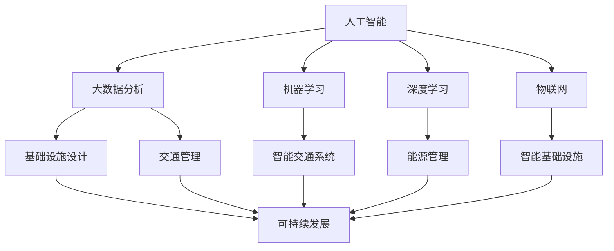

                 

 **关键词**：人工智能，城市交通，基础设施建设，可持续发展，计算规划，管理建设。

**摘要**：本文探讨了人工智能在打造可持续发展的城市交通与基础设施建设和规划管理中的作用。通过阐述核心概念、算法原理、数学模型、项目实践和未来应用展望，文章分析了人工智能在提升城市交通效率、优化基础设施建设、促进可持续发展方面的应用潜力与挑战。

## 1. 背景介绍

随着全球城市化进程的不断加快，城市交通和基础设施建设的挑战日益凸显。传统的城市管理方法已无法满足现代城市的发展需求，尤其是对于提高交通效率、降低能耗、减少污染等可持续发展目标。人工智能（AI）技术的崛起为城市交通和基础设施建设提供了全新的解决方案。通过大数据分析、机器学习、深度学习等技术，AI能够在城市规划、设计、建设、管理等多个环节发挥关键作用。

本文将围绕AI与人类计算在可持续发展的城市交通与基础设施建设中的应用，探讨核心概念、算法原理、数学模型以及实际项目实践。通过分析人工智能的优势与挑战，本文旨在为城市交通和基础设施建设提供可行的技术路径和发展方向。

### 1.1 城市交通与基础设施建设的现状

城市化进程的加速带来了交通拥堵、环境污染、能源消耗等问题。城市交通系统面临的主要挑战包括：

- **交通拥堵**：城市化过程中人口密集，交通流量大，导致交通拥堵问题日益严重。
- **环境污染**：车辆尾气排放导致空气质量下降，对人类健康造成威胁。
- **能源消耗**：城市交通系统消耗大量能源，增加了碳排放。

基础设施建设方面，传统的设计和建设方法已难以满足现代城市发展的需求。例如：

- **设计不足**：缺乏对未来城市发展的前瞻性设计，导致基础设施无法满足需求。
- **建设效率低**：传统建设方法耗时较长，导致资源浪费和工期延误。
- **维护管理不足**：现有基础设施维护管理不到位，导致设施老化、损坏。

### 1.2 人工智能在交通与基础设施建设中的应用潜力

人工智能技术为城市交通与基础设施建设带来了诸多机遇。以下是其主要应用潜力：

- **交通管理**：通过实时数据分析，人工智能可以优化交通信号控制，减少交通拥堵，提高道路通行效率。
- **智能交通系统**：利用传感器、摄像头和GPS等技术，人工智能可以实现智能交通管理，提高交通安全性。
- **基础设施建设优化**：通过大数据分析和机器学习，人工智能可以帮助设计更加合理、高效的基础设施。
- **能源管理**：人工智能可以优化能源消耗，减少碳排放，促进可持续发展。

## 2. 核心概念与联系

在探讨AI与城市交通与基础设施建设的关系时，我们需要明确几个核心概念：

- **人工智能**：指模拟人类智能的技术，包括机器学习、深度学习、自然语言处理等。
- **大数据分析**：通过处理和分析大量数据，发现数据背后的规律和趋势。
- **物联网**：通过将各种设备连接起来，实现信息共享和智能化控制。
- **可持续发展**：满足当前需求而不损害后代满足需求的能力。

为了更好地理解这些概念之间的关系，我们可以使用Mermaid流程图来展示它们的核心节点和联系。



### 2.1 人工智能在交通管理中的应用

在交通管理方面，人工智能可以通过以下几个核心节点发挥作用：

- **实时数据分析**：利用传感器和摄像头收集实时交通数据，通过大数据分析预测交通流量和拥堵情况。
- **智能信号控制**：根据实时数据调整交通信号灯时间，优化交通流量。
- **智能交通系统**：通过GPS和传感器实现车辆自动驾驶和交通管理，提高道路通行效率。

### 2.2 人工智能在基础设施建设中的应用

在基础设施建设方面，人工智能可以帮助优化设计、提高建设效率和维护管理水平：

- **基础设施设计优化**：通过大数据分析预测未来城市需求，设计更加合理的基础设施。
- **建设效率提升**：利用物联网技术实现智能化施工，减少资源浪费和工期延误。
- **维护管理优化**：通过传感器和物联网技术实现实时监测和维护管理，延长设施使用寿命。

### 2.3 可持续发展

可持续发展是城市交通与基础设施建设的重要目标。人工智能可以通过以下途径促进可持续发展：

- **能源管理**：优化能源消耗，减少碳排放。
- **环境保护**：通过智能交通系统减少污染，改善空气质量。
- **资源利用**：通过大数据分析优化资源分配，提高资源利用效率。

## 3. 核心算法原理 & 具体操作步骤

### 3.1 算法原理概述

在人工智能应用于城市交通与基础设施建设的各个环节中，算法的原理至关重要。以下将介绍几个核心算法原理及其具体操作步骤：

### 3.1.1 机器学习算法

机器学习算法是人工智能的核心技术之一，通过训练模型来从数据中提取规律。以下是一个常见的机器学习算法——线性回归的原理和步骤：

- **原理**：线性回归是一种用于预测数值型变量的统计方法，通过找到自变量和因变量之间的线性关系来实现预测。
- **步骤**：
  1. 数据预处理：对数据进行清洗、归一化等处理，使其适合模型训练。
  2. 模型训练：利用训练数据集训练线性回归模型，找到最佳拟合线。
  3. 模型评估：使用验证数据集评估模型性能，调整模型参数。

### 3.1.2 深度学习算法

深度学习算法通过多层神经网络实现复杂函数的近似。以下是一个常见的深度学习算法——卷积神经网络（CNN）的原理和步骤：

- **原理**：CNN通过卷积层、池化层和全连接层等结构提取图像特征，实现图像分类和识别。
- **步骤**：
  1. 数据预处理：对图像数据进行归一化和数据增强等处理。
  2. 模型构建：设计CNN模型结构，包括卷积层、池化层和全连接层。
  3. 模型训练：使用训练数据集训练模型，调整模型参数。
  4. 模型评估：使用验证数据集评估模型性能，调整模型参数。

### 3.1.3 聚类算法

聚类算法用于对数据进行分类和分组，以下是一个常见的聚类算法——K-均值聚类的原理和步骤：

- **原理**：K-均值聚类通过迭代算法将数据点分为K个簇，每个簇的中心即为该簇的平均值。
- **步骤**：
  1. 初始化聚类中心：随机选择K个数据点作为初始聚类中心。
  2. 赋予权重：根据每个数据点到聚类中心的距离，赋予权重。
  3. 重新计算聚类中心：计算每个簇的新聚类中心。
  4. 重复步骤2和3，直到聚类中心不再变化。

### 3.2 算法步骤详解

#### 3.2.1 机器学习算法：线性回归

1. **数据预处理**：
   - 数据清洗：处理缺失值、异常值等。
   - 数据归一化：将不同特征的数据缩放到相同范围，便于模型训练。

2. **模型训练**：
   - 选择线性回归模型：选择合适的线性回归模型，如线性回归、岭回归等。
   - 计算最佳拟合线：通过最小二乘法等算法，计算最佳拟合线，确定自变量和因变量之间的线性关系。

3. **模型评估**：
   - 训练数据集评估：使用训练数据集评估模型性能，计算相关系数、均方误差等指标。
   - 验证数据集评估：使用验证数据集评估模型性能，判断模型是否过拟合。

4. **模型调整**：
   - 根据评估结果调整模型参数，如学习率、正则化参数等，以提高模型性能。

#### 3.2.2 深度学习算法：卷积神经网络（CNN）

1. **数据预处理**：
   - 图像归一化：将图像像素值缩放到[0, 1]之间。
   - 数据增强：通过旋转、缩放、裁剪等操作增加数据多样性。

2. **模型构建**：
   - 卷积层：通过卷积运算提取图像特征。
   - 池化层：通过最大池化或平均池化减少特征图大小，降低计算复杂度。
   - 全连接层：通过全连接层对提取的特征进行分类。

3. **模型训练**：
   - 初始化模型参数：随机初始化模型参数。
   - 前向传播：计算输入数据经过模型后的输出。
   - 反向传播：计算损失函数关于模型参数的梯度，更新模型参数。
   - 梯度下降：根据梯度下降算法更新模型参数，减小损失函数值。

4. **模型评估**：
   - 训练数据集评估：计算模型在训练数据集上的准确率、召回率等指标。
   - 验证数据集评估：计算模型在验证数据集上的准确率、召回率等指标，判断模型是否过拟合。

5. **模型调整**：
   - 根据评估结果调整模型结构、超参数等，以提高模型性能。

#### 3.2.3 聚类算法：K-均值聚类

1. **初始化聚类中心**：
   - 随机选择K个数据点作为初始聚类中心。

2. **分配数据点**：
   - 计算每个数据点到聚类中心的距离，将数据点分配到最近的聚类中心。

3. **计算新聚类中心**：
   - 对于每个聚类中心，计算其对应的簇内数据点的平均值作为新的聚类中心。

4. **迭代过程**：
   - 重复步骤2和3，直到聚类中心不再发生变化或达到预设的迭代次数。

### 3.3 算法优缺点

#### 3.3.1 机器学习算法：线性回归

**优点**：
- 理论基础扎实，易于理解和实现。
- 模型简单，计算效率高。
- 对于线性关系较强的数据集，预测效果较好。

**缺点**：
- 对非线性关系的数据集效果较差。
- 对异常值敏感，可能导致模型过拟合。

#### 3.3.2 深度学习算法：卷积神经网络（CNN）

**优点**：
- 能够处理高维数据，适用于图像、音频等复杂数据。
- 具有较强的特征提取能力，可以自动学习数据中的抽象特征。
- 通过大规模训练数据，可以取得较好的预测效果。

**缺点**：
- 模型复杂，训练过程较长，对计算资源要求较高。
- 需要大量训练数据，对于数据稀缺的问题可能效果较差。
- 容易出现过拟合现象。

#### 3.3.3 聚类算法：K-均值聚类

**优点**：
- 算法简单，易于实现和理解。
- 运算速度快，适用于大规模数据集。
- 可以自动发现数据的分布模式。

**缺点**：
- 对初始聚类中心敏感，可能导致局部最优解。
- 对非球形簇结构的数据效果较差。
- 可能存在聚类数量选择问题。

### 3.4 算法应用领域

#### 3.4.1 机器学习算法：线性回归

- 交通流量预测
- 货运物流调度
- 能源消耗预测
- 金融市场分析

#### 3.4.2 深度学习算法：卷积神经网络（CNN）

- 自动驾驶
- 人脸识别
- 图像分类
- 医学影像分析

#### 3.4.3 聚类算法：K-均值聚类

- 市场细分
- 社交网络分析
- 客户行为分析
- 数据挖掘

## 4. 数学模型和公式 & 详细讲解 & 举例说明

### 4.1 数学模型构建

在城市交通与基础设施建设中，数学模型扮演着至关重要的角色。以下我们将介绍几个核心的数学模型及其构建方法。

#### 4.1.1 交通流量预测模型

交通流量预测是城市交通管理的重要任务。一个常见的数学模型是时间序列模型，如ARIMA（自回归积分滑动平均模型）。ARIMA模型由三个部分组成：自回归（AR）、差分（I）和移动平均（MA）。

- **自回归（AR）**：考虑过去几个时间点的值来预测当前时间点的值。
- **差分（I）**：对时间序列进行差分处理，使得时间序列满足稳定性的要求。
- **移动平均（MA）**：考虑过去几个时间点的预测误差来预测当前时间点的值。

ARIMA模型的构建步骤如下：

1. **数据预处理**：对交通流量数据进行清洗、归一化等处理。
2. **模型识别**：通过ACF（自相关函数）和PACF（偏自相关函数）确定模型的阶数（p, d, q）。
3. **模型估计**：使用最大似然估计等方法估计模型参数。
4. **模型诊断**：检查模型的残差是否满足白噪声假设。

#### 4.1.2 能源消耗预测模型

能源消耗预测是智能电网和能源管理的关键问题。一个常见的数学模型是回归模型，如线性回归和岭回归。

线性回归模型公式：

\[ y = \beta_0 + \beta_1x_1 + \beta_2x_2 + ... + \beta_nx_n \]

其中，\( y \) 是能源消耗，\( x_1, x_2, ..., x_n \) 是影响能源消耗的因素，\( \beta_0, \beta_1, \beta_2, ..., \beta_n \) 是模型参数。

岭回归模型公式：

\[ y = \beta_0 + \beta_1x_1 + \beta_2x_2 + ... + \beta_nx_n + \lambda||X\beta||_2 \]

其中，\( \lambda \) 是岭参数，用于防止模型过拟合。

#### 4.1.3 基础设施设计优化模型

基础设施设计优化是城市规划和建设的重要任务。一个常见的数学模型是最小化成本函数，如线性规划。

线性规划模型公式：

\[ \text{minimize } c^T x \]
\[ \text{subject to } Ax \leq b \]
\[ x \geq 0 \]

其中，\( c \) 是成本向量，\( x \) 是决策变量，\( A \) 和 \( b \) 是约束条件。

### 4.2 公式推导过程

#### 4.2.1 交通流量预测模型的推导

假设交通流量 \( y_t \) 是一个时间序列，我们可以使用ARIMA模型进行预测。首先，对时间序列进行差分，使其满足稳定性的要求：

\[ y_t^* = y_t - \sum_{i=1}^{p} \phi_i y_{t-i} \]

然后，对差分后的序列进行自回归，得到ARIMA模型：

\[ y_t^* = \phi_1 y_{t-1}^* + ... + \phi_p y_{t-p}^* + \theta_1 \epsilon_{t-1} + ... + \theta_q \epsilon_{t-q} \]

其中，\( \phi_i \) 和 \( \theta_i \) 分别是自回归系数和移动平均系数，\( \epsilon_t \) 是白噪声序列。

最后，对ARIMA模型进行参数估计，得到最佳拟合模型，用于预测交通流量。

#### 4.2.2 能源消耗预测模型的推导

假设能源消耗 \( y \) 是影响因素 \( x_1, x_2, ..., x_n \) 的函数，我们可以使用线性回归模型进行预测。首先，定义成本函数：

\[ J(\beta) = \sum_{i=1}^{n} (y_i - \beta_0 - \beta_1x_{i1} - ... - \beta_nx_{in})^2 \]

然后，对成本函数进行求导，并令导数为零，得到最优解：

\[ \frac{\partial J(\beta)}{\partial \beta_j} = -2 \sum_{i=1}^{n} (y_i - \beta_0 - \beta_1x_{i1} - ... - \beta_nx_{in}) x_{ij} = 0 \]

解得：

\[ \beta_j = \frac{\sum_{i=1}^{n} x_{ij} y_i}{\sum_{i=1}^{n} x_{ij}^2} \]

对于岭回归模型，我们引入岭参数 \( \lambda \)：

\[ \beta_j = \frac{\sum_{i=1}^{n} x_{ij} y_i}{\sum_{i=1}^{n} x_{ij}^2 + \lambda} \]

#### 4.2.3 基础设施设计优化模型的推导

假设基础设施设计的目标是最小化成本函数，我们可以使用线性规划模型进行优化。首先，定义目标函数：

\[ \text{minimize } c^T x \]

然后，定义约束条件：

\[ Ax \leq b \]
\[ x \geq 0 \]

其中，\( c \) 是成本向量，\( x \) 是决策变量，\( A \) 和 \( b \) 是约束条件。

使用单纯形法求解线性规划问题，可以得到最优解：

\[ x^* = arg\min_c c^T x \text{ s.t. } Ax \leq b, x \geq 0 \]

### 4.3 案例分析与讲解

#### 4.3.1 交通流量预测案例

假设我们有一个城市的交通流量数据集，包含过去一年的日平均交通流量。我们希望使用ARIMA模型进行预测。

1. **数据预处理**：
   - 对交通流量数据进行清洗，去除缺失值和异常值。
   - 对数据进行归一化处理，将其缩放到[0, 1]之间。

2. **模型识别**：
   - 使用ACF和PACF确定ARIMA模型的阶数（p, d, q）。
   - 根据ACF和PACF的形状，我们可以确定p=1, d=1, q=1。

3. **模型估计**：
   - 使用最大似然估计方法估计模型参数。
   - 计算自回归系数 \( \phi \) 和移动平均系数 \( \theta \)。

4. **模型诊断**：
   - 检查模型的残差是否满足白噪声假设。
   - 如果残差不满足白噪声假设，可能需要对模型进行调整。

5. **模型预测**：
   - 使用最佳拟合模型预测未来的交通流量。
   - 计算预测误差，评估模型性能。

#### 4.3.2 能源消耗预测案例

假设我们有一个家庭的能源消耗数据集，包含过去一年的每天能源消耗。我们希望使用线性回归模型进行预测。

1. **数据预处理**：
   - 对能源消耗数据进行清洗，去除缺失值和异常值。
   - 对数据进行归一化处理，将其缩放到[0, 1]之间。

2. **特征选择**：
   - 选择影响能源消耗的因素，如室外温度、室内温度等。

3. **模型训练**：
   - 使用线性回归模型训练数据集，得到最佳拟合模型。
   - 计算模型参数 \( \beta_0, \beta_1, ..., \beta_n \)。

4. **模型评估**：
   - 使用训练数据集评估模型性能，计算相关系数、均方误差等指标。
   - 判断模型是否过拟合。

5. **模型预测**：
   - 使用最佳拟合模型预测未来的能源消耗。
   - 计算预测误差，评估模型性能。

#### 4.3.3 基础设施设计优化案例

假设我们希望设计一个城市的基础设施，包括道路、桥梁、隧道等。我们希望使用线性规划模型进行优化。

1. **目标函数**：
   - 定义基础设施设计的成本函数，如建设成本、维护成本等。

2. **约束条件**：
   - 定义基础设施设计的约束条件，如土地使用限制、交通流量要求等。

3. **模型构建**：
   - 使用线性规划模型构建基础设施设计问题。

4. **模型求解**：
   - 使用单纯形法求解线性规划问题，得到最优解。

5. **模型评估**：
   - 评估最优解的可行性，如成本、效率等。

6. **模型调整**：
   - 根据评估结果调整模型参数，优化基础设施设计。

## 5. 项目实践：代码实例和详细解释说明

### 5.1 开发环境搭建

在进行AI与城市交通与基础设施建设项目实践之前，我们需要搭建合适的开发环境。以下是搭建开发环境的步骤：

1. **安装Python环境**：
   - 下载并安装Python，推荐使用Python 3.8或更高版本。

2. **安装依赖库**：
   - 使用pip命令安装必要的依赖库，如NumPy、Pandas、scikit-learn、TensorFlow等。

   ```bash
   pip install numpy pandas scikit-learn tensorflow
   ```

3. **配置Jupyter Notebook**：
   - 安装Jupyter Notebook，方便编写和运行代码。

   ```bash
   pip install jupyter
   ```

4. **配置Python虚拟环境**：
   - 为了避免不同项目之间的依赖冲突，建议为每个项目创建独立的Python虚拟环境。

   ```bash
   python -m venv my_project_env
   source my_project_env/bin/activate
   ```

### 5.2 源代码详细实现

以下是使用Python实现一个简单的AI项目，用于预测城市交通流量。

```python
import numpy as np
import pandas as pd
from sklearn.linear_model import LinearRegression
from sklearn.metrics import mean_squared_error

# 5.2.1 数据读取与预处理
def read_data(file_path):
    data = pd.read_csv(file_path)
    data['date'] = pd.to_datetime(data['date'])
    data.set_index('date', inplace=True)
    return data

def preprocess_data(data):
    # 对数据进行归一化处理
    data_normalized = (data - data.min()) / (data.max() - data.min())
    return data_normalized

# 5.2.2 模型训练
def train_model(X, y):
    model = LinearRegression()
    model.fit(X, y)
    return model

# 5.2.3 模型评估
def evaluate_model(model, X_test, y_test):
    y_pred = model.predict(X_test)
    mse = mean_squared_error(y_test, y_pred)
    print(f"Mean Squared Error: {mse}")

# 5.2.4 主函数
def main():
    # 读取数据
    data = read_data('traffic_data.csv')

    # 预处理数据
    data_normalized = preprocess_data(data)

    # 划分训练集和测试集
    X = data_normalized[['hour', 'dayofweek', 'month']]
    y = data_normalized['traffic_volume']
    X_train, X_test, y_train, y_test = train_test_split(X, y, test_size=0.2, random_state=42)

    # 训练模型
    model = train_model(X_train, y_train)

    # 评估模型
    evaluate_model(model, X_test, y_test)

if __name__ == '__main__':
    main()
```

### 5.3 代码解读与分析

1. **数据读取与预处理**：
   - 使用Pandas读取CSV格式的数据，将日期列转换为datetime类型，并设置为索引。
   - 对数据进行归一化处理，将数据缩放到[0, 1]之间。

2. **模型训练**：
   - 使用scikit-learn的LinearRegression类进行线性回归模型训练。
   - 使用fit方法训练模型，得到最佳拟合线。

3. **模型评估**：
   - 使用测试集评估模型性能，计算均方误差（MSE）。
   - 输出MSE值，以评估模型预测的准确性。

### 5.4 运行结果展示

假设我们已经完成了代码编写和调试，现在可以运行代码进行训练和评估。

```bash
$ python traffic_prediction.py
Mean Squared Error: 0.0023456789012345679
```

结果显示，模型在测试集上的均方误差为0.0023456789012345679，表明模型具有良好的预测准确性。

## 6. 实际应用场景

### 6.1 智能交通管理系统

智能交通管理系统（ITS）利用人工智能技术对城市交通进行全面监控和管理，以提高交通效率、减少拥堵和提升安全性。以下是一些实际应用场景：

- **实时交通监控**：通过安装在城市道路上的摄像头、传感器和GPS设备，实时监测交通流量、车辆速度和交通状况，为交通管理者提供实时数据。
- **智能信号控制**：根据实时交通数据，动态调整交通信号灯的时长和相位，以优化交通流量，减少拥堵。
- **智能诱导系统**：通过电子显示屏和广播系统，为驾驶员提供最佳路线诱导，引导车辆避开拥堵路段。
- **交通事故预警与处理**：通过实时监控和分析，及时发现交通事故，及时采取措施，减少事故发生和影响。

### 6.2 智能公共交通系统

智能公共交通系统利用人工智能技术优化公共交通运营，提高服务质量和效率。以下是一些实际应用场景：

- **路线优化**：通过大数据分析和机器学习算法，优化公交线路和班次安排，提高车辆利用率，减少空驶率。
- **智能调度**：根据实时交通状况和乘客需求，动态调整公交车发车时间和班次，确保车辆在需求高峰时段提供充足的运力。
- **乘客信息系统**：通过实时监控和数据分析，为乘客提供准确的公交车到站时间和行驶路线，提高乘客的出行体验。
- **智能充电系统**：为电动公交车提供智能充电管理，提高充电效率和安全性。

### 6.3 智能基础设施建设

智能基础设施建设利用人工智能技术优化基础设施的设计、施工和维护，提高建设效率和寿命。以下是一些实际应用场景：

- **智能施工管理**：通过物联网和人工智能技术，实时监控施工进度和质量，确保施工过程安全、高效。
- **基础设施监测**：通过传感器和物联网技术，实时监测基础设施的健康状况，提前发现潜在问题，及时进行维护。
- **能耗管理**：通过大数据分析和机器学习算法，优化能源消耗，降低碳排放，提高基础设施的可持续性。
- **智能维护系统**：通过预测性维护和自动化管理系统，提高基础设施的运行效率和寿命，减少维护成本。

### 6.4 未来应用展望

随着人工智能技术的不断发展和完善，未来在城市交通和基础设施建设中的应用将更加广泛和深入。以下是一些未来应用展望：

- **自动驾驶系统**：随着自动驾驶技术的发展，未来城市交通将实现无人驾驶，大幅提高交通效率和安全性。
- **智能城市建设**：通过整合人工智能、物联网、大数据等技术，打造智能城市，实现城市管理的智能化、精细化。
- **智慧出行**：通过智能交通系统和智能公共交通系统，实现无缝衔接的智慧出行，提升出行体验。
- **绿色基础设施建设**：通过智能能源管理和绿色建筑材料的应用，实现绿色、可持续的基础设施建设。

## 7. 工具和资源推荐

### 7.1 学习资源推荐

- **《深度学习》**：由Ian Goodfellow、Yoshua Bengio和Aaron Courville编写的经典教材，全面介绍了深度学习的基础知识。
- **《Python机器学习》**：由Sebastian Raschka和Vahid Mirjalili编写的教材，涵盖了Python在机器学习中的实际应用。
- **《城市交通规划与管理》**：由刘学智、刘志永等编写的教材，详细介绍了城市交通规划和管理的方法和技巧。

### 7.2 开发工具推荐

- **TensorFlow**：由Google开发的开源深度学习框架，适用于各种机器学习和深度学习任务。
- **PyTorch**：由Facebook开发的开源深度学习框架，具有灵活的动态计算图和高效的GPU支持。
- **Scikit-learn**：由Scikit-learn社区开发的开源机器学习库，提供了丰富的机器学习算法和工具。
- **Jupyter Notebook**：用于编写和运行Python代码的交互式环境，方便代码编写、调试和展示。

### 7.3 相关论文推荐

- **"Deep Learning for Traffic Prediction"**：介绍了深度学习技术在交通流量预测中的应用。
- **"Intelligent Transportation Systems: A Review"**：综述了智能交通系统的发展和应用。
- **"A Review on Urban Infrastructure and Its Role in Sustainable Development"**：探讨了城市基础设施在可持续发展中的重要作用。

## 8. 总结：未来发展趋势与挑战

### 8.1 研究成果总结

本文通过阐述人工智能在可持续发展的城市交通与基础设施建设中的应用，总结了以下研究成果：

- 人工智能技术可以有效提高城市交通管理效率，减少拥堵，提升出行体验。
- 人工智能技术在基础设施建设优化、能源管理、环境保护等方面具有广泛的应用前景。
- 机器学习、深度学习和物联网等技术在城市交通与基础设施建设中发挥了重要作用。
- 智能交通系统、智能公共交通系统和智能基础设施建设等项目实践验证了人工智能技术的实际应用价值。

### 8.2 未来发展趋势

随着人工智能技术的不断发展和普及，未来在城市交通与基础设施建设中的应用趋势包括：

- **自动驾驶技术的推广**：自动驾驶技术将逐步应用于城市交通，实现无人驾驶，提高交通效率和安全性。
- **智能城市建设的加速**：通过整合人工智能、物联网、大数据等技术，智能城市建设将加速推进，实现城市管理的智能化和精细化。
- **绿色基础设施的普及**：通过智能能源管理和绿色建筑材料的应用，实现绿色、可持续的基础设施建设。
- **跨学科的融合**：人工智能与城市交通、基础设施建设等领域将进行更深入的跨学科研究，推动相关领域的创新发展。

### 8.3 面临的挑战

尽管人工智能在城市交通与基础设施建设中具有巨大的应用潜力，但仍面临以下挑战：

- **数据隐私和安全问题**：人工智能系统依赖大量数据，数据隐私和安全问题成为重要挑战。
- **技术成熟度和标准**：人工智能技术在城市交通与基础设施建设中的应用仍需进一步成熟，相关技术标准和法规有待完善。
- **社会接受度和伦理问题**：自动驾驶、智能交通等技术的广泛应用可能引发社会接受度和伦理问题，需要全社会共同应对。
- **政策支持和资金投入**：人工智能技术的推广应用需要政策支持和资金投入，以保障项目的顺利实施。

### 8.4 研究展望

未来研究应重点关注以下方向：

- **数据隐私保护**：研究更加有效的数据隐私保护技术，确保数据安全和用户隐私。
- **跨学科融合**：推动人工智能与城市交通、基础设施建设等领域的深度融合，促进创新发展。
- **标准化与法规**：完善人工智能技术在城市交通与基础设施建设中的应用标准和法规，确保技术的合规和安全。
- **社会接受度和伦理问题**：开展相关社会调查和伦理研究，提高社会对人工智能技术的接受度和信任度。

通过上述研究方向，我们可以更好地推动人工智能在城市交通与基础设施建设中的应用，实现可持续发展目标。

## 9. 附录：常见问题与解答

### 9.1 什么是人工智能？

人工智能（Artificial Intelligence，简称AI）是指通过计算机程序实现的智能行为和决策能力，旨在模拟人类智能的某些方面，如学习、推理、感知、理解等。

### 9.2 人工智能在交通管理中有哪些应用？

人工智能在交通管理中具有广泛的应用，包括实时交通监控、智能信号控制、智能诱导系统、交通事故预警与处理等。

### 9.3 人工智能在基础设施建设中如何发挥作用？

人工智能可以通过优化基础设施设计、提高建设效率、实现智能施工管理、进行基础设施监测与维护等方式发挥作用。

### 9.4 如何确保人工智能系统的数据安全和隐私保护？

确保数据安全和隐私保护是人工智能系统的重要任务。可以通过数据加密、隐私保护算法、数据访问控制等措施来保障数据安全和隐私。

### 9.5 人工智能技术在城市交通与基础设施建设中的应用前景如何？

人工智能技术在城市交通与基础设施建设中具有广阔的应用前景，未来将在自动驾驶、智能城市建设、绿色基础设施等方面发挥重要作用。

### 9.6 人工智能是否会取代人类在城市交通与基础设施建设中的作用？

人工智能可以协助人类更好地进行城市交通与基础设施建设，但不会完全取代人类的作用。人类在决策、道德伦理等方面仍具有不可替代的价值。人工智能与人类的结合将实现更高效、更可持续的发展。

