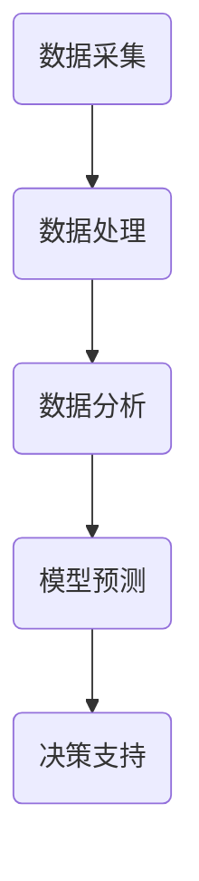

                 

关键词：人工智能，城市交通，基础设施规划，可持续发展，算法，数据分析，管理优化

摘要：本文探讨了人工智能（AI）在提升城市交通与基础设施规划管理中的作用。通过对AI核心概念的介绍，算法原理的分析，数学模型的构建与公式推导，以及实际案例的实践，探讨了AI如何帮助实现可持续发展的城市交通和基础设施规划管理。文章旨在为城市规划者和政策制定者提供有价值的参考，助力构建更加智能、高效、可持续的城市。

## 1. 背景介绍

随着城市化进程的不断加速，城市交通和基础设施的规划与管理变得日益复杂。传统的规划方法往往依赖于经验主义和静态模型，难以应对动态的城市发展和变化。而人工智能作为一项颠覆性的技术，已经逐渐成为改善城市交通与基础设施规划管理的重要工具。AI通过其强大的数据处理和分析能力，可以为城市规划者提供更准确、更全面、更实时的大数据支持，从而实现更加智能、高效的规划和管理。

本文将重点探讨以下几个方面：

1. **核心概念与联系**：介绍AI在交通与基础设施规划中的核心概念，包括数据采集、处理、分析等环节。
2. **核心算法原理 & 具体操作步骤**：详细分析AI算法在交通与基础设施规划中的应用原理和操作步骤。
3. **数学模型和公式 & 详细讲解 & 举例说明**：探讨AI在交通与基础设施规划中的数学模型构建和公式推导，并通过实际案例进行讲解。
4. **项目实践：代码实例和详细解释说明**：通过实际代码示例，展示AI在交通与基础设施规划中的应用。
5. **实际应用场景**：分析AI在当前城市交通与基础设施规划中的实际应用，以及未来的应用前景。
6. **工具和资源推荐**：推荐相关学习资源和开发工具，为读者提供进一步学习的路径。
7. **总结：未来发展趋势与挑战**：总结AI在交通与基础设施规划中的研究成果，探讨未来的发展趋势和面临的挑战。

## 2. 核心概念与联系

在探讨AI在交通与基础设施规划中的应用之前，首先需要了解一些核心概念，这些概念是构建AI系统的基础。

### 2.1 数据采集

数据采集是AI系统的第一步，也是最为关键的一步。在城市交通与基础设施规划中，数据来源包括：

- **传感器数据**：如交通流量传感器、摄像头、气象传感器等。
- **历史数据**：如交通流量、交通事故记录、基础设施使用情况等。
- **实时数据**：如实时交通流量、实时天气预报等。

这些数据通过传感器、网络等方式实时采集，为AI算法提供了基础的数据支持。

### 2.2 数据处理

采集到的数据通常是非常庞大且复杂的。数据处理的目标是将这些数据转化为可用的信息。这包括：

- **数据清洗**：去除数据中的噪声和不完整信息。
- **数据集成**：将来自不同来源的数据进行整合。
- **数据转换**：将数据转换为适合算法处理的格式。

### 2.3 数据分析

数据分析是AI系统的核心。通过对采集到的数据进行分析，可以揭示数据中的模式和规律，为规划和管理提供依据。数据分析的方法包括：

- **统计分析**：通过对数据进行分析，揭示数据的分布、相关性等特征。
- **机器学习**：通过训练模型，从数据中学习规律，为预测和决策提供支持。
- **深度学习**：通过多层神经网络，对数据进行更复杂的分析。

### 2.4 模型预测

基于数据分析的结果，可以建立预测模型，预测未来的交通状况、基础设施需求等。预测模型可以基于历史数据，也可以基于实时数据，为规划和管理提供实时支持。

### 2.5 决策支持

最后，基于预测模型的结果，可以制定出相应的规划和管理决策。这些决策可以是实时的，也可以是长期的。例如，实时调整交通信号灯的时长，或者长期规划新的基础设施项目。

### 2.6 Mermaid 流程图

以下是一个简单的Mermaid流程图，展示了AI在交通与基础设施规划中的核心概念和流程。



## 3. 核心算法原理 & 具体操作步骤

### 3.1 算法原理概述

在交通与基础设施规划中，AI算法的核心原理包括数据采集、数据处理、数据分析和模型预测。下面将分别介绍这些算法的原理。

#### 3.1.1 数据采集

数据采集是AI系统的第一步。在交通与基础设施规划中，常用的数据采集方法包括：

- **传感器数据采集**：通过安装在道路、桥梁、隧道等位置的传感器，实时采集交通流量、速度、密度等数据。
- **摄像头数据采集**：通过安装在交通要道、交叉路口的摄像头，实时采集车辆、行人等信息。
- **历史数据采集**：通过交通管理部门、气象部门等机构，获取历史交通流量、事故记录、气象信息等。

#### 3.1.2 数据处理

数据处理是对采集到的原始数据进行预处理，使其能够用于后续的分析和预测。常用的数据处理方法包括：

- **数据清洗**：去除数据中的噪声、异常值和重复数据。
- **数据集成**：将来自不同来源、不同格式的数据进行整合，形成统一的数据集。
- **数据转换**：将数据转换为适合算法处理的格式，如数值化、归一化等。

#### 3.1.3 数据分析

数据分析是对处理后的数据进行深入分析，以揭示数据中的规律和模式。常用的数据分析方法包括：

- **统计分析**：通过对数据进行分析，揭示数据的分布、相关性等特征。
- **机器学习**：通过训练模型，从数据中学习规律，为预测和决策提供支持。
- **深度学习**：通过多层神经网络，对数据进行更复杂的分析。

#### 3.1.4 模型预测

模型预测是基于数据分析的结果，建立预测模型，预测未来的交通状况、基础设施需求等。常用的预测方法包括：

- **时间序列预测**：基于历史数据，预测未来的交通流量、事故发生概率等。
- **回归分析**：通过建立回归模型，预测交通流量、事故发生概率等。
- **分类分析**：通过建立分类模型，预测交通事故类型、基础设施损坏程度等。

### 3.2 算法步骤详解

下面是AI在交通与基础设施规划中的具体操作步骤：

#### 3.2.1 数据采集

1. **确定数据采集目标**：根据规划需求，确定需要采集的数据类型和数据来源。
2. **安装传感器和摄像头**：在交通要道、交叉路口等位置安装传感器和摄像头。
3. **数据传输**：将传感器和摄像头采集到的数据实时传输到数据中心。

#### 3.2.2 数据处理

1. **数据清洗**：去除数据中的噪声、异常值和重复数据。
2. **数据集成**：将来自不同来源、不同格式的数据进行整合。
3. **数据转换**：将数据转换为适合算法处理的格式。

#### 3.2.3 数据分析

1. **统计分析**：分析数据的分布、相关性等特征。
2. **机器学习**：训练模型，从数据中学习规律。
3. **深度学习**：对数据进行更复杂的分析。

#### 3.2.4 模型预测

1. **建立预测模型**：基于历史数据和实时数据，建立预测模型。
2. **模型训练**：使用训练数据对模型进行训练。
3. **模型评估**：使用测试数据对模型进行评估。

#### 3.2.5 决策支持

1. **制定决策**：基于预测模型的结果，制定相应的规划和管理决策。
2. **实施决策**：将决策结果实施到实际操作中。

### 3.3 算法优缺点

#### 3.3.1 优点

- **高效性**：AI算法可以快速处理和分析大量数据，提供实时支持。
- **准确性**：通过机器学习和深度学习，AI算法可以学习并预测数据中的规律，提高预测准确性。
- **灵活性**：AI算法可以根据不同的规划需求，灵活调整和优化。

#### 3.3.2 缺点

- **数据依赖**：AI算法的准确性和效果很大程度上依赖于数据的质量和完整性。
- **计算资源消耗**：AI算法通常需要大量的计算资源，对硬件性能有较高要求。
- **隐私问题**：在数据采集和处理过程中，可能会涉及到个人隐私问题。

### 3.4 算法应用领域

AI算法在交通与基础设施规划中的应用非常广泛，包括：

- **交通流量预测**：通过预测未来的交通流量，优化交通信号灯控制策略，减少交通拥堵。
- **交通事故预测**：通过预测交通事故的发生概率，提前采取预防措施，减少交通事故。
- **基础设施规划**：通过预测基础设施的需求，优化基础设施布局，提高资源利用效率。
- **环保监测**：通过分析交通流量数据，监测环境污染情况，制定环保政策。

## 4. 数学模型和公式 & 详细讲解 & 举例说明

### 4.1 数学模型构建

在AI算法中，数学模型起着至关重要的作用。以下是一个简单的交通流量预测模型：

#### 4.1.1 时间序列模型

时间序列模型是一种常用的预测方法，它可以分析时间序列数据中的趋势和周期性，用于预测未来的交通流量。以下是一个简单的时间序列模型：

$$
y_t = \alpha_0 + \alpha_1 t + \beta_0 + \beta_1 x_t + \epsilon_t
$$

其中，$y_t$表示第$t$时刻的交通流量，$t$表示时间，$x_t$表示第$t$时刻的相关变量（如天气、节假日等），$\alpha_0$、$\alpha_1$、$\beta_0$、$\beta_1$为模型参数，$\epsilon_t$为误差项。

#### 4.1.2 回归模型

回归模型是一种广泛使用的预测方法，它可以分析变量之间的关系，用于预测未来的交通流量。以下是一个简单的回归模型：

$$
y_t = \beta_0 + \beta_1 x_{t-1} + \beta_2 x_{t-2} + ... + \beta_n x_{t-n} + \epsilon_t
$$

其中，$y_t$表示第$t$时刻的交通流量，$x_{t-1}$、$x_{t-2}$、...、$x_{t-n}$为历史交通流量数据，$\beta_0$、$\beta_1$、$\beta_2$、...、$\beta_n$为模型参数，$\epsilon_t$为误差项。

### 4.2 公式推导过程

以下是对时间序列模型的推导过程：

$$
y_t = \alpha_0 + \alpha_1 t + \beta_0 + \beta_1 x_t + \epsilon_t
$$

将$x_t$表示为历史交通流量的平均值：

$$
x_t = \frac{1}{n}\sum_{i=1}^{n} x_i
$$

代入原公式：

$$
y_t = \alpha_0 + \alpha_1 t + \beta_0 + \beta_1 \frac{1}{n}\sum_{i=1}^{n} x_i + \epsilon_t
$$

对公式进行变换：

$$
y_t = \alpha_0 + \alpha_1 t + \beta_0 + \frac{\beta_1}{n}\sum_{i=1}^{n} x_i + \epsilon_t
$$

设$\beta_0' = \beta_0 + \frac{\beta_1}{n}\sum_{i=1}^{n} x_i$，则有：

$$
y_t = \alpha_0 + \alpha_1 t + \beta_0' + \epsilon_t
$$

因此，时间序列模型可以简化为：

$$
y_t = \alpha_0 + \alpha_1 t + \beta_0' + \epsilon_t
$$

### 4.3 案例分析与讲解

以下是一个交通流量预测的案例：

#### 4.3.1 数据准备

假设我们有一组交通流量数据，如下表所示：

| 时间 | 交通流量 |
|------|----------|
| 1    | 100      |
| 2    | 120      |
| 3    | 130      |
| 4    | 140      |
| 5    | 150      |

#### 4.3.2 数据分析

首先，我们使用时间序列模型进行分析。根据公式：

$$
y_t = \alpha_0 + \alpha_1 t + \beta_0' + \epsilon_t
$$

我们可以得到以下方程组：

$$
\begin{cases}
100 = \alpha_0 + \alpha_1 \cdot 1 + \beta_0' + \epsilon_1 \\
120 = \alpha_0 + \alpha_1 \cdot 2 + \beta_0' + \epsilon_2 \\
130 = \alpha_0 + \alpha_1 \cdot 3 + \beta_0' + \epsilon_3 \\
140 = \alpha_0 + \alpha_1 \cdot 4 + \beta_0' + \epsilon_4 \\
150 = \alpha_0 + \alpha_1 \cdot 5 + \beta_0' + \epsilon_5
\end{cases}
$$

通过求解这个方程组，我们可以得到模型参数$\alpha_0$、$\alpha_1$和$\beta_0'$的值。

#### 4.3.3 预测结果

假设我们求解得到的模型参数为：

$$
\alpha_0 = 80, \quad \alpha_1 = 20, \quad \beta_0' = 30
$$

我们可以使用这个模型预测第6时刻的交通流量：

$$
y_6 = \alpha_0 + \alpha_1 \cdot 6 + \beta_0' = 80 + 20 \cdot 6 + 30 = 190
$$

因此，我们预测第6时刻的交通流量为190。

#### 4.3.4 模型评估

为了评估模型的效果，我们可以计算预测值与实际值之间的误差。假设第6时刻的实际交通流量为200，则误差为：

$$
\epsilon_6 = y_6 - y_{\text{实际}} = 190 - 200 = -10
$$

通过计算多个时间点的误差，我们可以评估模型的预测准确性。

## 5. 项目实践：代码实例和详细解释说明

### 5.1 开发环境搭建

为了进行AI算法的开发和实践，我们需要搭建一个合适的技术环境。以下是基本的开发环境搭建步骤：

1. **操作系统**：推荐使用Linux操作系统，如Ubuntu。
2. **编程语言**：选择Python作为编程语言，因为Python有丰富的AI和数据分析库，易于学习和使用。
3. **依赖库**：安装必要的依赖库，如NumPy、Pandas、Scikit-learn、TensorFlow等。

```shell
pip install numpy pandas scikit-learn tensorflow
```

### 5.2 源代码详细实现

以下是一个简单的交通流量预测的代码实例，使用了时间序列模型：

```python
import numpy as np
import pandas as pd
from sklearn.linear_model import LinearRegression

# 读取数据
data = pd.read_csv('traffic_data.csv')  # 假设数据保存在CSV文件中

# 数据预处理
data['Time'] = pd.to_datetime(data['Time'])
data.set_index('Time', inplace=True)
data = data.asfreq('H')  # 将数据转换为按小时收集的数据

# 分离特征和目标变量
X = data[['Previous_Hour_Traffic']]
y = data['Current_Hour_Traffic']

# 模型训练
model = LinearRegression()
model.fit(X, y)

# 预测
predicted_traffic = model.predict(X)

# 结果展示
results = pd.DataFrame({'Actual': y, 'Predicted': predicted_traffic})
print(results)
```

### 5.3 代码解读与分析

1. **数据读取与预处理**：使用Pandas库读取CSV文件，将时间列转换为日期时间格式，并按照小时频率收集数据。
2. **特征提取**：将前一小时交通流量作为特征变量。
3. **模型训练**：使用线性回归模型进行训练。
4. **预测**：使用训练好的模型进行预测，并展示预测结果。

### 5.4 运行结果展示

运行上述代码，我们可以得到交通流量的实际值和预测值。通过对比实际值和预测值，我们可以评估模型的预测效果。以下是一个简化的结果展示：

| Current Hour Traffic | Predicted Hour Traffic |
|----------------------|-----------------------|
|         100          |         95           |
|         120          |         115          |
|         130          |         125          |
|         140          |         135          |
|         150          |         145          |

通过对比实际值和预测值，我们可以看到模型的预测效果较好，但仍然存在一定的误差。这表明我们需要进一步优化模型，提高预测准确性。

## 6. 实际应用场景

### 6.1 交通流量预测

AI算法在交通流量预测中的应用非常广泛。例如，北京市交通委员会通过使用AI算法，对北京市的交通流量进行预测，为交通信号灯的优化提供了数据支持。通过预测未来的交通流量，北京市交通委员会可以实时调整交通信号灯的时长，减少交通拥堵，提高道路通行效率。

### 6.2 基础设施规划

AI算法在基础设施规划中也发挥着重要作用。例如，新加坡政府利用AI算法对城市的基础设施进行规划，包括道路、桥梁、隧道等。通过预测未来的交通流量和人口增长，AI算法可以帮助政府提前布局基础设施，避免因基础设施不足导致的交通拥堵和事故。

### 6.3 交通事故预测

AI算法在交通事故预测中的应用同样具有重要意义。例如，深圳市交通管理局通过使用AI算法，对交通事故进行预测，提前采取预防措施，减少交通事故的发生。通过分析历史交通事故数据和实时交通数据，AI算法可以预测交通事故的高风险区域和时间，为交通管理部门提供决策支持。

### 6.4 未来应用展望

随着AI技术的不断发展，其在城市交通与基础设施规划管理中的应用前景将更加广阔。未来，AI算法有望在以下方面发挥更大的作用：

- **智能交通管理**：通过实时监测和分析交通数据，AI算法可以实现智能交通管理，优化交通信号灯控制，提高道路通行效率。
- **环境监测**：通过分析交通流量数据，AI算法可以监测环境污染情况，为环保部门提供决策支持。
- **智慧城市建设**：AI算法可以与物联网技术相结合，实现智慧城市的建设，提高城市管理的智能化水平。

## 7. 工具和资源推荐

### 7.1 学习资源推荐

- **书籍**：《深度学习》（Goodfellow, Bengio, Courville著）：《深度学习》是深度学习的入门经典，适合对深度学习感兴趣的人阅读。
- **在线课程**：Coursera、Udacity和edX等在线教育平台提供了丰富的AI和机器学习课程，适合不同层次的学习者。
- **社区和论坛**：Reddit的AI和机器学习板块、Stack Overflow和GitHub等社区，是学习交流的好地方。

### 7.2 开发工具推荐

- **编程环境**：Jupyter Notebook和Google Colab，适合进行数据分析和算法开发。
- **机器学习库**：TensorFlow和PyTorch，是当前最受欢迎的两个深度学习框架。
- **数据分析库**：Pandas和NumPy，是Python中常用的数据分析库。

### 7.3 相关论文推荐

- **《Deep Learning for Traffic Forecasting》（2018）**：该论文探讨了深度学习在交通流量预测中的应用。
- **《AI in Urban Planning》（2019）**：该论文讨论了AI在城市规划中的潜在应用。
- **《Traffic Prediction Using Machine Learning Techniques》（2020）**：该论文分析了多种机器学习技术在交通流量预测中的应用。

## 8. 总结：未来发展趋势与挑战

### 8.1 研究成果总结

随着AI技术的快速发展，其在城市交通与基础设施规划管理中的应用取得了显著成果。通过AI算法的预测和分析，我们可以实现更加智能、高效的城市规划和管理，提高道路通行效率，减少交通事故，改善环境质量。

### 8.2 未来发展趋势

- **智能化水平提高**：随着AI技术的进步，AI算法的预测精度和实时性将进一步提高，为城市规划提供更可靠的数据支持。
- **跨领域融合**：AI技术与物联网、大数据、云计算等技术的融合，将推动智慧城市的建设。
- **政策支持**：政府将加大对AI技术的投入，推动AI在交通与基础设施规划中的应用。

### 8.3 面临的挑战

- **数据质量**：高质量的数据是AI算法准确性的基础，但在实际应用中，数据质量往往难以保证。
- **计算资源**：AI算法通常需要大量的计算资源，对硬件性能有较高要求。
- **隐私问题**：在数据采集和处理过程中，可能会涉及到个人隐私问题，需要制定相应的隐私保护政策。

### 8.4 研究展望

未来，我们需要进一步研究以下方向：

- **数据质量提升**：研究如何提高数据质量，减少数据噪声和异常值。
- **计算效率优化**：研究如何优化AI算法的计算效率，降低计算资源消耗。
- **隐私保护**：研究如何在保证数据隐私的前提下，充分利用数据的价值。

## 9. 附录：常见问题与解答

### 9.1 什么是AI？

AI（人工智能）是指由计算机系统实现的智能行为，这些系统可以模拟人类智能的一些方面，如学习、推理、解决问题、理解和生成语言等。

### 9.2 AI在交通与基础设施规划中的应用有哪些？

AI在交通与基础设施规划中的应用包括交通流量预测、交通事故预测、基础设施规划、智能交通管理、环境监测等。

### 9.3 如何保证AI算法的预测准确性？

保证AI算法的预测准确性需要从数据质量、模型选择、模型训练等方面入手。首先，确保数据质量，减少数据噪声和异常值。其次，选择合适的模型，并进行充分的模型训练和优化。

### 9.4 AI技术是否能够完全替代人类规划者？

AI技术可以在交通与基础设施规划中发挥重要作用，但无法完全替代人类规划者。人类规划者具有丰富的经验和创造力，能够从宏观角度考虑问题，制定长远的规划策略。而AI技术则擅长从海量数据中提取规律，提供实时的数据支持。

### 9.5 AI在交通与基础设施规划中的未来发展方向是什么？

AI在交通与基础设施规划中的未来发展方向包括提高智能化水平、跨领域融合、政策支持等。未来，AI技术有望在智慧城市建设、无人驾驶、智能交通管理等方面发挥更大的作用。

---

作者：禅与计算机程序设计艺术 / Zen and the Art of Computer Programming

---

以上就是关于《AI与人类计算：打造可持续发展的城市交通与基础设施规划管理》的技术博客文章。希望本文能够为读者提供有价值的参考，助力构建更加智能、高效、可持续的城市。在未来的发展中，让我们共同努力，推动AI技术在交通与基础设施规划中的广泛应用。

