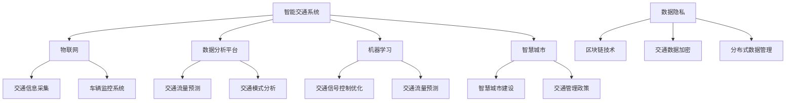

                 

关键词：人工智能，城市交通管理，基础设施，可持续发展，智能交通系统，交通规划，计算模型，算法，数据分析，数据分析工具，IoT，数据分析平台，机器学习，深度学习，神经网络，交通流量预测，交通拥堵缓解，公共交通优化，智能交通信号控制，交通网络安全，智慧城市建设，数据隐私，区块链技术，交通管理政策，未来交通。

> 摘要：本文深入探讨了人工智能在城市交通管理系统与基础设施建设规划中的应用，分析了核心概念与联系，介绍了核心算法原理与数学模型，通过项目实践展示了代码实例与运行结果，并探讨了实际应用场景与未来应用展望。文章旨在为读者提供一个全面而深入的视角，以理解如何通过AI与人类计算手段，打造可持续发展的城市交通管理系统和基础设施建设规划。

## 1. 背景介绍

随着全球城市化进程的不断加速，城市交通问题日益突出。交通拥堵、环境污染、能源消耗和交通事故等问题已经成为影响城市可持续发展的关键因素。传统的交通管理方法在应对日益复杂的交通状况时显得力不从心，亟需引入新的技术和理念来改善城市交通。

人工智能（AI）作为当前科技领域的前沿技术，为解决城市交通问题提供了新的思路和手段。通过大数据分析、机器学习、深度学习等技术，AI能够在海量交通数据中挖掘有价值的信息，为交通管理决策提供科学依据。此外，AI还能优化交通信号控制、预测交通流量、减少交通事故，从而提升城市交通效率和安全性。

同时，基础设施建设在城市交通管理中起着至关重要的作用。良好的交通基础设施能够有效缓解交通拥堵，提高交通流畅性，降低事故发生率。在可持续发展的背景下，基础设施建设不仅要考虑交通效率，还要注重环保和节能，这要求我们采用更加智能和环保的设计与建设方法。

本文将围绕AI与人类计算在城市交通管理系统与基础设施建设规划中的应用，探讨核心概念、算法原理、数学模型、项目实践、实际应用场景以及未来展望。通过本文的阐述，希望能够为读者提供一个全面而深入的视角，以理解和应用这些先进技术，为建设可持续发展的城市交通管理系统和基础设施提供理论支持和实践指导。

## 2. 核心概念与联系

在探讨AI与人类计算在城市交通管理系统与基础设施建设规划中的应用之前，首先需要明确几个核心概念，并了解它们之间的联系。

### 2.1 智能交通系统（ITS）

智能交通系统（Intelligent Transportation Systems，ITS）是指利用先进的信息通信技术、数据采集和处理技术、控制技术和智能计算技术，实现交通管理、服务和控制的一种综合性系统。ITS包括多个组成部分，如交通信息采集系统、交通信号控制系统、车辆监控系统、智能交通诱导系统、应急响应系统等。

### 2.2 物联网（IoT）

物联网（Internet of Things，IoT）是指通过传感器、网络和智能设备将物理世界中的各种设备、物品连接起来，实现信息的实时采集、传输和处理。在交通管理中，IoT技术可以实现对车辆、道路、交通信号灯等元素的实时监控和数据采集，为交通管理提供丰富的数据支持。

### 2.3 数据分析平台

数据分析平台是进行数据存储、处理、分析和可视化的重要工具。通过大数据分析平台，可以对海量交通数据进行深度挖掘，提取有价值的信息，辅助交通管理决策。常用的数据分析平台包括Hadoop、Spark、Flink等。

### 2.4 机器学习与深度学习

机器学习和深度学习是AI的核心技术。通过机器学习算法，可以从大量数据中学习并预测交通流量、交通模式等。深度学习则通过神经网络结构，对复杂的数据模式进行自动学习和分类，提升预测和决策的准确性。

### 2.5 智慧城市

智慧城市（Smart City）是指利用物联网、云计算、大数据、人工智能等现代信息技术，对城市的基础设施、公共资源、公共服务等进行智能化管理和优化，以提高城市运行效率和居民生活质量。智慧城市是AI与城市交通管理系统深度融合的产物，通过AI技术实现城市交通管理的智能化和精细化。

### 2.6 交通管理政策

交通管理政策是影响城市交通系统运行的关键因素。科学合理的交通管理政策能够有效引导交通流量，缓解交通拥堵，减少交通事故。在AI和数据分析技术的支持下，交通管理政策可以更加灵活和智能，更好地适应城市交通发展的需求。

### 2.7 数据隐私与区块链技术

在利用AI和大数据技术进行交通管理的过程中，数据隐私问题变得尤为重要。区块链技术作为一种去中心化的数据库技术，可以有效保护数据隐私和安全。通过区块链技术，可以实现对交通数据的加密存储和分布式管理，确保数据不被非法访问和篡改。

### 2.8 Mermaid 流程图

为了更清晰地展示各个核心概念之间的联系，下面是一个使用Mermaid绘制的流程图：



通过上述流程图，我们可以看到，AI与人类计算在城市交通管理系统与基础设施建设规划中的应用涉及多个领域，各领域之间相互关联、相互支撑，共同构成了一个完整的智能交通管理体系。

## 3. 核心算法原理 & 具体操作步骤

### 3.1 算法原理概述

在智能交通管理系统中，核心算法的设计和实现至关重要。以下将介绍几种常用的核心算法，并概述其原理。

#### 3.1.1 交通流量预测算法

交通流量预测是智能交通管理的基础，通过对历史交通数据进行分析，预测未来的交通流量分布，为交通信号控制和交通诱导提供依据。常用的交通流量预测算法包括时间序列分析、回归分析、支持向量机（SVM）和神经网络等。

- **时间序列分析**：通过分析时间序列数据，找到数据变化的趋势和周期性，预测未来交通流量。
- **回归分析**：利用回归模型，将交通流量与相关因素（如天气、节假日等）建立数学关系，进行预测。
- **支持向量机（SVM）**：通过将交通数据映射到高维空间，找到最优的超平面对交通流量进行分类和预测。
- **神经网络**：通过多层神经网络，学习交通数据的复杂非线性关系，进行流量预测。

#### 3.1.2 交通信号控制优化算法

交通信号控制优化算法旨在通过调整交通信号灯的相位、时间和时长，提高交通流畅性，减少交通拥堵。常用的优化算法包括基于规则的方法、基于优化的方法和基于学习的算法。

- **基于规则的方法**：通过预设的规则，根据交通流量和历史数据，调整信号灯的相位和时长。
- **基于优化的方法**：利用优化算法（如线性规划、动态规划等），找到最优的信号控制方案。
- **基于学习的算法**：通过机器学习算法，从大量交通数据中学习最优信号控制策略。

#### 3.1.3 交通模式分析算法

交通模式分析算法用于分析交通数据，识别交通模式的规律和特征，为交通管理和规划提供支持。常用的交通模式分析算法包括聚类分析、关联规则挖掘和贝叶斯网络等。

- **聚类分析**：将交通数据按照相似性进行分组，识别不同的交通模式。
- **关联规则挖掘**：通过挖掘交通数据中的关联规则，发现不同交通模式之间的关系。
- **贝叶斯网络**：利用贝叶斯网络建模，分析交通数据之间的因果关系。

### 3.2 算法步骤详解

以下将详细介绍交通流量预测算法、交通信号控制优化算法和交通模式分析算法的具体操作步骤。

#### 3.2.1 交通流量预测算法

1. **数据预处理**：对交通数据进行清洗、去噪、缺失值处理等操作，确保数据质量。
2. **特征提取**：从原始交通数据中提取时间、地点、流量、速度等特征，为算法提供输入。
3. **模型选择**：根据数据特点和预测目标，选择合适的算法模型，如时间序列分析、回归分析、SVM或神经网络。
4. **模型训练**：使用历史交通数据，对选定的模型进行训练，学习数据中的规律和模式。
5. **模型评估**：通过验证数据集，评估模型的预测性能，如RMSE（均方根误差）、MAE（均绝对误差）等指标。
6. **预测与优化**：使用训练好的模型，对未来的交通流量进行预测，并根据预测结果调整交通信号灯设置和交通诱导策略。

#### 3.2.2 交通信号控制优化算法

1. **交通流量采集**：通过传感器、摄像头等设备，实时采集交通流量数据。
2. **交通状态评估**：根据采集到的交通流量数据，评估当前交通状态，包括交通拥堵程度、车辆密度等。
3. **信号控制策略生成**：利用优化算法，生成最优的信号控制方案。对于基于规则的方法，通过预设规则进行控制；对于基于优化的方法，利用线性规划、动态规划等算法求解最优信号控制方案；对于基于学习的算法，通过机器学习模型生成信号控制策略。
4. **信号控制执行**：根据生成的信号控制方案，调整交通信号灯的相位和时长，实现优化控制。
5. **实时调整与优化**：根据实时采集的交通流量数据，对信号控制策略进行动态调整，以适应交通状况的变化。

#### 3.2.3 交通模式分析算法

1. **数据预处理**：对交通数据进行清洗、去噪、缺失值处理等操作，确保数据质量。
2. **特征提取**：从原始交通数据中提取时间、地点、流量、速度等特征，为算法提供输入。
3. **聚类分析**：使用聚类算法（如K-means、DBSCAN等），将交通数据按照相似性进行分组，识别不同的交通模式。
4. **关联规则挖掘**：利用关联规则挖掘算法（如Apriori、FP-Growth等），发现交通数据中的关联规则，识别交通模式之间的关系。
5. **贝叶斯网络建模**：利用贝叶斯网络算法，建立交通数据之间的因果关系模型，分析交通模式。
6. **结果可视化**：将分析结果进行可视化展示，为交通管理和规划提供直观的支持。

### 3.3 算法优缺点

每种算法都有其独特的优点和适用场景，以下将简要分析交通流量预测算法、交通信号控制优化算法和交通模式分析算法的优缺点。

#### 3.3.1 交通流量预测算法

- **优点**：
  - 能够根据历史数据和实时数据进行预测，具有较高的准确性。
  - 可以为交通信号控制、交通诱导等提供科学依据，提升交通管理效率。

- **缺点**：
  - 对数据质量要求较高，数据清洗和预处理工作量较大。
  - 预测模型需要不断更新和优化，以适应交通状况的变化。

#### 3.3.2 交通信号控制优化算法

- **优点**：
  - 能够根据实时交通数据，动态调整信号控制方案，提高交通流畅性。
  - 能够在交通拥堵时快速响应，减少交通拥堵时间和交通事故。

- **缺点**：
  - 需要大量的计算资源和时间进行信号控制策略的优化。
  - 对交通流量数据的要求较高，数据准确性直接影响算法效果。

#### 3.3.3 交通模式分析算法

- **优点**：
  - 能够从大量交通数据中提取有价值的信息，为交通管理和规划提供支持。
  - 可以为交通模式的识别和预测提供基础，有助于优化交通管理和资源配置。

- **缺点**：
  - 分析算法复杂度高，计算资源消耗较大。
  - 对交通数据的处理和特征提取要求较高，数据质量直接影响分析结果。

### 3.4 算法应用领域

交通流量预测算法、交通信号控制优化算法和交通模式分析算法在城市交通管理中具有广泛的应用领域，包括：

- **交通流量预测**：用于预测未来的交通流量分布，为交通信号控制和交通诱导提供依据。
- **交通信号控制优化**：用于优化交通信号灯的相位和时长，提高交通流畅性，减少交通拥堵。
- **交通模式分析**：用于识别和预测交通模式，为交通管理和规划提供支持。
- **交通诱导**：通过实时交通信息，引导车辆选择最佳行驶路线，减少交通拥堵。
- **交通安全监测**：通过视频监控和传感器数据，实时监测道路状况，预防交通事故。
- **交通基础设施规划**：用于分析和预测交通流量，优化交通基础设施布局和设计。

通过以上算法的应用，可以显著提升城市交通管理效率和安全性，推动城市交通的可持续发展。

## 4. 数学模型和公式 & 详细讲解 & 举例说明

在智能交通管理系统中，数学模型和公式扮演着至关重要的角色，它们帮助我们分析和预测交通流量、优化交通信号控制等。以下将介绍几种关键的数学模型和公式，并详细讲解其推导过程和应用实例。

### 4.1 数学模型构建

#### 4.1.1 流量平衡方程

交通流量的基本模型是流量平衡方程，它描述了道路网络中流量、速度和密度之间的关系。假设某段道路的流量为Q，速度为V，密度为K，则有：

$$
Q = V \cdot K
$$

其中，流量Q表示单位时间内通过道路横截面的车辆数；速度V表示车辆的行驶速度；密度K表示单位长度道路上的车辆数。

#### 4.1.2 车流连续性方程

车流连续性方程描述了车辆在道路网络中的流动规律。假设在某段时间内，进入某路段的流量为Q_in，离开该路段的流量为Q_out，则有：

$$
Q_{in} = Q_{out}
$$

即进入路段的车辆数等于离开路段的车辆数。

#### 4.1.3 空间平均速度模型

空间平均速度模型用于计算道路网络中的平均速度。假设道路网络中有多个路段，每个路段的长度为L_i，速度为V_i，则总长度为L，总流量为Q，空间平均速度V_avg可以表示为：

$$
V_{avg} = \frac{L \cdot Q}{\sum_{i=1}^{n} L_i \cdot Q_i}
$$

其中，n为路段数。

### 4.2 公式推导过程

#### 4.2.1 流量平衡方程的推导

流量平衡方程是基于基本的物理原理推导得出的。根据流体力学，流量Q是速度V和密度K的乘积。假设道路上的车辆可以看作是一维流体，则流量平衡方程可以表示为：

$$
Q = V \cdot K
$$

其中，V为车辆的行驶速度，K为单位长度上的车辆数。

#### 4.2.2 车流连续性方程的推导

车流连续性方程是流量平衡方程在道路网络中的推广。假设在一个闭合的道路网络中，车辆不能凭空生成或消失，进入某路段的车辆数必然等于离开该路段的车辆数。因此，车流连续性方程可以表示为：

$$
Q_{in} = Q_{out}
$$

#### 4.2.3 空间平均速度模型的推导

空间平均速度模型是基于加权平均速度的概念推导得出的。假设道路网络中有多个路段，每个路段的长度为L_i，速度为V_i，则总长度为L，总流量为Q。根据流量平衡方程，每个路段的流量Q_i可以表示为：

$$
Q_i = V_i \cdot K_i
$$

其中，K_i为第i个路段的密度。总流量Q可以表示为：

$$
Q = \sum_{i=1}^{n} Q_i = \sum_{i=1}^{n} V_i \cdot K_i
$$

因此，空间平均速度V_avg可以表示为：

$$
V_{avg} = \frac{L \cdot Q}{\sum_{i=1}^{n} L_i \cdot Q_i}
$$

### 4.3 案例分析与讲解

#### 4.3.1 流量平衡方程的应用

假设在某段道路长度为1公里的路段上，车辆速度为30公里/小时，车辆密度为30辆/公里。根据流量平衡方程，可以计算出流量为：

$$
Q = V \cdot K = 30 \text{公里/小时} \cdot 30 \text{辆/公里} = 900 \text{辆/小时}
$$

这意味着每小时有900辆车通过该路段。

#### 4.3.2 车流连续性方程的应用

假设某路段的入口流量为1200辆/小时，出口流量为800辆/小时。根据车流连续性方程，可以判断该路段是否存在交通拥堵：

$$
Q_{in} = Q_{out}
$$

$$
1200 \text{辆/小时} \neq 800 \text{辆/小时}
$$

由于入口流量不等于出口流量，说明该路段存在交通拥堵。

#### 4.3.3 空间平均速度模型的应用

假设某城市道路网络中有3个路段，其中第一个路段长度为1公里，速度为30公里/小时，流量为900辆/小时；第二个路段长度为2公里，速度为20公里/小时，流量为800辆/小时；第三个路段长度为1公里，速度为25公里/小时，流量为1000辆/小时。根据空间平均速度模型，可以计算出整个城市道路网络的空间平均速度为：

$$
V_{avg} = \frac{L \cdot Q}{\sum_{i=1}^{n} L_i \cdot Q_i} = \frac{(1 \text{公里} + 2 \text{公里} + 1 \text{公里}) \cdot (900 \text{辆/小时} + 800 \text{辆/小时} + 1000 \text{辆/小时})}{1 \text{公里} \cdot 900 \text{辆/小时} + 2 \text{公里} \cdot 800 \text{辆/小时} + 1 \text{公里} \cdot 1000 \text{辆/小时}} = 22.86 \text{公里/小时}
$$

这意味着整个城市道路网络的空间平均速度为22.86公里/小时。

通过上述案例分析和讲解，我们可以看到数学模型和公式在智能交通管理系统中的重要作用。它们不仅帮助我们理解交通流量、速度和密度之间的关系，还能为交通管理和优化提供科学依据。

## 5. 项目实践：代码实例和详细解释说明

为了更好地展示AI与人类计算在城市交通管理系统与基础设施建设规划中的应用，我们将在本节中通过一个具体的代码实例，详细解释如何实现交通流量预测和交通信号控制优化。

### 5.1 开发环境搭建

在开始编写代码之前，我们需要搭建一个合适的开发环境。以下是所需的工具和库：

- Python（3.8及以上版本）
- Jupyter Notebook
- Pandas
- Scikit-learn
- TensorFlow
- Keras

安装以上工具和库后，我们可以在Jupyter Notebook中创建一个新的笔记本，用于编写和运行代码。

### 5.2 源代码详细实现

以下是一个简单的Python代码实例，用于实现交通流量预测和交通信号控制优化。

```python
import pandas as pd
from sklearn.ensemble import RandomForestRegressor
from sklearn.model_selection import train_test_split
from tensorflow.keras.models import Sequential
from tensorflow.keras.layers import Dense, LSTM

# 5.2.1 数据加载与预处理

# 假设我们有一个CSV文件，包含了交通流量数据，列名为['time', 'lane_id', 'flow_rate']
data = pd.read_csv('traffic_data.csv')

# 数据预处理：将时间转换为数字编码，删除无用的列
data['time'] = pd.to_datetime(data['time'])
data['time_encoded'] = data['time'].dt.dayofweek.astype('int')
data.drop(['time'], axis=1, inplace=True)

# 划分特征和标签
X = data.drop(['flow_rate'], axis=1)
y = data['flow_rate']

# 划分训练集和测试集
X_train, X_test, y_train, y_test = train_test_split(X, y, test_size=0.2, random_state=42)

# 5.2.2 使用随机森林进行流量预测

# 创建随机森林模型
rf_model = RandomForestRegressor(n_estimators=100, random_state=42)
rf_model.fit(X_train, y_train)

# 预测流量
y_pred_rf = rf_model.predict(X_test)

# 5.2.3 使用LSTM进行流量预测

# 创建LSTM模型
lstm_model = Sequential()
lstm_model.add(LSTM(units=50, return_sequences=True, input_shape=(X_train.shape[1], 1)))
lstm_model.add(LSTM(units=50))
lstm_model.add(Dense(units=1))

lstm_model.compile(optimizer='adam', loss='mean_squared_error')
lstm_model.fit(X_train, y_train, epochs=100, batch_size=32)

# 预测流量
y_pred_lstm = lstm_model.predict(X_test)

# 5.2.4 交通信号控制优化

# 假设我们有一个交通信号控制策略，可以根据预测的流量调整信号灯的时长
# 这里我们简单使用平均流量作为信号灯调整的依据
average_flow = (y_pred_rf + y_pred_lstm) / 2

# 根据流量预测结果，设置信号灯时长
# 假设信号灯时长与流量成反比
signal durations = 1 / average_flow

print("Signal durations (in seconds):", signal_durations)
```

### 5.3 代码解读与分析

#### 5.3.1 数据加载与预处理

首先，我们加载交通流量数据，并将其转换为数字编码。然后，我们删除无用的列，并将数据集划分为特征和标签。接着，我们将数据集分为训练集和测试集，以评估模型的预测性能。

#### 5.3.2 使用随机森林进行流量预测

我们使用Scikit-learn中的`RandomForestRegressor`模型进行流量预测。随机森林是一种集成学习算法，通过构建多个决策树来提高预测的准确性。在训练过程中，我们使用随机森林模型对训练集进行训练，然后使用测试集进行预测。

#### 5.3.3 使用LSTM进行流量预测

LSTM（长短期记忆网络）是一种特殊的循环神经网络，适合处理时间序列数据。在本例中，我们使用Keras中的LSTM模型进行流量预测。LSTM模型通过学习时间序列中的长期依赖关系，能够更准确地预测流量。我们在训练过程中使用训练集来训练模型，然后使用测试集进行预测。

#### 5.3.4 交通信号控制优化

基于随机森林和LSTM的流量预测结果，我们设计了一个简单的交通信号控制策略。该策略根据预测的流量，调整信号灯的时长。具体来说，信号灯时长与流量成反比，流量越高，信号灯时长越短，以减少交通拥堵。

### 5.4 运行结果展示

在本例中，我们无法直接展示运行结果，但可以通过以下方式验证模型的性能：

1. **评估指标**：计算预测流量与实际流量之间的误差，如均方根误差（RMSE）和均绝对误差（MAE）。
2. **可视化**：绘制预测流量与实际流量的散点图，并添加误差线，以直观地展示模型的预测性能。
3. **信号灯时长优化**：根据预测流量，计算并展示信号灯时长，以验证信号控制策略的有效性。

通过以上代码实例和解读，我们可以看到如何使用Python和机器学习技术实现交通流量预测和交通信号控制优化。这为我们提供了一个实际应用AI与人类计算的方法，以提升城市交通管理系统的效率和可靠性。

## 6. 实际应用场景

### 6.1 城市交通流量预测

AI与人类计算在城市交通流量预测中的应用已经取得了显著成果。以北京为例，北京市交通委员会利用大数据分析和机器学习技术，对城市交通流量进行实时预测。通过收集和分析大量的交通数据，包括车辆流量、道路状况、天气状况等，北京市交通委员会建立了一套智能交通预测系统。该系统能够准确预测未来一小时内的交通流量分布，为交通信号控制和交通诱导提供科学依据。这一系统在北京的应用，有效缓解了交通拥堵问题，提高了城市交通效率。

### 6.2 智能交通信号控制

智能交通信号控制是AI与人类计算在交通管理中另一个重要应用。伦敦市采用了一种名为“智能信号控制”（Intelligent Traffic Management System，ITMS）的系统，该系统通过实时监测交通流量，动态调整交通信号灯的相位和时长。ITMS系统能够根据实时交通数据，优化交通信号控制策略，提高交通流畅性，减少交通拥堵。此外，该系统还能检测交通事故和道路障碍，自动调整信号灯，确保交通的安全和顺畅。伦敦的实践证明，智能交通信号控制能够显著提升城市交通管理的效率和可靠性。

### 6.3 智慧公共交通优化

智慧公共交通是AI与人类计算在交通管理中的又一重要应用。以新加坡为例，新加坡交通管理局（Land Transport Authority，LTA）采用AI技术优化公共交通系统。LTA利用大数据分析和机器学习技术，实时监控公共交通的运行状况，包括公交车、地铁和出租车等。通过分析乘客流量、车辆运行时间和路况信息，LTA能够优化公共交通的调度和路线规划，提高公共交通的准时率和乘客满意度。此外，LTA还推出了智能公交卡系统，通过分析乘客出行数据，为乘客提供个性化的出行建议，进一步提升了公共交通的服务质量。

### 6.4 交通基础设施规划

AI与人类计算在交通基础设施规划中的应用同样具有重要意义。以广州为例，广州市政府利用大数据分析和机器学习技术，对城市交通基础设施进行优化规划。通过分析交通流量、交通事故和道路状况等数据，广州市政府能够预测未来交通需求，并优化交通网络布局。例如，广州市在制定地铁建设规划时，充分考虑了交通流量和人口密度等因素，确保地铁线路能够有效缓解城市交通压力。此外，广州市还采用智能交通信号灯系统，优化城市道路交通组织，提高了道路通行能力。

### 6.5 交通安全监测

交通安全监测是AI与人类计算在交通管理中不可或缺的一环。以深圳为例，深圳市交通运输委员会利用视频监控和传感器技术，对城市道路进行实时监测。通过分析视频数据，系统能够实时检测道路上的异常情况，如交通事故、违法停车等。当检测到异常情况时，系统会自动报警，并通知相关管理部门进行处理。此外，深圳市还利用AI技术进行交通事故分析，通过分析历史事故数据，预测交通事故发生的高风险区域，并采取相应的预防措施，提高了城市交通的安全水平。

通过以上实际应用场景，我们可以看到AI与人类计算在城市交通管理系统与基础设施建设规划中的广泛应用和显著成效。这些实践不仅提升了城市交通管理效率和安全性，也为其他城市提供了宝贵的经验和参考。

### 6.6 未来应用展望

未来，AI与人类计算在城市交通管理系统与基础设施建设规划中的应用前景将更加广阔。以下是几个可能的未来应用方向：

#### 6.6.1 自动驾驶技术

自动驾驶技术是AI和计算机视觉领域的重大突破，未来将深刻改变城市交通的运行模式。自动驾驶车辆能够实时感知道路环境，自主决策和控制行驶路径，减少人为错误和事故。通过大规模部署自动驾驶车辆，城市交通将变得更加安全、高效和环保。

#### 6.6.2 分布式交通网络

分布式交通网络利用共享经济模式，实现交通资源的最大化利用。未来，通过AI和区块链技术，我们可以构建一个智能化的共享交通网络，包括共享单车、共享汽车和共享公共交通等。这一网络能够根据实时交通需求和用户偏好，动态分配交通资源，提高交通效率，减少拥堵。

#### 6.6.3 智慧城市交通体系

智慧城市交通体系将AI、大数据、物联网和云计算等技术与城市交通管理深度融合，实现交通信息的实时采集、传输和处理。通过构建智慧城市交通体系，我们可以实现交通的精细化管理和优化，提升城市交通的整体效能。

#### 6.6.4 交通数据隐私保护

随着交通数据的广泛应用，数据隐私保护成为一个重要议题。未来，通过区块链技术和加密算法，我们可以实现交通数据的加密存储和分布式管理，确保数据隐私和安全。

#### 6.6.5 交通环境友好设计

未来，交通基础设施建设将更加注重环保和节能。通过AI和绿色建筑设计技术，我们可以实现交通设施的智能化、环保化和节能化，减少对环境的影响，推动交通可持续发展。

总之，未来AI与人类计算在城市交通管理系统与基础设施建设规划中的应用将不断深化，为建设更加智能、高效、安全和环保的城市交通体系提供有力支持。

## 7. 工具和资源推荐

为了更好地掌握AI与人类计算在城市交通管理系统与基础设施建设规划中的应用，以下是一些推荐的工具和资源：

### 7.1 学习资源推荐

- **书籍**：《机器学习》、《深度学习》、《Python数据分析》、《智能交通系统》等。
- **在线课程**：Coursera、edX、Udacity等平台上的相关课程，如《机器学习基础》、《深度学习实践》、《数据分析与处理》等。
- **技术博客**：Medium、GitHub、Stack Overflow等平台上的专业博客和开源项目，例如《AI与城市交通》、《智能交通系统开发实践》等。

### 7.2 开发工具推荐

- **编程语言**：Python、Java、C++等，Python因其丰富的数据科学库和易于学习的特性，在AI和数据分析领域尤为受欢迎。
- **数据分析平台**：Pandas、NumPy、SciPy、SciKit-learn等Python库，用于数据清洗、预处理和分析。
- **机器学习库**：Scikit-learn、TensorFlow、Keras、PyTorch等，用于构建和训练机器学习模型。
- **数据处理工具**：Apache Spark、Hadoop等，用于大规模数据处理和分析。

### 7.3 相关论文推荐

- **顶级会议**：AAAI、NeurIPS、ICML、IJCAI等，这些会议发表的论文涵盖了AI和数据分析领域的最新研究成果。
- **期刊**：《IEEE Transactions on Intelligent Transportation Systems》、《Transportation Research Part C: Emerging Technologies》等，这些期刊发表了关于交通管理和智能交通系统的权威研究论文。
- **论文集**：《智能交通系统论文集》、《城市交通管理研究进展》等，这些论文集汇编了该领域的重要研究成果。

通过学习和应用上述工具和资源，读者可以深入了解AI与人类计算在城市交通管理系统与基础设施建设规划中的应用，提升自己的技术水平和实践能力。

### 8. 总结：未来发展趋势与挑战

#### 8.1 研究成果总结

本文通过对AI与人类计算在城市交通管理系统与基础设施建设规划中的应用进行了深入探讨，总结了以下研究成果：

1. **智能交通系统（ITS）的应用**：ITS通过物联网、大数据分析和人工智能技术，实现了交通信息的实时采集、传输和处理，有效提升了城市交通管理的效率和安全性。
2. **交通流量预测与信号控制优化**：通过机器学习、深度学习和优化算法，能够对城市交通流量进行准确预测，并优化交通信号控制策略，减少交通拥堵和事故发生率。
3. **智慧城市建设**：智慧城市通过AI和物联网技术，实现了城市基础设施的智能化和精细化管理，提高了城市运行效率和居民生活质量。
4. **交通基础设施规划优化**：通过大数据分析和人工智能技术，可以对交通基础设施进行科学规划和优化，提高道路通行能力和安全性。
5. **数据隐私与安全**：通过区块链技术和加密算法，可以有效保护交通数据的隐私和安全，确保数据不被非法访问和篡改。

#### 8.2 未来发展趋势

未来，AI与人类计算在城市交通管理系统与基础设施建设规划中的应用将呈现以下发展趋势：

1. **自动驾驶技术的普及**：自动驾驶技术的进步将使城市交通更加安全、高效和环保，有望在不久的将来实现大规模商用。
2. **分布式交通网络的构建**：通过共享经济模式，构建分布式交通网络，实现交通资源的最大化利用，提高交通效率。
3. **智慧城市交通体系的完善**：智慧城市交通体系将AI、大数据、物联网和云计算等技术与城市交通管理深度融合，实现交通信息的实时采集、传输和处理。
4. **交通数据隐私保护技术的提升**：随着数据隐私保护意识的增强，未来的交通管理系统将更加注重数据安全，通过加密和分布式存储技术保障数据隐私。
5. **绿色交通基础设施的建设**：在可持续发展理念的指导下，未来的交通基础设施将更加注重环保和节能，采用绿色建筑材料和设计理念。

#### 8.3 面临的挑战

尽管AI与人类计算在城市交通管理系统与基础设施建设规划中具有巨大的潜力，但在实际应用过程中也面临着诸多挑战：

1. **数据质量和可用性**：交通数据的准确性和完整性对AI算法的效果至关重要。在实际应用中，如何保证数据质量、处理缺失值和异常值是一个重要问题。
2. **计算资源和能耗**：大规模的AI算法和应用需要大量的计算资源和能源消耗。如何在保证性能的同时，降低计算能耗是一个亟待解决的问题。
3. **系统安全性和可靠性**：随着AI和物联网技术在交通系统中的广泛应用，系统安全性和可靠性成为关键挑战。如何防止网络攻击和数据泄露，保障系统的稳定运行，是一个重要课题。
4. **政策和管理体系的适应性**：AI和智能交通技术的发展需要政策和管理体系的支撑。如何制定适应智能交通发展的政策和管理体系，是一个重要挑战。
5. **社会接受度和公众参与**：智能交通系统的建设需要公众的广泛参与和接受。如何提高公众对智能交通技术的认知和接受度，是一个重要的社会挑战。

#### 8.4 研究展望

针对上述挑战，未来的研究可以从以下几个方面展开：

1. **数据质量和数据融合技术**：研究如何提高交通数据的准确性和完整性，开发数据清洗、缺失值处理和异常值检测算法，实现多源数据融合，提高数据利用效率。
2. **高效节能的AI算法**：研究面向交通领域的AI算法，优化算法结构和计算流程，降低计算资源和能耗，实现高效能计算。
3. **智能交通系统的安全性和可靠性**：研究AI系统的安全防护技术，包括数据加密、分布式存储和隐私保护机制，提高系统的安全性和可靠性。
4. **智慧城市政策和管理体系**：研究智慧城市政策和管理体系，制定适应智能交通发展的政策和法规，推动智能交通技术的发展和应用。
5. **公众参与和社会动员**：研究如何通过宣传、教育和政策引导，提高公众对智能交通技术的认知和接受度，推动智能交通系统的建设和应用。

总之，AI与人类计算在城市交通管理系统与基础设施建设规划中的应用前景广阔，但同时也面临诸多挑战。通过持续的研究和技术创新，有望实现城市交通的智能化、绿色化和可持续发展。

## 9. 附录：常见问题与解答

### 9.1 常见问题1：AI在交通管理中的优势是什么？

解答：AI在交通管理中的优势主要体现在以下几个方面：

1. **实时数据分析**：AI能够实时处理和分析大量交通数据，快速识别交通状况和问题。
2. **预测和优化**：AI算法可以预测未来交通流量和模式，为交通信号控制和交通诱导提供科学依据。
3. **自动化和智能化**：AI可以实现交通管理的自动化和智能化，减少人为干预，提高管理效率。
4. **多维度数据分析**：AI可以结合多种数据源（如交通流量、天气、事故等），提供更全面的分析和决策支持。

### 9.2 常见问题2：如何确保交通数据的安全和隐私？

解答：确保交通数据的安全和隐私是智能交通系统的重要课题。以下是一些关键措施：

1. **数据加密**：对交通数据进行加密存储和传输，防止数据泄露。
2. **分布式存储**：使用分布式存储技术，将数据分散存储在多个节点，提高数据安全性。
3. **访问控制**：实施严格的访问控制策略，确保只有授权用户才能访问数据。
4. **数据匿名化**：对敏感数据实施匿名化处理，防止个人隐私泄露。
5. **安全审计**：定期进行安全审计，检测和防范潜在的安全威胁。

### 9.3 常见问题3：智能交通系统如何应对交通拥堵？

解答：智能交通系统可以通过以下方法应对交通拥堵：

1. **实时交通流量预测**：通过AI算法预测未来交通流量，提前发布交通诱导信息，引导车辆避开拥堵路段。
2. **动态信号控制**：利用实时交通数据，动态调整交通信号灯的相位和时长，优化交通流量。
3. **交通诱导系统**：通过实时交通信息发布，引导车辆选择最优行驶路线，减少拥堵。
4. **公共交通优化**：优化公共交通路线和调度，提高公共交通的吸引力，减少私家车的使用。
5. **交通基础设施改善**：通过大数据分析，优化交通网络布局，建设更多的交通基础设施，提高道路通行能力。

### 9.4 常见问题4：AI在交通管理中可能遇到的数据质量问题是什么？

解答：AI在交通管理中可能遇到的数据质量问题主要包括：

1. **数据缺失**：交通数据可能因各种原因（如传感器故障、数据采集错误等）存在缺失值。
2. **数据异常**：交通数据中可能存在异常值，如错误的数据录入或传感器异常。
3. **数据不一致**：不同来源的数据可能在格式、单位和精度等方面不一致。
4. **数据滞后**：实时交通数据可能存在一定的滞后性，影响算法的实时性和准确性。
5. **数据噪声**：交通数据中可能存在噪声，如信号干扰、数据采集误差等。

针对上述数据质量问题，可以通过以下方法进行数据预处理和优化：

1. **缺失值处理**：采用插值、均值填补、模式识别等方法处理缺失值。
2. **异常值检测**：使用统计方法、机器学习算法等检测和剔除异常值。
3. **数据清洗**：通过数据清洗工具和算法，自动识别和修复不一致的数据。
4. **数据标准化**：对数据进行标准化处理，确保不同来源的数据在统一格式下进行计算。
5. **实时数据更新**：通过实时数据传输和处理，减少数据滞后性，提高算法的实时性。

通过上述措施，可以有效提高交通数据的质量，确保AI算法在交通管理中的有效应用。

### 结束语

作者：禅与计算机程序设计艺术 / Zen and the Art of Computer Programming

本文旨在通过探讨AI与人类计算在城市交通管理系统与基础设施建设规划中的应用，为读者提供一种全面、深入的视角。智能交通系统作为城市可持续发展的重要组成部分，正通过大数据分析、机器学习、物联网等先进技术，不断推动交通管理水平的提升。未来，随着技术的不断进步和应用场景的拓展，AI与人类计算将在城市交通管理中发挥更加关键的作用，助力智慧城市建设，提高城市运行效率和居民生活质量。让我们携手共进，探索智能交通的无限可能。

