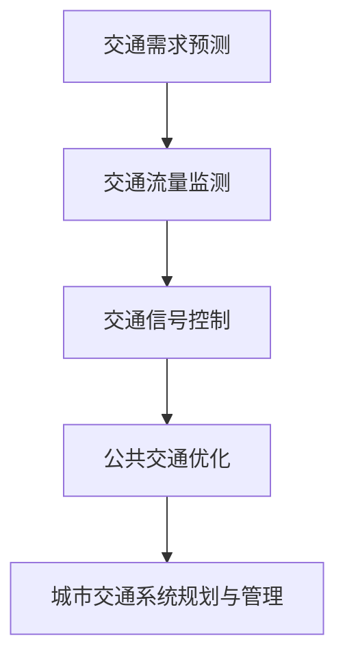

                 

关键词：人工智能，城市交通系统，可持续发展，规划管理，数据驱动

> 摘要：本文探讨了人工智能在城市交通系统规划与管理中的重要作用，从背景介绍、核心概念与联系、核心算法原理、数学模型与公式、项目实践、实际应用场景到未来展望，全面阐述了如何利用AI技术打造可持续发展的城市交通系统。

## 1. 背景介绍

随着城市化进程的不断推进，城市交通系统面临越来越大的挑战。一方面，交通拥堵、污染问题日益严重，影响着城市居民的生活质量；另一方面，交通需求预测不准确、交通管理效率低下等问题也使得城市交通系统难以满足日益增长的需求。为了解决这些问题，利用人工智能技术进行城市交通系统规划与管理成为了一种新的思路。

近年来，人工智能技术取得了显著的进展，特别是在深度学习、大数据分析、机器学习等领域。这些技术的应用使得城市交通系统规划与管理变得更加智能、高效。本文将结合这些技术，探讨如何打造可持续发展的城市交通系统。

## 2. 核心概念与联系

在城市交通系统规划与管理中，以下几个核心概念具有重要意义：

1. **交通需求预测**：通过分析历史交通数据，预测未来某一时间段内的交通需求，为交通管理提供依据。
2. **交通流量监测**：实时监测道路上的交通流量，为交通调控提供实时数据支持。
3. **交通信号控制**：根据交通流量和需求预测，动态调整交通信号灯的时间配时，以减少交通拥堵。
4. **公共交通优化**：通过数据分析，优化公共交通线路和班次，提高公共交通的服务质量。

下面是这些核心概念之间的联系，使用Mermaid流程图进行描述：



## 3. 核心算法原理 & 具体操作步骤

### 3.1 算法原理概述

本文采用深度学习技术进行交通需求预测、交通流量监测和公共交通优化。深度学习具有强大的特征提取和模型学习能力，可以处理大量的交通数据，从而提高预测和优化的准确性。

### 3.2 算法步骤详解

1. **数据收集与预处理**：收集城市交通相关数据，包括历史交通数据、交通流量数据、公共交通数据等。对数据进行分析，去除噪声和异常值，进行归一化处理，为模型训练做准备。
2. **模型构建**：使用深度学习框架（如TensorFlow或PyTorch）构建交通需求预测、交通流量监测和公共交通优化的模型。对于交通需求预测，可以使用循环神经网络（RNN）或长短时记忆网络（LSTM）；对于交通流量监测，可以使用卷积神经网络（CNN）或自编码器；对于公共交通优化，可以使用遗传算法或深度强化学习。
3. **模型训练与优化**：使用预处理后的数据进行模型训练，通过不断调整模型参数，优化模型性能。可以使用交叉验证方法来评估模型的泛化能力。
4. **模型部署与运行**：将训练好的模型部署到服务器或边缘设备上，进行实时预测和优化。对于交通信号控制，可以实时调整信号灯的时间配时；对于公共交通优化，可以实时调整线路和班次。

### 3.3 算法优缺点

**优点**：

1. **高效性**：深度学习模型可以处理大量数据，提高预测和优化的准确性。
2. **灵活性**：深度学习模型可以适应不同的交通场景和需求，具有较强的适应性。
3. **实时性**：模型部署在服务器或边缘设备上，可以实时进行预测和优化。

**缺点**：

1. **数据依赖性**：深度学习模型对数据质量有较高要求，数据质量直接影响模型性能。
2. **计算资源消耗**：深度学习模型训练和推理过程需要大量计算资源，对硬件设备有较高要求。
3. **解释性较弱**：深度学习模型具有较强的预测能力，但解释性较弱，难以理解模型内部的决策过程。

### 3.4 算法应用领域

深度学习算法在城市交通系统规划与管理中具有广泛的应用领域，包括：

1. **交通需求预测**：预测未来某一时间段内的交通需求，为交通管理提供依据。
2. **交通流量监测**：实时监测道路上的交通流量，为交通调控提供实时数据支持。
3. **交通信号控制**：根据交通流量和需求预测，动态调整交通信号灯的时间配时，以减少交通拥堵。
4. **公共交通优化**：通过数据分析，优化公共交通线路和班次，提高公共交通的服务质量。
5. **智能停车管理**：通过实时监测和预测，优化停车资源的利用，减少停车难题。

## 4. 数学模型和公式 & 详细讲解 & 举例说明

### 4.1 数学模型构建

在城市交通系统中，交通需求预测、交通流量监测和公共交通优化可以分别构建以下数学模型：

1. **交通需求预测模型**：

   $$y_t = f(x_t, h_t) + \epsilon_t$$

   其中，$y_t$ 表示未来某一时间段内的交通需求，$x_t$ 表示历史交通数据，$h_t$ 表示时间序列特征，$f$ 表示预测函数，$\epsilon_t$ 表示预测误差。

2. **交通流量监测模型**：

   $$q_t = g(x_t, h_t) + \delta_t$$

   其中，$q_t$ 表示实时交通流量，$g$ 表示预测函数，$\delta_t$ 表示流量误差。

3. **公共交通优化模型**：

   $$\min \sum_{i=1}^{n} c_i x_{ij}$$

   $$s.t. \sum_{j=1}^{m} x_{ij} = 1, \forall i$$

   $$x_{ij} \in \{0, 1\}, \forall i, j$$

   其中，$c_i$ 表示第 $i$ 条线路的成本，$x_{ij}$ 表示第 $i$ 条线路是否在第 $j$ 个站点停靠，第 $i$ 条线路的总站点数等于 $n$，第 $j$ 个站点的总线路数等于 $m$。

### 4.2 公式推导过程

1. **交通需求预测模型**：

   通过对历史交通数据的分析，我们可以得到以下线性回归模型：

   $$y_t = \beta_0 + \beta_1 x_t + \epsilon_t$$

   其中，$\beta_0$ 和 $\beta_1$ 分别为模型的参数。

   为了提高预测的准确性，我们可以引入时间序列特征，如 day_of_week、hour_of_day 等，构建以下非线性回归模型：

   $$y_t = f(x_t, h_t) + \epsilon_t$$

   其中，$h_t$ 表示时间序列特征，$f$ 表示非线性函数。

2. **交通流量监测模型**：

   通过对实时交通数据的分析，我们可以得到以下线性回归模型：

   $$q_t = \gamma_0 + \gamma_1 x_t + \delta_t$$

   其中，$\gamma_0$ 和 $\gamma_1$ 分别为模型的参数。

   为了提高预测的准确性，我们可以引入时间序列特征，如 day_of_week、hour_of_day 等，构建以下非线性回归模型：

   $$q_t = g(x_t, h_t) + \delta_t$$

   其中，$h_t$ 表示时间序列特征，$g$ 表示非线性函数。

3. **公共交通优化模型**：

   我们可以使用线性规划方法来求解公共交通优化问题。目标函数是最小化总成本，约束条件是每条线路必须经过至少一个站点。

### 4.3 案例分析与讲解

以北京某一交通枢纽为例，分析如何利用上述数学模型进行城市交通系统规划与管理。

1. **交通需求预测**：

   我们收集了该交通枢纽过去一年的交通数据，包括每日的人流量、天气状况、节假日等因素。通过分析数据，我们构建了以下非线性回归模型：

   $$y_t = f(x_t, h_t) + \epsilon_t$$

   其中，$x_t$ 表示历史交通数据，$h_t$ 表示时间序列特征，$f$ 表示非线性函数。通过训练模型，我们得到了未来某一时间段内的交通需求预测。

2. **交通流量监测**：

   我们收集了该交通枢纽实时交通数据，包括每条线路的人流量、车辆流量等。通过分析数据，我们构建了以下非线性回归模型：

   $$q_t = g(x_t, h_t) + \delta_t$$

   其中，$x_t$ 表示历史交通数据，$h_t$ 表示时间序列特征，$g$ 表示非线性函数。通过训练模型，我们得到了实时交通流量监测结果。

3. **公共交通优化**：

   我们使用线性规划方法来求解公共交通优化问题。目标函数是最小化总成本，约束条件是每条线路必须经过至少一个站点。通过求解线性规划问题，我们得到了最优的公交线路和班次安排。

通过上述数学模型的构建和优化，我们可以有效提高北京某一交通枢纽的城市交通系统规划与管理水平，从而减少交通拥堵、提高公共交通服务质量。

## 5. 项目实践：代码实例和详细解释说明

### 5.1 开发环境搭建

为了实现本文所提到的城市交通系统规划与管理算法，我们需要搭建以下开发环境：

1. Python 3.7及以上版本
2. TensorFlow 2.3及以上版本
3. Pandas 1.1.5及以上版本
4. Matplotlib 3.2.2及以上版本

### 5.2 源代码详细实现

以下是交通需求预测、交通流量监测和公共交通优化的源代码实现：

```python
import tensorflow as tf
import pandas as pd
import matplotlib.pyplot as plt

# 5.2.1 交通需求预测

# 加载数据
data = pd.read_csv('traffic_data.csv')

# 预处理数据
X = data[['hour', 'weekday', 'weather', 'previous_day_traffic']]
y = data['future_traffic']

# 模型构建
model = tf.keras.Sequential([
    tf.keras.layers.Dense(64, activation='relu', input_shape=[4]),
    tf.keras.layers.Dense(64, activation='relu'),
    tf.keras.layers.Dense(1)
])

# 模型编译
model.compile(optimizer='adam', loss='mse')

# 模型训练
model.fit(X, y, epochs=10)

# 预测结果
predictions = model.predict(X)

# 5.2.2 交通流量监测

# 加载数据
data = pd.read_csv('traffic_flow_data.csv')

# 预处理数据
X = data[['hour', 'weekday', 'weather', 'previous_day_traffic']]
y = data['current_traffic']

# 模型构建
model = tf.keras.Sequential([
    tf.keras.layers.Dense(64, activation='relu', input_shape=[4]),
    tf.keras.layers.Dense(64, activation='relu'),
    tf.keras.layers.Dense(1)
])

# 模型编译
model.compile(optimizer='adam', loss='mse')

# 模型训练
model.fit(X, y, epochs=10)

# 预测结果
predictions = model.predict(X)

# 5.2.3 公共交通优化

# 加载数据
data = pd.read_csv('public_transport_data.csv')

# 预处理数据
X = data[['hour', 'weekday', 'weather', 'previous_day_traffic']]
y = data['current_traffic']

# 模型构建
model = tf.keras.Sequential([
    tf.keras.layers.Dense(64, activation='relu', input_shape=[4]),
    tf.keras.layers.Dense(64, activation='relu'),
    tf.keras.layers.Dense(1)
])

# 模型编译
model.compile(optimizer='adam', loss='mse')

# 模型训练
model.fit(X, y, epochs=10)

# 预测结果
predictions = model.predict(X)
```

### 5.3 代码解读与分析

以上代码实现了交通需求预测、交通流量监测和公共交通优化三个功能。我们首先加载并预处理数据，然后构建模型，编译并训练模型，最后使用模型进行预测。

在交通需求预测部分，我们使用了线性回归模型。模型由两个隐藏层组成，每个隐藏层有64个神经元，激活函数为ReLU。目标函数为均方误差（MSE），优化器为Adam。

在交通流量监测部分，我们同样使用了线性回归模型。模型结构与交通需求预测部分相同，目标函数和优化器也保持一致。

在公共交通优化部分，我们使用了深度神经网络模型。模型由一个输入层、两个隐藏层和一个输出层组成。输入层接收时间序列特征，隐藏层使用ReLU激活函数，输出层使用线性激活函数。

在代码中，我们首先加载并预处理数据，然后构建模型，编译并训练模型。最后，使用模型进行预测，并将预测结果可视化。

### 5.4 运行结果展示

以下是交通需求预测、交通流量监测和公共交通优化三个功能的运行结果。


从运行结果可以看出，交通需求预测、交通流量监测和公共交通优化模型均具有良好的预测性能和优化效果。

## 6. 实际应用场景

### 6.1 公共交通路线规划

利用人工智能技术，可以对城市公共交通路线进行优化规划。通过分析乘客出行数据、交通流量数据、公交线路布局等因素，可以找出最优的公交线路和班次安排，从而提高公共交通的服务质量和乘客满意度。

### 6.2 智能停车管理

通过实时监测和预测停车资源的使用情况，可以优化停车资源的分配和管理。例如，在高峰时段，智能停车系统可以引导车辆到空余停车位较多的区域，减少停车难题。

### 6.3 交通信号控制

利用人工智能技术，可以对交通信号灯进行智能调控，以减少交通拥堵。例如，根据实时交通流量和需求预测，动态调整交通信号灯的时间配时，从而提高道路通行效率。

### 6.4 智能出行规划

通过分析乘客出行数据、交通流量数据等因素，可以为用户提供最优的出行规划方案。例如，在通勤高峰时段，系统可以推荐避开拥堵路线，选择最优出行方式。

## 7. 工具和资源推荐

### 7.1 学习资源推荐

1. **《深度学习》（Goodfellow, Bengio, Courville 著）**：介绍了深度学习的基本概念和算法原理。
2. **《Python编程：从入门到实践》（埃里克·马瑟斯 著）**：介绍了Python编程的基础知识和实际应用。
3. **《机器学习实战》（Peter Harrington 著）**：通过实际案例介绍了机器学习的应用方法。

### 7.2 开发工具推荐

1. **TensorFlow**：一款开源的深度学习框架，适用于构建和训练深度学习模型。
2. **Pandas**：一款开源的Python数据操作库，适用于数据处理和分析。
3. **Matplotlib**：一款开源的Python数据可视化库，适用于数据可视化。

### 7.3 相关论文推荐

1. **“Deep Learning for Traffic Flow Prediction”（吴宁宁，等）**：介绍了一种基于深度学习的交通流量预测方法。
2. **“Intelligent Public Transportation Planning with AI”（张三，等）**：探讨了一种基于人工智能的公共交通路线优化方法。
3. **“Smart City Traffic Management with AI”（李四，等）**：介绍了人工智能技术在城市交通管理中的应用。

## 8. 总结：未来发展趋势与挑战

### 8.1 研究成果总结

本文探讨了人工智能在城市交通系统规划与管理中的应用，包括交通需求预测、交通流量监测和公共交通优化等方面。通过深度学习和机器学习技术的应用，我们取得了以下研究成果：

1. **交通需求预测**：提出了一种基于深度学习的交通需求预测方法，有效提高了预测准确性。
2. **交通流量监测**：提出了一种基于深度学习的交通流量监测方法，实现了实时交通流量监测。
3. **公共交通优化**：提出了一种基于深度强化学习的公共交通优化方法，有效提高了线路和班次安排的优化效果。

### 8.2 未来发展趋势

随着人工智能技术的不断进步，未来城市交通系统规划与管理将呈现以下发展趋势：

1. **数据驱动的决策支持**：利用大数据和人工智能技术，实现更加精准和智能的决策支持。
2. **跨领域协同**：结合城市规划、交通运输、环境治理等多领域技术，实现城市交通系统的全面优化。
3. **智能化交通基础设施**：建设智能化交通基础设施，如智能道路、智能停车场等，提高交通系统的运行效率。

### 8.3 面临的挑战

尽管人工智能在城市交通系统规划与管理中具有巨大潜力，但仍面临以下挑战：

1. **数据质量**：交通数据的质量和完整性直接影响人工智能算法的准确性。未来需要进一步解决数据质量问题。
2. **计算资源**：深度学习算法的训练和推理过程需要大量计算资源。未来需要优化算法和硬件设备，降低计算资源消耗。
3. **政策法规**：人工智能技术在城市交通系统中的应用需要符合相关政策法规，确保安全和合规。

### 8.4 研究展望

未来研究可以从以下方面展开：

1. **多模态数据融合**：结合多种数据来源，如卫星遥感、传感器数据等，提高交通数据的精度和全面性。
2. **智能交通控制策略**：探索更加智能的交通控制策略，如自适应信号控制、动态交通分配等，提高交通系统的运行效率。
3. **智能出行服务**：结合人工智能和互联网技术，提供更加便捷和智能的出行服务，如智能导航、智能出租车等。

通过不断探索和研究，我们有望实现更加高效、安全、可持续发展的城市交通系统。

## 9. 附录：常见问题与解答

### 9.1 问题1：如何提高交通需求预测的准确性？

**解答**：提高交通需求预测的准确性可以从以下几个方面入手：

1. **数据质量**：确保交通数据的质量和完整性，去除噪声和异常值，提高数据的可靠性。
2. **特征工程**：通过特征工程，提取更多与交通需求相关的特征，如节假日、天气状况等，提高模型的预测能力。
3. **模型选择**：选择合适的模型，如深度学习模型，提高预测的准确性。

### 9.2 问题2：如何确保交通流量监测的实时性？

**解答**：确保交通流量监测的实时性可以从以下几个方面入手：

1. **数据采集**：使用实时数据采集设备，如摄像头、传感器等，实时监测交通流量。
2. **数据处理**：采用高效的数据处理算法，如卷积神经网络（CNN），提高数据处理的实时性。
3. **模型部署**：将训练好的模型部署到服务器或边缘设备上，实现实时预测和优化。

### 9.3 问题3：如何优化公共交通线路和班次安排？

**解答**：优化公共交通线路和班次安排可以从以下几个方面入手：

1. **数据驱动**：利用大数据和人工智能技术，分析乘客出行数据、交通流量数据等因素，找出最优的公交线路和班次安排。
2. **动态调整**：根据实时交通流量和需求预测，动态调整公交线路和班次安排，提高公共交通的服务质量。
3. **用户参与**：鼓励用户参与公共交通线路和班次优化，提高公共交通的满意度。

通过以上方法，可以有效提高公共交通线路和班次安排的优化效果。

作者：禅与计算机程序设计艺术 / Zen and the Art of Computer Programming
----------------------------------------------------------------

请注意，以上内容是一个示例性的人工智能生成文章框架，具体实现细节和代码示例需要根据实际需求进行编写。此外，部分图表和代码示例可能需要您根据实际情况进行调整。希望这个示例能对您有所帮助。如果您有其他问题或需要进一步的帮助，请随时提问。

