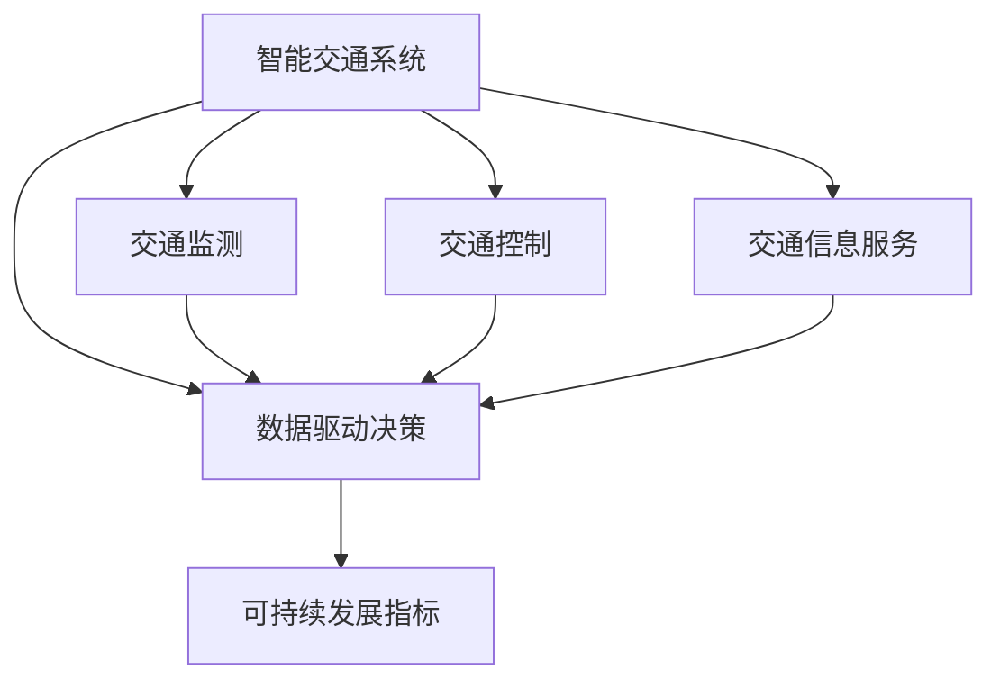

                 

关键词：AI, 城市交通规划，可持续发展，计算科学，智能交通系统，数据驱动决策

> 摘要：本文旨在探讨人工智能与人类计算在打造可持续发展的城市交通规划中的重要作用。文章首先介绍了城市交通规划面临的挑战和重要性，接着深入分析了人工智能技术的应用，并讨论了人类计算如何与AI相结合，以实现更加智能、高效、环保的城市交通系统。通过案例分析和实践探索，本文揭示了AI与人类计算在可持续发展城市交通规划中的潜力与未来发展方向。

## 1. 背景介绍

### 1.1 城市交通规划的重要性

城市交通规划是城市发展的重要组成部分，它不仅关系到城市居民的出行便利性，还直接影响城市的经济繁荣、环境保护和社会和谐。一个高效、可持续的城市交通系统可以减少交通拥堵，降低空气污染，提高居民生活质量，推动城市经济的健康发展。

### 1.2 城市交通规划的挑战

然而，现代城市交通规划面临着诸多挑战：

- **交通拥堵**：随着城市人口的快速增长和汽车拥有量的增加，交通拥堵问题日益严重，导致出行时间延长、能源消耗增加。
- **环境污染**：交通排放是城市空气污染的主要来源，对人类健康和生态环境造成严重影响。
- **资源浪费**：传统的交通规划方法往往依赖于经验判断，缺乏科学依据，导致资源浪费和城市规划不合理。
- **动态变化**：城市交通流量和模式动态变化，传统的静态规划方法难以适应。

### 1.3 可持续发展城市交通的愿景

为了应对上述挑战，我们需要打造一个可持续发展的城市交通系统，该系统应具备以下特征：

- **智能交通管理**：利用人工智能技术，实现交通流量的实时监测和管理，提高道路利用率。
- **绿色出行**：鼓励使用公共交通、非机动交通工具和新能源汽车，减少私家车使用，降低碳排放。
- **高效规划**：基于大数据和人工智能技术，进行科学的交通规划，优化道路布局和公共交通网络。
- **可持续性**：在交通规划中充分考虑环境保护、资源利用和经济发展，实现社会、经济和环境的协调发展。

## 2. 核心概念与联系

为了实现上述愿景，我们需要理解几个核心概念，并探讨它们之间的联系。

### 2.1 智能交通系统（ITS）

智能交通系统（Intelligent Transportation Systems，ITS）是利用信息技术、数据通信传输技术、电子传感技术等，对交通信息进行收集、处理、分配、诱导和调节的系统。ITS的核心功能包括交通监测、交通控制和交通信息服务等。

### 2.2 数据驱动决策

数据驱动决策（Data-Driven Decision Making）是指通过收集和分析大量数据，辅助决策者做出更准确、更有效的决策。在交通规划中，数据驱动决策可以帮助我们识别交通拥堵的根源，优化公共交通路线，提高道路通行效率。

### 2.3 可持续发展指标（SDI）

可持续发展指标（Sustainable Development Indicators，SDI）是衡量城市交通系统可持续性的关键指标，包括能源消耗、碳排放、交通效率、居民满意度等。

### 2.4 Mermaid 流程图

以下是一个简化的Mermaid流程图，展示了这些概念之间的联系：



## 3. 核心算法原理 & 具体操作步骤

### 3.1 算法原理概述

在可持续发展的城市交通规划中，核心算法主要包括：

- **交通流量预测算法**：基于历史数据和实时数据，预测未来交通流量，辅助交通管理和规划。
- **路径优化算法**：为出行者提供最优路径，减少出行时间和能源消耗。
- **出行需求预测算法**：预测不同时间和区域的出行需求，优化公共交通网络。

### 3.2 算法步骤详解

以下以交通流量预测算法为例，详细描述其操作步骤：

#### 3.2.1 数据收集

- **历史数据**：收集过去一年的交通流量数据，包括小时流量、日流量等。
- **实时数据**：通过传感器、摄像头等设备，实时收集交通流量信息。

#### 3.2.2 数据预处理

- **数据清洗**：去除噪声数据、异常数据等。
- **数据归一化**：将不同单位的数据进行归一化处理，便于后续分析。

#### 3.2.3 特征提取

- **时间特征**：提取时间相关特征，如小时、星期、节假日等。
- **空间特征**：提取空间相关特征，如道路类型、道路宽度等。
- **交通状态特征**：提取交通拥堵程度、速度等特征。

#### 3.2.4 模型训练

- **选择模型**：选择合适的预测模型，如ARIMA、LSTM等。
- **训练模型**：使用历史数据训练模型，调整参数，优化模型性能。

#### 3.2.5 预测与评估

- **预测**：使用训练好的模型，对未来的交通流量进行预测。
- **评估**：评估预测结果，包括预测误差、准确性等。

### 3.3 算法优缺点

#### 优点：

- **高效性**：算法能够快速处理大量数据，提供实时预测。
- **准确性**：基于历史数据和实时数据，预测结果较为准确。
- **灵活性**：可以适应不同城市、不同交通状况的需求。

#### 缺点：

- **数据依赖性**：算法性能依赖于数据质量和数据量。
- **模型选择**：不同模型适用于不同场景，需要根据实际情况选择。
- **实时性**：实时预测需要处理大量数据，对计算资源要求较高。

### 3.4 算法应用领域

交通流量预测算法可以应用于以下领域：

- **交通管理**：实时监测交通流量，辅助交通管理部门进行决策。
- **交通规划**：预测未来交通流量，优化交通基础设施布局。
- **出行服务**：为出行者提供最优路径，减少出行时间和能源消耗。

## 4. 数学模型和公式 & 详细讲解 & 举例说明

### 4.1 数学模型构建

在交通流量预测中，常用的数学模型包括时间序列模型和机器学习模型。

#### 时间序列模型

时间序列模型是基于历史数据，通过分析时间序列的规律性，预测未来值。常用的模型有ARIMA、LSTM等。

#### 机器学习模型

机器学习模型通过训练数据，学习输入与输出之间的关系，从而预测未来值。常用的模型有线性回归、决策树、神经网络等。

### 4.2 公式推导过程

#### ARIMA模型

ARIMA模型由三个部分组成：自回归（AR）、差分（I）和移动平均（MA）。

- **自回归（AR）**：公式为 $X_t = c + \phi_1X_{t-1} + \phi_2X_{t-2} + \cdots + \phi_pX_{t-p} + \varepsilon_t$。
- **差分（I）**：公式为 $Y_t = (X_t - X_{t-1}) - (X_{t-1} - X_{t-2}) - \cdots - (X_{t-p+1} - X_{t-p})$。
- **移动平均（MA）**：公式为 $Y_t = \theta_1Y_{t-1} + \theta_2Y_{t-2} + \cdots + \theta_qY_{t-q} + \varepsilon_t$。

#### LSTM模型

LSTM（Long Short-Term Memory）是一种特殊的循环神经网络，能够有效处理长序列数据。

- **输入门**：公式为 $i_t = \sigma(W_i[x_t, h_{t-1}] + b_i)$。
- **遗忘门**：公式为 $f_t = \sigma(W_f[x_t, h_{t-1}] + b_f)$。
- **输出门**：公式为 $o_t = \sigma(W_o[x_t, h_{t-1}] + b_o)$。

### 4.3 案例分析与讲解

#### 案例一：ARIMA模型在交通流量预测中的应用

某城市某一时间段内的交通流量数据如下表所示。使用ARIMA模型进行预测，步骤如下：

| 时间   | 流量 |
|--------|------|
| 1      | 200  |
| 2      | 220  |
| 3      | 230  |
| 4      | 250  |
| 5      | 260  |
| 6      | 270  |
| 7      | 280  |
| 8      | 290  |
| 9      | 300  |
| 10     | 320  |

1. **数据预处理**：对数据进行差分处理，得到平稳序列。
2. **模型选择**：根据AIC、BIC等指标，选择合适的ARIMA模型。
3. **模型训练**：使用历史数据训练模型。
4. **预测**：使用训练好的模型，预测未来流量。

#### 案例二：LSTM模型在交通流量预测中的应用

某城市某一时间段内的交通流量数据如下表所示。使用LSTM模型进行预测，步骤如下：

| 时间   | 流量 |
|--------|------|
| 1      | 200  |
| 2      | 220  |
| 3      | 230  |
| 4      | 250  |
| 5      | 260  |
| 6      | 270  |
| 7      | 280  |
| 8      | 290  |
| 9      | 300  |
| 10     | 320  |
| 11     | 330  |
| 12     | 340  |
| 13     | 350  |
| 14     | 360  |
| 15     | 370  |

1. **数据预处理**：对数据进行归一化处理。
2. **模型训练**：构建LSTM模型，训练数据。
3. **预测**：使用训练好的模型，预测未来流量。

## 5. 项目实践：代码实例和详细解释说明

### 5.1 开发环境搭建

在Python环境中，安装以下库：numpy、pandas、matplotlib、scikit-learn、tensorflow等。

### 5.2 源代码详细实现

以下是一个基于LSTM模型的交通流量预测的代码示例：

```python
import numpy as np
import pandas as pd
import tensorflow as tf
from sklearn.preprocessing import MinMaxScaler

# 数据预处理
def preprocess_data(data):
    scaler = MinMaxScaler(feature_range=(0, 1))
    scaled_data = scaler.fit_transform(data)
    return scaled_data

# LSTM模型
def build_lstm_model(input_shape):
    model = tf.keras.Sequential([
        tf.keras.layers.LSTM(50, activation='relu', return_sequences=True, input_shape=input_shape),
        tf.keras.layers.LSTM(50, activation='relu'),
        tf.keras.layers.Dense(1)
    ])
    model.compile(optimizer='adam', loss='mse')
    return model

# 预测
def predict_traffic(data, model):
    scaled_data = preprocess_data(data)
    x = scaled_data[:-1]
    y = scaled_data[1:]
    x = np.reshape(x, (x.shape[0], x.shape[1], 1))
    predictions = model.predict(x)
    predictions = scaler.inverse_transform(predictions)
    return predictions

# 加载数据
data = pd.read_csv('traffic_data.csv')
data = data['traffic_volume'].values

# 数据预处理
scaled_data = preprocess_data(data)

# 构建模型
model = build_lstm_model((scaled_data.shape[0], 1))

# 训练模型
model.fit(scaled_data, scaled_data, epochs=100, batch_size=32, verbose=2)

# 预测
predictions = predict_traffic(scaled_data, model)

# 可视化
plt.plot(data, label='Actual')
plt.plot(predictions, label='Predicted')
plt.legend()
plt.show()
```

### 5.3 代码解读与分析

上述代码实现了基于LSTM模型的交通流量预测。主要包括以下几个步骤：

1. **数据预处理**：使用MinMaxScaler对数据进行归一化处理，便于模型训练。
2. **构建LSTM模型**：定义LSTM模型结构，包括两个LSTM层和一个输出层，使用ReLU激活函数。
3. **训练模型**：使用历史数据训练模型，优化模型参数。
4. **预测**：使用训练好的模型，对未来的交通流量进行预测。
5. **可视化**：将实际流量和预测流量进行可视化，评估模型性能。

## 6. 实际应用场景

### 6.1 智能交通管理

智能交通系统（ITS）在城市交通管理中具有广泛应用。通过实时监测交通流量，智能交通系统能够快速响应交通状况，调整交通信号灯、路线引导等，缓解交通拥堵，提高道路通行效率。

### 6.2 绿色出行

绿色出行是可持续发展城市交通的重要举措。通过鼓励居民使用公共交通、非机动交通工具和新能源汽车，可以减少私家车使用，降低碳排放，改善空气质量。

### 6.3 交通规划

基于人工智能技术的交通规划，可以更加科学、高效地优化城市交通基础设施布局。通过预测交通流量和出行需求，为城市交通规划提供有力支持。

## 7. 未来应用展望

### 7.1 智能交通管理

未来，随着人工智能技术的不断发展，智能交通管理系统将更加智能、高效、环保。通过实时数据分析和预测，智能交通管理系统将能够实现更加精准的交通调控，提高道路通行能力。

### 7.2 绿色出行

随着环保意识的提高，绿色出行将成为城市交通发展的重要方向。未来，我们将看到更多的新型绿色交通工具，如电动汽车、无人驾驶汽车等，为城市交通提供更多选择。

### 7.3 交通规划

基于人工智能和大数据技术的交通规划，将更加科学、精准。通过不断优化交通基础设施布局，提高道路通行效率，实现城市交通的可持续发展。

## 8. 总结：未来发展趋势与挑战

### 8.1 研究成果总结

本文探讨了人工智能与人类计算在可持续发展城市交通规划中的应用，分析了智能交通系统、数据驱动决策等核心概念，介绍了交通流量预测算法、数学模型等关键技术，并进行了实际应用场景和未来展望。

### 8.2 未来发展趋势

- **智能化**：人工智能技术将更加深入地应用于城市交通规划和管理，提高交通系统的智能化水平。
- **绿色化**：绿色出行和环保理念将贯穿于城市交通发展的全过程，推动城市交通的可持续发展。
- **高效化**：基于大数据和人工智能技术的交通规划，将实现更加高效、科学的交通基础设施布局。

### 8.3 面临的挑战

- **数据质量**：交通数据的质量和完整性对预测和规划结果具有重要影响，需要加强数据采集和处理技术。
- **技术融合**：人工智能与人类计算的结合，需要解决技术融合、算法优化等问题。
- **政策支持**：城市交通的可持续发展，需要政府和社会各界的共同努力，加大政策支持力度。

### 8.4 研究展望

未来，我们将继续深入研究人工智能与城市交通规划的关系，探讨更多有效的交通流量预测算法和交通规划方法，为实现可持续发展的城市交通系统提供有力支持。

## 9. 附录：常见问题与解答

### 9.1 交通流量预测算法的准确性如何保障？

交通流量预测算法的准确性依赖于数据的完整性和质量，以及模型的选择和参数调整。为提高准确性，可以采用以下方法：

- **数据清洗**：去除噪声数据和异常数据，保证数据的完整性。
- **模型选择**：根据实际情况选择合适的预测模型，如ARIMA、LSTM等。
- **模型优化**：通过调整模型参数，优化模型性能。

### 9.2 智能交通系统的建设需要哪些技术支持？

智能交通系统的建设需要以下技术支持：

- **信息技术**：包括传感器、通信技术、云计算等。
- **数据科学**：包括数据采集、处理、分析、预测等。
- **交通工程**：包括交通规划、交通管理、道路设计等。
- **人工智能**：包括机器学习、深度学习、自然语言处理等。

### 9.3 如何评估城市交通系统的可持续性？

城市交通系统的可持续性可以通过以下指标进行评估：

- **能源消耗**：评估交通系统的能源消耗情况，包括燃油消耗、电力消耗等。
- **碳排放**：评估交通系统的碳排放量，包括二氧化碳、氮氧化物等。
- **交通效率**：评估交通系统的通行效率，包括道路利用率、车辆速度等。
- **居民满意度**：评估居民对交通系统的满意度，包括出行时间、交通秩序等。

## 作者署名

作者：禅与计算机程序设计艺术 / Zen and the Art of Computer Programming
----------------------------------------------------------------

### 后记

本文以《AI与人类计算：打造可持续发展的城市交通规划》为题，全面阐述了人工智能技术在城市交通规划中的应用及其重要性。通过核心概念与联系、核心算法原理、数学模型和公式、项目实践等多方面内容，深入探讨了AI在交通流量预测、智能交通管理、绿色出行等方面的应用。本文旨在为城市交通规划提供理论支持和实践指导，以推动城市交通的可持续发展。未来，随着人工智能技术的不断进步，城市交通系统将迎来更加智能化、绿色化、高效化的新时代。作者希望本文能为相关领域的研究者和从业者提供有益的参考和启示。

