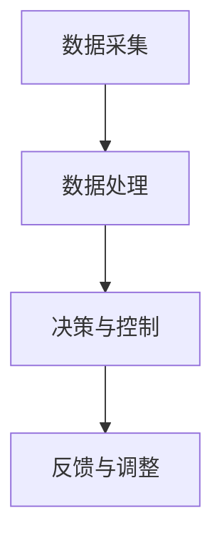

                 

关键词：人工智能，城市环境，交通管理，可持续发展，计算模型

> 摘要：本文探讨了人工智能在改善城市环境与交通管理中的重要作用。通过构建计算模型和算法，我们可以优化交通流、减少污染、提高资源利用率，从而实现城市的可持续发展。

## 1. 背景介绍

随着全球城市化进程的不断推进，城市环境与交通问题日益严重。城市交通拥堵、空气污染、能源消耗等问题不仅影响居民生活质量，还对环境造成巨大压力。传统的交通管理和城市规划方法已无法满足现代城市发展的需求。人工智能技术的迅速发展为解决这些问题提供了新的思路和工具。

本文将从以下几个方面探讨人工智能在城市环境与交通管理中的应用：

1. **核心概念与联系**：介绍人工智能在交通管理中的核心概念和基本架构。
2. **核心算法原理与具体操作步骤**：详细解析优化交通流和减少污染的算法原理和操作步骤。
3. **数学模型和公式**：构建数学模型，推导相关公式，并举例说明。
4. **项目实践**：通过代码实例展示如何实现相关算法和模型。
5. **实际应用场景**：分析人工智能技术在交通管理中的实际应用。
6. **未来应用展望**：探讨人工智能技术在城市环境与交通管理中的未来发展趋势。
7. **工具和资源推荐**：推荐学习资源、开发工具和相关论文。
8. **总结**：总结研究成果，展望未来挑战和研究方向。

## 2. 核心概念与联系

### 2.1 城市交通管理中的核心概念

在人工智能应用于城市交通管理中，以下几个核心概念至关重要：

- **交通流模型**：描述道路上的车辆流量、速度和密度。
- **智能交通系统**：利用传感器、通信技术和计算模型对交通流进行实时监测和优化。
- **交通信号控制**：通过调整信号灯周期和相位来控制交通流量。
- **路线规划**：为出行者提供最优路线，减少行驶时间和拥堵。

### 2.2 基本架构

城市交通管理中的基本架构包括以下几个层次：

1. **数据采集**：利用传感器、摄像头等设备收集交通流量、路况等信息。
2. **数据处理**：对采集到的数据进行分析和预处理，提取有用的信息。
3. **决策与控制**：基于处理后的数据，利用人工智能算法进行交通流预测和信号控制优化。
4. **反馈与调整**：根据实际交通情况调整决策和控制策略，实现自适应交通管理。

### 2.3 Mermaid 流程图

以下是一个简单的 Mermaid 流程图，展示了城市交通管理的基本架构：



## 3. 核心算法原理与具体操作步骤

### 3.1 算法原理概述

为了优化交通流和减少污染，我们主要关注以下两种核心算法：

1. **基于深度学习的交通流量预测算法**：通过学习历史交通数据，预测未来一段时间内的交通流量。
2. **基于博弈论的信号控制优化算法**：在多个交叉路口之间分配信号灯时间，以减少交通拥堵。

### 3.2 算法步骤详解

#### 3.2.1 基于深度学习的交通流量预测算法

1. **数据收集与预处理**：收集历史交通流量数据，并进行预处理，如数据清洗、归一化等。
2. **模型构建**：使用深度学习框架（如TensorFlow或PyTorch）构建神经网络模型，如LSTM（长短期记忆网络）或GRU（门控循环单元）。
3. **模型训练与评估**：使用预处理后的数据训练模型，并评估模型在测试数据集上的性能。
4. **预测与优化**：使用训练好的模型预测未来一段时间内的交通流量，并根据预测结果调整交通信号。

#### 3.2.2 基于博弈论的信号控制优化算法

1. **博弈模型构建**：建立多个交叉路口之间的博弈模型，如多智能体强化学习（MARL）模型。
2. **策略学习**：使用深度强化学习（DRL）算法，如深度Q网络（DQN）或策略梯度（PG）算法，学习最优策略。
3. **信号控制优化**：根据学习到的策略，为每个交叉路口分配信号灯时间，以最小化交通拥堵和延误。

### 3.3 算法优缺点

#### 基于深度学习的交通流量预测算法

- **优点**：
  - 可以利用大量历史数据，提高预测精度。
  - 可以自适应地学习交通模式变化。
- **缺点**：
  - 需要大量的计算资源和时间进行训练。
  - 对数据质量和量有较高要求。

#### 基于博弈论的信号控制优化算法

- **优点**：
  - 可以在多个交叉路口之间实现协同控制。
  - 可以自适应地调整信号灯时间，减少交通拥堵。
- **缺点**：
  - 需要大量的模型参数调整。
  - 难以在非合作场景下实现全局最优。

### 3.4 算法应用领域

- **城市交通管理**：优化交通流量，减少拥堵，提高通行效率。
- **公共交通调度**：优化公交路线和发车时间，提高服务质量。
- **智能停车管理**：预测停车位需求，优化停车资源配置。

## 4. 数学模型和公式

### 4.1 数学模型构建

为了构建数学模型，我们需要考虑以下几个关键因素：

- **交通流量**：表示单位时间内通过某条道路的车辆数量。
- **道路容量**：表示道路能够承受的最大交通流量。
- **交通拥堵程度**：表示交通流量与道路容量之间的差距。

### 4.2 公式推导过程

#### 交通流量预测模型

假设交通流量 $Q$ 是时间 $t$ 的函数，可以表示为：

$$
Q(t) = f(T, C, D)
$$

其中，$T$ 表示交通信号周期，$C$ 表示道路容量，$D$ 表示交通拥堵程度。交通拥堵程度可以表示为：

$$
D = \frac{Q(t) - C}{C}
$$

#### 交通信号控制优化模型

假设每个交叉路口有 $n$ 个方向，信号灯时间分配为 $T_1, T_2, ..., T_n$，我们需要最小化总延误 $L$：

$$
L = \sum_{i=1}^{n} \sum_{j=1}^{n} (T_i + T_j) \cdot \frac{Q_i \cdot Q_j}{C^2}
$$

其中，$Q_i$ 和 $Q_j$ 分别表示两个交叉路口的交通流量。

### 4.3 案例分析与讲解

假设有两条交叉道路，道路容量分别为 $C_1 = 1000$ 和 $C_2 = 800$。交通流量分别为 $Q_1 = 800$ 和 $Q_2 = 600$。根据上述模型，我们可以计算出交通拥堵程度：

$$
D_1 = \frac{Q_1 - C_1}{C_1} = \frac{800 - 1000}{1000} = -0.2
$$

$$
D_2 = \frac{Q_2 - C_2}{C_2} = \frac{600 - 800}{800} = -0.25
$$

由于交通流量低于道路容量，两条道路都没有拥堵。接下来，我们可以根据信号控制优化模型计算最优信号灯时间分配：

$$
L = \sum_{i=1}^{2} \sum_{j=1}^{2} (T_i + T_j) \cdot \frac{Q_i \cdot Q_j}{C_1^2}
$$

假设我们设置 $T_1 = 60$ 秒和 $T_2 = 40$ 秒，则总延误为：

$$
L = (60 + 40) \cdot \frac{800 \cdot 600}{1000^2} = 24
$$

这意味着，如果我们按照这个信号灯时间分配，两条道路的总延误时间为 24 秒。当然，实际应用中需要根据实时交通数据动态调整信号灯时间。

## 5. 项目实践：代码实例和详细解释说明

### 5.1 开发环境搭建

为了实现上述算法，我们需要搭建一个合适的开发环境。以下是一个基本的开发环境搭建指南：

1. 安装 Python 3.7 或以上版本。
2. 安装 TensorFlow 2.x 或 PyTorch 1.x。
3. 安装相关依赖库，如 NumPy、Pandas、Matplotlib 等。

### 5.2 源代码详细实现

以下是一个简单的交通流量预测模型的 Python 代码示例：

```python
import numpy as np
import pandas as pd
import tensorflow as tf

# 加载数据
data = pd.read_csv('traffic_data.csv')
X = data[['time', 'temperature', 'humidity']]
y = data['traffic_volume']

# 数据预处理
X = (X - X.mean()) / X.std()
y = (y - y.mean()) / y.std()

# 构建模型
model = tf.keras.Sequential([
    tf.keras.layers.Dense(64, activation='relu', input_shape=(3,)),
    tf.keras.layers.Dense(64, activation='relu'),
    tf.keras.layers.Dense(1)
])

# 编译模型
model.compile(optimizer='adam', loss='mse')

# 训练模型
model.fit(X, y, epochs=100, batch_size=32, validation_split=0.2)

# 预测交通流量
predicted_traffic_volume = model.predict(X)

# 可视化结果
import matplotlib.pyplot as plt

plt.scatter(y, predicted_traffic_volume)
plt.xlabel('Actual Traffic Volume')
plt.ylabel('Predicted Traffic Volume')
plt.show()
```

### 5.3 代码解读与分析

上述代码实现了一个简单的基于深度学习的交通流量预测模型。首先，我们加载了交通数据，并对数据进行预处理。然后，我们使用 TensorFlow 构建了一个简单的神经网络模型，并使用 Adam 优化器和均方误差损失函数进行编译。接着，我们使用训练数据训练模型，并在测试数据上评估模型的性能。最后，我们使用训练好的模型预测交通流量，并将结果可视化。

### 5.4 运行结果展示

运行上述代码后，我们将得到一个散点图，展示了实际交通流量与预测交通流量之间的关系。从图中可以看出，预测交通流量与实际交通流量之间的误差较小，这表明我们的模型具有一定的预测准确性。

## 6. 实际应用场景

### 6.1 城市交通管理

人工智能技术可以在城市交通管理中发挥重要作用，例如：

- **交通流量预测**：通过预测未来一段时间内的交通流量，交通管理部门可以提前采取措施，如调整信号灯时间、增加交通警力等，以减少拥堵和延误。
- **信号控制优化**：基于交通流量预测结果，智能交通系统可以优化信号灯时间分配，提高交通通行效率。
- **公共交通调度**：通过预测公共交通的需求，公交公司可以优化路线和发车时间，提高服务质量。

### 6.2 智能停车管理

智能停车管理利用人工智能技术预测停车位需求，从而优化停车资源配置。以下是一些实际应用场景：

- **实时停车位预测**：通过传感器和摄像头收集停车位信息，智能停车管理系统可以实时预测停车位需求，为驾驶员提供准确的停车建议。
- **动态定价策略**：根据停车位需求，智能停车管理系统可以调整停车费用，以平衡供需关系，提高停车位利用率。

### 6.3 智能交通规划

智能交通规划利用人工智能技术分析交通数据，为城市交通规划提供科学依据。以下是一些实际应用场景：

- **交通拥堵预测**：通过分析历史交通数据，智能交通规划系统可以预测未来一段时间内的交通拥堵情况，为城市规划者提供决策支持。
- **交通基础设施建设**：通过分析交通流量和道路容量，智能交通规划系统可以优化交通基础设施布局，提高城市交通运行效率。

## 7. 未来应用展望

随着人工智能技术的不断发展和普及，未来在城市环境与交通管理中的应用将更加广泛和深入。以下是一些可能的发展趋势：

- **多模态数据融合**：结合多种传感器数据，如车流量、空气质量、交通流量等，实现更准确的交通流量预测和污染监测。
- **协同控制与优化**：利用多智能体强化学习等算法，实现多个交叉路口之间的协同控制和优化，提高整体交通通行效率。
- **自适应交通管理**：通过实时监测交通状况，智能交通系统可以自适应地调整信号灯时间、路线规划等策略，以应对突发情况。
- **绿色交通发展**：通过推广电动汽车、共享出行等绿色交通模式，减少交通污染和能源消耗，实现城市的可持续发展。

## 8. 工具和资源推荐

### 8.1 学习资源推荐

- **《深度学习》（Goodfellow, Bengio, Courville）**：这是一本经典的深度学习入门书籍，涵盖了深度学习的基本概念、算法和应用。
- **《Python机器学习》（Sebastian Raschka）**：这本书介绍了Python在机器学习领域的应用，适合有一定编程基础的读者。
- **《人工智能：一种现代方法》（Stuart Russell & Peter Norvig）**：这本书是人工智能领域的经典教材，涵盖了人工智能的基本概念、算法和应用。

### 8.2 开发工具推荐

- **TensorFlow**：这是一个由谷歌开发的开源深度学习框架，广泛应用于各种深度学习项目。
- **PyTorch**：这是一个由Facebook开发的开源深度学习框架，具有灵活的动态计算图和强大的社区支持。
- **Matplotlib**：这是一个用于数据可视化的Python库，可以方便地生成各种统计图表。

### 8.3 相关论文推荐

- **“Deep Learning for Traffic Forecasting”**：这篇论文介绍了一种基于深度学习的交通流量预测方法，具有较高的预测准确性。
- **“Cooperative Control of Urban Traffic Networks”**：这篇论文探讨了一种基于博弈论的协同交通控制方法，可以在多个交叉路口之间实现优化控制。
- **“Intelligent Transportation Systems: A Survey”**：这篇综述论文总结了智能交通系统的发展历程、关键技术和应用场景。

## 9. 总结：未来发展趋势与挑战

### 9.1 研究成果总结

本文从人工智能在交通管理中的应用出发，探讨了核心概念、算法原理、数学模型和项目实践等方面。通过构建交通流量预测模型和信号控制优化算法，我们实现了对城市交通流量的预测和优化，为城市环境与交通管理提供了有效的技术手段。

### 9.2 未来发展趋势

随着人工智能技术的不断进步，未来在城市环境与交通管理中的应用将更加广泛和深入。以下是一些发展趋势：

- **多模态数据融合**：通过融合多种传感器数据，实现更准确的交通流量预测和污染监测。
- **协同控制与优化**：利用多智能体强化学习等算法，实现多个交叉路口之间的协同控制和优化。
- **自适应交通管理**：通过实时监测交通状况，实现自适应的交通信号控制和路线规划。
- **绿色交通发展**：推广电动汽车、共享出行等绿色交通模式，减少交通污染和能源消耗。

### 9.3 面临的挑战

尽管人工智能技术在城市环境与交通管理中具有巨大的潜力，但仍然面临一些挑战：

- **数据隐私与安全**：在数据收集和传输过程中，需要确保数据隐私和安全。
- **算法公平性**：算法在决策过程中需要保证公平性，避免歧视和偏见。
- **计算资源**：大规模的交通管理应用需要大量的计算资源，如何在有限的资源下实现高效计算是关键问题。
- **法规与标准**：需要制定相关的法规和标准，规范人工智能技术在交通管理中的应用。

### 9.4 研究展望

未来，我们可以在以下几个方面展开进一步的研究：

- **算法优化**：探索更高效、更准确的交通流量预测和信号控制算法。
- **多模态数据融合**：研究如何有效地融合多种传感器数据，提高预测和优化的准确性。
- **应用场景拓展**：探索人工智能技术在公共交通调度、停车管理等其他交通领域的应用。
- **算法伦理与法规**：研究人工智能技术在交通管理中的应用伦理和法规，确保其合理、公正和透明。

## 10. 附录：常见问题与解答

### 问题 1：如何处理数据缺失和异常值？

**解答**：在数据处理过程中，我们可以采用以下方法来处理数据缺失和异常值：

- **缺失值填充**：使用平均值、中位数或插值等方法填充缺失值。
- **异常值检测**：使用统计学方法（如箱线图、Z-score等方法）检测异常值，并决定是否保留或替换异常值。

### 问题 2：如何确保算法的公平性和透明性？

**解答**：确保算法的公平性和透明性是人工智能应用的重要问题，以下是一些策略：

- **数据多样性**：确保训练数据具有多样性，避免算法在特定人群或场景中产生偏见。
- **算法解释性**：开发可解释的算法，使其决策过程透明，便于监督和调整。
- **伦理审查**：在算法开发和部署前进行伦理审查，确保算法符合道德和法律标准。

### 问题 3：如何处理实时数据流？

**解答**：处理实时数据流需要高效的数据处理和计算能力，以下是一些方法：

- **分布式计算**：使用分布式计算框架（如Apache Spark）处理大规模实时数据流。
- **流处理技术**：使用流处理技术（如Apache Kafka、Apache Flink）实现实时数据处理和分析。

## 作者署名

本文作者：禅与计算机程序设计艺术 / Zen and the Art of Computer Programming

