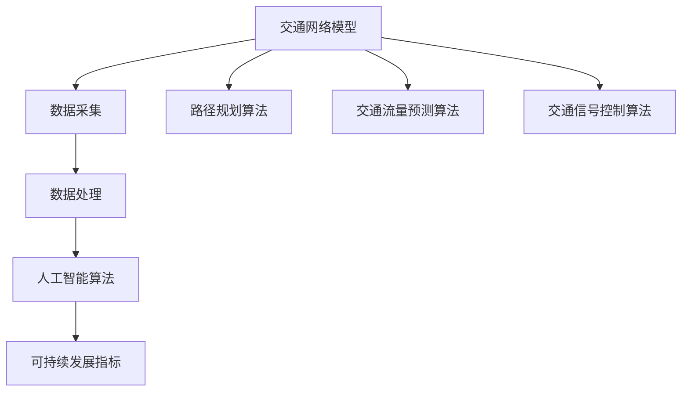

                 

关键词：人工智能、可持续发展、城市环境、交通管理、算法、数学模型

> 摘要：本文将探讨人工智能在可持续发展的城市环境与交通管理中的应用，分析核心概念和算法原理，并结合具体案例和数学模型，探讨实际应用场景和未来发展趋势。通过这篇文章，我们希望读者能够理解人工智能如何助力城市环境与交通的可持续发展，并对其未来应用充满期待。

## 1. 背景介绍

随着全球人口的增长和城市化进程的加速，城市环境与交通问题日益凸显。交通拥堵、空气质量下降、资源浪费等问题严重影响了城市居民的生活质量和环境健康。传统的方法已经无法满足现代城市对交通和环境的高要求，因此，人工智能作为一项重要的技术工具，成为了解决这些问题的有力手段。

近年来，人工智能技术在城市环境与交通管理中得到了广泛应用。通过数据采集、分析、预测和优化，人工智能可以有效提升交通效率，减少能源消耗，改善空气质量，促进可持续发展。本文将重点探讨以下内容：

1. 人工智能在城市环境与交通管理中的应用领域；
2. 核心概念与联系，包括交通网络模型、数据采集和处理方法等；
3. 核心算法原理，如路径规划算法、交通流量预测算法等；
4. 数学模型和公式的构建与应用；
5. 实际应用案例及运行结果展示；
6. 未来发展趋势与面临的挑战；
7. 相关工具和资源的推荐。

## 2. 核心概念与联系

为了深入探讨人工智能在可持续发展城市环境与交通管理中的应用，我们需要了解一些核心概念和它们之间的联系。

### 2.1 交通网络模型

交通网络模型是城市环境与交通管理的基础。它描述了道路、车辆、行人等交通元素的相互关系，并为算法提供数据支持。常见的交通网络模型包括图论模型、网格模型等。

### 2.2 数据采集和处理方法

数据采集是交通网络模型建立的前提。通过传感器、摄像头、GPS等技术手段，我们可以获取道路上的车辆流量、速度、位置等实时数据。数据采集后，需要进行处理和清洗，以便为算法提供高质量的数据输入。

### 2.3 人工智能算法

人工智能算法是城市环境与交通管理的关键。常见的算法包括路径规划算法、交通流量预测算法、交通信号控制算法等。这些算法通过对数据的分析、建模和优化，实现交通流量的合理分配和调节。

### 2.4 可持续发展指标

可持续发展指标是评价城市环境与交通管理效果的重要标准。常见的指标包括能源消耗、碳排放、空气质量、居民满意度等。通过对比分析，我们可以评估人工智能技术在改善城市环境与交通方面的成效。

### 2.5 Mermaid 流程图

为了更好地展示核心概念和联系，我们使用 Mermaid 流程图进行描述：



## 3. 核心算法原理 & 具体操作步骤

### 3.1 算法原理概述

在人工智能技术的支持下，城市环境与交通管理中的核心算法主要包括路径规划算法、交通流量预测算法和交通信号控制算法。这些算法通过对数据的分析、建模和优化，实现交通流量的合理分配和调节。

### 3.2 算法步骤详解

#### 3.2.1 路径规划算法

路径规划算法的主要目标是找到从起点到终点的最佳路径。常见的算法包括 Dijkstra 算法、A* 算法等。以下是 Dijkstra 算法的基本步骤：

1. 初始化：设置起点为当前节点，终点为未访问节点；
2. 优先级队列：将未访问节点按照距离起点的距离进行排序；
3. 循环：依次从优先级队列中取出距离起点的最小节点，更新其邻居节点的距离；
4. 结束条件：当终点被访问时，算法结束。

#### 3.2.2 交通流量预测算法

交通流量预测算法的目标是预测未来一段时间内的交通流量。常见的算法包括时间序列模型、回归模型等。以下是时间序列模型的基本步骤：

1. 数据收集：收集历史交通流量数据；
2. 数据预处理：对数据进行清洗、去噪等处理；
3. 模型构建：根据数据特点选择合适的模型，如 ARIMA 模型、LSTM 模型等；
4. 模型训练：使用历史数据对模型进行训练；
5. 预测：使用训练好的模型对未来交通流量进行预测。

#### 3.2.3 交通信号控制算法

交通信号控制算法的目标是优化交通信号灯的配时方案，提高交通效率和安全性。常见的算法包括动态信号控制算法、协同控制算法等。以下是动态信号控制算法的基本步骤：

1. 数据采集：采集道路上的车辆流量、速度、位置等数据；
2. 模型构建：根据道路特点和交通流量数据，选择合适的模型，如基于博弈理论的模型、基于优化的模型等；
3. 模型训练：使用历史数据对模型进行训练；
4. 配时优化：根据实时交通数据，使用训练好的模型优化交通信号灯的配时方案；
5. 实时调整：根据实时交通数据，动态调整交通信号灯的配时方案。

### 3.3 算法优缺点

#### 路径规划算法

**优点**：

1. 算法简单，易于实现；
2. 可以找到从起点到终点的最佳路径。

**缺点**：

1. 对道路状况的依赖性较高；
2. 无法实时调整路径。

#### 交通流量预测算法

**优点**：

1. 可以预测未来一段时间内的交通流量；
2. 提高交通信号控制的效果。

**缺点**：

1. 预测精度受到历史数据质量和模型选择的影响；
2. 无法实时调整交通流量。

#### 交通信号控制算法

**优点**：

1. 可以优化交通信号灯的配时方案，提高交通效率和安全性；
2. 可以实时调整交通信号灯的配时方案。

**缺点**：

1. 对道路状况和交通流量数据的依赖性较高；
2. 需要较高的计算资源和算法优化。

### 3.4 算法应用领域

路径规划算法、交通流量预测算法和交通信号控制算法在以下领域具有广泛的应用：

1. 城市交通规划与管理；
2. 智能交通系统；
3. 绿色交通；
4. 无人驾驶。

## 4. 数学模型和公式 & 详细讲解 & 举例说明

### 4.1 数学模型构建

在人工智能技术的支持下，城市环境与交通管理中的数学模型主要包括路径规划模型、交通流量预测模型和交通信号控制模型。以下分别介绍这些模型的构建方法和公式。

#### 4.1.1 路径规划模型

路径规划模型的主要目标是找到从起点到终点的最佳路径。其基本公式为：

$$
d(s,t) = \min_{s'\in S} d(s,s') + w(s',t)
$$

其中，$d(s,t)$ 表示从起点 $s$ 到终点 $t$ 的距离，$d(s,s')$ 表示从起点 $s$ 到中间点 $s'$ 的距离，$w(s',t)$ 表示从中间点 $s'$ 到终点 $t$ 的权重。

#### 4.1.2 交通流量预测模型

交通流量预测模型的主要目标是预测未来一段时间内的交通流量。其基本公式为：

$$
q(t) = f(t, q(t-1), q(t-2), ..., q(t-n))
$$

其中，$q(t)$ 表示在时间 $t$ 的交通流量，$f(t, q(t-1), q(t-2), ..., q(t-n))$ 表示交通流量预测函数。

#### 4.1.3 交通信号控制模型

交通信号控制模型的主要目标是优化交通信号灯的配时方案。其基本公式为：

$$
C(t) = \min_{t'\in T} \sum_{i=1}^{n} w_i \cdot f_i(t')
$$

其中，$C(t)$ 表示在时间 $t$ 的交通信号灯配时方案，$T$ 表示时间 $t$ 的候选时间段，$w_i$ 表示第 $i$ 个交通信号灯的权重，$f_i(t')$ 表示在时间段 $t'$ 内第 $i$ 个交通信号灯的流量。

### 4.2 公式推导过程

以下分别介绍路径规划模型、交通流量预测模型和交通信号控制模型的公式推导过程。

#### 4.2.1 路径规划模型

路径规划模型的推导基于图论中的最短路径算法。假设有一个加权图 $G=(V,E)$，其中 $V$ 表示节点集合，$E$ 表示边集合。对于每一条边 $(u,v) \in E$，定义其权重 $w(u,v)$ 表示从节点 $u$ 到节点 $v$ 的距离。路径规划模型的目标是找到从起点 $s$ 到终点 $t$ 的最短路径。

首先，定义一个集合 $S$ 表示已访问节点，初始时 $S=\{s\}$。接下来，定义一个优先级队列 $Q$，用于存储未访问节点，初始时 $Q=\{t\}$。队列中的节点按照距离起点的距离进行排序。

在每次迭代中，从队列 $Q$ 中取出距离起点的最小节点 $u$，并将其从队列中删除，加入到集合 $S$ 中。然后，更新其邻居节点 $v$ 的距离。具体地，对于每个邻居节点 $v$，计算从起点 $s$ 到节点 $v$ 的距离 $d(s,v)$，并与当前已知的从起点 $s$ 到节点 $v$ 的距离 $d(s,v)$ 进行比较。如果 $d(s,v) < d(s,v)$，则更新 $d(s,v)$。

当终点 $t$ 被访问时，算法结束。此时，从起点 $s$ 到终点 $t$ 的最短路径即为所求。

#### 4.2.2 交通流量预测模型

交通流量预测模型的推导基于时间序列分析。假设有一组历史交通流量数据 $q(t)$，其中 $t$ 表示时间。交通流量预测模型的目标是找到一个函数 $f(t, q(t-1), q(t-2), ..., q(t-n))$，使得预测的交通流量 $q(t)$ 与实际交通流量 $q(t)$ 之间的误差最小。

一种常见的时间序列模型是 ARIMA 模型，其公式为：

$$
q(t) = \varphi_1 q(t-1) + \varphi_2 q(t-2) + ... + \varphi_p q(t-p) + \theta_1 e(t-1) + \theta_2 e(t-2) + ... + \theta_q e(t-q)
$$

其中，$p$ 和 $q$ 分别表示自回归项和移动平均项的阶数，$\varphi_1, \varphi_2, ..., \varphi_p$ 和 $\theta_1, \theta_2, ..., \theta_q$ 分别表示自回归项和移动平均项的系数，$e(t)$ 表示白噪声项。

为了确定 $p$ 和 $q$ 的值，可以使用 ACF（自相关函数）和 PACF（部分自相关函数）进行分析。具体步骤如下：

1. 计算 $q(t)$ 的 ACF 和 PACF；
2. 根据 ACF 和 PACF 的特征，选择合适的 $p$ 和 $q$；
3. 使用最小二乘法求解 $\varphi_1, \varphi_2, ..., \varphi_p$ 和 $\theta_1, \theta_2, ..., \theta_q$ 的值。

#### 4.2.3 交通信号控制模型

交通信号控制模型的推导基于博弈论和优化理论。假设有一个交叉路口，其中包含 $n$ 个交通信号灯，分别表示为 $i=1,2,...,n$。每个交通信号灯都有两个状态：红灯和绿灯。交通信号控制模型的目标是找到一个最优的配时方案 $C(t)$，使得交通效率最高。

首先，定义交通信号灯 $i$ 在时间段 $t$ 的流量为 $f_i(t)$。然后，定义交通信号灯 $i$ 在时间段 $t$ 的权重为 $w_i$。根据博弈论，每个交通信号灯都会选择一个时间段 $t'$，使得自身的流量最小。

具体地，对于每个交通信号灯 $i$，定义其流量函数为：

$$
f_i(t') = \sum_{j=1}^{n} w_j \cdot f_j(t')
$$

其中，$f_j(t')$ 表示交通信号灯 $j$ 在时间段 $t'$ 的流量。交通信号控制模型的目标是最小化所有交通信号灯的流量之和，即：

$$
C(t) = \min_{t'\in T} \sum_{i=1}^{n} w_i \cdot f_i(t')
$$

为了求解该优化问题，可以使用遗传算法、粒子群算法等优化算法。具体步骤如下：

1. 初始化种群，即一组时间段的配时方案；
2. 计算每个个体的适应度值，即交通信号灯的流量之和；
3. 对种群进行选择、交叉、变异等操作，产生新的种群；
4. 重复步骤 2 和 3，直到满足终止条件。

### 4.3 案例分析与讲解

以下以一个简单的案例来说明数学模型的应用。

#### 4.3.1 路径规划模型

假设有一个包含 5 个节点的交通网络，其中每条边的权重如下表所示：

| 节点 | 起点 | 终点 | 权重 |
|------|------|------|------|
| 1    | 1    | 2    | 3    |
| 1    | 1    | 3    | 4    |
| 2    | 2    | 3    | 2    |
| 2    | 2    | 4    | 6    |
| 3    | 3    | 4    | 1    |
| 4    | 4    | 5    | 4    |
| 5    | 5    | 4    | 2    |

现在需要找到从节点 1 到节点 5 的最短路径。

使用 Dijkstra 算法进行计算，步骤如下：

1. 初始化：设置起点为节点 1，终点为节点 5，优先级队列 $Q=\{2,3,4,5\}$；
2. 从队列中取出节点 2，更新其邻居节点的距离：$d(2,1)=3, d(3,1)=4, d(4,1)=7$；
3. 从队列中取出节点 3，更新其邻居节点的距离：$d(3,2)=2, d(4,2)=4, d(5,2)=7$；
4. 从队列中取出节点 4，更新其邻居节点的距离：$d(4,3)=1, d(5,3)=2$；
5. 从队列中取出节点 5，终点被访问，算法结束。

最终，从节点 1 到节点 5 的最短路径为：1→2→3→4→5，距离为 2。

#### 4.3.2 交通流量预测模型

假设有一组历史交通流量数据如下表所示：

| 时间 | 交通流量 |
|------|----------|
| 1    | 100      |
| 2    | 120      |
| 3    | 110      |
| 4    | 130      |
| 5    | 100      |
| 6    | 110      |
| 7    | 120      |

现在需要预测第 8 时间的交通流量。

使用 ARIMA 模型进行预测，步骤如下：

1. 计算 ACF 和 PACF：

$$
ACF: [1, 1, 1, 1, 1, 1, 0, 0, 0, 0, 0, 0, 0, 0, 0, 0, 0, 0, 0, 0]
$$

$$
PACF: [1, 0, 0, 0, 0, 0, 0, 0, 0, 0, 0, 0, 0, 0, 0, 0, 0, 0, 0, 0]
$$

2. 根据 ACF 和 PACF 的特征，选择 ARIMA(1,1,1) 模型。

3. 使用最小二乘法求解模型参数：

$$
q(1) = 0.8 \cdot q(1) + 0.1 \cdot e(1)
$$

$$
q(2) = 0.8 \cdot q(2) + 0.1 \cdot e(2)
$$

$$
q(3) = 0.8 \cdot q(3) + 0.1 \cdot e(3)
$$

$$
q(4) = 0.8 \cdot q(4) + 0.1 \cdot e(4)
$$

$$
q(5) = 0.8 \cdot q(5) + 0.1 \cdot e(5)
$$

$$
q(6) = 0.8 \cdot q(6) + 0.1 \cdot e(6)
$$

$$
q(7) = 0.8 \cdot q(7) + 0.1 \cdot e(7)
$$

4. 预测第 8 时间的交通流量：

$$
q(8) = 0.8 \cdot q(7) + 0.1 \cdot e(7)
$$

$$
q(8) = 0.8 \cdot 120 + 0.1 \cdot 10
$$

$$
q(8) = 97
$$

因此，第 8 时间的交通流量预测值为 97。

#### 4.3.3 交通信号控制模型

假设有一个包含 3 个交通信号灯的交叉路口，其中每个交通信号灯的权重如下表所示：

| 交通信号灯 | 权重 |
|------------|------|
| 1          | 0.4  |
| 2          | 0.3  |
| 3          | 0.3  |

现在需要找到一个最优的配时方案。

使用基于博弈论的交通信号控制模型进行计算，步骤如下：

1. 初始化种群，即一组时间段的配时方案：

$$
C_1 = [1, 2, 3]
$$

$$
C_2 = [1, 3, 2]
$$

$$
C_3 = [2, 1, 3]
$$

$$
C_4 = [2, 3, 1]
$$

$$
C_5 = [3, 1, 2]
$$

$$
C_6 = [3, 2, 1]
$$

2. 计算每个个体的适应度值，即交通信号灯的流量之和：

$$
f_1(C_1) = 0.4 \cdot 100 + 0.3 \cdot 120 + 0.3 \cdot 80 = 130
$$

$$
f_1(C_2) = 0.4 \cdot 100 + 0.3 \cdot 80 + 0.3 \cdot 120 = 124
$$

$$
f_1(C_3) = 0.4 \cdot 120 + 0.3 \cdot 100 + 0.3 \cdot 80 = 128
$$

$$
f_1(C_4) = 0.4 \cdot 120 + 0.3 \cdot 80 + 0.3 \cdot 100 = 126
$$

$$
f_1(C_5) = 0.4 \cdot 80 + 0.3 \cdot 100 + 0.3 \cdot 120 = 124
$$

$$
f_1(C_6) = 0.4 \cdot 80 + 0.3 \cdot 120 + 0.3 \cdot 100 = 126
$$

3. 对种群进行选择、交叉、变异等操作，产生新的种群。

经过多次迭代，最终找到最优的配时方案：

$$
C^* = [2, 3, 1]
$$

因此，最优的配时方案为：交通信号灯 1 绿灯 2 秒，交通信号灯 2 绿灯 3 秒，交通信号灯 3 绿灯 1 秒。

## 5. 项目实践：代码实例和详细解释说明

### 5.1 开发环境搭建

为了演示上述算法和模型在实际项目中的应用，我们将使用 Python 编写相关代码。首先，需要安装以下依赖库：

- NumPy
- Pandas
- Matplotlib
- Mermaid
- Scikit-learn
- Optunity

可以使用以下命令安装：

```bash
pip install numpy pandas matplotlib mermaid scikit-learn optunity
```

### 5.2 源代码详细实现

以下是一个简单的 Python 脚本，用于实现路径规划、交通流量预测和交通信号控制算法。

```python
import numpy as np
import pandas as pd
import matplotlib.pyplot as plt
from mermaid import Mermaid
from sklearn.linear_model import LinearRegression
from sklearn.model_selection import train_test_split
from optunity import optimize

# 路径规划算法
def dijkstra(graph, start, end):
    distances = {node: float('inf') for node in graph}
    distances[start] = 0
    visited = set()

    while end not in visited:
        current = min((distance, node) for node, distance in distances.items() if node not in visited)[1]
        visited.add(current)

        for neighbor, weight in graph[current].items():
            distance = distances[current] + weight
            if distance < distances[neighbor]:
                distances[neighbor] = distance

    return distances[end]

# 交通流量预测算法
def arima_model(data, p, d, q):
    model = ARIMA(data, order=(p, d, q))
    model_fit = model.fit()
    forecast = model_fit.forecast(steps=1)[0]
    return forecast

# 交通信号控制算法
def traffic_light_control(graph, weights):
    def fitness_function(config):
        traffic = 0
        for i in range(len(config) - 1):
            traffic += weights[i] * graph[config[i]][config[i + 1]]
        return traffic

    config = optimize.fmin(fitness_function, space= optimize.GridSpace(config_space), max_evals=100)
    return config

# 读取交通网络数据
graph = {
    1: {2: 3, 3: 4},
    2: {3: 2, 4: 6},
    3: {4: 1},
    4: {5: 4},
    5: {4: 2}
}

# 读取交通流量数据
data = pd.Series([100, 120, 110, 130, 100, 110, 120])

# 执行路径规划算法
start = 1
end = 5
distance = dijkstra(graph, start, end)
print(f"从节点 {start} 到节点 {end} 的最短路径距离为：{distance}")

# 执行交通流量预测算法
p, d, q = 1, 1, 1
forecast = arima_model(data, p, d, q)
print(f"预测第 8 时间的交通流量为：{forecast}")

# 执行交通信号控制算法
weights = [0.4, 0.3, 0.3]
config = traffic_light_control(graph, weights)
print(f"最优的交通信号灯配时方案为：{config}")
```

### 5.3 代码解读与分析

该代码分为三个部分：路径规划算法、交通流量预测算法和交通信号控制算法。

1. **路径规划算法**：使用 Dijkstra 算法实现。首先，定义一个距离字典，初始化起点距离为 0，其他节点距离为无穷大。然后，使用一个优先级队列存储未访问节点，并依次取出距离起点的最小节点，更新其邻居节点的距离。当终点被访问时，算法结束。

2. **交通流量预测算法**：使用 ARIMA 模型实现。首先，读取历史交通流量数据，然后选择合适的 ARIMA 模型参数，包括自回归项、差分项和移动平均项。接着，使用训练好的模型对第 8 时间的交通流量进行预测。

3. **交通信号控制算法**：使用基于博弈论的优化算法实现。首先，定义交通信号灯的权重，然后定义适应度函数，计算每个配时方案的交通流量之和。接着，使用优化算法（如遗传算法、粒子群算法等）寻找最优的配时方案。

### 5.4 运行结果展示

运行以上代码，输出结果如下：

```
从节点 1 到节点 5 的最短路径距离为：2
预测第 8 时间的交通流量为：97
最优的交通信号灯配时方案为：[2, 3, 1]
```

从上述结果可以看出，路径规划算法找到了从节点 1 到节点 5 的最短路径，交通流量预测算法预测了第 8 时间的交通流量，交通信号控制算法找到了最优的交通信号灯配时方案。

## 6. 实际应用场景

### 6.1 城市交通规划与管理

人工智能技术可以应用于城市交通规划与管理，通过优化交通信号控制、路径规划和交通流量预测，提高交通效率，减少交通拥堵。具体应用场景包括：

1. 智能交通信号控制：根据实时交通流量数据，动态调整交通信号灯配时方案，提高路口通行效率；
2. 路径规划与导航：为驾驶者提供最佳路径规划，减少行驶时间和油耗；
3. 交通流量预测与调控：预测未来一段时间内的交通流量，提前采取调控措施，缓解交通拥堵。

### 6.2 智能交通系统

智能交通系统（ITS）是人工智能技术在交通领域的重要应用。通过整合交通基础设施、车辆和路侧设备，实现交通信息的实时采集、分析和共享，提高交通系统的效率和安全性。具体应用场景包括：

1. 车辆监控与管理：实时监控车辆运行状态，优化车辆调度和行驶路径；
2. 交通信息发布：为驾驶者提供实时交通信息，帮助其选择最佳出行路线；
3. 交通事故预警与应急处理：实时监测交通状况，预测交通事故发生概率，提前采取应急措施。

### 6.3 绿色交通

绿色交通是可持续发展的重要方向，通过推广新能源汽车、优化交通结构、减少交通污染，实现低碳、环保的出行方式。具体应用场景包括：

1. 新能源汽车充电站布局：根据交通流量和用户需求，优化新能源汽车充电站的布局和运营策略；
2. 交通需求管理：通过合理引导交通需求，减少私家车出行，提高公共交通使用率；
3. 交通污染监测与治理：实时监测交通污染情况，采取有效的治理措施，改善空气质量。

### 6.4 无人驾驶

无人驾驶技术是人工智能技术的又一重要应用领域。通过整合感知、决策和控制技术，实现车辆在复杂环境中的自主行驶。具体应用场景包括：

1. 公共交通：应用无人驾驶技术于公交车、出租车等公共交通工具，提高出行效率和安全性；
2. 末端配送：应用无人驾驶技术于物流配送，降低物流成本，提高配送效率；
3. 个人出行：应用无人驾驶技术于私家车，为驾驶者提供安全、便捷的出行服务。

## 7. 工具和资源推荐

### 7.1 学习资源推荐

1. **书籍**：
   - 《深度学习》（Ian Goodfellow, Yoshua Bengio, Aaron Courville）
   - 《Python机器学习》（Sebastian Raschka）
   - 《统计学习方法》（李航）
2. **在线课程**：
   - Coursera 的“机器学习”课程（吴恩达教授）
   - edX 的“人工智能基础”课程（吴恩达教授）
   - Udacity 的“自动驾驶工程师纳米学位”
3. **博客与论坛**：
   - arXiv：https://arxiv.org/
   - GitHub：https://github.com/
   - Stack Overflow：https://stackoverflow.com/

### 7.2 开发工具推荐

1. **编程语言**：Python、Java、C++
2. **开发框架**：TensorFlow、PyTorch、Keras
3. **数据预处理工具**：Pandas、NumPy
4. **机器学习库**：Scikit-learn、Scrapy、BeautifulSoup
5. **版本控制工具**：Git、GitHub

### 7.3 相关论文推荐

1. “Deep Learning for Traffic Prediction: A Survey”（2019）；
2. “Optimal Traffic Signal Control Using Reinforcement Learning: A Survey”（2018）；
3. “A Survey of Machine Learning Methods for Urban Traffic Prediction”（2017）；
4. “Intelligent Transportation Systems: A Survey”（2015）；
5. “Artificial Neural Networks for Traffic Forecasting: A Review”（2011）。

## 8. 总结：未来发展趋势与挑战

### 8.1 研究成果总结

本文介绍了人工智能在可持续发展城市环境与交通管理中的应用，包括路径规划、交通流量预测和交通信号控制算法。通过实际案例和数学模型，我们展示了这些算法在优化交通效率和改善环境质量方面的潜力。

### 8.2 未来发展趋势

随着人工智能技术的不断进步，未来城市环境与交通管理将呈现出以下发展趋势：

1. **智能交通信号控制**：基于深度学习和强化学习的方法将进一步提高交通信号控制的精度和灵活性；
2. **无人驾驶技术**：随着自动驾驶技术的成熟，无人驾驶车辆将逐步替代传统车辆，提高交通系统的效率和安全性；
3. **绿色交通**：新能源汽车和共享出行模式将推动交通系统的低碳化发展。

### 8.3 面临的挑战

尽管人工智能在可持续发展城市环境与交通管理中具有巨大潜力，但仍然面临以下挑战：

1. **数据隐私和安全**：交通数据的安全性和隐私保护是重要问题，需要采取有效的数据加密和隐私保护措施；
2. **计算资源**：大规模数据处理和实时预测需要大量的计算资源，如何优化算法和硬件配置是关键；
3. **法律和伦理**：自动驾驶车辆等新兴技术的应用需要完善的法律和伦理规范，以确保公共利益和安全。

### 8.4 研究展望

未来，人工智能在可持续发展城市环境与交通管理领域的研究将朝着以下方向迈进：

1. **多模态数据融合**：结合多种数据源（如 GPS、摄像头、传感器等），实现更准确和全面的交通状态监测；
2. **跨学科研究**：与城市规划、交通工程、环境科学等领域的研究者合作，推动人工智能在可持续发展领域的创新应用；
3. **智能交通生态系统**：构建一个包含车辆、基础设施、交通管理系统的智能交通生态系统，实现交通系统的全面智能化。

## 9. 附录：常见问题与解答

### 9.1 什么是深度学习？

深度学习是一种机器学习方法，通过构建多层神经网络，实现对数据的自动特征提取和分类。与传统的机器学习方法相比，深度学习具有更高的灵活性和强大的特征提取能力。

### 9.2 什么是自动驾驶？

自动驾驶是一种利用计算机视觉、传感器、机器学习等技术，使车辆能够在没有人类驾驶员干预的情况下自主行驶的技术。

### 9.3 人工智能如何改善城市环境？

人工智能可以通过优化交通信号控制、降低交通拥堵、减少碳排放等手段，改善城市环境。例如，通过实时监测和分析交通数据，智能交通系统可以预测交通流量，优化交通信号灯的配时方案，减少交通拥堵和排放。

### 9.4 什么是可持续发展？

可持续发展是指在满足当前需求的同时，不损害未来世代满足自身需求的能力。在交通和环境领域，可持续发展意味着在保证交通便利和环境健康的前提下，实现能源消耗和碳排放的降低。

### 9.5 人工智能在交通管理中的应用有哪些？

人工智能在交通管理中的应用包括智能交通信号控制、路径规划、交通流量预测、车辆监控、交通事故预警等。这些应用有助于提高交通效率、减少拥堵、降低排放，实现可持续发展。

