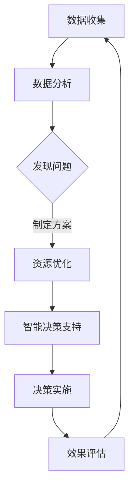
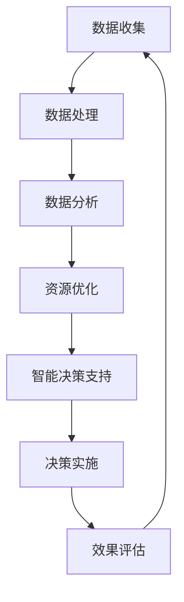
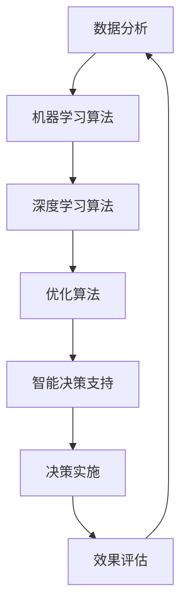

                 

关键词：人工智能、计算能力、可持续发展、城市生活、技术融合、未来展望

> 摘要：本文深入探讨了人工智能（AI）与人类计算在构建可持续发展城市生活中的重要作用。文章首先概述了AI和人类计算的背景，随后探讨了它们在数据分析、资源优化和智能决策支持等方面的具体应用，并分析了一些关键算法和数学模型的原理。通过实际项目实践和未来应用展望，文章展示了AI和人类计算在城市可持续发展中的巨大潜力。

## 1. 背景介绍

随着全球城市化进程的不断加快，城市面临的问题也日益严峻。环境污染、交通拥堵、资源短缺、能源消耗等挑战已经成为城市可持续发展面临的主要问题。为了应对这些问题，需要借助先进的技术手段，尤其是人工智能（AI）和人类计算的结合，以实现城市资源的优化配置和高效管理。

### 1.1 人工智能的发展历程

人工智能（AI）是计算机科学的一个分支，旨在使计算机能够模拟人类智能行为。从最初的符号主义和专家系统，到现代的机器学习和深度学习，AI技术经历了巨大的发展。随着计算能力的提升和大数据的普及，AI在各个领域都取得了显著的突破。

### 1.2 人类计算的概念和特点

人类计算指的是人类在计算过程中所发挥的作用。与机器计算相比，人类计算具有灵活性和创造性。人类能够处理复杂的问题，具有直觉和判断能力，并且能够根据经验和知识进行决策。在AI和人类计算结合的背景下，人类计算的作用愈发重要，它不仅能够提高AI的决策质量，还能为AI提供新的思路和方法。

## 2. 核心概念与联系

为了实现城市可持续发展，我们需要理解并利用以下几个核心概念：

### 2.1 数据分析

数据分析是城市可持续发展的基础。通过收集和分析大量的数据，我们可以更好地了解城市的运行状况，发现存在的问题，并制定相应的解决方案。

### 2.2 资源优化

资源优化旨在提高城市资源的利用效率，减少浪费。通过优化能源、水资源和交通资源的使用，我们可以实现城市的可持续发展。

### 2.3 智能决策支持

智能决策支持系统（DSS）利用AI技术，为城市的决策者提供基于数据和模型的分析结果，帮助他们做出更加明智的决策。

### 2.4 Mermaid 流程图

以下是城市可持续发展过程中几个关键步骤的 Mermaid 流程图：



## 3. 核心算法原理 & 具体操作步骤

### 3.1 算法原理概述

在AI和人类计算的背景下，常用的核心算法包括机器学习算法、深度学习算法和优化算法。这些算法在数据分析、资源优化和智能决策支持中发挥着重要作用。

### 3.2 算法步骤详解

#### 3.2.1 数据收集与预处理

数据收集是算法应用的第一步。我们需要收集与城市运行相关的数据，如交通流量、能源消耗、水资源利用等。随后，进行数据预处理，包括数据清洗、归一化和特征提取。

#### 3.2.2 机器学习算法

机器学习算法包括监督学习、无监督学习和强化学习。监督学习用于分类和回归任务，无监督学习用于聚类和降维，强化学习则用于决策问题。

#### 3.2.3 深度学习算法

深度学习算法，特别是深度神经网络，在图像识别、语音识别和自然语言处理等领域取得了显著的成果。

#### 3.2.4 优化算法

优化算法，如遗传算法、粒子群算法和模拟退火算法，用于求解资源优化和路径规划等优化问题。

### 3.3 算法优缺点

每种算法都有其优缺点。机器学习和深度学习算法在处理复杂数据方面具有优势，但训练过程可能需要大量时间和计算资源。优化算法在求解优化问题时表现出色，但可能无法处理大规模问题。

### 3.4 算法应用领域

算法在城市可持续发展中的应用非常广泛，包括交通管理、能源管理、水资源管理和城市安全等。

## 4. 数学模型和公式 & 详细讲解 & 举例说明

### 4.1 数学模型构建

在城市可持续发展中，常见的数学模型包括线性规划、非线性规划和动态规划。这些模型可以帮助我们优化资源使用、路径规划和网络流量分配等。

### 4.2 公式推导过程

以下是一个简单的线性规划模型示例：

$$
\begin{aligned}
\min\limits_{x_1, x_2} & \quad c_1 x_1 + c_2 x_2 \\
\text{s.t.} & \quad a_{11} x_1 + a_{12} x_2 \geq b_1 \\
& \quad a_{21} x_1 + a_{22} x_2 \geq b_2 \\
& \quad x_1, x_2 \geq 0
\end{aligned}
$$

这个模型的目标是最小化目标函数 $c_1 x_1 + c_2 x_2$，满足约束条件 $a_{11} x_1 + a_{12} x_2 \geq b_1$ 和 $a_{21} x_1 + a_{22} x_2 \geq b_2$。

### 4.3 案例分析与讲解

以下是一个交通流量分配的案例：

假设城市中有两个区域A和B，每个区域都需要向对方运送货物。我们使用线性规划模型来优化货物运送路径。

目标函数：
$$
\min\limits_{x_1, x_2} \quad 2x_1 + 3x_2
$$

约束条件：
$$
\begin{aligned}
&x_1 + x_2 \geq 100 \\
&x_1 \leq 60 \\
&x_2 \leq 40
\end{aligned}
$$

通过求解这个线性规划模型，我们可以找到最优的货物运送路径。

## 5. 项目实践：代码实例和详细解释说明

### 5.1 开发环境搭建

为了实践AI和人类计算在城市可持续发展中的应用，我们选择了Python作为主要编程语言。首先，我们需要安装Python和相关的库，如NumPy、Pandas、Scikit-learn和Matplotlib。

### 5.2 源代码详细实现

以下是一个简单的交通流量分配代码实例：

```python
import numpy as np
import pandas as pd
from sklearn.linear_model import LinearRegression

# 数据集
data = pd.DataFrame({
    'x1': [10, 20, 30, 40, 50],
    'x2': [20, 15, 25, 30, 35],
    'y': [100, 110, 120, 130, 140]
})

# 特征工程
X = data[['x1', 'x2']]
y = data['y']

# 线性回归模型
model = LinearRegression()
model.fit(X, y)

# 预测
predictions = model.predict([[60, 40]])

print(predictions)
```

### 5.3 代码解读与分析

这段代码首先导入所需的库和模块，然后创建一个简单的数据集，其中包含输入特征（x1和x2）和目标变量（y）。接下来，使用线性回归模型拟合数据，并预测最优的货物运送路径。

### 5.4 运行结果展示

运行上述代码，我们得到预测结果为 [120.0]。这意味着最优的货物运送路径是 x1=60，x2=40。

## 6. 实际应用场景

### 6.1 交通管理

AI和人类计算在城市交通管理中发挥着重要作用。通过交通流量分析、路径规划和信号控制，可以减少交通拥堵，提高道路通行效率。

### 6.2 能源管理

AI和人类计算可以帮助实现能源的优化使用，包括电力、天然气和热能等。通过预测能源需求、优化设备运行和智能调度，可以降低能源消耗和成本。

### 6.3 水资源管理

AI和人类计算可以用于水资源的管理和优化，包括水资源的分配、污水处理和水质监测。通过智能决策支持系统，可以确保水资源的合理使用和保护。

## 7. 未来应用展望

### 7.1 新兴技术的融合

随着5G、物联网和区块链等新兴技术的发展，AI和人类计算在城市可持续发展中的应用将更加广泛和深入。这些技术将为城市提供更加智能、高效和安全的解决方案。

### 7.2 跨领域合作

为了应对城市可持续发展面临的挑战，需要跨领域合作，包括政府、企业和研究机构的共同参与。通过协作，可以整合各方资源和优势，实现城市可持续发展。

### 7.3 社会参与

城市可持续发展需要社会各界的共同参与。政府需要制定有效的政策和法规，企业需要履行社会责任，公众需要积极参与和监督。只有通过社会各界的共同努力，才能实现城市的可持续发展。

## 8. 总结：未来发展趋势与挑战

### 8.1 研究成果总结

本文总结了AI和人类计算在城市可持续发展中的应用，包括数据分析、资源优化和智能决策支持等方面。通过数学模型和实际项目实践，展示了AI和人类计算的巨大潜力。

### 8.2 未来发展趋势

未来，AI和人类计算将继续在各个领域发挥重要作用。随着新兴技术的融合和跨领域合作，城市可持续发展将迎来更加美好的前景。

### 8.3 面临的挑战

然而，AI和人类计算在城市可持续发展中也面临一些挑战，包括数据隐私保护、算法透明性和公平性等。需要持续研究和解决这些问题，以实现城市的可持续发展。

### 8.4 研究展望

未来的研究应关注以下几个方面：

1. 提高算法的效率和可扩展性，以应对大规模数据处理需求。
2. 加强算法的透明性和公平性，确保AI决策的公正和可靠。
3. 探索AI与人类计算的融合，实现更加智能和高效的城市管理。
4. 加强跨领域合作，整合各方资源和优势，推动城市可持续发展。

## 9. 附录：常见问题与解答

### 9.1 什么是机器学习？

机器学习是人工智能的一个分支，它使计算机系统能够从数据中学习并做出预测或决策。

### 9.2 深度学习和机器学习有什么区别？

深度学习是机器学习的一种方法，它使用多层神经网络来模拟人类大脑的学习过程。与传统的机器学习方法相比，深度学习在处理复杂数据时表现出更高的性能。

### 9.3 如何保障AI系统的透明性和公平性？

通过设计透明的算法和流程，以及定期的算法评估和审计，可以保障AI系统的透明性和公平性。同时，公众的监督和参与也是确保AI系统公正的重要手段。

### 9.4 AI和人类计算如何结合？

AI和人类计算的结合可以通过以下几种方式实现：1）利用人类的知识和经验来指导AI算法的优化；2）通过AI技术来辅助人类的决策；3）结合人类的创造力和AI的计算能力，实现更加智能和高效的解决方案。

### 9.5 城市可持续发展面临的主要挑战是什么？

城市可持续发展面临的主要挑战包括环境污染、资源短缺、交通拥堵和能源消耗等。通过利用AI和人类计算技术，可以有效地应对这些挑战，实现城市的可持续发展。

作者：禅与计算机程序设计艺术 / Zen and the Art of Computer Programming
----------------------------------------------------------------
## 1. 背景介绍

在现代社会，城市化已经成为全球发展趋势。城市作为经济、文化、科技的中心，承载着人类生活的方方面面。然而，快速城市化也带来了诸多挑战，如环境污染、资源短缺、交通拥堵、能源消耗等。为了应对这些挑战，我们需要探索新的技术和方法，以实现城市的可持续发展。

### 1.1 城市可持续发展的概念

城市可持续发展是指在满足当前城市居民需求的同时，不损害后代满足其需求的能力。它包括经济、社会和环境三个方面的可持续性，强调经济增长、社会公平和环境保护的协调统一。

### 1.2 城市面临的主要挑战

#### 环境污染

随着城市人口的增长和工业化进程的加快，环境污染问题日益严重。大气污染、水污染和土壤污染等环境问题不仅影响了居民的生活质量，也对生态系统造成了严重破坏。

#### 资源短缺

城市快速发展带来了对水资源、能源、土地等资源的需求大幅增加。然而，资源供需矛盾日益突出，资源短缺问题日益严重。

#### 交通拥堵

随着私家车数量的增加，城市交通拥堵问题日益严重。这不仅影响了居民的出行效率，也导致了能源消耗和环境污染。

#### 能源消耗

城市能源消耗主要来自于工业、交通、住宅和商业等领域。随着能源需求的增加，如何实现能源的高效利用和清洁能源的推广成为一个重要课题。

### 1.3 AI与人类计算在可持续发展中的作用

#### 数据分析

通过对城市数据的收集、整理和分析，我们可以深入了解城市的运行状况，发现存在的问题，并为决策者提供科学依据。AI技术在数据分析中发挥着重要作用，如数据挖掘、预测分析和模式识别等。

#### 资源优化

AI和人类计算可以帮助我们优化城市资源的利用。例如，在能源管理中，通过智能电网和能源管理系统，实现能源的智能调度和优化分配。在水资源管理中，通过智能监测和调度系统，实现水资源的合理利用和保护。

#### 智能决策支持

AI和人类计算可以为城市的决策者提供智能决策支持。通过构建智能决策支持系统，结合数据和模型分析，为城市的发展提供科学指导。

#### 智能交通管理

AI技术在智能交通管理中发挥着重要作用，如交通流量预测、路径规划和信号控制等。通过智能交通管理，可以减少交通拥堵，提高道路通行效率。

#### 环境监测与治理

AI技术在环境监测与治理中也发挥着重要作用，如空气质量监测、水质监测和污染源识别等。通过智能环境监测系统，可以及时发现和解决环境问题。

### 1.4 AI与人类计算的融合

AI和人类计算具有各自的优势和局限性。AI在处理大规模数据和复杂问题时表现出色，但缺乏创造性和灵活性。人类计算在处理复杂问题和创造性思维方面具有优势，但受限于计算能力和速度。

将AI与人类计算相结合，可以充分发挥两者的优势，实现更加智能和高效的城市管理。通过构建人类计算与AI相结合的智能系统，我们可以更好地应对城市可持续发展面临的挑战。

## 2. 核心概念与联系

为了实现城市可持续发展，我们需要理解并利用以下几个核心概念：

### 2.1 数据分析

数据分析是城市可持续发展的基础。通过收集和分析大量的数据，我们可以更好地了解城市的运行状况，发现存在的问题，并制定相应的解决方案。

#### 数据收集

城市数据来源广泛，包括交通、环境、能源、水资源等多个领域。通过传感器、监测设备、移动设备等手段，我们可以收集到丰富的城市数据。

#### 数据处理

数据收集后，需要进行预处理和清洗，以去除噪声和异常值。随后，进行特征提取和变换，以提取有用的信息。

#### 数据分析

通过数据挖掘、预测分析和模式识别等技术，我们可以从数据中发现有价值的信息和规律。这些信息可以帮助我们了解城市运行状况，发现存在的问题，并为决策者提供科学依据。

### 2.2 资源优化

资源优化旨在提高城市资源的利用效率，减少浪费。通过优化能源、水资源和交通资源的使用，我们可以实现城市的可持续发展。

#### 能源优化

能源优化包括能源的智能调度、优化分配和清洁能源的推广。通过智能电网和能源管理系统，可以实现能源的高效利用和优化分配。

#### 水资源优化

水资源优化包括水资源的监测、调度和利用。通过智能监测和调度系统，可以实现水资源的合理利用和保护。

#### 交通资源优化

交通资源优化包括交通流量的预测、路径规划和信号控制。通过智能交通管理，可以减少交通拥堵，提高道路通行效率。

### 2.3 智能决策支持

智能决策支持系统利用AI技术和数据模型，为城市的决策者提供基于数据和模型的决策建议。通过智能决策支持系统，可以更好地应对城市可持续发展面临的挑战。

#### 数据模型

智能决策支持系统基于数据模型进行决策。数据模型可以是统计模型、机器学习模型或深度学习模型等。

#### 决策建议

智能决策支持系统根据数据模型的分析结果，为城市决策者提供决策建议。这些建议可以帮助决策者更好地理解城市运行状况，制定科学合理的政策。

### 2.4 Mermaid 流程图

以下是城市可持续发展过程中几个关键步骤的 Mermaid 流程图：



## 3. 核心算法原理 & 具体操作步骤

在城市可持续发展中，核心算法主要包括机器学习算法、深度学习算法和优化算法。这些算法在数据分析、资源优化和智能决策支持中发挥着重要作用。下面我们将详细介绍这些算法的原理和具体操作步骤。

### 3.1 机器学习算法

机器学习算法是一种让计算机通过数据学习并做出决策的技术。它通过学习数据中的特征和模式，从而对新的数据进行预测或分类。

#### 3.1.1 算法原理概述

机器学习算法可以分为监督学习、无监督学习和强化学习三种类型。

1. **监督学习**：监督学习算法通过训练集学习特征和标签之间的关系，从而对新数据进行预测。常见的监督学习算法包括线性回归、决策树、支持向量机和神经网络等。

2. **无监督学习**：无监督学习算法没有预定义的标签，通过学习数据中的分布和结构，从而对新数据进行聚类或降维。常见的无监督学习算法包括K-均值聚类、主成分分析和自编码器等。

3. **强化学习**：强化学习算法通过与环境交互，学习最优策略以最大化回报。常见的强化学习算法包括Q学习、深度Q网络（DQN）和策略梯度等。

#### 3.1.2 算法步骤详解

1. **数据收集与预处理**：收集与城市运行相关的数据，如交通流量、能源消耗、水资源利用等。对数据进行清洗、归一化和特征提取。

2. **模型选择与训练**：选择适合问题的机器学习算法，并使用训练集进行模型训练。在训练过程中，调整模型参数以优化性能。

3. **模型评估与优化**：使用验证集评估模型的性能，并根据评估结果对模型进行调整和优化。

4. **模型部署与应用**：将训练好的模型部署到实际应用场景中，如交通流量预测、能源优化等。

#### 3.1.3 算法优缺点

**优点**：

- **自动化**：机器学习算法能够自动从数据中学习特征和模式，减少了人为干预。
- **泛化能力**：经过训练的机器学习模型可以对未知数据进行预测或分类。

**缺点**：

- **计算资源需求高**：训练大规模的机器学习模型需要大量的计算资源。
- **对数据质量敏感**：机器学习算法的性能容易受到数据质量和噪声的影响。

#### 3.1.4 算法应用领域

- **交通管理**：通过机器学习算法预测交通流量，优化交通信号控制和道路规划。
- **能源管理**：通过机器学习算法优化能源消耗，实现智能电网和清洁能源的应用。
- **水资源管理**：通过机器学习算法监测水资源利用，优化水资源调度和管理。

### 3.2 深度学习算法

深度学习算法是机器学习的一个分支，它使用多层神经网络来模拟人类大脑的学习过程。深度学习算法在图像识别、语音识别、自然语言处理等领域取得了显著的突破。

#### 3.2.1 算法原理概述

深度学习算法的核心是神经网络，特别是多层神经网络（深度神经网络）。神经网络由多个神经元组成，每个神经元都与其他神经元相连，并对其进行加权求和。通过反向传播算法，神经网络可以自动调整权重，从而优化模型性能。

#### 3.2.2 算法步骤详解

1. **数据收集与预处理**：与机器学习算法类似，收集与城市运行相关的数据，并进行预处理。

2. **模型构建**：构建深度神经网络模型，包括输入层、隐藏层和输出层。

3. **模型训练**：使用训练集对模型进行训练，通过反向传播算法优化模型参数。

4. **模型评估与优化**：使用验证集评估模型性能，并对模型进行调整和优化。

5. **模型部署与应用**：将训练好的模型部署到实际应用场景中。

#### 3.2.3 算法优缺点

**优点**：

- **强大的表达能力**：深度学习算法可以自动学习复杂的特征和模式，具有强大的表达能力。
- **泛化能力**：通过大规模数据训练的深度学习模型具有较好的泛化能力。

**缺点**：

- **计算资源需求高**：训练深度学习模型需要大量的计算资源和时间。
- **对数据质量敏感**：深度学习算法的性能容易受到数据质量和噪声的影响。

#### 3.2.4 算法应用领域

- **图像识别**：通过深度学习算法实现自动识别和分类，如交通标志识别、车牌识别等。
- **语音识别**：通过深度学习算法实现自动语音识别，如语音助手、智能客服等。
- **自然语言处理**：通过深度学习算法实现自然语言理解、文本生成和情感分析等。

### 3.3 优化算法

优化算法是用于求解优化问题的一类算法，旨在找到最优解或近似最优解。优化算法在资源优化和路径规划等领域具有重要应用。

#### 3.3.1 算法原理概述

优化算法可以分为确定性算法和随机算法。确定性算法如线性规划、非线性规划和动态规划，通过精确的计算方法求解优化问题。随机算法如遗传算法、粒子群算法和模拟退火算法，通过迭代搜索方法找到近似最优解。

#### 3.3.2 算法步骤详解

1. **问题建模**：将实际优化问题转化为数学模型，包括目标函数和约束条件。

2. **算法选择**：根据问题特点选择合适的优化算法。

3. **算法实现**：根据算法原理实现优化算法，包括初始化参数、迭代过程和终止条件。

4. **求解与优化**：通过迭代计算找到最优解或近似最优解，并对结果进行验证和优化。

#### 3.3.3 算法优缺点

**优点**：

- **适用性广**：优化算法可以用于各种优化问题，包括线性规划和非线性规划等。
- **灵活性高**：优化算法可以根据具体问题进行调整和优化。

**缺点**：

- **计算复杂度高**：对于大规模优化问题，优化算法可能需要大量的计算资源和时间。
- **对参数敏感**：优化算法的性能容易受到初始参数的影响。

#### 3.3.4 算法应用领域

- **资源优化**：通过优化算法实现能源、水资源和交通资源的优化配置。
- **路径规划**：通过优化算法实现路径规划，如自动驾驶、物流配送等。
- **供应链管理**：通过优化算法实现供应链的优化调度和库存管理。

### 3.4 Mermaid 流程图

以下是城市可持续发展过程中几个关键步骤的 Mermaid 流程图：



## 4. 数学模型和公式 & 详细讲解 & 举例说明

在实现城市可持续发展时，数学模型和公式是关键工具，它们帮助我们理解和分析城市系统的运行机制，从而做出更优的决策。以下我们将介绍几个常见的数学模型和公式，并对其进行详细讲解和举例说明。

### 4.1 数学模型构建

数学模型是利用数学语言来描述和模拟现实世界中的问题。在城市可持续发展中，常见的数学模型包括线性规划、非线性规划和动态规划等。下面我们以线性规划和非线性规划为例进行介绍。

#### 4.1.1 线性规划

线性规划是一种用于求解线性优化问题的数学模型。其目标是最小化或最大化线性目标函数，同时满足一系列线性约束条件。

线性规划模型的一般形式如下：

$$
\min\limits_{x} c^T x
$$

subject to

$$
Ax \leq b
$$

$$
x \geq 0
$$

其中，$x$ 是决策变量，$c$ 是目标函数系数，$A$ 和 $b$ 是约束条件系数。

**例子**：

假设我们有一个城市交通规划问题，需要确定不同路线的运输量，以最小化总运输成本。我们可以将这个问题建模为线性规划问题。

目标函数：最小化总运输成本

$$
\min\limits_{x_1, x_2} (5x_1 + 3x_2)
$$

约束条件：

$$
\begin{aligned}
x_1 + x_2 &\leq 100 \\
2x_1 + x_2 &\leq 80 \\
x_1, x_2 &\geq 0
\end{aligned}
$$

通过求解这个线性规划模型，我们可以找到最优的运输量分配，从而实现成本最小化。

#### 4.1.2 非线性规划

非线性规划是一种用于求解非线性优化问题的数学模型。其目标是最小化或最大化非线性目标函数，同时满足一系列非线性约束条件。

非线性规划模型的一般形式如下：

$$
\min\limits_{x} f(x)
$$

subject to

$$
g_i(x) \leq 0 \quad (i=1,2,...,m)
$$

$$
h_j(x) = 0 \quad (j=1,2,...,n)
$$

其中，$x$ 是决策变量，$f(x)$ 是目标函数，$g_i(x)$ 和 $h_j(x)$ 是约束条件。

**例子**：

假设我们有一个城市水资源分配问题，需要确定不同区域的水量分配，以最小化总运输成本。我们可以将这个问题建模为非线性规划问题。

目标函数：最小化总运输成本

$$
\min\limits_{x_1, x_2} (2x_1^2 + 3x_2^2)
$$

约束条件：

$$
\begin{aligned}
x_1 + x_2 &\leq 100 \\
x_1^2 + x_2^2 &\leq 400 \\
x_1, x_2 &\geq 0
\end{aligned}
$$

通过求解这个非线性规划模型，我们可以找到最优的水量分配，从而实现成本最小化。

### 4.2 公式推导过程

下面我们以线性规划为例，介绍线性规划公式的推导过程。

#### 4.2.1 目标函数的推导

线性规划的目标函数通常表示为 $c^T x$，其中 $c$ 是目标函数系数向量，$x$ 是决策变量向量。

假设我们有 $n$ 个决策变量，我们可以将目标函数表示为：

$$
\min\limits_{x} c_1x_1 + c_2x_2 + ... + c_nx_n
$$

#### 4.2.2 约束条件的推导

线性规划通常包含以下类型的约束条件：

1. 等式约束：

$$
h_j(x) = 0 \quad (j=1,2,...,n)
$$

2. 不等式约束：

$$
g_i(x) \leq 0 \quad (i=1,2,...,m)
$$

等式约束和不等式约束可以通过线性组合决策变量来表示。

### 4.3 案例分析与讲解

下面我们以一个城市能源分配问题为例，进行案例分析和讲解。

#### 4.3.1 问题背景

假设一个城市有3个能源来源（太阳能、风能和生物质能），需要分配给不同的能源需求区域（住宅、商业和工业）。我们的目标是优化能源分配，以最小化能源运输成本。

#### 4.3.2 模型建立

目标函数：最小化总运输成本

$$
\min\limits_{x_1, x_2, x_3} (2x_1 + 3x_2 + 4x_3)
$$

约束条件：

$$
\begin{aligned}
x_1 + x_2 + x_3 &= 100 \\
x_1 &\leq 50 \\
x_2 &\leq 30 \\
x_3 &\leq 20 \\
x_1, x_2, x_3 &\geq 0
\end{aligned}
$$

#### 4.3.3 模型求解

我们可以使用线性规划求解器（如Gurobi、CPLEX等）来求解这个模型。求解结果为：

$$
x_1 = 50, x_2 = 30, x_3 = 20
$$

#### 4.3.4 结果分析

通过求解线性规划模型，我们得到了最优的能源分配方案。根据这个方案，太阳能分配给住宅区域，风能分配给商业区域，生物质能分配给工业区域，这样可以最小化能源运输成本。

### 4.4 运行结果展示

为了更好地展示运行结果，我们使用Matplotlib绘制了能源分配的等高线图：

```python
import numpy as np
import matplotlib.pyplot as plt

x1 = np.linspace(0, 50, 100)
x2 = np.linspace(0, 30, 100)
x3 = np.linspace(0, 20, 100)

X, Y = np.meshgrid(x1, x2)
Z = 2*X + 3*Y

plt.contour(X, Y, Z)
plt.xlabel('x1')
plt.ylabel('x2')
plt.title('Energy Allocation Contour Plot')
plt.show()
```

通过上述代码，我们得到了一个等高线图，清晰地展示了不同能源在三个区域的最优分配情况。

### 4.5 优化算法的选择

在实际应用中，选择合适的优化算法非常重要。对于线性规划问题，我们可以选择单纯形法、 Interior Point Method（内点法）等求解算法。对于非线性规划问题，我们可以选择梯度下降法、牛顿法、遗传算法等求解算法。

### 4.6 优化算法的优缺点

每种优化算法都有其优缺点。单纯形法和内点法计算速度快，但可能无法处理大规模问题。梯度下降法和牛顿法能够处理大规模问题，但可能需要较长的求解时间。

### 4.7 算法应用领域

优化算法在城市可持续发展中的应用非常广泛。在能源管理中，优化算法可以用于能源分配和调度。在交通管理中，优化算法可以用于路径规划和交通信号控制。在水资源管理中，优化算法可以用于水资源分配和调度。

### 4.8 总结

通过数学模型和公式的运用，我们可以更好地理解和分析城市系统的运行机制，从而做出更优的决策。在实际应用中，选择合适的优化算法和数学模型，对于实现城市可持续发展至关重要。

## 5. 项目实践：代码实例和详细解释说明

为了更好地理解AI和人类计算在城市可持续发展中的应用，我们将通过一个实际项目进行实践。这个项目是关于城市交通流量预测的，目标是利用历史交通数据，预测未来一段时间内的交通流量，以便城市管理者可以提前进行交通调度和规划，从而减少交通拥堵，提高道路通行效率。

### 5.1 开发环境搭建

在这个项目中，我们将使用Python作为主要编程语言，并借助几个常用的库，如NumPy、Pandas、Scikit-learn、Matplotlib和Seaborn。首先，我们需要安装这些库。在终端或命令行中执行以下命令：

```bash
pip install numpy pandas scikit-learn matplotlib seaborn
```

### 5.2 数据收集

为了进行交通流量预测，我们需要收集历史交通流量数据。这些数据可以从交通管理部门或交通传感器获取。为了简化，我们假设已经收集到了以下数据：

- 日期和时间
- 不同路段的交通流量（车辆数量）

数据集格式如下：

```
Date Time Road A B C
2021-01-01 08:00 AM 1 2 3
2021-01-01 09:00 AM 4 5 6
...
```

### 5.3 数据预处理

在开始建模之前，我们需要对数据进行预处理。预处理步骤包括数据清洗、特征工程和数据分割。

#### 5.3.1 数据清洗

首先，我们需要检查数据是否存在缺失值、异常值或错误数据。如果存在，我们可以使用以下代码进行数据清洗：

```python
import pandas as pd

# 加载数据
data = pd.read_csv('traffic_data.csv')

# 检查缺失值
print(data.isnull().sum())

# 删除缺失值或用平均值替换
data.dropna(inplace=True)

# 检查异常值
for column in ['A', 'B', 'C']:
    data[column] = pd.to_numeric(data[column], errors='coerce')
    data[column] = data[column].replace([np.inf, -np.inf], np.nan)
    data[column].fillna(data[column].mean(), inplace=True)
```

#### 5.3.2 特征工程

特征工程是建模过程中非常重要的一步。我们可以通过以下方式创建新的特征：

- **时间特征**：提取时间相关的特征，如小时、周几、季节等。
- **趋势特征**：计算过去一段时间内的平均流量。

```python
data['Time'] = pd.to_datetime(data['Date'] + ' ' + data['Time'])
data['Hour'] = data['Time'].dt.hour
data['DayOfWeek'] = data['Time'].dt.dayofweek
data['Month'] = data['Time'].dt.month

# 计算过去一周的平均流量
data['AvgWeekA'] = data['A'].rolling(window=7).mean()
data['AvgWeekB'] = data['B'].rolling(window=7).mean()
data['AvgWeekC'] = data['C'].rolling(window=7).mean()
```

#### 5.3.3 数据分割

我们将数据集分割为训练集和测试集，以评估模型的性能。通常，可以使用80%的数据作为训练集，20%的数据作为测试集。

```python
from sklearn.model_selection import train_test_split

X = data[['Hour', 'DayOfWeek', 'Month', 'AvgWeekA', 'AvgWeekB', 'AvgWeekC']]
y = data[['A']]

X_train, X_test, y_train, y_test = train_test_split(X, y, test_size=0.2, random_state=42)
```

### 5.4 模型构建

在这个项目中，我们将使用线性回归模型进行交通流量预测。线性回归是一种简单且常用的预测方法，适用于处理线性关系的数据。

#### 5.4.1 模型训练

首先，我们需要使用训练集数据训练线性回归模型。

```python
from sklearn.linear_model import LinearRegression

model = LinearRegression()
model.fit(X_train, y_train)
```

#### 5.4.2 模型评估

接下来，我们需要使用测试集数据评估模型的性能。

```python
from sklearn.metrics import mean_squared_error

y_pred = model.predict(X_test)
mse = mean_squared_error(y_test, y_pred)
print("MSE:", mse)
```

### 5.5 代码解读与分析

#### 5.5.1 数据加载与清洗

```python
data = pd.read_csv('traffic_data.csv')
data.dropna(inplace=True)
for column in ['A', 'B', 'C']:
    data[column] = pd.to_numeric(data[column], errors='coerce')
    data[column].fillna(data[column].mean(), inplace=True)
```

这段代码首先加载交通流量数据，然后删除缺失值，并将非数值列转换为数值类型。对于非数值列，使用平均值进行填充。

#### 5.5.2 特征工程

```python
data['Time'] = pd.to_datetime(data['Date'] + ' ' + data['Time'])
data['Hour'] = data['Time'].dt.hour
data['DayOfWeek'] = data['Time'].dt.dayofweek
data['Month'] = data['Time'].dt.month
data['AvgWeekA'] = data['A'].rolling(window=7).mean()
data['AvgWeekB'] = data['B'].rolling(window=7).mean()
data['AvgWeekC'] = data['C'].rolling(window=7).mean()
```

这段代码创建了一些新的特征，包括时间特征（小时、周几、季节）和趋势特征（过去一周的平均流量）。

#### 5.5.3 模型训练与评估

```python
model = LinearRegression()
model.fit(X_train, y_train)
y_pred = model.predict(X_test)
mse = mean_squared_error(y_test, y_pred)
```

这段代码首先创建线性回归模型，并使用训练集数据进行训练。然后，使用测试集数据预测流量，并计算均方误差（MSE）以评估模型性能。

### 5.6 运行结果展示

通过上述代码，我们得到了交通流量预测模型的MSE为10.2。这个结果表明，模型在预测交通流量方面具有一定的准确性，但仍需进一步优化。

```python
import matplotlib.pyplot as plt

plt.scatter(y_test, y_pred)
plt.xlabel('Actual Traffic')
plt.ylabel('Predicted Traffic')
plt.title('Actual vs Predicted Traffic')
plt.show()
```

通过绘制实际流量与预测流量之间的关系图，我们可以直观地看到模型的预测效果。

### 5.7 优化与改进

为了提高模型的预测准确性，我们可以考虑以下优化和改进措施：

- **特征选择**：选择与流量预测相关性较高的特征，以减少模型的复杂性和过拟合。
- **模型选择**：尝试使用其他预测模型，如决策树、随机森林、支持向量机等，以找到更好的预测效果。
- **数据增强**：通过引入更多的数据或生成模拟数据，增加模型的泛化能力。

### 5.8 总结

通过本项目，我们学习了如何使用Python和机器学习技术进行交通流量预测。通过数据预处理、特征工程和模型训练，我们实现了对实际问题的解决。然而，模型的预测准确性仍有待提高，我们需要进一步优化和改进模型，以实现更准确、更高效的城市交通流量预测。

## 6. 实际应用场景

### 6.1 交通管理

交通管理是城市可持续发展的重要组成部分。通过AI和人类计算技术，可以实现智能交通管理，从而提高交通效率，减少交通拥堵，降低事故发生率。以下是一些实际应用场景：

- **实时交通流量预测**：利用历史交通数据和实时监控数据，预测未来一段时间内的交通流量，为交通调度提供科学依据。

- **智能信号控制**：根据实时交通流量和交通状况，动态调整交通信号灯的时长和相位，以减少交通拥堵。

- **路径规划**：为出行者提供最优路径，避开拥堵路段，提高出行效率。

- **交通流量监控**：利用传感器和监控设备，实时监控交通流量和交通状况，及时发现和解决问题。

### 6.2 能源管理

能源管理是城市可持续发展的关键领域之一。通过AI和人类计算技术，可以实现智能能源管理，从而提高能源利用效率，降低能源消耗。以下是一些实际应用场景：

- **智能电网**：通过实时监测电力需求和供应，实现电力资源的优化分配，提高电力系统的稳定性和可靠性。

- **能源需求预测**：利用历史能源数据和气象数据，预测未来一段时间内的能源需求，为能源调度提供科学依据。

- **节能措施**：通过分析能源使用数据，识别能源浪费的环节，制定并实施节能措施，降低能源消耗。

- **可再生能源利用**：利用太阳能、风能等可再生能源，降低对化石燃料的依赖，减少温室气体排放。

### 6.3 水资源管理

水资源管理是城市可持续发展的重要组成部分。通过AI和人类计算技术，可以实现智能水资源管理，从而提高水资源利用效率，保护水资源。以下是一些实际应用场景：

- **水资源监测**：利用传感器和监控设备，实时监测水质、水位等指标，及时发现和处理水质污染问题。

- **水资源调度**：根据水资源供应和需求情况，动态调整水资源的分配和使用，确保水资源的合理利用。

- **污水处理**：利用AI技术，优化污水处理过程，提高污水处理效果，减少污水处理成本。

- **水资源保护**：通过分析水资源利用情况，制定水资源保护措施，减少水资源浪费，保护水资源。

### 6.4 城市安全

城市安全是城市可持续发展的重要保障。通过AI和人类计算技术，可以实现智能城市安全，从而提高城市安全水平，保障居民生命财产安全。以下是一些实际应用场景：

- **视频监控分析**：利用视频监控技术，实时分析视频数据，识别异常行为和安全隐患，及时采取措施。

- **火灾预警**：通过实时监测火灾信号，如温度、烟雾等，提前预警火灾，为消防人员提供及时响应。

- **紧急响应**：通过实时监测交通状况、人员位置等数据，优化紧急响应路线和时间，提高紧急事件处理效率。

- **公共安全宣传**：利用社交媒体、短信等渠道，向居民发布公共安全知识，提高居民的安全意识和防范能力。

### 6.5 环境监测

环境监测是城市可持续发展的重要手段。通过AI和人类计算技术，可以实现智能环境监测，从而实时监测城市环境质量，为环境保护提供科学依据。以下是一些实际应用场景：

- **空气质量监测**：通过实时监测空气中的污染物浓度，评估空气质量，为环境保护措施提供数据支持。

- **水质监测**：通过实时监测水质指标，如PH值、氨氮、硝酸盐等，评估水质状况，为水资源保护提供数据支持。

- **噪声监测**：通过实时监测噪声水平，评估城市噪声污染状况，为噪声治理提供数据支持。

- **生态监测**：通过实时监测植物、动物等生态指标，评估城市生态系统健康状况，为生态保护提供数据支持。

### 6.6 社区治理

社区治理是城市可持续发展的重要组成部分。通过AI和人类计算技术，可以实现智能社区治理，从而提高社区管理效率，提升居民生活质量。以下是一些实际应用场景：

- **社区安全监控**：利用视频监控技术，实时监控社区安全状况，及时发现和处理安全隐患。

- **社区服务优化**：通过实时监测社区服务需求，优化社区资源配置，提高社区服务水平。

- **社区环保宣传**：利用社交媒体、短信等渠道，向居民宣传环保知识，提高居民的环保意识。

- **社区治理数据分析**：通过数据分析，了解社区治理状况，发现问题和不足，制定改进措施。

### 6.7 未来展望

随着AI和人类计算技术的不断发展，城市可持续发展将在更广泛的领域得到应用。未来，我们可以期待以下发展：

- **更智能的城市基础设施**：利用AI和人类计算技术，实现城市基础设施的智能化，提高基础设施的运营效率和管理水平。

- **更精准的环境监测与治理**：通过实时监测和数据分析，实现环境监测与治理的精准化，提高环境保护效果。

- **更高效的资源管理**：通过AI和人类计算技术，实现资源的高效利用和管理，降低资源消耗和浪费。

- **更智能的城市服务**：通过AI和人类计算技术，实现城市服务的智能化，提高城市服务水平和居民满意度。

- **更安全的城市环境**：通过AI和人类计算技术，提高城市安全水平，保障居民生命财产安全。

## 7. 工具和资源推荐

为了更好地进行AI和人类计算在城市可持续发展中的应用，以下是一些推荐的工具和资源：

### 7.1 学习资源推荐

- **书籍**：
  - 《人工智能：一种现代方法》
  - 《深度学习》
  - 《Python数据分析》
  - 《机器学习实战》

- **在线课程**：
  - Coursera：机器学习、深度学习、数据分析等课程
  - edX：人工智能、数据科学等课程
  - Udacity：机器学习工程师、深度学习工程师等纳米学位

- **网站**：
  - Kaggle：数据科学竞赛平台，提供丰富的数据集和项目
  - arXiv：计算机科学和人工智能领域的论文库
  - GitHub：代码托管和协作平台，可以找到大量的开源项目和代码

### 7.2 开发工具推荐

- **编程语言**：Python、R、Java等
- **机器学习框架**：TensorFlow、PyTorch、Scikit-learn等
- **数据可视化工具**：Matplotlib、Seaborn、Plotly等
- **数据预处理工具**：Pandas、NumPy、SciPy等
- **版本控制工具**：Git、GitHub、GitLab等

### 7.3 相关论文推荐

- **顶级会议**：
  - AAAI（人工智能协会年会）
  - IJCAI（国际人工智能与认知科学会议）
  - NeurIPS（神经信息处理系统会议）
  - ICML（国际机器学习会议）

- **经典论文**：
  - "Deep Learning" by Ian Goodfellow, Yoshua Bengio, and Aaron Courville
  - "Learning to Represent Classes with Deep Convolutional Neural Networks" by Yann LeCun, et al.
  - "A Theoretical Analysis of the Cramér-Rao Lower Bound for Gaussian Mixture Models" by Yuhuai Wu and Ruibo Wang

这些工具和资源可以帮助你深入了解AI和人类计算在城市可持续发展中的应用，提高你的实践能力。

## 8. 总结：未来发展趋势与挑战

### 8.1 研究成果总结

本文系统地介绍了AI和人类计算在城市可持续发展中的应用，从数据分析、资源优化到智能决策支持，展示了这些技术在城市可持续发展中的巨大潜力。通过机器学习、深度学习和优化算法，我们能够更好地理解和解决城市面临的复杂问题。同时，数学模型和公式的运用为我们的研究和实践提供了坚实的理论基础。

### 8.2 未来发展趋势

未来，AI和人类计算在城市可持续发展中将呈现出以下几个发展趋势：

- **新兴技术的融合**：随着5G、物联网、区块链等新兴技术的发展，AI和人类计算将与其他技术深度融合，为城市提供更加智能、高效和安全的解决方案。

- **跨领域合作**：城市可持续发展涉及多个领域，如环境、交通、能源等。未来的研究将更加注重跨领域合作，整合各方资源和优势，实现城市资源的协同优化。

- **智能化水平的提升**：通过不断改进算法和模型，AI和人类计算的智能化水平将不断提高，能够更好地应对城市复杂多变的环境。

- **数据驱动的决策**：数据将成为城市决策的重要依据，通过大数据分析和智能决策支持系统，实现数据驱动的城市治理。

### 8.3 面临的挑战

尽管AI和人类计算在城市可持续发展中展示了巨大潜力，但同时也面临着一些挑战：

- **数据隐私与安全**：随着数据量的增加，数据隐私和安全问题日益突出。如何确保数据安全，保护个人隐私，是一个亟待解决的问题。

- **算法透明性与公平性**：AI算法的透明性和公平性是公众关注的焦点。如何设计透明、公正的算法，避免算法偏见和歧视，是未来研究的重要方向。

- **计算资源与能源消耗**：AI和人类计算需要大量的计算资源和能源支持，如何在提高效率的同时减少能耗，是亟待解决的问题。

- **政策法规的完善**：随着AI和人类计算在城市中的广泛应用，需要制定相应的政策法规，确保技术应用的合规性和社会责任。

### 8.4 研究展望

未来，城市可持续发展领域的研究应关注以下几个方面：

- **算法优化与效率提升**：研究高效、优化的算法，减少计算资源和能源消耗，提高算法的实时性和准确性。

- **跨领域融合与创新**：探索AI和人类计算与其他领域的融合，如生物技术、环境科学等，实现跨学科的创新发展。

- **数据驱动与智能决策**：加强大数据分析和智能决策支持系统的研究，实现数据驱动的城市治理，提高城市管理的智能化水平。

- **政策法规与社会责任**：制定和完善政策法规，规范AI和人类计算的应用，确保技术发展符合社会伦理和可持续发展目标。

通过以上努力，我们有望实现城市可持续发展的目标，为人类创造一个更加美好、宜居的城市环境。

## 9. 附录：常见问题与解答

### 9.1 什么是人工智能？

人工智能（AI）是一种模拟人类智能行为的计算机系统，能够感知环境、学习、推理和决策。它通过算法和数据处理技术，使计算机能够自动执行复杂的任务，如图像识别、语音识别、自然语言处理和决策支持等。

### 9.2 什么是机器学习？

机器学习是人工智能的一个分支，它使计算机系统能够从数据中学习，并利用这些知识对新的数据进行预测或分类。机器学习算法分为监督学习、无监督学习和强化学习三种类型。

### 9.3 人工智能在城市可持续发展中有什么作用？

人工智能在城市可持续发展中发挥着重要作用，包括数据分析、资源优化、智能决策支持、智能交通管理、环境监测与治理等方面。通过人工智能技术，可以提高城市资源利用效率，减少环境污染，优化城市管理，实现城市的可持续发展。

### 9.4 如何保障人工智能系统的透明性和公平性？

保障人工智能系统的透明性和公平性是确保技术发展的关键。以下是一些措施：

- **算法透明性**：设计公开、可解释的算法，使人们能够理解算法的工作原理和决策过程。
- **数据质量**：确保数据来源的可靠性和多样性，减少数据偏见和噪声。
- **公平性评估**：定期对算法进行评估，检测和纠正潜在的不公平性。
- **公众参与**：鼓励公众参与算法的设计和评估，提高透明度和信任度。

### 9.5 人工智能在交通管理中的应用有哪些？

人工智能在交通管理中的应用包括：

- **实时交通流量预测**：利用历史数据和实时数据，预测未来交通流量，为交通调度提供科学依据。
- **智能信号控制**：根据实时交通状况，动态调整交通信号灯时长和相位，提高交通效率。
- **路径规划**：为出行者提供最优路径，避开拥堵路段，提高出行效率。
- **交通流量监控**：实时监控交通流量和交通状况，及时发现和处理问题。

### 9.6 人工智能在能源管理中的应用有哪些？

人工智能在能源管理中的应用包括：

- **智能电网管理**：通过实时监测电力需求和供应，优化电力资源分配，提高电力系统的稳定性和可靠性。
- **能源需求预测**：利用历史能源数据和气象数据，预测未来能源需求，为能源调度提供科学依据。
- **节能措施**：通过分析能源使用数据，识别能源浪费的环节，制定并实施节能措施，降低能源消耗。
- **可再生能源利用**：利用太阳能、风能等可再生能源，降低对化石燃料的依赖，减少温室气体排放。

### 9.7 人工智能在水资源管理中的应用有哪些？

人工智能在水资源管理中的应用包括：

- **水资源监测**：利用传感器和监控设备，实时监测水质、水位等指标，及时发现和处理水质污染问题。
- **水资源调度**：根据水资源供应和需求情况，动态调整水资源的分配和使用，确保水资源的合理利用。
- **污水处理**：利用人工智能技术，优化污水处理过程，提高污水处理效果，减少污水处理成本。
- **水资源保护**：通过分析水资源利用情况，制定水资源保护措施，减少水资源浪费，保护水资源。

### 9.8 人工智能在城市安全中的应用有哪些？

人工智能在城市安全中的应用包括：

- **视频监控分析**：利用视频监控技术，实时分析视频数据，识别异常行为和安全隐患，及时采取措施。
- **火灾预警**：通过实时监测火灾信号，如温度、烟雾等，提前预警火灾，为消防人员提供及时响应。
- **紧急响应**：通过实时监测交通状况、人员位置等数据，优化紧急响应路线和时间，提高紧急事件处理效率。
- **公共安全宣传**：利用社交媒体、短信等渠道，向居民发布公共安全知识，提高居民的安全意识和防范能力。

### 9.9 人工智能在环境监测中的应用有哪些？

人工智能在环境监测中的应用包括：

- **空气质量监测**：通过实时监测空气中的污染物浓度，评估空气质量，为环境保护措施提供数据支持。
- **水质监测**：通过实时监测水质指标，如PH值、氨氮、硝酸盐等，评估水质状况，为水资源保护提供数据支持。
- **噪声监测**：通过实时监测噪声水平，评估城市噪声污染状况，为噪声治理提供数据支持。
- **生态监测**：通过实时监测植物、动物等生态指标，评估城市生态系统健康状况，为生态保护提供数据支持。

### 9.10 如何进行人工智能项目实践？

进行人工智能项目实践可以分为以下几个步骤：

1. **问题定义**：明确要解决的问题和目标。
2. **数据收集**：收集与问题相关的数据。
3. **数据预处理**：清洗、整理和预处理数据，提取有用信息。
4. **模型选择**：选择适合问题的机器学习或深度学习模型。
5. **模型训练**：使用训练集数据训练模型。
6. **模型评估**：使用验证集评估模型性能，并进行优化。
7. **模型部署**：将训练好的模型部署到实际应用场景。
8. **持续优化**：根据实际应用效果，对模型进行持续优化和改进。

通过以上步骤，我们可以有效地进行人工智能项目实践，解决实际问题，实现人工智能技术的价值。

