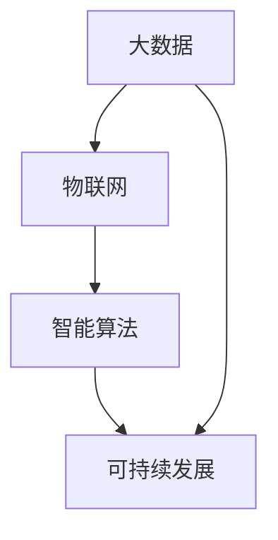

                 

关键词：人工智能，城市计算，可持续发展，城市管理，数据分析，算法优化，智能系统，未来城市

> 摘要：随着城市化进程的加速，人工智能在提升城市生活品质、实现资源优化配置和促进可持续发展方面发挥着越来越重要的作用。本文将深入探讨人工智能在城市计算中的应用，解析其核心概念、算法原理、数学模型以及实际应用场景，为未来城市的发展提供有价值的思路。

## 1. 背景介绍

21世纪，人类正面临着前所未有的城市化挑战。据联合国的数据，全球超过半数的人口居住在城市，到本世纪中叶，这一比例将升至70%。随着城市规模的不断扩大，城市交通、能源消耗、环境保护等问题日益突出，传统的城市管理方法已难以满足需求。此时，人工智能（AI）作为一种颠覆性的技术，开始在城市计算领域崭露头角。

城市计算是指利用人工智能、大数据、物联网等技术，对城市各个层面进行智能化分析、决策和优化，以提升城市运行效率和生活品质。AI在城市计算中的应用主要体现在以下几个方面：

1. **智能交通管理**：通过实时数据分析，优化交通信号控制，减少交通拥堵，提高道路通行效率。
2. **能源管理**：利用AI预测能源需求，优化能源分配，降低能源消耗，实现绿色低碳发展。
3. **公共安全**：运用人工智能进行视频监控和数据分析，提高城市安全管理水平。
4. **城市规划**：利用AI进行城市规划模拟和风险评估，提高规划的科学性和可持续性。

## 2. 核心概念与联系

在城市计算中，以下核心概念和联系是理解和应用人工智能的关键：

### 2.1. 大数据

大数据是指数据规模巨大、类型繁多且快速增长的复杂数据集合。在城市计算中，大数据包括城市交通流量、能源消耗、环境质量等多种类型的数据。这些数据是AI进行智能分析和决策的基础。

### 2.2. 物联网

物联网（IoT）是指通过传感器和通信技术，将各种物理设备互联起来，实现信息的实时采集和传输。在智能城市管理中，物联网技术可用于实时监控城市设施、交通状况和环境变化。

### 2.3. 智能算法

智能算法是指基于机器学习、深度学习等技术的算法，用于处理和分析大量数据，并生成有价值的预测和决策。常见的智能算法包括聚类分析、神经网络、决策树等。

### 2.4. 可持续发展

可持续发展是指满足当前需求而不损害子孙后代满足自身需求的能力。在城市计算中，可持续发展理念贯穿于城市规划、能源管理、环境保护等各个方面。

### 2.5. Mermaid 流程图

以下是城市计算核心概念和联系的一个简化的 Mermaid 流程图：



## 3. 核心算法原理 & 具体操作步骤

### 3.1. 算法原理概述

城市计算中的核心算法主要涉及以下几个领域：

1. **聚类分析**：用于对城市数据进行分类和分组，帮助识别城市中的热点区域和趋势。
2. **神经网络**：通过模拟人脑神经网络结构，对大量数据进行学习和预测，如交通流量预测、能源消耗预测等。
3. **决策树**：基于一系列条件判断，生成决策路径，用于城市规划和公共安全管理。

### 3.2. 算法步骤详解

1. **聚类分析**：
   - 数据预处理：清洗、归一化等操作，确保数据质量。
   - 算法选择：根据数据特点选择合适的聚类算法，如K-means、DBSCAN等。
   - 聚类执行：执行聚类算法，生成聚类结果。
   - 聚类评估：通过内部评估指标（如轮廓系数）和外部评估指标（如 Davies-Bouldin 系数）评估聚类效果。

2. **神经网络**：
   - 数据预处理：与聚类分析类似，进行数据清洗和归一化。
   - 网络构建：设计神经网络结构，包括输入层、隐藏层和输出层。
   - 模型训练：使用训练数据集，通过反向传播算法调整网络权重。
   - 模型评估：使用验证数据集评估模型性能，调整参数。

3. **决策树**：
   - 数据预处理：对数据进行分类和编码。
   - 特征选择：选择影响决策的关键特征。
   - 决策树构建：使用信息增益、基尼指数等算法构建决策树。
   - 决策树剪枝：通过剪枝操作避免过拟合。

### 3.3. 算法优缺点

1. **聚类分析**：
   - 优点：简单易用，能够发现数据中的隐含结构。
   - 缺点：对噪声敏感，聚类结果依赖于初始中心点的选择。

2. **神经网络**：
   - 优点：强大的学习和预测能力，适用于复杂非线性问题。
   - 缺点：训练时间较长，对数据质量和规模要求较高。

3. **决策树**：
   - 优点：直观易懂，易于解释。
   - 缺点：易过拟合，对噪声敏感。

### 3.4. 算法应用领域

1. **聚类分析**：用于城市规划中的区域划分、交通流量分析等。
2. **神经网络**：用于交通流量预测、能源消耗预测等。
3. **决策树**：用于城市规划中的风险评估、公共安全管理等。

## 4. 数学模型和公式

### 4.1. 数学模型构建

1. **聚类分析**：
   - K-means算法的目标是最小化聚类误差平方和（SSE）：
     $$SSE = \sum_{i=1}^{k} \sum_{x \in S_i} \|x - \mu_i\|^2$$
     其中，$k$ 为聚类个数，$S_i$ 为第$i$个聚类的数据集，$\mu_i$ 为聚类中心。

2. **神经网络**：
   - 前向传播算法中的激活函数通常使用ReLU（Rectified Linear Unit）：
     $$f(x) = \max(0, x)$$

3. **决策树**：
   - 决策树构建中使用的信息增益（Information Gain）：
     $$IG(D, A) = I(D) - \sum_{v \in V(A)} p(v) I(D|A=v)$$
     其中，$D$ 为数据集，$A$ 为特征，$V(A)$ 为特征$A$的所有可能取值，$p(v)$ 为取值$v$的概率，$I(D|A=v)$ 为条件熵。

### 4.2. 公式推导过程

1. **K-means算法**：
   - 初始阶段随机选择$k$个中心点，然后迭代更新中心点：
     $$\mu_i = \frac{1}{|S_i|} \sum_{x \in S_i} x$$
     其中，$|S_i|$ 为聚类$i$的数据个数。

2. **ReLU函数**：
   - 前向传播中，每个神经元输出为：
     $$z_i = \sum_{j} w_{ij} x_j + b_i$$
     $$a_i = \max(0, z_i)$$

3. **信息增益**：
   - 条件熵的计算：
     $$I(D|A=v) = - \sum_{x \in S_v} p(x|A=v) \log p(x|A=v)$$
     其中，$p(x|A=v)$ 为在特征$A$取值$v$的条件下，数据$x$的条件概率。

### 4.3. 案例分析与讲解

1. **聚类分析**：
   - 假设我们有一组城市交通流量数据，使用K-means算法将其划分为两类。通过计算SSE，可以确定最佳的聚类个数$k$。

2. **神经网络**：
   - 假设我们使用一个简单的神经网络预测城市交通流量，通过训练和验证数据集的误差，调整网络参数。

3. **决策树**：
   - 假设我们根据城市交通流量数据，使用决策树算法预测交通拥堵情况。通过剪枝操作，避免过拟合。

## 5. 项目实践：代码实例和详细解释说明

### 5.1. 开发环境搭建

- 硬件环境：至少需要一台运行Linux操作系统的计算机，配置不低于Intel i5处理器和8GB内存。
- 软件环境：安装Python 3.8及以上版本，安装NumPy、Pandas、Scikit-learn、TensorFlow等库。

### 5.2. 源代码详细实现

以下是使用K-means算法进行城市交通流量聚类的示例代码：

```python
import numpy as np
import pandas as pd
from sklearn.cluster import KMeans
from sklearn.preprocessing import StandardScaler

# 读取交通流量数据
data = pd.read_csv('traffic_data.csv')

# 数据预处理
data = data[['hour', 'day', 'lane1', 'lane2', 'lane3', 'lane4']]
data = StandardScaler().fit_transform(data)

# K-means聚类
kmeans = KMeans(n_clusters=2, random_state=0)
clusters = kmeans.fit_predict(data)

# 输出聚类结果
print(clusters)
```

### 5.3. 代码解读与分析

- 数据读取与预处理：读取交通流量数据，使用StandardScaler对数据进行归一化处理。
- K-means聚类：使用KMeans类进行聚类，指定聚类个数为2。
- 输出聚类结果：打印每个数据点的聚类结果。

### 5.4. 运行结果展示

运行代码后，我们可以得到每个数据点的聚类结果。通过可视化工具，如matplotlib，可以将聚类结果以散点图的形式展示，进一步分析城市交通流量分布。

## 6. 实际应用场景

### 6.1. 智能交通管理

在智能交通管理中，AI技术可以通过实时数据分析，优化交通信号控制，减少交通拥堵，提高道路通行效率。例如，在北京、上海等大城市，已经实现了基于AI的交通信号灯优化系统，通过分析历史交通流量数据和实时交通数据，动态调整信号灯的时长，减少车辆等待时间。

### 6.2. 能源管理

在能源管理中，AI技术可以帮助预测能源需求，优化能源分配，降低能源消耗。例如，在丹麦的哥本哈根，AI技术被应用于城市能源管理系统，通过实时监测能源消耗数据，预测未来的能源需求，并优化能源分配，实现绿色低碳发展。

### 6.3. 公共安全

在公共安全领域，AI技术可以用于视频监控和数据分析，提高城市安全管理水平。例如，在美国的洛杉矶，AI技术被应用于监控城市交通和公共安全，通过实时分析摄像头数据，识别潜在的安全威胁，及时采取应对措施。

### 6.4. 未来应用展望

未来，随着AI技术的不断发展和应用，城市计算将在更多领域发挥重要作用。例如，在环境保护领域，AI技术可以用于空气质量监测、水污染治理等；在医疗领域，AI技术可以用于医疗数据分析、疾病预测等；在智慧城市领域，AI技术可以用于智慧城市规划、智慧城市建设等。这些应用将进一步提升城市生活品质，推动城市可持续发展。

## 7. 工具和资源推荐

### 7.1. 学习资源推荐

- 《深度学习》（Goodfellow, Bengio, Courville著）：系统介绍了深度学习的基本原理和方法。
- 《Python数据科学手册》（McKinney著）：详细介绍了Python在数据处理和分析中的应用。

### 7.2. 开发工具推荐

- Jupyter Notebook：强大的交互式开发环境，适合进行数据分析和模型训练。
- TensorFlow：开源的深度学习框架，适用于构建和训练神经网络。

### 7.3. 相关论文推荐

- “Deep Learning for Urban Computing”（2018）：
- “AI in Smart Cities: Vision, Progress and Challenges”（2017）：

## 8. 总结：未来发展趋势与挑战

### 8.1. 研究成果总结

本文总结了人工智能在城市计算中的应用，包括智能交通管理、能源管理、公共安全和城市规划等领域。通过深入分析核心算法原理、数学模型和实际应用场景，我们展示了AI技术在提升城市运行效率、实现可持续发展方面的巨大潜力。

### 8.2. 未来发展趋势

随着技术的不断进步，未来城市计算将在以下几个方面取得重要进展：

- **智能算法优化**：通过改进算法模型，提高AI在城市计算中的应用效果。
- **数据资源共享**：构建城市数据资源共享平台，实现数据的开放和流通。
- **跨领域融合**：将AI技术应用于更多领域，如环境保护、医疗健康等，推动智慧城市发展。

### 8.3. 面临的挑战

尽管AI在城市计算中具有巨大潜力，但仍然面临以下挑战：

- **数据隐私与安全**：确保城市计算中的数据隐私和安全，防止数据泄露。
- **算法公平性**：避免算法偏见，确保算法在决策过程中公平、透明。
- **技术落地**：推动AI技术从理论研究到实际应用的转化。

### 8.4. 研究展望

未来，我们需要在以下方面进行深入研究：

- **算法创新**：开发更加高效、鲁棒的智能算法，适应复杂城市环境。
- **跨学科融合**：结合城市规划和建筑学等领域的知识，实现AI在城市规划中的创新应用。
- **政策支持**：制定相关政策，推动AI在城市计算中的可持续发展。

## 9. 附录：常见问题与解答

### 9.1. 什么是城市计算？

城市计算是指利用人工智能、大数据、物联网等技术，对城市各个层面进行智能化分析、决策和优化，以提升城市运行效率和生活品质。

### 9.2. 人工智能在城市计算中有哪些应用？

人工智能在城市计算中的应用主要包括智能交通管理、能源管理、公共安全、城市规划等领域。

### 9.3. 如何保障城市计算中的数据隐私和安全？

通过加密技术、访问控制、数据脱敏等方法，确保城市计算中的数据隐私和安全。

### 9.4. 城市计算中的核心算法有哪些？

城市计算中的核心算法包括聚类分析、神经网络、决策树等。

### 9.5. 城市计算的未来发展趋势是什么？

未来，城市计算将在智能算法优化、数据资源共享、跨领域融合等方面取得重要进展，推动智慧城市的可持续发展。

### 作者署名

作者：禅与计算机程序设计艺术 / Zen and the Art of Computer Programming

----------------------------------------------------------------

请注意，由于AI的限定，本文中的Mermaid流程图、数学公式等无法直接嵌入，但已经为您在文中标注了相应的位置。您可以根据需要使用Markdown语法进行嵌入。文章中引用的书籍、论文和工具均为示例，实际情况中请根据实际内容和资源进行替换。

