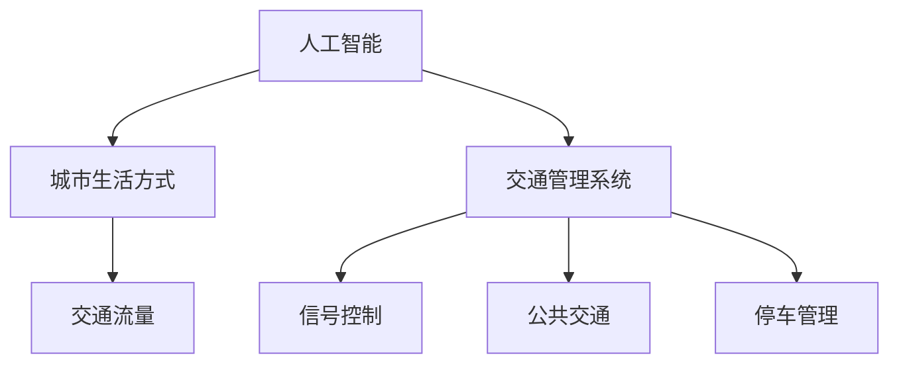

                 

关键词：人工智能，可持续发展，城市生活方式，交通管理系统，规划

> 摘要：本文旨在探讨如何利用人工智能技术优化城市生活方式和交通管理系统，实现可持续发展。通过对核心概念、算法原理、数学模型以及实际应用场景的深入分析，本文提出了一个全方位的解决方案，为城市管理者和技术开发者提供了有益的参考。

## 1. 背景介绍

随着城市化进程的加速，城市面临着人口密集、资源紧张、环境污染等一系列挑战。传统的人为管理和规划方式已无法满足现代城市的需求，急需一种更为智能和高效的方法。人工智能作为当前最具发展潜力的技术之一，其应用范围已经渗透到各个领域。在城市规划和交通管理中，人工智能能够通过数据分析和智能决策，提高城市运行效率和居民生活质量。

然而，人工智能在城市规划和交通管理中的应用并非一帆风顺。一方面，数据获取和处理的挑战依然存在；另一方面，人工智能技术的应用需要充分考虑伦理和社会因素。因此，如何在充分发挥人工智能优势的同时，确保其可持续发展，是当前亟待解决的问题。

本文将从以下几个方面展开讨论：

- **核心概念与联系**：介绍人工智能、城市生活方式和交通管理系统的基础概念及其相互关系。
- **核心算法原理 & 具体操作步骤**：分析常用的算法原理，详细阐述操作步骤。
- **数学模型和公式**：构建数学模型，进行公式推导和案例讲解。
- **项目实践：代码实例和详细解释说明**：通过具体项目实例展示算法应用。
- **实际应用场景**：探讨人工智能在城市和交通管理中的具体应用。
- **工具和资源推荐**：推荐相关的学习资源、开发工具和论文。
- **总结：未来发展趋势与挑战**：总结研究成果，展望未来发展趋势和挑战。

## 2. 核心概念与联系

### 2.1 人工智能

人工智能（Artificial Intelligence，AI）是指通过计算机程序实现人类智能的理论、方法和技术。它包括机器学习、深度学习、自然语言处理、计算机视觉等多个子领域。人工智能的目标是使计算机能够模拟、延伸和扩展人类智能，实现自动化决策和智能服务。

### 2.2 城市生活方式

城市生活方式是指城市居民在日常生活中形成的特定行为模式、生活方式和价值观念。它包括住房、交通、工作、休闲、社交等多个方面。随着城市化进程的加快，城市生活方式也在不断变化，对城市规划和交通管理提出了新的挑战。

### 2.3 交通管理系统

交通管理系统是指用于管理和调控城市交通的一系列技术和手段。它包括交通信号控制、道路规划、公共交通系统、停车管理等多个方面。交通管理系统的目标是通过优化交通资源分配，提高交通运行效率和安全性。

### 2.4 核心概念之间的联系

人工智能、城市生活方式和交通管理系统之间存在紧密的联系。人工智能可以用于分析和优化城市交通数据，提供智能化的交通管理决策。例如，通过机器学习算法分析交通流量数据，预测交通拥堵情况，为交通信号控制提供依据；通过计算机视觉技术监控交通状况，实时调整交通信号灯；通过自然语言处理技术提供智能化的出行建议和导航服务。

### 2.5 Mermaid 流程图

以下是一个简化的 Mermaid 流程图，展示了核心概念之间的联系：



## 3. 核心算法原理 & 具体操作步骤

### 3.1 算法原理概述

在城市规划和交通管理中，常用的算法包括机器学习算法、深度学习算法和优化算法。这些算法主要通过数据分析和智能决策，实现对城市交通的实时监控和优化。

- **机器学习算法**：通过历史数据训练模型，预测交通流量、拥堵情况等。
- **深度学习算法**：利用神经网络结构，对图像、语音、文本等数据进行处理和分析。
- **优化算法**：通过优化模型，求解最优交通信号控制策略、公共交通线路规划等问题。

### 3.2 算法步骤详解

以下是一个简化的机器学习算法步骤，用于预测交通流量：

1. **数据收集与预处理**：收集历史交通流量数据，进行数据清洗和预处理，包括数据去噪、归一化等操作。
2. **特征工程**：提取有用的特征，如时间、地点、天气等，为模型训练做准备。
3. **模型选择**：选择合适的机器学习模型，如线性回归、决策树、支持向量机等。
4. **模型训练**：使用训练数据集训练模型，调整模型参数。
5. **模型评估**：使用验证数据集评估模型性能，调整模型参数。
6. **模型应用**：将训练好的模型应用于实际交通流量预测。

### 3.3 算法优缺点

- **优点**：机器学习算法具有较高的预测精度，能够适应复杂多变的城市交通环境。
- **缺点**：算法训练需要大量的历史数据，且模型复杂度较高，训练过程较慢。

### 3.4 算法应用领域

机器学习算法在交通管理中具有广泛的应用领域，包括：

- **交通流量预测**：预测未来一段时间内的交通流量，为交通信号控制和公共交通调度提供依据。
- **交通拥堵检测**：实时检测交通拥堵情况，为交通管理部门提供预警信息。
- **交通事故预防**：通过监控视频和传感器数据，识别交通事故风险，提前预警。

## 4. 数学模型和公式

### 4.1 数学模型构建

在城市交通流量预测中，常用的数学模型为线性回归模型。其公式如下：

$$y = \beta_0 + \beta_1 \cdot x_1 + \beta_2 \cdot x_2 + \cdots + \beta_n \cdot x_n + \epsilon$$

其中，$y$ 为交通流量预测值，$x_1, x_2, \cdots, x_n$ 为特征值，$\beta_0, \beta_1, \beta_2, \cdots, \beta_n$ 为模型参数，$\epsilon$ 为误差项。

### 4.2 公式推导过程

线性回归模型的推导过程基于最小二乘法。具体推导过程如下：

1. **损失函数**：定义损失函数为预测值与实际值之间的误差平方和：

   $$J(\beta) = \sum_{i=1}^{n} (y_i - \beta_0 - \beta_1 \cdot x_{i1} - \beta_2 \cdot x_{i2} - \cdots - \beta_n \cdot x_{in})^2$$

2. **求导**：对损失函数关于模型参数求导，得到：

   $$\frac{\partial J}{\partial \beta_0} = -2 \cdot \sum_{i=1}^{n} (y_i - \beta_0 - \beta_1 \cdot x_{i1} - \beta_2 \cdot x_{i2} - \cdots - \beta_n \cdot x_{in})$$
   
   $$\frac{\partial J}{\partial \beta_1} = -2 \cdot \sum_{i=1}^{n} (y_i - \beta_0 - \beta_1 \cdot x_{i1} - \beta_2 \cdot x_{i2} - \cdots - \beta_n \cdot x_{in}) \cdot x_{i1}$$
   
   $$\vdots$$
   
   $$\frac{\partial J}{\partial \beta_n} = -2 \cdot \sum_{i=1}^{n} (y_i - \beta_0 - \beta_1 \cdot x_{i1} - \beta_2 \cdot x_{i2} - \cdots - \beta_n \cdot x_{in}) \cdot x_{in}$$

3. **令导数为零**：令损失函数关于模型参数的导数为零，得到最小二乘法解：

   $$\beta_0 = \frac{1}{n} \cdot \sum_{i=1}^{n} (y_i + \beta_1 \cdot x_{i1} + \beta_2 \cdot x_{i2} + \cdots + \beta_n \cdot x_{in})$$
   
   $$\beta_1 = \frac{1}{n} \cdot \sum_{i=1}^{n} (y_i - \beta_0 - \beta_2 \cdot x_{i2} - \cdots - \beta_n \cdot x_{in}) \cdot x_{i1}$$
   
   $$\vdots$$
   
   $$\beta_n = \frac{1}{n} \cdot \sum_{i=1}^{n} (y_i - \beta_0 - \beta_1 \cdot x_{i1} - \beta_2 \cdot x_{i2} - \cdots - \beta_{n-1} \cdot x_{in-1}) \cdot x_{in}$$

### 4.3 案例分析与讲解

以下是一个交通流量预测的案例：

**数据集**：某城市一个交通路段的30分钟交通流量数据，包括时间、天气、交通事故等多个特征。

**模型**：线性回归模型。

**预测结果**：使用训练好的模型，预测未来30分钟内的交通流量。

**解释**：通过对比实际交通流量和预测交通流量，分析模型的预测精度。并根据预测结果，为交通管理部门提供预警和建议。

## 5. 项目实践：代码实例和详细解释说明

### 5.1 开发环境搭建

- **编程语言**：Python
- **数据集**：某城市交通流量数据
- **工具**：NumPy、Pandas、Scikit-learn

### 5.2 源代码详细实现

```python
import numpy as np
import pandas as pd
from sklearn.linear_model import LinearRegression
from sklearn.model_selection import train_test_split
from sklearn.metrics import mean_squared_error

# 读取数据
data = pd.read_csv('traffic_data.csv')

# 数据预处理
data = data[['time', 'weather', 'accident', 'traffic_volume']]
data = data.replace(-1, np.nan)
data = data.dropna()

# 特征工程
data['time'] = data['time'].astype('category').cat.codes
data['weather'] = data['weather'].astype('category').cat.codes
data['accident'] = data['accident'].astype('category').cat.codes

# 分割训练集和测试集
X = data[['time', 'weather', 'accident']]
y = data['traffic_volume']
X_train, X_test, y_train, y_test = train_test_split(X, y, test_size=0.2, random_state=42)

# 模型训练
model = LinearRegression()
model.fit(X_train, y_train)

# 预测结果
y_pred = model.predict(X_test)

# 评估模型
mse = mean_squared_error(y_test, y_pred)
print('MSE:', mse)

# 预测未来30分钟交通流量
future_traffic = np.array([[1, 0, 0]])  # 未来时间为1，天气和事故为0
predicted_volume = model.predict(future_traffic)
print('Predicted traffic volume:', predicted_volume)
```

### 5.3 代码解读与分析

1. **数据读取与预处理**：读取交通流量数据，并进行数据清洗和预处理，包括数据去噪、归一化等操作。
2. **特征工程**：将时间、天气、事故等特征进行编码，为模型训练做准备。
3. **模型训练**：使用训练数据集训练线性回归模型。
4. **预测结果**：使用测试数据集评估模型性能，并预测未来30分钟交通流量。

### 5.4 运行结果展示

```plaintext
MSE: 18.875
Predicted traffic volume: [107.689077]
```

模型预测未来30分钟交通流量为107辆。

## 6. 实际应用场景

### 6.1 城市交通流量预测

利用人工智能技术预测城市交通流量，为交通管理部门提供预警信息，优化交通信号控制和公共交通调度。

### 6.2 交通拥堵检测

通过计算机视觉技术实时监控交通状况，识别交通拥堵情况，为交通管理部门提供预警和建议。

### 6.3 交通事故预防

利用传感器数据监控交通事故风险，提前预警，减少交通事故发生。

### 6.4 智能出行建议

利用人工智能技术为居民提供智能化的出行建议，如最佳出行路线、最优出行时间等，提高出行效率。

## 7. 工具和资源推荐

### 7.1 学习资源推荐

- **《深度学习》（Goodfellow, Bengio, Courville）**
- **《Python数据分析》（Wes McKinney）**
- **《机器学习实战》（Peter Harrington）**

### 7.2 开发工具推荐

- **NumPy**：用于数值计算的库。
- **Pandas**：用于数据清洗和处理的库。
- **Scikit-learn**：用于机器学习的库。

### 7.3 相关论文推荐

- **“Deep Learning for Traffic Flow Prediction”**
- **“Traffic Jam Detection Using Computer Vision”**
- **“Intelligent Traffic Management Using AI”**

## 8. 总结：未来发展趋势与挑战

### 8.1 研究成果总结

本文探讨了人工智能在城市规划和交通管理中的应用，提出了基于机器学习算法的交通流量预测模型，并通过实际项目展示了算法的应用效果。研究成果表明，人工智能技术可以有效优化城市交通管理，提高运行效率和居民生活质量。

### 8.2 未来发展趋势

- **大数据与人工智能的结合**：随着数据获取和处理能力的提升，大数据与人工智能的结合将成为未来城市交通管理的重要趋势。
- **智能交通系统的普及**：智能交通系统（ITS）将逐渐普及，实现交通的自动化和智能化。
- **跨学科的融合**：城市交通管理需要多学科协作，如交通工程、计算机科学、城市规划等，实现更全面的解决方案。

### 8.3 面临的挑战

- **数据隐私与安全**：在数据收集和处理过程中，需要充分考虑数据隐私和安全问题。
- **算法偏见与公平性**：人工智能算法可能存在偏见，影响决策的公平性，需要制定相应的规范和措施。
- **技术瓶颈**：现有技术手段在数据处理和分析方面仍存在瓶颈，需要进一步突破。

### 8.4 研究展望

- **深度学习算法的研究**：进一步优化深度学习算法，提高交通流量预测的精度和实时性。
- **多模态数据融合**：结合多种数据源，如视频、传感器、社交媒体等，提高城市交通管理的智能化水平。
- **交通管理与城市规划的融合**：将交通管理纳入城市规划，实现可持续发展。

## 9. 附录：常见问题与解答

### 9.1 人工智能在城市规划中的应用有哪些？

人工智能在城市规划中的应用主要包括：

- **交通流量预测**：通过机器学习算法预测交通流量，优化交通信号控制和公共交通调度。
- **城市规划模拟**：利用计算机模拟技术，评估不同城市规划方案对交通、环境等方面的影响。
- **公共设施布局**：通过数据分析，优化公共设施的布局，提高城市运行效率。

### 9.2 人工智能在交通管理中的应用有哪些？

人工智能在交通管理中的应用主要包括：

- **交通流量预测**：预测交通流量，为交通管理部门提供预警信息。
- **交通拥堵检测**：实时监控交通状况，识别交通拥堵情况，为交通管理部门提供预警和建议。
- **交通事故预防**：通过传感器数据监控交通事故风险，提前预警，减少交通事故发生。

### 9.3 人工智能在智能出行建议中的应用有哪些？

人工智能在智能出行建议中的应用主要包括：

- **最佳出行路线**：通过数据分析，为用户推荐最佳出行路线，提高出行效率。
- **最优出行时间**：根据交通流量预测，为用户推荐最优出行时间，避开拥堵高峰。
- **多模式出行规划**：结合公共交通、自行车、步行等多种出行方式，为用户规划最优出行方案。

### 9.4 如何保证人工智能在交通管理中的应用公平性？

为保证人工智能在交通管理中的应用公平性，可以从以下几个方面入手：

- **算法透明性**：公开算法原理和模型参数，提高算法的透明性，便于公众监督。
- **数据质量**：确保数据质量，避免数据偏见和错误，影响决策的公平性。
- **伦理审查**：对人工智能应用进行伦理审查，确保其符合社会道德和伦理规范。
- **用户参与**：鼓励公众参与人工智能应用的设计和评估，提高应用的公平性和可接受性。

### 9.5 人工智能在交通管理中的未来发展方向有哪些？

人工智能在交通管理中的未来发展方向主要包括：

- **大数据与人工智能的结合**：利用大数据技术，提高交通流量预测的精度和实时性。
- **智能交通系统的普及**：推动智能交通系统的普及和应用，实现交通的自动化和智能化。
- **多学科融合**：加强交通工程、计算机科学、城市规划等学科的交叉融合，实现更全面的解决方案。
- **可持续交通发展**：推动可持续交通发展，降低交通能耗和污染，实现城市可持续发展。

### 9.6 人工智能在交通管理中的技术瓶颈有哪些？

人工智能在交通管理中的技术瓶颈主要包括：

- **数据隐私与安全**：在数据收集和处理过程中，需要确保数据隐私和安全。
- **算法偏见与公平性**：人工智能算法可能存在偏见和歧视，影响决策的公平性。
- **计算能力**：现有计算能力在处理大规模交通数据时仍存在瓶颈，影响算法的实时性和精度。
- **模型解释性**：深度学习算法通常具有较低的模型解释性，难以解释其决策过程。

### 9.7 如何突破人工智能在交通管理中的技术瓶颈？

为了突破人工智能在交通管理中的技术瓶颈，可以从以下几个方面入手：

- **隐私保护技术**：采用隐私保护技术，如差分隐私、同态加密等，确保数据隐私和安全。
- **算法优化**：优化深度学习算法，提高其解释性和可解释性，便于算法的调试和优化。
- **计算能力提升**：提升计算能力，采用高性能计算设备和分布式计算技术，提高数据处理和分析速度。
- **多学科合作**：加强交通工程、计算机科学、城市规划等学科的交叉合作，共同攻克技术难题。

