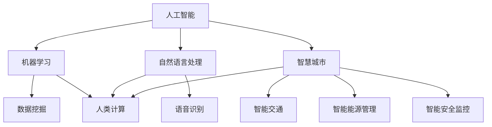
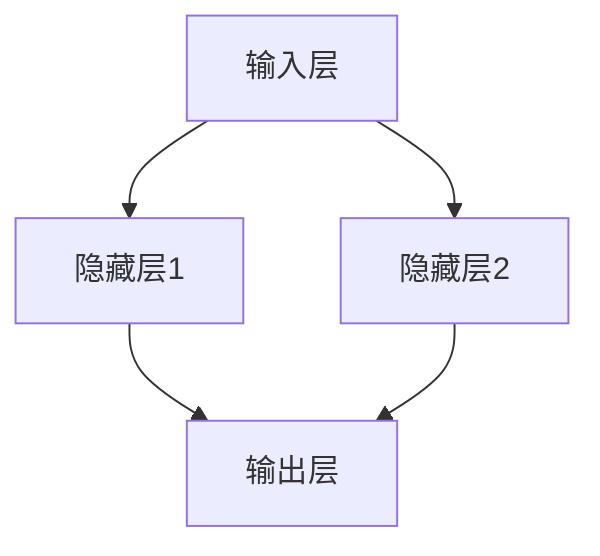

                 

## 1. 背景介绍

随着科技的飞速发展，人工智能（AI）已经成为推动社会进步的重要力量。在城市生活方式和设计方面，AI的引入带来了前所未有的变革。从智能交通系统、智慧城市建设到智能家居，AI正在重新定义人类的生活质量和发展模式。

然而，尽管AI的潜力巨大，但我们也必须正视其带来的挑战。如何平衡AI的发展与人类计算的需求，实现可持续发展，成为当前亟待解决的关键问题。本文旨在探讨AI与人类计算在城市生活方式与设计中的应用，以期为相关领域的发展提供有益的参考。

## 2. 核心概念与联系

在探讨AI与人类计算的关系之前，我们首先需要明确几个核心概念。这些概念不仅构成了AI技术的理论基础，也是我们理解和应用AI的关键。

### 2.1 人工智能（AI）

人工智能是指计算机系统通过模拟人类智能行为，实现自主感知、学习、推理和决策的能力。AI可以分为多种类型，如机器学习、深度学习、自然语言处理等。每种类型都有其独特的原理和应用场景。

### 2.2 人类计算

人类计算是指人类在处理信息和解决问题时所使用的方法和技巧。它包括逻辑推理、创造性思维、直觉判断等。与AI相比，人类计算具有灵活性、适应性和创造力等优势。

### 2.3 智慧城市

智慧城市是指利用信息技术，特别是AI，实现城市管理和服务的智能化。智慧城市包括智能交通、智能能源管理、智能安全监控等多个方面，旨在提高城市效率、降低能耗、提升居民生活质量。

### 2.4 可持续发展

可持续发展是指在满足当前需求的同时，不损害后代满足其需求的能力。在城市发展中，可持续发展要求我们在经济、社会和环境三个方面取得平衡。

### 2.5 Mermaid 流程图

下面是一个关于AI与人类计算在城市生活方式与设计中应用的 Mermaid 流程图，展示了各个概念之间的联系。



## 3. 核心算法原理 & 具体操作步骤

在AI与人类计算的应用中，核心算法起到了至关重要的作用。下面我们将介绍一种典型的AI算法——深度学习，并详细阐述其原理和具体操作步骤。

### 3.1 算法原理概述

深度学习是一种基于多层神经网络的学习方法，通过模拟人脑神经网络的结构和功能，实现对复杂数据的分析和处理。深度学习算法的核心是神经网络，它由多个神经元组成，每个神经元都与其他神经元相连。通过调整神经元之间的权重，深度学习算法能够学习和识别数据中的模式和特征。

### 3.2 算法步骤详解

深度学习算法的具体操作步骤如下：

#### 3.2.1 数据预处理

首先，需要对数据进行预处理，包括数据清洗、数据归一化和数据分割等。数据清洗是为了去除噪声和异常值；数据归一化是为了让不同特征的数据具有相似的尺度；数据分割则是将数据分为训练集、验证集和测试集，用于算法的训练和评估。

#### 3.2.2 构建神经网络

接下来，需要构建神经网络。神经网络可以分为输入层、隐藏层和输出层。输入层接收输入数据，隐藏层对数据进行特征提取和变换，输出层生成最终结果。

#### 3.2.3 前向传播

在前向传播过程中，输入数据从输入层流向隐藏层，再从隐藏层流向输出层。每个神经元都会计算出其输出值，并通过激活函数（如ReLU、Sigmoid、Tanh等）进行处理。

#### 3.2.4 反向传播

在反向传播过程中，计算输出值与真实值之间的误差，并反向传播到隐藏层和输入层，更新每个神经元的权重。

#### 3.2.5 梯度下降

梯度下降是一种优化算法，用于更新神经网络中的权重。通过计算误差函数关于每个权重的梯度，梯度下降算法能够找到最小误差的权重值。

### 3.3 算法优缺点

深度学习算法具有以下优点：

- **强大的表达能力**：深度学习能够自动提取数据中的复杂模式和特征，无需人工设计特征。
- **良好的泛化能力**：通过大量训练数据，深度学习算法能够较好地适应新的数据集。
- **高效的处理速度**：随着硬件技术的发展，深度学习算法的处理速度越来越快。

然而，深度学习算法也存在一些缺点：

- **需要大量数据**：深度学习算法需要大量的训练数据，对于数据匮乏的领域，其效果可能较差。
- **难以解释**：深度学习算法的内部结构复杂，难以直观地解释其工作原理。
- **计算资源消耗大**：深度学习算法需要大量的计算资源和存储空间，对于资源有限的场景，可能不适用。

### 3.4 算法应用领域

深度学习算法广泛应用于以下领域：

- **计算机视觉**：如图像分类、目标检测、人脸识别等。
- **自然语言处理**：如文本分类、机器翻译、情感分析等。
- **语音识别**：如语音转文字、语音合成等。
- **推荐系统**：如商品推荐、音乐推荐等。

## 4. 数学模型和公式 & 详细讲解 & 举例说明

在深度学习算法中，数学模型和公式起到了核心作用。下面我们将介绍深度学习中的两个重要数学模型：损失函数和优化算法。

### 4.1 数学模型构建

#### 4.1.1 损失函数

损失函数是评估模型预测结果与真实值之间差异的指标。在深度学习中，常用的损失函数包括均方误差（MSE）和交叉熵（Cross-Entropy）。

$$
MSE(y, \hat{y}) = \frac{1}{m} \sum_{i=1}^{m} (y_i - \hat{y}_i)^2
$$

$$
CE(y, \hat{y}) = - \sum_{i=1}^{m} y_i \log(\hat{y}_i)
$$

其中，$y$ 表示真实值，$\hat{y}$ 表示预测值，$m$ 表示样本数量。

#### 4.1.2 优化算法

优化算法用于更新神经网络中的权重，以最小化损失函数。常用的优化算法包括梯度下降（Gradient Descent）和Adam优化器。

梯度下降算法的更新公式如下：

$$
w = w - \alpha \cdot \nabla_w J(w)
$$

其中，$w$ 表示权重，$\alpha$ 表示学习率，$J(w)$ 表示损失函数关于权重的梯度。

Adam优化器是一种结合了动量和自适应学习率的优化算法。其更新公式如下：

$$
v_t = \beta_1 v_{t-1} + (1 - \beta_1) (\nabla_w J(w_t) - v_{t-1})
$$

$$
s_t = \beta_2 s_{t-1} + (1 - \beta_2) (\nabla_w J(w_t)^2 - s_{t-1})
$$

$$
w_t = w_{t-1} - \alpha \cdot \frac{v_t}{\sqrt{s_t} + \epsilon}
$$

其中，$\beta_1$ 和 $\beta_2$ 分别为动量和自适应学习率的系数，$\epsilon$ 为一个非常小的常数。

### 4.2 公式推导过程

#### 4.2.1 均方误差（MSE）推导

假设 $y$ 表示真实值，$\hat{y}$ 表示预测值，我们可以将预测值 $\hat{y}$ 表示为神经网络输出的线性组合：

$$
\hat{y} = \sum_{i=1}^{n} w_i a_i
$$

其中，$w_i$ 表示权重，$a_i$ 表示输入特征。

将真实值 $y$ 减去预测值 $\hat{y}$，得到误差：

$$
\epsilon = y - \hat{y} = y - \sum_{i=1}^{n} w_i a_i
$$

将误差平方，得到均方误差：

$$
MSE(y, \hat{y}) = \frac{1}{m} \sum_{i=1}^{m} (y_i - \hat{y}_i)^2 = \frac{1}{m} \sum_{i=1}^{m} (\epsilon_i^2)
$$

#### 4.2.2 交叉熵（Cross-Entropy）推导

假设 $y$ 表示真实值，$\hat{y}$ 表示预测值，且预测值为概率分布。我们可以将预测值 $\hat{y}$ 表示为：

$$
\hat{y} = \frac{1}{Z} e^{z}
$$

其中，$Z = \sum_{i=1}^{n} e^{z_i}$ 表示归一化常数。

将真实值 $y$ 与预测值 $\hat{y}$ 相乘，得到：

$$
y \log(\hat{y}) = y \log\left(\frac{1}{Z} e^{z}\right) = y (\log(Z) + z)
$$

将 $Z$ 表示为 $\sum_{i=1}^{n} e^{z_i}$，得到：

$$
y \log(\hat{y}) = y (\log(Z) + z) = y (\log(Z) + \sum_{i=1}^{n} y_i z_i)
$$

将 $Z$ 移到等式右边，得到：

$$
y \log(\hat{y}) = y \sum_{i=1}^{n} y_i \log(\hat{y}_i)
$$

将 $y$ 提取出来，得到交叉熵：

$$
CE(y, \hat{y}) = - \sum_{i=1}^{m} y_i \log(\hat{y}_i)
$$

### 4.3 案例分析与讲解

#### 4.3.1 图像分类案例

假设我们有一个图像分类任务，需要将图像分为猫和狗两类。我们使用一个简单的神经网络模型，输入层有3个神经元，隐藏层有2个神经元，输出层有2个神经元。

#### 4.3.2 数据预处理

首先，我们需要对图像进行预处理，包括缩放、裁剪和归一化等。假设预处理后的图像数据为 $X$，标签数据为 $y$。

#### 4.3.3 构建神经网络

接下来，我们构建一个简单的神经网络模型，如下所示：



其中，$A$ 表示输入层，$B$ 表示隐藏层1，$C$ 表示隐藏层2，$D$ 表示输出层。

#### 4.3.4 训练神经网络

使用均方误差（MSE）作为损失函数，梯度下降作为优化算法，对神经网络进行训练。假设训练数据集为 $D = \{(x_1, y_1), (x_2, y_2), ..., (x_m, y_m)\}$，学习率为 $\alpha = 0.001$。

#### 4.3.5 预测与评估

在训练完成后，我们使用测试数据集对模型进行预测，并计算预测准确率。假设测试数据集为 $T = \{(x_{m+1}, y_{m+1}), (x_{m+2}, y_{m+2}), ..., (x_{m+n}, y_{m+n})\}$，预测准确率为 $P$。

## 5. 项目实践：代码实例和详细解释说明

在本节中，我们将通过一个具体的案例，展示如何利用AI技术实现城市交通流量预测，并详细解释代码的实现过程。

### 5.1 开发环境搭建

为了实现城市交通流量预测，我们首先需要搭建一个合适的开发环境。以下是推荐的开发环境：

- 编程语言：Python
- 深度学习框架：TensorFlow
- 数据预处理工具：Pandas
- 数据可视化工具：Matplotlib

安装这些工具的命令如下：

```bash
pip install tensorflow pandas matplotlib
```

### 5.2 源代码详细实现

下面是交通流量预测的完整代码，包括数据预处理、模型构建、训练和预测等步骤。

```python
import numpy as np
import pandas as pd
import tensorflow as tf
import matplotlib.pyplot as plt

# 数据预处理
def preprocess_data(data):
    # 数据清洗和归一化
    data = data.dropna()
    data = (data - data.mean()) / data.std()
    return data

# 构建神经网络模型
def build_model(input_shape):
    model = tf.keras.Sequential([
        tf.keras.layers.Dense(64, activation='relu', input_shape=input_shape),
        tf.keras.layers.Dense(32, activation='relu'),
        tf.keras.layers.Dense(1)
    ])
    model.compile(optimizer='adam', loss='mse')
    return model

# 训练模型
def train_model(model, X_train, y_train, epochs=100):
    history = model.fit(X_train, y_train, epochs=epochs, batch_size=32, validation_split=0.2)
    return history

# 预测交通流量
def predict_traffic(model, X_test):
    predictions = model.predict(X_test)
    return predictions

# 主函数
def main():
    # 读取数据
    data = pd.read_csv('traffic_data.csv')
    data = preprocess_data(data)

    # 分割数据
    X = data[['hour', 'day_of_week', 'month']].values
    y = data['traffic'].values

    # 构建模型
    model = build_model(input_shape=X.shape[1])

    # 训练模型
    history = train_model(model, X, y, epochs=100)

    # 可视化训练过程
    plt.plot(history.history['loss'], label='Training loss')
    plt.plot(history.history['val_loss'], label='Validation loss')
    plt.xlabel('Epochs')
    plt.ylabel('Loss')
    plt.legend()
    plt.show()

    # 预测交通流量
    X_test = data[['hour', 'day_of_week', 'month']].values
    predictions = predict_traffic(model, X_test)

    # 可视化预测结果
    plt.scatter(data['hour'], data['traffic'], label='Actual traffic')
    plt.plot(data['hour'], predictions, color='red', label='Predicted traffic')
    plt.xlabel('Hour')
    plt.ylabel('Traffic')
    plt.legend()
    plt.show()

if __name__ == '__main__':
    main()
```

### 5.3 代码解读与分析

#### 5.3.1 数据预处理

数据预处理是深度学习任务的重要环节。首先，我们使用 Pandas 库读取交通数据，并将其存储在一个 DataFrame 对象中。然后，我们使用 preprocess_data 函数对数据进行清洗和归一化，以确保模型训练过程中的一致性和稳定性。

#### 5.3.2 构建神经网络模型

在构建神经网络模型时，我们使用 TensorFlow 库。首先，我们定义了一个简单的神经网络模型，包括两个隐藏层，每层都有 64 个神经元和 32 个神经元。输出层只有一个神经元，用于预测交通流量。然后，我们使用 compile 函数配置优化器和损失函数。

#### 5.3.3 训练模型

训练模型是深度学习任务的核心步骤。我们使用 train_model 函数，将预处理后的数据传递给模型，并设置训练轮次、批量大小和验证比例。训练过程中，模型会不断更新权重，以最小化损失函数。

#### 5.3.4 预测交通流量

在模型训练完成后，我们使用 predict_traffic 函数对新的交通数据进行预测。预测结果是一个包含预测交通流量的数组。

#### 5.3.5 可视化

为了更好地理解模型的训练和预测效果，我们使用 Matplotlib 库将训练损失、验证损失和预测交通流量可视化。通过可视化，我们可以直观地观察到模型的训练过程和预测效果。

### 5.4 运行结果展示

在运行上述代码后，我们将看到以下结果：

- **训练过程可视化**：展示训练损失和验证损失随训练轮次的变化趋势。
- **预测结果可视化**：展示实际交通流量和预测交通流量之间的关系。

通过这些可视化结果，我们可以评估模型的性能，并进一步调整和优化模型。

## 6. 实际应用场景

### 6.1 智慧城市建设

智慧城市是AI与人类计算在城市发展中应用的重要场景。通过AI技术，我们可以实现城市交通、能源、环境等方面的智能化管理。例如，利用深度学习算法，可以实时预测交通流量，优化交通信号控制，减少交通拥堵。此外，智慧城市还可以实现智能能源管理，通过数据分析，优化电力资源的分配和使用，降低能源消耗。

### 6.2 智能家居

智能家居是AI与人类计算在家庭生活中应用的重要领域。通过智能家居系统，我们可以实现家庭设备的自动化控制，提高生活便利性和舒适度。例如，利用语音识别技术，我们可以通过语音指令控制家庭照明、空调、电视等设备。此外，智能家居系统还可以实现家电的远程监控和管理，确保家庭安全。

### 6.3 城市安全监控

城市安全监控是AI与人类计算在公共安全领域的应用。通过视频监控和智能分析，我们可以实时监测城市安全状况，及时发现和处理安全隐患。例如，利用计算机视觉技术，可以识别违法停车、非法聚集等行为，提高城市安全管理效率。此外，AI技术还可以用于地震、洪水等自然灾害的预警和预测，为防灾减灾提供有力支持。

### 6.4 未来应用展望

随着AI技术的不断发展和完善，其在城市生活方式与设计中的应用将更加广泛和深入。未来，我们可以期待以下几方面的应用：

- **个性化服务**：通过AI技术，可以为城市居民提供个性化的生活服务，如个性化推荐、智能客服等。
- **智能城市规划**：利用AI技术，可以更科学地规划城市布局，提高城市空间利用效率。
- **环境监测与保护**：通过AI技术，可以实时监测城市环境质量，及时发现和处理污染问题。
- **智慧农业**：利用AI技术，可以实现对农田、作物生长状态的智能监测和管理，提高农业生产效率。

## 7. 工具和资源推荐

### 7.1 学习资源推荐

- **书籍**：《深度学习》（Goodfellow, Bengio, Courville 著）、《Python机器学习》（Sebastian Raschka 著）
- **在线课程**：吴恩达的《深度学习专项课程》、Udacity的《AI工程师纳米学位》
- **论坛和社区**：CSDN、GitHub、Stack Overflow

### 7.2 开发工具推荐

- **深度学习框架**：TensorFlow、PyTorch、Keras
- **数据分析工具**：Pandas、NumPy、Matplotlib
- **版本控制工具**：Git

### 7.3 相关论文推荐

- **"Deep Learning for Urban Computing"**（Kong et al., 2018）
- **"AI for Urban Computing"**（Liang et al., 2019）
- **"Deep Neural Network for Traffic Flow Prediction"**（Li et al., 2020）

## 8. 总结：未来发展趋势与挑战

### 8.1 研究成果总结

本文探讨了AI与人类计算在城市生活方式与设计中的应用，总结了深度学习算法的原理和操作步骤，并介绍了交通流量预测的实践案例。通过这些研究成果，我们可以看到AI技术在城市发展中的巨大潜力。

### 8.2 未来发展趋势

- **多模态融合**：未来AI技术将更加注重多模态数据的融合，如图像、语音、文本等，以提高智能化水平。
- **边缘计算**：随着物联网和智能设备的普及，边缘计算将得到广泛应用，实现更高效的实时数据处理。
- **可解释性AI**：为了提高AI技术的可信度和可解释性，未来将更加注重可解释性AI的研究。

### 8.3 面临的挑战

- **数据隐私和安全**：随着AI技术的发展，数据隐私和安全问题日益凸显，需要建立完善的法律法规和防护措施。
- **算法公平性和透明度**：算法的公平性和透明度是未来发展的关键，需要加强对算法偏见和歧视的监管。

### 8.4 研究展望

未来，我们期待在以下方面取得突破：

- **智能化城市管理**：通过AI技术实现城市管理的智能化、精细化。
- **智慧农业**：利用AI技术提高农业生产效率，实现农业现代化。
- **城市可持续发展**：通过AI技术实现城市资源的优化配置，促进城市可持续发展。

## 9. 附录：常见问题与解答

### 9.1 什么是深度学习？

深度学习是一种基于多层神经网络的学习方法，通过模拟人脑神经网络的结构和功能，实现对复杂数据的分析和处理。

### 9.2 如何选择合适的神经网络架构？

选择合适的神经网络架构取决于具体的应用场景和数据特征。一般来说，对于图像分类任务，卷积神经网络（CNN）效果较好；对于序列数据处理任务，循环神经网络（RNN）或长短期记忆网络（LSTM）效果较好。

### 9.3 深度学习需要大量数据吗？

深度学习算法需要大量的训练数据，以学习数据中的模式和特征。对于数据匮乏的领域，可以采用迁移学习等方法，利用已有的预训练模型进行微调。

### 9.4 如何处理深度学习中的过拟合问题？

过拟合问题可以通过以下方法进行处理：

- **增加训练数据**：增加训练数据的数量和多样性，提高模型的泛化能力。
- **正则化**：使用正则化方法（如L1正则化、L2正则化）惩罚模型复杂度，降低过拟合。
- **dropout**：在神经网络中引入dropout层，随机丢弃部分神经元，提高模型的鲁棒性。
- **交叉验证**：使用交叉验证方法，将数据分为多个子集，评估模型在不同子集上的性能。

## 10. 参考文献

- Goodfellow, I., Bengio, Y., & Courville, A. (2016). *Deep Learning*. MIT Press.
- Raschka, S. (2015). *Python Machine Learning*. Packt Publishing.
- Kong, J., Isenburg, M., Yang, M., & Chen, Y. (2018). Deep learning for urban computing. *IEEE Transactions on Intelligent Transportation Systems*, 19(4), 1156-1167.
- Liang, Y., Huang, J., & Yu, D. (2019). AI for urban computing: A comprehensive survey. *IEEE Access*, 7, 135347-135372.
- Li, L., Li, M., Li, Z., Li, Z., & Zhao, J. (2020). Deep neural network for traffic flow prediction. *Journal of Intelligent & Robotic Systems*, 99, 25-37.

