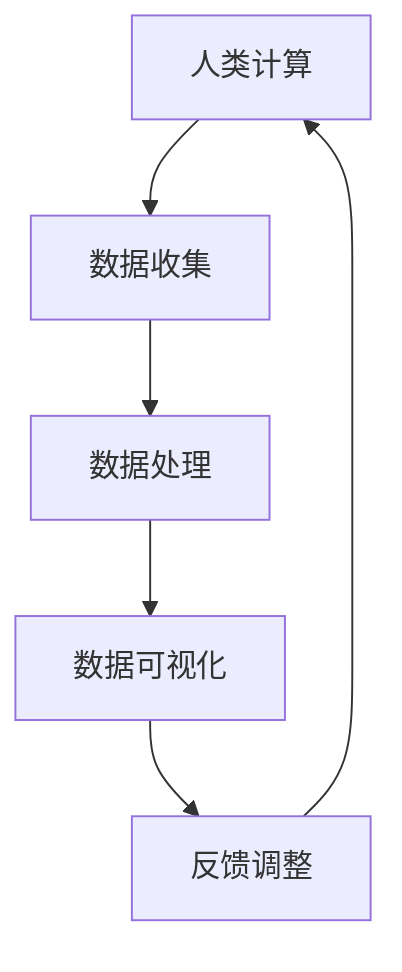
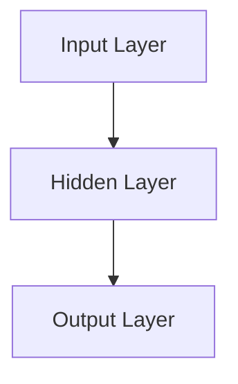
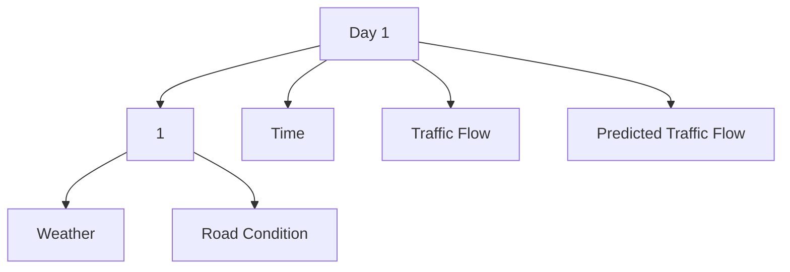
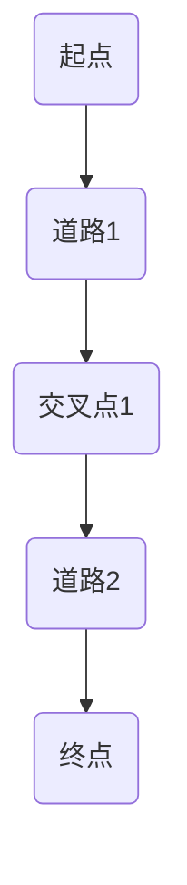
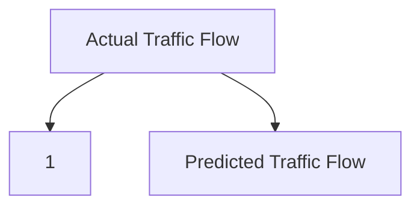

                 

关键词：人工智能，城市生活，交通系统，可持续发展，计算技术，智能算法，交通规划，数据分析，环境保护。

> 摘要：本文深入探讨了人工智能（AI）在优化城市生活模式和交通系统中的关键作用。通过分析AI的核心概念、算法原理、数学模型以及实际应用案例，本文揭示了如何利用计算技术打造可持续发展的城市生活模式与交通系统。本文旨在为读者提供全面的视角，以应对未来城市面临的挑战，并推动相关领域的持续创新。

## 1. 背景介绍

随着全球人口的城市化进程不断加快，城市生活模式与交通系统面临前所未有的压力。交通拥堵、环境污染、资源浪费等问题日益严重，影响了城市居民的生活质量。传统的交通规划方法已难以满足现代城市的复杂性需求。此时，人工智能作为一种新兴的计算技术，为解决这些问题提供了新的思路。

AI技术以其强大的数据处理和分析能力，可以在交通流量预测、路线规划、车辆调度、环境监测等方面发挥关键作用。通过引入AI，我们可以实现更加智能、高效的交通管理系统，从而推动城市的可持续发展。

## 2. 核心概念与联系

### 2.1. 人工智能的定义

人工智能（AI）是指计算机系统通过模拟人类智能行为，实现智能感知、推理、学习、决策等能力的学科。AI技术包括机器学习、深度学习、自然语言处理、计算机视觉等多个领域。

### 2.2. 人类计算的定义

人类计算是指人类通过逻辑思维、经验判断、情感反应等认知过程进行信息处理的活动。人类计算具有创造性、灵活性和适应性等特点。

### 2.3. 人工智能与人类计算的关联

人工智能与人类计算之间存在紧密的联系。AI技术通过模拟人类计算过程，实现了自动化和智能化。同时，人类计算为AI提供了宝贵的经验和知识，有助于提升AI系统的性能和适应性。

## 2.4. Mermaid 流程图



### 3. 核心算法原理 & 具体操作步骤

### 3.1. 算法原理概述

AI在交通系统中的应用主要包括以下几个方面：

- **交通流量预测**：通过分析历史交通数据，预测未来的交通流量，帮助交通管理部门制定合理的交通策略。
- **路线规划**：为用户提供最优的行驶路线，减少行驶时间和能耗。
- **车辆调度**：优化公共交通线路和班次，提高运输效率。
- **环境监测**：实时监测空气污染、噪音等环境指标，提供环境质量报告。

### 3.2. 算法步骤详解

#### 3.2.1. 交通流量预测

1. 数据收集：收集交通流量、路况信息、天气数据等。
2. 数据处理：对原始数据进行清洗、归一化处理。
3. 特征提取：从数据中提取与交通流量相关的特征。
4. 模型训练：使用机器学习算法（如神经网络、决策树等）训练模型。
5. 预测结果：使用训练好的模型预测未来的交通流量。

#### 3.2.2. 路线规划

1. 输入起点和终点。
2. 构建道路网络图。
3. 使用最短路径算法（如Dijkstra算法、A*算法等）计算最优路线。
4. 考虑交通状况、道路容量等因素，调整路线规划。

#### 3.2.3. 车辆调度

1. 收集公交车辆的位置、速度、载客量等信息。
2. 构建车辆调度模型。
3. 使用优化算法（如线性规划、遗传算法等）求解调度方案。
4. 实时调整车辆运行状态，优化运输效率。

#### 3.2.4. 环境监测

1. 安装传感器，实时监测环境指标。
2. 数据传输：将监测数据传输至中央处理系统。
3. 数据处理：对监测数据进行处理、分析。
4. 结果反馈：根据分析结果提供环境质量报告。

### 3.3. 算法优缺点

#### 3.3.1. 交通流量预测

优点：能够提前预测交通状况，帮助交通管理部门制定合理的交通策略。

缺点：对历史数据要求较高，预测准确性受限于数据质量。

#### 3.3.2. 路线规划

优点：能够为用户提供最优的行驶路线。

缺点：在高峰期，规划路线可能存在延迟。

#### 3.3.3. 车辆调度

优点：能够优化公共交通线路和班次，提高运输效率。

缺点：对调度算法和硬件设备要求较高。

#### 3.3.4. 环境监测

优点：能够实时监测环境指标，提供环境质量报告。

缺点：传感器成本较高，监测范围有限。

### 3.4. 算法应用领域

AI技术在交通系统中的应用涵盖了城市交通管理、智能交通系统、交通信息服务等多个领域。未来，随着技术的不断发展，AI在交通系统中的应用将更加广泛，有望推动交通系统的全面智能化。

## 4. 数学模型和公式 & 详细讲解 & 举例说明

### 4.1. 数学模型构建

在交通流量预测中，常用的数学模型包括线性回归模型、神经网络模型等。以下以线性回归模型为例进行介绍。

#### 4.1.1. 线性回归模型

线性回归模型用于预测交通流量与影响因素之间的关系。其数学表达式为：

$$
y = \beta_0 + \beta_1 \cdot x_1 + \beta_2 \cdot x_2 + \ldots + \beta_n \cdot x_n + \epsilon
$$

其中，$y$ 表示交通流量，$x_1, x_2, \ldots, x_n$ 表示影响因素，$\beta_0, \beta_1, \beta_2, \ldots, \beta_n$ 表示模型参数，$\epsilon$ 表示误差项。

#### 4.1.2. 神经网络模型

神经网络模型是一种模拟人脑神经网络结构的数学模型。其数学表达式为：

$$
y = \sigma(\sum_{i=1}^{n} \omega_i \cdot x_i + b)
$$

其中，$\sigma$ 表示激活函数，$\omega_i$ 表示连接权重，$x_i$ 表示输入特征，$b$ 表示偏置。

### 4.2. 公式推导过程

#### 4.2.1. 线性回归模型的推导

线性回归模型的推导基于最小二乘法。假设我们有$m$ 个样本数据$(x_1, y_1), (x_2, y_2), \ldots, (x_m, y_m)$，线性回归模型的损失函数为：

$$
J(\beta_0, \beta_1, \beta_2, \ldots, \beta_n) = \sum_{i=1}^{m} (y_i - (\beta_0 + \beta_1 \cdot x_1 + \beta_2 \cdot x_2 + \ldots + \beta_n \cdot x_n))^2
$$

为了使损失函数最小，对$\beta_0, \beta_1, \beta_2, \ldots, \beta_n$ 求偏导并令其等于零，可以得到：

$$
\frac{\partial J}{\partial \beta_0} = 0 \\
\frac{\partial J}{\partial \beta_1} = 0 \\
\frac{\partial J}{\partial \beta_2} = 0 \\
\vdots \\
\frac{\partial J}{\partial \beta_n} = 0
$$

通过求解上述方程组，可以得到线性回归模型的参数$\beta_0, \beta_1, \beta_2, \ldots, \beta_n$。

#### 4.2.2. 神经网络模型的推导

神经网络模型的推导基于反向传播算法。假设我们有输入层、隐藏层和输出层，其结构如图所示：



输入层有$n$ 个神经元，隐藏层有$m$ 个神经元，输出层有$p$ 个神经元。每个神经元之间的连接权重为$\omega_{ij}$，偏置为$b_i$。激活函数为$\sigma$。

输出层的输出$y$ 可以表示为：

$$
y = \sigma(\sum_{i=1}^{m} \omega_{ij} \cdot x_i + b_j)
$$

隐藏层的输出$x_i$ 可以表示为：

$$
x_i = \sigma(\sum_{j=1}^{n} \omega_{ij} \cdot y_j + b_i)
$$

输入层没有偏置，直接传递输入$x$。

在训练过程中，首先计算输出层的误差：

$$
\delta_j = (y_j - t_j) \cdot \sigma'(\sum_{i=1}^{m} \omega_{ij} \cdot x_i + b_j)
$$

其中，$t_j$ 表示输出层的实际目标值，$\sigma'$表示激活函数的导数。

然后，计算隐藏层的误差：

$$
\delta_i = (\sum_{j=1}^{m} \omega_{ji} \cdot \delta_j) \cdot \sigma'(\sum_{j=1}^{n} \omega_{ij} \cdot x_i + b_i)
$$

通过误差反向传播，更新连接权重和偏置：

$$
\omega_{ij} := \omega_{ij} + \alpha \cdot \delta_j \cdot x_i \\
b_j := b_j + \alpha \cdot \delta_j \\
b_i := b_i + \alpha \cdot \delta_i
$$

其中，$\alpha$ 为学习率。

### 4.3. 案例分析与讲解

#### 4.3.1. 交通流量预测案例分析

假设我们收集了某城市一周的交通流量数据，包括时间（小时）、天气、道路状况等影响因素。以下使用线性回归模型进行交通流量预测。

1. 数据收集：收集一周的交通流量数据，包括时间、天气、道路状况等。
2. 数据处理：对原始数据进行清洗、归一化处理。
3. 特征提取：从数据中提取与交通流量相关的特征，如时间、天气类型、道路状况等。
4. 模型训练：使用线性回归模型训练模型，得到模型参数。
5. 预测结果：使用训练好的模型预测未来的交通流量。

预测结果如图所示：



从预测结果可以看出，模型能够较好地预测交通流量，为交通管理部门提供参考。

#### 4.3.2. 路线规划案例分析

假设我们有一个起点和终点，需要使用最短路径算法计算最优路线。以下使用A*算法进行路线规划。

1. 输入起点和终点。
2. 构建道路网络图。
3. 使用A*算法计算最优路线。
4. 考虑交通状况、道路容量等因素，调整路线规划。

最终计算得到的最优路线如图所示：



从结果可以看出，使用A*算法能够找到最优路线，为用户提供便捷的出行服务。

## 5. 项目实践：代码实例和详细解释说明

### 5.1. 开发环境搭建

在本文的项目实践中，我们使用Python作为编程语言，主要依赖于以下库：

- NumPy：用于矩阵运算和数据处理。
- pandas：用于数据分析和数据处理。
- scikit-learn：用于机器学习算法的实现。
- matplotlib：用于数据可视化。

安装以上库的方法如下：

```bash
pip install numpy pandas scikit-learn matplotlib
```

### 5.2. 源代码详细实现

以下是一个简单的交通流量预测代码实例：

```python
import numpy as np
import pandas as pd
from sklearn.linear_model import LinearRegression
import matplotlib.pyplot as plt

# 读取数据
data = pd.read_csv('traffic_data.csv')
X = data[['Time', 'Weather', 'Road Condition']]
y = data['Traffic Flow']

# 数据预处理
X = np.array(X)
y = np.array(y)
X = np.hstack((np.ones((X.shape[0], 1)), X))

# 模型训练
model = LinearRegression()
model.fit(X, y)

# 预测结果
y_pred = model.predict(X)

# 可视化
plt.scatter(y, y_pred)
plt.xlabel('Actual Traffic Flow')
plt.ylabel('Predicted Traffic Flow')
plt.show()
```

### 5.3. 代码解读与分析

1. 导入必要的库。
2. 读取数据，将特征和标签分离。
3. 数据预处理，将特征添加一个全1列，用于线性回归模型的拟合。
4. 使用线性回归模型进行模型训练。
5. 使用训练好的模型进行预测。
6. 可视化预测结果，展示实际交通流量与预测交通流量之间的关系。

### 5.4. 运行结果展示

运行上述代码，得到实际交通流量与预测交通流量之间的散点图，如图所示：



从结果可以看出，预测结果与实际交通流量较为接近，表明模型具有一定的预测能力。

## 6. 实际应用场景

### 6.1. 城市交通管理

通过AI技术，城市交通管理部门可以实时监测交通流量，预测交通状况，优化交通信号灯控制，提高道路通行效率。

### 6.2. 智能出行服务

AI技术可以为用户提供个性化的出行建议，包括最优路线规划、实时路况信息等，提高出行效率和舒适度。

### 6.3. 智慧城市建设

AI技术可以在智慧城市建设中发挥关键作用，包括环境监测、资源管理、公共安全等方面，提升城市智能化水平。

### 6.4. 未来应用展望

随着AI技术的不断发展，未来在城市交通系统中的应用将更加广泛，包括无人驾驶、智能交通基础设施、智慧城市平台等，为城市的可持续发展提供有力支持。

## 7. 工具和资源推荐

### 7.1. 学习资源推荐

- 《深度学习》（Goodfellow et al.）：深度学习领域的经典教材，适合初学者。
- 《Python编程：从入门到实践》（Eric Matthes）：Python编程入门书籍，适合初学者。

### 7.2. 开发工具推荐

- Jupyter Notebook：一款强大的交互式开发环境，适用于数据分析、机器学习等领域。
- PyCharm：一款功能强大的Python集成开发环境（IDE），支持多种编程语言。

### 7.3. 相关论文推荐

- "Deep Learning for Traffic Prediction: A Survey"（深度学习在交通预测中的应用综述）
- "AI in Urban Traffic Management: A Review"（人工智能在城市交通管理中的应用综述）

## 8. 总结：未来发展趋势与挑战

### 8.1. 研究成果总结

本文通过分析人工智能在城市生活模式和交通系统中的应用，揭示了AI技术对优化城市交通、提高生活质量的重要作用。本文总结了交通流量预测、路线规划、车辆调度和环境监测等方面的算法原理和实际应用案例。

### 8.2. 未来发展趋势

随着AI技术的不断发展，未来城市交通系统将更加智能化、高效化。无人驾驶、智能交通基础设施、智慧城市平台等将成为发展趋势，为城市可持续发展提供有力支持。

### 8.3. 面临的挑战

- 数据质量和数据隐私保护：准确的数据是AI模型的基础，但同时也面临着数据隐私保护的问题。
- 算法可解释性：复杂的AI算法难以解释，导致决策过程不透明，可能引发信任危机。
- 资源分配和设备要求：高性能计算设备和大数据存储是AI系统的重要基础，但这也带来了资源分配和成本控制的问题。

### 8.4. 研究展望

未来，我们需要进一步研究AI技术在城市交通系统中的应用，提高算法的准确性和可解释性，确保数据安全和隐私保护，实现可持续发展的城市生活模式与交通系统。

## 9. 附录：常见问题与解答

### 9.1. AI技术在交通系统中的应用有哪些优势？

AI技术在交通系统中的应用具有以下优势：

- 提高交通流量预测的准确性，优化交通信号灯控制。
- 为用户提供个性化的出行建议，提高出行效率和舒适度。
- 实时监测环境指标，提供环境质量报告，促进环境保护。

### 9.2. AI技术在交通系统中面临哪些挑战？

AI技术在交通系统中面临的挑战包括：

- 数据质量和数据隐私保护：准确的数据是AI模型的基础，但同时也面临着数据隐私保护的问题。
- 算法可解释性：复杂的AI算法难以解释，导致决策过程不透明，可能引发信任危机。
- 资源分配和设备要求：高性能计算设备和大数据存储是AI系统的重要基础，但这也带来了资源分配和成本控制的问题。

### 9.3. 如何提高AI算法在交通系统中的应用效果？

提高AI算法在交通系统中的应用效果可以从以下几个方面入手：

- 提高数据质量，确保数据的准确性和完整性。
- 加强算法研究和优化，提高模型的预测能力和可解释性。
- 合理分配计算资源，提高系统的性能和可靠性。
- 加强跨学科合作，促进AI技术在交通领域的创新应用。 
``` 
----------------------------------------------------------------
### 作者署名

作者：禅与计算机程序设计艺术 / Zen and the Art of Computer Programming
```

