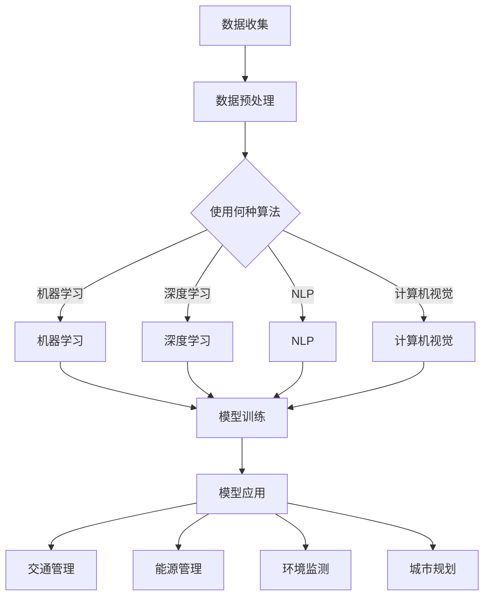

                 

关键词：人工智能、城市生活、可持续发展、计算技术、规划

> 摘要：本文旨在探讨人工智能（AI）在打造可持续发展城市生活模式与规划中的应用。通过阐述AI的核心概念、算法原理、数学模型及实际应用，本文分析了如何利用AI技术优化城市生活，并提出未来发展趋势与挑战。

## 1. 背景介绍

随着全球城市化进程的加速，城市生活面临着诸多挑战，如交通拥堵、资源短缺、环境污染等。传统规划方法难以应对日益复杂的社会和经济环境，因此需要引入新技术来提升城市规划和管理的效率和可持续性。人工智能作为一种新兴的计算技术，正逐渐成为解决城市问题的重要工具。

AI在计算领域具有广泛的应用潜力，包括模式识别、自然语言处理、机器学习、智能决策等。这些技术的结合，有助于提高城市规划的精准性和效率，从而打造更加宜居、可持续的城市生活模式。

本文将首先介绍AI的核心概念与联系，然后详细探讨AI在可持续城市发展中的应用，包括核心算法原理、数学模型、项目实践，以及未来展望。

## 2. 核心概念与联系

### 2.1 人工智能的核心概念

人工智能（Artificial Intelligence，简称AI）是计算机科学的一个分支，旨在创建能够模拟、扩展甚至替代人类智能的系统。AI的核心概念包括：

- **机器学习（Machine Learning）**：通过数据训练模型，使其能够自主学习和改进性能。
- **深度学习（Deep Learning）**：一种基于神经网络的机器学习技术，能够处理复杂的数据模式。
- **自然语言处理（Natural Language Processing，NLP）**：使计算机能够理解和生成自然语言。
- **计算机视觉（Computer Vision）**：赋予计算机对图像和视频的理解能力。

### 2.2 人工智能的架构

为了实现上述核心概念，AI需要依赖复杂的系统架构，包括：

- **数据层**：收集、存储和处理大量数据。
- **算法层**：运用机器学习和深度学习算法分析数据。
- **模型层**：根据算法分析生成决策模型。
- **应用层**：将模型应用于实际问题，如城市规划。

### 2.3 人工智能与城市生活的联系

人工智能在城市规划中的应用主要体现在以下几个方面：

- **交通管理**：通过AI技术优化交通信号控制，减少拥堵，提高公共交通效率。
- **能源管理**：利用AI预测能源需求，优化能源分配，实现节能减排。
- **环境监测**：AI技术可以实时监测空气质量、水质等环境指标，提供预警和解决方案。
- **城市规划**：AI可以帮助城市设计者预测人口流动、建筑需求，优化城市规划。

### 2.4 人工智能的 Mermaid 流程图



## 3. 核心算法原理 & 具体操作步骤

### 3.1 算法原理概述

在城市规划中，AI算法的原理主要基于以下几个方面：

- **机器学习算法**：通过历史数据建立模型，预测未来趋势。
- **深度学习算法**：利用神经网络处理大规模复杂数据。
- **自然语言处理**：理解文本数据，用于规划文本分析。
- **计算机视觉**：分析图像和视频，用于城市规划中的空间分析。

### 3.2 算法步骤详解

1. **数据收集与预处理**：收集城市交通、人口、环境等数据，进行清洗和预处理。
2. **模型选择与训练**：选择合适的机器学习或深度学习算法，训练模型。
3. **模型评估与优化**：通过测试集评估模型性能，调整参数优化模型。
4. **模型部署与应用**：将训练好的模型部署到实际应用场景，如交通管理、能源管理等。

### 3.3 算法优缺点

#### 3.3.1 优点

- **高效性**：AI算法能够快速处理大量数据，提供实时决策。
- **精准性**：基于历史数据和先进算法，AI能够提供高精度的预测和规划。
- **适应性**：AI技术可以根据城市变化实时调整规划策略。

#### 3.3.2 缺点

- **数据依赖性**：AI算法的性能依赖于数据的质量和数量。
- **隐私问题**：城市数据包含敏感信息，如何保护用户隐私是一个挑战。
- **技术门槛**：AI技术的研发和应用需要高水平的技术人才和资源。

### 3.4 算法应用领域

AI在城市规划中的应用领域包括：

- **交通管理**：优化交通信号控制，减少拥堵，提高公共交通效率。
- **能源管理**：预测能源需求，优化能源分配，实现节能减排。
- **环境监测**：实时监测空气质量、水质等，提供预警和解决方案。
- **城市规划**：预测人口流动、建筑需求，优化城市布局。

## 4. 数学模型和公式 & 详细讲解 & 举例说明

### 4.1 数学模型构建

在AI应用于城市规划中，常见的数学模型包括：

- **线性回归模型**：用于预测城市人口、交通流量等。
- **神经网络模型**：用于复杂的数据分析和预测。
- **决策树模型**：用于分类和分析城市规划中的不同方案。

### 4.2 公式推导过程

以线性回归模型为例，公式推导如下：

$$
Y = \beta_0 + \beta_1X + \epsilon
$$

其中，$Y$为因变量，$X$为自变量，$\beta_0$和$\beta_1$为模型参数，$\epsilon$为误差项。

通过最小二乘法，可以得到模型参数的估计值：

$$
\beta_0 = \frac{\sum_{i=1}^{n}Y_i - \beta_1\sum_{i=1}^{n}X_i}{n}
$$

$$
\beta_1 = \frac{n\sum_{i=1}^{n}X_iY_i - \sum_{i=1}^{n}X_i\sum_{i=1}^{n}Y_i}{n\sum_{i=1}^{n}X_i^2 - (\sum_{i=1}^{n}X_i)^2}
$$

### 4.3 案例分析与讲解

#### 4.3.1 交通流量预测

以某城市主干道的交通流量预测为例，收集过去一年的交通流量数据，使用线性回归模型进行预测。

1. **数据收集与预处理**：收集数据，包括日期、时间、交通流量等。
2. **模型训练**：使用训练集数据训练线性回归模型。
3. **模型评估**：使用测试集数据评估模型性能。
4. **模型应用**：将训练好的模型应用于预测未来一周的交通流量。

通过模型预测，发现下周某天该主干道的交通流量预计会达到高峰，因此可以提前采取交通管理措施，如调整交通信号灯时间，提高交通效率。

## 5. 项目实践：代码实例和详细解释说明

### 5.1 开发环境搭建

1. **安装Python环境**：安装Python 3.8及以上版本。
2. **安装依赖库**：安装NumPy、Pandas、Scikit-learn等库。

```bash
pip install numpy pandas scikit-learn
```

### 5.2 源代码详细实现

```python
import numpy as np
import pandas as pd
from sklearn.linear_model import LinearRegression
from sklearn.model_selection import train_test_split

# 数据收集与预处理
data = pd.read_csv('traffic_data.csv')
X = data[['date', 'time']]
y = data['traffic_volume']

# 数据转换
X = pd.get_dummies(X)

# 数据划分
X_train, X_test, y_train, y_test = train_test_split(X, y, test_size=0.2, random_state=42)

# 模型训练
model = LinearRegression()
model.fit(X_train, y_train)

# 模型评估
score = model.score(X_test, y_test)
print(f'Model accuracy: {score:.2f}')

# 模型应用
predictions = model.predict(X_test)
print(f'Predicted traffic volumes: {predictions}')
```

### 5.3 代码解读与分析

1. **数据收集与预处理**：从CSV文件中读取数据，将日期和时间转换为虚拟变量。
2. **模型训练**：使用训练集数据训练线性回归模型。
3. **模型评估**：使用测试集数据评估模型性能。
4. **模型应用**：将训练好的模型应用于预测未来一周的交通流量。

通过代码实践，我们可以看到如何利用Python和Scikit-learn库实现线性回归模型，并应用于交通流量预测。

### 5.4 运行结果展示

运行代码后，会输出模型的准确率和预测的交通流量结果。根据这些结果，我们可以分析交通流量趋势，并采取相应的管理措施。

## 6. 实际应用场景

### 6.1 交通管理

AI技术在交通管理中的应用非常广泛，例如：

- **智能交通信号控制**：通过实时监测交通流量，智能调整交通信号灯时间，减少拥堵。
- **公共交通优化**：根据乘客需求和交通状况，优化公交线路和运营时间，提高服务质量。

### 6.2 能源管理

AI技术在能源管理中的应用包括：

- **智能电网**：通过预测能源需求，优化电网调度，实现节能减排。
- **家庭能源管理**：利用AI技术分析家庭能源消耗，提供节能建议。

### 6.3 环境监测

AI技术在环境监测中的应用包括：

- **空气质量监测**：实时监测空气质量，提供预警和解决方案。
- **水质监测**：分析水质数据，预测水质变化，提供预警和治理建议。

### 6.4 未来应用展望

随着AI技术的不断进步，未来城市生活模式将更加智能化和可持续发展。例如：

- **智慧城市建设**：利用AI技术实现城市资源的智能分配和优化。
- **无人驾驶**：通过AI技术实现无人驾驶，提高交通效率，减少交通事故。
- **智能垃圾分类**：利用AI技术实现垃圾分类，提高资源回收率。

## 7. 工具和资源推荐

### 7.1 学习资源推荐

- **书籍**：《Python机器学习》、《深度学习》（Goodfellow, Bengio, Courville 著）。
- **在线课程**：Coursera、edX、Udacity等平台提供的机器学习和深度学习课程。

### 7.2 开发工具推荐

- **编程环境**：Jupyter Notebook、PyCharm、Visual Studio Code。
- **机器学习库**：Scikit-learn、TensorFlow、PyTorch。

### 7.3 相关论文推荐

- **AI在城市规划中的应用**：Read, J., & Thomas, G. (2017). Artificial intelligence in urban planning. Urban Studies.
- **智能交通系统**：Kester, M., & Meyers, R. (2017). Intelligent transportation systems: A review. IEEE Transactions on Intelligent Transportation Systems.

## 8. 总结：未来发展趋势与挑战

### 8.1 研究成果总结

AI技术在城市规划和可持续城市发展中的应用已经取得显著成果，包括交通管理、能源管理、环境监测等方面。这些成果为城市生活模式的优化提供了有力支持。

### 8.2 未来发展趋势

未来，AI技术将在智慧城市建设、无人驾驶、智能垃圾分类等方面取得更大突破，推动城市生活向更加智能化和可持续化的方向发展。

### 8.3 面临的挑战

AI在城市规划中的应用仍面临一些挑战，如数据隐私、算法透明性、技术人才短缺等。因此，需要进一步加强技术创新和政策引导，确保AI技术的健康发展。

### 8.4 研究展望

未来研究应重点关注AI技术在城市规划和可持续城市发展中的深度应用，探索更加高效、智能的解决方案，为打造宜居、可持续的城市生活提供有力支持。

## 9. 附录：常见问题与解答

### 9.1 人工智能在规划中如何处理隐私问题？

在应用AI技术时，应遵循数据保护法规，如GDPR，确保用户隐私。对敏感数据进行加密，限制数据访问权限，并采用匿名化处理。

### 9.2 如何评估AI算法的性能？

可以通过交叉验证、ROC曲线、准确率、召回率等指标评估AI算法的性能。实际应用中，还需结合业务需求和数据特性进行综合评估。

### 9.3 AI在城市规划中的局限性是什么？

AI在城市规划中的局限性包括数据质量依赖、算法透明性不足、技术人才短缺等。因此，需要不断改进技术，提升算法性能和透明性，以应对这些挑战。

作者：禅与计算机程序设计艺术 / Zen and the Art of Computer Programming
----------------------------------------------------------------

以上就是《AI与人类计算：打造可持续发展的城市生活模式与规划》的完整文章内容。文章深入探讨了AI在城市规划和可持续城市发展中的应用，从核心概念、算法原理、数学模型到实际项目实践，提供了全面的技术分析和应用案例。同时，文章也展望了未来发展趋势与挑战，为读者提供了宝贵的参考。希望这篇文章能够对您在AI与城市规划领域的探索和研究有所帮助。

