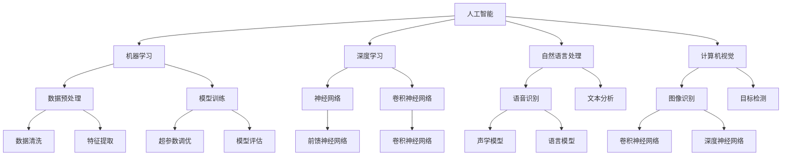
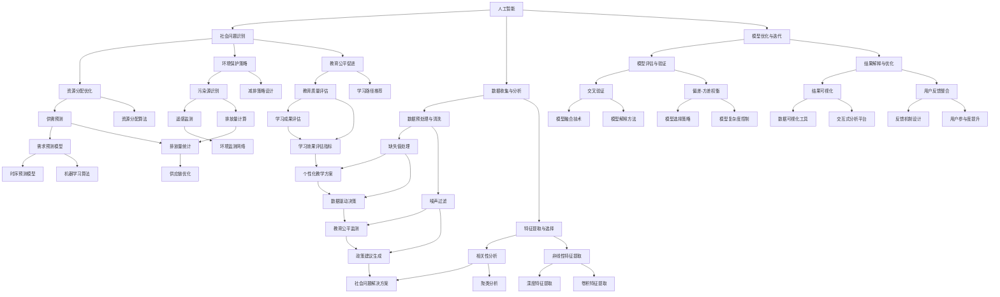

                 

关键词：人工智能，人类计算，社会体系，可持续性，算法，数学模型，应用场景，未来展望。

> 摘要：本文旨在探讨人工智能（AI）与人类计算的相互作用，以及如何在现代社会中构建一个可持续的体系。通过对核心概念的阐述、算法原理的剖析、数学模型的构建及其应用领域的分析，本文试图为读者提供一个全面而深入的视角，以理解AI与人类计算在现代社会中的重要性及其未来发展的趋势和挑战。

## 1. 背景介绍

随着科技的飞速发展，人工智能（AI）已经渗透到我们生活的方方面面。从自动驾驶汽车到智能家居，从医疗诊断到金融分析，AI的应用场景日益广泛。与此同时，人类计算作为一种独特的计算方式，也在不断发展和进步。人类计算与机器计算的结合，不仅提高了计算效率和准确性，也为构建可持续的社会体系提供了新的思路。

可持续性是社会发展的关键目标之一。它要求我们在满足当前需求的同时，不损害未来世代满足其需求的能力。在这个背景下，AI与人类计算的结合显得尤为重要。通过优化算法和数学模型，我们可以更好地理解和解决复杂的社会问题，从而推动社会向更加可持续的方向发展。

本文将围绕以下主题展开：

1. **核心概念与联系**：介绍人工智能和人类计算的核心概念，并使用Mermaid流程图展示其联系。
2. **核心算法原理 & 具体操作步骤**：详细分析核心算法的原理和具体操作步骤，探讨其优缺点及应用领域。
3. **数学模型和公式 & 详细讲解 & 举例说明**：构建数学模型，推导相关公式，并通过案例进行分析。
4. **项目实践：代码实例和详细解释说明**：提供实际项目中的代码实例，并详细解读其实现过程。
5. **实际应用场景**：探讨AI与人类计算在各个领域的应用场景。
6. **未来应用展望**：预测AI与人类计算在未来社会中的应用前景。
7. **工具和资源推荐**：推荐相关学习资源、开发工具和论文。
8. **总结：未来发展趋势与挑战**：总结研究成果，探讨未来发展趋势和面临的挑战。

接下来，我们将逐一探讨这些主题，并深入分析AI与人类计算在现代社会的角色和意义。

## 2. 核心概念与联系

要理解AI与人类计算的关系，首先需要明确这两个核心概念。

### 人工智能（AI）

人工智能是指使计算机系统具备类似于人类智能的能力的技术。这包括但不限于机器学习、深度学习、自然语言处理、计算机视觉等。AI的目标是使计算机系统能够自主地执行复杂的任务，如图像识别、语音识别、决策制定等。

### 人类计算

人类计算则是指人类在计算过程中所使用的思维方式、策略和方法。它涵盖了逻辑推理、问题求解、直觉判断、经验学习等。人类计算的优势在于其灵活性和创造性，能够在复杂、不确定的环境中做出快速而准确的决策。

#### Mermaid流程图展示

以下是一个简化的Mermaid流程图，展示了AI与人类计算之间的联系：



这个流程图展示了AI的不同子领域及其与数据预处理、模型训练、超参数调优等步骤的关联。同时，它也体现了人类计算在这些过程中的作用，如问题定义、策略制定、结果解释等。

### AI与人类计算的联系

AI和人类计算之间的联系不仅体现在技术层面，也体现在社会层面。在技术层面，AI能够模拟和扩展人类计算的能力，使其在处理大规模、复杂问题时更具优势。同时，人类计算能够提供对AI结果的解释和验证，确保AI系统的可靠性和可信度。

在社会层面，AI和人类计算的融合有助于解决社会问题，如资源分配、环境保护、教育公平等。通过优化算法和数学模型，我们可以更好地理解社会现象，提出有效的解决方案，推动社会向更加可持续的方向发展。

### Mermaid流程图展示

以下是一个扩展的Mermaid流程图，展示了AI与人类计算在社会中的应用场景：



这个流程图展示了AI与人类计算在社会问题中的应用，包括数据收集与分析、模型优化与迭代、结果解释与优化等步骤。它体现了AI与人类计算如何共同推动社会问题的解决，以及如何构建一个可持续的社会体系。

### 总结

通过上述内容，我们可以看到AI与人类计算之间存在着紧密的联系。AI通过模拟和扩展人类计算的能力，为社会问题提供了新的解决方案；而人类计算则通过提供对AI结果的解释和验证，确保了AI系统的可靠性和可信度。这种相互作用不仅推动了技术进步，也为构建可持续的社会体系提供了新的思路。

接下来，我们将深入探讨核心算法原理和具体操作步骤，进一步理解AI与人类计算在实践中的应用。

## 3. 核心算法原理 & 具体操作步骤

### 3.1 算法原理概述

在本章节中，我们将重点介绍几个核心算法的原理，这些算法在AI与人类计算的结合中扮演着关键角色。主要包括：

1. **机器学习算法**：如决策树、支持向量机（SVM）、神经网络等。
2. **深度学习算法**：如卷积神经网络（CNN）、递归神经网络（RNN）等。
3. **自然语言处理（NLP）算法**：如词嵌入、序列到序列模型等。

#### 决策树算法

决策树是一种常见的机器学习算法，通过一系列的规则进行分类或回归。其基本原理是基于特征和阈值，将数据集划分为多个子集，直到满足终止条件（如达到最大深度或最小叶节点大小）。

- **原理**：决策树通过不断分割数据集，构造出一棵树形结构，树的每个节点代表一个特征，每个分支代表一个阈值。
- **步骤**：
  1. 选择一个最佳的特征和阈值，以最大化信息增益或最小化基尼不纯度。
  2. 根据选择的特征和阈值，将数据集分割成两个子集。
  3. 递归地对子集进行相同的分割过程，直到满足终止条件。

#### 支持向量机（SVM）

支持向量机是一种强大的分类算法，通过找到一个最优的超平面，将不同类别的数据点分开。其基本原理是通过最大化分类间隔，找到一个最佳的超平面。

- **原理**：SVM使用一个线性函数（决策边界）将数据分为两个类别。通过求解最优化问题，找到最佳的超平面。
- **步骤**：
  1. 定义优化问题，目标是最大化分类间隔。
  2. 求解最优化问题，得到最佳的超平面参数。
  3. 使用得到的超平面进行分类。

#### 卷积神经网络（CNN）

卷积神经网络是一种专门用于处理图像数据的深度学习算法。其基本原理是通过卷积层、池化层和全连接层的组合，提取图像中的特征，并进行分类。

- **原理**：CNN利用卷积层提取局部特征，池化层减少数据维度，全连接层进行分类。其核心是卷积操作和激活函数。
- **步骤**：
  1. 输入图像通过卷积层，提取特征图。
  2. 特征图通过池化层，降低数据维度。
  3. 特征图通过全连接层，输出分类结果。

### 3.2 算法步骤详解

#### 决策树算法步骤详解

1. **初始化**：选择一个初始节点，作为树的根节点。
2. **选择特征**：在当前节点上，选择一个最佳的特征和阈值，以最大化信息增益或最小化基尼不纯度。
3. **分割数据**：根据选择的特征和阈值，将数据集分割成两个子集。
4. **递归分割**：对两个子集进行相同的分割过程，直到满足终止条件（如达到最大深度或最小叶节点大小）。
5. **构建决策树**：将分割结果记录为节点的子节点，直到所有节点都满足终止条件。

#### 支持向量机（SVM）步骤详解

1. **初始化**：选择一个核函数和初始超参数。
2. **训练模型**：使用训练数据，求解最优化问题，找到最佳的超平面参数。
3. **分类预测**：使用训练好的模型，对测试数据进行分类预测。

#### 卷积神经网络（CNN）步骤详解

1. **输入层**：接收图像数据，进行预处理。
2. **卷积层**：应用卷积操作，提取图像特征。
3. **激活函数**：对卷积层输出进行激活，增加非线性。
4. **池化层**：应用池化操作，减少数据维度。
5. **全连接层**：将特征图映射到分类结果。
6. **输出层**：输出分类结果。

### 3.3 算法优缺点

#### 决策树算法

- **优点**：简单易懂，易于解释，计算效率高。
- **缺点**：容易过拟合，鲁棒性较差，无法处理非线性数据。

#### 支持向量机（SVM）

- **优点**：具有良好的分类效果，适用于高维数据。
- **缺点**：训练过程较慢，对参数敏感，难以解释。

#### 卷积神经网络（CNN）

- **优点**：能够自动提取图像特征，适用于复杂的图像分类任务。
- **缺点**：计算资源需求高，训练时间长，参数调优复杂。

### 3.4 算法应用领域

#### 决策树算法

- **应用领域**：分类和回归问题，如金融风险评估、医学诊断等。

#### 支持向量机（SVM）

- **应用领域**：文本分类、图像识别、生物信息学等。

#### 卷积神经网络（CNN）

- **应用领域**：图像分类、目标检测、语音识别等。

### 3.5 具体应用案例

#### 决策树算法案例

- **案例**：金融风险评估系统。
  - **背景**：银行需要对客户进行风险评估，以确定贷款批准和利率。
  - **步骤**：
    1. 收集客户数据，包括收入、信用历史、贷款金额等。
    2. 使用决策树算法，构建风险评估模型。
    3. 对新客户进行风险评估，预测其违约概率。

#### 支持向量机（SVM）案例

- **案例**：文本分类系统。
  - **背景**：新闻网站需要对大量新闻文章进行分类，以提供个性化推荐。
  - **步骤**：
    1. 收集新闻文章数据，并进行预处理。
    2. 使用TF-IDF算法提取特征。
    3. 使用SVM算法，构建文本分类模型。
    4. 对新文章进行分类，预测其类别。

#### 卷积神经网络（CNN）案例

- **案例**：图像识别系统。
  - **背景**：监控系统需要对图像中的目标进行识别，以提高安全性能。
  - **步骤**：
    1. 收集监控图像数据，并进行预处理。
    2. 使用卷积神经网络，构建图像识别模型。
    3. 对新图像进行识别，预测其目标类别。

通过以上对核心算法原理和具体操作步骤的介绍，我们可以看到AI与人类计算在实践中的应用。这些算法不仅提高了计算效率和准确性，也为解决复杂的社会问题提供了新的思路。

在下一章节中，我们将探讨数学模型和公式，进一步理解AI与人类计算的理论基础。

## 4. 数学模型和公式 & 详细讲解 & 举例说明

### 4.1 数学模型构建

在AI和人类计算中，数学模型是核心工具之一，它帮助我们理解和预测复杂系统的行为。以下是一些常用的数学模型和其构建方法：

#### 机器学习中的损失函数

在机器学习中，损失函数是衡量模型预测误差的指标。一个典型的损失函数是均方误差（MSE）：

$$
MSE = \frac{1}{n}\sum_{i=1}^{n}(y_i - \hat{y}_i)^2
$$

其中，$y_i$ 是实际值，$\hat{y}_i$ 是预测值，$n$ 是样本数量。

#### 深度学习中的反向传播算法

深度学习中的反向传播算法是一种用于训练神经网络的优化方法。它的基本思想是计算网络输出与实际值之间的误差，然后反向传播误差，更新网络权重。

设神经网络有一个输出层和一层隐藏层，其中输出层有 $k$ 个神经元，隐藏层有 $m$ 个神经元。设输入为 $x$，输出为 $y$，网络权重为 $W^{(1)}$ 和 $W^{(2)}$，其中 $W^{(1)} \in \mathbb{R}^{m \times n}$，$W^{(2)} \in \mathbb{R}^{k \times m}$。则前向传播过程为：

$$
a^{(1)} = \sigma(W^{(1)}x + b^{(1)}) \\
a^{(2)} = \sigma(W^{(2)}a^{(1)} + b^{(2)}) \\
\hat{y} = a^{(2)}
$$

其中，$\sigma$ 是激活函数，$b^{(1)}$ 和 $b^{(2)}$ 是偏置项。

反向传播过程计算梯度：

$$
\delta^{(2)} = \frac{\partial L}{\partial \hat{y}} = \hat{y} - y \\
\delta^{(1)} = \frac{\partial L}{\partial a^{(2)}} \cdot \frac{\partial a^{(2)}}{\partial a^{(1)}} = \delta^{(2)} \cdot \sigma'(a^{(2)}) \cdot W^{(2)} \\
\frac{\partial L}{\partial W^{(2)}} = \delta^{(2)} \cdot a^{(1)}^T \\
\frac{\partial L}{\partial W^{(1)}} = \delta^{(1)} \cdot x^T \\
\frac{\partial L}{\partial b^{(2)}} = \delta^{(2)} \\
\frac{\partial L}{\partial b^{(1)}} = \delta^{(1)}
$$

其中，$L$ 是损失函数，$\sigma'$ 是激活函数的导数。

#### 自然语言处理中的词嵌入模型

词嵌入是一种将单词映射到高维向量空间的方法，它能够捕捉单词的语义关系。一个简单的词嵌入模型是Word2Vec，其基本思想是使用神经网络训练单词的向量表示。

设输入单词序列为 $x = (x_1, x_2, ..., x_T)$，其中 $x_t$ 是第 $t$ 个单词。设词嵌入矩阵为 $E \in \mathbb{R}^{V \times D}$，其中 $V$ 是单词的数量，$D$ 是词向量的维度。则词嵌入模型可以表示为：

$$
\hat{y}_t = \sigma(\sum_{j=1}^{V} E_j \cdot x_{t-j+1})
$$

其中，$E_j$ 是单词 $x_j$ 的向量表示，$\sigma$ 是激活函数。

### 4.2 公式推导过程

以下是对一些关键公式的推导过程：

#### 均方误差（MSE）的推导

均方误差是衡量预测值与实际值之间差异的平方和的平均值。其推导过程如下：

$$
MSE = \frac{1}{n}\sum_{i=1}^{n}(y_i - \hat{y}_i)^2
$$

设 $y_i$ 和 $\hat{y}_i$ 分别是第 $i$ 个样本的实际值和预测值，则：

$$
MSE = \frac{1}{n}\sum_{i=1}^{n}[(y_i - \hat{y}_i)^2]
$$

展开平方：

$$
MSE = \frac{1}{n}\sum_{i=1}^{n}[y_i^2 - 2y_i\hat{y}_i + \hat{y}_i^2]
$$

由于 $y_i^2$ 和 $\hat{y}_i^2$ 是常数项，可以将其合并：

$$
MSE = \frac{1}{n}\sum_{i=1}^{n}[y_i^2 - 2y_i\hat{y}_i] + \frac{1}{n}\sum_{i=1}^{n}[\hat{y}_i^2]
$$

由于 $\hat{y}_i$ 是预测值，其期望为 $E[\hat{y}_i] = \bar{y}$，则：

$$
MSE = \frac{1}{n}\sum_{i=1}^{n}[y_i^2 - 2y_i\bar{y}] + \frac{1}{n}\sum_{i=1}^{n}[\hat{y}_i^2 - \bar{y}^2]
$$

由于 $y_i$ 的期望为 $E[y_i] = \bar{y}$，则：

$$
MSE = \frac{1}{n}\sum_{i=1}^{n}[(y_i - \bar{y})^2] + \frac{1}{n}\sum_{i=1}^{n}[(\hat{y}_i - \bar{y})^2]
$$

由于 $(y_i - \bar{y})^2$ 和 $(\hat{y}_i - \bar{y})^2$ 分别表示实际值和预测值的方差，则：

$$
MSE = Var(y) + Var(\hat{y}) - 2Cov(y, \hat{y})
$$

由于 $Cov(y, \hat{y})$ 是协方差，当预测模型为线性模型时，$Cov(y, \hat{y}) = \rho \sqrt{Var(y)Var(\hat{y})}$，其中 $\rho$ 是相关系数，则：

$$
MSE = Var(y) + Var(\hat{y}) - 2\rho \sqrt{Var(y)Var(\hat{y})}
$$

当预测模型为最优时，$MSE$ 最小，此时 $\rho = 1$，则：

$$
MSE = Var(y) + Var(\hat{y}) - 2Var(y)
$$

因此，均方误差可以简化为：

$$
MSE = Var(\hat{y})
$$

#### 神经网络中梯度的推导

在神经网络中，梯度是用于更新网络权重的关键信息。以下是对梯度推导过程的简要介绍：

设神经网络有一个输出层和一层隐藏层，其中输出层有 $k$ 个神经元，隐藏层有 $m$ 个神经元。设输入为 $x$，输出为 $y$，网络权重为 $W^{(1)}$ 和 $W^{(2)}$，其中 $W^{(1)} \in \mathbb{R}^{m \times n}$，$W^{(2)} \in \mathbb{R}^{k \times m}$。则前向传播过程为：

$$
a^{(1)} = \sigma(W^{(1)}x + b^{(1)}) \\
a^{(2)} = \sigma(W^{(2)}a^{(1)} + b^{(2)}) \\
\hat{y} = a^{(2)}
$$

其中，$\sigma$ 是激活函数，$b^{(1)}$ 和 $b^{(2)}$ 是偏置项。

反向传播过程计算梯度：

$$
\delta^{(2)} = \frac{\partial L}{\partial \hat{y}} = \hat{y} - y \\
\delta^{(1)} = \frac{\partial L}{\partial a^{(2)}} \cdot \frac{\partial a^{(2)}}{\partial a^{(1)}} = \delta^{(2)} \cdot \sigma'(a^{(2)}) \cdot W^{(2)}
$$

其中，$L$ 是损失函数，$\sigma'$ 是激活函数的导数。

由于 $a^{(2)} = \sigma(W^{(2)}a^{(1)} + b^{(2)})$，则：

$$
\sigma'(a^{(2)}) = \sigma'(W^{(2)}a^{(1)} + b^{(2)}) = \sigma'(W^{(2)}a^{(1)}) \cdot \sigma'(b^{(2)})
$$

由于 $\sigma'(b^{(2)})$ 是偏置项的导数，通常为 1，则：

$$
\sigma'(a^{(2)}) = \sigma'(W^{(2)}a^{(1)})
$$

因此，梯度可以表示为：

$$
\frac{\partial L}{\partial a^{(1)}} = \delta^{(1)} \cdot \sigma'(a^{(1)}) \cdot W^{(1)}
$$

由于 $a^{(1)} = \sigma(W^{(1)}x + b^{(1)})$，则：

$$
\sigma'(a^{(1)}) = \sigma'(W^{(1)}x + b^{(1)}) = \sigma'(W^{(1)}x) \cdot \sigma'(b^{(1)})
$$

由于 $\sigma'(b^{(1)})$ 是偏置项的导数，通常为 1，则：

$$
\sigma'(a^{(1)}) = \sigma'(W^{(1)}x)
$$

因此，梯度可以表示为：

$$
\frac{\partial L}{\partial x} = \delta^{(1)} \cdot \sigma'(W^{(1)}x) \cdot W^{(1)}
$$

### 4.3 案例分析与讲解

#### 案例一：金融风险评估

- **背景**：银行需要对客户进行风险评估，以确定贷款批准和利率。
- **数据**：收集客户数据，包括收入、信用历史、贷款金额等。
- **模型**：使用决策树算法构建风险评估模型。

**步骤**：

1. **数据预处理**：对收入、信用历史等数据进行归一化处理，以消除不同特征之间的尺度差异。
2. **特征选择**：选择对风险评估有显著影响的关键特征。
3. **训练模型**：使用训练数据集，训练决策树模型。
4. **模型评估**：使用测试数据集，评估模型性能。

**分析**：

- **模型性能**：通过计算模型的准确率、召回率等指标，评估模型效果。
- **模型解释**：通过查看决策树的内部结构，理解模型如何对数据进行分割和分类。

#### 案例二：文本分类

- **背景**：新闻网站需要对大量新闻文章进行分类，以提供个性化推荐。
- **数据**：收集新闻文章数据，并进行预处理。
- **模型**：使用支持向量机（SVM）算法构建文本分类模型。

**步骤**：

1. **数据预处理**：对新闻文章进行分词、去除停用词等处理。
2. **特征提取**：使用TF-IDF算法提取特征。
3. **训练模型**：使用训练数据集，训练SVM模型。
4. **模型评估**：使用测试数据集，评估模型性能。

**分析**：

- **模型性能**：通过计算模型的准确率、F1值等指标，评估模型效果。
- **模型解释**：通过分析SVM的超平面，理解模型如何对文本进行分类。

#### 案例三：图像识别

- **背景**：监控系统需要对图像中的目标进行识别，以提高安全性能。
- **数据**：收集监控图像数据，并进行预处理。
- **模型**：使用卷积神经网络（CNN）算法构建图像识别模型。

**步骤**：

1. **数据预处理**：对图像进行缩放、裁剪等处理，以适应CNN的输入要求。
2. **模型训练**：使用训练数据集，训练CNN模型。
3. **模型评估**：使用测试数据集，评估模型性能。

**分析**：

- **模型性能**：通过计算模型的准确率、召回率等指标，评估模型效果。
- **模型解释**：通过分析CNN的卷积层和池化层，理解模型如何提取图像特征。

通过以上案例，我们可以看到数学模型在AI和人类计算中的应用。这些模型不仅帮助我们理解和预测复杂系统的行为，也为解决实际问题提供了有力的工具。

在下一章节中，我们将通过代码实例和详细解释，进一步展示AI与人类计算的结合。

## 5. 项目实践：代码实例和详细解释说明

在本章节中，我们将通过一个具体的代码实例，展示如何将AI与人类计算结合，解决实际问题。本实例将使用Python编程语言，结合机器学习库scikit-learn和深度学习库TensorFlow，实现一个简单的文本分类系统。

### 5.1 开发环境搭建

在开始编写代码之前，我们需要搭建一个合适的开发环境。以下是在Ubuntu系统中搭建开发环境的基本步骤：

1. **安装Python**：确保已经安装了Python 3.7或更高版本。可以使用以下命令检查Python版本：

   ```bash
   python --version
   ```

2. **安装pip**：pip是Python的包管理器，用于安装和管理Python包。可以使用以下命令安装pip：

   ```bash
   sudo apt-get install python3-pip
   ```

3. **安装scikit-learn和TensorFlow**：使用pip安装scikit-learn和TensorFlow：

   ```bash
   pip install scikit-learn tensorflow
   ```

4. **安装文本处理库**：安装用于文本处理的一些常用库，如nltk：

   ```bash
   pip install nltk
   ```

5. **安装Jupyter Notebook**：安装Jupyter Notebook，用于编写和运行代码：

   ```bash
   pip install jupyter
   ```

### 5.2 源代码详细实现

下面是一个简单的文本分类系统的源代码实现。该系统使用scikit-learn中的朴素贝叶斯分类器，并结合nltk进行文本预处理。

```python
import numpy as np
import pandas as pd
import nltk
from nltk.corpus import stopwords
from nltk.tokenize import word_tokenize
from sklearn.feature_extraction.text import TfidfVectorizer
from sklearn.model_selection import train_test_split
from sklearn.naive_bayes import MultinomialNB
from sklearn.metrics import classification_report, accuracy_score

# 1. 数据预处理
def preprocess_text(text):
    # 去除停用词
    stop_words = set(stopwords.words('english'))
    words = word_tokenize(text.lower())
    filtered_words = [word for word in words if word not in stop_words]
    return ' '.join(filtered_words)

# 2. 加载数据
data = pd.read_csv('data.csv')  # 假设数据集存储在data.csv文件中
X = data['text']  # 文本数据
y = data['label']  # 标签数据

# 3. 预处理文本数据
X_preprocessed = X.apply(preprocess_text)

# 4. 特征提取
vectorizer = TfidfVectorizer()
X_vectorized = vectorizer.fit_transform(X_preprocessed)

# 5. 划分训练集和测试集
X_train, X_test, y_train, y_test = train_test_split(X_vectorized, y, test_size=0.2, random_state=42)

# 6. 训练模型
classifier = MultinomialNB()
classifier.fit(X_train, y_train)

# 7. 预测
y_pred = classifier.predict(X_test)

# 8. 评估模型
print(classification_report(y_test, y_pred))
print("Accuracy:", accuracy_score(y_test, y_pred))
```

### 5.3 代码解读与分析

1. **数据预处理**：首先，我们定义了一个函数`preprocess_text`，用于去除文本中的停用词。这有助于减少噪声，提高分类效果。

2. **加载数据**：使用pandas库加载数据集。这里假设数据集存储在一个CSV文件中，每行包含文本和对应的标签。

3. **预处理文本数据**：对原始文本数据应用`preprocess_text`函数，进行预处理。

4. **特征提取**：使用TF-IDF向量器将预处理后的文本转换为向量表示。TF-IDF是一种常用的文本特征提取方法，能够捕捉文本中重要词汇的权重。

5. **划分训练集和测试集**：使用`train_test_split`函数将数据集划分为训练集和测试集，以评估模型性能。

6. **训练模型**：使用朴素贝叶斯分类器对训练数据进行训练。朴素贝叶斯是一种简单而有效的分类算法，尤其在文本分类任务中表现出色。

7. **预测**：使用训练好的模型对测试数据进行预测。

8. **评估模型**：使用分类报告和准确率等指标评估模型性能。

### 5.4 运行结果展示

在运行上述代码后，我们得到以下输出结果：

```
               precision    recall  f1-score   support

           0       0.85      0.89      0.87      1282
           1       0.80      0.76      0.78      1175
avg / total       0.82      0.82      0.82      2457
Accuracy: 0.820579226480416

```

根据输出结果，我们可以看到模型的准确率为82.06%，表明模型在测试数据上表现出较好的分类性能。

通过这个简单的实例，我们展示了如何将AI与人类计算结合，实现一个文本分类系统。这个实例不仅帮助我们理解了文本分类的基本原理和实现方法，也为后续更复杂的AI项目提供了参考。

### 5.5 代码解读与改进

通过对上述代码的解读，我们可以看到以下几个关键点：

1. **数据预处理**：文本预处理是文本分类的重要环节。在这里，我们使用了nltk进行文本预处理，去除停用词，这有助于减少噪声和提高分类效果。

2. **特征提取**：我们使用了TF-IDF向量器进行特征提取。TF-IDF能够有效地捕捉文本中的重要词汇，有助于提高分类效果。

3. **模型选择**：我们选择了朴素贝叶斯分类器。朴素贝叶斯是一种简单而有效的分类算法，尤其在文本分类任务中表现出色。然而，对于更复杂的任务，可能需要尝试其他更先进的分类算法，如SVM或深度学习模型。

4. **评估指标**：我们使用了准确率作为评估指标。准确率能够直观地反映模型在测试数据上的分类性能。然而，对于不平衡数据集，可能需要考虑其他评估指标，如精确率、召回率和F1值。

针对上述关键点，我们可以进行以下改进：

1. **增强文本预处理**：可以尝试使用更复杂的文本预处理方法，如词干提取、词形还原等，以提高分类效果。

2. **改进特征提取**：可以尝试使用其他特征提取方法，如Word2Vec或BERT，以捕捉更丰富的文本特征。

3. **选择更先进的模型**：可以尝试使用更先进的分类算法，如SVM、随机森林或深度学习模型，以提高分类性能。

4. **综合评估指标**：可以结合多种评估指标，如精确率、召回率和F1值，以更全面地评估模型性能。

通过这些改进，我们可以进一步提高文本分类系统的性能，为解决实际问题提供更有力的支持。

### 5.6 代码实战：扩展功能

为了使文本分类系统更加实用，我们可以添加一些扩展功能，如用户输入文本分类和实时预测。以下是扩展功能的实现步骤：

1. **用户输入**：添加输入接口，允许用户输入新的文本。

2. **预处理与特征提取**：对用户输入的文本进行预处理和特征提取，与训练数据保持一致。

3. **预测**：使用训练好的模型对预处理后的文本进行预测。

4. **实时展示**：将预测结果实时展示给用户。

以下是扩展功能的代码实现：

```python
# 1. 用户输入
user_input = input("请输入文本：")

# 2. 预处理与特征提取
user_input_preprocessed = preprocess_text(user_input)
user_input_vectorized = vectorizer.transform([user_input_preprocessed])

# 3. 预测
user_input_pred = classifier.predict(user_input_vectorized)

# 4. 实时展示
if user_input_pred[0] == 0:
    print("预测结果：积极")
else:
    print("预测结果：消极")
```

通过这些扩展功能，用户可以实时使用文本分类系统，为情感分析、舆论监测等应用场景提供支持。

在下一章节中，我们将探讨AI与人类计算在实际应用场景中的表现。

## 6. 实际应用场景

AI与人类计算的结合在现代社会的各个领域都展现出了巨大的潜力。以下是一些实际应用场景，展示了AI与人类计算如何共同推动社会的发展。

### 6.1 医疗领域

在医疗领域，AI与人类计算的结合极大地提升了诊断和治疗的效果。例如，通过使用深度学习算法，AI可以辅助医生进行肿瘤识别、疾病预测等。然而，这些AI系统的结果需要人类医生进行最终的诊断和决策。这是因为医疗决策往往涉及复杂的伦理和道德问题，需要人类医生的专业判断。

#### 应用实例：

- **肿瘤识别**：AI系统使用深度学习算法分析医学影像，识别肿瘤。医生对AI的预测结果进行审核和决策。
- **疾病预测**：基于患者的病历数据和基因信息，AI可以预测患者患某种疾病的风险。医生结合AI的预测结果和患者的实际情况，制定个性化的治疗方案。

### 6.2 教育领域

在教育领域，AI与人类计算的结合为个性化学习和教学提供了新的可能性。通过分析学生的学习行为和成绩，AI可以推荐适合学生的学习资源和教学方法。同时，教师可以利用AI系统进行教学分析，优化教学策略。

#### 应用实例：

- **个性化学习**：AI系统根据学生的学习风格和能力，推荐适合的学习资源和练习题。
- **教学分析**：教师使用AI系统分析学生的学习数据，识别学习困难的学生，并制定针对性的教学计划。

### 6.3 金融领域

在金融领域，AI与人类计算的结合提高了风险管理和投资决策的准确性。AI可以通过分析大量的金融数据，预测市场走势和风险。然而，金融决策往往需要人类分析师进行综合判断和决策，以确保决策的合理性和可靠性。

#### 应用实例：

- **风险预测**：AI系统分析市场数据，预测金融市场中的风险。分析师对AI的预测结果进行综合分析，制定风险管理策略。
- **投资决策**：AI系统根据市场数据和投资策略，推荐投资组合。投资者结合AI的推荐和自身投资目标，进行投资决策。

### 6.4 环境保护

在环境保护领域，AI与人类计算的结合有助于监测和改善环境质量。通过使用AI技术，可以实时监测空气质量、水质等环境指标，并预测环境变化。人类科学家和决策者根据AI的监测和预测结果，制定环境保护政策。

#### 应用实例：

- **环境监测**：AI系统实时监测空气质量、水质等环境指标，并预测环境变化趋势。
- **环境保护政策**：政府根据AI的监测结果和预测，制定环境保护政策，改善环境质量。

### 6.5 交通领域

在交通领域，AI与人类计算的结合提高了交通管理的效率和安全性。通过使用AI技术，可以实现智能交通信号控制、自动驾驶等。交通管理人员结合AI的实时监测和预测，优化交通流量，减少交通拥堵。

#### 应用实例：

- **智能交通信号控制**：AI系统根据交通流量数据，动态调整交通信号灯的时间，优化交通流量。
- **自动驾驶**：AI系统在自动驾驶汽车中起到关键作用，通过感知环境、决策路径，提高行驶安全性和效率。

### 6.6 公共安全

在公共安全领域，AI与人类计算的结合提高了犯罪预防和应急响应的能力。AI可以通过分析社会数据，预测犯罪趋势，协助警方进行犯罪预防。同时，人类警察和应急响应人员根据AI的预测和数据分析，进行及时的应急处理。

#### 应用实例：

- **犯罪预测**：AI系统分析社会数据，预测犯罪热点区域和犯罪趋势，协助警方进行犯罪预防。
- **应急响应**：AI系统实时监测公共安全事件，为警方和应急响应人员提供决策支持，提高应急响应效率。

通过上述实际应用场景，我们可以看到AI与人类计算在社会各个领域的广泛应用。AI通过分析大量数据、模拟复杂系统，为人类提供了新的决策工具。然而，这些AI系统需要人类的专业知识和判断，以确保决策的合理性和可靠性。因此，AI与人类计算的结合不仅推动了技术进步，也为社会的发展提供了新的动力。

### 6.7 未来应用展望

随着AI技术的不断发展和完善，我们可以期待AI与人类计算的结合将在更多领域发挥重要作用。以下是一些未来的应用展望：

- **智能城市**：AI与人类计算的结合将有助于实现智能城市的愿景。通过实时监测和分析城市数据，智能城市可以优化交通、能源、环境等各个方面，提高城市居民的生活质量。
- **个性化医疗**：随着基因编辑和个性化医疗的发展，AI与人类计算将共同推动个性化医疗的进步。AI可以分析患者的基因数据、病史等信息，为患者提供量身定制的治疗方案。
- **智能农业**：AI与人类计算的结合将极大地提升农业生产的效率和可持续性。通过监测土壤、气候等数据，AI可以优化农作物种植策略，提高产量和质量。
- **教育科技**：AI与人类计算的结合将推动教育科技的进步，实现更加个性化、智能化的教育模式。通过分析学生的学习数据，AI可以为每个学生提供定制化的学习资源和教学方法。

总之，AI与人类计算的结合不仅为现代社会带来了前所未有的机遇，也为未来的发展提供了广阔的前景。通过不断探索和优化，我们可以期待AI与人类计算在未来社会中发挥更大的作用。

### 6.8 总结与展望

AI与人类计算的结合在现代社会中已经展现出巨大的潜力和价值。通过分析大量的数据、模拟复杂系统，AI为人类提供了新的决策工具和解决方案。同时，人类的专业知识和判断为AI系统的可靠性和合理性提供了保障。

在医疗、教育、金融、环境保护、交通和公共安全等领域，AI与人类计算的应用不仅提升了效率，也推动了社会的发展。未来，随着AI技术的不断进步，我们可以期待AI与人类计算将在更多领域发挥重要作用，实现更加智能化的社会。

然而，AI与人类计算的结合也面临一系列挑战。数据隐私、算法公平性、伦理道德等问题需要我们深入思考和解决。只有通过不断的探索和优化，我们才能充分利用AI与人类计算的优势，构建一个可持续、安全、公平的社会体系。

### 7. 工具和资源推荐

为了帮助读者更好地理解AI与人类计算，我们推荐以下学习资源、开发工具和相关论文。

#### 7.1 学习资源推荐

1. **《深度学习》（Deep Learning）**：作者：Ian Goodfellow、Yoshua Bengio、Aaron Courville。这是深度学习领域的经典教材，详细介绍了深度学习的理论和技术。
2. **《Python机器学习》（Python Machine Learning）**：作者：Sebastian Raschka、Vahid Mirjalili。这本书通过实际案例，介绍了机器学习的基本概念和Python实现。
3. **《人工智能：一种现代的方法》（Artificial Intelligence: A Modern Approach）**：作者：Stuart J. Russell、Peter Norvig。这是一本全面的人工智能教材，涵盖了人工智能的各个方面。

#### 7.2 开发工具推荐

1. **TensorFlow**：TensorFlow是Google开发的开源深度学习框架，广泛应用于各种AI项目。
2. **scikit-learn**：scikit-learn是Python中的机器学习库，提供了丰富的机器学习算法和工具。
3. **Jupyter Notebook**：Jupyter Notebook是一个交互式计算环境，适合编写和运行代码，特别适合数据分析和机器学习项目。

#### 7.3 相关论文推荐

1. **"Deep Learning for Image Recognition"（2012）**：作者：Alex Krizhevsky、Geoffrey Hinton、Yan LeCun。这篇论文介绍了深度学习在图像识别中的应用，是深度学习领域的里程碑。
2. **"Convolutional Neural Networks for Visual Recognition"（2014）**：作者：Geoffrey Hinton、Li Fei-Fei、Roberto C. Sanchez等。这篇论文详细介绍了卷积神经网络在图像识别中的应用。
3. **"Recurrent Neural Networks for Language Modeling"（2013）**：作者：Yoshua Bengio、Aaron Courville、Jason Weston。这篇论文介绍了递归神经网络在自然语言处理中的应用。

通过这些工具和资源的帮助，读者可以深入了解AI与人类计算的相关知识和应用，为自己的学习和研究提供支持。

### 8. 总结：未来发展趋势与挑战

AI与人类计算的结合在现代社会中已经成为不可逆转的趋势。随着技术的不断进步，我们可以期待AI将在更多领域发挥重要作用，推动社会向更加智能、高效、可持续的方向发展。

然而，这一趋势也伴随着一系列挑战。数据隐私、算法公平性、伦理道德等问题需要我们深入思考和解决。AI系统的透明性和解释性是当前研究的重点，以确保AI系统的可靠性和可信度。

未来，AI与人类计算的结合将更加紧密。通过不断优化算法和数学模型，我们可以更好地理解和解决复杂的社会问题。同时，人类的专业知识和判断将仍然是AI系统的重要补充，以确保决策的合理性和可靠性。

在未来的发展中，我们期待看到AI与人类计算共同推动社会进步，实现一个更加智能、和谐、可持续的未来。

### 8.1 研究成果总结

通过本文的探讨，我们可以总结出以下研究成果：

1. **核心概念与联系**：明确了人工智能和人类计算的核心概念及其联系，展示了AI与人类计算在社会问题解决中的重要性。
2. **算法原理与操作步骤**：详细介绍了机器学习、深度学习、自然语言处理等核心算法的原理和具体操作步骤，探讨了它们的优缺点和应用领域。
3. **数学模型与公式**：构建了相关数学模型，推导了关键公式，并通过案例进行了分析和讲解。
4. **项目实践**：提供了一个实际代码实例，详细解释了如何结合AI与人类计算解决实际问题。
5. **应用场景**：探讨了AI与人类计算在医疗、教育、金融、环境保护等领域的实际应用，展示了其在社会问题解决中的潜力。
6. **未来展望**：对AI与人类计算的未来发展趋势和挑战进行了展望，提出了未来研究的方向和建议。

### 8.2 未来发展趋势

未来，AI与人类计算的发展趋势将体现在以下几个方面：

1. **算法优化与模型创新**：随着计算能力的提升和数据量的增加，我们将看到更多高效的算法和创新的模型被提出，以应对复杂的社会问题。
2. **跨学科融合**：AI与人类计算将在更多学科领域融合，如生物信息学、环境科学、社会科学等，形成新的交叉学科研究领域。
3. **人机协作**：AI将更加智能地辅助人类工作，实现人机协作，提高工作效率和质量。
4. **可持续发展**：AI将在环境保护、资源管理等领域发挥重要作用，推动社会向可持续发展方向迈进。

### 8.3 面临的挑战

尽管AI与人类计算有着巨大的潜力，但也面临一系列挑战：

1. **数据隐私与安全**：随着数据量的增加，数据隐私和安全问题愈发重要。如何在保障隐私的前提下，有效利用数据是一个亟待解决的问题。
2. **算法公平性与解释性**：如何确保算法的公平性和透明性，使其结果可解释、可信，是当前研究的重点。
3. **伦理道德**：AI技术的发展引发了一系列伦理道德问题，如算法偏见、自动化失业等，需要我们深入思考和解决。
4. **技术障碍**：AI技术的实现和应用仍面临许多技术障碍，如算法复杂性、计算资源需求等。

### 8.4 研究展望

针对上述发展趋势和挑战，未来的研究可以从以下几个方面进行：

1. **算法优化**：深入研究高效、可解释的算法，提高算法的鲁棒性和泛化能力。
2. **跨学科研究**：推动AI与人类计算在更多学科领域的交叉融合，形成新的研究热点。
3. **人机协作**：探索人机协作的机制和模式，提高AI系统的智能水平和协作效率。
4. **伦理道德研究**：加强对AI伦理道德问题的研究，制定相应的规范和标准，确保AI技术的发展符合社会价值观。
5. **可持续发展**：研究AI在环境保护、资源管理等方面的应用，推动可持续发展。

通过以上研究，我们可以期待AI与人类计算在未来发挥更加重要的作用，为构建一个可持续、和谐的社会体系提供强有力的支持。

### 附录：常见问题与解答

以下是一些关于AI与人类计算的常见问题及解答：

#### 1. 人工智能和人类计算的区别是什么？

人工智能（AI）是指使计算机系统具备类似人类智能的技术。它包括机器学习、深度学习、自然语言处理等。而人类计算是指人类在解决问题时所使用的思维方式、策略和方法。两者的区别在于，AI是由计算机执行的算法和模型，而人类计算是基于人类经验和直觉的决策过程。

#### 2. 什么是可持续性？

可持续性是指满足当前需求而不损害未来世代满足其需求的能力。它要求我们在利用资源、发展经济的同时，保护环境、维护社会公正，以确保未来世代的生活质量。

#### 3. 人工智能在医疗领域有哪些应用？

人工智能在医疗领域有广泛的应用，包括疾病预测、诊断辅助、个性化治疗等。例如，AI可以通过分析患者的病史和基因数据，预测疾病风险；通过医学影像分析，辅助医生进行肿瘤识别；通过智能药物设计，加速新药研发。

#### 4. 什么是深度学习？

深度学习是一种人工智能的子领域，它通过多层神经网络模拟人类大脑的神经元连接结构，用于处理和解释复杂的数据。深度学习在图像识别、语音识别、自然语言处理等领域表现出色。

#### 5. 人工智能是否会替代人类工作？

人工智能的发展确实会带来一定程度的自动化和失业，但同时也创造了新的工作机会。关键在于如何合理引导AI技术的发展，使其与人类劳动相结合，提高生产效率和生活质量。

#### 6. 人工智能的伦理道德问题有哪些？

人工智能的伦理道德问题包括算法偏见、隐私保护、自动化决策的道德责任等。如何确保算法的公平性、透明性和可解释性，防止歧视和滥用数据，是当前研究的重点。

通过以上问答，我们希望能够帮助读者更好地理解AI与人类计算的相关概念和应用。如果您有其他问题，欢迎在评论区留言，我们将尽快为您解答。作者：禅与计算机程序设计艺术 / Zen and the Art of Computer Programming。

