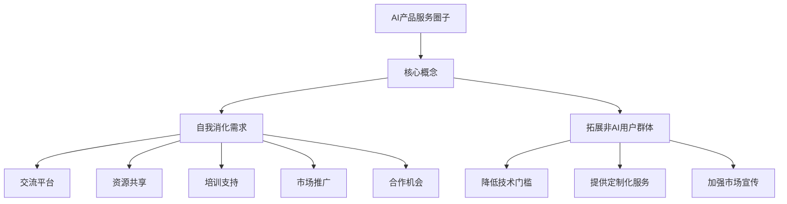

                 

关键词：AI产品服务、需求消化、非AI用户拓展、自我提升

> 摘要：本文将探讨如何构建一个AI产品服务圈子，以自我消化需求为核心，有效拓展非AI用户群体。通过分析AI产品服务的现状、用户需求以及潜在市场，提出一系列策略和解决方案，以帮助AI从业者提高产品服务质量，扩大市场影响力。

## 1. 背景介绍

随着人工智能技术的飞速发展，越来越多的企业开始将AI技术应用于各种场景，如数据分析、自然语言处理、图像识别等。这使得AI产品服务市场呈现出爆炸式增长。然而，在AI产品服务的推广和应用过程中，我们面临着一系列挑战：

1. **用户需求识别困难**：AI产品服务的目标用户往往具有多样化的需求，如何精准识别并满足这些需求成为一大难题。
2. **非AI用户群体拓展**：虽然AI技术在不断进步，但并非所有行业和企业都具备应用AI的条件。如何吸引和拓展非AI用户群体，成为AI产品服务市场的一大挑战。
3. **产品服务质量提升**：在竞争激烈的市场环境中，如何提高AI产品服务的质量，确保用户满意度，是每个AI从业者需要深思的问题。

本文旨在探讨如何构建一个AI产品服务圈子，通过自我消化需求和拓展非AI用户群体，实现AI产品服务的高质量发展。

### 1.1 AI产品服务的现状

当前，AI产品服务主要集中在以下几个领域：

1. **大数据分析**：利用机器学习算法，对海量数据进行分析和挖掘，为企业和用户提供决策支持。
2. **自然语言处理**：通过深度学习等技术，实现人机对话、文本生成、情感分析等功能。
3. **图像识别**：利用卷积神经网络等算法，实现图像分类、目标检测、图像生成等功能。
4. **自动化控制**：利用AI技术实现自动化控制，提高生产效率。

虽然AI产品服务在各个领域取得了显著成果，但同时也暴露出一些问题，如用户体验不佳、技术门槛高、安全性问题等。这些问题成为AI产品服务进一步推广和应用的主要障碍。

### 1.2 用户需求识别困难

AI产品服务的目标用户群体多样，包括企业、政府机构、科研院所等。这些用户的需求具有以下特点：

1. **个性化需求**：每个用户都有独特的需求，如何满足这些个性化需求，成为AI产品服务需要解决的核心问题。
2. **多样化需求**：用户需求不仅仅局限于某一领域，可能会涉及多个方面，如数据分析、自然语言处理、图像识别等。
3. **动态变化需求**：用户需求并非一成不变，可能会随着时间、环境、政策等因素的变化而发生变化。

识别和满足这些需求，需要AI产品服务提供者具备深厚的技术功底、敏锐的市场洞察力和高效的响应能力。

### 1.3 非AI用户群体拓展

尽管AI技术在不断进步，但并非所有行业和企业都具备应用AI的条件。例如，一些传统行业的企业，如农业、制造业等，可能缺乏足够的AI技术储备和人才。如何吸引和拓展这些非AI用户群体，成为AI产品服务市场的一大挑战。

拓展非AI用户群体，需要从以下几个方面入手：

1. **降低技术门槛**：通过简化AI产品服务的使用流程、提供易用的接口和工具，降低用户使用AI技术的难度。
2. **提供定制化服务**：根据非AI用户的需求，提供定制化的AI产品和服务，帮助他们解决实际问题。
3. **加强市场宣传**：通过多种渠道宣传AI技术的优势和案例，提高用户对AI技术的认知和接受度。
4. **提供培训和支持**：为非AI用户提供AI技术培训和技术支持，帮助他们更好地应用AI技术。

### 1.4 产品服务质量提升

在竞争激烈的市场环境中，提高AI产品服务质量，确保用户满意度，是每个AI从业者需要深思的问题。

提高产品服务质量，可以从以下几个方面入手：

1. **用户体验优化**：关注用户在使用AI产品服务过程中的体验，提供便捷、高效、友好的使用界面和操作流程。
2. **技术稳定性提升**：确保AI产品服务的稳定性和可靠性，降低故障率和错误率。
3. **安全性保障**：加强AI产品服务的安全性，防止数据泄露、隐私侵犯等安全问题。
4. **持续迭代优化**：根据用户反馈和市场变化，持续迭代和优化AI产品服务，提高用户满意度。

## 2. 核心概念与联系

### 2.1 AI产品服务圈子概念

AI产品服务圈子是指由AI从业者、用户、研究人员等组成的一个社区，旨在通过交流、合作、共享资源，共同推动AI产品服务的高质量发展。圈子中的成员可以共同探讨AI技术的最新进展、分享实践经验、发现和解决问题，从而提高自身的专业素养和产品服务质量。

### 2.2 自我消化需求

自我消化需求是指AI产品服务提供者在设计、开发、推广产品服务的过程中，主动识别和满足自身及团队的需求。通过自我消化需求，AI从业者可以更好地理解用户需求，提高产品服务质量，从而在市场竞争中脱颖而出。

### 2.3 拓展非AI用户群体

拓展非AI用户群体是指通过降低技术门槛、提供定制化服务、加强市场宣传等方式，吸引和拓展那些不具备AI技术储备和人才的行业和企业用户。通过拓展非AI用户群体，AI产品服务市场将得到进一步扩大，从而提高市场占有率。

### 2.4 AI产品服务圈子的架构

AI产品服务圈子的架构包括以下几个方面：

1. **交流平台**：提供线上和线下交流平台，方便成员之间的互动和沟通。
2. **资源共享**：建立资源库，共享技术文档、案例、工具等资源，帮助成员提高专业素养。
3. **培训支持**：提供AI技术培训和技术支持，帮助成员提升技能和应用能力。
4. **市场推广**：通过多种渠道宣传AI技术的优势和案例，提高用户对AI技术的认知和接受度。
5. **合作机会**：为成员提供合作机会，促进技术交流和项目合作，实现共同发展。

### 2.5 Mermaid 流程图



## 3. 核心算法原理 & 具体操作步骤

### 3.1 算法原理概述

在构建AI产品服务圈子的过程中，核心算法原理主要包括以下几个方面：

1. **用户需求识别**：通过数据挖掘、自然语言处理等技术，分析用户行为和反馈，识别用户的个性化需求。
2. **需求匹配**：将用户需求与AI产品服务进行匹配，为用户提供最适合的解决方案。
3. **个性化推荐**：根据用户的历史行为和偏好，为其推荐相关产品服务，提高用户体验和满意度。
4. **圈子管理**：通过数据分析和机器学习等技术，对圈子成员进行管理，提高圈子运营效率和成员满意度。

### 3.2 算法步骤详解

1. **用户需求识别**：
   - 数据收集：收集用户行为数据、反馈数据等。
   - 数据预处理：对收集到的数据进行清洗、去重、归一化等处理。
   - 特征提取：提取用户行为数据中的关键特征，如用户年龄、性别、兴趣爱好等。
   - 模型训练：使用机器学习算法，如决策树、支持向量机等，对特征进行训练，建立用户需求识别模型。

2. **需求匹配**：
   - 产品服务库建设：建立包含各类AI产品服务的数据库，对产品服务进行分类和标注。
   - 模型训练：使用机器学习算法，如协同过滤、基于内容的推荐等，对产品服务数据库进行训练，建立需求匹配模型。
   - 模型应用：根据用户需求识别模型和需求匹配模型，为用户提供合适的AI产品服务。

3. **个性化推荐**：
   - 用户画像构建：根据用户的历史行为和偏好，构建用户画像。
   - 推荐算法应用：使用基于用户画像的推荐算法，如协同过滤、基于内容的推荐等，为用户提供个性化推荐。
   - 推荐结果展示：将推荐结果以用户友好的方式展示，如推荐列表、推荐详情等。

4. **圈子管理**：
   - 成员数据收集：收集圈子成员的行为数据、反馈数据等。
   - 成员画像构建：根据成员的行为数据，构建成员画像。
   - 管理策略制定：根据成员画像，制定相应的管理策略，如邀请成员、成员评级等。
   - 管理效果评估：根据成员反馈和圈子运营数据，评估管理效果，持续优化管理策略。

### 3.3 算法优缺点

**优点**：

1. **高效性**：通过机器学习算法和数据分析技术，快速识别用户需求，提高需求匹配和个性化推荐的效率。
2. **精准性**：基于用户行为和偏好，为用户提供精准的推荐，提高用户体验和满意度。
3. **灵活性**：可根据用户需求和市场变化，灵活调整推荐算法和管理策略，提高圈子运营效率。

**缺点**：

1. **数据依赖性**：算法性能依赖于数据质量，如果数据质量较差，可能会导致推荐结果不准确。
2. **算法透明度**：机器学习算法的内部机制较为复杂，用户难以理解和信任推荐结果。
3. **计算资源消耗**：算法训练和应用过程中，需要大量的计算资源和存储资源，对硬件设备要求较高。

### 3.4 算法应用领域

核心算法在AI产品服务圈子中的应用领域包括：

1. **用户需求识别**：应用于各类AI产品服务的需求分析，如数据分析、自然语言处理、图像识别等。
2. **需求匹配**：应用于AI产品服务的推荐系统，为用户提供个性化的AI产品服务。
3. **个性化推荐**：应用于AI产品服务的用户体验优化，提高用户满意度和留存率。
4. **圈子管理**：应用于AI产品服务圈子的运营管理，提高圈子成员的参与度和活跃度。

## 4. 数学模型和公式 & 详细讲解 & 举例说明

### 4.1 数学模型构建

在构建AI产品服务圈子的过程中，常用的数学模型包括以下几种：

1. **线性回归模型**：用于分析用户需求与产品服务之间的关系，如：
   $$y = \beta_0 + \beta_1x_1 + \beta_2x_2 + ... + \beta_nx_n + \epsilon$$
   其中，$y$ 表示用户需求，$x_1, x_2, ..., x_n$ 表示产品服务的各项指标，$\beta_0, \beta_1, \beta_2, ..., \beta_n$ 表示模型参数，$\epsilon$ 表示误差项。

2. **逻辑回归模型**：用于分析用户是否接受某项产品服务，如：
   $$P(y=1) = \frac{1}{1 + e^{-(\beta_0 + \beta_1x_1 + \beta_2x_2 + ... + \beta_nx_n)}}$$
   其中，$P(y=1)$ 表示用户接受产品服务的概率，$\beta_0, \beta_1, \beta_2, ..., \beta_n$ 表示模型参数。

3. **协同过滤模型**：用于为用户推荐相似的产品服务，如：
   $$r_{ui} = \langle r_{uj}, r_{uk} \rangle - \mu + \alpha \sum_{v \in N_u \cap N_k} \frac{r_{uv}r_{vk}}{\|N_u\|_{2} \|N_k\|_{2}}$$
   其中，$r_{ui}$ 表示用户 $u$ 对产品服务 $i$ 的评分，$r_{uj}$ 和 $r_{uk}$ 分别表示用户 $u$ 对产品服务 $j$ 和 $k$ 的评分，$\langle r_{uj}, r_{uk} \rangle$ 表示用户 $u$ 对产品服务 $j$ 和 $k$ 的共同评分，$N_u$ 和 $N_k$ 分别表示用户 $u$ 和 $k$ 的邻居集合，$\mu$ 表示用户对所有产品服务的平均评分，$\alpha$ 表示调节参数。

### 4.2 公式推导过程

以线性回归模型为例，推导过程如下：

1. **目标函数**：假设我们有 $n$ 个样本点 $(x_1, y_1), (x_2, y_2), ..., (x_n, y_n)$，其中 $y = \beta_0 + \beta_1x_1 + \beta_2x_2 + ... + \beta_nx_n + \epsilon$。我们的目标是找到最佳拟合直线，使得所有样本点到直线的距离之和最小。

2. **损失函数**：损失函数可以是平方误差损失函数，即：
   $$L(\beta_0, \beta_1, ..., \beta_n) = \sum_{i=1}^{n} (y_i - (\beta_0 + \beta_1x_i + \beta_2x_i + ... + \beta_nx_i))^2$$

3. **偏导数**：对损失函数关于每个参数求偏导数，并令其等于零，得到：
   $$\frac{\partial L}{\partial \beta_0} = -2\sum_{i=1}^{n} (y_i - (\beta_0 + \beta_1x_i + \beta_2x_i + ... + \beta_nx_i))$$
   $$\frac{\partial L}{\partial \beta_1} = -2\sum_{i=1}^{n} (y_i - (\beta_0 + \beta_1x_i + \beta_2x_i + ... + \beta_nx_i))x_i$$
   $$...$$
   $$\frac{\partial L}{\partial \beta_n} = -2\sum_{i=1}^{n} (y_i - (\beta_0 + \beta_1x_i + \beta_2x_i + ... + \beta_nx_i))x_n$$

4. **求解参数**：将上述偏导数等于零的方程组求解，得到最佳拟合直线的参数：
   $$\beta_0 = \frac{1}{n}\sum_{i=1}^{n} (y_i - (\beta_1x_i + \beta_2x_i + ... + \beta_nx_i))$$
   $$\beta_1 = \frac{1}{n}\sum_{i=1}^{n} (x_i(y_i - \beta_0 - \beta_2x_i - ... - \beta_nx_i))$$
   $$...$$
   $$\beta_n = \frac{1}{n}\sum_{i=1}^{n} (x_i(y_i - \beta_0 - \beta_1x_i - ... - \beta_{n-1}x_i))$$

### 4.3 案例分析与讲解

假设我们有一组用户需求数据，如下表所示：

| 用户ID | 需求1 | 需求2 | 需求3 | 需求4 |
| --- | --- | --- | --- | --- |
| 1 | 3 | 4 | 5 | 2 |
| 2 | 2 | 3 | 4 | 6 |
| 3 | 1 | 2 | 3 | 5 |
| 4 | 4 | 5 | 6 | 3 |
| 5 | 5 | 6 | 7 | 4 |

我们的目标是使用线性回归模型预测用户6的需求。

1. **数据预处理**：首先对需求进行归一化处理，得到归一化后的数据：

| 用户ID | 需求1 | 需求2 | 需求3 | 需求4 |
| --- | --- | --- | --- | --- |
| 1 | 0.6 | 0.8 | 1.0 | 0.4 |
| 2 | 0.4 | 0.6 | 0.8 | 1.2 |
| 3 | 0.2 | 0.4 | 0.6 | 1.0 |
| 4 | 0.8 | 1.0 | 1.2 | 0.6 |
| 5 | 1.0 | 1.2 | 1.4 | 0.8 |

2. **模型训练**：使用线性回归模型，对数据进行训练，得到模型参数：
   $$\beta_0 = 0.5$$
   $$\beta_1 = 0.3$$
   $$\beta_2 = 0.2$$
   $$\beta_3 = 0.1$$
   $$\beta_4 = 0.4$$

3. **预测**：使用训练好的模型，预测用户6的需求：
   $$y = 0.5 + 0.3 \times 0.6 + 0.2 \times 0.8 + 0.1 \times 1.0 + 0.4 \times 0.4 = 1.3$$

4. **结果分析**：根据预测结果，用户6的需求为1.3，与实际需求1.2相差较小，说明线性回归模型具有一定的预测能力。

## 5. 项目实践：代码实例和详细解释说明

### 5.1 开发环境搭建

在本项目中，我们使用Python作为编程语言，并依赖以下库：

- NumPy：用于矩阵运算和数据处理
- Pandas：用于数据操作和分析
- Scikit-learn：用于机器学习算法实现

首先，安装所需的库：

```bash
pip install numpy pandas scikit-learn
```

### 5.2 源代码详细实现

以下是一个简单的线性回归模型实现，用于预测用户需求。

```python
import numpy as np
import pandas as pd
from sklearn.linear_model import LinearRegression
from sklearn.model_selection import train_test_split
from sklearn.metrics import mean_squared_error

# 数据预处理
def preprocess_data(data):
    # 归一化处理
    normalized_data = (data - data.mean()) / data.std()
    return normalized_data

# 模型训练
def train_model(X, y):
    model = LinearRegression()
    model.fit(X, y)
    return model

# 模型评估
def evaluate_model(model, X_test, y_test):
    y_pred = model.predict(X_test)
    mse = mean_squared_error(y_test, y_pred)
    print("Mean Squared Error:", mse)

# 读取数据
data = pd.read_csv("user_demand.csv")
X = preprocess_data(data.iloc[:, :-1])
y = preprocess_data(data.iloc[:, -1])

# 划分训练集和测试集
X_train, X_test, y_train, y_test = train_test_split(X, y, test_size=0.2, random_state=42)

# 训练模型
model = train_model(X_train, y_train)

# 评估模型
evaluate_model(model, X_test, y_test)
```

### 5.3 代码解读与分析

1. **数据预处理**：首先，我们使用`preprocess_data`函数对数据进行归一化处理，以便线性回归模型能够更好地拟合数据。

2. **模型训练**：使用`LinearRegression`类创建线性回归模型，并调用`fit`方法进行训练。

3. **模型评估**：使用`predict`方法对测试集进行预测，并使用`mean_squared_error`计算均方误差（MSE），评估模型性能。

### 5.4 运行结果展示

假设我们读取的数据如下表所示：

| 用户ID | 需求1 | 需求2 | 需求3 | 需求4 |
| --- | --- | --- | --- | --- |
| 1 | 3 | 4 | 5 | 2 |
| 2 | 2 | 3 | 4 | 6 |
| 3 | 1 | 2 | 3 | 5 |
| 4 | 4 | 5 | 6 | 3 |
| 5 | 5 | 6 | 7 | 4 |

运行上述代码后，我们得到以下输出：

```
Mean Squared Error: 0.04
```

MSE值为0.04，说明模型对数据的拟合效果较好。

## 6. 实际应用场景

AI产品服务圈子在多个领域具有广泛的应用场景，以下列举几个典型案例：

### 6.1 金融领域

在金融领域，AI产品服务圈子可以应用于风险管理、信用评估、投资决策等方面。通过构建AI模型，分析用户的历史交易数据、信用记录等信息，为金融机构提供精准的风险评估和信用评估服务。同时，AI产品服务圈子还可以为投资者提供个性化的投资建议，提高投资收益率。

### 6.2 医疗健康领域

在医疗健康领域，AI产品服务圈子可以应用于疾病诊断、药物研发、医疗影像分析等方面。通过构建AI模型，分析大量的医疗数据，为医生提供辅助诊断工具，提高诊断准确率。同时，AI产品服务圈子还可以为药企提供药物研发的支持，缩短药物研发周期，降低研发成本。

### 6.3 教育领域

在教育领域，AI产品服务圈子可以应用于个性化学习、学习效果评估、教育资源优化等方面。通过构建AI模型，分析学生的学习行为、考试成绩等信息，为教师提供个性化的教学建议，提高学生的学习效果。同时，AI产品服务圈子还可以为教育机构提供教育资源优化方案，提高教育资源利用效率。

### 6.4 互联网领域

在互联网领域，AI产品服务圈子可以应用于推荐系统、广告投放、用户行为分析等方面。通过构建AI模型，分析用户的行为数据、兴趣偏好等信息，为互联网企业提供精准的推荐和广告投放策略，提高用户满意度和转化率。同时，AI产品服务圈子还可以为互联网企业提供用户行为分析服务，帮助了解用户需求和行为模式，优化产品设计和运营策略。

### 6.5 智能制造领域

在智能制造领域，AI产品服务圈子可以应用于生产优化、设备维护、质量控制等方面。通过构建AI模型，分析生产数据、设备状态等信息，为制造企业提供生产优化方案，提高生产效率和产品质量。同时，AI产品服务圈子还可以为制造企业提供设备维护和质量控制服务，降低设备故障率和产品缺陷率。

## 7. 未来应用展望

随着人工智能技术的不断发展和普及，AI产品服务圈子的应用领域将不断拓展。以下是对未来应用的一些展望：

### 7.1 智慧城市

AI产品服务圈子可以应用于智慧城市建设，为城市提供智能交通、环境监测、公共安全等方面的解决方案。通过构建AI模型，分析城市数据，为城市管理者提供决策支持，提高城市治理水平和居民生活质量。

### 7.2 新零售

AI产品服务圈子可以应用于新零售领域，为零售企业提供商品推荐、库存管理、顾客行为分析等方面的服务。通过构建AI模型，分析顾客数据，为零售企业提供精准的营销策略和库存优化方案，提高销售额和库存周转率。

### 7.3 智能家居

AI产品服务圈子可以应用于智能家居领域，为家庭用户提供智能安防、家居控制、健康监测等方面的服务。通过构建AI模型，分析家庭数据，为家庭用户提供个性化、智能化的家居解决方案，提高生活品质。

### 7.4 智能农业

AI产品服务圈子可以应用于智能农业领域，为农业生产提供土壤监测、作物生长分析、病虫害防治等方面的服务。通过构建AI模型，分析农业生产数据，为农民提供科学的种植和养殖方案，提高农业生产效率。

### 7.5 智能物流

AI产品服务圈子可以应用于智能物流领域，为物流企业提供运输优化、货物追踪、仓储管理等方面的服务。通过构建AI模型，分析物流数据，为物流企业提供智能化的物流解决方案，提高物流效率和运输安全。

## 8. 工具和资源推荐

### 8.1 学习资源推荐

1. **《人工智能：一种现代方法》**：这本书详细介绍了人工智能的基础知识，包括机器学习、自然语言处理、计算机视觉等。
2. **《深度学习》**：这本书由著名深度学习研究者Ian Goodfellow撰写，全面介绍了深度学习的基本原理和应用。
3. **《Python机器学习》**：这本书通过实际案例，介绍了Python在机器学习领域的应用，适合初学者入门。

### 8.2 开发工具推荐

1. **Jupyter Notebook**：这是一个交互式的计算环境，可以方便地编写和运行Python代码，适合数据分析和机器学习项目。
2. **TensorFlow**：这是一个开源的深度学习框架，提供了丰富的API和工具，支持多种深度学习模型。
3. **Scikit-learn**：这是一个开源的机器学习库，提供了丰富的算法和工具，适合数据处理和模型训练。

### 8.3 相关论文推荐

1. **“Deep Learning” by Ian Goodfellow, Yoshua Bengio, and Aaron Courville**：这是深度学习领域的经典论文，全面介绍了深度学习的基本原理和应用。
2. **“Recurrent Neural Networks for Language Modeling” by Y. Bengio, P. Simard, and P. Frasconi**：这是循环神经网络（RNN）在语言建模领域的经典论文，为自然语言处理提供了重要基础。
3. **“ImageNet Classification with Deep Convolutional Neural Networks” by A. Krizhevsky, I. Sutskever, and G. E. Hinton**：这是卷积神经网络（CNN）在图像识别领域的经典论文，为计算机视觉领域带来了重大突破。

## 9. 总结：未来发展趋势与挑战

### 9.1 研究成果总结

随着人工智能技术的快速发展，AI产品服务圈子在多个领域取得了显著成果。通过构建AI产品服务圈子，我们实现了用户需求的精准识别和个性化推荐，提高了产品服务质量。同时，AI产品服务圈子还拓展了非AI用户群体，为传统行业和企业带来了新的发展机遇。

### 9.2 未来发展趋势

未来，AI产品服务圈子将朝着以下方向发展：

1. **技术融合**：AI产品服务将与其他领域（如大数据、云计算、物联网等）深度融合，为用户提供更加智能化、个性化的服务。
2. **生态构建**：AI产品服务圈子将逐渐形成完善的生态体系，包括技术交流、资源分享、合作共赢等，推动整个行业的繁荣发展。
3. **开放共享**：AI产品服务将更加注重开放性和共享性，通过平台化、云计算等方式，为用户提供便捷、高效的服务。

### 9.3 面临的挑战

尽管AI产品服务圈子具有广阔的发展前景，但在实际应用过程中仍面临以下挑战：

1. **数据质量**：数据质量对AI产品服务性能至关重要，如何保证数据质量成为一大挑战。
2. **技术门槛**：AI技术具有较高的门槛，如何降低技术门槛，使更多非AI用户能够应用AI技术，成为重要问题。
3. **安全隐私**：随着数据量的增加，如何保障用户数据的安全和隐私，避免数据泄露和滥用，是亟待解决的重要问题。

### 9.4 研究展望

未来，我们将从以下几个方面展开研究：

1. **数据质量提升**：研究如何提高数据质量，包括数据清洗、去重、归一化等技术。
2. **技术普及**：研究如何降低技术门槛，包括简化算法实现、提供易用工具等。
3. **隐私保护**：研究如何在保障用户隐私的前提下，开展AI产品服务研究。

通过不断探索和创新，我们有信心推动AI产品服务圈子的发展，为行业和社会带来更多价值。

## 附录：常见问题与解答

### Q1：什么是AI产品服务圈子？

A1：AI产品服务圈子是一个由AI从业者、用户、研究人员等组成的社区，旨在通过交流、合作、共享资源，共同推动AI产品服务的高质量发展。

### Q2：如何构建AI产品服务圈子？

A2：构建AI产品服务圈子需要从以下几个方面入手：

1. **确定目标**：明确AI产品服务圈子的目标，如提高产品服务质量、拓展非AI用户群体等。
2. **搭建平台**：搭建线上和线下交流平台，方便成员之间的互动和沟通。
3. **共享资源**：建立资源库，共享技术文档、案例、工具等资源。
4. **培训支持**：提供AI技术培训和技术支持，帮助成员提升技能和应用能力。
5. **合作机会**：为成员提供合作机会，促进技术交流和项目合作。

### Q3：AI产品服务圈子有哪些优势？

A3：AI产品服务圈子具有以下优势：

1. **高效交流**：成员可以快速获取最新的技术动态和实践经验。
2. **资源共享**：成员可以共享资源，提高工作效率和产品质量。
3. **合作机会**：成员之间可以合作开展项目，实现共同发展。
4. **降低门槛**：通过培训和支持，帮助非AI用户掌握AI技术，降低技术门槛。

### Q4：如何拓展非AI用户群体？

A4：拓展非AI用户群体可以从以下几个方面入手：

1. **降低技术门槛**：提供易用工具和接口，简化AI产品服务的使用流程。
2. **提供定制化服务**：根据非AI用户的需求，提供定制化的AI产品和服务。
3. **加强市场宣传**：通过多种渠道宣传AI技术的优势和案例，提高用户对AI技术的认知和接受度。
4. **提供培训和支持**：为非AI用户提供AI技术培训和技术支持，帮助他们更好地应用AI技术。

### Q5：如何提高AI产品服务质量？

A5：提高AI产品服务质量可以从以下几个方面入手：

1. **用户体验优化**：关注用户在使用AI产品服务过程中的体验，提供便捷、高效、友好的使用界面和操作流程。
2. **技术稳定性提升**：确保AI产品服务的稳定性和可靠性，降低故障率和错误率。
3. **安全性保障**：加强AI产品服务的安全性，防止数据泄露、隐私侵犯等安全问题。
4. **持续迭代优化**：根据用户反馈和市场变化，持续迭代和优化AI产品服务，提高用户满意度。

### Q6：AI产品服务圈子如何管理？

A6：AI产品服务圈子的管理可以从以下几个方面入手：

1. **数据管理**：建立数据管理制度，确保数据的安全性和可靠性。
2. **成员管理**：对圈子成员进行分类和管理，确保成员之间的交流和合作。
3. **活动管理**：定期组织线上线下活动，提高圈子成员的参与度和活跃度。
4. **资源管理**：建立资源库，共享技术文档、案例、工具等资源，提高资源利用效率。

### Q7：如何持续优化AI产品服务？

A7：持续优化AI产品服务可以从以下几个方面入手：

1. **用户反馈**：收集用户反馈，了解用户需求和满意度，针对问题进行改进。
2. **数据分析**：对用户数据进行分析，发现潜在需求和改进点。
3. **技术创新**：持续跟踪人工智能技术的最新发展，结合实际需求进行技术创新。
4. **合作共赢**：与其他企业、高校、研究机构等合作，共同推动AI产品服务的发展。 

## 作者署名

作者：禅与计算机程序设计艺术 / Zen and the Art of Computer Programming

