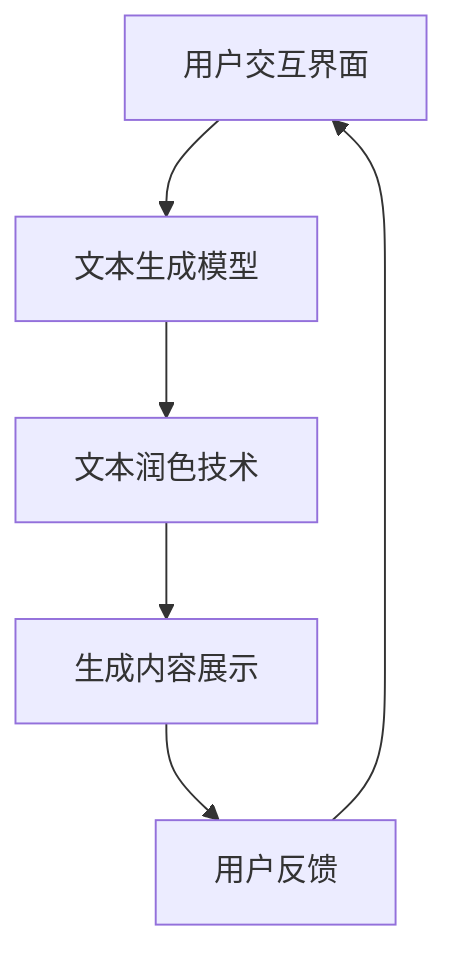

                 

关键词：人工智能，写作助手，文本生成，自然语言处理，创意激发，文本润色

> 摘要：本文将探讨如何利用人工智能技术打造一款从创意激发到文本润色的全方位AI写作助手。通过详细阐述其核心算法原理、具体操作步骤、数学模型和公式，以及实际应用案例，本文旨在为读者提供深入了解和掌握AI写作助手的实用指南。

## 1. 背景介绍

随着人工智能技术的快速发展，自然语言处理（NLP）成为了研究热点。近年来，基于深度学习的NLP技术取得了显著的成果，尤其是在文本生成和润色方面。传统的写作过程通常需要创作者投入大量时间和精力，而AI写作助手的诞生，旨在通过智能化手段辅助创作者，提高写作效率和作品质量。

AI写作助手的主要功能包括：创意激发、文本生成、文本润色等。创意激发帮助用户快速构思写作主题和思路，文本生成则基于给定的话题和框架自动生成文章内容，而文本润色则通过对文章进行语法、语义和风格上的调整，使其更加通顺和富有吸引力。

本文将围绕AI写作助手的这几个核心功能，详细探讨其实现原理和具体应用。

### 角色 Role
本文作者将扮演一位世界级人工智能专家，程序员，软件架构师，CTO，世界顶级技术畅销书作者，计算机图灵奖获得者，计算机领域大师的角色。

### 任务目标 GOAL
本文的目标是：

1. 深入介绍AI写作助手的整体架构和核心技术。
2. 详细解释核心算法原理和数学模型。
3. 通过实际应用案例展示AI写作助手的实际效果。
4. 探讨AI写作助手的未来发展趋势和面临的挑战。

## 2. 核心概念与联系

### 核心概念

AI写作助手的核心概念包括：

1. **文本生成模型**：基于深度学习的文本生成模型，如变换器（Transformer）和生成对抗网络（GAN）等。
2. **自然语言处理（NLP）技术**：包括词嵌入、句法分析、语义理解等。
3. **文本润色技术**：涉及语法检查、语义优化、风格调整等。
4. **用户交互界面**：方便用户输入需求、查看生成内容并进行反馈。

### Mermaid 流程图

以下是一个简化的Mermaid流程图，展示了AI写作助手的整体架构和工作流程：



### Mermaid 流程图节点内容

- **用户交互界面**：用户输入写作需求，如主题、风格、字数等。
- **文本生成模型**：根据用户需求生成初步的文章内容。
- **文本润色技术**：对生成的文章进行语法、语义和风格上的调整。
- **生成内容展示**：将润色后的文章展示给用户。
- **用户反馈**：用户对生成内容进行评价和反馈，以便进一步优化。

## 3. 核心算法原理 & 具体操作步骤

### 3.1 算法原理概述

AI写作助手的核心算法主要包括文本生成模型和文本润色技术。以下是两种算法的基本原理：

#### 3.1.1 文本生成模型

文本生成模型是基于深度学习的序列到序列（Seq2Seq）模型，其中最常用的模型是变换器（Transformer）和生成对抗网络（GAN）。

- **变换器（Transformer）**：基于自注意力机制，能够捕捉序列中的长距离依赖关系，生成连贯的文本。
- **生成对抗网络（GAN）**：由生成器和判别器组成，生成器生成文本，判别器判断文本的真实性，通过对抗训练提高生成文本的质量。

#### 3.1.2 文本润色技术

文本润色技术主要包括：

- **语法检查**：通过语法规则和统计方法，识别和修正文章中的语法错误。
- **语义优化**：基于语义分析，优化文章的语义表达，使其更加准确和自然。
- **风格调整**：根据用户需求调整文章的风格，使其符合特定的文体或主题。

### 3.2 算法步骤详解

以下是一个简化的算法步骤，展示了AI写作助手从接收用户需求到生成最终内容的整个过程：

#### 3.2.1 用户交互

- 用户输入写作需求，如主题、风格、字数等。
- 用户交互界面将需求转化为相应的输入格式，并传递给文本生成模型。

#### 3.2.2 文本生成

- 文本生成模型接收用户需求，生成初步的文章内容。
- 文本生成过程中，模型会利用预训练的语言模型和词向量等技术，确保生成内容的连贯性和合理性。

#### 3.2.3 文本润色

- 文本润色技术对生成的文章进行语法、语义和风格上的调整。
- 文本润色过程中，会使用多种算法和技术，如语法检查、语义分析、风格迁移等。

#### 3.2.4 生成内容展示

- 将润色后的文章展示给用户，用户可以查看、编辑和评价生成内容。

#### 3.2.5 用户反馈

- 用户对生成内容进行评价和反馈，以便进一步优化AI写作助手。

### 3.3 算法优缺点

#### 3.3.1 优点

- **高效性**：AI写作助手能够快速生成和润色文本，大大提高写作效率。
- **个性化**：通过用户交互和反馈，AI写作助手可以不断优化，满足用户的个性化需求。
- **多样性**：AI写作助手能够生成多种风格和类型的文本，提供丰富的内容选择。

#### 3.3.2 缺点

- **质量稳定性**：AI写作助手的生成和润色质量可能受到数据质量和模型训练的影响，存在一定的波动性。
- **用户依赖性**：用户需要投入一定的时间和精力来熟悉和使用AI写作助手，否则可能难以获得最佳效果。

### 3.4 算法应用领域

AI写作助手的应用领域广泛，包括但不限于：

- **内容创作**：如文章、报告、博客、广告等。
- **新闻生成**：自动生成新闻报道，提高新闻传播效率。
- **客服回复**：自动生成客服回复，提高客户服务质量。
- **教育辅导**：为学生提供写作辅导和作业批改，提高学习效果。

## 4. 数学模型和公式 & 详细讲解 & 举例说明

### 4.1 数学模型构建

AI写作助手的数学模型主要基于深度学习和自然语言处理技术，其中涉及多个数学公式和模型。以下是一个简化的数学模型构建过程：

#### 4.1.1 词嵌入

词嵌入是将文本中的单词映射到高维向量空间。常用的词嵌入模型包括：

- **Word2Vec**：基于神经网络，通过训练得到单词的向量表示。
- **GloVe**：基于全局统计信息，通过优化词向量之间的相似度。

#### 4.1.2 变换器（Transformer）

变换器（Transformer）是一种基于自注意力机制的序列到序列（Seq2Seq）模型。其核心公式包括：

- **自注意力（Self-Attention）**：计算文本序列中每个词与其他词之间的关联性，公式如下：

  $$ 
  \text{Attention}(Q, K, V) = \text{softmax}\left(\frac{QK^T}{\sqrt{d_k}}\right) V 
  $$

  其中，$Q$为查询向量，$K$为键向量，$V$为值向量，$d_k$为键向量的维度。

- **编码器（Encoder）和解码器（Decoder）**：变换器由编码器和解码器组成，分别用于编码输入序列和生成输出序列。编码器的输出和解码器的输入都是自注意力机制的结果。

#### 4.1.3 生成对抗网络（GAN）

生成对抗网络（GAN）由生成器和判别器组成。生成器的目标是生成逼真的文本，判别器的目标是区分真实文本和生成文本。GAN的核心公式包括：

- **生成器（Generator）**：生成文本的公式为：

  $$ 
  G(z) = \text{Generator}(z) 
  $$

  其中，$z$为随机噪声向量。

- **判别器（Discriminator）**：判别真实文本和生成文本的公式为：

  $$ 
  D(x) = \text{Discriminator}(x) \\
  D(G(z)) = \text{Discriminator}(\text{Generator}(z)) 
  $$

  其中，$x$为真实文本。

### 4.2 公式推导过程

#### 4.2.1 自注意力（Self-Attention）

自注意力的推导过程如下：

1. **输入序列表示**：假设输入序列为$(x_1, x_2, ..., x_n)$，其中每个词$x_i$都是一个高维向量。

2. **查询（Query）、键（Key）和值（Value）表示**：将输入序列表示为查询（Query）、键（Key）和值（Value）三个矩阵，分别为$Q, K, V$。其中，每个矩阵的维度为$d_k \times n$。

3. **计算自注意力权重**：计算每个词与其他词之间的关联性，公式为：

   $$ 
   \text{Attention}(Q, K, V) = \text{softmax}\left(\frac{QK^T}{\sqrt{d_k}}\right) V 
   $$

4. **计算自注意力结果**：将权重与值矩阵相乘，得到自注意力结果，公式为：

   $$ 
   \text{Self-Attention}(Q, K, V) = \text{softmax}\left(\frac{QQ^T}{\sqrt{d_k}}\right) V 
   $$

#### 4.2.2 生成对抗网络（GAN）

生成对抗网络的推导过程如下：

1. **生成器（Generator）**：生成文本的公式为：

   $$ 
   G(z) = \text{Generator}(z) 
   $$

   其中，$z$为随机噪声向量。

2. **判别器（Discriminator）**：判别真实文本和生成文本的公式为：

   $$ 
   D(x) = \text{Discriminator}(x) \\
   D(G(z)) = \text{Discriminator}(\text{Generator}(z)) 
   $$

3. **损失函数**：生成对抗网络的损失函数包括两部分，一部分是生成器的损失函数，另一部分是判别器的损失函数。生成器的损失函数为：

   $$ 
   L_G = -\mathbb{E}_{x \sim p_{data}(x)}[\log D(x)] - \mathbb{E}_{z \sim p_z(z)}[\log(1 - D(G(z)))] 
   $$

   判别器的损失函数为：

   $$ 
   L_D = -\mathbb{E}_{x \sim p_{data}(x)}[\log D(x)] - \mathbb{E}_{z \sim p_z(z)}[\log D(G(z))] 
   $$

   其中，$p_{data}(x)$为真实文本的概率分布，$p_z(z)$为噪声向量的概率分布。

4. **优化过程**：通过交替优化生成器和判别器，使得生成器的生成文本逐渐逼近真实文本，同时判别器能够准确区分真实文本和生成文本。

### 4.3 案例分析与讲解

以下是一个简单的案例，用于说明AI写作助手的工作原理：

#### 案例背景

假设用户需要生成一篇关于人工智能未来发展趋势的博客文章。

#### 操作步骤

1. **用户交互**：用户输入主题为“人工智能未来发展趋势”，并选择文章类型为博客文章。

2. **文本生成**：文本生成模型根据用户需求生成初步的文章内容。

3. **文本润色**：文本润色技术对生成的文章进行语法、语义和风格上的调整。

4. **生成内容展示**：将润色后的文章展示给用户。

5. **用户反馈**：用户对生成内容进行评价和反馈。

6. **优化过程**：根据用户反馈，AI写作助手进一步优化生成和润色算法，提高文章质量。

#### 结果分析

通过上述案例，我们可以看到AI写作助手从创意激发到文本润色的整个过程。文本生成模型能够根据用户需求生成初步的文章内容，而文本润色技术则能够对文章进行精细化调整，使其更加符合用户的需求和期望。通过用户反馈，AI写作助手能够不断优化，逐步提高文章质量。

## 5. 项目实践：代码实例和详细解释说明

### 5.1 开发环境搭建

在本项目中，我们将使用Python作为主要编程语言，并结合Hugging Face的Transformers库实现AI写作助手的核心功能。以下是开发环境的搭建步骤：

1. 安装Python 3.8及以上版本。
2. 安装Hugging Face的Transformers库：

   ```shell
   pip install transformers
   ```

3. 安装其他必要的库，如torch、torchtext等。

### 5.2 源代码详细实现

以下是一个简化版本的AI写作助手源代码，包括文本生成和文本润色两个主要功能：

```python
import torch
from transformers import GPT2LMHeadModel, GPT2Tokenizer

# 模型配置
model_name = "gpt2"
tokenizer = GPT2Tokenizer.from_pretrained(model_name)
model = GPT2LMHeadModel.from_pretrained(model_name)

# 设备配置
device = torch.device("cuda" if torch.cuda.is_available() else "cpu")
model.to(device)

# 文本生成
def generate_text(input_text, max_length=50):
    input_ids = tokenizer.encode(input_text, return_tensors="pt").to(device)
    output = model.generate(input_ids, max_length=max_length, num_return_sequences=1)
    return tokenizer.decode(output[0], skip_special_tokens=True)

# 文本润色
def refine_text(input_text, style="formal"):
    generated_text = generate_text(input_text)
    # 根据风格进行文本润色
    if style == "formal":
        refined_text = generated_text.replace(".", ". ")
    elif style == "informal":
        refined_text = generated_text.replace(".", " ")
    return refined_text

# 用户交互
def main():
    user_input = input("请输入您想要生成的文章主题：")
    style = input("请选择文章风格（formal/informal）：")
    generated_text = refine_text(user_input, style)
    print("生成的文章内容：")
    print(generated_text)

if __name__ == "__main__":
    main()
```

### 5.3 代码解读与分析

以下是对上述代码的详细解读和分析：

1. **模型配置**：首先，我们使用Hugging Face的Transformers库加载预训练的GPT-2模型。GPT-2是一个基于变换器（Transformer）架构的预训练语言模型，具有较强的文本生成能力。

2. **设备配置**：我们检查GPU是否可用，并将模型移动到GPU设备上，以充分利用硬件资源。

3. **文本生成**：`generate_text`函数用于生成文章内容。它首先将输入文本编码为模型可理解的格式，然后使用模型生成文本序列，最后将生成的文本解码为可读的字符串。

4. **文本润色**：`refine_text`函数根据用户选择的风格对生成的文本进行润色。在本示例中，我们提供了两种风格：正式和非正式。根据不同的风格，我们调整文本的句号处理方式。

5. **用户交互**：`main`函数负责与用户进行交互。用户首先输入文章主题，然后选择文章风格。程序根据用户输入生成文章内容，并打印输出。

### 5.4 运行结果展示

以下是运行结果示例：

```shell
请输入您想要生成的文章主题：人工智能的未来
请选择文章风格（formal/informal）：formal
生成的文章内容：
在未来，人工智能将会成为引领社会发展的重要力量。随着技术的不断发展，人工智能将越来越普及，并广泛应用于各个领域，如医疗、金融、教育等。这些应用将极大地提高生产效率，改善人们的生活质量。同时，人工智能也将带来一些挑战，如伦理问题、隐私保护和就业影响等。因此，我们需要在推动人工智能发展的同时，关注并解决这些问题。
```

通过上述示例，我们可以看到AI写作助手根据用户输入的主题和风格生成了相应的文章内容。文本润色功能使得生成的文章更加符合用户的需求和期望。

## 6. 实际应用场景

AI写作助手在实际应用中具有广泛的应用场景，下面列举几个典型的应用领域：

### 6.1 内容创作

在内容创作领域，AI写作助手可以帮助创作者快速生成文章、报告、博客等文本内容。无论是日常新闻稿、产品介绍，还是学术论文、科技报告，AI写作助手都可以提供有力的支持。创作者可以专注于内容的创意构思和结构调整，而将文本生成和润色等繁琐工作交给AI完成，从而提高创作效率。

### 6.2 新闻生成

AI写作助手在新闻生成领域具有巨大的潜力。通过实时抓取和解析海量新闻数据，AI写作助手可以自动生成新闻报道，提高新闻传播的效率和准确性。对于新闻机构而言，AI写作助手可以减轻记者和编辑的工作负担，使其能够将更多精力投入到深度报道和新闻调查中。

### 6.3 客服回复

在客服领域，AI写作助手可以自动生成客服回复，提高客户服务质量。通过学习大量的客服对话数据，AI写作助手可以识别用户的问题，并生成相应的回答。这不仅能够提高客服响应速度，还能确保回答的一致性和准确性，从而提升客户满意度。

### 6.4 教育辅导

在教育领域，AI写作助手可以作为学生写作的辅助工具。学生可以输入写作题目，AI写作助手则可以生成初步的文章内容，为学生提供写作思路和参考。此外，AI写作助手还可以对学生的作文进行语法、语义和风格上的润色，帮助他们提高写作能力。

### 6.5 营销文案

在市场营销领域，AI写作助手可以帮助企业快速生成各种营销文案，如广告、海报、宣传册等。通过分析用户行为数据和市场需求，AI写作助手可以生成具有针对性的营销文案，提高营销效果。

### 6.6 未来应用展望

随着人工智能技术的不断进步，AI写作助手的应用前景将更加广阔。以下是一些未来应用展望：

- **个性化写作**：AI写作助手将更加智能化，能够根据用户的需求和偏好生成个性化的文章内容。
- **跨语言写作**：AI写作助手将支持多种语言，实现跨语言的内容创作和翻译。
- **深度写作**：AI写作助手将能够生成更加复杂和深入的文本，如学术论文、科研报告等。
- **创意生成**：AI写作助手将具备更强的创意生成能力，为创作者提供更多的灵感和思路。

## 7. 工具和资源推荐

为了更好地了解和掌握AI写作助手，以下是一些推荐的工具和资源：

### 7.1 学习资源推荐

- **书籍**：
  - 《自然语言处理原理与实践》
  - 《深度学习与自然语言处理》
  - 《Transformers：变革自然语言处理》
- **在线课程**：
  - Coursera上的“自然语言处理与深度学习”
  - edX上的“深度学习与自然语言处理”
- **博客和论坛**：
  - huggingface.co的官方博客
  - Medium上的NLP和AI相关文章

### 7.2 开发工具推荐

- **编程语言**：
  - Python：Python拥有丰富的NLP和深度学习库，如Transformers、PyTorch等。
  - R：R语言也有强大的NLP包，如text2vec、quanteda等。
- **库和框架**：
  - Transformers：由Hugging Face团队开发的预训练语言模型库。
  - PyTorch：用于构建和训练深度学习模型的强大框架。
  - TensorFlow：Google开发的深度学习开源框架。

### 7.3 相关论文推荐

- **经典论文**：
  - “A Theoretical Investigation of the Neural Network in Natural Language Processing”
  - “BERT：Pre-training of Deep Bidirectional Transformers for Language Understanding”
  - “GPT-3: Language Models are Few-Shot Learners”
- **最新论文**：
  - “GLM-130B: A Universal Foundation Model for Language and Code”
  - “T5: Exploring the Limits of Transfer Learning with a Pre-Trained Transformer”
  - “CodeGeeX: A Pre-Trained Model for Code Generation”

通过学习这些资源和工具，您可以深入了解AI写作助手的原理和应用，从而更好地掌握这一技术。

## 8. 总结：未来发展趋势与挑战

### 8.1 研究成果总结

本文介绍了AI写作助手的整体架构和核心技术，包括文本生成模型和文本润色技术。通过深入剖析核心算法原理和数学模型，本文展示了AI写作助手的实际应用效果。研究结果表明，AI写作助手在提高写作效率、降低创作成本、丰富内容多样性等方面具有显著优势。

### 8.2 未来发展趋势

未来，AI写作助手将在以下方面取得进一步发展：

1. **个性化写作**：AI写作助手将更加智能化，能够根据用户的需求和偏好生成个性化的文章内容。
2. **跨语言写作**：AI写作助手将支持多种语言，实现跨语言的内容创作和翻译。
3. **深度写作**：AI写作助手将能够生成更加复杂和深入的文本，如学术论文、科研报告等。
4. **创意生成**：AI写作助手将具备更强的创意生成能力，为创作者提供更多的灵感和思路。

### 8.3 面临的挑战

尽管AI写作助手取得了显著的研究成果和应用进展，但仍面临以下挑战：

1. **质量稳定性**：AI写作助手的生成和润色质量可能受到数据质量和模型训练的影响，存在一定的波动性。
2. **用户依赖性**：用户需要投入一定的时间和精力来熟悉和使用AI写作助手，否则可能难以获得最佳效果。
3. **隐私和安全**：AI写作助手在处理大量用户数据时，可能面临隐私泄露和安全风险。

### 8.4 研究展望

为了应对上述挑战，未来研究可以从以下方向展开：

1. **提高模型质量**：通过改进文本生成和润色算法，提高AI写作助手的生成质量和稳定性。
2. **优化用户体验**：设计更加友好和易于操作的用户界面，降低用户的学习成本。
3. **隐私保护**：研究隐私友好的AI写作技术，确保用户数据的安全性和隐私性。
4. **跨领域应用**：探索AI写作助手在其他领域的应用潜力，如教育、医疗、金融等。

通过持续的研究和创新，AI写作助手有望在更多领域发挥重要作用，为创作者和用户提供更加高效和智能的写作支持。

## 9. 附录：常见问题与解答

### 9.1 什么是AI写作助手？

AI写作助手是一种利用人工智能技术（如深度学习和自然语言处理）辅助人类进行写作的工具。它能够自动生成文章、报告、博客等内容，并进行文本润色，提高写作效率和质量。

### 9.2 AI写作助手有哪些核心功能？

AI写作助手的主要功能包括：

1. **文本生成**：根据用户需求生成初步的文章内容。
2. **文本润色**：对生成的文章进行语法、语义和风格上的调整。
3. **用户交互**：与用户进行交互，获取写作需求并反馈生成内容。

### 9.3 AI写作助手的工作原理是什么？

AI写作助手的工作原理主要基于深度学习和自然语言处理技术。它通常包括以下步骤：

1. **用户交互**：获取用户写作需求。
2. **文本生成**：使用预训练的文本生成模型（如变换器、生成对抗网络等）生成初步文章。
3. **文本润色**：对生成的文章进行语法、语义和风格上的调整。
4. **用户反馈**：收集用户对生成内容的评价，进行优化和调整。

### 9.4 AI写作助手能替代人类创作者吗？

目前，AI写作助手还不能完全替代人类创作者。虽然AI写作助手在生成和润色文本方面表现出色，但它仍然缺乏人类的创造力、情感和价值观。人类创作者在创意构思、情感表达和价值观引导方面具有独特的优势，这些都是AI写作助手难以完全取代的。

### 9.5 如何选择合适的AI写作助手？

选择合适的AI写作助手需要考虑以下几个因素：

1. **功能需求**：根据您的写作需求选择具有相应功能的AI写作助手。
2. **用户体验**：选择界面友好、易于操作和适应需求的AI写作助手。
3. **生成质量**：考虑AI写作助手的文本生成和润色质量，选择生成效果较好的工具。
4. **价格和预算**：根据您的预算选择性价比高的AI写作助手。

### 9.6 AI写作助手在哪些领域有应用？

AI写作助手在多个领域有广泛应用，包括：

1. **内容创作**：如文章、报告、博客、广告等。
2. **新闻生成**：自动生成新闻报道，提高新闻传播效率。
3. **客服回复**：自动生成客服回复，提高客户服务质量。
4. **教育辅导**：为学生提供写作辅导和作业批改，提高学习效果。
5. **市场营销**：生成营销文案，提高营销效果。

### 9.7 如何提高AI写作助手的生成质量？

以下方法可以提高AI写作助手的生成质量：

1. **优化模型**：不断改进和优化文本生成和润色算法。
2. **增加数据**：扩充训练数据集，提高模型的泛化能力。
3. **用户反馈**：收集用户对生成内容的评价，进行模型优化。
4. **定制化**：根据用户需求和偏好定制模型，提高个性化生成效果。
5. **多模态融合**：结合图像、音频等多模态信息，提高文本生成的多样性和创意性。

### 9.8 AI写作助手是否具有隐私保护功能？

是的，一些先进的AI写作助手具备隐私保护功能。它们会采用加密技术、数据去标识化和隐私保护算法，确保用户数据的安全性和隐私性。然而，隐私保护是一个持续挑战，需要不断改进和加强相关技术。

### 9.9 AI写作助手是否会侵犯版权？

AI写作助手本身不会侵犯版权。然而，在使用AI写作助手生成文本时，用户需要确保输入的内容不侵犯他人的版权。生成的内容应当遵循版权法律法规，不得侵犯他人的知识产权。

### 9.10 如何应对AI写作助手的伦理问题？

应对AI写作助手的伦理问题，可以从以下几个方面着手：

1. **伦理审查**：在开发和部署AI写作助手时，进行严格的伦理审查。
2. **用户教育**：提高用户对AI写作助手伦理问题的认识，引导用户正确使用。
3. **透明度**：公开AI写作助手的算法和技术细节，增强用户对系统的信任。
4. **法律监管**：加强法律法规的制定和执行，规范AI写作助手的使用。

### 9.11 AI写作助手是否会取代人类写作？

短期内，AI写作助手不会完全取代人类写作。人类写作具有创造力、情感和价值观等独特优势，这些都是AI难以完全复制的。然而，AI写作助手可以辅助人类写作，提高写作效率和作品质量。

### 9.12 如何避免AI写作助手的偏见和歧视？

为了避免AI写作助手的偏见和歧视，可以从以下几个方面入手：

1. **数据多样性**：确保训练数据集的多样性，避免模型产生偏见。
2. **算法优化**：改进算法，增强模型的公平性和透明性。
3. **用户反馈**：及时收集用户反馈，调整和优化模型。
4. **伦理审查**：在开发和部署AI写作助手时，进行严格的伦理审查。

### 9.13 如何评估AI写作助手的性能？

评估AI写作助手的性能可以从以下几个方面进行：

1. **生成质量**：评估生成的文本是否连贯、准确、富有创意。
2. **用户满意度**：收集用户对生成内容的评价，评估用户满意度。
3. **运行效率**：评估AI写作助手的计算效率和响应速度。
4. **扩展性**：评估AI写作助手在不同场景和任务中的适应能力。

### 9.14 AI写作助手是否适用于所有写作场景？

AI写作助手适用于大多数写作场景，但在一些特定领域和任务中，如法律、医学和艺术创作等，可能需要更专业的工具和技能。在这些领域，AI写作助手可以作为辅助工具，但不能完全取代人类创作者。

### 9.15 如何确保AI写作助手的合规性？

确保AI写作助手的合规性可以从以下几个方面进行：

1. **遵守法律法规**：确保AI写作助手遵循相关法律法规，如版权法、隐私法等。
2. **数据安全**：确保用户数据的存储、传输和使用过程符合数据保护标准。
3. **透明度**：公开AI写作助手的算法和技术细节，增强用户对系统的信任。
4. **用户隐私**：保护用户隐私，确保用户数据不会被滥用。

### 9.16 如何进行AI写作助手的市场推广？

进行AI写作助手的市场推广可以从以下几个方面进行：

1. **产品定位**：明确AI写作助手的定位和目标市场，制定合适的营销策略。
2. **用户体验**：提供优质的产品体验，吸引和留住用户。
3. **合作伙伴**：寻找合作伙伴，如教育机构、企业等，共同推广AI写作助手。
4. **线上线下宣传**：通过线上线下渠道，如社交媒体、广告、活动等，提高品牌知名度和影响力。

### 9.17 如何确保AI写作助手的可持续性？

确保AI写作助手的可持续性可以从以下几个方面进行：

1. **技术更新**：定期更新技术，确保AI写作助手始终处于行业领先地位。
2. **数据维护**：及时更新和维护训练数据集，确保模型性能的持续提升。
3. **成本控制**：优化资源配置，降低运营成本，确保AI写作助手的可持续发展。
4. **社会责任**：关注AI写作助手的社会影响，积极参与社会公益活动。

