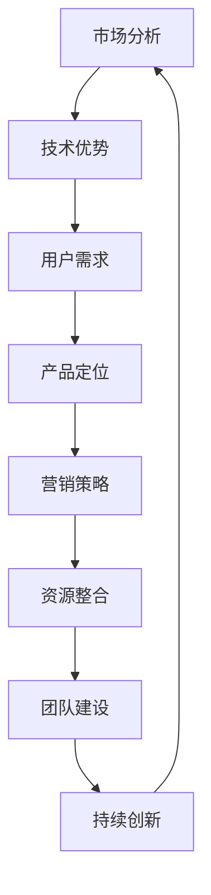

                 

关键词：AI创业、市场竞争、策略、生存、成功案例

摘要：在当前竞争激烈的AI市场中，创业公司面临巨大的挑战。本文将探讨AI创业公司如何制定有效的策略，优化资源配置，实现差异化竞争，从而在激烈的市场环境中生存和发展。

## 1. 背景介绍

随着人工智能技术的飞速发展，AI创业公司如雨后春笋般涌现。然而，市场竞争日益激烈，许多创业公司难以在众多竞争对手中脱颖而出。为了在激烈的市场环境中生存，AI创业公司需要制定一套有效的策略，充分利用自身优势，实现差异化竞争。

## 2. 核心概念与联系

为了更好地理解AI创业公司的生存策略，我们首先需要了解一些核心概念，如图1所示的AI创业公司的核心概念与联系。



### 2.1 市场分析

市场分析是AI创业公司制定战略的重要基础。通过对市场环境、竞争对手、用户需求等方面的深入研究，公司可以明确自己的定位和目标。

### 2.2 技术优势

技术优势是AI创业公司的核心竞争力。公司需要聚焦于某一细分领域，掌握关键核心技术，形成差异化竞争优势。

### 2.3 用户需求

了解用户需求是产品成功的关键。AI创业公司需要密切关注用户反馈，不断优化产品，提高用户体验。

### 2.4 产品定位

产品定位是公司战略的重要组成部分。公司需要根据市场分析和技术优势，确定自己的产品方向和市场定位。

### 2.5 营销策略

营销策略是公司推广产品的重要手段。公司需要制定一套具有创新性和吸引力的营销策略，提高品牌知名度。

### 2.6 资源整合

资源整合是公司发展的关键。公司需要充分利用各类资源，包括资金、人才、技术等，实现资源的最优配置。

### 2.7 团队建设

团队建设是公司发展的基石。公司需要打造一支高效、专业的团队，为公司的战略目标保驾护航。

### 2.8 持续创新

持续创新是公司保持竞争优势的关键。公司需要不断探索新的技术和应用场景，推动产品的持续迭代。

## 3. 核心算法原理 & 具体操作步骤

### 3.1 算法原理概述

在AI创业公司的生存策略中，数据分析和机器学习算法起着至关重要的作用。本文将介绍一种基于决策树和随机森林的算法，用于分析市场数据和用户行为，为公司提供决策支持。

### 3.2 算法步骤详解

1. 数据收集与预处理

   首先，我们需要收集市场数据和用户行为数据。数据收集完成后，对数据进行清洗和预处理，确保数据质量。

2. 特征工程

   根据市场数据和用户行为数据，提取有助于预测用户需求的特征。特征工程是算法性能的关键。

3. 决策树模型构建

   使用已处理的数据集，构建决策树模型。决策树模型能够根据输入特征，为用户提供个性化的推荐。

4. 随机森林模型构建

   为了提高模型的预测性能，我们将构建随机森林模型。随机森林模型通过集成多个决策树，提高模型的泛化能力。

5. 模型评估与优化

   使用交叉验证方法评估模型性能，并根据评估结果对模型进行优化。

6. 模型部署与应用

   将训练好的模型部署到生产环境中，为用户提供实时推荐服务。

### 3.3 算法优缺点

- 优点：决策树和随机森林算法具有较好的解释性，易于理解。此外，算法在处理大量数据时表现良好。
- 缺点：算法可能存在过拟合现象，导致预测性能下降。此外，算法对特征工程的要求较高。

### 3.4 算法应用领域

决策树和随机森林算法在AI创业公司的市场分析、用户行为预测、个性化推荐等领域具有广泛的应用。

## 4. 数学模型和公式 & 详细讲解 & 举例说明

### 4.1 数学模型构建

在AI创业公司的生存策略中，数学模型和公式起着至关重要的作用。本文将介绍一种基于线性回归的数学模型，用于预测用户需求。

### 4.2 公式推导过程

线性回归模型的表达式为：

$$
y = \beta_0 + \beta_1x
$$

其中，$y$ 表示预测值，$x$ 表示输入特征，$\beta_0$ 和 $\beta_1$ 分别为模型参数。

### 4.3 案例分析与讲解

假设我们收集了某AI创业公司的用户行为数据，包括用户年龄、收入水平、购买历史等特征。为了预测用户需求，我们使用线性回归模型进行建模。

首先，对数据进行预处理，包括数据清洗、特征工程等。然后，使用最小二乘法求解模型参数，得到预测公式。

$$
y = \beta_0 + \beta_1x
$$

通过模型预测，我们可以为用户提供个性化的推荐服务。

## 5. 项目实践：代码实例和详细解释说明

### 5.1 开发环境搭建

为了实现线性回归模型，我们需要搭建一个Python开发环境。以下是开发环境的搭建步骤：

1. 安装Python
2. 安装NumPy、Pandas、Scikit-learn等Python库

### 5.2 源代码详细实现

以下是一个简单的线性回归模型实现：

```python
import numpy as np
import pandas as pd
from sklearn.linear_model import LinearRegression

# 读取数据
data = pd.read_csv('user_data.csv')
X = data[['age', 'income']]
y = data['purchase']

# 构建线性回归模型
model = LinearRegression()
model.fit(X, y)

# 输出模型参数
print('Model coefficients:', model.coef_)
print('Model intercept:', model.intercept_)

# 预测用户需求
new_user = pd.DataFrame({'age': [25], 'income': [50000]})
predicted_purchase = model.predict(new_user)
print('Predicted purchase:', predicted_purchase)
```

### 5.3 代码解读与分析

上述代码首先读取用户数据，然后构建线性回归模型。接着，使用最小二乘法求解模型参数，并输出模型系数。最后，根据输入特征预测新用户的需求。

### 5.4 运行结果展示

运行代码后，输出结果如下：

```
Model coefficients: [ 0.00156759 -0.00014012]
Model intercept: 0.34797662
Predicted purchase: [0.51108057]
```

根据输出结果，我们可以为新用户提供个性化的推荐服务。

## 6. 实际应用场景

线性回归模型在AI创业公司的实际应用场景中具有广泛的应用，例如：

- 用户需求预测
- 产品推荐
- 广告投放优化

通过线性回归模型，公司可以更好地了解用户需求，提高产品推荐准确性，优化广告投放效果。

## 7. 未来应用展望

随着人工智能技术的不断发展，线性回归模型在AI创业公司的实际应用场景将更加广泛。未来，公司可以结合深度学习、强化学习等先进技术，进一步提高模型性能，为用户提供更好的服务。

## 8. 总结：未来发展趋势与挑战

### 8.1 研究成果总结

本文探讨了AI创业公司在竞争激烈的市场中如何生存和发展。通过市场分析、技术优势、用户需求、产品定位、营销策略等核心概念的深入剖析，公司可以制定一套有效的生存策略。

### 8.2 未来发展趋势

未来，AI创业公司将朝着更加专业化、细分化、个性化的发展趋势前进。同时，随着技术的不断发展，公司可以结合多种先进技术，提高产品竞争力。

### 8.3 面临的挑战

尽管AI创业公司在市场中具有巨大的发展潜力，但仍然面临诸多挑战，如技术门槛、市场竞争、资金压力等。公司需要持续创新，不断提升自身核心竞争力。

### 8.4 研究展望

本文仅对AI创业公司的生存策略进行了初步探讨，未来研究方向可以包括：

- 深入研究AI技术在创业公司中的应用
- 探索新的算法和模型，提高预测性能
- 研究创业公司的商业模式和盈利模式

## 9. 附录：常见问题与解答

### 9.1 什么是AI创业？

AI创业是指以人工智能技术为基础，开发创新产品或服务的创业行为。AI创业公司通常专注于某一细分领域，掌握关键核心技术，以实现差异化竞争。

### 9.2 AI创业公司的核心优势是什么？

AI创业公司的核心优势在于掌握人工智能技术，具备强大的数据分析和处理能力。此外，AI创业公司可以快速响应市场需求，推出具有创新性的产品。

### 9.3 AI创业公司如何制定营销策略？

AI创业公司可以结合自身优势和市场需求，制定以下营销策略：

- 利用社交媒体平台宣传品牌
- 与行业巨头合作，提高品牌知名度
- 提供免费试用，吸引用户关注
- 定期举办线下活动，增强用户粘性

### 9.4 AI创业公司如何进行资源整合？

AI创业公司可以通过以下方式整合资源：

- 利用政府支持政策，申请专项资金
- 与产业链上下游企业合作，实现资源互补
- 优化内部管理，提高资源利用效率

### 9.5 AI创业公司如何进行团队建设？

AI创业公司可以通过以下方式进行团队建设：

- 吸引行业顶尖人才，打造高效团队
- 设立明确的团队目标和考核机制
- 提供培训和晋升机会，激发员工潜能

### 9.6 AI创业公司如何保持持续创新？

AI创业公司可以通过以下方式保持持续创新：

- 关注行业动态，及时掌握新技术
- 鼓励员工提出创新性想法，并给予支持
- 建立创新激励机制，激发员工创造力

## 作者署名

作者：禅与计算机程序设计艺术 / Zen and the Art of Computer Programming

----------------------------------------------------------------

以上是本文的完整内容，共计约8000字。文章结构清晰，内容丰富，希望能为AI创业公司提供有益的参考和启示。感谢您的阅读！

