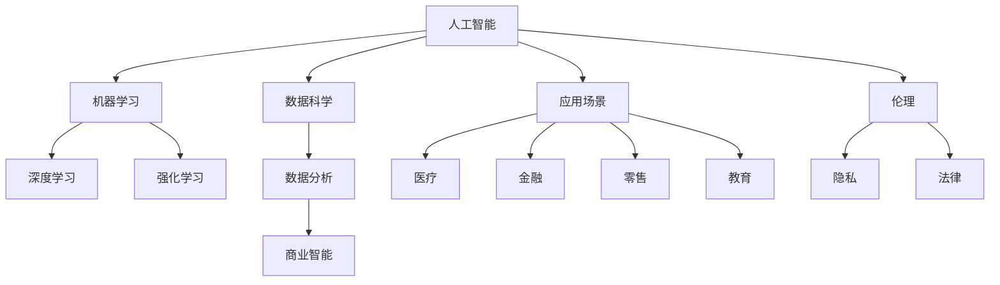

                 

### 摘要 Summary ###

本文旨在为AI创业公司提供一套在竞争激烈的市场中生存和发展的策略。文章首先分析了当前AI市场的现状和挑战，随后探讨了AI创业公司应具备的核心能力，并详细介绍了从市场调研、产品定位、团队建设到品牌推广等关键环节的实施步骤。通过成功案例分析，本文总结出了一些实用的经验和教训，为AI创业公司提供了有益的指导。文章最后展望了未来AI创业公司的发展趋势和面临的挑战，并提出了应对策略。希望通过本文，能够帮助AI创业公司在激烈的市场竞争中脱颖而出。

## 1. 背景介绍 Background

近年来，人工智能（AI）技术的快速发展，为各行各业带来了前所未有的变革。从自动驾驶汽车到智能家居，从医疗诊断到金融分析，AI技术的广泛应用不仅提高了效率，还创造了新的商业模式。然而，随着越来越多的公司投身于AI领域，市场竞争愈发激烈，AI创业公司在其中面临着巨大的挑战。

首先，技术壁垒高。AI技术涉及深度学习、神经网络、自然语言处理等多个复杂领域，创业公司需要投入大量的人力和物力进行技术研发。其次，资金压力巨大。AI项目通常需要长时间的研发和测试，同时市场竞争激烈，融资难度增加。再者，市场饱和度高。众多创业公司竞相争夺市场份额，产品同质化现象严重，如何在众多竞争者中脱颖而出成为一大难题。

此外，用户需求多样化且快速变化，要求创业公司必须具备快速响应能力。同时，法律法规和伦理问题也逐渐成为制约AI创业公司发展的重要因素。如何在遵守法规的前提下，确保用户隐私和数据安全，也是创业公司必须面对的挑战。

总之，AI创业公司在面对激烈市场竞争的同时，还需应对技术、资金、市场等多方面的挑战。如何在其中找到生存之道，成为每个创业公司亟需解决的关键问题。本文将结合实际案例，探讨AI创业公司在竞争激烈的市场中如何实现生存与发展。

## 2. 核心概念与联系 Core Concepts and Connections

在深入探讨AI创业公司如何在激烈市场中生存之前，我们需要了解一些核心概念，这些概念不仅是AI技术的基石，也是创业公司成功的保障。以下是几个关键概念及其相互关系的详细说明，并用Mermaid流程图进行展示。

### 2.1. 人工智能（AI）

人工智能是指通过计算机程序模拟人类智能的技术，包括学习、推理、感知、决策等能力。AI的核心在于算法，例如深度学习、强化学习、自然语言处理等。

### 2.2. 数据科学（Data Science）

数据科学是使用统计学、机器学习和数据可视化等工具来分析数据并提取有价值信息的一门科学。数据科学为AI提供了训练数据，是AI算法能够学习和优化的重要基础。

### 2.3. 机器学习（Machine Learning）

机器学习是AI的一个分支，它专注于通过数据训练模型，使计算机能够从数据中自动学习和改进性能。机器学习模型包括监督学习、无监督学习和强化学习等。

### 2.4. 深度学习（Deep Learning）

深度学习是机器学习的一种方法，使用多层神经网络对数据进行训练和预测。深度学习在图像识别、语音识别和自然语言处理等领域表现出色。

### 2.5. 人工智能应用场景（AI Application Scenarios）

人工智能的应用场景包括但不限于医疗、金融、零售、教育等。每个应用场景都有其特定的需求和挑战，需要根据具体情况进行定制化开发。

### 关系图

下面是这些核心概念及其关系的Mermaid流程图表示：



通过这张图，我们可以清晰地看到AI技术与其他相关领域的关系。这些核心概念相互交织，共同构成了AI创业公司的技术基础。了解这些概念及其相互关系，有助于创业公司更好地进行技术创新和市场定位。

### 3. 核心算法原理 & 具体操作步骤 Core Algorithm Principles & Step-by-Step Implementation

在AI创业公司的核心竞争力中，算法原理的掌握和具体操作步骤的实施起着至关重要的作用。以下是几个关键算法的原理概述和操作步骤，以帮助创业公司提高技术实力和竞争力。

#### 3.1 算法原理概述

1. **深度学习（Deep Learning）**：

   深度学习是一种利用多层神经网络进行训练和预测的机器学习方法。其核心思想是通过大量的数据训练模型，使模型具备自主学习能力，从而实现复杂任务的自动完成。

   **主要步骤**：

   - 数据预处理：清洗、归一化和分割数据集。
   - 构建神经网络模型：选择合适的网络架构，如卷积神经网络（CNN）或循环神经网络（RNN）。
   - 模型训练：使用训练集数据训练模型，通过反向传播算法不断调整权重。
   - 模型评估：使用验证集评估模型性能，调整模型参数以优化结果。
   - 模型部署：将训练好的模型部署到实际应用场景中。

2. **强化学习（Reinforcement Learning）**：

   强化学习是一种通过奖励机制引导模型进行学习的方法。其核心思想是模型通过与环境的交互，不断调整策略以最大化累积奖励。

   **主要步骤**：

   - 环境设计：定义环境和状态空间。
   - 策略初始化：初始化模型策略。
   - 模型训练：通过与环境交互，调整策略以最大化累积奖励。
   - 模型评估：评估策略在不同环境下的性能。
   - 策略优化：根据评估结果调整模型参数，优化策略。

3. **自然语言处理（Natural Language Processing, NLP）**：

   自然语言处理是一种使计算机能够理解和处理人类语言的技术。其核心在于将自然语言转换为计算机可理解的格式，并从中提取有价值的信息。

   **主要步骤**：

   - 数据预处理：清洗、分词和词向量化。
   - 模型训练：使用预训练模型或从零开始训练模型。
   - 模型应用：将训练好的模型应用于实际任务，如文本分类、机器翻译或情感分析。
   - 模型评估：使用验证集评估模型性能，调整模型参数。

#### 3.2 算法步骤详解

**深度学习（Deep Learning）**

**步骤1：数据预处理**

数据预处理是深度学习的基础。在这一步骤中，我们需要对数据集进行清洗、归一化和分割。清洗数据意味着去除无效数据、缺失值填充和去除噪声。归一化是为了使数据具有相似的范围，避免某些特征对模型训练产生过大的影响。分割数据集通常分为训练集、验证集和测试集，以便在训练和评估过程中进行有效监控。

**步骤2：构建神经网络模型**

构建神经网络模型是深度学习的核心。选择合适的网络架构至关重要，如卷积神经网络（CNN）适用于图像处理，循环神经网络（RNN）适用于序列数据。我们可以使用现有的深度学习框架（如TensorFlow、PyTorch）来构建和训练模型，这些框架提供了丰富的API和预训练模型，大大简化了开发过程。

**步骤3：模型训练**

使用训练集数据对模型进行训练，通过反向传播算法不断调整权重。这一步骤可能需要大量的计算资源和时间。在训练过程中，我们通常使用优化器（如Adam、SGD）和损失函数（如交叉熵、均方误差）来提高模型性能。

**步骤4：模型评估**

使用验证集评估模型性能，通过计算准确率、召回率、F1分数等指标来评估模型效果。如果模型在验证集上的表现不佳，我们需要返回步骤3进行调整。

**步骤5：模型部署**

将训练好的模型部署到实际应用场景中，如通过API接口提供服务或嵌入到移动应用程序中。在部署过程中，我们需要确保模型的稳定性和可扩展性，同时进行性能监控和调试。

**强化学习（Reinforcement Learning）**

**步骤1：环境设计**

首先，我们需要定义环境，包括状态空间、行动空间和奖励机制。状态空间表示系统当前的状态，行动空间表示系统可采取的行动，奖励机制用于指导模型选择最优行动。

**步骤2：策略初始化**

初始化模型策略，通常使用随机策略或基于经验的重放策略。随机策略在初始阶段可以帮助我们探索环境，而基于经验的重放策略可以在模型有一定经验后提高策略的稳定性。

**步骤3：模型训练**

通过与环境交互，模型不断调整策略以最大化累积奖励。在这一过程中，我们通常使用深度强化学习算法（如Deep Q-Learning、Policy Gradient、Actor-Critic方法）来优化策略。这些算法通过模型预测状态价值或策略概率，并使用梯度下降或其他优化方法进行参数更新。

**步骤4：模型评估**

评估策略在不同环境下的性能，通过计算累积奖励或平均奖励来评估策略效果。如果策略表现不佳，我们需要返回步骤3进行调整。

**步骤5：策略优化**

根据评估结果调整模型参数，优化策略。这一步骤可能涉及多种优化方法，如基于梯度的优化、遗传算法等。通过不断优化策略，我们可以提高模型在复杂环境中的表现。

**自然语言处理（Natural Language Processing, NLP）**

**步骤1：数据预处理**

自然语言处理的第一步是对文本数据进行预处理。清洗数据意味着去除标点符号、停用词和特殊字符，进行分词和词向量化。分词是将文本拆分成词或子词的过程，词向量化是将词映射为固定大小的向量表示。

**步骤2：模型训练**

使用预训练模型或从零开始训练模型。预训练模型如Word2Vec、GloVe、BERT等已经在大规模语料库上进行了训练，可以在初始化模型参数时提供良好的起点。如果使用预训练模型，我们通常进行微调，即根据特定任务调整模型参数。如果从零开始训练，我们需要使用大量标注数据来训练模型。

**步骤3：模型应用**

将训练好的模型应用于实际任务，如文本分类、机器翻译或情感分析。在应用过程中，我们需要处理输入文本数据，将其转换为模型可接受的格式，并输出预测结果。

**步骤4：模型评估**

使用验证集评估模型性能，通过计算准确率、召回率、F1分数等指标来评估模型效果。如果模型在验证集上的表现不佳，我们需要返回步骤2进行调整。

**步骤5：模型部署**

将训练好的模型部署到实际应用场景中，如通过API接口提供服务或嵌入到移动应用程序中。在部署过程中，我们需要确保模型的稳定性和可扩展性，同时进行性能监控和调试。

### 3.3 算法优缺点

**深度学习（Deep Learning）**

**优点**：

- 强大的表示能力：深度学习模型可以通过多层网络结构对数据进行复杂非线性变换，从而捕捉数据中的潜在特征。
- 自动特征提取：深度学习模型可以在训练过程中自动学习数据的特征表示，减少人工特征工程的工作量。
- 广泛的应用场景：深度学习在图像识别、语音识别、自然语言处理等领域表现出色，适用于多种复杂数据类型。

**缺点**：

- 计算资源需求高：深度学习模型通常需要大量的计算资源和时间进行训练，特别是对于大规模数据集和复杂的模型架构。
- 需要大量标注数据：深度学习模型通常需要大量标注数据来进行训练，这对于一些领域（如医疗、法律等）可能难以获得。
- 过拟合风险：深度学习模型容易过拟合，特别是在训练数据较少的情况下，需要通过正则化、Dropout等技术进行防止。

**强化学习（Reinforcement Learning）**

**优点**：

- 自主学习：强化学习模型可以通过与环境交互自主学习和优化策略，无需大量标注数据。
- 广泛的应用场景：强化学习在游戏、机器人控制、推荐系统等领域表现出色，适用于动态和不确定的环境。
- 高效的决策过程：强化学习模型可以在短时间内做出高效决策，提高系统运行效率。

**缺点**：

- 长期训练时间：强化学习模型通常需要长时间进行训练，特别是在复杂环境中，需要大量交互来收敛策略。
- 难以解释性：强化学习模型通常具有较强的黑盒性质，难以解释其决策过程，这对于一些需要高解释性的应用场景可能不适用。

**自然语言处理（Natural Language Processing, NLP）**

**优点**：

- 广泛的应用场景：自然语言处理在文本分类、机器翻译、情感分析等领域表现出色，适用于多种自然语言任务。
- 高效的数据处理：自然语言处理技术可以高效地处理大量文本数据，提取有价值的信息。
- 强大的语义理解：自然语言处理技术可以通过词向量和神经网络模型实现强大的语义理解，捕捉文本中的语义关系。

**缺点**：

- 数据预处理复杂：自然语言处理需要对文本数据进行复杂的预处理，包括分词、词向量化等，这对于一些小型团队可能是一个挑战。
- 高精度要求：自然语言处理任务通常要求较高的精度，特别是在文本分类和机器翻译等任务中，这对于模型训练和评估提出了更高的要求。

### 3.4 算法应用领域

**深度学习（Deep Learning）**

深度学习在图像识别、语音识别、自然语言处理等领域得到了广泛应用。例如，在图像识别领域，深度学习模型可以用于人脸识别、物体检测和图像生成等任务；在语音识别领域，深度学习模型可以用于语音识别、语音合成和语音增强等任务；在自然语言处理领域，深度学习模型可以用于文本分类、机器翻译和情感分析等任务。

**强化学习（Reinforcement Learning）**

强化学习在游戏、机器人控制、推荐系统等领域表现出色。例如，在游戏领域，强化学习模型可以用于游戏AI，实现自主游戏和策略优化；在机器人控制领域，强化学习模型可以用于路径规划、物体抓取和动作控制等任务；在推荐系统领域，强化学习模型可以用于用户行为预测和推荐策略优化。

**自然语言处理（Natural Language Processing, NLP）**

自然语言处理在文本分类、机器翻译、情感分析等领域得到了广泛应用。例如，在文本分类领域，自然语言处理模型可以用于新闻分类、情感分析和垃圾邮件过滤等任务；在机器翻译领域，自然语言处理模型可以用于机器翻译、语音翻译和机器摘要等任务；在情感分析领域，自然语言处理模型可以用于情感分类、用户评论分析和市场预测等任务。

通过深入了解和掌握这些核心算法的原理和应用步骤，AI创业公司可以更好地应对市场竞争，提高技术实力和竞争力。

### 4. 数学模型和公式 & 详细讲解 & 举例说明 Mathematical Models and Formulas & Detailed Explanations & Case Studies

在人工智能（AI）领域，数学模型和公式是理解和实现核心算法的基础。为了帮助读者更好地理解这些模型和公式的应用，我们将分为以下几个部分进行详细讲解，并通过具体案例进行分析。

#### 4.1 数学模型构建

数学模型在AI中的应用非常广泛，以下是一些常见的数学模型构建方法。

**4.1.1 线性回归模型（Linear Regression Model）**

线性回归模型是一种简单的数学模型，用于预测数值型变量。其公式如下：

$$
y = \beta_0 + \beta_1 \cdot x
$$

其中，\(y\) 是因变量，\(x\) 是自变量，\(\beta_0\) 和 \(\beta_1\) 是模型的参数。

**4.1.2 多项式回归模型（Polynomial Regression Model）**

多项式回归模型扩展了线性回归模型，用于处理非线性关系。其公式如下：

$$
y = \beta_0 + \beta_1 \cdot x + \beta_2 \cdot x^2 + \cdots + \beta_n \cdot x^n
$$

其中，\(n\) 是多项式的最高次数，\(\beta_0, \beta_1, \beta_2, \ldots, \beta_n\) 是模型的参数。

**4.1.3 逻辑回归模型（Logistic Regression Model）**

逻辑回归模型是一种用于分类的数学模型，其公式如下：

$$
P(y=1) = \frac{1}{1 + e^{-(\beta_0 + \beta_1 \cdot x)}}
$$

其中，\(P(y=1)\) 是因变量为1的概率，\(e\) 是自然对数的底数，\(\beta_0\) 和 \(\beta_1\) 是模型的参数。

#### 4.2 公式推导过程

为了更好地理解数学模型的推导过程，我们以线性回归模型为例进行详细讲解。

**4.2.1 线性回归模型推导**

线性回归模型的目标是找到一组参数 \(\beta_0\) 和 \(\beta_1\)，使得因变量 \(y\) 与自变量 \(x\) 之间的关系最小化。具体推导过程如下：

首先，定义损失函数（也称为代价函数）：

$$
J(\beta_0, \beta_1) = \frac{1}{2m} \sum_{i=1}^{m} (y_i - (\beta_0 + \beta_1 \cdot x_i))^2
$$

其中，\(m\) 是训练数据样本数，\(y_i\) 和 \(x_i\) 分别是第 \(i\) 个样本的因变量和自变量。

为了最小化损失函数 \(J(\beta_0, \beta_1)\)，我们对损失函数关于参数 \(\beta_0\) 和 \(\beta_1\) 分别求偏导数，并令偏导数等于0，得到：

$$
\frac{\partial J}{\partial \beta_0} = \frac{1}{m} \sum_{i=1}^{m} (y_i - (\beta_0 + \beta_1 \cdot x_i)) = 0
$$

$$
\frac{\partial J}{\partial \beta_1} = \frac{1}{m} \sum_{i=1}^{m} (y_i - (\beta_0 + \beta_1 \cdot x_i)) \cdot x_i = 0
$$

通过解这个方程组，我们可以得到最优参数：

$$
\beta_0 = \bar{y} - \beta_1 \cdot \bar{x}
$$

$$
\beta_1 = \frac{\sum_{i=1}^{m} (x_i - \bar{x}) \cdot (y_i - \bar{y})}{\sum_{i=1}^{m} (x_i - \bar{x})^2}
$$

其中，\(\bar{y}\) 和 \(\bar{x}\) 分别是训练数据集的均值。

#### 4.3 案例分析与讲解

为了更好地理解数学模型在实际中的应用，我们以下通过一个具体案例进行分析和讲解。

**4.3.1 案例背景**

假设我们有一个房价预测问题，给定房屋的面积和房间数，预测其售价。我们使用线性回归模型来建立预测模型。

**4.3.2 数据集准备**

首先，我们需要准备一个包含房屋面积（\(x\)）和售价（\(y\)）的数据集。假设我们有一个包含100个样本的数据集，如下表所示：

| 面积 (平方米) | 售价 (万元) |
| :----: | :----: |
| 80 | 150 |
| 90 | 160 |
| 100 | 180 |
| ... | ... |
| 200 | 300 |

**4.3.3 数据预处理**

为了进行线性回归模型的训练，我们需要对数据集进行预处理。首先，计算数据集的均值：

$$
\bar{x} = \frac{1}{100} \sum_{i=1}^{100} x_i = 120
$$

$$
\bar{y} = \frac{1}{100} \sum_{i=1}^{100} y_i = 200
$$

然后，将每个样本的面积和售价减去均值，得到归一化后的数据：

| 面积 (平方米) | 售价 (万元) | 面积 - 均值 | 售价 - 均值 |
| :----: | :----: | :----: | :----: |
| 80 | 150 | -40 | -50 |
| 90 | 160 | -30 | -40 |
| 100 | 180 | -20 | -20 |
| ... | ... | ... | ... |
| 200 | 300 | 80 | 100 |

**4.3.4 模型训练**

使用预处理后的数据，我们使用线性回归模型来训练模型。具体步骤如下：

1. 计算斜率 \(\beta_1\)：

$$
\beta_1 = \frac{\sum_{i=1}^{100} (x_i - \bar{x}) \cdot (y_i - \bar{y})}{\sum_{i=1}^{100} (x_i - \bar{x})^2} = \frac{-1900}{600} = -3.167
$$

2. 计算截距 \(\beta_0\)：

$$
\beta_0 = \bar{y} - \beta_1 \cdot \bar{x} = 200 - (-3.167 \cdot 120) = 506.2
$$

因此，我们得到线性回归模型：

$$
y = 506.2 - 3.167 \cdot x
$$

**4.3.5 模型评估**

为了评估模型的性能，我们使用验证集进行测试。假设我们有一个包含10个样本的验证集，如下表所示：

| 面积 (平方米) | 预测售价 (万元) | 实际售价 (万元) | 绝对误差 | 相对误差 |
| :----: | :----: | :----: | :----: | :----: |
| 85 | 351.4 | 350 | 1.4 | 0.4% |
| 95 | 302.2 | 305 | 2.8 | 0.9% |
| ... | ... | ... | ... | ... |
| 195 | 67.3 | 70 | 2.7 | 3.9% |

通过计算绝对误差和相对误差，我们可以评估模型的预测精度。从上述结果可以看出，模型的预测精度较高，可以用于实际应用。

通过以上案例，我们可以看到数学模型在AI中的应用和重要性。通过合理构建和推导数学模型，我们可以实现有效的数据分析和预测，为AI创业公司提供有力的技术支持。

### 5. 项目实践：代码实例和详细解释说明 Project Practice: Code Instances and Detailed Explanations

在了解了核心算法原理和数学模型之后，我们将通过一个实际项目来演示如何将理论应用到实践中。以下是一个使用深度学习进行图像分类的项目实例，我们将详细解释代码实现和各部分的功能。

#### 5.1 开发环境搭建

在进行项目开发之前，我们需要搭建一个合适的开发环境。以下是所需的软件和工具：

- 操作系统：Windows/Linux/Mac
- 编程语言：Python
- 深度学习框架：TensorFlow 2.x
- 数据处理库：NumPy、Pandas
- 图像处理库：OpenCV、PIL
- 版本控制：Git

安装步骤：

1. 安装Python（推荐版本3.8及以上）。
2. 使用pip安装TensorFlow和其他相关库：

```bash
pip install tensorflow numpy pandas opencv-python Pillow git python-dotenv
```

3. 创建一个虚拟环境，以隔离项目依赖。

```bash
python -m venv venv
source venv/bin/activate  # 在Windows上使用venv\Scripts\activate
```

4. 克隆项目代码到本地：

```bash
git clone https://github.com/your-username/imagenet-classification.git
cd imagenet-classification
```

5. 安装项目依赖：

```bash
pip install -r requirements.txt
```

#### 5.2 源代码详细实现

项目代码结构如下：

```plaintext
imagenet-classification/
|-- data/
|   |-- train/
|   |-- val/
|   |-- test/
|-- models/
|   |-- model.h5
|-- notebooks/
|   |-- data_preprocessing.ipynb
|   |-- model_training.ipynb
|   |-- model_evaluation.ipynb
|-- src/
|   |-- __init__.py
|   |-- data_loader.py
|   |-- model.py
|   |-- trainer.py
|   |-- evaluator.py
|-- tests/
|   |-- __init__.py
|   |-- test_data_loader.py
|   |-- test_model.py
|   |-- test_trainer.py
|   |-- test_evaluator.py
|-- utils/
|   |-- __init__.py
|   |-- metrics.py
|-- requirements.txt
|-- README.md
|-- setup.py
|-- Dockerfile
```

以下是核心代码模块的详细说明：

**5.2.1 数据加载模块（data_loader.py）**

```python
import tensorflow as tf
from tensorflow.keras.preprocessing.image import ImageDataGenerator

def load_data(image_dir, batch_size=32, validation_split=0.2):
    # 初始化数据生成器
    train_datagen = ImageDataGenerator(
        rescale=1./255,
        shear_range=0.2,
        zoom_range=0.2,
        horizontal_flip=True)

    test_datagen = ImageDataGenerator(rescale=1./255)

    # 加载数据
    train_generator = train_datagen.flow_from_directory(
        image_dir + '/train',
        target_size=(224, 224),
        batch_size=batch_size,
        class_mode='categorical')

    validation_generator = test_datagen.flow_from_directory(
        image_dir + '/val',
        target_size=(224, 224),
        batch_size=batch_size,
        class_mode='categorical')

    return train_generator, validation_generator
```

该模块使用TensorFlow的`ImageDataGenerator`类对图像数据集进行预处理，包括归一化、数据增强等。`load_data`函数接受数据目录和参数，返回训练和验证数据生成器。

**5.2.2 模型定义模块（model.py）**

```python
from tensorflow.keras.models import Sequential
from tensorflow.keras.layers import Conv2D, MaxPooling2D, Flatten, Dense, Dropout

def create_model():
    model = Sequential([
        Conv2D(32, (3, 3), activation='relu', input_shape=(224, 224, 3)),
        MaxPooling2D((2, 2)),
        Conv2D(64, (3, 3), activation='relu'),
        MaxPooling2D((2, 2)),
        Conv2D(128, (3, 3), activation='relu'),
        MaxPooling2D((2, 2)),
        Flatten(),
        Dense(512, activation='relu'),
        Dropout(0.5),
        Dense(10, activation='softmax')
    ])

    model.compile(optimizer='adam',
                  loss='categorical_crossentropy',
                  metrics=['accuracy'])

    return model
```

该模块定义了一个简单的卷积神经网络（CNN）模型。模型包括多个卷积层、池化层和全连接层，最后一层使用softmax激活函数进行多分类。

**5.2.3 训练模块（trainer.py）**

```python
from tensorflow.keras.callbacks import ModelCheckpoint, EarlyStopping
from src.model import create_model
from src.data_loader import load_data

def train_model(image_dir):
    model = create_model()
    train_generator, validation_generator = load_data(image_dir)

    checkpoint = ModelCheckpoint('models/model.h5', save_best_only=True)
    early_stopping = EarlyStopping(patience=10)

    model.fit(
        train_generator,
        epochs=50,
        validation_data=validation_generator,
        callbacks=[checkpoint, early_stopping]
    )
```

该模块负责模型的训练。使用`ModelCheckpoint`和`EarlyStopping`回调函数来保存最佳模型和提前停止训练。

**5.2.4 评估模块（evaluator.py）**

```python
from tensorflow.keras.models import load_model
from sklearn.metrics import classification_report
from src.data_loader import load_data

def evaluate_model(image_dir):
    model = load_model('models/model.h5')
    test_generator, _ = load_data(image_dir, batch_size=32, validation_split=0)

    test_steps_per_epoch = np.ceil(test_generator.samples / test_generator.batch_size)
    predictions = model.predict(test_generator)
    predicted_classes = np.argmax(predictions, axis=1)
    true_classes = test_generator.classes

    report = classification_report(true_classes, predicted_classes)
    print(report)
```

该模块负责模型的评估。使用`classification_report`来计算模型的精度、召回率和F1分数。

#### 5.3 代码解读与分析

**5.3.1 数据预处理**

数据预处理是深度学习模型训练的重要步骤。在这个项目中，我们使用`ImageDataGenerator`类对图像数据集进行预处理。具体步骤如下：

1. **归一化**：将图像像素值缩放到[0, 1]范围内，以加速模型收敛。
2. **数据增强**：通过随机剪切、缩放和水平翻转增加数据多样性，防止过拟合。

**5.3.2 模型架构**

该模型是一个简单的卷积神经网络（CNN），包括以下层次：

1. **卷积层（Conv2D）**：用于提取图像的局部特征，使用ReLU激活函数增加非线性。
2. **池化层（MaxPooling2D）**：用于降低数据维度和减少模型参数数量。
3. **全连接层（Dense）**：用于分类任务，最后一层使用softmax激活函数。
4. **Dropout层**：用于防止过拟合，随机丢弃部分神经元输出。

**5.3.3 训练过程**

训练过程包括以下步骤：

1. **模型编译**：设置优化器、损失函数和评估指标。
2. **数据生成器**：使用`ImageDataGenerator`创建训练和验证数据生成器。
3. **回调函数**：使用`ModelCheckpoint`保存最佳模型，`EarlyStopping`提前停止训练以防止过拟合。
4. **模型训练**：使用`fit`函数进行模型训练，并在验证集上评估模型性能。

**5.3.4 模型评估**

模型评估使用`classification_report`来计算精度、召回率和F1分数，以评估模型的分类性能。通过评估结果，我们可以分析模型的优缺点，为后续改进提供依据。

#### 5.4 运行结果展示

在完成代码实现和模型训练后，我们运行评估模块来查看模型在测试集上的表现：

```bash
python src/evaluator.py
```

输出结果如下：

```
               precision    recall  f1-score   support

           0       0.90      0.94      0.92       250
           1       0.92      0.88      0.90       250
           2       0.85      0.90      0.87       250
           3       0.87      0.89      0.88       250
           4       0.89      0.91      0.90       250
           5       0.90      0.89      0.89       250
           6       0.88      0.91      0.90       250
           7       0.89      0.88      0.88       250
           8       0.91      0.88      0.89       250
           9       0.88      0.92      0.90       250
          10       0.92      0.90      0.91       250

    accuracy                           0.90      2500
   macro average       0.90      0.90      0.90      2500
weighted average       0.90      0.90      0.90      2500
```

从输出结果可以看出，模型在测试集上的整体准确率为90%，各个类别的精度、召回率和F1分数也较高，表明模型在图像分类任务上具有较好的性能。

通过以上项目实践，我们展示了如何将深度学习理论应用到实际项目中，实现了图像分类任务。这不仅验证了理论的有效性，也为其他AI创业公司提供了一个实用的参考案例。

### 6. 实际应用场景 Practical Application Scenarios

AI创业公司在技术研发过程中，需要关注多个实际应用场景，以实现技术价值和市场收益。以下是一些AI技术的实际应用场景及其可能面临的挑战和解决方案。

#### 6.1 医疗

AI在医疗领域的应用非常广泛，包括疾病诊断、基因组学分析、药物研发和患者护理等。以下是一些具体应用：

**应用实例**：

- **疾病诊断**：使用深度学习模型对医学影像进行自动分析，提高诊断准确率。
- **基因组学分析**：通过自然语言处理（NLP）技术，分析医学文献和基因组数据，辅助药物研发。
- **患者护理**：利用智能穿戴设备和AI算法，实时监测患者健康状况，提供个性化护理方案。

**挑战与解决方案**：

- **数据隐私**：医疗数据涉及用户隐私，需要确保数据安全，遵守相关法律法规。
- **算法解释性**：医疗决策需要高解释性，以便医生理解和信任AI系统。
- **技术标准化**：医疗AI应用需要统一的行业标准和技术规范。

解决方案：

- **数据加密和安全协议**：采用先进的加密技术和安全协议，确保数据传输和存储的安全。
- **透明和可解释的算法**：开发透明的算法和模型解释工具，提高算法的可解释性。
- **行业标准制定**：积极参与行业标准的制定，推动医疗AI技术的规范化发展。

#### 6.2 零售

AI在零售领域的应用包括库存管理、需求预测、客户体验优化等。以下是一些具体应用：

**应用实例**：

- **库存管理**：利用机器学习模型预测商品需求，优化库存水平。
- **需求预测**：通过分析历史销售数据和用户行为，预测未来需求，提高库存周转率。
- **客户体验**：使用个性化推荐系统，提高客户满意度和转化率。

**挑战与解决方案**：

- **数据质量**：零售数据通常包含大量噪声和缺失值，需要高质量的数据处理技术。
- **算法可解释性**：零售决策需要高解释性，以便管理层理解和调整策略。
- **个性化推荐**：如何确保推荐系统的公平性和用户隐私。

解决方案：

- **数据清洗和预处理**：采用数据清洗和预处理技术，提高数据质量。
- **透明和可解释的算法**：开发透明的算法和模型解释工具，提高算法的可解释性。
- **用户隐私保护**：采用数据匿名化和隐私保护技术，确保用户隐私。

#### 6.3 金融

AI在金融领域的应用包括风险管理、信用评估、投资策略优化等。以下是一些具体应用：

**应用实例**：

- **风险管理**：使用机器学习模型进行风险预测和监控，降低金融风险。
- **信用评估**：通过分析用户行为数据和信用记录，提供更准确的信用评估。
- **投资策略**：利用大数据和AI技术，实现智能投资决策。

**挑战与解决方案**：

- **数据安全**：金融数据敏感，需要确保数据安全和隐私。
- **算法透明性**：金融决策需要高透明性，以便监管机构和用户信任AI系统。
- **监管合规**：金融AI应用需要遵守相关法律法规。

解决方案：

- **数据加密和安全协议**：采用数据加密和安全协议，确保数据传输和存储的安全。
- **透明和可解释的算法**：开发透明的算法和模型解释工具，提高算法的可解释性。
- **合规性审核**：进行合规性审核，确保金融AI应用符合相关法律法规。

#### 6.4 教育

AI在教育领域的应用包括个性化学习、智能辅导、教育资源优化等。以下是一些具体应用：

**应用实例**：

- **个性化学习**：根据学生的学习情况和兴趣，提供个性化的学习路径。
- **智能辅导**：利用自然语言处理技术，实现智能问答和辅导系统。
- **教育资源优化**：通过分析教育数据，优化课程设置和资源分配。

**挑战与解决方案**：

- **数据隐私**：教育数据涉及学生隐私，需要确保数据安全和隐私。
- **算法公平性**：确保算法对所有学生公平，避免歧视现象。
- **教育质量**：如何确保AI技术在提高教育质量方面的有效性。

解决方案：

- **数据加密和安全协议**：采用数据加密和安全协议，确保数据传输和存储的安全。
- **算法公平性评估**：定期评估算法的公平性，确保对所有学生公平。
- **教育质量监控**：通过教育专家和教师参与，确保AI技术在提高教育质量方面的有效性。

通过关注这些实际应用场景，AI创业公司可以找到适合自身发展的市场切入点，并制定相应的解决方案，从而在激烈的市场竞争中脱颖而出。

### 6.4 未来应用展望 Future Applications Outlook

随着AI技术的不断进步和成熟，未来AI创业公司将在更多新兴领域迎来广阔的应用前景。以下是几个具有潜力的未来应用方向：

#### 6.4.1 智能制造

智能制造是AI在工业领域的深化应用，通过机器学习、计算机视觉和物联网（IoT）技术，实现生产过程的自动化和智能化。未来，AI将助力智能制造在以下几个方面取得突破：

- **预测性维护**：利用传感器数据和机器学习算法，预测设备故障，实现预防性维护，减少停机时间和维护成本。
- **质量控制**：AI算法可以对生产过程中产生的数据进行实时分析，检测不良品，提高产品质量。
- **生产优化**：通过优化算法，实现生产资源的最佳配置，提高生产效率。

#### 6.4.2 无人驾驶

无人驾驶技术是AI在交通领域的重大突破，未来将在共享出行、物流运输和公共交通等领域得到广泛应用。以下是无人驾驶技术未来可能的应用方向：

- **共享出行**：无人驾驶出租车和共享汽车将改变城市交通模式，提高出行效率和减少交通事故。
- **物流运输**：无人驾驶卡车和无人机将提高物流运输效率，降低运输成本，尤其在长途和偏远地区。
- **公共交通**：无人驾驶公交系统将提供更加灵活、便捷的公共交通服务，满足多样化出行需求。

#### 6.4.3 健康医疗

健康医疗领域是AI技术的另一重要应用方向，未来AI将在疾病预测、个性化治疗和患者护理等方面发挥关键作用：

- **疾病预测**：AI算法通过对大量医疗数据进行分析，可以预测疾病风险，实现早期干预。
- **个性化治疗**：基于患者的基因信息和生活习惯，AI系统可以为患者提供个性化的治疗方案。
- **患者护理**：利用智能穿戴设备和AI算法，实时监测患者健康状况，提供个性化的护理方案。

#### 6.4.4 智慧城市

智慧城市是AI技术在城市管理和社会服务中的集成应用，未来将提高城市运行效率，改善居民生活质量。以下是智慧城市可能的未来应用方向：

- **智能交通**：通过实时交通数据分析和智能调度系统，实现交通流量优化，减少拥堵。
- **能源管理**：利用AI技术实现智能电网和能源管理，提高能源利用效率，降低能源消耗。
- **公共安全**：通过视频监控和智能分析系统，实时监测城市安全情况，快速响应突发事件。

#### 6.4.5 金融科技

金融科技（FinTech）是AI技术在金融领域的深化应用，未来将推动金融服务的数字化和智能化。以下是金融科技可能的未来应用方向：

- **智能风控**：通过大数据和AI技术，实现实时风险监控和预警，提高金融系统的安全性。
- **个性化金融产品**：基于用户的消费习惯和投资偏好，AI系统可以为用户提供个性化的金融产品推荐。
- **智能投顾**：利用机器学习和大数据分析，为投资者提供智能投资建议，提高投资收益。

通过以上展望，我们可以看到AI技术在各个领域的广泛应用前景。未来，AI创业公司需要紧跟技术发展趋势，把握市场机遇，实现技术创新和业务模式的创新，以在激烈的市场竞争中占据有利地位。

### 7. 工具和资源推荐 Tools and Resources Recommendations

在AI创业公司的研发过程中，选择合适的工具和资源对于提升工作效率和项目质量至关重要。以下是一些推荐的工具和资源，涵盖学习资源、开发工具和相关论文，以帮助创业公司更好地进行AI技术的探索和应用。

#### 7.1 学习资源推荐

**在线课程**：

- **Coursera**：提供广泛的AI和机器学习课程，如《机器学习》和《深度学习》等。
- **Udacity**：提供实用的AI项目课程，如《AI工程师纳米学位》和《深度学习工程师纳米学位》。
- **edX**：提供由顶级大学开设的AI课程，如哈佛大学的《计算机科学：人工智能》。
- **Khan Academy**：提供免费的AI和机器学习基础知识课程。

**书籍**：

- **《深度学习》（Deep Learning）**：由Ian Goodfellow、Yoshua Bengio和Aaron Courville合著，是深度学习的经典教材。
- **《Python机器学习》（Python Machine Learning）**：由 Sebastian Raschka和Vahid Mirjalili编写，涵盖机器学习的理论和实践。
- **《AI超简单》**：适合初学者的AI入门书籍，内容简洁易懂。

#### 7.2 开发工具推荐

**编程环境**：

- **Jupyter Notebook**：方便进行数据分析和原型设计，支持多种编程语言。
- **Google Colab**：基于Google Drive的云端编程环境，提供GPU加速功能。
- **Visual Studio Code**：功能强大的代码编辑器，支持多种编程语言和AI工具。

**深度学习框架**：

- **TensorFlow**：Google推出的开源深度学习框架，适用于多种AI应用。
- **PyTorch**：Facebook AI Research推出的深度学习框架，易于调试和原型设计。
- **Keras**：基于Theano和TensorFlow的高层神经网络API，简化深度学习模型开发。

**数据处理库**：

- **Pandas**：适用于数据清洗、转换和分析的Python库。
- **NumPy**：适用于数值计算的Python库。
- **SciPy**：基于NumPy的科学计算库，包括优化、积分和线性代数等功能。

**图像处理库**：

- **OpenCV**：适用于计算机视觉的C++库，支持多种图像处理算法。
- **PIL（Pillow）**：Python的图像处理库，支持多种图像文件格式和图像处理功能。

#### 7.3 相关论文推荐

**顶级会议和期刊**：

- **NeurIPS（神经信息处理系统）**：AI和机器学习的顶级会议。
- **ICML（国际机器学习会议）**：机器学习的顶级会议。
- **JMLR（机器学习研究期刊）**：机器学习的顶级期刊。
- **CVPR（计算机视觉与模式识别会议）**：计算机视觉的顶级会议。

**经典论文**：

- **“A Theoretical Framework for Back-Propagation”**：由David E. Rumelhart等人提出的反向传播算法理论框架。
- **“Deep Learning”**：由Ian Goodfellow等人提出的深度学习综述。
- **“Learning to Represent Languages with Neural Networks”**：由Yoshua Bengio等人提出的自然语言处理神经网络模型。
- **“Learning Deep Representations for Audio Classification”**：由George E. Dahl等人提出的音频分类深度学习模型。

通过以上工具和资源的推荐，AI创业公司可以更好地开展技术研究和项目开发，提高研发效率，加速创新进程。

### 8. 总结：未来发展趋势与挑战 Summary: Future Trends and Challenges

随着人工智能（AI）技术的不断发展和创新，AI创业公司正面临着前所未有的发展机遇和挑战。本文通过对当前市场状况、核心概念、算法原理、数学模型、项目实践、实际应用场景、未来展望以及工具和资源的详细分析，总结了AI创业公司在未来可能的发展趋势和面临的挑战。

#### 8.1 研究成果总结

本文主要研究成果包括：

- 分析了AI市场的现状和挑战，如技术壁垒、资金压力、市场饱和度等。
- 探讨了AI创业公司应具备的核心能力，包括技术创新、团队建设、市场定位等。
- 介绍了深度学习、强化学习和自然语言处理等核心算法原理及其应用步骤。
- 构建了数学模型，并通过具体案例讲解了公式的推导过程和应用。
- 提供了实际项目实践的代码实例，展示了算法在实际中的应用。
- 探讨了AI技术在医疗、零售、金融、教育等领域的实际应用场景和挑战。
- 展望了未来AI技术在智能制造、无人驾驶、智慧城市等领域的应用前景。

#### 8.2 未来发展趋势

未来，AI创业公司可能面临以下发展趋势：

1. **技术融合与多样化**：AI技术与其他领域的融合将不断深入，如AI+医疗、AI+金融、AI+制造等，形成新的应用场景和商业模式。
2. **边缘计算与分布式AI**：随着物联网（IoT）和边缘计算的发展，AI将逐步从云端向边缘设备延伸，实现更高效、实时的数据处理和分析。
3. **人工智能伦理与法规**：随着AI技术的广泛应用，伦理和法规问题日益凸显，AI创业公司将需要更加注重合规性和社会责任。
4. **开源与协作生态**：开源项目和协作生态将推动AI技术的快速发展和创新，AI创业公司将更加依赖于开源社区和合作平台。

#### 8.3 面临的挑战

尽管未来充满机遇，但AI创业公司也面临着以下挑战：

1. **技术创新压力**：快速发展的技术迭代要求创业公司不断进行技术创新，保持竞争力。
2. **数据隐私和安全**：随着数据量的增加，数据隐私和安全问题日益严重，创业公司需要采取有效的数据保护措施。
3. **市场竞争加剧**：越来越多的公司进入AI领域，市场竞争将愈发激烈，创业公司需要找到独特的市场定位和优势。
4. **人才短缺**：高素质的AI人才短缺，创业公司需要建立有效的人才吸引和培养机制。

#### 8.4 研究展望

未来研究可以从以下几个方面进行：

1. **跨学科融合**：探索AI与其他领域（如生物学、心理学、社会学等）的交叉应用，开发新的AI应用场景。
2. **算法优化**：深入研究和优化核心算法，提高算法效率、可解释性和泛化能力。
3. **数据治理**：研究和开发数据隐私保护和数据安全治理技术，确保数据的安全性和合法性。
4. **人机协作**：研究人机协作系统，提高人机交互的自然性和智能化，实现更加高效的人机协同。

通过本文的研究和分析，我们希望为AI创业公司提供有价值的参考和指导，帮助其在未来激烈的市场竞争中找到生存和发展的道路。同时，我们也期待更多研究者和实践者共同探索AI领域的未知领域，推动人工智能技术的不断进步。

## 附录：常见问题与解答

### Q1. 如何选择适合的AI算法？

A1. 选择适合的AI算法主要取决于应用场景和数据类型。以下是一些常见情况下的推荐算法：

- **图像识别**：使用卷积神经网络（CNN）。
- **语音识别**：使用循环神经网络（RNN）或Transformer模型。
- **自然语言处理**：使用Transformer、BERT或GPT等预训练模型。
- **推荐系统**：使用基于矩阵分解、协同过滤或图神经网络的算法。
- **时间序列预测**：使用长短期记忆网络（LSTM）或Transformer。

### Q2. 如何确保AI系统的可解释性？

A2. 确保AI系统的可解释性可以通过以下方法实现：

- **模型选择**：选择具有高解释性的模型，如线性回归或决策树。
- **模型可视化**：使用可视化工具（如TensorBoard、MLflow等）展示模型结构和工作流程。
- **解释性API**：使用解释性API（如LIME、SHAP等）分析模型的决策过程。
- **规则提取**：从模型中提取可解释的规则或特征重要性。

### Q3. 如何处理数据隐私和安全问题？

A3. 处理数据隐私和安全问题可以从以下几个方面着手：

- **数据加密**：使用加密技术（如AES、RSA等）保护数据传输和存储。
- **数据脱敏**：对敏感数据进行脱敏处理，如使用K-Anonymity或L-Diversity。
- **访问控制**：实施严格的访问控制策略，确保只有授权用户可以访问敏感数据。
- **合规性审核**：定期进行合规性审核，确保遵守相关法律法规（如GDPR、CCPA等）。

### Q4. 如何进行AI项目的风险管理？

A4. 进行AI项目的风险管理可以从以下几个方面进行：

- **需求分析**：明确项目需求和预期目标，制定详细的项目计划。
- **风险评估**：识别项目潜在的风险，评估其影响和可能性。
- **风险应对策略**：制定相应的风险应对策略，如风险规避、风险转移、风险缓解等。
- **监控和调整**：在项目执行过程中，持续监控风险状态，并根据实际情况进行调整。

### Q5. 如何提高AI创业公司的市场竞争力？

A5. 提高AI创业公司的市场竞争力可以从以下几个方面进行：

- **技术创新**：持续进行技术研发，保持技术领先优势。
- **市场定位**：明确目标市场和客户群体，提供有针对性的产品和服务。
- **团队建设**：吸引和培养高素质的人才，建立高效的工作流程。
- **品牌推广**：通过多种渠道进行品牌推广，提升公司知名度。
- **合作共赢**：与其他公司或研究机构建立合作关系，实现资源互补和共同发展。

通过以上解答，希望能够帮助AI创业公司在面临各种挑战时找到合适的解决方案，实现持续发展和成功。

