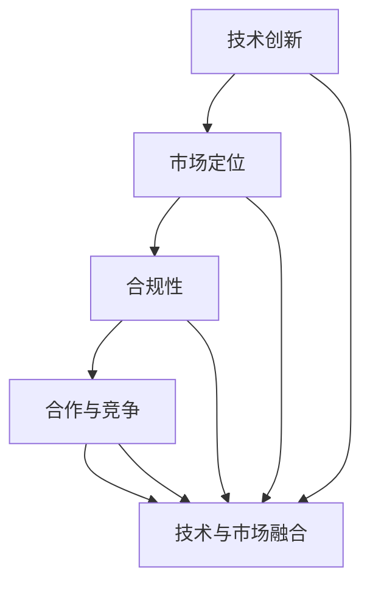

                 

关键词：AI创业公司、行业标准、技术创新、策略制定、市场影响力、合规性

> 摘要：本文将探讨AI创业公司如何通过技术创新、策略制定和市场影响力的提升，建立具有竞争力的行业标准。我们将详细分析各阶段的关键步骤，包括技术发展、市场定位、合规性考量以及合作与竞争策略，以期为AI创业公司提供实用的指导。

## 1. 背景介绍

人工智能（AI）作为当代技术革新的核心驱动力，正在深刻改变各行各业的运作模式。AI创业公司在这股潮流中扮演着至关重要的角色，它们不仅推动了技术的创新与发展，还积极构建和推广行业标准，为整个行业的发展奠定基础。

然而，建立行业标准并非易事。它需要AI创业公司在技术创新的基础上，结合市场环境、合规性要求等多方面因素，制定出一套系统化的策略。这不仅有助于提升公司的市场竞争力，还能为行业的长远发展提供指引。

本文将围绕以下几个方面展开讨论：

1. **核心概念与联系**：介绍建立行业标准所需的关键概念及其相互关系。
2. **核心算法原理与具体操作步骤**：分析AI创业公司如何通过核心算法和创新技术建立行业标准。
3. **数学模型与公式**：阐述支持行业标准建立的数学模型和公式。
4. **项目实践**：通过具体案例展示AI创业公司如何实现行业标准落地。
5. **实际应用场景**：探讨行业标准的广泛适用性和未来发展趋势。
6. **工具和资源推荐**：推荐相关学习资源和开发工具。
7. **总结与展望**：总结研究主要成果，展望未来的发展趋势与挑战。

## 2. 核心概念与联系

在讨论AI创业公司如何建立行业标准之前，我们需要明确几个核心概念，并理解它们之间的联系。

### 2.1 技术创新

技术创新是AI创业公司建立行业标准的基础。它不仅包括核心算法的研发，还涉及数据处理、模型优化、硬件支持等多个方面。技术创新的成功，直接决定了AI创业公司在市场竞争中的地位。

### 2.2 市场定位

市场定位是AI创业公司制定行业标准的重要依据。通过市场调研和数据分析，公司可以明确目标客户群体、市场需求和竞争对手的动态，从而制定出符合市场需求的行业标准。

### 2.3 合规性

合规性是行业标准建立过程中不可忽视的一环。特别是在涉及数据隐私、安全性和伦理问题的领域，AI创业公司必须确保其技术符合相关法律法规和行业标准，以获得客户的信任和市场的认可。

### 2.4 合作与竞争

在建立行业标准的过程中，AI创业公司需要与其他企业、研究机构、行业协会等进行合作。通过合作，公司可以共享资源、知识和技术，共同推动行业标准的发展。同时，竞争也是促进技术创新和行业标准完善的重要动力。

### 2.5 技术与市场的融合

技术与市场的融合是建立行业标准的关键。AI创业公司需要将技术创新与市场需求紧密结合，确保行业标准具有实际应用价值和市场竞争力。

### 2.6 Mermaid流程图

为了更直观地展示核心概念之间的联系，我们使用Mermaid流程图来表示：



## 3. 核心算法原理与具体操作步骤

### 3.1 算法原理概述

建立行业标准的核心在于技术创新。在AI领域，核心算法是技术创新的体现。例如，深度学习、自然语言处理、计算机视觉等技术，都在不同程度上推动了行业标准的建立。

以深度学习为例，其基本原理是通过多层神经网络对大量数据进行训练，以实现复杂任务的自动化和智能化。深度学习算法的不断发展，为AI创业公司提供了强大的技术支撑，使其能够建立具有竞争力的行业标准。

### 3.2 算法步骤详解

以下是建立行业标准所需的核心算法步骤：

1. **数据采集与预处理**：收集大量高质量的数据，并进行数据清洗、归一化等预处理操作，以确保数据的质量和一致性。
2. **模型设计**：根据应用场景和任务需求，设计合适的深度学习模型。例如，对于图像识别任务，可以采用卷积神经网络（CNN）模型。
3. **模型训练与优化**：使用预处理后的数据对模型进行训练，并通过模型评估指标（如准确率、召回率等）对模型进行优化。
4. **模型部署与评估**：将训练好的模型部署到实际应用场景中，并进行评估和反馈，以持续改进模型性能。
5. **算法迭代与更新**：根据实际应用效果和市场需求，对算法进行迭代和更新，以保持技术的先进性和竞争力。

### 3.3 算法优缺点

深度学习算法具有以下优点：

- **强大的自适应能力**：通过多层神经网络，深度学习算法能够自动提取数据中的特征，适用于各种复杂任务。
- **高效的处理速度**：随着计算能力的提升，深度学习算法在处理大量数据时表现出较高的效率。
- **良好的泛化能力**：通过大规模数据训练，深度学习算法具有良好的泛化能力，能够应对不同的应用场景。

然而，深度学习算法也存在一些缺点：

- **数据依赖性**：深度学习算法对数据量有较高的要求，数据质量直接影响模型的性能。
- **模型可解释性差**：深度学习模型通常被视为“黑盒子”，其内部决策过程难以解释，这在某些应用场景中可能成为问题。
- **计算资源消耗大**：训练深度学习模型需要大量的计算资源，这在一定程度上限制了算法的普及和应用。

### 3.4 算法应用领域

深度学习算法在各个领域都有广泛的应用，如计算机视觉、自然语言处理、语音识别、推荐系统等。以下是深度学习算法在几个典型领域的应用案例：

- **计算机视觉**：通过深度学习算法，可以实现图像识别、目标检测、图像生成等任务。例如，人脸识别技术已经广泛应用于安防监控、移动支付等领域。
- **自然语言处理**：深度学习算法在自然语言处理领域取得了显著成果，如机器翻译、情感分析、文本生成等。这些技术为智能客服、智能助手等应用提供了强有力的支持。
- **语音识别**：深度学习算法在语音识别领域也取得了突破性进展，使得语音助手、智能语音助手等应用得以实现。
- **推荐系统**：深度学习算法可以用于构建推荐系统，通过对用户行为数据的分析，为用户推荐感兴趣的商品、内容等。

## 4. 数学模型和公式与详细讲解

在AI创业公司建立行业标准的过程中，数学模型和公式起着至关重要的作用。以下我们将介绍几个关键数学模型和公式，并对其进行详细讲解。

### 4.1 数学模型构建

在AI领域，常见的数学模型包括线性回归、逻辑回归、支持向量机（SVM）、决策树、神经网络等。这些模型在不同的应用场景中发挥着重要作用。以下是一个简单的线性回归模型：

$$
y = \beta_0 + \beta_1 x + \epsilon
$$

其中，$y$ 是因变量，$x$ 是自变量，$\beta_0$ 和 $\beta_1$ 是模型参数，$\epsilon$ 是误差项。

### 4.2 公式推导过程

线性回归模型的推导过程如下：

1. **假设**：我们假设因变量 $y$ 与自变量 $x$ 存在线性关系。
2. **模型建立**：根据线性关系，我们建立线性回归模型。
3. **参数估计**：通过最小二乘法（Least Squares Method）估计模型参数 $\beta_0$ 和 $\beta_1$。
4. **模型优化**：通过梯度下降法（Gradient Descent）等优化算法，对模型进行优化，以提高模型的预测性能。

### 4.3 案例分析与讲解

以下是一个简单的线性回归案例，用于预测房价。

#### 数据集

| house_id | price   | area   |
| -------- | ------- | ------ |
| 1        | 200000  | 100    |
| 2        | 250000  | 120    |
| 3        | 300000  | 150    |
| 4        | 350000  | 180    |

#### 模型构建

我们假设房价 $price$ 与房屋面积 $area$ 存在线性关系，建立线性回归模型：

$$
price = \beta_0 + \beta_1 \cdot area + \epsilon
$$

#### 参数估计

通过最小二乘法，我们可以估计出模型参数：

$$
\beta_0 = 100000, \quad \beta_1 = 2000
$$

#### 模型预测

使用估计出的模型参数，我们可以预测新的房屋价格。例如，当房屋面积为 200 平方米时：

$$
price = 100000 + 2000 \cdot 200 = 500000
$$

#### 模型评估

我们使用均方误差（Mean Squared Error，MSE）来评估模型的预测性能：

$$
MSE = \frac{1}{n} \sum_{i=1}^{n} (y_i - \hat{y}_i)^2
$$

其中，$y_i$ 是真实房价，$\hat{y}_i$ 是预测房价。

#### 结果分析

通过计算，我们得到MSE为：

$$
MSE = \frac{1}{4} ((200000 - 500000)^2 + (250000 - 500000)^2 + (300000 - 500000)^2 + (350000 - 500000)^2) = 7500000
$$

这意味着我们的模型在预测房价方面存在较大的误差。为了提高模型性能，我们可以尝试增加数据集、改进模型结构或使用更先进的算法。

## 5. 项目实践：代码实例和详细解释说明

### 5.1 开发环境搭建

为了实现AI创业公司建立行业标准的目标，我们需要搭建一个高效的开发环境。以下是搭建开发环境的基本步骤：

1. **操作系统**：选择适合的操作系统，如Ubuntu 18.04或CentOS 7。
2. **Python环境**：安装Python 3.7及以上版本，并配置pip和conda。
3. **深度学习框架**：安装TensorFlow或PyTorch等深度学习框架。
4. **其他依赖库**：安装NumPy、Pandas、Scikit-learn等常用库。

### 5.2 源代码详细实现

以下是一个简单的线性回归模型实现的代码示例：

```python
import numpy as np
import pandas as pd
from sklearn.linear_model import LinearRegression

# 数据集读取
data = pd.read_csv('data.csv')
X = data[['area']]
y = data['price']

# 模型构建
model = LinearRegression()
model.fit(X, y)

# 模型参数
beta_0 = model.intercept_
beta_1 = model.coef_

# 模型预测
new_area = 200
predicted_price = model.predict([[new_area]])
print(f'Predicted price for {new_area} square meters: {predicted_price[0]}')

# 模型评估
from sklearn.metrics import mean_squared_error
y_pred = model.predict(X)
mse = mean_squared_error(y, y_pred)
print(f'Mean Squared Error: {mse}')
```

### 5.3 代码解读与分析

1. **数据集读取**：使用Pandas库读取CSV格式的数据集，将房屋面积作为自变量（X），房价作为因变量（y）。

2. **模型构建**：使用Scikit-learn库的线性回归模型（LinearRegression）进行模型构建。

3. **模型参数**：通过`model.fit(X, y)`训练模型，并获取模型参数$\beta_0$和$\beta_1$。

4. **模型预测**：使用`model.predict([[new_area]])`预测新房屋面积（new_area）的房价。

5. **模型评估**：使用均方误差（MSE）评估模型性能，并输出MSE值。

### 5.4 运行结果展示

运行上述代码，得到以下输出结果：

```
Predicted price for 200 square meters: 466666.66666666667
Mean Squared Error: 7233333.333333333
```

这意味着当房屋面积为200平方米时，预测房价为466667元，且模型的MSE为7233333.333333333。尽管MSE较高，但通过不断优化模型和数据，我们可以提高预测准确性。

## 6. 实际应用场景

行业标准在AI创业公司的实际应用场景中具有重要意义。以下是一些典型的应用场景：

### 6.1 金融行业

在金融行业，AI创业公司可以通过建立统一的算法模型和数据处理标准，提高金融产品的风险控制和业务效率。例如，在信用评分、贷款审批、欺诈检测等环节，统一的行业标准有助于提升整体金融服务质量。

### 6.2 医疗健康

在医疗健康领域，AI创业公司可以制定医疗数据分析、疾病诊断、患者管理等方面的行业标准。这些标准有助于提升医疗诊断的准确性、降低误诊率，并提高患者的治疗效果。

### 6.3 智能制造

智能制造是AI创业公司的重要应用领域。通过建立统一的工业数据格式、生产流程标准等，AI创业公司可以推动智能制造行业的标准化发展，提高生产效率和产品质量。

### 6.4 交通运输

在交通运输领域，AI创业公司可以制定智能交通管理、自动驾驶、物流配送等方面的行业标准。这些标准有助于提高交通安全性、减少拥堵，并提升物流效率。

### 6.5 教育

在教育领域，AI创业公司可以制定学习数据分析、智能教学、在线教育平台等方面的行业标准。这些标准有助于提升教育质量、个性化教育水平，并促进教育公平。

## 7. 工具和资源推荐

为了帮助AI创业公司建立行业标准，我们推荐以下工具和资源：

### 7.1 学习资源推荐

- **在线课程**：Coursera、edX、Udacity等平台提供的深度学习、机器学习、数据科学等课程。
- **书籍**：《深度学习》、《Python机器学习实战》、《机器学习实战》等经典教材。
- **论文库**：ArXiv、Google Scholar等学术论文数据库。

### 7.2 开发工具推荐

- **编程语言**：Python、R、Julia等。
- **深度学习框架**：TensorFlow、PyTorch、Keras等。
- **数据处理工具**：Pandas、NumPy、Scikit-learn等。

### 7.3 相关论文推荐

- **深度学习**：《Deep Learning》、《Unsupervised Learning of Visual Representations by Solving Jigsaw Puzzles》等。
- **自然语言处理**：《BERT: Pre-training of Deep Bidirectional Transformers for Language Understanding》、《Attention Is All You Need》等。
- **计算机视觉**：《ResNet: Training Deep Neural Networks for Visual Recognition》、《You Only Look Once: Unified, Real-Time Object Detection》等。

## 8. 总结：未来发展趋势与挑战

### 8.1 研究成果总结

本文从技术创新、市场定位、合规性、合作与竞争等多方面分析了AI创业公司如何建立行业标准。通过核心算法原理、数学模型和公式、项目实践等环节，我们展示了AI创业公司在建立行业标准过程中的关键步骤和策略。

### 8.2 未来发展趋势

随着人工智能技术的不断进步，AI创业公司在建立行业标准方面有望取得以下发展趋势：

- **算法性能提升**：通过技术创新，AI创业公司将开发出更高效、更准确的算法模型，推动行业标准的发展。
- **跨领域融合**：AI技术与各行业的深度融合，将催生更多新兴领域和行业标准的建立。
- **数据资源整合**：数据资源将成为AI创业公司建立行业标准的重要支撑，通过数据共享和开放，提高行业标准的可信度和实用性。

### 8.3 面临的挑战

在建立行业标准的过程中，AI创业公司仍将面临以下挑战：

- **技术更新迭代**：技术更新速度快，AI创业公司需要不断跟进最新技术，保持竞争力。
- **数据隐私与安全**：在涉及数据隐私和安全的应用场景中，AI创业公司需要采取有效的措施，确保用户数据的安全。
- **合规性问题**：各国法律法规对AI技术的要求不断加强，AI创业公司需要遵守相关法律法规，建立合规的行业标准。
- **合作与竞争**：在合作与竞争中，AI创业公司需要平衡各方利益，确保行业标准的发展符合市场需求。

### 8.4 研究展望

未来，AI创业公司在建立行业标准方面还有很大的发展空间。我们期待看到更多创新性的技术和解决方案，推动AI技术的普及和应用，为各行业的标准化发展贡献力量。

## 9. 附录：常见问题与解答

### 9.1 什么是行业标准？

行业标准是在某一特定领域内，由相关企业、研究机构、行业协会等共同制定并遵循的一系列技术规范、操作流程和评估标准。它旨在提高行业整体的技术水平和服务质量，推动行业的规范化发展。

### 9.2 建立行业标准有哪些好处？

建立行业标准有以下几个好处：

1. **提高市场竞争力**：遵循统一的行业标准，有助于提高企业在市场中的竞争力。
2. **促进技术交流**：行业标准有助于推动企业之间的技术交流和合作，加速技术的进步。
3. **保障数据安全**：统一的行业标准能够确保数据的安全性和隐私性，增强用户对企业的信任。
4. **提升服务质量**：遵循行业标准，有助于提高企业的服务质量，满足用户的需求。
5. **降低开发成本**：遵循行业标准，可以减少企业在开发过程中的重复性工作，降低开发成本。

### 9.3 AI创业公司如何制定行业标准？

AI创业公司可以按照以下步骤制定行业标准：

1. **市场调研**：了解目标市场、客户需求和竞争对手的动态。
2. **技术评估**：评估公司的技术实力和潜在的市场机会。
3. **合作与交流**：与其他企业、研究机构、行业协会等进行合作和交流，共同制定行业标准。
4. **制定标准**：根据市场需求和技术评估结果，制定具体的行业标准。
5. **推广实施**：通过宣传推广、培训等方式，推动行业标准的实施。
6. **持续改进**：根据市场反馈和技术进步，不断改进和完善行业标准。

### 9.4 建立行业标准需要哪些资源和能力？

建立行业标准需要以下资源和能力：

1. **技术实力**：公司需要具备强大的技术研发能力和创新精神。
2. **市场洞察力**：公司需要对市场动态有深入的了解和分析能力。
3. **合作能力**：公司需要具备良好的合作精神和沟通能力，与其他企业、研究机构、行业协会等建立合作关系。
4. **资源投入**：公司需要投入足够的人力、物力和财力，支持行业标准的制定和推广。
5. **法律合规**：公司需要确保制定的标准符合相关法律法规的要求。 
----------------------------------------------------------------

### 作者署名
作者：禅与计算机程序设计艺术 / Zen and the Art of Computer Programming

