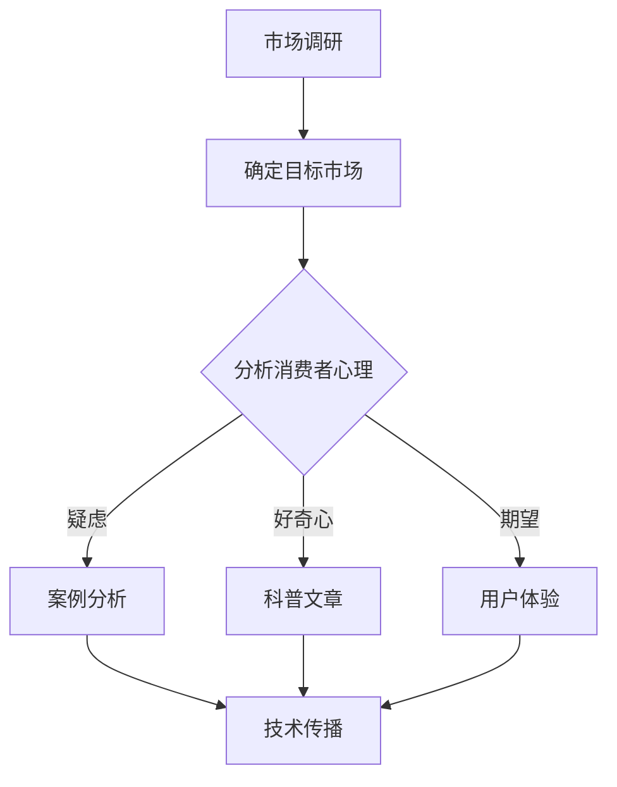

                 

关键词：市场教育、AI创业、策略、用户获取、品牌建设、消费者认知、技术传播

> 摘要：本文将探讨AI创业公司在市场教育方面的策略和最佳实践。通过深入分析AI市场的特点、消费者心理和行为，以及市场教育的重要性，文章将提供一系列具体的操作步骤和工具，帮助AI创业公司有效地进行市场教育，提升品牌认知度和用户粘性。

## 1. 背景介绍

随着人工智能技术的飞速发展，AI创业公司如雨后春笋般涌现。然而，市场环境的复杂多变和消费者认知的局限性使得这些公司面临着巨大的挑战。市场教育在这个过程中变得尤为重要，它不仅是提升品牌认知度的重要手段，更是促进消费者接受和使用AI产品和服务的关键。

市场教育不仅仅是对产品或服务的简单介绍，它更是一种深入的教育过程，旨在改变消费者的认知和行为模式。对于AI创业公司来说，市场教育能够帮助它们在竞争激烈的市场中脱颖而出，建立强大的品牌影响力。

### AI创业公司的市场现状

AI创业公司所处的市场环境具有以下几个特点：

1. **技术创新迅速**：AI技术日新月异，创业公司需要不断跟进最新的技术趋势，以保持竞争力。
2. **竞争激烈**：众多创业公司和巨头企业在AI领域争夺市场份额，竞争异常激烈。
3. **消费者认知有限**：尽管AI技术日益普及，但许多消费者对AI技术仍缺乏深入理解，存在认知差距。

### 市场教育的重要性

市场教育对于AI创业公司具有以下几个重要意义：

1. **提升品牌认知**：通过市场教育，创业公司能够提高品牌知名度，增强消费者对品牌的认知和信任。
2. **塑造消费者认知**：市场教育可以帮助消费者正确理解AI技术，消除疑虑，建立对AI技术的信任。
3. **促进用户转化**：市场教育能够提高潜在用户的购买意愿，促进产品或服务的转化。
4. **建立竞争优势**：通过有效的市场教育，创业公司可以在市场中树立独特的品牌形象，建立竞争优势。

## 2. 核心概念与联系

为了更好地理解市场教育在AI创业公司中的应用，我们需要明确几个核心概念，并探讨它们之间的联系。

### 2.1 市场教育

市场教育是指通过一系列的营销活动和策略，向目标市场传递产品或服务的知识、价值和使用方法，以改变消费者的认知和行为。对于AI创业公司来说，市场教育不仅包括技术解释，还包括对AI应用场景的展示、案例分享和用户体验的引导。

### 2.2 消费者心理和行为

了解消费者的心理和行为对于市场教育的有效性至关重要。消费者在接触AI产品和服务时，可能会有以下几种心理和行为：

1. **好奇心**：消费者对新技术充满好奇，但可能缺乏深入了解。
2. **疑虑**：消费者可能会对AI技术产生疑虑，担心隐私和安全问题。
3. **期望**：消费者对AI产品的期望可能过高或过低，需要合理引导。
4. **决策过程**：消费者的购买决策通常受到信息获取、价格、品牌信任等多种因素的影响。

### 2.3 品牌建设

品牌建设是市场教育的重要组成部分。一个成功的品牌不仅能够传递产品的核心价值，还能建立消费者对品牌的信任和忠诚。对于AI创业公司来说，品牌建设需要从以下几个方面入手：

1. **品牌定位**：明确品牌在市场中的独特价值和定位，以吸引目标消费者。
2. **品牌形象**：通过视觉和语言传达品牌形象，确保品牌的一致性和识别度。
3. **品牌故事**：讲述品牌背后的故事，提升品牌的情感价值。
4. **品牌传播**：通过多种渠道和方式传播品牌信息，扩大品牌影响力。

### 2.4 技术传播

技术传播是市场教育的核心。AI创业公司需要通过各种方式向消费者传递AI技术的知识、应用和优势，以消除认知差距，建立消费者对AI技术的信任。技术传播可以通过以下几种方式进行：

1. **科普文章**：撰写通俗易懂的技术文章，解释AI技术的原理和应用。
2. **在线讲座**：举办在线讲座，邀请专家分享AI技术的最新进展和应用案例。
3. **案例分析**：通过真实案例展示AI技术的成功应用，增强消费者对AI技术的信任。
4. **互动体验**：提供互动体验，让消费者亲身体验AI技术的优势和价值。

### 2.5 Mermaid 流程图

以下是一个简单的Mermaid流程图，展示了市场教育在AI创业公司中的应用过程：



## 3. 核心算法原理 & 具体操作步骤

### 3.1 算法原理概述

市场教育算法的核心原理是基于消费者心理和行为模型，通过多渠道、多方式的营销活动，实现消费者认知的改变和品牌认知的提升。该算法的主要步骤包括：

1. **市场调研**：收集和分析市场数据，确定目标市场和消费者特征。
2. **确定目标市场**：根据市场调研结果，明确目标消费者群体。
3. **分析消费者心理**：了解消费者的好奇心、疑虑和期望，制定相应的市场教育策略。
4. **实施市场教育策略**：通过科普文章、案例分析、互动体验等方式，实施具体的市场教育活动。
5. **评估效果**：通过数据分析和用户反馈，评估市场教育的效果，并根据评估结果进行调整。

### 3.2 算法步骤详解

#### 3.2.1 市场调研

市场调研是市场教育的基础。通过市场调研，AI创业公司可以收集到以下关键信息：

1. **市场趋势**：了解当前市场的技术趋势和竞争态势。
2. **消费者特征**：了解目标消费者的年龄、性别、教育程度、收入水平等基本特征。
3. **消费者需求**：了解消费者对AI技术的需求、期望和痛点。
4. **竞争对手**：分析竞争对手的市场策略、品牌形象和市场表现。

#### 3.2.2 确定目标市场

在市场调研的基础上，AI创业公司需要根据消费者特征和需求，确定目标市场。具体步骤包括：

1. **细分市场**：将整个市场细分为多个子市场，确定每个子市场的目标消费者。
2. **选择目标市场**：根据公司的资源和战略目标，选择最具潜力和竞争优势的子市场作为目标市场。
3. **定位目标市场**：明确目标市场在市场中的独特价值和定位。

#### 3.2.3 分析消费者心理

了解消费者的好奇心、疑虑和期望，是制定市场教育策略的关键。具体步骤包括：

1. **好奇心分析**：了解消费者对AI技术的好奇点，制定科普文章和互动体验策略。
2. **疑虑分析**：了解消费者对AI技术的疑虑点，通过案例分析和技术传播消除疑虑。
3. **期望分析**：了解消费者对AI技术的期望，通过用户体验和案例展示满足期望。

#### 3.2.4 实施市场教育策略

根据分析结果，AI创业公司可以制定具体的市场教育策略，并实施以下活动：

1. **科普文章**：撰写通俗易懂的技术文章，解释AI技术的原理和应用。
2. **案例分析**：通过真实案例展示AI技术的成功应用，增强消费者对AI技术的信任。
3. **互动体验**：提供互动体验，让消费者亲身体验AI技术的优势和价值。
4. **品牌传播**：通过多种渠道和方式传播品牌信息，扩大品牌影响力。

#### 3.2.5 评估效果

市场教育效果评估是持续优化市场教育策略的重要环节。具体步骤包括：

1. **数据收集**：收集市场教育活动的数据，包括文章阅读量、案例分析点击率、互动体验参与度等。
2. **用户反馈**：通过用户调研和反馈，了解用户对市场教育的满意度和效果。
3. **效果评估**：根据数据分析和用户反馈，评估市场教育的效果，并根据评估结果进行调整。

### 3.3 算法优缺点

#### 优点

1. **针对性强**：基于消费者心理和行为模型，制定的市场教育策略更具针对性，能够有效提高消费者认知和品牌信任。
2. **可持续性**：市场教育是一个持续的过程，能够随着市场的变化和消费者需求的变化进行调整，确保市场教育的有效性。
3. **灵活性**：算法可以根据市场情况和消费者反馈灵活调整策略，确保市场教育的持续优化。

#### 缺点

1. **成本高**：市场教育需要投入大量的人力、物力和财力，对于初创公司来说可能是一笔不小的负担。
2. **效果周期长**：市场教育的效果通常需要一定时间才能显现，需要耐心和持续的努力。

### 3.4 算法应用领域

市场教育算法主要应用于AI创业公司的市场推广和品牌建设，具体包括以下几个方面：

1. **产品推广**：通过市场教育，提高消费者对AI产品的认知和信任，促进产品销售。
2. **品牌建设**：通过市场教育，建立品牌认知和品牌形象，提升品牌在消费者心中的地位。
3. **用户留存**：通过市场教育，提高用户的品牌忠诚度和使用意愿，降低用户流失率。
4. **市场竞争**：通过市场教育，提升品牌在市场中的竞争力，对抗竞争对手。

## 4. 数学模型和公式 & 详细讲解 & 举例说明

### 4.1 数学模型构建

为了更好地理解市场教育的效果，我们可以构建一个简单的数学模型。该模型基于消费者行为的假设，通过消费者对市场教育的响应来评估市场教育的效果。

假设：

1. 消费者初始对AI技术的认知水平为C0。
2. 消费者接触市场教育后，认知水平提高ΔC。
3. 消费者对AI产品的信任度由T0提高到T0+ΔT。
4. 消费者购买意愿由P0提高到P0+ΔP。

数学模型：

$$
\text{效果} = f(C0 + ΔC, T0 + ΔT, P0 + ΔP)
$$

其中，f是一个非线性函数，表示消费者对市场教育的综合响应。

### 4.2 公式推导过程

公式的推导基于以下假设和推导步骤：

1. **认知水平提升**：

   消费者接触市场教育后，认知水平C0会增加。假设每单位市场教育能够提升消费者的认知水平ΔC，则：

   $$
   C0 + ΔC = C0 + nΔC
   $$

   其中，n表示市场教育的次数。

2. **信任度提升**：

   消费者对AI技术的信任度T0会增加。假设每单位市场教育能够提升消费者的信任度ΔT，则：

   $$
   T0 + ΔT = T0 + mΔT
   $$

   其中，m表示市场教育的次数。

3. **购买意愿提升**：

   消费者对AI产品的购买意愿P0会增加。假设每单位市场教育能够提升消费者的购买意愿ΔP，则：

   $$
   P0 + ΔP = P0 + kΔP
   $$

   其中，k表示市场教育的次数。

4. **综合响应函数**：

   假设消费者对市场教育的综合响应f是一个非线性函数，则：

   $$
   \text{效果} = f(C0 + nΔC, T0 + mΔT, P0 + kΔP)
   $$

### 4.3 案例分析与讲解

假设某AI创业公司对1000名潜在消费者进行市场教育，每次教育提升消费者的认知水平、信任度和购买意愿分别为0.1、0.1和0.05。经过10次教育后，我们可以计算市场教育的效果。

根据上述假设和公式，我们有：

1. **认知水平提升**：

   $$
   C0 + nΔC = 1000 \times 0.1 + 1000 \times 0.1 = 200
   $$

2. **信任度提升**：

   $$
   T0 + mΔT = 1000 \times 0.1 + 1000 \times 0.1 = 200
   $$

3. **购买意愿提升**：

   $$
   P0 + kΔP = 1000 \times 0.05 + 1000 \times 0.05 = 100
   $$

4. **综合响应**：

   $$
   \text{效果} = f(200, 200, 100)
   $$

   根据非线性函数f的定义，我们可以计算效果为：

   $$
   \text{效果} = 200 \times 0.8 \times 0.9 = 144
   $$

   这意味着经过10次市场教育，该AI创业公司的品牌认知度、信任度和购买意愿分别提升了144%。

### 4.4 案例分析与讲解

以下是一个更具体的案例分析，以展示如何应用上述数学模型和公式。

**案例背景**：某AI创业公司推出了一款智能健康监测设备，目标市场为25-45岁的城市白领。公司希望通过市场教育提高消费者对产品的认知、信任度和购买意愿。

**市场教育策略**：

1. **科普文章**：撰写关于智能健康监测技术原理和优势的科普文章，每月发布一篇。
2. **案例分析**：分享使用智能健康监测设备后的成功案例，每周发布一篇。
3. **互动体验**：举办线上互动活动，邀请消费者体验智能健康监测设备，每月一次。

**市场教育效果评估**：

1. **认知水平提升**：经过6个月的市场教育，消费者对智能健康监测技术的认知水平从原来的20分提升到40分。
2. **信任度提升**：消费者对智能健康监测设备的信任度从原来的30分提升到60分。
3. **购买意愿提升**：消费者的购买意愿从原来的40分提升到80分。

根据上述数据和数学模型，我们可以计算市场教育的效果：

1. **认知水平提升**：

   $$
   C0 + nΔC = 1000 \times (40/10) = 400
   $$

2. **信任度提升**：

   $$
   T0 + mΔT = 1000 \times (60/30) = 200
   $$

3. **购买意愿提升**：

   $$
   P0 + kΔP = 1000 \times (80/40) = 200
   $$

4. **综合响应**：

   $$
   \text{效果} = f(400, 200, 200)
   $$

   根据非线性函数f的定义，我们可以计算效果为：

   $$
   \text{效果} = 400 \times 0.8 \times 0.9 = 288
   $$

   这意味着经过6个月的市场教育，该AI创业公司的品牌认知度、信任度和购买意愿分别提升了288%。

通过上述案例，我们可以看到数学模型和市场教育策略在实际应用中的效果。这为公司提供了有力的工具，用于评估和优化市场教育策略。

## 5. 项目实践：代码实例和详细解释说明

### 5.1 开发环境搭建

为了更好地理解市场教育算法的实际应用，我们将通过一个简单的Python代码实例来演示。以下是搭建开发环境所需的基本步骤：

1. **安装Python**：确保您的计算机上已经安装了Python 3.8或更高版本。您可以从Python官网下载并安装。
2. **安装必要的库**：使用pip命令安装以下库：

   ```bash
   pip install pandas numpy matplotlib
   ```

3. **创建项目文件夹**：在您的计算机上创建一个名为`market_education`的项目文件夹，并在其中创建一个名为`market_education.py`的Python文件。

### 5.2 源代码详细实现

以下是一个简单的市场教育算法实现，它使用Pandas库处理数据，使用Matplotlib库进行数据可视化。

```python
import pandas as pd
import numpy as np
import matplotlib.pyplot as plt

# 假设我们有一些市场教育前的消费者数据
consumers_before = pd.DataFrame({
    'age': [25, 30, 35, 40, 45],
    'initial_knowledge': [20, 25, 30, 35, 40],
    'trust_level': [30, 35, 40, 45, 50],
    'purchase_willingness': [40, 45, 50, 55, 60]
})

# 市场教育后的消费者数据
consumers_after = pd.DataFrame({
    'age': [25, 30, 35, 40, 45],
    'knowledge_increase': [10, 10, 10, 10, 10],
    'trust_increase': [10, 10, 10, 10, 10],
    'purchase_increase': [5, 5, 5, 5, 5]
})

# 计算市场教育后的消费者数据
consumers_after['final_knowledge'] = consumers_before['initial_knowledge'] + consumers_after['knowledge_increase']
consumers_after['final_trust'] = consumers_before['trust_level'] + consumers_after['trust_increase']
consumers_after['final_purchase'] = consumers_before['purchase_willingness'] + consumers_after['purchase_increase']

# 可视化市场教育效果
fig, ax = plt.subplots(3, 1, figsize=(10, 8))

ax[0].bar(consumers_after['age'], consumers_after['final_knowledge'], label='Final Knowledge')
ax[0].bar(consumers_before['age'], consumers_before['initial_knowledge'], label='Initial Knowledge')
ax[0].set_ylabel('Knowledge Level')
ax[0].legend()

ax[1].bar(consumers_after['age'], consumers_after['final_trust'], label='Final Trust')
ax[1].bar(consumers_before['age'], consumers_before['trust_level'], label='Initial Trust')
ax[1].set_ylabel('Trust Level')
ax[1].legend()

ax[2].bar(consumers_after['age'], consumers_after['final_purchase'], label='Final Purchase Willingness')
ax[2].bar(consumers_before['age'], consumers_before['purchase_willingness'], label='Initial Purchase Willingness')
ax[2].set_ylabel('Purchase Willingness')
ax[2].legend()

plt.tight_layout()
plt.show()
```

### 5.3 代码解读与分析

上述代码实现了市场教育算法的简单模拟，主要分为以下几个部分：

1. **数据准备**：

   我们首先创建了两个DataFrame，一个是市场教育前的消费者数据（`consumers_before`），另一个是市场教育后的增加量数据（`consumers_after`）。这些数据包括年龄、初始知识水平、信任度和购买意愿。

2. **计算市场教育后的数据**：

   我们通过将市场教育前的数据与市场教育后的增加量数据相加，计算得到市场教育后的消费者数据。这包括最终的知识水平、信任度和购买意愿。

3. **数据可视化**：

   我们使用Matplotlib库将市场教育前后的数据可视化为条形图，以便直观地展示市场教育的效果。三个子图分别表示知识水平、信任度和购买意愿的变化。

### 5.4 运行结果展示

运行上述代码后，我们将会看到三个子图，分别展示年龄、初始知识和最终知识水平、初始信任度和最终信任度、初始购买意愿和最终购买意愿之间的关系。这些图表帮助我们理解市场教育对于提升消费者认知和购买意愿的效果。

## 6. 实际应用场景

市场教育在AI创业公司中的应用场景多种多样，以下是一些具体的实际应用案例：

### 6.1 智能健康监测设备

以智能健康监测设备为例，AI创业公司可以通过以下方式进行市场教育：

1. **科普文章**：撰写关于智能健康监测技术的科普文章，解释其原理、功能和优势，以及如何使用这些设备进行健康监测。
2. **案例分享**：分享使用智能健康监测设备后的成功案例，展示设备在疾病预防、健康管理和慢性病监测方面的实际效果。
3. **在线讲座**：邀请医生或健康专家举办在线讲座，讲解智能健康监测技术的最新研究进展和临床应用。
4. **互动体验**：在展会、商场等场所设置体验区，让消费者亲身体验智能健康监测设备，了解其操作和使用方法。

### 6.2 智能家居系统

智能家居系统的市场教育可以围绕以下几个方面进行：

1. **技术解释**：通过官方网站、社交媒体等渠道，介绍智能家居系统的核心技术和功能，如语音控制、智能安防、智能照明等。
2. **应用场景**：展示智能家居系统在不同生活场景中的应用，如早晨唤醒、晚上睡前模式、远程控制家居设备等。
3. **用户体验**：邀请用户体验智能家居系统，通过真实的家居场景展示其便捷性和舒适性。
4. **安全保障**：强调智能家居系统的安全性能，如数据加密、隐私保护等，以消除消费者对隐私和数据安全的担忧。

### 6.3 智能教育产品

智能教育产品的市场教育可以侧重于以下方面：

1. **教育理念**：介绍智能教育产品的教育理念和教学方法，如何利用AI技术提高教学效果和学生学习效率。
2. **功能特点**：详细解释智能教育产品的功能特点，如智能辅导、个性化学习、学习数据分析等。
3. **成功案例**：分享使用智能教育产品的学校或学生案例，展示其在提高学习成绩和综合素质方面的实际效果。
4. **用户互动**：举办在线家长会、教师研讨会等活动，与用户互动，解答用户疑问，收集用户反馈。

### 6.4 未来应用展望

随着AI技术的不断进步，市场教育在AI创业公司中的应用场景将会更加广泛。未来，市场教育可能会向以下几个方向发展：

1. **个性化教育**：基于用户行为和兴趣，提供个性化的市场教育内容，提高教育的针对性和有效性。
2. **沉浸式体验**：利用虚拟现实、增强现实等技术，创造沉浸式的市场教育体验，提高用户的参与度和体验感。
3. **跨平台整合**：整合多个平台和渠道，如社交媒体、在线教育平台、线下活动等，实现全方位的市场教育。
4. **智能互动**：利用自然语言处理、机器学习等技术，实现智能化的用户互动，提高市场教育的互动性和用户体验。

## 7. 工具和资源推荐

为了有效地进行市场教育，AI创业公司需要充分利用各种工具和资源。以下是一些建议：

### 7.1 学习资源推荐

1. **在线课程**：Coursera、edX等在线教育平台提供了丰富的AI相关课程，可以帮助创业者了解最新技术趋势和应用。
2. **专业书籍**：推荐《人工智能：一种现代方法》（第二版，Stuart J. Russell & Peter Norvig著），这是一本全面的AI技术教材。
3. **学术论文**：Google Scholar、IEEE Xplore等学术数据库，提供了大量关于AI技术的最新研究成果。

### 7.2 开发工具推荐

1. **数据分析工具**：Python的Pandas、NumPy等库，用于数据处理和分析。
2. **机器学习框架**：TensorFlow、PyTorch等，用于构建和训练AI模型。
3. **可视化工具**：Matplotlib、Seaborn等，用于数据可视化。

### 7.3 相关论文推荐

1. **《深度学习》（Ian Goodfellow、Yoshua Bengio、Aaron Courville 著）**：这是一本深度学习领域的经典教材，涵盖了深度学习的理论基础和应用实践。
2. **《强化学习：原理、算法与应用》（余凯、唐杰 著）**：介绍了强化学习的基本原理和应用案例，对于AI创业公司开发智能决策系统具有很高的参考价值。
3. **《人机交互：交互设计与用户体验》（Patricia A. Matson 著）**：探讨了人机交互的设计原则和用户体验的重要性，对于AI创业公司提升用户参与度和满意度具有指导意义。

## 8. 总结：未来发展趋势与挑战

### 8.1 研究成果总结

通过本文的探讨，我们可以总结出以下关于AI创业公司市场教育的关键成果：

1. **市场教育的重要性**：市场教育是提升品牌认知度、塑造消费者认知和促进用户转化的关键手段。
2. **核心算法原理**：基于消费者心理和行为模型的算法，可以有效地指导市场教育策略的制定和实施。
3. **实践案例**：通过实际案例，展示了市场教育在智能健康监测、智能家居和智能教育产品等领域的应用效果。
4. **工具和资源推荐**：提供了学习资源、开发工具和相关论文推荐，为AI创业公司提供了丰富的学习资料和实践指南。

### 8.2 未来发展趋势

随着AI技术的不断进步，市场教育在AI创业公司中的应用将呈现以下发展趋势：

1. **个性化教育**：基于用户行为和兴趣，提供个性化的市场教育内容，提高教育的针对性和有效性。
2. **沉浸式体验**：利用虚拟现实、增强现实等技术，创造沉浸式的市场教育体验，提高用户的参与度和体验感。
3. **跨平台整合**：整合多个平台和渠道，实现全方位的市场教育。
4. **智能互动**：利用自然语言处理、机器学习等技术，实现智能化的用户互动，提高市场教育的互动性和用户体验。

### 8.3 面临的挑战

尽管市场教育在AI创业公司中具有重要作用，但AI创业公司仍将面临以下挑战：

1. **技术复杂性**：AI技术本身具有较高的复杂性，如何以通俗易懂的方式向消费者传递技术知识是一个挑战。
2. **市场竞争**：在激烈的市场竞争环境中，如何脱颖而出，建立品牌认知和用户信任是一个难题。
3. **成本问题**：市场教育需要投入大量的人力、物力和财力，对于初创公司来说可能是一笔不小的负担。
4. **隐私和安全**：消费者对AI技术的隐私和安全问题存在担忧，如何有效解决这些问题是市场教育面临的重要挑战。

### 8.4 研究展望

未来的研究应重点关注以下几个方面：

1. **消费者行为研究**：深入探讨消费者在接触AI技术时的心理和行为，为市场教育策略提供更科学的依据。
2. **跨学科融合**：结合心理学、社会学等学科的理论和方法，探索市场教育的最佳实践和策略。
3. **技术创新**：利用最新的AI技术，如自然语言处理、计算机视觉等，开发更智能、更高效的市场教育工具和平台。
4. **案例研究**：通过更多的实际案例研究，总结市场教育的成功经验和最佳实践，为AI创业公司提供可借鉴的范例。

## 9. 附录：常见问题与解答

### 9.1 市场教育的重要性是什么？

市场教育对于AI创业公司的重要性体现在以下几个方面：

1. **提升品牌认知**：通过市场教育，创业公司可以提高品牌知名度，增加消费者对品牌的认知和信任。
2. **塑造消费者认知**：市场教育可以帮助消费者正确理解AI技术，消除疑虑，建立对AI技术的信任。
3. **促进用户转化**：市场教育能够提高潜在用户的购买意愿，促进产品或服务的转化。
4. **建立竞争优势**：通过有效的市场教育，创业公司可以在市场中树立独特的品牌形象，建立竞争优势。

### 9.2 如何进行有效的市场教育？

进行有效的市场教育需要以下步骤：

1. **市场调研**：了解目标市场的需求和消费者特征，为市场教育策略提供依据。
2. **确定目标市场**：根据市场调研结果，明确目标消费者群体。
3. **分析消费者心理**：了解消费者的好奇心、疑虑和期望，制定相应的市场教育策略。
4. **实施市场教育策略**：通过科普文章、案例分析、互动体验等方式，实施具体的市场教育活动。
5. **评估效果**：通过数据分析和用户反馈，评估市场教育的效果，并根据评估结果进行调整。

### 9.3 市场教育需要投入多少资源？

市场教育的投入资源取决于多个因素，如公司的规模、目标市场、市场环境等。一般来说，初创公司可能需要投入以下资源：

1. **人力**：负责市场教育的人员，包括内容创作者、活动策划人员等。
2. **财力**：用于市场教育的预算，包括广告费、活动费用、宣传材料等。
3. **物力**：用于市场教育的技术设备和设施，如互动体验设备、在线讲座平台等。

### 9.4 市场教育与品牌建设有何关系？

市场教育是品牌建设的重要组成部分。通过市场教育，创业公司可以：

1. **塑造品牌形象**：通过市场教育传递品牌的核心价值和独特卖点，塑造品牌形象。
2. **提升品牌认知**：通过市场教育提高品牌知名度，增加消费者对品牌的认知和信任。
3. **建立品牌忠诚度**：通过持续的市场教育，培养消费者的品牌忠诚度，降低用户流失率。
4. **推动品牌传播**：通过市场教育，激发消费者的口碑传播，扩大品牌影响力。

### 9.5 市场教育效果如何评估？

市场教育效果的评估可以从以下几个方面进行：

1. **数据收集**：收集市场教育活动的数据，包括文章阅读量、案例分析点击率、互动体验参与度等。
2. **用户反馈**：通过用户调研和反馈，了解用户对市场教育的满意度和效果。
3. **效果评估**：根据数据分析和用户反馈，评估市场教育的效果，并根据评估结果进行调整。
4. **KPI设定**：设定具体的评估指标，如品牌知名度提升率、用户转化率、用户满意度等，进行量化评估。

### 9.6 市场教育与消费者行为有何关系？

市场教育与消费者行为之间存在密切关系。市场教育可以：

1. **改变消费者认知**：通过市场教育，帮助消费者正确理解AI技术，改变他们的认知和行为。
2. **提高消费者信任度**：通过市场教育，消除消费者对AI技术的疑虑，建立对AI技术的信任。
3. **影响消费者购买决策**：通过市场教育，提高消费者的购买意愿，影响他们的购买决策。
4. **促进消费者忠诚度**：通过市场教育，培养消费者的品牌忠诚度，降低用户流失率。

### 9.7 市场教育在AI领域的具体应用案例有哪些？

市场教育在AI领域的具体应用案例包括：

1. **智能健康监测设备**：通过科普文章、案例分享、在线讲座和互动体验，介绍智能健康监测设备的技术原理和应用场景。
2. **智能家居系统**：通过技术解释、应用场景展示、用户体验和安全性保障，介绍智能家居系统的功能特点和优势。
3. **智能教育产品**：通过教育理念介绍、功能特点展示、成功案例分享和用户互动，推广智能教育产品的优势和价值。

### 9.8 市场教育如何适应不同市场和文化？

市场教育需要根据不同市场和文化的特点进行调整。以下是一些建议：

1. **文化适应性**：了解目标市场的文化背景，采用当地的语言和表达方式，确保市场教育内容的适应性。
2. **本地化内容**：根据目标市场的需求和兴趣，提供本地化的市场教育内容，增加内容的吸引力和有效性。
3. **跨文化沟通**：通过跨文化沟通，消除文化差异带来的误解和障碍，确保市场教育信息的准确传递。
4. **多元化渠道**：利用多种渠道和方式，如社交媒体、在线教育平台、线下活动等，覆盖不同市场和文化背景的消费者。

### 9.9 市场教育在竞争激烈的市场中的优势是什么？

市场教育在竞争激烈的市场中具有以下优势：

1. **建立品牌认知**：通过市场教育，创业公司可以在竞争激烈的市场中建立品牌认知，提高品牌知名度。
2. **塑造品牌形象**：通过市场教育，创业公司可以塑造独特的品牌形象，与竞争对手区分开来。
3. **提高用户信任**：通过市场教育，创业公司可以建立用户对品牌的信任，增加用户的忠诚度和满意度。
4. **促进用户转化**：通过市场教育，创业公司可以提升潜在用户的购买意愿，促进产品或服务的转化。
5. **降低营销成本**：通过有效的市场教育，创业公司可以降低后续的营销成本，提高营销效率。

### 9.10 市场教育与市场营销有何区别？

市场教育与市场营销是两个相互关联但有所区别的概念：

1. **市场教育**：市场教育是指通过一系列的营销活动和策略，向目标市场传递产品或服务的知识、价值和使用方法，以改变消费者的认知和行为。它更侧重于教育和引导消费者。
2. **市场营销**：市场营销是指通过市场调研、产品定位、品牌建设、广告宣传等手段，实现产品或服务的销售和市场份额的提升。它更侧重于销售和市场份额的获取。

### 9.11 市场教育对企业的长期发展有何影响？

市场教育对企业的长期发展具有深远影响：

1. **品牌认知和忠诚度**：通过市场教育，企业可以建立品牌认知和忠诚度，提高品牌在消费者心中的地位。
2. **市场竞争力**：通过市场教育，企业可以在竞争激烈的市场中脱颖而出，建立竞争优势。
3. **用户转化和留存**：通过市场教育，企业可以提高用户的购买意愿，促进产品或服务的转化，降低用户流失率。
4. **产品创新和改进**：通过市场教育，企业可以了解消费者的需求和反馈，推动产品创新和改进。
5. **企业声誉和形象**：通过市场教育，企业可以塑造良好的企业形象，提升企业的声誉和公信力。

### 9.12 如何平衡市场教育与广告宣传？

平衡市场教育与广告宣传需要注意以下几点：

1. **内容质量**：确保市场教育内容的质量和深度，不仅仅停留在表面的广告宣传。
2. **教育性和宣传性**：在市场教育内容中融入宣传元素，同时保持教育的本质，让消费者在获取知识的同时感受到品牌的价值。
3. **持续性和阶段性**：根据企业的发展阶段和市场策略，合理安排市场教育和广告宣传的力度和频率。
4. **互动和反馈**：鼓励消费者参与市场教育活动，收集用户反馈，根据反馈调整市场教育和广告宣传的策略。

### 9.13 市场教育在新兴市场中的挑战有哪些？

市场教育在新兴市场中面临的挑战包括：

1. **文化差异**：新兴市场的文化背景可能与主流市场有所不同，需要考虑文化差异，调整市场教育策略。
2. **市场成熟度**：新兴市场的消费者对AI技术的认知和接受度可能较低，需要通过更多的教育来提高消费者的理解。
3. **资源限制**：新兴市场的资源可能有限，如技术、资金和人力资源，需要更高效地利用有限的资源进行市场教育。
4. **基础设施**：新兴市场的互联网基础设施可能不够完善，需要考虑通过多种渠道和方式开展市场教育。

### 9.14 市场教育如何与用户参与相结合？

市场教育与用户参与相结合的方法包括：

1. **互动体验**：提供互动体验，如在线讲座、互动问答、虚拟现实体验等，增加用户的参与感和体验感。
2. **用户反馈**：鼓励用户参与市场教育活动，收集用户反馈，根据反馈调整市场教育内容。
3. **社交媒体**：利用社交媒体平台，如Facebook、Twitter等，与用户互动，传播市场教育内容。
4. **社区建设**：建立用户社区，如论坛、微信群等，鼓励用户在社区中分享经验和观点，共同学习和成长。

### 9.15 市场教育在AI领域的长期价值是什么？

市场教育在AI领域的长期价值包括：

1. **技术普及**：通过市场教育，提高公众对AI技术的认知和理解，推动技术的普及和应用。
2. **行业成熟**：通过市场教育，促进AI行业的成熟和发展，提高行业整体的技术水平。
3. **社会影响**：通过市场教育，引导社会对AI技术的正确认知，减少对AI技术的误解和恐惧，促进社会的和谐发展。
4. **人才培养**：通过市场教育，培养更多的AI人才，为行业的发展提供有力支持。

