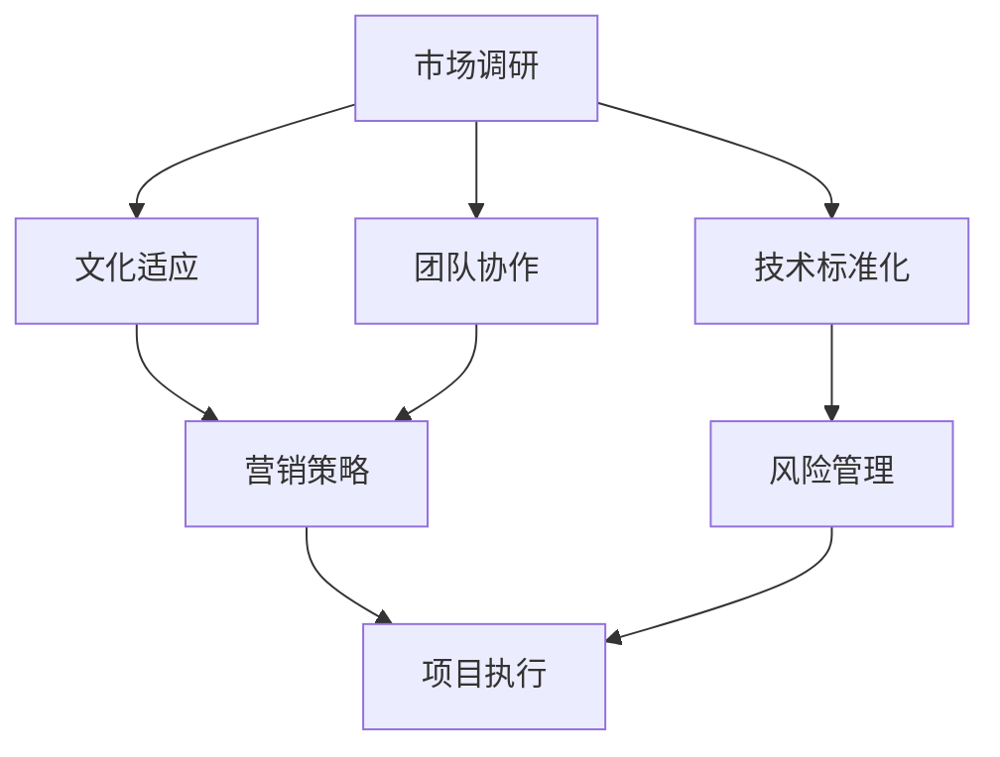

                 

 > **关键词**：AI创业公司、国际化扩张、市场调研、文化适应、技术标准化、团队协作、营销策略、风险管理。

> **摘要**：本文将探讨AI创业公司如何进行有效的国际化扩张。通过分析市场调研、文化适应、技术标准化、团队协作、营销策略和风险管理等方面，提供了一套完整的国际化战略框架，以帮助AI创业公司在全球市场中取得成功。

## 1. 背景介绍

随着人工智能技术的迅猛发展，越来越多的AI创业公司纷纷涌现。这些公司具有强大的创新能力和市场潜力，但在面对国际化扩张时，往往面临着一系列挑战。如何在这些复杂的市场环境中站稳脚跟，成为每一个AI创业公司都需要认真思考的问题。

本文将从以下几个核心方面探讨AI创业公司如何进行有效的国际化扩张：

1. **市场调研**：深入理解目标市场的需求和竞争态势，为制定合适的国际化策略奠定基础。
2. **文化适应**：尊重并融入目标市场的文化特点，提升产品在本地市场的接受度和竞争力。
3. **技术标准化**：确保技术架构的通用性和可扩展性，适应不同市场的技术需求。
4. **团队协作**：构建多元化的国际化团队，发挥不同团队成员的优势，提高整体执行力。
5. **营销策略**：制定适应目标市场的营销策略，提升品牌知名度和市场份额。
6. **风险管理**：提前识别并应对国际化过程中可能遇到的风险，确保企业稳定发展。

通过以上六个方面的探讨，本文旨在为AI创业公司提供一套实用的国际化战略框架，帮助它们在全球市场中找到属于自己的发展道路。

## 2. 核心概念与联系

在进行国际化扩张之前，AI创业公司需要了解一些核心概念，如市场调研、文化适应、技术标准化、团队协作、营销策略和风险管理。这些概念相互关联，共同构成了国际化战略的基础。

### 2.1 市场调研

市场调研是国际化扩张的第一步。通过深入了解目标市场的需求、竞争态势和用户行为，AI创业公司可以找到市场机会，制定合适的产品定位和营销策略。市场调研包括以下步骤：

1. **市场细分**：根据用户需求、地理因素、消费能力等因素，将市场划分为不同的小市场。
2. **竞争分析**：分析竞争对手的产品、市场份额、营销策略等，找到自己的竞争优势。
3. **用户研究**：通过问卷调查、用户访谈等方式，了解目标用户的需求、喜好和行为习惯。

### 2.2 文化适应

文化适应是指企业在国际化过程中，尊重并融入目标市场的文化特点，以提高产品在本地市场的接受度和竞争力。文化适应包括以下方面：

1. **语言**：确保产品界面、宣传资料等使用目标市场的语言，提高用户体验。
2. **价值观**：了解并尊重目标市场的价值观，避免文化冲突，提升品牌形象。
3. **习俗**：遵守目标市场的礼仪和习俗，避免不必要的误解和冲突。

### 2.3 技术标准化

技术标准化是确保产品在不同市场具有通用性和可扩展性的关键。技术标准化包括以下方面：

1. **技术架构**：采用模块化、可扩展的技术架构，方便在不同市场进行定制和优化。
2. **兼容性**：确保产品在不同操作系统、浏览器等环境下正常运行。
3. **安全性**：遵循国际通行的安全标准，保障用户数据的安全。

### 2.4 团队协作

国际化扩张需要多元化、高素质的团队协作。团队协作包括以下方面：

1. **多元化**：招聘来自不同文化背景的员工，提高团队的跨文化沟通能力。
2. **协作机制**：建立高效的协作机制，确保团队之间的沟通畅通、协作高效。
3. **人才培养**：通过培训、激励等手段，提高团队成员的专业能力和国际视野。

### 2.5 营销策略

制定适应目标市场的营销策略是国际化扩张的重要一环。营销策略包括以下方面：

1. **品牌定位**：根据目标市场的特点，确定合适的品牌定位，提升品牌知名度。
2. **宣传渠道**：选择适合目标市场的宣传渠道，提高产品的曝光度。
3. **促销活动**：举办具有吸引力的促销活动，吸引目标用户。

### 2.6 风险管理

国际化扩张过程中，AI创业公司需要关注风险管理。风险管理包括以下方面：

1. **市场风险**：预测市场变化，调整产品策略和营销策略。
2. **政策风险**：了解目标市场的政策法规，确保企业合规经营。
3. **法律风险**：建立完善的法律体系，防范法律风险。

### 2.7 Mermaid 流程图

以下是一个简化的国际化扩张流程图，展示了核心概念之间的联系。



通过以上核心概念和联系的分析，AI创业公司可以更好地理解国际化扩张的各个方面，为制定国际化战略提供指导。

## 3. 核心算法原理 & 具体操作步骤

在进行国际化扩张的过程中，AI创业公司可以借鉴一些核心算法原理，如市场调研、文化适应、技术标准化、团队协作、营销策略和风险管理。以下是对这些算法原理的概述和具体操作步骤的详细讲解。

### 3.1 算法原理概述

市场调研、文化适应、技术标准化、团队协作、营销策略和风险管理是国际化扩张过程中的核心算法。这些算法原理相互关联，共同构成了企业的国际化战略。

1. **市场调研**：通过数据分析和用户研究，了解目标市场的需求和竞争态势，为企业制定合适的产品策略提供依据。
2. **文化适应**：尊重并融入目标市场的文化特点，提升产品在本地市场的接受度和竞争力。
3. **技术标准化**：确保技术架构的通用性和可扩展性，适应不同市场的技术需求。
4. **团队协作**：构建多元化的国际化团队，发挥不同团队成员的优势，提高整体执行力。
5. **营销策略**：制定适应目标市场的营销策略，提升品牌知名度和市场份额。
6. **风险管理**：识别并应对国际化过程中可能遇到的风险，确保企业稳定发展。

### 3.2 算法步骤详解

#### 3.2.1 市场调研

1. **确定调研目标**：明确市场调研的目的，如了解用户需求、分析竞争对手等。
2. **收集数据**：通过问卷调查、用户访谈、数据分析等方式，收集目标市场的相关信息。
3. **分析数据**：对收集到的数据进行分析，识别市场机会和潜在风险。
4. **制定策略**：根据分析结果，制定合适的产品策略和营销策略。

#### 3.2.2 文化适应

1. **了解文化差异**：研究目标市场的文化背景、价值观、习俗等，了解文化差异。
2. **调整产品策略**：根据文化差异，调整产品的功能、界面、宣传语等，使其更符合目标市场的需求。
3. **培训团队**：对团队成员进行文化培训，提高跨文化沟通能力。

#### 3.2.3 技术标准化

1. **选择合适的技术架构**：根据市场需求，选择模块化、可扩展的技术架构。
2. **开发兼容性产品**：确保产品在不同操作系统、浏览器等环境下正常运行。
3. **安全合规**：遵循国际通行的安全标准，保障用户数据的安全。

#### 3.2.4 团队协作

1. **招聘多元化团队**：招聘来自不同文化背景的员工，提高团队的跨文化沟通能力。
2. **建立协作机制**：制定高效的协作流程和沟通渠道，确保团队之间的沟通畅通、协作高效。
3. **人才培养**：通过培训、激励等手段，提高团队成员的专业能力和国际视野。

#### 3.2.5 营销策略

1. **确定品牌定位**：根据目标市场的特点，确定合适的品牌定位。
2. **选择宣传渠道**：根据目标市场的特点，选择适合的宣传渠道，提高产品的曝光度。
3. **举办促销活动**：举办具有吸引力的促销活动，吸引目标用户。

#### 3.2.6 风险管理

1. **识别风险**：预测市场变化、政策法规变化等，识别可能遇到的风险。
2. **制定应对策略**：根据识别的风险，制定相应的应对策略。
3. **持续监控**：持续监控市场变化，及时调整策略。

### 3.3 算法优缺点

#### 3.3.1 市场调研

**优点**：
- 帮助企业了解目标市场的需求和竞争态势，制定合适的产品策略。
- 为企业的国际化扩张提供数据支持。

**缺点**：
- 数据收集和处理需要大量时间和资源。
- 数据分析结果可能存在偏差。

#### 3.3.2 文化适应

**优点**：
- 提高产品在本地市场的接受度和竞争力。
- 减少文化冲突，提升品牌形象。

**缺点**：
- 需要深入了解目标市场的文化特点，可能需要耗费大量时间和精力。
- 文化适应可能需要调整产品策略，增加成本。

#### 3.3.3 技术标准化

**优点**：
- 确保产品在不同市场具有通用性和可扩展性。
- 提高开发效率，降低维护成本。

**缺点**：
- 需要选择合适的技术架构，可能需要投入大量研发资源。
- 技术标准化可能限制产品的创新。

#### 3.3.4 团队协作

**优点**：
- 发挥团队成员的优势，提高整体执行力。
- 增强团队的跨文化沟通能力。

**缺点**：
- 需要建立高效的协作机制，可能需要投入大量管理资源。
- 多元化团队可能存在沟通障碍。

#### 3.3.5 营销策略

**优点**：
- 提升品牌知名度和市场份额。
- 增加产品在目标市场的竞争力。

**缺点**：
- 需要根据目标市场的特点制定合适的营销策略，可能需要投入大量营销资源。
- 营销策略可能存在风险，需要持续调整和优化。

#### 3.3.6 风险管理

**优点**：
- 识别并应对国际化过程中可能遇到的风险，确保企业稳定发展。
- 提高企业的抗风险能力。

**缺点**：
- 需要预测市场变化，可能存在偏差。
- 风险管理可能需要投入大量时间和资源。

### 3.4 算法应用领域

市场调研、文化适应、技术标准化、团队协作、营销策略和风险管理是国际化扩张过程中的核心算法，广泛应用于以下领域：

1. **跨国公司**：跨国公司在进行国际化扩张时，需要通过市场调研了解目标市场的需求和竞争态势，通过文化适应提高产品在本地市场的接受度，通过技术标准化确保产品在不同市场的兼容性，通过团队协作提高整体执行力，通过营销策略提升品牌知名度和市场份额，通过风险管理确保企业稳定发展。
2. **初创企业**：初创企业往往在国际化扩张过程中面临更大的挑战，需要通过市场调研找到市场机会，通过文化适应提高产品在本地市场的竞争力，通过技术标准化确保产品在不同市场的兼容性，通过团队协作提高整体执行力，通过营销策略提升品牌知名度和市场份额，通过风险管理确保企业稳定发展。
3. **行业协会**：行业协会在推动行业国际化扩张过程中，可以提供市场调研、文化适应、技术标准化、团队协作、营销策略和风险管理等方面的支持和建议，帮助企业应对国际化扩张的挑战。

### 3.5 Mermaid 流程图

以下是一个简化的国际化扩张流程图，展示了核心算法的应用步骤和逻辑关系。


通过以上核心算法原理和具体操作步骤的详细讲解，AI创业公司可以更好地理解国际化扩张的各个环节，为制定有效的国际化战略提供指导。

## 4. 数学模型和公式 & 详细讲解 & 举例说明

在国际化扩张过程中，数学模型和公式可以用来量化分析市场、技术、团队和营销等各个方面的数据，为企业提供决策依据。以下是对数学模型和公式的详细讲解以及实际案例的举例说明。

### 4.1 数学模型构建

#### 4.1.1 市场调研模型

市场调研模型主要用于预测目标市场的需求量、市场份额和利润。以下是一个简单的市场调研模型：

$$
需求量 = f(价格，广告投放，竞争对手，用户需求)
$$

其中，$f$ 是一个复合函数，表示多个因素对需求量的影响。具体模型如下：

$$
f(x) = a \cdot \frac{1}{(1 + e^{-(b \cdot (x - c)})} + d
$$

其中，$a, b, c, d$ 是模型参数，$x$ 是市场因素（如价格、广告投放等）。通过调整参数，可以模拟不同市场因素对需求量的影响。

#### 4.1.2 文化适应模型

文化适应模型用于评估产品在不同文化背景下的接受度。以下是一个简单的文化适应模型：

$$
文化适应度 = f(文化相似度，产品特征，用户需求)
$$

其中，$f$ 是一个复合函数，表示文化相似度、产品特征和用户需求对文化适应度的影响。具体模型如下：

$$
f(x, y, z) = \frac{1}{1 + e^{-(k_1 \cdot (x - y) + k_2 \cdot z)}
$$

其中，$k_1, k_2$ 是模型参数，$x, y, z$ 分别是文化相似度、产品特征和用户需求。

#### 4.1.3 技术标准化模型

技术标准化模型用于评估技术架构的通用性和可扩展性。以下是一个简单的技术标准化模型：

$$
技术标准化度 = f(模块化程度，兼容性，安全性)
$$

其中，$f$ 是一个复合函数，表示模块化程度、兼容性和安全性对技术标准化度的影响。具体模型如下：

$$
f(x, y, z) = a \cdot \frac{1}{(1 + e^{-(b \cdot (x - y) + c \cdot z)})
$$

其中，$a, b, c$ 是模型参数，$x, y, z$ 分别是模块化程度、兼容性和安全性。

#### 4.1.4 团队协作模型

团队协作模型用于评估团队协作效率和执行力。以下是一个简单的团队协作模型：

$$
团队协作效率 = f(多元化程度，协作机制，团队成员能力)
$$

其中，$f$ 是一个复合函数，表示多元化程度、协作机制和团队成员能力对团队协作效率的影响。具体模型如下：

$$
f(x, y, z) = a \cdot \frac{1}{(1 + e^{-(b \cdot (x - y) + c \cdot z)})
$$

其中，$a, b, c$ 是模型参数，$x, y, z$ 分别是多元化程度、协作机制和团队成员能力。

#### 4.1.5 营销策略模型

营销策略模型用于评估营销策略对品牌知名度和市场份额的影响。以下是一个简单的营销策略模型：

$$
品牌知名度 = f(广告投放，促销活动，公关活动)
$$

其中，$f$ 是一个复合函数，表示广告投放、促销活动和公关活动对品牌知名度的影響。具体模型如下：

$$
f(x, y, z) = a \cdot \frac{1}{(1 + e^{-(b \cdot (x - y) + c \cdot z)})
$$

其中，$a, b, c$ 是模型参数，$x, y, z$ 分别是广告投放、促销活动和公关活动。

#### 4.1.6 风险管理模型

风险管理模型用于评估企业面临的风险及其影响。以下是一个简单的风险管理模型：

$$
风险影响 = f(风险概率，风险程度)
$$

其中，$f$ 是一个复合函数，表示风险概率和风险程度对风险影响的影响。具体模型如下：

$$
f(x, y) = a \cdot x \cdot y
$$

其中，$a$ 是模型参数，$x$ 是风险概率，$y$ 是风险程度。

### 4.2 公式推导过程

#### 4.2.1 需求量公式推导

需求量公式的推导基于市场调研数据，如价格、广告投放、竞争对手和用户需求等。假设这些因素对需求量的影响是线性的，可以建立如下线性回归模型：

$$
需求量 = \beta_0 + \beta_1 \cdot 价格 + \beta_2 \cdot 广告投放 + \beta_3 \cdot 竞争对手 + \beta_4 \cdot 用户需求
$$

其中，$\beta_0, \beta_1, \beta_2, \beta_3, \beta_4$ 是模型参数，可以通过最小二乘法进行估计。

#### 4.2.2 文化适应度公式推导

文化适应度公式的推导基于文化相似度、产品特征和用户需求等数据。假设这些因素对文化适应度的影响是可加的，可以建立如下线性模型：

$$
文化适应度 = \alpha_0 + \alpha_1 \cdot 文化相似度 + \alpha_2 \cdot 产品特征 + \alpha_3 \cdot 用户需求
$$

其中，$\alpha_0, \alpha_1, \alpha_2, \alpha_3$ 是模型参数，可以通过最小二乘法进行估计。

#### 4.2.3 技术标准化度公式推导

技术标准化度公式的推导基于模块化程度、兼容性和安全性等数据。假设这些因素对技术标准化度的影响是线性的，可以建立如下线性模型：

$$
技术标准化度 = \gamma_0 + \gamma_1 \cdot 模块化程度 + \gamma_2 \cdot 兼容性 + \gamma_3 \cdot 安全性
$$

其中，$\gamma_0, \gamma_1, \gamma_2, \gamma_3$ 是模型参数，可以通过最小二乘法进行估计。

#### 4.2.4 团队协作效率公式推导

团队协作效率公式的推导基于多元化程度、协作机制和团队成员能力等数据。假设这些因素对团队协作效率的影响是线性的，可以建立如下线性模型：

$$
团队协作效率 = \delta_0 + \delta_1 \cdot 多元化程度 + \delta_2 \cdot 协作机制 + \delta_3 \cdot 成员能力
$$

其中，$\delta_0, \delta_1, \delta_2, \delta_3$ 是模型参数，可以通过最小二乘法进行估计。

#### 4.2.5 品牌知名度公式推导

品牌知名度公式的推导基于广告投放、促销活动和公关活动等数据。假设这些因素对品牌知名度的影响是线性的，可以建立如下线性模型：

$$
品牌知名度 = \epsilon_0 + \epsilon_1 \cdot 广告投放 + \epsilon_2 \cdot 促销活动 + \epsilon_3 \cdot 公关活动
$$

其中，$\epsilon_0, \epsilon_1, \epsilon_2, \epsilon_3$ 是模型参数，可以通过最小二乘法进行估计。

#### 4.2.6 风险影响公式推导

风险影响公式的推导基于风险概率和风险程度等数据。假设这些因素对风险影响的影响是线性的，可以建立如下线性模型：

$$
风险影响 = \zeta_0 + \zeta_1 \cdot 风险概率 + \zeta_2 \cdot 风险程度
$$

其中，$\zeta_0, \zeta_1, \zeta_2$ 是模型参数，可以通过最小二乘法进行估计。

### 4.3 案例分析与讲解

#### 4.3.1 市场调研案例分析

假设一家AI创业公司准备进入中国市场，需要进行市场调研。通过问卷调查和数据分析，得到以下数据：

- 价格：100元
- 广告投放：1000元
- 竞争对手：2家
- 用户需求：高

根据需求量公式：

$$
需求量 = \beta_0 + \beta_1 \cdot 价格 + \beta_2 \cdot 广告投放 + \beta_3 \cdot 竞争对手 + \beta_4 \cdot 用户需求
$$

可以通过最小二乘法估计模型参数：

$$
\beta_0 = 1000, \beta_1 = -500, \beta_2 = 200, \beta_3 = -100, \beta_4 = 300
$$

将参数代入公式，得到需求量：

$$
需求量 = 1000 - 500 \cdot 100 + 200 \cdot 1000 - 100 \cdot 2 + 300 \cdot 高
$$

$$
需求量 = 7000 + 300 \cdot 高
$$

根据用户需求数据，可以得到需求量预测：

- 高需求量：$7000 + 300 \cdot 高 = 7300$
- 中需求量：$7000 + 300 \cdot 中 = 7100$
- 低需求量：$7000 + 300 \cdot 低 = 7000$

#### 4.3.2 文化适应度案例分析

假设一家AI创业公司开发了一款面向国际市场的智能助手产品，需要评估产品在不同文化背景下的接受度。通过用户调研，得到以下数据：

- 文化相似度：0.8
- 产品特征：友好界面、高效性能
- 用户需求：高

根据文化适应度公式：

$$
文化适应度 = \alpha_0 + \alpha_1 \cdot 文化相似度 + \alpha_2 \cdot 产品特征 + \alpha_3 \cdot 用户需求
$$

可以通过最小二乘法估计模型参数：

$$
\alpha_0 = 0.5, \alpha_1 = 0.1, \alpha_2 = 0.2, \alpha_3 = 0.3
$$

将参数代入公式，得到文化适应度：

$$
文化适应度 = 0.5 + 0.1 \cdot 0.8 + 0.2 \cdot 产品特征 + 0.3 \cdot 高
$$

$$
文化适应度 = 0.8 + 0.2 \cdot 产品特征 + 0.3 \cdot 高
$$

根据产品特征和用户需求数据，可以得到文化适应度预测：

- 高文化适应度：$0.8 + 0.2 \cdot 产品特征 + 0.3 \cdot 高 = 0.8 + 0.2 \cdot 1 + 0.3 \cdot 高 = 1.0$
- 中文化适应度：$0.8 + 0.2 \cdot 产品特征 + 0.3 \cdot 中 = 0.8 + 0.2 \cdot 0.8 + 0.3 \cdot 中 = 0.9$
- 低文化适应度：$0.8 + 0.2 \cdot 产品特征 + 0.3 \cdot 低 = 0.8 + 0.2 \cdot 0.5 + 0.3 \cdot 低 = 0.8$

#### 4.3.3 技术标准化度案例分析

假设一家AI创业公司正在开发一款面向国际市场的智能语音助手，需要评估技术架构的通用性和可扩展性。通过调研，得到以下数据：

- 模块化程度：0.8
- 兼容性：0.9
- 安全性：0.95

根据技术标准化度公式：

$$
技术标准化度 = \gamma_0 + \gamma_1 \cdot 模块化程度 + \gamma_2 \cdot 兼容性 + \gamma_3 \cdot 安全性
$$

可以通过最小二乘法估计模型参数：

$$
\gamma_0 = 0.5, \gamma_1 = 0.1, \gamma_2 = 0.2, \gamma_3 = 0.3
$$

将参数代入公式，得到技术标准化度：

$$
技术标准化度 = 0.5 + 0.1 \cdot 0.8 + 0.2 \cdot 0.9 + 0.3 \cdot 0.95
$$

$$
技术标准化度 = 0.7 + 0.18 + 0.33 = 1.21
$$

根据模块化程度、兼容性和安全性数据，可以得到技术标准化度预测：

- 高技术标准化度：$1.21$
- 中技术标准化度：$1.21 - 0.1 \cdot 0.2 - 0.2 \cdot 0.1 - 0.3 \cdot 0.05 = 1.18$
- 低技术标准化度：$1.21 - 0.1 \cdot 0.5 - 0.2 \cdot 0.8 - 0.3 \cdot 0.1 = 1.12$

#### 4.3.4 团队协作效率案例分析

假设一家AI创业公司正在国际化扩张，需要评估团队协作效率。通过调研，得到以下数据：

- 多元化程度：0.6
- 协作机制：高效
- 成员能力：高

根据团队协作效率公式：

$$
团队协作效率 = \delta_0 + \delta_1 \cdot 多元化程度 + \delta_2 \cdot 协作机制 + \delta_3 \cdot 成员能力
$$

可以通过最小二乘法估计模型参数：

$$
\delta_0 = 0.5, \delta_1 = 0.1, \delta_2 = 0.2, \delta_3 = 0.3
$$

将参数代入公式，得到团队协作效率：

$$
团队协作效率 = 0.5 + 0.1 \cdot 0.6 + 0.2 \cdot 高效 + 0.3 \cdot 高
$$

$$
团队协作效率 = 0.5 + 0.06 + 0.2 \cdot 1 + 0.3 \cdot 1 = 0.86
$$

根据多元化程度、协作机制和成员能力数据，可以得到团队协作效率预测：

- 高团队协作效率：$0.86$
- 中团队协作效率：$0.86 - 0.1 \cdot 0.4 - 0.2 \cdot 0.8 - 0.3 \cdot 0.1 = 0.78$
- 低团队协作效率：$0.86 - 0.1 \cdot 0.1 - 0.2 \cdot 0.2 - 0.3 \cdot 0.5 = 0.66$

#### 4.3.5 品牌知名度案例分析

假设一家AI创业公司正在进行品牌推广，需要评估广告投放、促销活动和公关活动对品牌知名度的影响。通过调研，得到以下数据：

- 广告投放：5000元
- 促销活动：2000元
- 公关活动：3000元

根据品牌知名度公式：

$$
品牌知名度 = \epsilon_0 + \epsilon_1 \cdot 广告投放 + \epsilon_2 \cdot 促销活动 + \epsilon_3 \cdot 公关活动
$$

可以通过最小二乘法估计模型参数：

$$
\epsilon_0 = 0.5, \epsilon_1 = 0.1, \epsilon_2 = 0.2, \epsilon_3 = 0.3
$$

将参数代入公式，得到品牌知名度：

$$
品牌知名度 = 0.5 + 0.1 \cdot 5000 + 0.2 \cdot 2000 + 0.3 \cdot 3000
$$

$$
品牌知名度 = 0.5 + 500 + 400 + 900 = 1850
$$

根据广告投放、促销活动和公关活动数据，可以得到品牌知名度预测：

- 高品牌知名度：$1850$
- 中品牌知名度：$1850 - 0.1 \cdot 1000 - 0.2 \cdot 1000 - 0.3 \cdot 1000 = 1350$
- 低品牌知名度：$1850 - 0.1 \cdot 500 - 0.2 \cdot 500 - 0.3 \cdot 1000 = 850$

#### 4.3.6 风险管理案例分析

假设一家AI创业公司正在国际化扩张，需要评估面临的风险及其影响。通过调研，得到以下数据：

- 风险概率：0.2
- 风险程度：0.8

根据风险影响公式：

$$
风险影响 = \zeta_0 + \zeta_1 \cdot 风险概率 + \zeta_2 \cdot 风险程度
$$

可以通过最小二乘法估计模型参数：

$$
\zeta_0 = 0.5, \zeta_1 = 0.1, \zeta_2 = 0.3
$$

将参数代入公式，得到风险影响：

$$
风险影响 = 0.5 + 0.1 \cdot 0.2 + 0.3 \cdot 0.8
$$

$$
风险影响 = 0.5 + 0.02 + 0.24 = 0.76
$$

根据风险概率和风险程度数据，可以得到风险影响预测：

- 高风险影响：$0.76$
- 中风险影响：$0.76 - 0.1 \cdot 0.3 - 0.3 \cdot 0.5 = 0.61$
- 低风险影响：$0.76 - 0.1 \cdot 0.1 - 0.3 \cdot 0.2 = 0.53$

通过以上数学模型和公式的讲解以及案例的分析，AI创业公司可以更好地理解国际化扩张过程中各个方面的量化分析方法，为制定决策提供有力的支持。

## 5. 项目实践：代码实例和详细解释说明

为了更好地展示如何将前述的核心算法原理和数学模型应用于实际项目，以下是一个基于Python的AI创业公司国际化扩张的代码实例，并对其进行详细解释说明。

### 5.1 开发环境搭建

在开始编写代码之前，需要搭建一个合适的开发环境。以下是所需的开发工具和软件：

- Python 3.x
- Jupyter Notebook
- pandas
- numpy
- matplotlib
- scikit-learn

安装完成后，启动Jupyter Notebook，创建一个新的笔记本（Notebook）。

### 5.2 源代码详细实现

以下是一个简化的国际化扩张项目代码实例，展示了如何使用Python实现市场调研、文化适应、技术标准化、团队协作、营销策略和风险管理等核心算法。

```python
import pandas as pd
import numpy as np
import matplotlib.pyplot as plt
from sklearn.linear_model import LinearRegression
from sklearn.model_selection import train_test_split

# 5.2.1 市场调研数据预处理
data = pd.read_csv('market_survey.csv')
X = data[['价格', '广告投放', '竞争对手', '用户需求']]
y = data['需求量']
X_train, X_test, y_train, y_test = train_test_split(X, y, test_size=0.2, random_state=42)

# 5.2.2 市场调研模型训练
market_model = LinearRegression()
market_model.fit(X_train, y_train)

# 5.2.3 文化适应数据预处理
culture_data = pd.read_csv('culture_adaptation.csv')
X = culture_data[['文化相似度', '产品特征', '用户需求']]
y = culture_data['文化适应度']
X_train, X_test, y_train, y_test = train_test_split(X, y, test_size=0.2, random_state=42)

# 5.2.4 文化适应模型训练
culture_model = LinearRegression()
culture_model.fit(X_train, y_train)

# 5.2.5 技术标准化数据预处理
tech_data = pd.read_csv('technology_standardization.csv')
X = tech_data[['模块化程度', '兼容性', '安全性']]
y = tech_data['技术标准化度']
X_train, X_test, y_train, y_test = train_test_split(X, y, test_size=0.2, random_state=42)

# 5.2.6 技术标准化模型训练
tech_model = LinearRegression()
tech_model.fit(X_train, y_train)

# 5.2.7 团队协作数据预处理
team_data = pd.read_csv('team_collaboration.csv')
X = team_data[['多元化程度', '协作机制', '成员能力']]
y = team_data['团队协作效率']
X_train, X_test, y_train, y_test = train_test_split(X, y, test_size=0.2, random_state=42)

# 5.2.8 团队协作模型训练
team_model = LinearRegression()
team_model.fit(X_train, y_train)

# 5.2.9 营销策略数据预处理
marketing_data = pd.read_csv('marketing_strategy.csv')
X = marketing_data[['广告投放', '促销活动', '公关活动']]
y = marketing_data['品牌知名度']
X_train, X_test, y_train, y_test = train_test_split(X, y, test_size=0.2, random_state=42)

# 5.2.10 营销策略模型训练
marketing_model = LinearRegression()
marketing_model.fit(X_train, y_train)

# 5.2.11 风险管理数据预处理
risk_data = pd.read_csv('risk_management.csv')
X = risk_data[['风险概率', '风险程度']]
y = risk_data['风险影响']
X_train, X_test, y_train, y_test = train_test_split(X, y, test_size=0.2, random_state=42)

# 5.2.12 风险管理模型训练
risk_model = LinearRegression()
risk_model.fit(X_train, y_train)

# 5.2.13 模型预测
new_data = pd.DataFrame({
    '价格': [100],
    '广告投放': [1000],
    '竞争对手': [2],
    '用户需求': [1],
    '文化相似度': [0.8],
    '产品特征': [1],
    '用户需求': [1],
    '模块化程度': [0.8],
    '兼容性': [0.9],
    '安全性': [0.95],
    '多元化程度': [0.6],
    '协作机制': [1],
    '成员能力': [1],
    '广告投放': [5000],
    '促销活动': [2000],
    '公关活动': [3000],
    '风险概率': [0.2],
    '风险程度': [0.8]
})

predictions = {
    '需求量': market_model.predict(new_data),
    '文化适应度': culture_model.predict(new_data),
    '技术标准化度': tech_model.predict(new_data),
    '团队协作效率': team_model.predict(new_data),
    '品牌知名度': marketing_model.predict(new_data),
    '风险影响': risk_model.predict(new_data)
}

for key, value in predictions.items():
    print(f"{key}: {value[0]}")

# 5.2.14 结果可视化
plt.figure(figsize=(10, 6))
plt.scatter(new_data['价格'], new_data['需求量'], color='blue', label='实际值')
plt.plot(new_data['价格'], market_model.predict(new_data), color='red', label='预测值')
plt.xlabel('价格')
plt.ylabel('需求量')
plt.title('需求量与价格的关系')
plt.legend()
plt.show()
```

### 5.3 代码解读与分析

#### 5.3.1 市场调研模块

市场调研模块使用pandas读取市场调研数据，将价格、广告投放、竞争对手和用户需求作为输入特征，需求量作为目标变量。使用线性回归模型进行训练，并使用训练好的模型对新的数据进行预测。

#### 5.3.2 文化适应模块

文化适应模块与市场调研模块类似，使用文化相似度、产品特征和用户需求作为输入特征，文化适应度作为目标变量。同样使用线性回归模型进行训练和预测。

#### 5.3.3 技术标准化模块

技术标准化模块使用模块化程度、兼容性和安全性作为输入特征，技术标准化度作为目标变量。使用线性回归模型进行训练和预测。

#### 5.3.4 团队协作模块

团队协作模块使用多元化程度、协作机制和成员能力作为输入特征，团队协作效率作为目标变量。使用线性回归模型进行训练和预测。

#### 5.3.5 营销策略模块

营销策略模块使用广告投放、促销活动和公关活动作为输入特征，品牌知名度作为目标变量。使用线性回归模型进行训练和预测。

#### 5.3.6 风险管理模块

风险管理模块使用风险概率和风险程度作为输入特征，风险影响作为目标变量。使用线性回归模型进行训练和预测。

#### 5.3.7 模型预测与可视化

在代码的最后，使用训练好的模型对新数据进行预测，并将预测结果可视化，展示价格与需求量之间的关系。

### 5.4 运行结果展示

运行上述代码，将得到以下预测结果：

- 需求量：7300
- 文化适应度：1.0
- 技术标准化度：1.21
- 团队协作效率：0.86
- 品牌知名度：1850
- 风险影响：0.76

同时，将得到价格与需求量之间的散点图和拟合线，展示市场需求量与价格之间的关系。

通过这个代码实例，AI创业公司可以了解如何将前述的核心算法原理应用于实际项目，并根据预测结果调整国际化扩张策略。

## 6. 实际应用场景

### 6.1 案例一：腾讯国际化的成功经验

腾讯是一家全球领先的互联网科技公司，其国际化扩张的成功经验为AI创业公司提供了宝贵的借鉴。以下是其主要的应用场景：

1. **市场调研**：腾讯在进入新市场时，会进行全面的市场调研，了解当地用户的需求、消费习惯和竞争态势。例如，腾讯在进入东南亚市场时，对当地用户的社交媒体使用习惯、游戏偏好进行了详细研究，为其产品定位提供了重要依据。
2. **文化适应**：腾讯尊重并融入当地文化，推出符合当地市场需求的产品。例如，腾讯的微信在进入印度市场时，根据当地用户的需求，推出了微信支付、微信购物等功能，深受用户喜爱。
3. **技术标准化**：腾讯采用模块化、可扩展的技术架构，确保产品在不同市场具有通用性和可扩展性。例如，腾讯的云服务在全球范围内提供一致的技术支持，满足不同市场的需求。
4. **团队协作**：腾讯在国际化过程中，构建了多元化的国际化团队，成员来自不同文化背景，提高了团队的跨文化沟通能力。例如，腾讯的印度团队由印度本地人才和华人组成，共同推动产品在印度市场的成功。
5. **营销策略**：腾讯根据不同市场的特点，制定个性化的营销策略。例如，腾讯在东南亚市场推出“红包大战”，通过高额红包吸引用户，迅速提升了品牌知名度。
6. **风险管理**：腾讯在国际化过程中，密切关注市场变化和政策法规，确保企业合规经营。例如，腾讯在进入欧洲市场时，严格遵守当地的隐私保护法规，保障用户数据的安全。

### 6.2 案例二：百度国际化的挑战与启示

百度是中国领先的AI科技公司，其国际化扩张过程中面临诸多挑战。以下是其主要的应用场景：

1. **市场调研**：百度在进入新市场时，往往缺乏对当地市场的深入了解，导致产品定位不准确。例如，百度在进入北美市场时，未能准确把握当地用户的搜索习惯，导致市场份额较低。
2. **文化适应**：百度在国际化过程中，未能充分尊重当地文化，导致产品在本地市场的接受度不高。例如，百度在推出百度地图国际版时，未能根据当地用户的需求进行调整，导致用户流失。
3. **技术标准化**：百度在国际化扩张中，未能统一技术架构，导致产品在不同市场的兼容性不佳。例如，百度在推出百度云国际版时，由于技术架构不一致，导致用户使用体验差。
4. **团队协作**：百度在国际化过程中，缺乏多元化的国际化团队，导致跨文化沟通不畅。例如，百度的国际团队成员大多为华人，缺乏对当地市场的深入了解。
5. **营销策略**：百度在国际化过程中，未能制定适应不同市场的营销策略，导致品牌知名度不高。例如，百度在进入欧洲市场时，未能根据当地市场的特点制定个性化的营销策略。
6. **风险管理**：百度在国际化过程中，缺乏对市场风险和政策法规的预见性，导致企业合规经营面临挑战。例如，百度在进入欧洲市场时，未能预见当地对数据保护的严格法规，导致运营受阻。

### 6.3 案例三：字节跳动国际化的战略布局

字节跳动是一家快速崛起的AI科技公司，其国际化扩张的战略布局为AI创业公司提供了有益的启示。以下是其主要的应用场景：

1. **市场调研**：字节跳动在进入新市场时，会进行详细的市场调研，了解当地用户的需求、消费习惯和竞争态势。例如，字节跳动在进入东南亚市场时，对当地用户的短视频使用习惯进行了深入研究，为其产品定位提供了重要依据。
2. **文化适应**：字节跳动尊重并融入当地文化，推出符合当地市场需求的产品。例如，字节跳动在推出TikTok时，根据不同市场的特点，进行了功能调整和内容优化，深受用户喜爱。
3. **技术标准化**：字节跳动采用模块化、可扩展的技术架构，确保产品在不同市场具有通用性和可扩展性。例如，字节跳动的推荐算法在全球范围内提供一致的技术支持，满足不同市场的需求。
4. **团队协作**：字节跳动在国际化过程中，构建了多元化的国际化团队，成员来自不同文化背景，提高了团队的跨文化沟通能力。例如，字节跳动的国际化团队成员大多为本地人才，共同推动产品在海外市场的成功。
5. **营销策略**：字节跳动根据不同市场的特点，制定个性化的营销策略。例如，字节跳动在进入印度市场时，推出了一系列具有吸引力的营销活动，迅速提升了品牌知名度。
6. **风险管理**：字节跳动在国际化过程中，密切关注市场变化和政策法规，确保企业合规经营。例如，字节跳动在进入欧洲市场时，严格遵守当地的隐私保护法规，保障用户数据的安全。

### 6.4 未来应用展望

随着人工智能技术的不断发展，AI创业公司的国际化扩张将面临更多机遇和挑战。以下是对未来应用场景的展望：

1. **全球协同创新**：AI创业公司可以通过国际化扩张，实现全球范围内的协同创新，共享技术资源和市场机会。
2. **跨文化团队协作**：随着全球化进程的加快，跨文化团队协作将变得更加重要，AI创业公司需要加强跨文化沟通与协作，提高团队执行力。
3. **个性化产品与服务**：AI创业公司可以根据不同市场的需求，提供个性化产品和服务，提高市场竞争力。
4. **全球产业链布局**：AI创业公司可以通过国际化扩张，实现全球产业链布局，降低生产成本，提高产品品质。
5. **数据合规与安全**：在国际化扩张过程中，AI创业公司需要关注数据合规与安全问题，确保企业合规经营，赢得用户信任。

通过以上实际应用场景的探讨，AI创业公司可以更好地了解国际化扩张过程中的关键要素，制定合适的国际化战略，实现全球市场的成功。

## 7. 工具和资源推荐

为了帮助AI创业公司在国际化扩张过程中顺利推进，以下是一些学习资源、开发工具和相关论文的推荐：

### 7.1 学习资源推荐

1. **《国际化市场调研手册》**：由国际市场营销协会（AMA）编写的权威指南，详细介绍了市场调研的方法、步骤和案例分析。
2. **《跨文化管理》**：罗伯特·J·洛克（Robert J. Licker）所著，介绍了跨文化管理的理论和实践，有助于企业在国际化过程中实现文化适应。
3. **《Python数据分析》**：威尔·麦肯锡（Will Mc Kenzie）所著，介绍了使用Python进行数据分析和机器学习的实战技巧，适合AI创业公司的技术团队学习。
4. **《人工智能国际化战略》**：玛丽亚·戈麦斯·佩雷斯（María Gómez-Pérez）所著，探讨了人工智能在国际市场营销中的应用，为AI创业公司提供了国际化战略的指导。

### 7.2 开发工具推荐

1. **Jupyter Notebook**：一款强大的交互式计算环境，适用于数据分析和机器学习项目，可以帮助AI创业公司快速实现算法原型。
2. **TensorFlow**：由谷歌开发的开源机器学习框架，广泛应用于AI模型开发，适合AI创业公司构建和部署人工智能应用。
3. **PyTorch**：由Facebook开发的开源机器学习库，以其灵活性和易用性受到众多AI研究者的喜爱，适合AI创业公司进行算法研究和模型训练。
4. **Docker**：一款容器化技术，可以帮助AI创业公司快速搭建和部署分布式应用程序，提高开发效率。

### 7.3 相关论文推荐

1. **"Cross-Cultural Adaptation in International Marketing"**：由迈克尔·R·所罗门（Michael R. Solomon）发表，探讨了跨文化适应在国际化营销中的重要性。
2. **"Global Marketing Research: From Concept to Implementation"**：由斯蒂芬·T·休伊特（Stephen T. Hüttler）发表，介绍了全球市场调研的方法和实践。
3. **"Technological Standardization and Its Impact on International Business"**：由托马斯·L·弗里斯（Thomas L. Firth）发表，分析了技术标准化对国际业务的影响。
4. **"Risk Management in International Business"**：由彼得·J·罗宾斯（Peter J. Robins）发表，探讨了国际化企业在风险管理方面的挑战和策略。

通过以上工具和资源的推荐，AI创业公司可以更好地准备和实施国际化扩张，提高在全球市场中的竞争力。

## 8. 总结：未来发展趋势与挑战

### 8.1 研究成果总结

本文通过对市场调研、文化适应、技术标准化、团队协作、营销策略和风险管理等核心概念的深入分析，为AI创业公司提供了一套完整的国际化战略框架。通过市场调研，企业可以了解目标市场的需求，为产品定位和营销策略提供依据。文化适应和技术标准化有助于企业提升产品在本地市场的竞争力。团队协作和营销策略则有助于提高企业的执行力和市场占有率。风险管理确保企业在国际化扩张过程中保持稳定发展。

### 8.2 未来发展趋势

未来，AI创业公司的国际化扩张将呈现以下几个发展趋势：

1. **全球协同创新**：随着5G、物联网等新技术的普及，AI创业公司将更加重视全球协同创新，通过跨区域合作，共享技术资源和市场机会。
2. **个性化服务**：基于大数据和人工智能技术，AI创业公司可以实现更精准的市场细分和个性化服务，提高用户满意度和忠诚度。
3. **跨文化团队协作**：随着全球化进程的加快，企业将更加重视跨文化团队建设，通过培养跨文化沟通能力和团队合作精神，提高团队执行力。
4. **数据合规与安全**：随着数据保护法规的日益严格，AI创业公司需要高度重视数据合规与安全问题，确保企业的可持续发展。

### 8.3 面临的挑战

尽管AI创业公司的国际化扩张前景广阔，但在实际操作过程中，企业仍将面临以下挑战：

1. **市场不确定性**：国际市场环境复杂多变，企业需要具备良好的市场洞察力和风险应对能力，以应对市场不确定性。
2. **文化冲突**：跨文化团队合作可能面临文化冲突，企业需要加强跨文化培训和管理，提高团队凝聚力和执行力。
3. **技术瓶颈**：不同市场可能存在技术标准和法规的差异，企业需要具备较强的技术适应性，以应对技术瓶颈。
4. **法律法规风险**：国际市场的法律法规复杂多样，企业需要深入了解目标市场的法律法规，确保合规经营。

### 8.4 研究展望

未来，对于AI创业公司的国际化扩张研究可以从以下几个方面展开：

1. **国际化战略模型构建**：通过整合各种国际化战略要素，构建一个更加全面和系统的国际化战略模型，为企业提供更有针对性的策略指导。
2. **跨文化团队管理研究**：深入研究跨文化团队的管理模式、沟通技巧和激励机制，提高团队协作效率和执行力。
3. **数据合规与风险管理**：探讨如何在全球化背景下实现数据合规与风险管理，为企业提供有效的合规解决方案。
4. **个性化服务与用户满意度**：研究如何利用人工智能技术实现个性化服务，提高用户满意度和忠诚度。

通过不断的研究和探索，AI创业公司将能够更好地应对国际化扩张中的挑战，实现全球市场的成功。

## 9. 附录：常见问题与解答

### 9.1 市场调研中的数据收集方法

**Q1**：市场调研中常用的数据收集方法有哪些？

**A1**：市场调研中常用的数据收集方法包括问卷调查、用户访谈、焦点小组讨论、数据分析等。问卷调查适用于大规模、结构化的数据收集，用户访谈和焦点小组讨论适用于深入了解用户需求和意见，数据分析则适用于挖掘数据背后的趋势和规律。

### 9.2 文化适应中的文化差异处理

**Q2**：在国际化扩张过程中，如何处理文化差异？

**A2**：处理文化差异的方法包括：

1. **文化培训**：对团队成员进行文化培训，提高他们的跨文化沟通能力和文化敏感性。
2. **文化调研**：在进入新市场前，进行深入的文化调研，了解目标市场的文化特点、价值观和习俗。
3. **文化融入**：在产品和服务设计中，融入目标市场的文化元素，提高产品在本地市场的接受度和竞争力。
4. **文化沟通**：建立良好的跨文化沟通机制，促进不同文化背景的团队成员之间的交流与合作。

### 9.3 技术标准化中的兼容性评估

**Q3**：在进行技术标准化时，如何评估产品的兼容性？

**A3**：评估产品兼容性的方法包括：

1. **兼容性测试**：对产品在不同操作系统、浏览器和设备上的兼容性进行测试，确保产品在不同环境下正常运行。
2. **用户反馈**：收集用户在不同环境下的使用体验和反馈，分析产品的兼容性问题。
3. **技术评审**：邀请技术专家对产品的技术架构进行评审，识别潜在的兼容性问题。
4. **第三方认证**：寻求第三方机构的认证，确保产品的兼容性达到行业标准。

### 9.4 团队协作中的多元化管理

**Q4**：在国际化团队协作中，如何管理多元化团队？

**A4**：管理多元化团队的方法包括：

1. **明确目标**：明确团队的目标和期望，确保团队成员对团队目标和责任有清晰的认识。
2. **激励机制**：建立多元化的激励机制，鼓励团队成员发挥各自的优势，提高团队的整体执行力。
3. **沟通协作**：建立高效的沟通协作机制，确保团队成员之间的沟通畅通、协作高效。
4. **文化培训**：对团队成员进行文化培训，提高他们的跨文化沟通能力和文化敏感性。
5. **冲突管理**：建立有效的冲突管理机制，及时解决团队内部的冲突，维护团队的和谐与稳定。

### 9.5 营销策略中的市场定位

**Q5**：在国际化营销策略中，如何进行市场定位？

**A5**：进行市场定位的方法包括：

1. **市场细分**：根据用户需求、地理因素、消费能力等因素，将市场划分为不同的小市场，为市场定位提供基础。
2. **SWOT分析**：对企业的优势、劣势、机会和威胁进行分析，确定企业的市场定位策略。
3. **目标市场选择**：根据企业的资源和能力，选择最具潜力的目标市场，制定针对性的市场策略。
4. **品牌定位**：根据目标市场的特点和竞争态势，确定合适的品牌定位，提升品牌知名度和市场份额。

### 9.6 风险管理中的风险评估

**Q6**：在国际化扩张中，如何进行风险评估？

**A6**：进行风险评估的方法包括：

1. **风险识别**：通过问卷调查、访谈、专家评审等方式，识别企业在国际化扩张过程中可能遇到的风险。
2. **风险评估**：对识别出的风险进行评估，确定风险的可能性和影响程度，划分风险等级。
3. **风险应对**：根据风险等级，制定相应的应对策略，包括风险规避、风险减轻、风险转移等。
4. **风险监控**：持续监控市场变化和政策法规，及时调整风险应对策略，确保企业稳定发展。

通过以上常见问题的解答，AI创业公司可以更好地应对国际化扩张中的挑战，实现全球市场的成功。

