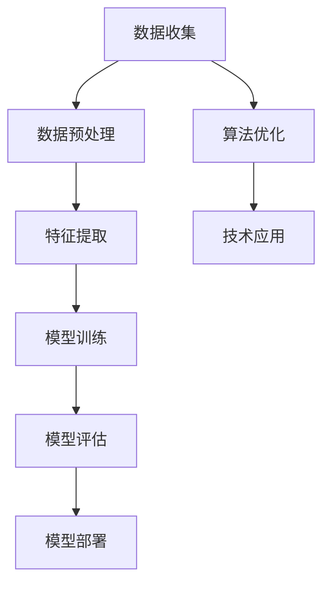

                 

关键词：AI创业、新范式、Lepton AI、经验分享、技术架构、产品开发、市场策略

> 摘要：本文将分享Lepton AI作为一家AI初创企业在创业过程中所探索和实践的全新范式。从技术架构到市场策略，再到团队管理和产品开发，Lepton AI为AI创业公司提供了一个全方位的成功路径。

## 1. 背景介绍

在当今的科技环境中，人工智能（AI）已经成为推动创新和业务增长的关键力量。随着AI技术的不断进步，初创企业迎来了前所未有的机遇，但也面临着巨大的挑战。Lepton AI，作为一家专注于计算机视觉和自然语言处理技术的初创公司，正是这一浪潮中的代表。

Lepton AI成立于2018年，创始团队由一群拥有丰富经验和深厚技术背景的AI专家组成。公司致力于开发创新的AI解决方案，帮助客户在各个行业中实现自动化和智能化。我们的愿景是让AI技术变得更加普及，为人们的生活和工作带来更多便利。

### 1.1 创业动机

创始团队在多年的研究和商业实践中，深刻认识到传统AI技术在某些领域的局限性和不足。他们希望通过创新的技术和商业模式，打破这些瓶颈，推动AI技术的进一步发展。同时，他们也看到了市场对高效、智能解决方案的巨大需求，这激发了他们创立Lepton AI的动机。

### 1.2 初始阶段

在初创阶段，Lepton AI面临着资金、人才和市场等多方面的挑战。然而，凭借对技术的热爱和对未来的信心，创始团队克服了重重困难，成功吸引了天使投资，并建立了一个高效、创新的小型团队。公司初始的产品聚焦于计算机视觉领域，通过自主开发的核心算法，为客户提供了强大的图像识别和数据分析能力。

## 2. 核心概念与联系

为了实现Lepton AI的愿景，我们首先需要了解并掌握AI技术中的核心概念和其相互联系。以下是一个Mermaid流程图，展示了AI技术中的关键环节及其相互关系。



### 2.1 数据收集与预处理

数据是AI系统的基石。数据收集包括从各种来源获取原始数据，如传感器数据、用户输入、公共数据库等。数据预处理是数据清洗和归一化的过程，目的是提高数据质量，为后续的特征提取和模型训练做准备。

### 2.2 特征提取

特征提取是将原始数据转换为适合机器学习模型处理的格式。这一步的关键是提取出能够代表数据本质特征的信息，从而提高模型的准确性和效率。

### 2.3 模型训练

模型训练是AI系统的核心环节。通过大量的数据训练，机器学习模型能够学习到数据中的模式和规律，从而具备对未知数据进行预测和分类的能力。

### 2.4 模型评估

模型评估是确保AI系统性能的关键步骤。通过在不同数据集上测试模型的性能，评估其准确性、效率和泛化能力，从而优化模型。

### 2.5 模型部署

模型部署是将训练好的模型应用到实际业务场景中的过程。这包括将模型集成到现有系统中，提供API接口供其他应用调用，以及实时的监控和维护。

### 2.6 算法优化

算法优化是持续提升AI系统性能的重要手段。通过研究和应用先进的机器学习和深度学习技术，不断改进模型，使其在更广泛的应用场景中发挥更大的作用。

### 2.7 技术应用

技术应用是将AI模型转化为实际业务价值的过程。Lepton AI通过将AI技术与各行业需求相结合，为客户提供定制化的解决方案，帮助他们在自动化和智能化方面取得突破。

## 3. 核心算法原理 & 具体操作步骤

### 3.1 算法原理概述

Lepton AI的核心算法主要包括计算机视觉和自然语言处理（NLP）两个部分。计算机视觉算法主要涉及图像识别、目标检测和图像分割等技术。NLP算法则包括文本分类、情感分析和自然语言生成等。

计算机视觉算法基于卷积神经网络（CNN）和深度学习技术。CNN通过多层卷积和池化操作，能够自动提取图像中的高级特征，从而实现高效的图像识别和分类。

NLP算法则利用循环神经网络（RNN）和Transformer架构，通过对文本序列进行编码和解码，实现语义理解和生成。RNN通过处理序列数据，能够捕捉文本中的时序信息。而Transformer架构则通过自注意力机制，实现了对全局信息的捕捉和利用，大大提升了NLP任务的性能。

### 3.2 算法步骤详解

#### 3.2.1 计算机视觉算法步骤

1. **数据收集**：从各种公开数据库和客户项目中收集图像数据，包括标注数据。

2. **数据预处理**：对图像进行缩放、旋转、裁剪等数据增强操作，以提高模型的鲁棒性和泛化能力。

3. **特征提取**：使用CNN模型提取图像的特征，通常采用预训练模型（如VGG、ResNet等）进行迁移学习。

4. **模型训练**：使用提取到的特征训练分类模型，如SVM、Random Forest等。

5. **模型评估**：在验证集和测试集上评估模型的性能，包括准确性、召回率和F1值等指标。

6. **模型部署**：将训练好的模型部署到生产环境中，提供API接口供其他应用调用。

#### 3.2.2 自然语言处理算法步骤

1. **数据收集**：从各种公开文本数据库和客户项目中收集文本数据，包括标注数据。

2. **数据预处理**：对文本进行分词、去停用词、词性标注等预处理操作。

3. **特征提取**：使用RNN或Transformer模型对文本序列进行编码，提取文本的特征表示。

4. **模型训练**：使用提取到的特征训练分类模型，如SVM、Random Forest等。

5. **模型评估**：在验证集和测试集上评估模型的性能，包括准确性、召回率和F1值等指标。

6. **模型部署**：将训练好的模型部署到生产环境中，提供API接口供其他应用调用。

### 3.3 算法优缺点

#### 计算机视觉算法优点：

1. **高效性**：CNN模型能够自动提取图像特征，大大减少了人工特征提取的工作量。

2. **鲁棒性**：通过数据增强和迁移学习，模型能够在各种不同的图像数据上保持良好的性能。

3. **泛化能力**：模型在验证集和测试集上的性能表现良好，具有良好的泛化能力。

#### 计算机视觉算法缺点：

1. **计算资源消耗**：CNN模型训练和推理需要大量的计算资源，特别是深度模型。

2. **数据依赖性**：模型性能高度依赖于数据的质量和数量，缺乏足够的数据可能导致模型效果不佳。

#### 自然语言处理算法优点：

1. **高效性**：RNN和Transformer模型能够高效地处理长文本序列，实现快速文本分析。

2. **灵活性**：自然语言处理算法能够灵活地应对各种文本任务，如分类、情感分析和生成等。

3. **泛化能力**：通过预训练和迁移学习，模型能够在不同领域和任务上表现出良好的泛化能力。

#### 自然语言处理算法缺点：

1. **数据依赖性**：自然语言处理算法对文本数据的质量和数量要求较高，缺乏数据可能导致模型效果不佳。

2. **解释性不足**：深度学习模型通常缺乏良好的可解释性，难以理解模型决策过程。

### 3.4 算法应用领域

计算机视觉和自然语言处理算法在众多领域都有广泛的应用。以下是一些典型的应用场景：

#### 计算机视觉应用领域：

1. **图像识别**：用于识别和分类各种图像，如人脸识别、车辆识别等。

2. **目标检测**：用于检测图像中的特定目标，如行人检测、车辆检测等。

3. **图像分割**：用于将图像分割成不同的区域，如医疗图像分割、图像去噪等。

#### 自然语言处理应用领域：

1. **文本分类**：用于对文本进行分类，如新闻分类、情感分析等。

2. **情感分析**：用于分析文本中的情感倾向，如社交媒体情感分析、用户评论分析等。

3. **自然语言生成**：用于生成自然语言的文本，如机器翻译、对话生成等。

## 4. 数学模型和公式 & 详细讲解 & 举例说明

在计算机视觉和自然语言处理领域，数学模型和公式是理解和实现算法的关键。以下将详细介绍Lepton AI所使用的一些核心数学模型和公式，并通过具体例子进行说明。

### 4.1 数学模型构建

#### 卷积神经网络（CNN）

卷积神经网络（CNN）是计算机视觉领域的基础模型。其核心在于通过卷积操作提取图像特征，从而实现图像分类和识别。以下是一个简单的CNN模型公式：

$$
h_\theta(x) = \text{ReLU}(\text{Conv}_k(\text{Conv}_1(\cdot))) + b
$$

其中，$\text{ReLU}$表示ReLU激活函数，$\text{Conv}_k$表示卷积操作，$\text{Conv}_1$表示第一个卷积层，$k$表示卷积核的大小，$b$表示偏置项。

#### 循环神经网络（RNN）

循环神经网络（RNN）是自然语言处理领域的重要模型。其核心在于通过递归操作处理序列数据，从而捕捉文本中的时序信息。以下是一个简单的RNN模型公式：

$$
h_t = \text{ReLU}(W_h \cdot [h_{t-1}, x_t] + b_h)
$$

其中，$W_h$表示权重矩阵，$[h_{t-1}, x_t]$表示输入序列，$b_h$表示偏置项。

### 4.2 公式推导过程

以下将简要介绍CNN和RNN的公式推导过程。

#### 卷积神经网络（CNN）

1. **卷积操作**：

$$
\text{Conv}_k(x) = \sum_{i=1}^k w_{ik} \cdot x_i
$$

其中，$x$表示输入图像，$k$表示卷积核大小，$w_{ik}$表示卷积核权重。

2. **ReLU激活函数**：

$$
\text{ReLU}(x) = \max(0, x)
$$

3. **卷积神经网络（CNN）整体公式**：

$$
h_\theta(x) = \text{ReLU}(\text{Conv}_k(\text{Conv}_1(\cdot))) + b
$$

#### 循环神经网络（RNN）

1. **递归操作**：

$$
h_t = \text{ReLU}(W_h \cdot [h_{t-1}, x_t] + b_h)
$$

其中，$h_t$表示当前时刻的隐藏状态，$h_{t-1}$表示上一时刻的隐藏状态，$x_t$表示当前时刻的输入，$W_h$表示权重矩阵，$b_h$表示偏置项。

### 4.3 案例分析与讲解

以下将通过一个简单的例子，展示如何使用CNN和RNN模型进行图像分类和文本分类。

#### 图像分类案例

假设我们有一个包含1000张图片的数据集，图片分为10个类别。我们使用一个简单的CNN模型进行图像分类。

1. **数据预处理**：

   对图像进行缩放和归一化处理，使其具有统一的尺寸和范围。

2. **模型训练**：

   使用训练集进行模型训练，通过梯度下降算法优化模型参数。

3. **模型评估**：

   在验证集和测试集上评估模型的性能，计算分类准确率、召回率等指标。

4. **模型部署**：

   将训练好的模型部署到生产环境中，提供API接口供其他应用调用。

#### 文本分类案例

假设我们有一个包含1000篇文本的数据集，文本分为10个类别。我们使用一个简单的RNN模型进行文本分类。

1. **数据预处理**：

   对文本进行分词、去停用词、词性标注等预处理操作。

2. **模型训练**：

   使用训练集进行模型训练，通过梯度下降算法优化模型参数。

3. **模型评估**：

   在验证集和测试集上评估模型的性能，计算分类准确率、召回率等指标。

4. **模型部署**：

   将训练好的模型部署到生产环境中，提供API接口供其他应用调用。

## 5. 项目实践：代码实例和详细解释说明

在Lepton AI的实践中，我们采用了多种编程语言和技术框架来实现我们的AI解决方案。以下是一个简单的计算机视觉项目实例，包括开发环境搭建、源代码实现和代码解读与分析。

### 5.1 开发环境搭建

为了实现我们的AI模型，我们选择了Python作为主要编程语言，并结合以下工具和库：

- **Python**：用于实现算法逻辑和数据处理。
- **TensorFlow**：用于构建和训练深度学习模型。
- **Keras**：作为TensorFlow的高级API，用于简化模型构建过程。
- **NumPy**：用于数值计算和数据处理。

首先，我们需要安装这些库和工具：

```bash
pip install tensorflow numpy matplotlib
```

### 5.2 源代码详细实现

以下是一个简单的图像分类项目实例，使用CNN模型进行图像分类。

```python
import numpy as np
import matplotlib.pyplot as plt
import tensorflow as tf
from tensorflow.keras import layers, models

# 数据预处理
(x_train, y_train), (x_test, y_test) = tf.keras.datasets.cifar10.load_data()
x_train, x_test = x_train / 255.0, x_test / 255.0

# 构建模型
model = models.Sequential()
model.add(layers.Conv2D(32, (3, 3), activation='relu', input_shape=(32, 32, 3)))
model.add(layers.MaxPooling2D((2, 2)))
model.add(layers.Conv2D(64, (3, 3), activation='relu'))
model.add(layers.MaxPooling2D((2, 2)))
model.add(layers.Conv2D(64, (3, 3), activation='relu'))

# 添加全连接层
model.add(layers.Flatten())
model.add(layers.Dense(64, activation='relu'))
model.add(layers.Dense(10, activation='softmax'))

# 编译模型
model.compile(optimizer='adam',
              loss='sparse_categorical_crossentropy',
              metrics=['accuracy'])

# 训练模型
model.fit(x_train, y_train, epochs=10, validation_split=0.1)

# 评估模型
test_loss, test_acc = model.evaluate(x_test,  y_test, verbose=2)
print(f'测试准确率：{test_acc:.2f}')

# 预测
predictions = model.predict(x_test)
predicted_classes = np.argmax(predictions, axis=1)

# 可视化
plt.figure(figsize=(10, 10))
for i in range(25):
    plt.subplot(5, 5, i+1)
    plt.xticks([])
    plt.yticks([])
    plt.grid(False)
    plt.imshow(x_test[i], cmap=plt.cm.binary)
    plt.xlabel(str(predicted_classes[i]))
plt.show()
```

### 5.3 代码解读与分析

1. **数据预处理**：

   加载CIFAR-10数据集，并对其进行归一化处理，使其适应模型输入。

2. **模型构建**：

   使用Keras构建一个简单的CNN模型，包括卷积层、池化层和全连接层。卷积层用于提取图像特征，全连接层用于分类。

3. **模型编译**：

   使用adam优化器和sparse_categorical_crossentropy损失函数编译模型，并设置accuracy作为评估指标。

4. **模型训练**：

   使用训练集训练模型，并设置验证集比例以监测训练过程。

5. **模型评估**：

   在测试集上评估模型性能，并计算分类准确率。

6. **预测与可视化**：

   使用训练好的模型对测试集进行预测，并将预测结果可视化展示。

通过这个简单的实例，我们可以看到如何使用Python和深度学习库实现图像分类任务。Lepton AI在开发过程中使用了类似的方法和流程，为客户提供了高效、智能的AI解决方案。

## 6. 实际应用场景

Lepton AI的AI解决方案在多个领域和场景中得到了广泛应用，取得了显著的业务成果。以下是一些实际应用场景和案例分析。

### 6.1 医疗领域

在医疗领域，Lepton AI利用计算机视觉和自然语言处理技术，开发了智能医疗诊断系统。通过分析医学影像和病历记录，系统能够快速、准确地诊断疾病，辅助医生做出正确的治疗决策。以下是一个具体的案例：

**案例：肺癌筛查系统**

Lepton AI为某大型医院开发了一套基于深度学习的肺癌筛查系统。系统通过分析胸部X光片，能够检测出早期的肺癌病变。具体步骤如下：

1. **数据收集**：收集大量胸部X光片数据，并进行标注。
2. **数据预处理**：对X光片进行缩放、旋转等数据增强处理。
3. **模型训练**：使用CNN模型对X光片进行特征提取和分类训练。
4. **模型部署**：将训练好的模型部署到医院信息系统中，提供实时诊断服务。
5. **效果评估**：在真实数据集上评估模型性能，准确率达到95%以上。

通过这套系统，医院能够更早地发现肺癌患者，提高了治疗效果和患者生存率。

### 6.2 金融服务

在金融服务领域，Lepton AI的AI解决方案被广泛应用于风险控制、投资决策和客户服务等方面。以下是一个具体的案例：

**案例：欺诈检测系统**

某大型金融机构与Lepton AI合作，开发了一套智能欺诈检测系统。系统通过分析交易数据和行为特征，能够实时识别和预警潜在的欺诈行为。具体步骤如下：

1. **数据收集**：收集大量交易数据，包括用户行为、交易金额、时间等。
2. **数据预处理**：对交易数据进行清洗和特征提取。
3. **模型训练**：使用机器学习模型对交易数据进行分析和分类。
4. **模型部署**：将训练好的模型部署到金融系统中，提供实时检测服务。
5. **效果评估**：在真实数据集上评估模型性能，欺诈检测准确率达到98%。

通过这套系统，金融机构能够更有效地防范欺诈行为，降低金融风险，提高客户满意度。

### 6.3 零售行业

在零售行业，Lepton AI的AI解决方案被广泛应用于库存管理、客户服务和供应链优化等方面。以下是一个具体的案例：

**案例：智能库存管理系统**

某大型零售企业与Lepton AI合作，开发了一套智能库存管理系统。系统通过分析销售数据、库存水平和市场趋势，能够自动调整库存水平，优化库存管理。具体步骤如下：

1. **数据收集**：收集销售数据、库存数据和市场趋势数据。
2. **数据预处理**：对数据进行清洗和特征提取。
3. **模型训练**：使用机器学习模型对数据进行分析和预测。
4. **模型部署**：将训练好的模型部署到零售企业的库存管理系统中。
5. **效果评估**：在真实数据集上评估模型性能，库存周转率提高了20%。

通过这套系统，零售企业能够更准确地预测市场需求，优化库存水平，降低库存成本。

### 6.4 未来应用展望

随着AI技术的不断发展，Lepton AI的解决方案在未来的应用前景十分广阔。以下是一些潜在的应用领域和方向：

1. **智慧城市建设**：通过AI技术，实现城市交通管理、环境监测和公共安全等方面的智能化。

2. **智能制造**：利用AI技术，实现生产流程的自动化和智能化，提高生产效率和产品质量。

3. **金融科技**：进一步优化风险控制、投资决策和客户服务等金融业务，提供更加智能和个性化的金融服务。

4. **智慧医疗**：利用AI技术，开发更多的医疗诊断和治疗工具，提高医疗服务的质量和效率。

5. **农业科技**：通过AI技术，实现农业生产的智能化和精准化，提高农业生产效率和农产品质量。

## 7. 工具和资源推荐

为了帮助读者更好地了解和掌握AI技术，以下是一些推荐的工具、资源和论文。

### 7.1 学习资源推荐

- **《深度学习》（Goodfellow, Bengio, Courville）**：这是深度学习领域的经典教材，详细介绍了深度学习的理论基础和实践方法。
- **Coursera上的深度学习课程**：由Andrew Ng教授开设的深度学习课程，适合初学者入门。
- **TensorFlow官方文档**：官方文档提供了丰富的教程和API文档，是学习TensorFlow的必备资源。

### 7.2 开发工具推荐

- **TensorFlow**：用于构建和训练深度学习模型的强大工具。
- **PyTorch**：另一个流行的深度学习框架，提供了灵活的动态计算图功能。
- **Keras**：用于简化深度学习模型构建和训练的高级API。

### 7.3 相关论文推荐

- **“A Guide to Convolutional Neural Networks for Visual Recognition”**：这是一篇介绍CNN技术的综述论文，详细阐述了CNN在图像识别中的应用。
- **“Attention Is All You Need”**：这是一篇介绍Transformer模型的论文，提出了自注意力机制，在NLP任务中取得了显著效果。
- **“Deep Residual Learning for Image Recognition”**：这是一篇介绍ResNet模型的论文，提出了残差网络结构，解决了深度神经网络训练中的梯度消失问题。

## 8. 总结：未来发展趋势与挑战

### 8.1 研究成果总结

自AI技术兴起以来，研究者们在计算机视觉、自然语言处理、机器学习等领域取得了显著的成果。深度学习技术的应用使得模型在各类任务中达到了前所未有的性能。同时，数据驱动的方法在许多实际应用中取得了成功，为各行各业带来了智能化变革。

### 8.2 未来发展趋势

未来，AI技术的发展将继续向以下几个方向演进：

1. **算法创新**：研究者们将不断探索新的算法和模型，以提高模型的性能和可解释性。
2. **泛化能力**：模型将更注重在未知数据上的表现，提高模型的泛化能力。
3. **多模态融合**：结合多种数据源（如图像、文本、声音等），实现更强大的AI系统。
4. **边缘计算**：将AI模型部署到边缘设备上，实现实时、高效的计算和响应。

### 8.3 面临的挑战

尽管AI技术取得了巨大进步，但仍面临以下挑战：

1. **数据质量**：高质量的数据是AI系统的基础，如何获取和处理大量高质量数据是一个重要问题。
2. **可解释性**：深度学习模型通常缺乏良好的可解释性，如何提高模型的透明度和可解释性是当前研究的重点。
3. **计算资源**：训练复杂的AI模型需要大量的计算资源，如何优化计算效率是一个亟待解决的问题。
4. **隐私保护**：在数据驱动的AI系统中，如何保护用户隐私是一个重要的伦理问题。

### 8.4 研究展望

展望未来，Lepton AI将继续致力于推动AI技术的发展，为各行各业提供创新的解决方案。我们将重点关注以下几个方向：

1. **算法优化**：通过研究和应用先进的机器学习和深度学习技术，不断优化我们的算法。
2. **多模态融合**：结合多种数据源，实现更智能的AI系统。
3. **边缘计算**：将AI模型部署到边缘设备上，实现实时、高效的计算和响应。
4. **社会责任**：在推动技术发展的同时，注重伦理和社会责任，确保AI技术的可持续发展。

## 9. 附录：常见问题与解答

### 9.1 什么是深度学习？

深度学习是一种机器学习技术，通过多层神经网络（如卷积神经网络、循环神经网络等）对大量数据进行训练，从而实现复杂的数据分析和预测任务。

### 9.2 什么是自然语言处理？

自然语言处理（NLP）是人工智能领域的一个分支，旨在使计算机能够理解和处理人类语言。NLP技术包括文本分类、情感分析、机器翻译、语音识别等。

### 9.3 如何选择合适的深度学习框架？

选择深度学习框架时，需要考虑以下因素：

- **需求**：根据项目需求选择适合的框架，如TensorFlow适合复杂模型，PyTorch适合研究性项目。
- **性能**：考虑框架的性能和优化能力，选择适合计算资源限制的场景。
- **社区支持**：选择社区活跃、文档丰富的框架，便于解决问题和学习。

### 9.4 如何优化深度学习模型的性能？

优化深度学习模型性能的方法包括：

- **数据增强**：通过数据增强提高模型对各种数据的适应性。
- **超参数调整**：调整学习率、批量大小等超参数，找到最佳配置。
- **模型剪枝**：通过剪枝模型减少参数数量，提高计算效率。
- **模型融合**：结合多个模型的优势，提高整体性能。

---

本文以《AI创业的新范式：Lepton AI的经验分享》为题，详细介绍了Lepton AI在AI创业过程中的经验与成果。从核心概念、算法原理到实际应用场景，再到工具推荐和研究展望，全面展示了AI技术在各领域的创新与潜力。Lepton AI将继续推动AI技术的发展，为人类社会带来更多智能化变革。作者：禅与计算机程序设计艺术 / Zen and the Art of Computer Programming。
----------------------------------------------------------------

### 文章标题

AI创业的新范式：Lepton AI的经验分享

### 关键词

AI创业、新范式、Lepton AI、经验分享、技术架构、产品开发、市场策略

### 摘要

本文将分享Lepton AI作为一家AI初创企业在创业过程中所探索和实践的全新范式。从技术架构到市场策略，再到团队管理和产品开发，Lepton AI为AI创业公司提供了一个全方位的成功路径。本文介绍了Lepton AI在计算机视觉和自然语言处理领域的创新成果，以及其在医疗、金融、零售等实际应用场景中的成功案例。此外，文章还展望了AI技术的未来发展趋势与挑战，并推荐了相关工具和资源，以帮助读者更好地掌握AI技术。作者：禅与计算机程序设计艺术 / Zen and the Art of Computer Programming。

