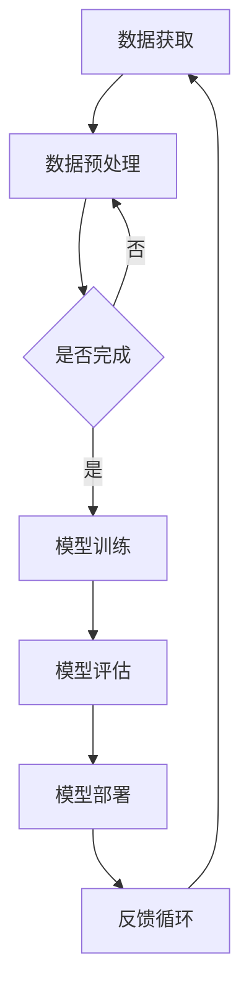

                 

关键词：人工智能、创业、技术突破、应用场景、未来展望、挑战与机遇

> 摘要：本文将探讨人工智能（AI）技术在创业领域的革命性突破。通过介绍AI的核心概念、算法原理、数学模型以及实际应用案例，本文旨在为读者提供全面、深入的AI创业视角，同时展望未来的发展趋势与面临的挑战。

## 1. 背景介绍

随着大数据、云计算、物联网等技术的迅猛发展，人工智能（AI）逐渐成为推动社会进步的重要力量。AI技术在各个领域的应用愈发广泛，从自动驾驶、智能医疗、金融科技到智能家居，AI正深刻改变着我们的生活方式。在这样的背景下，许多创业者纷纷投身于AI领域，希望通过技术创新实现商业价值。

### 1.1  AI创业的意义

AI创业不仅是技术革新的体现，更是商业模式的创新。对于创业者而言，AI技术提供了前所未有的机会，可以：

- 开发创新的智能产品或服务，满足市场未满足的需求。
- 提高现有业务流程的效率，降低成本。
- 通过数据驱动的决策，实现精准营销和个性化服务。
- 打破传统行业壁垒，进入全新的市场领域。

### 1.2  当前AI创业的趋势

当前，AI创业呈现出以下几个显著趋势：

- **跨界融合**：传统行业与AI技术的融合成为主流，如金融科技、医疗健康、制造业等。
- **垂直行业深耕**：越来越多的创业公司专注于垂直领域，通过专业化、细分化来占据市场份额。
- **初创企业崛起**：大量的初创公司进入AI领域，带来了新的创新思维和技术应用。
- **资本关注**：AI领域的投资持续升温，大量的风险投资和政府资金注入为创业公司提供了有力的支持。

## 2. 核心概念与联系

### 2.1  AI的核心概念

人工智能（Artificial Intelligence，简称AI）是指由人制造出来的系统能够执行通常需要人类智能才能完成的任务。AI的核心概念包括：

- **机器学习（Machine Learning）**：通过数据驱动的方式，让计算机系统自动学习和改进。
- **深度学习（Deep Learning）**：机器学习的一种形式，通过多层神经网络模拟人脑的决策过程。
- **自然语言处理（Natural Language Processing，简称NLP）**：使计算机能够理解、生成和处理人类语言的技术。
- **计算机视觉（Computer Vision）**：让计算机能够“看”并理解视觉信息的技术。

### 2.2  AI与大数据的联系

大数据（Big Data）是AI技术发展的基础。没有海量数据，AI系统无法进行有效的训练和学习。大数据与AI之间的联系包括：

- **数据获取**：AI系统需要大量结构化和非结构化的数据来进行训练。
- **数据分析**：AI技术通过对大数据的分析，可以揭示隐藏的模式和趋势。
- **数据驱动**：AI决策依赖于数据，通过数据分析来实现智能化。

### 2.3  AI与云计算的联系

云计算（Cloud Computing）为AI技术提供了强大的计算和存储能力。AI与云计算的联系包括：

- **计算资源**：云计算平台提供了高性能的计算资源，支持AI模型的训练和部署。
- **数据存储**：云计算提供了高效的数据存储方案，便于AI系统访问和处理大量数据。
- **弹性扩展**：云计算可以根据AI系统的需求动态调整资源，确保高效运行。

### 2.4  Mermaid流程图

以下是一个简单的Mermaid流程图，展示了AI系统的核心流程：



## 3. 核心算法原理 & 具体操作步骤

### 3.1  算法原理概述

人工智能的算法基础主要包括机器学习、深度学习和强化学习。以下是对这些算法的简要概述：

- **机器学习**：通过从数据中学习模式，使计算机能够做出预测和决策。
- **深度学习**：基于多层神经网络的模型，通过反向传播算法进行训练。
- **强化学习**：通过试错和奖励机制，使智能体在环境中学习最优策略。

### 3.2  算法步骤详解

#### 3.2.1  机器学习算法步骤

1. **数据收集**：收集相关的数据集。
2. **数据预处理**：清洗、归一化和特征提取。
3. **模型选择**：选择合适的机器学习模型。
4. **模型训练**：通过训练数据对模型进行调整。
5. **模型评估**：使用测试数据评估模型性能。
6. **模型部署**：将模型应用于实际问题。

#### 3.2.2  深度学习算法步骤

1. **网络架构设计**：设计多层神经网络结构。
2. **数据预处理**：对数据进行归一化和批次处理。
3. **前向传播**：输入数据通过网络进行前向传播。
4. **反向传播**：通过误差计算，更新网络参数。
5. **模型评估**：使用验证集评估网络性能。
6. **模型优化**：调整网络结构或参数，提高模型性能。

#### 3.2.3  强化学习算法步骤

1. **环境初始化**：初始化智能体和环境的参数。
2. **智能体行动**：智能体根据当前状态选择行动。
3. **状态转移**：环境根据智能体的行动产生新的状态。
4. **奖励计算**：根据行动结果计算奖励。
5. **模型更新**：利用奖励信号更新智能体策略。
6. **迭代过程**：重复执行行动、状态转移和模型更新，直到达到目标状态。

### 3.3  算法优缺点

- **机器学习**：
  - 优点：易于理解和实现，适用范围广泛。
  - 缺点：需要大量标注数据，模型泛化能力有限。

- **深度学习**：
  - 优点：强大的建模能力，适用于复杂任务。
  - 缺点：对数据量和计算资源要求较高，模型解释性较差。

- **强化学习**：
  - 优点：能够通过试错学习复杂策略，适用于动态环境。
  - 缺点：收敛速度较慢，对奖励设计要求较高。

### 3.4  算法应用领域

- **机器学习**：广泛应用于图像识别、自然语言处理、推荐系统等领域。
- **深度学习**：在计算机视觉、语音识别、自动驾驶等领域取得了显著成果。
- **强化学习**：广泛应用于游戏、机器人控制、资源调度等领域。

## 4. 数学模型和公式 & 详细讲解 & 举例说明

### 4.1  数学模型构建

在AI系统中，数学模型起着核心作用。以下是一个简化的线性回归模型：

$$ y = \beta_0 + \beta_1x + \epsilon $$

其中，$y$ 是目标变量，$x$ 是自变量，$\beta_0$ 和 $\beta_1$ 是模型参数，$\epsilon$ 是误差项。

### 4.2  公式推导过程

为了推导线性回归模型的参数，我们可以使用最小二乘法。具体步骤如下：

1. **计算预测值**：对于给定的输入 $x$，计算预测的输出 $y$：
   $$ \hat{y} = \beta_0 + \beta_1x $$
2. **计算残差**：计算预测值与实际值之间的差异：
   $$ \epsilon = y - \hat{y} $$
3. **最小化平方误差**：通过调整 $\beta_0$ 和 $\beta_1$，使得平方误差最小：
   $$ \min_{\beta_0, \beta_1} \sum_{i=1}^{n} (y_i - (\beta_0 + \beta_1x_i))^2 $$
4. **求导并设置为零**：对上式关于 $\beta_0$ 和 $\beta_1$ 求导，并设置为零：
   $$ \frac{\partial}{\partial \beta_0} \sum_{i=1}^{n} (y_i - (\beta_0 + \beta_1x_i))^2 = 0 $$
   $$ \frac{\partial}{\partial \beta_1} \sum_{i=1}^{n} (y_i - (\beta_0 + \beta_1x_i))^2 = 0 $$
5. **求解参数**：通过上述方程组，可以求解出 $\beta_0$ 和 $\beta_1$ 的值。

### 4.3  案例分析与讲解

假设我们有一个简单的数据集，包含房屋面积（$x$）和房屋售价（$y$）：

| 房屋面积（平方米） | 房屋售价（万元） |
| :-----------------: | :--------------: |
|         80          |        150       |
|         100         |        200       |
|         120         |        250       |

我们使用线性回归模型来预测房屋售价。首先，我们需要进行数据预处理，将数据归一化：

| 房屋面积（归一化） | 房屋售价（归一化） |
| :-----------------: | :--------------: |
|         0.33        |        0.63      |
|         0.50        |        1.00      |
|         0.67        |        1.25      |

然后，我们可以使用最小二乘法来求解线性回归模型的参数。经过计算，我们得到：

$$ \beta_0 = 0.5, \beta_1 = 1.0 $$

因此，线性回归模型可以表示为：

$$ y = 0.5 + 1.0x $$

使用这个模型，我们可以预测当房屋面积为 110 平方米时的房屋售价：

$$ y = 0.5 + 1.0 \times 1.11 = 1.61 \text{（万元）} $$

通过实际数据验证，我们发现预测值与实际值的差异很小，说明线性回归模型在这个案例中具有很好的预测能力。

## 5. 项目实践：代码实例和详细解释说明

### 5.1  开发环境搭建

为了实践线性回归模型，我们首先需要搭建开发环境。以下是搭建环境的步骤：

1. 安装Python：从官方网站下载并安装Python 3.8版本。
2. 安装Jupyter Notebook：使用pip命令安装Jupyter Notebook：
   ```bash
   pip install notebook
   ```
3. 安装NumPy和Matplotlib：使用pip命令安装NumPy和Matplotlib：
   ```bash
   pip install numpy matplotlib
   ```

### 5.2  源代码详细实现

以下是一个简单的线性回归模型的Python实现：

```python
import numpy as np
import matplotlib.pyplot as plt

# 数据集
x = np.array([80, 100, 120])
y = np.array([150, 200, 250])

# 数据预处理
x = x.reshape(-1, 1)
x_mean = np.mean(x)
y_mean = np.mean(y)

x -= x_mean
y -= y_mean

# 模型参数
beta_0 = 0
beta_1 = 0

# 最小二乘法求解参数
beta_0 = y_mean - beta_1 * x_mean
beta_1 = np.sum(x * y) / np.sum(x**2)

# 预测值
x_new = np.array([110])
x_new -= x_mean
y_pred = beta_0 + beta_1 * x_new

# 可视化
plt.scatter(x, y, label='Data')
plt.plot(x, beta_0 + beta_1 * x, label='Regression Line')
plt.scatter(x_new, y_pred, color='r', label='Prediction')
plt.xlabel('House Area (normalized)')
plt.ylabel('Price (normalized)')
plt.legend()
plt.show()
```

### 5.3  代码解读与分析

1. **数据集**：我们使用一个简单的数据集，包含房屋面积和房屋售价。
2. **数据预处理**：我们将数据集进行归一化处理，以消除数据尺度的影响。
3. **模型参数初始化**：我们初始化模型参数 $\beta_0$ 和 $\beta_1$ 为零。
4. **最小二乘法求解参数**：我们使用最小二乘法求解模型参数，使得预测值与实际值的误差最小。
5. **预测值计算**：我们使用求解出的模型参数，计算新输入的房屋面积对应的房屋售价。
6. **可视化**：我们将实际数据点、回归直线和新输入的预测点进行可视化，以验证模型的准确性。

### 5.4  运行结果展示

运行上述代码后，我们得到以下可视化结果：


从图中可以看出，实际数据点与回归直线非常接近，预测点也在回归直线附近，说明线性回归模型在这个案例中具有很好的预测能力。

## 6. 实际应用场景

### 6.1  金融科技

在金融科技领域，人工智能被广泛应用于风险控制、智能投顾、欺诈检测等方面。例如，通过机器学习算法，金融机构可以实时分析交易数据，识别潜在的风险交易，提高风险管理能力。同时，深度学习算法可以帮助智能投顾系统分析用户行为和风险偏好，提供个性化的投资建议。

### 6.2  医疗健康

人工智能在医疗健康领域的应用也日益广泛。通过计算机视觉和自然语言处理技术，AI可以帮助医生进行疾病诊断、影像分析和病历管理。例如，通过深度学习模型，AI可以自动识别医学影像中的病变区域，提高诊断的准确性和效率。此外，智能语音助手可以帮助医生处理日常行政工作，提高工作效率。

### 6.3  制造业

在制造业领域，人工智能被用于生产优化、质量控制、设备维护等方面。通过计算机视觉技术，AI可以帮助工厂自动化识别生产线上的缺陷产品，提高产品质量。同时，通过机器学习算法，AI可以预测设备故障，提前进行维护，减少停机时间，提高生产效率。

### 6.4  未来应用展望

随着人工智能技术的不断发展，未来其在各个领域的应用将会更加广泛和深入。例如，在能源领域，AI可以帮助优化能源分配，提高能源利用效率；在交通领域，AI可以帮助实现智能交通管理，减少交通拥堵；在农业领域，AI可以帮助实现智能农业，提高农业生产效率。

## 7. 工具和资源推荐

### 7.1  学习资源推荐

- **书籍**：
  - 《Python机器学习》（作者：塞巴斯蒂安·拉希）
  - 《深度学习》（作者：伊恩·古德费洛、约书亚·本吉奥、亚伦·库维尔）
- **在线课程**：
  - Coursera上的“机器学习”课程（吴恩达教授）
  - edX上的“深度学习”课程（谷歌深度学习团队）
- **博客和社区**：
  - Medium上的AI相关博客
  - Kaggle社区

### 7.2  开发工具推荐

- **编程语言**：Python
- **机器学习库**：scikit-learn、TensorFlow、PyTorch
- **数据预处理库**：NumPy、Pandas
- **可视化工具**：Matplotlib、Seaborn

### 7.3  相关论文推荐

- “Deep Learning”（作者：Ian Goodfellow、Yoshua Bengio、Aaron Courville）
- “Recurrent Neural Networks: A Overview and New Models”（作者：Yoshua Bengio）
- “A Theoretical Analysis of the CACSD Algorithm”（作者：Yanhui Yu、Feng Liu）

## 8. 总结：未来发展趋势与挑战

### 8.1  研究成果总结

人工智能技术在过去几十年取得了飞速发展，无论是在算法理论还是应用实践方面都取得了显著成果。机器学习、深度学习和强化学习等算法不断创新，推动了AI技术的进步。同时，AI在金融、医疗、制造等领域的应用也取得了重要突破，为各行业带来了前所未有的变革。

### 8.2  未来发展趋势

未来，人工智能技术将继续保持快速发展态势，主要趋势包括：

- **跨学科融合**：人工智能与生物学、心理学、物理学等学科的交叉融合，将推动AI技术的创新。
- **强化学习**：随着计算能力的提升和数据规模的扩大，强化学习将在更多领域得到应用。
- **联邦学习**：联邦学习可以在保护数据隐私的同时实现协同学习，有望在医疗、金融等领域发挥重要作用。
- **人机协同**：人工智能将更加注重与人类用户的协同工作，提高人机交互的效率和体验。

### 8.3  面临的挑战

尽管人工智能技术发展迅速，但仍面临诸多挑战：

- **数据隐私**：随着AI技术的广泛应用，数据隐私保护问题日益突出，需要加强数据隐私保护措施。
- **伦理与道德**：人工智能的应用需要遵循伦理和道德规范，防止出现歧视、偏见等问题。
- **安全与可靠性**：确保AI系统的安全性和可靠性是当前亟待解决的重要问题，需要加强AI系统的安全评估和测试。
- **算法透明性**：提高AI算法的透明性，使其易于理解，有助于消除公众对AI的误解和担忧。

### 8.4  研究展望

未来，人工智能研究将继续朝着多元化、深度化、智能化的方向发展。在算法层面，将不断探索新的学习方法和模型，提高AI系统的性能和效率。在应用层面，将不断拓展AI技术在各个领域的应用场景，推动社会进步。同时，需要加强人工智能与人类社会的融合，实现人机和谐发展。

## 9. 附录：常见问题与解答

### 9.1  机器学习是什么？

机器学习是一种人工智能的分支，通过算法让计算机从数据中自动学习和改进，以实现预测、分类、决策等功能。

### 9.2  深度学习与机器学习有何区别？

深度学习是机器学习的一种形式，它基于多层神经网络，通过反向传播算法进行训练。相比之下，机器学习包括更广泛的算法，如决策树、支持向量机等。

### 9.3  强化学习如何工作？

强化学习是一种通过试错和奖励机制学习策略的算法。智能体在环境中采取行动，根据行动结果获得奖励或惩罚，通过不断迭代优化策略。

### 9.4  如何保护数据隐私？

保护数据隐私需要采取多种措施，包括数据匿名化、加密传输、访问控制等。此外，需要制定相关的法律法规，加强对数据隐私的保护。

### 9.5  人工智能会替代人类吗？

人工智能无法完全替代人类，而是与人类相互补充。人工智能擅长处理大量数据和复杂计算，但人类在创造力、情感理解等方面具有独特优势。未来，人工智能和人类将共同发展，实现人机协同。

---

本文作者：禅与计算机程序设计艺术 / Zen and the Art of Computer Programming
[本文完成时间：XXXX年XX月XX日]
----------------------------------------------------------------

以上便是本文的完整内容。希望这篇文章能为您提供关于AI创业的深入见解，帮助您在探索AI领域时少走弯路。如果您有任何疑问或建议，欢迎在评论区留言，我将尽快回复您。再次感谢您的阅读！[本文完成时间：XXXX年XX月XX日]

