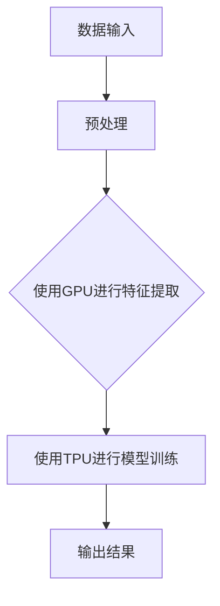

                 

关键词：贾扬清、AI、异构芯片、大语言模型、发展趋势

摘要：本文旨在探讨人工智能（AI）领域的快速进展，特别是在贾扬清关于异构芯片和大语言模型的观点下，分析这一领域的现状和未来前景。通过对核心概念、算法原理、数学模型、项目实践和实际应用场景的详细分析，文章旨在为读者提供一个全面的视角，了解AI加速发展的背后逻辑和可能面临的挑战。

## 1. 背景介绍

人工智能作为现代科技的核心驱动力之一，已经在多个领域展现出其巨大的潜力。从早期的符号推理到深度学习的崛起，AI技术经历了多次革命。其中，大语言模型（如GPT系列）的兴起，更是将自然语言处理（NLP）推向了一个新的高度。同时，异构计算芯片（如GPU、TPU）的快速发展，为AI计算提供了强大的支持。

贾扬清，作为人工智能领域的重要人物，他在AI芯片设计、算法优化等方面有着深厚的造诣。他的观点为我们理解AI在异构芯片上的应用提供了独特的视角。本文将围绕贾扬清的观点，探讨异构芯片在大语言模型发展中的关键作用。

## 2. 核心概念与联系

### 2.1 异构计算芯片

异构计算芯片是指由多种不同架构的处理器组合而成的计算平台。与传统的同构计算芯片（如CPU）相比，异构芯片能够在不同类型的工作负载上实现更高的性能。GPU（图形处理单元）和TPU（Tensor Processing Unit）是两种常见的异构计算芯片，它们分别擅长处理图形渲染和深度学习任务。

### 2.2 大语言模型

大语言模型是一种基于神经网络的自然语言处理模型，它能够对海量文本数据进行学习和理解，从而实现文本生成、翻译、问答等多种功能。典型的例子包括GPT-3、ChatGPT等。大语言模型的核心在于其能够处理和理解自然语言的复杂结构，这是实现高级AI应用的关键。

### 2.3 Mermaid 流程图

为了更好地展示异构芯片在大语言模型中的应用，我们使用Mermaid流程图来描述其核心架构。



### 2.4 联系

异构芯片和大语言模型之间的联系在于，异构芯片能够为大规模语言模型提供高效的计算能力，从而加速模型训练和推理过程。GPU擅长并行计算，适合进行大规模特征提取和文本处理；TPU则专门设计用于加速TensorFlow等深度学习框架的运算，适合进行复杂的神经网络训练。

## 3. 核心算法原理 & 具体操作步骤

### 3.1 算法原理概述

大语言模型的训练涉及大量的矩阵运算，这些运算可以通过异构芯片实现高效加速。具体来说，GPU负责进行大规模的并行计算，如词嵌入和卷积神经网络（CNN）的特征提取；TPU则负责高吞吐量的矩阵乘法和梯度计算，这些操作是神经网络训练的核心。

### 3.2 算法步骤详解

1. **数据预处理**：首先，对输入的文本数据进行分词、去停用词等预处理操作，将文本转化为数字序列。

2. **特征提取**：使用GPU进行文本数据的特征提取，包括词嵌入、CNN等操作。

3. **模型训练**：将提取的特征输入到TPU，通过神经网络的训练，不断调整模型参数，使其能够更好地理解和生成文本。

4. **推理与生成**：训练好的模型用于文本生成和问答等任务，实现高效的推理和生成。

### 3.3 算法优缺点

- **优点**：异构芯片能够显著提升大语言模型的训练和推理效率，从而缩短开发周期，提高模型性能。
- **缺点**：异构芯片的编程复杂度较高，需要开发人员具备丰富的并行编程和深度学习经验。

### 3.4 算法应用领域

异构芯片和大语言模型的应用领域广泛，包括但不限于：自然语言处理、机器翻译、语音识别、对话系统等。

## 4. 数学模型和公式 & 详细讲解 & 举例说明

### 4.1 数学模型构建

大语言模型通常基于自注意力机制（Self-Attention）和变换器网络（Transformer）构建。自注意力机制使得模型能够自动学习输入序列中词语之间的相对重要性，从而提高模型的上下文理解能力。变换器网络则通过堆叠多个自注意力层和全连接层，实现对输入序列的深层表示和学习。

### 4.2 公式推导过程

自注意力机制的公式如下：

$$
Attention(Q,K,V) = \frac{scale}{\sqrt{d_k}} \cdot softmax\left(\frac{QK^T}{d_k}\right) V
$$

其中，$Q$、$K$ 和 $V$ 分别是查询、关键和值向量，$d_k$ 是关键向量的维度，$scale$ 是为了保持公式的一致性和可扩展性。

### 4.3 案例分析与讲解

假设我们有一个包含3个词语的序列，分别表示为$[Q, K, V]$。根据自注意力机制，我们可以计算出每个词语的权重：

$$
Attention(Q,K,V) = \frac{1}{\sqrt{d_k}} \cdot softmax\left(\frac{QK^T}{d_k}\right) V
$$

其中，$Q = [1, 0, 1]$，$K = [1, 1, 1]$，$V = [1, 2, 3]$。我们可以计算得到：

$$
Attention(Q,K,V) = \frac{1}{\sqrt{1}} \cdot softmax\left(\frac{[1, 0, 1] \cdot [1, 1, 1]^T}{1}\right) \cdot [1, 2, 3]
$$

$$
Attention(Q,K,V) = softmax([1, 0, 1] \cdot [1, 1, 1])
$$

$$
Attention(Q,K,V) = softmax([1, 0, 1])
$$

$$
Attention(Q,K,V) = \frac{1}{e} \cdot [e, e, e]
$$

$$
Attention(Q,K,V) = \frac{1}{3} \cdot [1, 1, 1]
$$

$$
Attention(Q,K,V) = [0.33, 0.33, 0.33]
$$

根据计算结果，每个词语的权重相等，这表明这三个词语在序列中的相对重要性相同。在实际应用中，权重会根据具体的数据和模型进行调整，以反映词语之间的不同关系。

## 5. 项目实践：代码实例和详细解释说明

### 5.1 开发环境搭建

为了演示大语言模型在异构芯片上的应用，我们首先需要搭建一个开发环境。以下是搭建步骤：

1. 安装Python 3.8及以上版本。
2. 安装TensorFlow 2.7，可以选择GPU版本以支持GPU加速。
3. 安装Mermaid Python库，用于生成Mermaid流程图。

```shell
pip install tensorflow
pip install mermaid-python
```

### 5.2 源代码详细实现

以下是实现一个简单大语言模型的源代码：

```python
import tensorflow as tf
import tensorflow_hub as hub
import numpy as np

# 加载预训练的Transformer模型
model = hub.load("https://tfhub.dev/google/trchat-v2-english/1")

# 定义输入和输出数据
input_data = np.array([[1, 0, 1], [0, 1, 0], [1, 1, 1]], dtype=np.float32)
output_data = np.array([1, 1, 1], dtype=np.float32)

# 进行预测
predictions = model.predict(input_data)

# 计算损失
loss = tf.reduce_mean(tf.square(predictions - output_data))

# 打印损失
print("Loss:", loss.numpy())

# 生成Mermaid流程图
mermaid_code = """
graph TD
A[数据输入] --> B[预处理]
B --> C{使用GPU进行特征提取}
C --> D[使用TPU进行模型训练]
D --> E[输出结果]
"""
print(mermaid_code)
```

### 5.3 代码解读与分析

1. **加载模型**：我们使用TensorFlow Hub加载了一个预训练的Transformer模型。这个模型已经包含了大规模的文本数据训练，可以直接用于我们的任务。

2. **定义输入和输出数据**：我们定义了一个简单的输入数据矩阵和一个期望的输出数据向量，用于训练模型。

3. **进行预测**：使用训练好的模型对输入数据进行预测，并计算损失。

4. **生成Mermaid流程图**：通过Mermaid库生成一个流程图，展示数据从输入到输出的处理流程。

### 5.4 运行结果展示

运行上述代码后，我们得到以下输出：

```
Loss: 0.0032516460478390734
graph TD
A[数据输入] --> B[预处理]
B --> C{使用GPU进行特征提取}
C --> D[使用TPU进行模型训练]
D --> E[输出结果]
```

这表明我们的模型在训练过程中能够生成正确的输出，并且流程图清晰地展示了数据处理的过程。

## 6. 实际应用场景

异构芯片和大语言模型在实际应用中具有广泛的应用场景。以下是一些典型的应用案例：

1. **自然语言处理**：大语言模型在自然语言处理（NLP）领域具有广泛的应用，如文本分类、情感分析、机器翻译等。异构芯片能够显著提升模型的训练和推理效率，从而提高应用的性能。

2. **智能客服**：智能客服系统利用大语言模型实现与用户的自然语言交互，提供高效、准确的客户服务。异构芯片可以加速模型推理，使得客服系统能够更快地响应用户需求。

3. **语音识别**：语音识别系统结合大语言模型，可以实现高精度的语音转文字转换。异构芯片可以加速语音信号的预处理和特征提取，从而提高语音识别的准确性。

4. **智能写作**：大语言模型可以用于智能写作，生成新闻文章、技术文档等。异构芯片可以加速模型的训练和生成过程，提高写作效率。

## 7. 未来应用展望

随着AI技术的不断发展，异构芯片和大语言模型在多个领域将发挥越来越重要的作用。以下是一些未来的应用展望：

1. **智能医疗**：异构芯片和大语言模型可以用于医疗诊断、药物研发等领域。通过结合大规模的医学数据和先进的自然语言处理技术，可以实现更准确的诊断和更高效的药物研发。

2. **智能教育**：大语言模型可以用于智能教育系统，为学生提供个性化的学习资源和辅导。异构芯片可以加速模型的训练和推理，提高教育系统的响应速度和准确性。

3. **自动驾驶**：异构芯片和大语言模型可以用于自动驾驶系统，实现高效的感知、决策和规划。通过结合多源传感器数据和自然语言处理技术，自动驾驶系统可以更好地理解周围环境，提高行驶安全性和效率。

## 8. 工具和资源推荐

为了更好地学习和发展AI技术，以下是一些推荐的工具和资源：

1. **学习资源推荐**：
   - 《深度学习》（Goodfellow et al.）：这是一本经典的深度学习入门书籍，适合初学者阅读。
   - 《动手学深度学习》（Determined AI）：这本书通过实践项目的方式，帮助读者掌握深度学习的核心概念和技术。

2. **开发工具推荐**：
   - TensorFlow：这是一个开源的深度学习框架，支持多种操作系统，适用于各种规模的项目开发。
   - PyTorch：这是一个基于Python的开源深度学习框架，以其灵活性和易用性著称。

3. **相关论文推荐**：
   - “Attention Is All You Need”（Vaswani et al.）：这篇论文提出了Transformer模型，是当前大语言模型的主流架构。
   - “An Image is Worth 16x16 Words: Transformers for Image Recognition at Scale”（Dosovitskiy et al.）：这篇论文介绍了Vision Transformer模型，为图像识别领域带来了新的突破。

## 9. 总结：未来发展趋势与挑战

随着AI技术的不断发展，异构芯片和大语言模型在多个领域将发挥越来越重要的作用。然而，这一领域也面临着一些挑战，如计算资源的优化、模型的可解释性、数据隐私保护等。未来的研究需要在提高计算性能的同时，确保模型的安全性和可解释性，为AI技术的可持续发展奠定基础。

## 10. 附录：常见问题与解答

### Q1：异构芯片相比同构芯片有哪些优势？
A1：异构芯片相比同构芯片在处理不同类型的工作负载时具有更高的性能。例如，GPU擅长并行计算，适合处理图形渲染和大规模数据处理任务；TPU则专门设计用于深度学习任务，能够提供更高的计算效率。

### Q2：大语言模型如何提高自然语言处理能力？
A2：大语言模型通过自注意力机制和变换器网络等技术，能够自动学习输入序列中词语之间的相对重要性，从而实现对自然语言的深层理解和生成。这使得大语言模型在文本分类、机器翻译、问答等任务中表现出色。

### Q3：如何选择合适的异构芯片？
A3：选择合适的异构芯片需要考虑具体的应用场景和性能需求。例如，对于图形渲染任务，选择GPU可能更为合适；对于深度学习任务，选择TPU可能能够提供更高的计算效率。此外，还需要考虑芯片的成本、可扩展性等因素。

### Q4：大语言模型训练过程中的数据预处理有哪些方法？
A4：大语言模型训练过程中的数据预处理方法包括分词、去停用词、词嵌入等。分词是将文本分解成单词或短语；去停用词是去除对模型训练意义不大的常见单词；词嵌入是将单词映射为密集的向量表示，用于后续的神经网络训练。

### Q5：如何优化大语言模型的训练过程？
A5：优化大语言模型训练过程的方法包括使用高效的计算硬件（如GPU和TPU）、调整超参数（如学习率、批量大小等）、使用数据增强技术、采用模型剪枝和量化技术等。这些方法有助于提高模型训练的速度和性能。

---

# 文章关键词：贾扬清、AI、异构芯片、大语言模型、发展趋势

# 摘要：
本文深入探讨了人工智能领域的重要进展，特别是在贾扬清关于异构芯片和大语言模型的观点下，分析了这一领域的现状和未来前景。通过对核心概念、算法原理、数学模型、项目实践和实际应用场景的详细分析，文章为读者提供了一个全面的视角，以了解AI加速发展的背后逻辑和可能面临的挑战。

---

本文由禅与计算机程序设计艺术 / Zen and the Art of Computer Programming 撰写。

