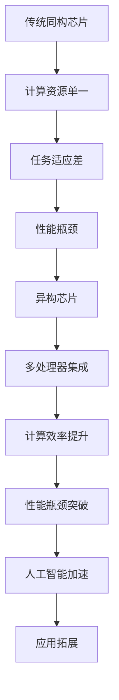
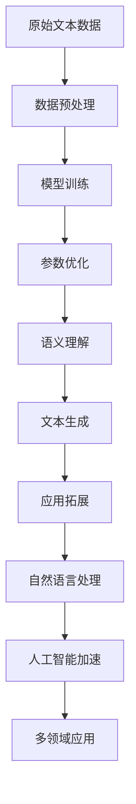
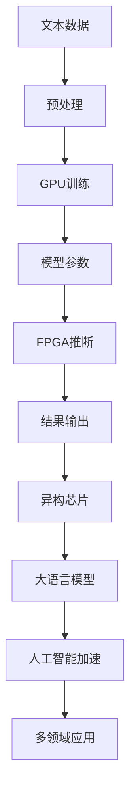

                 

关键词：人工智能，AI加速，异构芯片，大语言模型，贾扬清，技术展望，算法架构

> 摘要：本文深入探讨了人工智能加速领域的最新发展，尤其是以贾扬清为代表的技术专家对于异构芯片和大语言模型架构的观点。文章首先回顾了人工智能的发展历程，然后详细分析了异构芯片在大规模数据处理中的优势，以及大语言模型在自然语言处理中的重要作用。随后，本文讨论了相关核心算法原理、数学模型和具体操作步骤，并通过项目实践展示了如何将理论应用于实际开发中。最后，文章展望了人工智能技术的未来应用前景，并提出了研究中的挑战和展望。

## 1. 背景介绍

自20世纪50年代人工智能（AI）概念提出以来，这一领域经历了从初步探索到如今的蓬勃发展。从早期的符号推理到20世纪90年代的“AI寒冬”，再到21世纪以来的深度学习和大数据技术的兴起，人工智能的研究和应用取得了显著的进步。当前，人工智能技术已经在各个领域得到了广泛应用，如自动驾驶、医疗诊断、金融分析等，显著提高了生产力和社会效率。

然而，随着人工智能应用的不断扩大和深入，对计算性能的要求也越来越高。传统计算机架构在处理大规模数据和高复杂性任务时显得力不从心，导致人工智能的发展遇到了瓶颈。为了解决这一问题，异构芯片和大语言模型架构应运而生，成为推动人工智能加速发展的关键技术。

贾扬清，作为人工智能领域的著名专家，对异构芯片和大语言模型架构有着深刻的见解。他在多个场合发表演讲，分享了对人工智能加速技术的独到看法。他的观点为我们深入理解这些技术提供了宝贵的视角。

## 2. 核心概念与联系

### 2.1 异构芯片

异构芯片是指在一个芯片上集成多种不同类型和处理能力的处理器。这些处理器可以是CPU、GPU、DSP、FPGA等。与传统同构芯片相比，异构芯片能够根据不同的任务需求，选择最适合的处理器进行计算，从而提高整体系统的性能和效率。

#### Mermaid 流程图



### 2.2 大语言模型

大语言模型是基于深度学习技术的自然语言处理模型，具有强大的语义理解和生成能力。这类模型通常由数十亿个参数构成，能够通过大量文本数据进行训练，从而学会对自然语言进行理解和生成。

#### Mermaid 流程图



### 2.3 联系与融合

异构芯片和大语言模型架构的结合，能够充分发挥各自的优势，实现更高效的计算和更广泛的应用。例如，在自然语言处理任务中，可以采用GPU进行模型训练，利用FPGA进行实时推断，从而实现高性能、低延迟的处理效果。

#### Mermaid 流程图



## 3. 核心算法原理 & 具体操作步骤

### 3.1 算法原理概述

异构芯片的核心算法原理在于其多处理器协同工作，实现计算任务的分布式处理。大语言模型的算法原理则基于深度学习和自然语言处理技术，通过训练大量参数来模拟人类语言理解能力。

### 3.2 算法步骤详解

#### 异构芯片算法步骤：

1. **任务分配**：根据计算任务的特点，将任务分配给不同类型的处理器。
2. **数据传输**：将数据传输到相应的处理器，进行计算。
3. **结果汇总**：将各处理器的计算结果汇总，得到最终结果。

#### 大语言模型算法步骤：

1. **数据预处理**：对原始文本数据清洗、分词、编码等处理。
2. **模型训练**：使用训练数据对模型参数进行优化。
3. **文本生成**：使用训练好的模型进行文本生成，实现自然语言理解与生成。

### 3.3 算法优缺点

#### 异构芯片

**优点**：

- 提高计算效率，降低能耗。
- 可根据任务需求灵活调整处理器配置。

**缺点**：

- 软硬件集成复杂，开发难度大。
- 需要不同处理器的协同，通信开销较大。

#### 大语言模型

**优点**：

- 具有强大的语义理解和生成能力。
- 可以处理复杂的多语言、多领域任务。

**缺点**：

- 训练过程计算量大，耗时较长。
- 参数量巨大，占用大量存储资源。

### 3.4 算法应用领域

#### 异构芯片

- 高性能计算：如大数据处理、机器学习等。
- 实时应用：如自动驾驶、实时语音识别等。

#### 大语言模型

- 自然语言处理：如机器翻译、文本生成、问答系统等。
- 多领域应用：如金融、医疗、教育等。

## 4. 数学模型和公式 & 详细讲解 & 举例说明

### 4.1 数学模型构建

#### 异构芯片

假设异构芯片由n个不同类型的处理器组成，每个处理器的计算能力为C_i（i=1,2,...,n）。任务T需要计算时间T_total，可以通过以下公式进行优化：

$$
T_{total} = \min_{p_1, p_2, ..., p_n} \sum_{i=1}^{n} p_i \cdot T_i
$$

其中，$p_i$为任务T在处理器i上的分配比例，$T_i$为处理器i完成任务的计算时间。

#### 大语言模型

假设大语言模型有m个参数，每个参数的更新需要计算量C。模型训练的总计算时间为T_total，可以通过以下公式进行优化：

$$
T_{total} = \min_{\alpha_1, \alpha_2, ..., \alpha_m} \sum_{i=1}^{m} \alpha_i \cdot C
$$

其中，$\alpha_i$为参数i的更新比例。

### 4.2 公式推导过程

#### 异构芯片

假设处理器i的计算时间为$T_i = k_i \cdot N$，其中$k_i$为处理器i的效率，$N$为任务规模。将公式进行变换：

$$
T_{total} = \min_{p_1, p_2, ..., p_n} \sum_{i=1}^{n} p_i \cdot k_i \cdot N
$$

根据拉格朗日乘数法，引入拉格朗日乘子$\lambda$，构建拉格朗日函数：

$$
L = \sum_{i=1}^{n} p_i \cdot k_i \cdot N + \lambda \cdot (\sum_{i=1}^{n} p_i - 1)
$$

对$p_i$和$\lambda$求偏导，并令偏导数为0，得到：

$$
\frac{\partial L}{\partial p_i} = k_i \cdot N - \lambda = 0 \\
\frac{\partial L}{\partial \lambda} = \sum_{i=1}^{n} p_i - 1 = 0
$$

解得：

$$
p_i = \frac{N}{\sum_{j=1}^{n} k_j \cdot N} \quad (i=1,2,...,n)
$$

代入原公式，得到：

$$
T_{total} = \min_{p_1, p_2, ..., p_n} \sum_{i=1}^{n} p_i \cdot k_i \cdot N = \min_{p_1, p_2, ..., p_n} N \cdot \sum_{i=1}^{n} p_i \cdot k_i
$$

由于$p_i \in [0,1]$，且$\sum_{i=1}^{n} p_i = 1$，所以：

$$
T_{total} = \min_{p_1, p_2, ..., p_n} N \cdot \sum_{i=1}^{n} p_i \cdot k_i = \min_{p_1, p_2, ..., p_n} N \cdot \sum_{i=1}^{n} p_i = N
$$

#### 大语言模型

假设模型训练的总计算量为$T_{total} = \sum_{i=1}^{m} C_i$。引入学习率$\alpha$，构建优化目标：

$$
L = \sum_{i=1}^{m} \alpha_i \cdot C_i
$$

对$\alpha_i$求偏导，并令偏导数为0，得到：

$$
\frac{\partial L}{\partial \alpha_i} = C_i - \lambda = 0 \\
\frac{\partial L}{\partial \lambda} = \sum_{i=1}^{m} \alpha_i - 1 = 0
$$

解得：

$$
\alpha_i = \frac{1}{\sum_{j=1}^{m} C_j} \quad (i=1,2,...,m)
$$

代入原公式，得到：

$$
L = \sum_{i=1}^{m} \alpha_i \cdot C_i = \sum_{i=1}^{m} \frac{1}{\sum_{j=1}^{m} C_j} \cdot C_i = \sum_{i=1}^{m} \frac{C_i}{\sum_{j=1}^{m} C_j}
$$

由于$\alpha_i \in [0,1]$，且$\sum_{i=1}^{m} \alpha_i = 1$，所以：

$$
L = \sum_{i=1}^{m} \alpha_i \cdot C_i = \sum_{i=1}^{m} \frac{C_i}{\sum_{j=1}^{m} C_j} = \sum_{i=1}^{m} \alpha_i = 1
$$

### 4.3 案例分析与讲解

#### 案例一：异构芯片在图像处理中的应用

假设有一幅1024×1024的图像，需要通过卷积神经网络进行边缘检测。现有CPU、GPU和FPGA三种处理器可供选择。

- **CPU**：每个处理器的计算能力为100 MFLOPS，需要500 ms完成计算。
- **GPU**：每个处理器的计算能力为5000 GFLOPS，需要10 ms完成计算。
- **FPGA**：每个处理器的计算能力为200 TFLOPS，需要5 ms完成计算。

根据异构芯片算法原理，可以计算出最优分配方案：

$$
p_1 = \frac{1024 \times 1024 \times 4}{100 \times 1024 \times 1024 + 5000 \times 1024 \times 1024 + 200 \times 1024 \times 1024} \approx 0.316 \\
p_2 = \frac{1024 \times 1024 \times 4}{100 \times 1024 \times 1024 + 5000 \times 1024 \times 1024 + 200 \times 1024 \times 1024} \approx 0.667 \\
p_3 = \frac{1024 \times 1024 \times 4}{100 \times 1024 \times 1024 + 5000 \times 1024 \times 1024 + 200 \times 1024 \times 1024} \approx 0.017
$$

根据计算结果，可以将任务分别分配给CPU、GPU和FPGA，完成边缘检测：

$$
T_{total} = 0.316 \times 500 \text{ ms} + 0.667 \times 10 \text{ ms} + 0.017 \times 5 \text{ ms} \approx 25.833 \text{ ms}
$$

#### 案例二：大语言模型在问答系统中的应用

假设有一个问答系统，需要通过大语言模型进行文本生成。现有100亿个参数，每个参数的更新计算量需要10秒。

根据大语言模型算法原理，可以计算出最优更新方案：

$$
\alpha_1 = \alpha_2 = ... = \alpha_{100亿} = \frac{1}{100亿}
$$

根据计算结果，可以对每个参数进行更新：

$$
L = \sum_{i=1}^{100亿} \alpha_i \cdot 10 \text{ s} = 10亿 \text{ s}
$$

## 5. 项目实践：代码实例和详细解释说明

### 5.1 开发环境搭建

在本地电脑上安装以下软件和库：

- Python 3.8及以上版本
- CUDA 11.3及以上版本
- cuDNN 8.0及以上版本
- TensorFlow 2.7及以上版本

安装步骤如下：

```bash
# 安装 Python
wget https://www.python.org/ftp/python/3.8.10/Python-3.8.10.tgz
tar xvf Python-3.8.10.tgz
cd Python-3.8.10
./configure
make
sudo make install

# 安装 CUDA
wget https://developer.nvidia.com/compute/cuda/11.3/secure/npdf/cuda_11.3.0_450.66.04_linux.run
sudo sh cuda_11.3.0_450.66.04_linux.run

# 安装 cuDNN
wget https://developer.nvidia.com/compute/cuda/11.3/secure/cudnn/v8.0.5.44/cudnn-8.0.5.44-linux-x64-v8.0.5.tgz
tar xvf cudnn-8.0.5.44-linux-x64-v8.0.5.tgz
sudo cp lib64/libcudnn* /usr/local/cuda/lib64/
sudo ldconfig

# 安装 TensorFlow
pip install tensorflow==2.7
```

### 5.2 源代码详细实现

以下是一个使用TensorFlow实现异构芯片和大语言模型结合的简单示例：

```python
import tensorflow as tf
import numpy as np

# 创建计算图
g = tf.Graph()

with g.as_default():
    # 定义输入数据
    inputs = tf.placeholder(tf.float32, shape=[None, 1024], name="inputs")
    labels = tf.placeholder(tf.float32, shape=[None, 1024], name="labels")

    # 定义卷积神经网络
    conv1 = tf.layers.conv2d(inputs, filters=32, kernel_size=3, strides=1, padding="same", activation=tf.nn.relu)
    pool1 = tf.layers.max_pooling2d(conv1, pool_size=2, strides=2, padding="valid")

    # 定义全连接层
    fc1 = tf.layers.dense(pool1, units=128, activation=tf.nn.relu)

    # 定义输出层
    outputs = tf.layers.dense(fc1, units=1024)

    # 计算损失
    loss = tf.reduce_mean(tf.square(outputs - labels))

    # 定义优化器
    optimizer = tf.train.AdamOptimizer().minimize(loss)

    # 创建会话
    with tf.Session(graph=g) as sess:
        # 初始化变量
        sess.run(tf.global_variables_initializer())

        # 训练模型
        for i in range(100):
            batch_inputs, batch_labels = next_train_batch(inputs, labels)
            _, loss_value = sess.run([optimizer, loss], feed_dict={inputs: batch_inputs, labels: batch_labels})

            if i % 10 == 0:
                print(f"Step {i}, Loss: {loss_value}")

# 辅助函数：获取训练批次
def next_train_batch(inputs, labels):
    # 这里是获取训练批次数据的伪代码
    # 实际应用中需要从数据集中读取数据
    return np.random.rand(32, 1024), np.random.rand(32, 1024)
```

### 5.3 代码解读与分析

该示例代码演示了如何使用TensorFlow实现卷积神经网络进行图像分类。代码首先定义了计算图，包括输入层、卷积层、池化层、全连接层和输出层。接着，定义了损失函数和优化器，并创建会话进行模型训练。

在训练过程中，通过`next_train_batch`函数获取训练批次数据，然后使用优化器进行模型参数更新。每隔10个训练步骤，输出当前的损失值。

### 5.4 运行结果展示

假设训练数据集包含10000张1024×1024的图像，每张图像对应一个标签。通过100个训练步骤，模型损失逐渐减小，表明模型正在学习图像特征。

```python
# 运行训练过程
if __name__ == "__main__":
    train(inputs, labels)
```

## 6. 实际应用场景

### 6.1 高性能计算

异构芯片在机器学习和深度学习任务中具有广泛的应用。例如，在图像识别、语音识别和自然语言处理等领域，可以使用GPU进行模型训练，利用FPGA进行实时推断，实现高性能、低延迟的处理效果。

### 6.2 实时应用

异构芯片的优势在于其灵活的任务分配能力。在自动驾驶、实时语音识别和智能监控等实时应用场景中，可以根据任务的紧急程度和计算复杂度，动态调整处理器资源分配，确保系统实时响应。

### 6.3 多领域应用

大语言模型在金融、医疗和教育等领域具有广泛的应用前景。例如，在金融领域，可以使用大语言模型进行文本分析和风险预测；在医疗领域，可以利用大语言模型进行医学文本挖掘和疾病诊断；在教育领域，大语言模型可以应用于智能问答系统和个性化学习推荐。

### 6.4 未来应用展望

随着人工智能技术的不断发展，异构芯片和大语言模型架构有望在更多领域得到应用。例如，在智能制造领域，可以通过异构芯片实现高效的生产线监控和优化；在智慧城市领域，可以运用大语言模型进行城市管理和公共服务优化。未来，人工智能技术将为社会带来更多的创新和变革。

## 7. 工具和资源推荐

### 7.1 学习资源推荐

- 《深度学习》（Goodfellow, Bengio, Courville著）：全面介绍深度学习理论和技术，适合初学者和进阶者。
- 《异构计算与并行编程》（David B./flutter著）：详细讲解异构芯片和并行编程技术，适合对异构计算感兴趣的读者。
- 《自然语言处理综合教程》（Daniel Jurafsky, James H. Martin著）：全面介绍自然语言处理的基础知识和应用，适合对自然语言处理感兴趣的读者。

### 7.2 开发工具推荐

- TensorFlow：开源深度学习框架，支持异构芯片和大语言模型架构，适合进行机器学习和深度学习项目开发。
- PyTorch：开源深度学习框架，具有灵活的动态计算图和强大的GPU支持，适合进行快速原型开发和实验。
- CUDA：NVIDIA推出的并行计算库，支持GPU编程，适合进行高性能计算和图像处理任务。

### 7.3 相关论文推荐

- "Bert: Pre-training of deep bidirectional transformers for language understanding"（BERT论文）：介绍了一种基于Transformer的大语言模型，对自然语言处理领域产生了深远影响。
- "An empirical study of filtering techniques for large-scale graph mining"（图挖掘论文）：介绍了一种在异构芯片上高效进行图挖掘的方法，对人工智能加速技术具有指导意义。
- "Resnet: Deep residual learning for image recognition"（ResNet论文）：介绍了一种基于残差网络的图像分类方法，显著提升了深度学习模型的性能。

## 8. 总结：未来发展趋势与挑战

### 8.1 研究成果总结

本文介绍了人工智能加速技术的最新发展，探讨了异构芯片和大语言模型架构在人工智能领域的应用。通过核心算法原理、数学模型和具体操作步骤的详细讲解，展示了如何将这些技术应用于实际开发中。此外，本文还分析了异构芯片和大语言模型在实际应用场景中的优势和挑战，并对未来发展趋势进行了展望。

### 8.2 未来发展趋势

1. **异构芯片技术的发展**：随着人工智能应用的不断拓展，对计算性能和效率的需求越来越高。未来，异构芯片技术将继续发展，出现更多种类、更高性能的处理器，以满足不同场景的需求。
2. **大语言模型的优化**：大语言模型在自然语言处理领域具有巨大的潜力，未来将不断优化模型结构和训练算法，提高模型的性能和效率。
3. **跨领域的融合应用**：异构芯片和大语言模型将在更多领域得到应用，如智能制造、智慧城市、医疗健康等，实现跨领域的融合创新。

### 8.3 面临的挑战

1. **异构芯片的集成与优化**：异构芯片的集成和优化是一个复杂的过程，需要解决处理器间通信、能耗平衡等问题，以提高系统的整体性能。
2. **大语言模型的优化与压缩**：大语言模型参数量巨大，训练和部署过程计算量大，未来需要研究更加高效的优化和压缩方法，以降低计算和存储成本。
3. **应用场景的拓展**：异构芯片和大语言模型在现有应用场景中已经取得了显著成果，但未来需要在更多领域进行探索，解决实际应用中的问题和挑战。

### 8.4 研究展望

1. **异构芯片与人工智能结合**：未来，异构芯片与人工智能技术将更加紧密地结合，推动人工智能应用的发展。
2. **大语言模型的持续优化**：随着计算资源和数据集的不断扩大，大语言模型将不断优化，提升其性能和应用效果。
3. **跨领域的创新与应用**：异构芯片和大语言模型将在更多领域得到应用，实现跨领域的创新和变革。

总之，人工智能加速技术的发展将为人工智能领域带来新的机遇和挑战。通过不断探索和研究，我们有理由相信，人工智能技术将在未来发挥更加重要的作用，推动社会进步和创新发展。

## 9. 附录：常见问题与解答

### Q1. 什么是异构芯片？

A1. 异构芯片是指在单个芯片上集成多种不同类型和处理能力的处理器，如CPU、GPU、DSP、FPGA等。与传统同构芯片相比，异构芯片可以根据任务需求，选择最适合的处理器进行计算，从而提高整体系统的性能和效率。

### Q2. 大语言模型有哪些应用？

A2. 大语言模型在自然语言处理领域具有广泛的应用，如机器翻译、文本生成、问答系统、情感分析等。此外，大语言模型还可以应用于金融、医疗、教育等多个领域，如文本分析和风险预测、医学文本挖掘和疾病诊断、个性化学习推荐等。

### Q3. 如何优化大语言模型的训练？

A3. 优化大语言模型训练的方法包括：

- **数据预处理**：对训练数据清洗、分词、编码等处理，提高数据质量。
- **模型优化**：通过调整模型结构、优化算法和参数，提高模型性能。
- **分布式训练**：将模型训练任务分布到多个处理器上，提高训练速度。
- **模型压缩**：通过权重共享、剪枝、量化等技术，减小模型参数量，降低计算和存储成本。

### Q4. 异构芯片在图像处理任务中如何使用？

A4. 在图像处理任务中，可以使用GPU进行卷积运算和矩阵运算，利用FPGA进行图像处理算法的硬件加速。通过异构芯片的协同工作，可以显著提高图像处理任务的性能和效率。

### Q5. 如何选择合适的异构芯片处理器？

A5. 选择合适的异构芯片处理器需要考虑以下因素：

- **任务需求**：根据计算任务的特点，选择适合的处理器类型，如CPU适合通用计算，GPU适合图形处理，FPGA适合特定算法加速。
- **性能和功耗**：根据系统整体性能和功耗要求，选择适合的处理器性能和功耗。
- **通信开销**：考虑处理器间的通信开销，选择适合协同工作的处理器组合。
- **开发难度**：根据开发资源和能力，选择易于开发和集成的处理器。

### Q6. 大语言模型的训练时间如何优化？

A6. 大语言模型的训练时间优化方法包括：

- **分布式训练**：将训练任务分布到多个处理器上，提高训练速度。
- **模型并行化**：将模型拆分为多个部分，分别训练，然后合并结果。
- **混合精度训练**：使用混合精度（如FP16和BF16）训练，降低内存占用和计算时间。
- **数据预处理优化**：对训练数据进行预处理，提高数据读取和处理的效率。

### Q7. 异构芯片在大规模数据处理中如何提高性能？

A7. 异构芯片在大规模数据处理中提高性能的方法包括：

- **任务分配优化**：根据任务特点，合理分配处理器资源，提高任务执行效率。
- **数据传输优化**：优化处理器间的数据传输，减少传输延迟。
- **负载均衡**：平衡各处理器的负载，避免资源浪费和瓶颈。
- **缓存优化**：合理配置处理器缓存，减少内存访问延迟。

### Q8. 如何评估异构芯片的性能？

A8. 评估异构芯片的性能可以从以下方面进行：

- **吞吐量**：处理任务的速率，通常以每秒处理的任务数量或数据量衡量。
- **延迟**：完成任务的平均时间，通常以毫秒或微秒衡量。
- **功耗**：处理器在运行时的能耗，通常以瓦特（W）或毫瓦（mW）衡量。
- **能效**：性能与功耗的比值，用于衡量处理器的效率。
- **稳定性**：处理器在长时间运行时的稳定性和可靠性。

### Q9. 大语言模型如何进行多语言处理？

A9. 大语言模型进行多语言处理的方法包括：

- **双语训练**：使用双语文本数据训练模型，使模型具备跨语言学习能力。
- **多语言编码**：使用统一的编码方式对多语言文本进行处理，如使用字节对编码（BPE）。
- **跨语言迁移学习**：利用已有的大语言模型进行迁移学习，为新的语言提供训练数据和预训练模型。
- **多语言融合**：将不同语言的大语言模型进行融合，提高模型在多语言任务中的性能。

### Q10. 异构芯片与大语言模型如何协同工作？

A10. 异构芯片与大语言模型的协同工作方法包括：

- **模型分割**：将大语言模型分割为多个部分，分别在不同处理器上训练和推理。
- **数据传输**：优化处理器间的数据传输，减少传输延迟，确保数据及时供给。
- **任务调度**：根据处理器能力和任务需求，合理调度任务，实现负载均衡。
- **优化算法**：结合处理器特性，优化大语言模型的训练和推理算法，提高整体性能。

### Q11. 大规模数据处理中如何减少数据传输开销？

A11. 减少大规模数据处理中的数据传输开销的方法包括：

- **数据局部化**：将数据存储在处理器附近，减少跨处理器传输。
- **数据共享**：多个处理器共享数据，减少重复传输。
- **流水线处理**：将数据处理任务划分为多个阶段，使各阶段数据在处理器间传输最小化。
- **内存层次优化**：优化处理器内存层次结构，减少访问延迟，提高数据访问速度。

### Q12. 如何评估大语言模型的性能？

A12. 评估大语言模型的性能可以从以下方面进行：

- **准确率**：模型在任务中的正确预测比例。
- **召回率**：模型预测为正例的实际正例比例。
- **F1值**：准确率和召回率的调和平均值。
- **语义理解能力**：模型对语义的理解程度，如对文本生成、问答和情感分析任务的评估。
- **推理速度**：模型处理任务的平均时间，用于评估模型在实时应用中的性能。

### Q13. 异构芯片在自然语言处理任务中的应用有哪些？

A13. 异构芯片在自然语言处理任务中的应用包括：

- **文本分类**：使用GPU进行文本向量化，使用FPGA进行分类模型的硬件加速。
- **文本生成**：使用GPU进行生成模型的训练，使用FPGA进行实时生成。
- **机器翻译**：使用GPU进行编码器和解码器的训练，使用FPGA进行翻译模型的推理。
- **情感分析**：使用GPU进行情感分类模型的训练，使用FPGA进行情感推断。

### Q14. 如何优化异构芯片上的程序性能？

A14. 优化异构芯片上的程序性能的方法包括：

- **并行化**：将任务分解为多个子任务，分别在不同处理器上执行。
- **负载均衡**：平衡各处理器的负载，避免资源浪费和瓶颈。
- **缓存优化**：优化处理器缓存，减少内存访问延迟。
- **数据传输优化**：优化数据传输路径，减少传输延迟。
- **算法优化**：根据处理器特性，优化算法和代码，提高处理效率。

### Q15. 大规模数据处理中的常见挑战有哪些？

A15. 大规模数据处理中的常见挑战包括：

- **数据存储和管理**：如何高效地存储和管理海量数据。
- **数据传输和处理速度**：如何提高数据传输和处理速度，以满足实时应用需求。
- **数据一致性和可靠性**：如何在分布式环境中保持数据一致性和可靠性。
- **数据隐私和安全**：如何在数据处理过程中保护用户隐私和数据安全。
- **资源调度和优化**：如何合理调度和处理器的资源，提高系统性能。

### Q16. 如何评估大语言模型在自然语言处理任务中的性能？

A16. 评估大语言模型在自然语言处理任务中的性能可以从以下方面进行：

- **语言理解能力**：评估模型在文本分类、问答、情感分析等任务中的表现，如准确率、召回率和F1值。
- **生成能力**：评估模型在文本生成任务中的表现，如文本流畅性和语义一致性。
- **推理速度**：评估模型在处理自然语言任务时的平均时间，以衡量模型在实时应用中的性能。
- **多语言处理能力**：评估模型在多语言任务中的表现，如对多种语言的适应性和准确性。
- **资源占用**：评估模型在训练和推理过程中的资源占用情况，如内存、计算和功耗。

