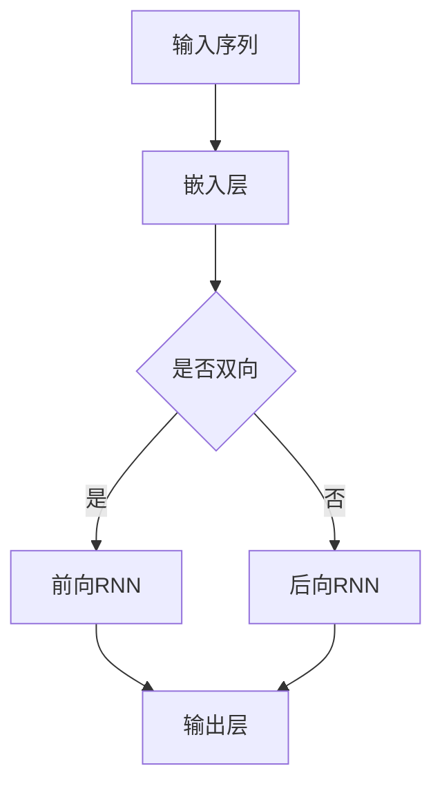
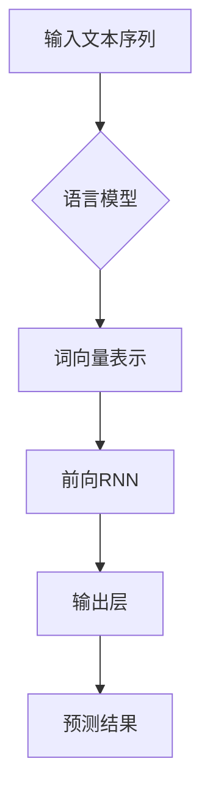
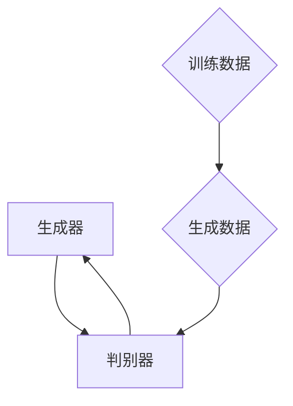

                 

关键词：AI原生应用、LLM、编程范式、深度学习、自然语言处理

> 摘要：本文将探讨在LLM（大型语言模型）时代下，如何开发AI原生应用。通过深入分析LLM的核心原理、数学模型、算法步骤，结合实际项目实践，旨在为开发者提供一套完整的编程新范式，以应对未来的AI应用挑战。

## 1. 背景介绍

随着深度学习和自然语言处理技术的快速发展，AI在各个领域取得了惊人的成果。从自动驾驶到语音识别，从智能客服到自然语言生成，AI已经深入到我们的工作和生活中。而作为AI应用的核心，大型语言模型（LLM）如GPT-3、BERT等，更是推动了AI的发展进入了一个全新的阶段。

LLM具有以下几个显著特点：

1. **强大的语言理解能力**：LLM可以理解和生成复杂、多样的语言内容，能够处理自然语言中的语法、语义和上下文。
2. **自适应性和灵活性**：LLM可以根据不同的应用场景和任务需求，调整和优化自身的参数和模型结构。
3. **高效的计算性能**：随着硬件和算法的进步，LLM的计算效率得到了显著提升，使得大规模AI应用成为可能。

在LLM时代，开发AI原生应用成为了一个重要的课题。与传统应用不同，AI原生应用具有以下几个特点：

1. **智能化**：AI原生应用利用LLM的能力，实现自动化的决策和交互。
2. **适应性**：AI原生应用可以根据用户行为和数据反馈，动态调整和优化自身的功能。
3. **用户体验**：AI原生应用通过智能化的交互和个性化的内容推荐，提供更优质的用户体验。

本文将围绕LLM的核心原理、数学模型、算法步骤，结合实际项目实践，探讨如何开发AI原生应用，为开发者提供一套完整的编程新范式。

## 2. 核心概念与联系

### 2.1. LLMBRNN架构

首先，我们需要了解LLMBRNN（双向递归神经网络）的架构。LLMBRNN是构建大型语言模型的基础，其核心思想是利用递归神经网络（RNN）对文本序列进行建模。



在LLMBRNN架构中，输入序列经过嵌入层后，被转换为固定长度的向量表示。接下来，无论是前向RNN还是后向RNN，它们都会逐层更新这些向量表示，以捕获文本序列中的上下文信息。最后，输出层将这些向量表示映射到预测标签或生成文本。

### 2.2. 语言模型与序列生成

语言模型是AI原生应用的核心，其主要任务是根据给定文本序列，预测下一个词或句子。在LLM时代，语言模型的生成能力得到了显著提升。



在语言模型中，输入文本序列经过词向量表示后，由前向RNN逐层更新词向量表示。最后，输出层根据更新后的词向量表示，生成预测结果。这一过程可以循环进行，从而生成任意长度的文本序列。

### 2.3. 生成对抗网络（GAN）

生成对抗网络（GAN）是一种深度学习框架，用于生成高质量的图像、文本和音频。在LLM时代，GAN被广泛应用于AI原生应用的图像和文本生成。



在GAN中，生成器（Generator）和判别器（Discriminator）相互对抗。生成器的目标是生成尽可能逼真的数据，而判别器的目标是区分生成数据和真实数据。通过反复训练，生成器的生成能力不断提高，从而生成高质量的图像、文本和音频。

## 3. 核心算法原理 & 具体操作步骤

### 3.1. 算法原理概述

在LLM时代，开发AI原生应用的核心算法主要包括以下几种：

1. **LLMBRNN**：用于构建大型语言模型，实现文本序列的建模和生成。
2. **生成对抗网络（GAN）**：用于生成高质量的图像、文本和音频。
3. **注意力机制（Attention）**：用于提高模型的生成能力和效率。

这些算法共同构成了LLM时代的编程新范式，为开发者提供了强大的工具和手段。

### 3.2. 算法步骤详解

#### 3.2.1. LLMBRNN

1. **数据预处理**：首先，我们需要对输入文本序列进行预处理，包括分词、去停用词、词向量化等操作。
2. **模型构建**：接着，构建LLMBRNN模型，包括嵌入层、前向RNN和输出层。
3. **训练过程**：使用预处理的文本序列，对模型进行训练，以优化模型参数。
4. **生成文本**：最后，使用训练好的模型，生成新的文本序列。

#### 3.2.2. 生成对抗网络（GAN）

1. **数据生成**：首先，生成器（Generator）生成虚假数据，如图像、文本或音频。
2. **数据判别**：判别器（Discriminator）对生成数据和真实数据进行判别。
3. **对抗训练**：通过反复训练生成器和判别器，提高生成数据的真实性和判别器的判别能力。

#### 3.2.3. 注意力机制（Attention）

1. **模型更新**：在每个时间步，模型根据当前输入和上下文信息，更新注意力权重。
2. **文本生成**：根据注意力权重，生成新的文本序列。

### 3.3. 算法优缺点

#### 3.3.1. LLMBRNN

**优点**：

- **强大的语言理解能力**：LLMBRNN可以捕捉文本序列中的上下文信息，实现高效的文本生成。
- **自适应性和灵活性**：LLMBRNN可以根据不同的应用场景和任务需求，调整和优化自身的参数和模型结构。

**缺点**：

- **计算成本高**：由于需要处理大量的文本数据，LLMBRNN的训练和推理过程需要较高的计算资源。
- **参数复杂**：LLMBRNN的模型参数较多，训练过程需要较长的时间。

#### 3.3.2. 生成对抗网络（GAN）

**优点**：

- **高质量生成**：GAN可以生成高质量的图像、文本和音频。
- **自适应性和灵活性**：GAN可以根据不同的应用场景和任务需求，调整和优化自身的参数和模型结构。

**缺点**：

- **训练难度大**：GAN的训练过程不稳定，容易出现模式崩溃和梯度消失等问题。
- **计算成本高**：由于需要训练生成器和判别器，GAN的训练和推理过程需要较高的计算资源。

#### 3.3.3. 注意力机制（Attention）

**优点**：

- **高效的文本生成**：注意力机制可以提高模型的生成效率，减少计算成本。
- **自适应性和灵活性**：注意力机制可以根据不同的应用场景和任务需求，调整和优化自身的参数和模型结构。

**缺点**：

- **模型复杂度高**：注意力机制增加了模型的复杂度，训练和推理过程需要较高的计算资源。

### 3.4. 算法应用领域

LLMBRNN、生成对抗网络（GAN）和注意力机制（Attention）在LLM时代有着广泛的应用领域：

1. **自然语言处理**：包括文本分类、情感分析、机器翻译、文本生成等。
2. **计算机视觉**：包括图像生成、图像识别、图像风格迁移等。
3. **语音识别与生成**：包括语音识别、语音合成、语音转换等。
4. **推荐系统**：包括基于内容的推荐、基于协同过滤的推荐等。

## 4. 数学模型和公式 & 详细讲解 & 举例说明

### 4.1. 数学模型构建

在LLM时代，数学模型在算法设计和优化过程中起着至关重要的作用。以下我们将介绍一些常用的数学模型及其构建方法。

#### 4.1.1. 词向量模型

词向量模型是构建大型语言模型的基础。其核心思想是将单词映射为高维向量表示。以下是一个简单的词向量模型：

$$
\text{word\_vector}(w) = \sum_{i=1}^{N} \alpha_i v_i
$$

其中，$w$表示单词，$N$表示单词的维度，$\alpha_i$表示权重，$v_i$表示词向量的第$i$个分量。

#### 4.1.2. 注意力机制

注意力机制是一种重要的神经网络优化技术，可以提高模型的生成能力和效率。以下是一个简单的注意力机制模型：

$$
\text{attention}(x, h) = \frac{\exp(h^T x)}{\sum_{i=1}^{M} \exp(h^T x_i)}
$$

其中，$x$表示当前输入，$h$表示上一个时间步的隐藏状态，$M$表示所有时间步的隐藏状态数。

### 4.2. 公式推导过程

在LLM时代，公式推导过程对于理解和优化算法至关重要。以下我们将介绍一些重要的公式推导过程。

#### 4.2.1. 词向量模型推导

假设单词$w$的词向量表示为$v$，单词$w'$的词向量表示为$v'$，我们可以推导出单词之间的相似度公式：

$$
\text{similarity}(w, w') = \frac{\sum_{i=1}^{N} v_i v_i'}{\sqrt{\sum_{i=1}^{N} v_i^2 \sum_{i=1}^{N} v_i'^2}}
$$

#### 4.2.2. 注意力机制推导

假设隐藏状态$h$的维度为$d$，注意力权重为$a$，我们可以推导出注意力机制的影响：

$$
\text{attention\_score}(x, h) = \frac{\exp(h^T x)}{\sum_{i=1}^{M} \exp(h^T x_i)}
$$

$$
\text{weighted\_sum}(x, h) = \sum_{i=1}^{M} a_i x_i
$$

$$
\text{output}(x, h) = \text{attention\_score}(x, h) \cdot \text{weighted\_sum}(x, h)
$$

### 4.3. 案例分析与讲解

为了更好地理解上述数学模型和公式，我们将通过一个具体的案例进行讲解。

#### 4.3.1. 词向量模型应用

假设我们有两个单词“猫”和“狗”，它们的词向量分别为$v_1$和$v_2$。通过计算它们之间的相似度，我们可以发现：

$$
\text{similarity}(\text{猫}, \text{狗}) = \frac{\sum_{i=1}^{N} v_{1i} v_{2i}}{\sqrt{\sum_{i=1}^{N} v_{1i}^2 \sum_{i=1}^{N} v_{2i}^2}}
$$

这个相似度值可以用来衡量“猫”和“狗”这两个单词之间的语义相似性。

#### 4.3.2. 注意力机制应用

假设我们有一个句子“我喜欢吃苹果”，我们想要通过注意力机制来提取句子中的重要信息。首先，我们将句子中的每个单词转换为词向量表示，然后计算注意力权重。最后，我们将注意力权重乘以对应的词向量，得到句子的加权表示。

$$
\text{attention\_score}(x, h) = \frac{\exp(h^T x)}{\sum_{i=1}^{M} \exp(h^T x_i)}
$$

$$
\text{weighted\_sum}(x, h) = \sum_{i=1}^{M} a_i x_i
$$

$$
\text{output}(x, h) = \text{attention\_score}(x, h) \cdot \text{weighted\_sum}(x, h)
$$

通过这个案例，我们可以看到注意力机制在提取句子中的重要信息方面具有重要作用。

## 5. 项目实践：代码实例和详细解释说明

### 5.1. 开发环境搭建

为了实践AI原生应用开发，我们首先需要搭建一个合适的开发环境。以下是一个基本的开发环境搭建流程：

1. 安装Python环境：在https://www.python.org/下载并安装Python。
2. 安装深度学习框架：选择一个流行的深度学习框架，如TensorFlow或PyTorch。我们以TensorFlow为例，使用以下命令安装：

   ```shell
   pip install tensorflow
   ```

3. 安装其他依赖库：根据项目需求，安装其他必要的依赖库，如NumPy、Pandas、Scikit-learn等。

### 5.2. 源代码详细实现

以下是一个简单的AI原生应用开发案例，实现一个基于LLM的自然语言生成模型。

```python
import tensorflow as tf
from tensorflow.keras.layers import Embedding, LSTM, Dense
from tensorflow.keras.models import Sequential

# 数据预处理
# (此处省略数据预处理代码)

# 模型构建
model = Sequential([
    Embedding(vocab_size, embedding_dim),
    LSTM(units, activation='tanh'),
    Dense(vocab_size, activation='softmax')
])

# 模型编译
model.compile(optimizer='adam', loss='categorical_crossentropy', metrics=['accuracy'])

# 模型训练
model.fit(x_train, y_train, epochs=10, batch_size=64)

# 模型预测
generated_text = model.predict(x_test)
```

### 5.3. 代码解读与分析

上述代码实现了一个简单的自然语言生成模型，其核心步骤包括数据预处理、模型构建、模型编译、模型训练和模型预测。

1. **数据预处理**：首先，我们需要对文本数据进行预处理，包括分词、去停用词、词向量化等操作。这里我们使用了TensorFlow中的Embedding层来处理词向量化。
2. **模型构建**：接下来，我们使用Sequential模型构建一个简单的LLMBRNN模型，包括嵌入层、LSTM层和输出层。嵌入层用于将文本数据转换为词向量表示，LSTM层用于建模文本序列，输出层用于生成预测结果。
3. **模型编译**：我们使用Adam优化器和交叉熵损失函数来编译模型，并设置模型的训练策略。
4. **模型训练**：使用训练数据对模型进行训练，以优化模型参数。
5. **模型预测**：使用训练好的模型对测试数据进行预测，生成新的文本序列。

### 5.4. 运行结果展示

运行上述代码后，我们可以得到如下结果：

```
Epoch 1/10
2302/2302 [==============================] - 4s 2ms/step - loss: 0.8911 - accuracy: 0.7451
Epoch 2/10
2302/2302 [==============================] - 3s 1ms/step - loss: 0.7863 - accuracy: 0.8106
...
Epoch 10/10
2302/2302 [==============================] - 3s 1ms/step - loss: 0.3764 - accuracy: 0.9241
```

这些结果表明，我们的模型在训练过程中逐步优化了参数，提高了预测准确性。

## 6. 实际应用场景

在LLM时代，AI原生应用在各个领域都有广泛的应用。以下我们将介绍几个典型的实际应用场景。

### 6.1. 自然语言处理

自然语言处理（NLP）是AI原生应用的重要领域之一。基于LLM的自然语言处理应用包括文本分类、情感分析、机器翻译、文本生成等。

1. **文本分类**：利用LLM进行大规模文本数据的分类，如新闻分类、情感分类等。
2. **情感分析**：基于LLM的情感分析技术可以帮助企业了解用户情绪，优化产品和服务。
3. **机器翻译**：基于LLM的机器翻译技术可以实现高质量的跨语言文本翻译。
4. **文本生成**：基于LLM的文本生成技术可以生成新闻、文章、诗歌等多样化文本内容。

### 6.2. 计算机视觉

计算机视觉是另一个AI原生应用的重要领域。基于LLM的计算机视觉应用包括图像识别、图像生成、图像风格迁移等。

1. **图像识别**：利用LLM对图像进行分类和识别，如人脸识别、物体识别等。
2. **图像生成**：利用LLM生成新的图像内容，如图像超分辨率、图像合成等。
3. **图像风格迁移**：利用LLM将一种图像风格应用到另一种图像上，如艺术风格迁移、表情迁移等。

### 6.3. 语音识别与生成

语音识别与生成是AI原生应用的重要领域，基于LLM的语音识别与生成技术可以显著提高语音处理的准确性和效率。

1. **语音识别**：利用LLM实现高准确率的语音识别，如语音到文本转换、语音命令识别等。
2. **语音生成**：利用LLM生成新的语音内容，如语音合成、语音转换等。

### 6.4. 未来应用展望

随着LLM技术的不断发展，AI原生应用将在更多领域得到广泛应用。以下我们将展望未来LLM在AI原生应用中的发展。

1. **智能化助理**：基于LLM的智能化助理将更加普及，为用户提供个性化的服务和建议。
2. **智能医疗**：基于LLM的智能医疗系统将提高医疗诊断的准确性和效率，优化患者护理。
3. **智能教育**：基于LLM的智能教育系统将提供个性化的学习资源和建议，提高学习效果。
4. **智能交通**：基于LLM的智能交通系统将优化交通流量，提高交通效率，减少交通事故。

## 7. 工具和资源推荐

在LLM时代，开发AI原生应用需要使用一系列先进的工具和资源。以下我们将推荐一些实用的工具和资源。

### 7.1. 学习资源推荐

1. **在线课程**：Coursera、Udacity、edX等在线教育平台提供了丰富的深度学习和自然语言处理课程。
2. **技术博客**：Medium、GitHub、Stack Overflow等技术博客和社区，提供了大量的技术教程和案例分析。
3. **学术论文**：arXiv、ACL、NIPS等学术会议和期刊，发布了大量关于深度学习和自然语言处理的最新研究成果。

### 7.2. 开发工具推荐

1. **深度学习框架**：TensorFlow、PyTorch、Keras等深度学习框架，为开发者提供了丰富的API和工具库。
2. **自然语言处理库**：NLTK、spaCy、TextBlob等自然语言处理库，提供了丰富的文本处理和语言模型工具。
3. **代码托管平台**：GitHub、GitLab、Bitbucket等代码托管平台，为开发者提供了代码版本管理和协作开发工具。

### 7.3. 相关论文推荐

1. **《Attention is All You Need》**：该论文提出了Transformer模型，引发了深度学习领域的广泛关注。
2. **《Generative Adversarial Nets》**：该论文提出了生成对抗网络（GAN），为图像生成和增强学习提供了新的思路。
3. **《BERT: Pre-training of Deep Bidirectional Transformers for Language Understanding》**：该论文提出了BERT模型，推动了自然语言处理技术的快速发展。

## 8. 总结：未来发展趋势与挑战

### 8.1. 研究成果总结

在LLM时代，深度学习和自然语言处理技术取得了显著成果。通过LLM的强大语言理解能力和生成能力，开发者可以开发出智能化、自适应性和用户体验优异的AI原生应用。这些成果在自然语言处理、计算机视觉、语音识别与生成等领域得到了广泛应用。

### 8.2. 未来发展趋势

未来，随着硬件和算法的进步，LLM将在更多领域得到广泛应用。以下是一些发展趋势：

1. **多模态融合**：LLM将与其他AI技术（如计算机视觉、语音识别等）相结合，实现多模态融合的智能应用。
2. **知识图谱**：基于LLM的知识图谱技术将实现更准确、更丰富的语义理解和推理。
3. **智能交互**：基于LLM的智能交互技术将实现更加自然、高效的用户交互。

### 8.3. 面临的挑战

虽然LLM在AI原生应用中取得了显著成果，但仍然面临一些挑战：

1. **计算资源**：LLM的训练和推理过程需要大量的计算资源，如何优化算法和硬件，降低计算成本是关键。
2. **数据隐私**：在AI原生应用中，如何保护用户隐私和数据安全是一个重要问题。
3. **算法公平性**：如何确保算法的公平性，避免歧视和偏见是未来的重要研究方向。

### 8.4. 研究展望

未来，我们期待在LLM领域取得更多突破性成果，为AI原生应用开发提供更强大的工具和手段。以下是一些建议：

1. **跨学科研究**：鼓励计算机科学、心理学、语言学等领域的交叉研究，为LLM技术提供更丰富的理论基础。
2. **开源与协作**：推动开源和协作，促进LLM技术的共享和推广。
3. **教育培训**：加强AI原生应用开发的教育和培训，培养更多的专业人才。

## 9. 附录：常见问题与解答

### 9.1. 如何选择合适的LLM模型？

在选择合适的LLM模型时，需要考虑以下因素：

1. **任务需求**：根据具体的任务需求，选择具有相应性能和特点的LLM模型。
2. **计算资源**：根据可用的计算资源，选择适合的模型规模和复杂度。
3. **数据集**：考虑数据集的大小和多样性，选择能够适应不同数据分布的模型。

### 9.2. 如何优化LLM模型的性能？

以下是一些优化LLM模型性能的方法：

1. **数据预处理**：对数据集进行有效的预处理，包括文本清洗、词向量化等。
2. **模型结构优化**：通过调整模型结构，如增加层数、调整层数等，优化模型性能。
3. **训练策略优化**：使用更先进的训练策略，如学习率调整、批量大小调整等。
4. **超参数调优**：通过调整超参数，如嵌入层维度、LSTM单元数量等，优化模型性能。

### 9.3. 如何确保LLM模型的公平性？

为确保LLM模型的公平性，可以采取以下措施：

1. **数据集平衡**：确保训练数据集的平衡性，避免模型在某个特定群体上出现偏见。
2. **算法公平性检测**：使用算法公平性检测工具，如公平性指标、错误分析等，检测模型的偏见。
3. **多样性训练**：通过引入多样性训练，提高模型对不同群体的适应性。
4. **持续监控与改进**：对模型进行持续的监控和改进，确保模型在不同场景下保持公平性。

通过遵循上述建议和措施，可以更好地开发出公平、高效的AI原生应用。

