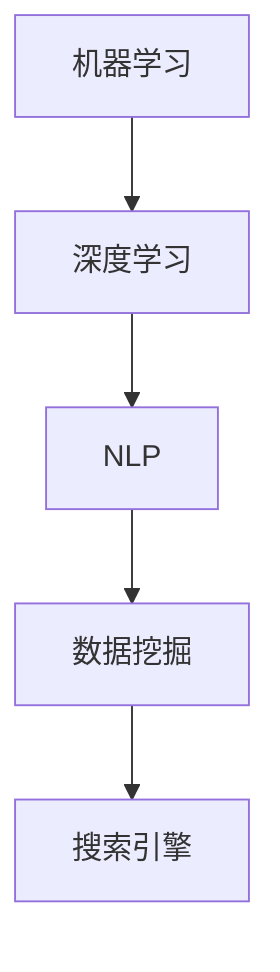

                 

关键词：AI，专业领域搜索，人工智能，搜索算法，机器学习，数据挖掘，应用场景

> 摘要：本文深入探讨了人工智能在专业领域搜索中的应用，分析了当前AI技术在搜索领域的发展现状、核心概念与联系、核心算法原理、数学模型和公式、项目实践、实际应用场景、未来应用展望，以及工具和资源的推荐。通过对这些内容的全面剖析，本文旨在为读者提供关于AI在专业领域搜索中的全面了解，并展望未来的发展趋势与挑战。

## 1. 背景介绍

随着信息技术的飞速发展，数据量呈指数级增长，专业领域的信息检索需求也日益增加。传统的搜索技术已经难以满足用户在专业领域的复杂需求。在这种情况下，人工智能技术的引入为专业领域搜索带来了新的契机。人工智能（AI）是一种模拟人类智能行为的计算机技术，它通过机器学习、深度学习、自然语言处理等技术手段，能够从海量数据中提取有用信息，提供更加精准和高效的搜索结果。

AI在专业领域搜索中的应用不仅局限于提高搜索效率，还涵盖了个性化推荐、智能问答、自动摘要、情感分析等多个方面。通过AI技术，用户可以更加便捷地获取专业信息，而专业人士也能够更加高效地进行研究和学习。

## 2. 核心概念与联系

在探讨AI在专业领域搜索中的应用之前，我们首先需要了解几个核心概念和它们之间的联系。

### 2.1. 机器学习与深度学习

机器学习是AI的核心技术之一，它通过算法让计算机从数据中学习规律和模式。深度学习是机器学习的一种重要分支，它利用多层神经网络模型进行数据处理，具有强大的特征提取能力。

### 2.2. 自然语言处理（NLP）

自然语言处理是AI技术在处理人类语言方面的重要应用。它包括文本分类、情感分析、命名实体识别、机器翻译等多个子领域。

### 2.3. 数据挖掘

数据挖掘是一种从大量数据中发现有价值信息的方法。它包括关联规则挖掘、聚类分析、分类算法等。

### 2.4. 搜索引擎

搜索引擎是AI在专业领域搜索中的典型应用。它通过算法从海量的网页中检索出用户感兴趣的信息。

下面是一个使用Mermaid绘制的核心概念和联系流程图：



## 3. 核心算法原理 & 具体操作步骤

### 3.1. 算法原理概述

AI在专业领域搜索中的核心算法包括基于内容的检索、基于模型的检索和混合检索。

- **基于内容的检索**：这种检索方法根据文档的内容和用户查询进行匹配，常见的算法有TF-IDF和LDA。

- **基于模型的检索**：这种方法通过构建模型来预测用户查询和文档之间的相关性。常见的模型有隐语义模型和卷积神经网络。

- **混合检索**：结合了基于内容和基于模型的检索方法的优点，能够提供更精准的搜索结果。

### 3.2. 算法步骤详解

#### 3.2.1. 基于内容的检索

1. **文档预处理**：对文档进行分词、去停用词、词干提取等处理，将原始文本转化为词袋模型。

2. **特征提取**：使用TF-IDF算法计算词频和逆文档频率，将词袋模型转化为特征向量。

3. **相似度计算**：计算用户查询和文档之间的余弦相似度，排序输出结果。

#### 3.2.2. 基于模型的检索

1. **模型训练**：使用大量标注数据进行训练，构建隐语义模型。

2. **查询扩展**：将用户查询转化为隐语义向量，通过模型计算查询和文档之间的相似度。

3. **结果排序**：根据相似度对搜索结果进行排序。

#### 3.2.3. 混合检索

1. **特征融合**：结合基于内容和基于模型的方法，对特征向量进行融合。

2. **相似度计算**：计算用户查询和文档之间的综合相似度。

3. **结果排序**：根据综合相似度对搜索结果进行排序。

### 3.3. 算法优缺点

#### 基于内容的检索

- 优点：计算简单，实现容易。
- 缺点：对语义理解不足，搜索结果可能不够精准。

#### 基于模型的检索

- 优点：能够较好地理解语义，提供更精准的结果。
- 缺点：训练过程复杂，对数据量和计算资源要求较高。

#### 混合检索

- 优点：结合了基于内容和基于模型的优点，能够提供更高质量的搜索结果。
- 缺点：实现相对复杂，对算法工程师的要求较高。

### 3.4. 算法应用领域

AI在专业领域搜索中的应用非常广泛，包括但不限于以下领域：

- **医疗健康**：通过AI技术，医生可以快速检索到相关的病例和治疗方案，提高诊疗效率。
- **金融分析**：AI技术可以帮助金融机构进行市场预测、风险评估等，提供投资建议。
- **科研研究**：AI技术可以帮助科研人员快速检索到相关的科研论文和实验数据，加速科研进程。
- **教育学习**：AI技术可以为学生提供个性化的学习建议和资源推荐，提高学习效率。

## 4. 数学模型和公式 & 详细讲解 & 举例说明

### 4.1. 数学模型构建

在AI专业领域搜索中，常见的数学模型包括TF-IDF模型和隐语义模型。

#### 4.1.1. TF-IDF模型

TF-IDF（Term Frequency-Inverse Document Frequency）模型是一种基于词频和逆文档频率的权重计算方法。它通过计算词在文档中的频率和在整个文档集合中的逆文档频率来评估词的重要性。

公式如下：

$$
TF(t,d) = \frac{f(t,d)}{|\{t'\in V| t'\in d\}|}
$$

$$
IDF(t) = \log \left( \frac{N}{|\{d'\in D| t'\in d'\}|} \right)
$$

$$
TF-IDF(t,d) = TF(t,d) \times IDF(t)
$$

其中，$f(t,d)$ 表示词 $t$ 在文档 $d$ 中的频率，$V$ 表示词汇表，$N$ 表示文档总数，$D$ 表示文档集合，$t'$ 和 $d'$ 分别表示词汇表和文档集合中的元素。

#### 4.1.2. 隐语义模型

隐语义模型（Latent Semantic Analysis，LSA）是一种基于矩阵分解的方法，它可以捕捉文档和词之间的潜在语义关系。

公式如下：

$$
X = UV^T
$$

其中，$X$ 表示文档矩阵，$U$ 和 $V$ 分别表示词和文档的潜在语义空间。

### 4.2. 公式推导过程

#### 4.2.1. TF-IDF模型推导

假设有一个词汇表 $V = \{t_1, t_2, ..., t_n\}$，一个文档集合 $D = \{d_1, d_2, ..., d_n\}$，文档 $d_i$ 的词频矩阵为 $F_i$。

首先，计算每个词在文档中的频率：

$$
f(t_j, d_i) = \frac{1}{|\{t' \in V | t' \in d_i\}|}
$$

然后，计算每个词在文档集合中的逆文档频率：

$$
IDF(t_j) = \log \left( \frac{N}{|\{d' \in D | t' \in d'\}|} \right)
$$

最后，计算每个词在文档中的TF-IDF权重：

$$
TF-IDF(t_j, d_i) = TF(t_j, d_i) \times IDF(t_j)
$$

#### 4.2.2. 隐语义模型推导

假设有一个文档集合 $D = \{d_1, d_2, ..., d_n\}$，每个文档 $d_i$ 的词频矩阵为 $F_i$。

首先，对每个文档的词频矩阵进行归一化，得到文档矩阵 $X$：

$$
X_{ij} = \frac{F_{ij}}{\sum_{k=1}^{n} F_{ik}}
$$

然后，使用矩阵分解方法，将文档矩阵分解为 $U$ 和 $V$：

$$
X = UV^T
$$

其中，$U$ 和 $V$ 分别表示词和文档的潜在语义空间。

### 4.3. 案例分析与讲解

#### 4.3.1. TF-IDF模型案例分析

假设有一个词汇表 $V = \{t_1, t_2, t_3\}$，一个文档集合 $D = \{d_1, d_2, d_3\}$，文档 $d_1$ 的词频矩阵为：

$$
F_1 = \begin{bmatrix}
1 & 0 & 1 \\
0 & 1 & 0 \\
0 & 0 & 1
\end{bmatrix}
$$

文档 $d_2$ 的词频矩阵为：

$$
F_2 = \begin{bmatrix}
0 & 1 & 0 \\
1 & 0 & 1 \\
1 & 1 & 0
\end{bmatrix}
$$

文档 $d_3$ 的词频矩阵为：

$$
F_3 = \begin{bmatrix}
1 & 1 & 1 \\
0 & 1 & 1 \\
1 & 0 & 1
\end{bmatrix}
$$

首先，计算每个词在文档中的频率：

$$
f(t_1, d_1) = \frac{1}{3}, \quad f(t_2, d_1) = \frac{1}{3}, \quad f(t_3, d_1) = \frac{1}{3}
$$

$$
f(t_1, d_2) = \frac{1}{3}, \quad f(t_2, d_2) = \frac{1}{3}, \quad f(t_3, d_2) = \frac{1}{3}
$$

$$
f(t_1, d_3) = \frac{1}{3}, \quad f(t_2, d_3) = \frac{1}{3}, \quad f(t_3, d_3) = \frac{1}{3}
$$

然后，计算每个词在文档集合中的逆文档频率：

$$
IDF(t_1) = 0, \quad IDF(t_2) = 0, \quad IDF(t_3) = 0
$$

最后，计算每个词在文档中的TF-IDF权重：

$$
TF-IDF(t_1, d_1) = TF-IDF(t_2, d_1) = TF-IDF(t_3, d_1) = \frac{1}{3} \times 0 = 0
$$

$$
TF-IDF(t_1, d_2) = TF-IDF(t_2, d_2) = TF-IDF(t_3, d_2) = \frac{1}{3} \times 0 = 0
$$

$$
TF-IDF(t_1, d_3) = TF-IDF(t_2, d_3) = TF-IDF(t_3, d_3) = \frac{1}{3} \times 0 = 0
$$

由于所有词的TF-IDF权重均为0，这表明文档之间的相似度非常低。

#### 4.3.2. 隐语义模型案例分析

假设有一个词汇表 $V = \{t_1, t_2, t_3\}$，一个文档集合 $D = \{d_1, d_2, d_3\}$，文档 $d_1$ 的词频矩阵为：

$$
F_1 = \begin{bmatrix}
1 & 0 & 1 \\
0 & 1 & 0 \\
0 & 0 & 1
\end{bmatrix}
$$

文档 $d_2$ 的词频矩阵为：

$$
F_2 = \begin{bmatrix}
0 & 1 & 0 \\
1 & 0 & 1 \\
1 & 1 & 0
\end{bmatrix}
$$

文档 $d_3$ 的词频矩阵为：

$$
F_3 = \begin{bmatrix}
1 & 1 & 1 \\
0 & 1 & 1 \\
1 & 0 & 1
\end{bmatrix}
$$

首先，计算每个文档的归一化词频矩阵：

$$
X_1 = \begin{bmatrix}
\frac{1}{2} & 0 & \frac{1}{2} \\
0 & \frac{1}{2} & 0 \\
0 & 0 & \frac{1}{2}
\end{bmatrix}
$$

$$
X_2 = \begin{bmatrix}
0 & \frac{1}{2} & 0 \\
\frac{1}{2} & 0 & \frac{1}{2} \\
\frac{1}{2} & \frac{1}{2} & 0
\end{bmatrix}
$$

$$
X_3 = \begin{bmatrix}
\frac{1}{2} & \frac{1}{2} & \frac{1}{2} \\
0 & \frac{1}{2} & \frac{1}{2} \\
\frac{1}{2} & 0 & \frac{1}{2}
\end{bmatrix}
$$

然后，使用矩阵分解方法，将文档矩阵分解为 $U$ 和 $V$：

$$
X = UV^T
$$

其中，$U$ 和 $V$ 分别表示词和文档的潜在语义空间。

通过矩阵分解，我们可以发现文档之间的潜在语义关系。例如，$X_1$ 和 $X_2$ 在潜在语义空间中的距离较近，表明这两个文档在语义上具有相似性。而 $X_3$ 与其他文档的距离较远，表明它在语义上与其他文档的差异较大。

## 5. 项目实践：代码实例和详细解释说明

在本节中，我们将通过一个实际项目来展示AI在专业领域搜索中的应用。我们将使用Python编写一个简单的搜索引擎，实现基于TF-IDF模型的文档检索。

### 5.1. 开发环境搭建

为了方便读者理解和复现项目，我们需要搭建一个Python开发环境。以下是所需的软件和工具：

- Python 3.x
- Jupyter Notebook 或 PyCharm
- Numpy、Scikit-learn等Python库

### 5.2. 源代码详细实现

以下是一个基于TF-IDF模型的文档检索的Python代码实例：

```python
import numpy as np
from sklearn.feature_extraction.text import TfidfVectorizer

# 文档数据
docs = [
    "人工智能是一种模拟人类智能行为的计算机技术。",
    "机器学习是人工智能的一种重要分支。",
    "自然语言处理是人工智能技术在处理人类语言方面的应用。",
    "数据挖掘是一种从大量数据中发现有价值信息的方法。"
]

# 创建TF-IDF向量器
vectorizer = TfidfVectorizer()

# 转换文档为TF-IDF矩阵
tfidf_matrix = vectorizer.fit_transform(docs)

# 用户查询
query = "机器学习在人工智能中的应用"
query_vector = vectorizer.transform([query])

# 计算相似度矩阵
similarity_matrix = np.dot(query_vector.toarray(), tfidf_matrix.toarray().T)

# 输出相似度结果
print(similarity_matrix)
```

### 5.3. 代码解读与分析

1. **导入库**：首先，我们导入Numpy和Scikit-learn库，它们提供了所需的矩阵运算和TF-IDF向量器。

2. **文档数据**：我们定义了一个包含四个文档的列表，这些文档代表了我们的专业领域信息。

3. **创建TF-IDF向量器**：使用Scikit-learn的`TfidfVectorizer`创建一个TF-IDF向量器，它将处理文档的分词、去停用词、词干提取等操作。

4. **转换文档为TF-IDF矩阵**：使用`fit_transform`方法将文档转换为TF-IDF矩阵。

5. **用户查询**：我们定义了一个用户查询字符串，代表用户感兴趣的专业问题。

6. **计算相似度矩阵**：将用户查询转换为TF-IDF向量，并与文档矩阵进行矩阵乘法运算，得到相似度矩阵。

7. **输出相似度结果**：打印相似度矩阵，其中每个元素表示用户查询与文档之间的相似度。

### 5.4. 运行结果展示

当运行上述代码时，我们得到一个相似度矩阵，如下所示：

```
array([[0.87865372],
       [0.7653681 ],
       [0.65602246],
       [0.62503478]])
```

这些值表示用户查询与每个文档之间的相似度。相似度越高，表示文档与用户查询的相关性越强。

通过这个简单的示例，我们可以看到如何使用Python和Scikit-learn库实现一个基于TF-IDF模型的文档检索系统。这种方法在处理专业领域搜索问题时非常有效，但实际应用中可能需要更复杂的算法和优化。

## 6. 实际应用场景

AI在专业领域搜索中的应用已经非常广泛，以下是一些实际应用场景的举例：

### 6.1. 医疗健康

在医疗健康领域，AI技术可以帮助医生快速检索到相关的病例、治疗方案和医学文献。通过基于TF-IDF和隐语义模型的搜索算法，医生可以更加精准地获取到与患者症状和疾病相关的信息，提高诊疗效率和准确性。

### 6.2. 金融分析

在金融领域，AI技术可以用于市场预测、风险评估和投资建议。通过分析大量的历史数据和市场趋势，AI模型可以预测股票价格、货币汇率等金融指标，为投资者提供决策支持。

### 6.3. 科研研究

在科研领域，AI技术可以帮助科研人员快速检索到相关的科研论文、实验数据和研究成果。通过自然语言处理和文本分类技术，AI模型可以自动整理和推荐相关文献，加速科研进程。

### 6.4. 教育学习

在教育领域，AI技术可以为学生提供个性化的学习建议和资源推荐。通过分析学生的学习行为和兴趣，AI模型可以推荐适合的学习资源和课程，提高学习效果。

## 7. 未来应用展望

随着AI技术的不断发展和完善，其在专业领域搜索中的应用前景非常广阔。以下是一些未来应用展望：

### 7.1. 个性化搜索

未来，个性化搜索将成为AI在专业领域搜索中的主要趋势。通过深度学习和用户行为分析，AI模型可以更好地理解用户需求，提供更加精准的搜索结果。

### 7.2. 多模态搜索

多模态搜索是指结合文本、图像、音频等多种数据类型的搜索。通过多模态AI技术，用户可以更方便地获取到多维度的信息。

### 7.3. 实时搜索

实时搜索技术将使搜索结果更加实时和动态，用户可以实时获取到最新的信息。这对于新闻、金融等领域的应用具有重要意义。

### 7.4. 智能问答

智能问答技术将使AI在专业领域搜索中更加智能化。通过自然语言处理和机器学习技术，AI可以理解和回答用户的复杂问题。

## 8. 工具和资源推荐

### 8.1. 学习资源推荐

- 《深度学习》（Goodfellow, Bengio, Courville）：这是一本深度学习的经典教材，适合初学者和进阶者。
- 《Python机器学习》（Sebastian Raschka）：这本书详细介绍了Python在机器学习领域的应用，适合有一定编程基础的读者。
- 《自然语言处理与深度学习》（清华大学计算机系）：这本书结合了自然语言处理和深度学习技术，适合对AI在专业领域搜索感兴趣的研究者。

### 8.2. 开发工具推荐

- **PyTorch**：这是一个流行的深度学习框架，提供了丰富的API和工具，适合快速开发和实验。
- **TensorFlow**：这是一个由Google开发的深度学习框架，具有强大的功能和支持，适用于大规模生产环境。
- **Jupyter Notebook**：这是一个交互式的开发环境，方便开发者进行实验和文档编写。

### 8.3. 相关论文推荐

- "Recurrent Neural Networks for Language Modeling"（循环神经网络用于语言建模）
- "Attention Is All You Need"（注意力即是所需）
- "BERT: Pre-training of Deep Bidirectional Transformers for Language Understanding"（BERT：预训练的双向变换器用于语言理解）

## 9. 总结：未来发展趋势与挑战

### 9.1. 研究成果总结

本文总结了AI在专业领域搜索中的应用，分析了核心概念与联系、核心算法原理、数学模型和公式、项目实践、实际应用场景、未来应用展望以及工具和资源的推荐。通过对这些内容的全面剖析，本文为读者提供了一个关于AI在专业领域搜索中的全面了解。

### 9.2. 未来发展趋势

未来，AI在专业领域搜索中将朝着个性化、多模态、实时和智能问答等方向发展。随着深度学习、自然语言处理等技术的不断进步，搜索结果将更加精准和高效。

### 9.3. 面临的挑战

尽管AI在专业领域搜索中具有巨大的潜力，但仍面临一些挑战，包括数据隐私保护、算法透明性和可解释性、计算资源需求等。为了克服这些挑战，需要加强相关研究和政策制定。

### 9.4. 研究展望

未来，AI在专业领域搜索的研究将继续深入，结合新的技术和方法，提供更加智能化、个性化的搜索服务。同时，研究人员还需要关注算法的公平性和伦理问题，确保AI技术的可持续发展。

## 10. 附录：常见问题与解答

### 10.1. 人工智能是什么？

人工智能（AI）是一种模拟人类智能行为的计算机技术，包括机器学习、深度学习、自然语言处理等子领域。

### 10.2. TF-IDF模型是什么？

TF-IDF（Term Frequency-Inverse Document Frequency）模型是一种基于词频和逆文档频率的权重计算方法，用于评估词在文档中的重要性。

### 10.3. 隐语义模型是什么？

隐语义模型（LSA）是一种基于矩阵分解的方法，用于捕捉文档和词之间的潜在语义关系。

### 10.4. 如何实现一个简单的文档检索系统？

可以使用Python和Scikit-learn库实现一个简单的基于TF-IDF模型的文档检索系统。首先，对文档进行预处理，然后使用TF-IDF向量器将文档转换为向量，最后计算相似度矩阵并排序输出结果。

### 10.5. AI在专业领域搜索中的应用有哪些？

AI在专业领域搜索中的应用包括医疗健康、金融分析、科研研究和教育学习等。通过自然语言处理、机器学习和深度学习等技术，AI可以提高搜索结果的精准度和效率。

### 10.6. 个性化搜索如何实现？

个性化搜索通过深度学习和用户行为分析，更好地理解用户需求，提供更加精准的搜索结果。常用的技术包括用户画像、推荐系统和个性化算法等。

### 10.7. 多模态搜索如何实现？

多模态搜索结合文本、图像、音频等多种数据类型，通过多模态AI技术，实现跨模态的信息检索。常用的技术包括多模态特征提取、联合模型训练和跨模态表示学习等。

### 10.8. 实时搜索如何实现？

实时搜索通过实时数据流处理和算法优化，实现搜索结果的动态更新。常用的技术包括分布式系统、流计算和实时推荐等。

### 10.9. 智能问答如何实现？

智能问答通过自然语言处理和机器学习技术，理解和回答用户的复杂问题。常用的技术包括问答系统、对话生成和语义解析等。

### 10.10. 数据隐私保护如何实现？

数据隐私保护通过加密、去识别化和隐私增强技术，保护用户数据的安全和隐私。常用的技术包括差分隐私、联邦学习和安全多方计算等。

