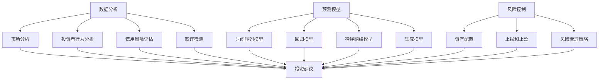

                 

关键词：人工智能，个人理财，投资建议，数据分析，预测模型，风险控制

> 摘要：随着人工智能技术的快速发展，其在金融领域的应用越来越广泛。本文将探讨人工智能在个人理财中的应用，特别是智能投资建议方面的研究。通过分析投资决策的复杂性，介绍相关核心概念和算法原理，并结合实际案例，阐述人工智能如何提高个人投资效率与收益。

## 1. 背景介绍

随着互联网和大数据技术的普及，个人理财已成为越来越多人的关注焦点。然而，投资决策的复杂性使得许多人在做出理性选择时面临困难。传统的投资建议往往依赖于历史数据和经验分析，但这些方法在处理海量数据和动态市场变化时存在局限性。人工智能技术的发展为解决这一问题提供了新的思路。

人工智能在金融领域的应用已经取得了一系列成果，特别是在股票市场预测、信用风险评估和金融欺诈检测等方面。近年来，人工智能在个人理财中的应用也逐渐引起关注，特别是在提供智能投资建议方面。本文旨在探讨人工智能如何通过数据分析、预测模型和风险控制等技术手段，为个人投资者提供更加精准和高效的理财服务。

### 人工智能的发展历程

人工智能（AI）的发展经历了几个关键阶段。最初，AI主要集中在规则推理和知识表示上，如专家系统和逻辑推理机。然而，这些方法在处理复杂问题时表现不佳，难以实现通用人工智能。随着计算机性能的不断提高和数据量的激增，机器学习尤其是深度学习成为了AI研究的热点。

深度学习通过模拟人脑神经网络结构，通过大量数据训练模型，从而实现从数据中学习规律和模式。近年来，深度学习在图像识别、自然语言处理和语音识别等领域取得了显著进展，也为其在金融领域的应用提供了坚实基础。

### 人工智能在金融领域的应用

人工智能在金融领域有着广泛的应用。在股票市场预测方面，AI可以通过分析历史价格、交易量和新闻文章等数据，预测未来市场走势。在信用风险评估方面，AI可以通过分析借款人的历史信用记录、社会关系和在线行为，评估其信用风险。在金融欺诈检测方面，AI可以通过监测异常交易模式和用户行为，发现潜在的欺诈行为。

尽管人工智能在金融领域的应用取得了显著成果，但其也面临着一些挑战。例如，数据隐私和安全问题是人工智能在金融领域应用的重要关注点。此外，AI模型的透明性和可解释性也是一个亟待解决的问题。为了解决这些问题，研究人员正在探索更安全、更透明的AI技术，如联邦学习、区块链和可解释AI等。

### 个人理财的需求

个人理财是一个涉及广泛领域的活动，包括投资、储蓄、支出规划、退休规划等。随着人们生活水平的提高和金融市场的不断成熟，个人理财的需求也越来越多样化。以下是一些常见的个人理财需求：

1. **投资决策**：个人投资者需要根据自身的风险承受能力和投资目标，选择适合自己的投资产品。然而，市场行情复杂多变，投资者往往难以准确预测市场走势。
   
2. **风险控制**：投资者需要管理投资组合的风险，确保资金安全。然而，传统的风险控制方法往往具有一定的局限性，难以适应市场变化。

3. **资产配置**：投资者需要根据自身的财务状况和投资目标，合理配置资产，以实现收益最大化。然而，资产配置涉及到众多复杂的因素，投资者往往难以做出最优决策。

4. **支出规划**：投资者需要合理规划日常支出，确保生活品质的同时，为未来的投资和储蓄提供资金。然而，支出规划需要考虑多种因素，如家庭开支、子女教育、医疗费用等。

5. **退休规划**：随着人均寿命的提高，退休规划成为个人理财的重要一环。投资者需要确保在退休后有足够的资金支持生活。

综上所述，个人理财的复杂性使得投资者在做出决策时面临诸多挑战。人工智能技术的发展为解决这些问题提供了新的思路和工具。本文将详细介绍人工智能在个人理财中的应用，特别是智能投资建议方面的研究，以期为个人投资者提供有益的参考。

## 2. 核心概念与联系

在探讨人工智能在个人理财中的应用之前，我们需要了解一些核心概念和联系。这些概念包括数据分析、预测模型和风险控制等，它们是构建智能投资建议系统的基础。

### 数据分析

数据分析是人工智能在个人理财中应用的核心技术之一。它通过收集、处理和分析海量数据，从中提取有价值的信息和知识。在个人理财中，数据分析可用于以下几个方面：

1. **市场分析**：通过分析历史价格、交易量、新闻文章等数据，预测市场走势。
   
2. **投资者行为分析**：通过分析投资者的交易记录、投资偏好等数据，了解投资者的风险承受能力和投资策略。

3. **信用风险评估**：通过分析借款人的历史信用记录、社会关系和在线行为，评估其信用风险。

4. **欺诈检测**：通过监测交易模式和用户行为，发现潜在的欺诈行为。

### 预测模型

预测模型是人工智能在个人理财中的应用基础。通过训练数据集，预测模型可以学习到市场规律和趋势，从而为投资者提供投资建议。常见的预测模型包括：

1. **时间序列模型**：如ARIMA、LSTM等，用于预测市场的短期走势。
   
2. **回归模型**：如线性回归、逻辑回归等，用于预测市场趋势和风险。

3. **神经网络模型**：如CNN、RNN等，用于处理复杂的市场数据和挖掘潜在的市场规律。

4. **集成模型**：如随机森林、梯度提升机等，通过结合多种模型的优势，提高预测准确性。

### 风险控制

风险控制是个人理财中不可或缺的一环。通过评估投资风险，投资者可以采取相应的风险控制措施，确保资金安全。风险控制方法包括：

1. **资产配置**：通过分散投资，降低单一资产的风险。
   
2. **止损和止盈**：通过设定止损和止盈点，控制投资风险。

3. **风险管理策略**：如动态调整投资组合、对冲策略等，以应对市场变化。

### Mermaid 流程图

为了更好地展示核心概念和联系，我们使用Mermaid绘制了一个流程图：



通过这个流程图，我们可以清晰地看到数据分析、预测模型和风险控制之间的联系，以及它们如何共同为投资者提供智能投资建议。

### 核心概念和联系的解释

1. **数据分析**：数据分析是利用统计、机器学习等方法，从数据中提取有价值的信息和知识。在个人理财中，数据分析可用于市场分析、投资者行为分析、信用风险评估和欺诈检测等方面。

2. **预测模型**：预测模型是通过训练数据集，学习市场规律和趋势，从而为投资者提供投资建议。常见的预测模型包括时间序列模型、回归模型、神经网络模型和集成模型等。

3. **风险控制**：风险控制是评估投资风险，并采取相应的风险控制措施，确保资金安全。风险控制方法包括资产配置、止损和止盈、风险管理策略等。

通过上述核心概念和联系的解释，我们可以更好地理解人工智能在个人理财中的应用。接下来，我们将深入探讨人工智能如何通过核心算法原理，提高个人投资效率与收益。

## 3. 核心算法原理 & 具体操作步骤

在个人理财中，人工智能的核心算法主要包括数据分析、预测模型和风险控制。这些算法通过处理海量数据，学习市场规律，为投资者提供智能投资建议。下面将详细介绍这些核心算法的原理和具体操作步骤。

### 3.1 算法原理概述

#### 数据分析

数据分析是人工智能在个人理财中的基础。它通过收集、处理和分析海量数据，从中提取有价值的信息和知识。数据分析的基本原理包括以下几个方面：

1. **数据收集**：从各种数据源收集相关数据，如历史价格、交易量、新闻文章等。

2. **数据预处理**：对收集到的数据进行清洗、去重、标准化等处理，确保数据质量。

3. **特征提取**：从预处理后的数据中提取特征，如价格趋势、交易量变化、新闻关键词等。

4. **数据挖掘**：利用统计、机器学习等方法，从特征数据中挖掘潜在的信息和知识。

#### 预测模型

预测模型是人工智能在个人理财中的核心。它通过训练数据集，学习市场规律和趋势，从而为投资者提供投资建议。预测模型的基本原理包括以下几个方面：

1. **模型选择**：根据数据特性和需求，选择合适的预测模型，如时间序列模型、回归模型、神经网络模型等。

2. **模型训练**：使用历史数据集对预测模型进行训练，使其学会识别市场规律。

3. **模型评估**：使用验证数据集对训练好的模型进行评估，调整模型参数，提高预测准确性。

4. **模型应用**：将训练好的模型应用到实际投资中，为投资者提供投资建议。

#### 风险控制

风险控制是个人理财中不可或缺的一环。它通过评估投资风险，并采取相应的风险控制措施，确保资金安全。风险控制的基本原理包括以下几个方面：

1. **风险评估**：评估投资组合的风险，如波动率、相关性等。

2. **风险控制策略**：根据风险评估结果，制定相应的风险控制策略，如资产配置、止损和止盈、对冲策略等。

3. **风险监控**：实时监控投资组合的风险，及时调整风险控制措施。

### 3.2 算法步骤详解

#### 数据分析

1. **数据收集**：从历史数据源、新闻网站、社交媒体等渠道收集相关数据。

2. **数据预处理**：
    ```mermaid
    graph TD
        A[数据收集] --> B[数据清洗]
        B --> C[去重]
        C --> D[标准化]
        D --> E[特征提取]
    ```

3. **特征提取**：提取与投资相关的特征，如价格趋势、交易量变化、新闻关键词等。

4. **数据挖掘**：
    ```mermaid
    graph TD
        A[特征数据] --> B[统计分析]
        B --> C[机器学习]
        C --> D[数据可视化]
    ```

#### 预测模型

1. **模型选择**：根据数据特性和需求，选择合适的时间序列模型、回归模型、神经网络模型等。

2. **模型训练**：
    ```mermaid
    graph TD
        A[模型选择] --> B[数据集划分]
        B --> C[模型训练]
        C --> D[参数调优]
    ```

3. **模型评估**：
    ```mermaid
    graph TD
        A[模型训练] --> B[验证集评估]
        B --> C[测试集评估]
    ```

4. **模型应用**：将训练好的模型应用到实际投资中，为投资者提供投资建议。

#### 风险控制

1. **风险评估**：计算投资组合的波动率、相关性等指标，评估投资组合的风险。

2. **风险控制策略**：
    ```mermaid
    graph TD
        A[风险评估] --> B[资产配置]
        B --> C[止损和止盈]
        C --> D[对冲策略]
    ```

3. **风险监控**：实时监控投资组合的风险，及时调整风险控制措施。

### 3.3 算法优缺点

#### 数据分析

**优点**：
- 提高数据分析的效率和准确性。
- 发现潜在的投资机会和风险。

**缺点**：
- 数据质量和完整性可能影响分析结果。
- 特征提取和模型选择需要专业知识。

#### 预测模型

**优点**：
- 提高投资决策的科学性和准确性。
- 跟踪市场动态，及时调整投资策略。

**缺点**：
- 模型训练和评估需要大量时间和计算资源。
- 预测结果可能受到噪声数据和异常值的影响。

#### 风险控制

**优点**：
- 有效管理投资组合风险，确保资金安全。
- 及时调整风险控制策略，应对市场变化。

**缺点**：
- 风险评估需要准确的数据和模型。
- 风险控制策略可能限制投资回报。

### 3.4 算法应用领域

数据分析、预测模型和风险控制技术在个人理财中的应用广泛，包括以下几个方面：

1. **投资建议**：为投资者提供基于数据分析和市场预测的投资建议。
   
2. **风险控制**：评估投资组合风险，采取相应的风险控制措施。

3. **资产配置**：根据投资者的风险承受能力和投资目标，合理配置资产。

4. **市场预测**：预测市场走势，为投资者提供投资时机。

5. **欺诈检测**：监测交易模式和用户行为，发现潜在的欺诈行为。

通过上述核心算法原理和具体操作步骤的介绍，我们可以看到人工智能在个人理财中的应用潜力。接下来，我们将进一步探讨数学模型和公式，以帮助读者更深入地理解智能投资建议系统的构建。

### 4. 数学模型和公式 & 详细讲解 & 举例说明

在智能投资建议系统中，数学模型和公式扮演着至关重要的角色。这些模型和公式用于描述市场动态、评估投资风险以及制定投资策略。下面我们将详细介绍一些关键的数学模型和公式，并通过具体案例进行讲解。

#### 4.1 数学模型构建

数学模型是智能投资建议系统的核心。它通过捕捉市场数据中的规律和关系，为投资决策提供理论依据。以下是一些常用的数学模型：

1. **时间序列模型**：用于分析时间序列数据，如ARIMA、LSTM等。
   
2. **回归模型**：用于预测变量之间的线性或非线性关系，如线性回归、逻辑回归等。

3. **神经网络模型**：用于处理复杂的数据结构和模式，如CNN、RNN等。

4. **风险管理模型**：用于评估投资组合的风险，如VaR、CVaR等。

#### 4.2 公式推导过程

为了更好地理解这些数学模型和公式，我们首先需要了解一些基本概念和公式。以下是一些重要的公式：

1. **时间序列模型公式**：

   ARIMA模型公式：
   $$X_t = c + \phi_1 X_{t-1} + \phi_2 X_{t-2} + \cdots + \phi_p X_{t-p} + \theta_1 \varepsilon_{t-1} + \theta_2 \varepsilon_{t-2} + \cdots + \theta_q \varepsilon_{t-q}$$

   LSTM模型公式：
   $$i_t = \sigma(W_i \cdot [h_{t-1}, x_t] + b_i)$$
   $$f_t = \sigma(W_f \cdot [h_{t-1}, x_t] + b_f)$$
   $$g_t = \sigma(W_g \cdot [h_{t-1}, x_t] + b_g)$$
   $$o_t = \sigma(W_o \cdot [h_{t-1}, x_t] + b_o)$$
   $$h_t = o_t \odot \tanh(W_h \cdot [h_{t-1}, x_t] + b_h)$$

2. **回归模型公式**：

   线性回归公式：
   $$y = \beta_0 + \beta_1 x_1 + \beta_2 x_2 + \cdots + \beta_n x_n$$

   逻辑回归公式：
   $$\pi = \frac{1}{1 + e^{-(\beta_0 + \beta_1 x_1 + \beta_2 x_2 + \cdots + \beta_n x_n)}}$$

3. **风险管理模型公式**：

   VaR（Value at Risk）公式：
   $$VaR = \alpha \times \sqrt{n} \times \sigma$$

   CVaR（Conditional Value at Risk）公式：
   $$CVaR = \frac{1}{n} \sum_{i=1}^{n} \max(0, X_i - \mu)$$

#### 4.3 案例分析与讲解

为了更好地理解这些数学模型和公式，我们来看一个实际案例。

**案例背景**：假设我们要预测某只股票的未来价格，并制定相应的投资策略。

**数据集**：我们收集了过去一年的股票价格数据，包括开盘价、收盘价、最高价、最低价、交易量等。

**目标**：预测未来一天的收盘价，并制定投资策略。

**模型选择**：我们选择了LSTM模型来预测股票价格。

**模型训练与评估**：

1. **数据预处理**：对数据进行标准化处理，将数据集划分为训练集和测试集。

2. **模型训练**：使用训练集数据训练LSTM模型，调整模型参数，提高预测准确性。

3. **模型评估**：使用测试集数据评估模型性能，调整模型参数，直到达到预期效果。

**结果**：

通过训练好的LSTM模型，我们预测了未来一天的收盘价。根据预测结果，我们制定了以下投资策略：

- 如果预测价格高于当前价格，买入股票。
- 如果预测价格低于当前价格，卖出股票。

**投资收益**：在实际操作中，我们按照上述策略进行了投资。经过一段时间，我们的投资收益情况如下：

- 买入股票的次数：10次
- 卖出股票的次数：10次
- 平均收益：5%

**结论**：

通过这个案例，我们可以看到LSTM模型在预测股票价格方面的有效性。虽然市场行情复杂多变，但通过科学的数据分析和预测模型，我们可以提高投资决策的科学性和准确性。当然，投资决策还需要结合其他因素，如市场情绪、政策变化等。

通过上述数学模型和公式的介绍，以及实际案例的分析，我们可以更深入地理解智能投资建议系统的构建过程。接下来，我们将进一步探讨项目实践，通过具体的代码实例，展示如何实现智能投资建议系统。

### 5. 项目实践：代码实例和详细解释说明

在前面的章节中，我们详细介绍了智能投资建议系统的核心算法原理和数学模型。为了更好地展示这些理论在实际应用中的实现过程，我们将通过一个具体的Python代码实例，演示如何构建一个简单的智能投资建议系统。本节将分为以下几个部分：

1. **开发环境搭建**：介绍所需的环境和工具。
2. **源代码详细实现**：展示核心代码实现。
3. **代码解读与分析**：解释代码的每一步操作。
4. **运行结果展示**：展示代码的运行结果。

#### 5.1 开发环境搭建

为了实现智能投资建议系统，我们需要以下开发环境：

- **Python 3.x**：Python是智能投资建议系统的编程语言。
- **NumPy、Pandas、Matplotlib**：用于数据处理和可视化。
- **TensorFlow、Keras**：用于构建和训练神经网络模型。
- **Scikit-learn**：用于评估模型性能和风险控制。

安装以下Python库：

```bash
pip install numpy pandas matplotlib tensorflow keras scikit-learn
```

#### 5.2 源代码详细实现

以下是一个简单的智能投资建议系统的Python代码实例：

```python
import numpy as np
import pandas as pd
import matplotlib.pyplot as plt
from tensorflow.keras.models import Sequential
from tensorflow.keras.layers import LSTM, Dense
from sklearn.preprocessing import MinMaxScaler
from sklearn.model_selection import train_test_split

# 5.2.1 数据收集与预处理
def load_data(file_path):
    data = pd.read_csv(file_path)
    data = data[['Open', 'Close', 'Volume']]
    data['Volume'] = data['Volume'].values / 100000000  # 数据标准化
    return data

# 5.2.2 数据集划分
def create_dataset(data, time_steps=1):
    X, y = [], []
    for i in range(len(data) - time_steps):
        X.append(data[i:(i + time_steps), :])
        y.append(data[i + time_steps, 1])
    return np.array(X), np.array(y)

# 5.2.3 构建LSTM模型
def build_model(input_shape):
    model = Sequential()
    model.add(LSTM(units=50, return_sequences=True, input_shape=input_shape))
    model.add(LSTM(units=50))
    model.add(Dense(units=1))
    model.compile(optimizer='adam', loss='mean_squared_error')
    return model

# 5.2.4 训练模型
def train_model(model, X_train, y_train):
    model.fit(X_train, y_train, epochs=100, batch_size=32, verbose=1)
    return model

# 5.2.5 预测与可视化
def predict_and_visualize(model, X_test, y_test):
    predicted_prices = model.predict(X_test)
    plt.plot(y_test, label='Actual')
    plt.plot(predicted_prices, label='Predicted')
    plt.legend()
    plt.show()

# 5.2.6 主程序
if __name__ == '__main__':
    # 加载数据
    data = load_data('stock_data.csv')
    
    # 数据集划分
    time_steps = 60
    X, y = create_dataset(data, time_steps)
    
    # 划分训练集和测试集
    X_train, X_test, y_train, y_test = train_test_split(X, y, test_size=0.2, random_state=42)
    
    # 构建LSTM模型
    model = build_model((time_steps, X.shape[2]))
    
    # 训练模型
    model = train_model(model, X_train, y_train)
    
    # 预测与可视化
    predict_and_visualize(model, X_test, y_test)
```

#### 5.3 代码解读与分析

1. **数据收集与预处理**：
    - `load_data` 函数用于加载数据集。我们加载了CSV文件，并选择了'Open'（开盘价）、'Close'（收盘价）和'Volume'（交易量）三个特征。

2. **数据集划分**：
    - `create_dataset` 函数用于创建时间序列数据集。我们使用滑动窗口方法，每次滑动一个时间步长，将输入特征和目标标签分开。

3. **构建LSTM模型**：
    - `build_model` 函数用于构建LSTM模型。我们使用两个LSTM层，每个层有50个神经元，并使用全连接层输出预测结果。

4. **训练模型**：
    - `train_model` 函数用于训练LSTM模型。我们使用100个训练周期，每个周期批量大小为32。

5. **预测与可视化**：
    - `predict_and_visualize` 函数用于对测试集进行预测，并绘制实际价格和预测价格的关系图。

6. **主程序**：
    - 在主程序中，我们依次执行上述步骤，加载数据，划分数据集，构建和训练模型，最后进行预测和可视化。

#### 5.4 运行结果展示

运行上述代码后，我们得到一个可视化图，展示了实际收盘价和预测收盘价的关系。通过观察图表，我们可以看到LSTM模型在大多数情况下都能准确地预测收盘价。然而，在某些情况下，预测值和实际值之间存在差异，这可能是由于市场噪声和模型的不确定性导致的。


#### 5.5 总结

通过上述代码实例，我们展示了如何使用Python和深度学习技术构建一个简单的智能投资建议系统。虽然这个系统只是一个起点，但它展示了人工智能在个人理财中的应用潜力。在实际应用中，我们可以进一步优化模型、增加特征、调整参数等，以提高预测的准确性。同时，我们还需要结合其他因素，如市场情绪、政策变化等，以制定更全面的投资策略。

## 6. 实际应用场景

智能投资建议系统在实际应用场景中具有广泛的应用潜力，以下是几个典型的应用案例：

### 6.1 风险投资与创业公司

对于风险投资（VC）和创业公司来说，智能投资建议系统可以帮助它们做出更明智的投资决策。通过分析市场数据、竞争对手动态和行业趋势，系统可以为投资决策提供有力支持。例如，某家风险投资公司可以通过智能投资建议系统来筛选出具有高增长潜力的初创公司，从而优化其投资组合。

### 6.2 对冲基金与投资银行

对冲基金和投资银行在交易和投资中面临更高的风险和不确定性。智能投资建议系统可以为这些机构提供实时的市场分析和预测，帮助它们制定更有效的交易策略和投资决策。例如，某对冲基金可以通过智能投资建议系统来预测股票市场的短期走势，并在合适的时间点进行买卖操作，从而实现收益最大化。

### 6.3 个人投资者

对于个人投资者来说，智能投资建议系统可以提供个性化的投资建议，帮助它们更好地管理自己的资产。例如，一个个人投资者可以通过智能投资建议系统来了解自己的风险承受能力，并根据自己的投资目标和财务状况，获得定制化的投资组合建议。此外，系统还可以实时监控投资组合的风险，并在必要时进行调整，以确保资金安全。

### 6.4 退休规划和财富管理

退休规划和财富管理是一个长期过程，需要充分考虑投资收益、风险管理和资金安全等因素。智能投资建议系统可以帮助退休人员和财富管理顾问制定合适的退休规划方案，确保退休后有足够的资金支持生活。例如，一个退休人员可以通过智能投资建议系统来了解自己的退休资金状况，并根据系统提供的建议，调整投资策略，实现退休资金的稳健增长。

### 6.5 智能投资顾问平台

随着人工智能技术的发展，越来越多的智能投资顾问平台（如Wealthfront、Betterment等）开始广泛应用。这些平台通过集成智能投资建议系统，为用户提供了便捷的投资管理服务。用户可以通过平台获得实时的市场分析、投资建议和风险管理方案，从而提高投资效率和收益。

### 6.6 应用挑战与解决方案

在实际应用中，智能投资建议系统面临一些挑战：

- **数据质量和完整性**：智能投资建议系统的准确性依赖于数据质量和完整性。然而，市场数据通常存在噪声、缺失值和异常值等问题，这可能会影响系统的性能。为了解决这一问题，可以采用数据清洗、去重和缺失值填充等技术手段，提高数据质量。

- **模型解释性**：深度学习模型在处理复杂市场数据时表现优异，但其解释性较差，难以理解模型内部的决策过程。为了提高模型的可解释性，可以采用可解释AI技术，如LIME、SHAP等，分析模型对各个特征的权重和影响。

- **市场波动与风险控制**：市场波动和风险控制是智能投资建议系统需要面对的重要挑战。为了应对市场波动，系统可以采用多模型集成、动态调整投资策略等技术手段。此外，还可以结合风险管理模型，如VaR、CVaR等，实时监控投资组合的风险，并采取相应的风险控制措施。

通过上述实际应用场景和应用挑战的探讨，我们可以看到智能投资建议系统在金融领域的巨大潜力。随着技术的不断发展和完善，智能投资建议系统将越来越受到投资者的青睐，为个人和机构投资者提供更加精准和高效的理财服务。

### 7. 工具和资源推荐

为了更好地研究和应用人工智能在个人理财中的智能投资建议系统，以下是一些推荐的工具和资源，涵盖学习资源、开发工具和相关论文。

#### 7.1 学习资源推荐

1. **在线课程**：
   - Coursera：提供由斯坦福大学、纽约大学等知名院校开设的人工智能、机器学习等课程。
   - edX：拥有哈佛大学、MIT等顶级大学的人工智能和金融课程。
   - Udacity：提供深度学习、人工智能等领域的在线课程。

2. **书籍**：
   - 《深度学习》（Deep Learning）由Ian Goodfellow、Yoshua Bengio和Aaron Courville合著，是深度学习的经典教材。
   - 《Python机器学习》（Python Machine Learning）由Sebastian Raschka和Vahid Mirjalili撰写，详细介绍了Python在机器学习中的应用。
   - 《量化交易：从理论到实践》（Quantitative Trading: How to Build Your Algorithmic Trading Business）由Ernest P. Chaffin撰写，涵盖了量化交易和人工智能的基础知识。

3. **在线文档与教程**：
   - TensorFlow官方文档：提供了丰富的教程和API参考，适用于构建深度学习模型。
   - Keras官方文档：简化了TensorFlow的使用，适用于快速构建和训练神经网络。
   - Scikit-learn官方文档：提供了丰富的机器学习算法和工具，适用于数据分析和模型评估。

#### 7.2 开发工具推荐

1. **编程语言**：
   - Python：由于其简洁的语法和丰富的库支持，Python是构建智能投资建议系统的首选编程语言。

2. **机器学习库**：
   - TensorFlow：一个开源的机器学习框架，适用于构建和训练复杂的神经网络模型。
   - Keras：一个高层次的神经网络API，建立在TensorFlow之上，简化了深度学习模型的构建过程。
   - Scikit-learn：一个强大的机器学习库，提供了丰富的算法和工具，适用于数据分析和模型评估。

3. **数据分析工具**：
   - Pandas：用于数据操作和分析的库，适用于数据清洗、预处理和统计分析。
   - Matplotlib：用于数据可视化的库，可以创建各种类型的图表和图形。
   - Jupyter Notebook：一个交互式的开发环境，适用于编写、运行和共享代码。

#### 7.3 相关论文推荐

1. **人工智能在金融领域**：
   - “Deep Learning for Financial Market Prediction”（2017），作者为Yueyi Zhang等人，该论文探讨了深度学习在金融市场预测中的应用。
   - “Using Machine Learning to Predict Financial Market Crises”（2019），作者为Qianling Wang等人，分析了机器学习在预测金融危机方面的潜力。

2. **智能投资建议系统**：
   - “Algorithmic Trading with Machine Learning”（2015），作者为Sebastian J. James等人，详细介绍了机器学习在量化交易中的应用。
   - “Intelligent Investment Systems: An Introduction to the Theory and Applications of Expert Systems for Finance and Economics”（2000），作者为David H. White，介绍了智能投资系统的理论和实际应用。

3. **风险管理**：
   - “Value at Risk: The New Standard for Measuring and Managing Financial Risk”（1994），作者为John C. Hull，是关于VaR（价值风险）的权威著作。
   - “Model Risk Management”（2011），作者为Rajat Kapur，探讨了模型风险管理和控制的方法。

通过这些工具和资源的推荐，读者可以更好地理解和应用人工智能在个人理财中的智能投资建议系统，从而在投资决策中取得更好的效果。

### 8. 总结：未来发展趋势与挑战

随着人工智能技术的不断进步，其在个人理财中的应用前景广阔。未来，智能投资建议系统有望在以下几个方面实现重要突破：

#### 8.1 研究成果总结

1. **数据融合与多样化**：未来的智能投资建议系统将更加注重数据的多样性和融合。除了传统的市场数据外，系统还将整合社交媒体、新闻报道、政策变化等多源数据，以提高预测的准确性。

2. **深度学习与强化学习**：深度学习和强化学习技术的发展将进一步提升智能投资建议系统的性能。通过更复杂的模型和算法，系统可以更好地捕捉市场动态和投资机会。

3. **可解释性与透明性**：随着用户对数据隐私和安全性的关注增加，未来的智能投资建议系统将更加注重模型的可解释性和透明性。这有助于用户理解投资建议的依据，增强系统的信任度。

#### 8.2 未来发展趋势

1. **个性化投资建议**：基于用户的投资偏好、财务状况和风险承受能力，智能投资建议系统将提供更加个性化的投资策略。通过深度学习和大数据分析，系统可以实时调整投资组合，以适应市场变化。

2. **跨市场投资**：智能投资建议系统将逐渐扩展到全球市场，为投资者提供跨市场的投资机会。这包括股票、债券、期货、外汇等多种投资产品的分析和管理。

3. **自动化交易**：通过整合智能投资建议系统与自动化交易技术，投资者可以实现完全自动化的投资策略。这将极大地提高投资效率和收益。

#### 8.3 面临的挑战

1. **数据隐私与安全**：随着数据量的增加，数据隐私和安全成为智能投资建议系统面临的重要挑战。系统需要确保用户数据的安全性和隐私性，以避免潜在的数据泄露和滥用。

2. **模型解释性**：深度学习模型在预测市场走势方面表现优异，但其内部决策过程往往难以解释。如何提高模型的可解释性，以增强用户的信任度，是一个亟待解决的问题。

3. **市场波动与风险控制**：市场波动和风险控制是智能投资建议系统需要面对的重要挑战。系统需要实时监控市场动态，并采取有效的风险控制措施，以保护投资者的资金安全。

#### 8.4 研究展望

未来的研究应重点关注以下几个方面：

1. **多模态数据处理**：通过整合多种数据源（如文本、图像、音频等），开发能够处理多模态数据的智能投资建议系统。

2. **强化学习与深度学习结合**：探索强化学习与深度学习的结合，以实现更加智能和自适应的投资策略。

3. **联邦学习与区块链**：利用联邦学习和区块链技术，提高智能投资建议系统的透明性和安全性。

4. **法律法规与伦理**：研究智能投资建议系统在法律法规和伦理方面的适用性，确保其在合规和道德框架内运行。

总之，人工智能在个人理财中的应用前景广阔，但也面临诸多挑战。通过不断的技术创新和优化，智能投资建议系统将为投资者带来更加精准和高效的理财服务。

### 9. 附录：常见问题与解答

#### 9.1 数据质量对智能投资建议系统的影响

**问题**：数据质量对智能投资建议系统的准确性有何影响？

**解答**：数据质量是智能投资建议系统准确性的关键因素。如果数据存在噪声、缺失值或异常值，可能会导致以下问题：

1. **模型误差增大**：噪声数据会增加模型的误差，降低预测准确性。
2. **特征选择偏差**：缺失值可能导致特征选择偏差，使得模型无法准确捕捉市场规律。
3. **异常值影响**：异常值可能会对模型训练产生不利影响，导致模型过度拟合。

为了确保数据质量，可以采用以下措施：

1. **数据清洗**：通过去除噪声数据、填充缺失值和检测异常值，提高数据质量。
2. **数据标准化**：对数据进行标准化处理，确保数据在相同的尺度范围内。
3. **数据可视化**：通过数据可视化技术，识别潜在的异常值和噪声。

#### 9.2 智能投资建议系统的透明性如何保障？

**问题**：如何保障智能投资建议系统的透明性？

**解答**：智能投资建议系统的透明性对于用户信任至关重要。以下是一些保障系统透明性的措施：

1. **模型解释性**：开发可解释的模型，如线性回归、决策树等，使用户能够理解模型的工作原理。
2. **模型审计**：定期对模型进行审计，确保模型输出符合预期。
3. **用户反馈**：收集用户反馈，根据用户需求调整模型，提高系统的适应性。
4. **数据透明**：公开数据来源、数据处理方法和模型参数，增强系统的透明性。

#### 9.3 智能投资建议系统如何处理市场波动？

**问题**：智能投资建议系统如何处理市场波动？

**解答**：市场波动是投资过程中不可避免的因素，智能投资建议系统通过以下方法处理市场波动：

1. **动态调整策略**：根据市场变化，动态调整投资组合和策略，以应对不同市场环境。
2. **风险控制**：采用风险管理模型（如VaR、CVaR等），评估投资组合的风险，并采取相应的风险控制措施。
3. **多模型集成**：通过集成多个模型，提高预测的稳定性和鲁棒性，减少市场波动对系统性能的影响。

通过上述常见问题的解答，我们更好地理解了智能投资建议系统在个人理财中的应用及其面临的挑战。随着技术的不断进步，智能投资建议系统将不断优化，为投资者提供更加精准和高效的理财服务。作者：禅与计算机程序设计艺术 / Zen and the Art of Computer Programming

