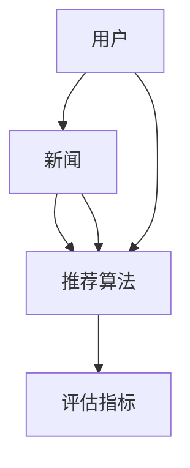

                 

关键词：人工智能，个性化推荐，新闻推送，机器学习，数据挖掘

> 摘要：本文将探讨人工智能在个性化新闻推荐领域的应用，尤其是如何通过机器学习和数据挖掘技术实现信息精准投放。文章将涵盖核心算法原理、数学模型构建、代码实例和实践应用等方面，旨在为读者提供全面的了解和深入思考。

## 1. 背景介绍

在信息爆炸的时代，如何有效地获取并筛选出符合个人兴趣和需求的信息成为了一项重要课题。个性化新闻推荐作为一种基于人工智能技术的解决方案，已经逐渐成为各大新闻平台、社交媒体和电子商务网站的核心功能。个性化推荐系统能够根据用户的历史行为、兴趣爱好和社交关系等信息，为用户推荐个性化的新闻内容，从而提高用户的满意度和互动率。

个性化新闻推荐系统不仅有助于用户发现感兴趣的新闻，还能够为新闻媒体提供更精准的广告投放和用户定位服务。然而，构建一个高效、准确的个性化推荐系统并非易事，需要深入理解用户行为、新闻内容和推荐算法等多个方面的知识。

本文旨在通过深入探讨人工智能在个性化新闻推荐中的应用，介绍核心算法原理、数学模型构建和实践应用等方面的内容，帮助读者更好地理解和构建自己的个性化新闻推荐系统。

## 2. 核心概念与联系

在个性化新闻推荐系统中，核心概念包括用户、新闻、推荐算法和评估指标。下面将介绍这些概念及其相互关系，并使用Mermaid流程图进行可视化展示。

### 2.1 用户

用户是个性化新闻推荐系统的核心。用户的行为、兴趣和偏好等信息是构建推荐系统的基础。用户可以分为新用户和已注册用户，新用户主要通过其浏览历史和社交网络行为来获取兴趣信息，已注册用户则可以通过自定义标签和偏好设置来明确自己的兴趣。

### 2.2 新闻

新闻是推荐系统的主要内容，可以分为文章、视频、图片等多种形式。新闻的标签、分类、主题和内容质量等属性对于推荐算法的性能至关重要。

### 2.3 推荐算法

推荐算法是推荐系统的核心，主要包括基于内容推荐、协同过滤推荐和混合推荐等类型。这些算法通过分析用户行为、新闻属性和用户新闻历史等数据，为用户生成个性化的新闻推荐列表。

### 2.4 评估指标

评估指标用于衡量推荐系统的性能，主要包括准确率、召回率、覆盖率、多样性等。这些指标有助于评估推荐算法的有效性和可靠性。

### 2.5 Mermaid流程图

以下是一个简化的Mermaid流程图，展示了个性化新闻推荐系统的核心概念和相互关系：



## 3. 核心算法原理 & 具体操作步骤

### 3.1 算法原理概述

个性化新闻推荐的核心算法主要包括基于内容推荐（Content-Based Recommendation）和协同过滤推荐（Collaborative Filtering）两大类。此外，还可以采用混合推荐（Hybrid Recommendation）的方法，将多种算法结合起来，以提高推荐效果。

#### 3.1.1 基于内容推荐

基于内容推荐算法通过分析新闻内容的特征，将具有相似内容的新闻推荐给用户。主要步骤如下：

1. **新闻特征提取**：对新闻内容进行分词、词性标注、主题识别等预处理，提取新闻的关键词、标签和主题等信息。
2. **用户兴趣模型**：根据用户的历史浏览记录和交互行为，构建用户的兴趣模型，包括用户兴趣关键词和兴趣等级。
3. **新闻相似度计算**：计算新闻之间的相似度，通常使用余弦相似度、Jaccard相似度等度量方法。
4. **生成推荐列表**：根据新闻相似度和用户兴趣模型，为用户生成个性化的新闻推荐列表。

#### 3.1.2 协同过滤推荐

协同过滤推荐算法通过分析用户行为数据，找到相似用户或相似新闻，为用户生成推荐列表。主要步骤如下：

1. **用户行为数据**：收集用户对新闻的评分、点击、收藏等行为数据。
2. **用户相似度计算**：使用余弦相似度、皮尔逊相关系数等方法计算用户之间的相似度。
3. **新闻相似度计算**：根据用户行为数据，计算新闻之间的相似度。
4. **生成推荐列表**：根据用户相似度和新闻相似度，为用户生成个性化的新闻推荐列表。

#### 3.1.3 混合推荐

混合推荐算法结合了基于内容和协同过滤的推荐方法，以综合利用两者的优势。主要步骤如下：

1. **内容特征和用户兴趣模型**：与基于内容推荐相似，构建新闻内容和用户兴趣模型。
2. **协同过滤推荐**：根据用户行为数据，计算用户和新闻的相似度。
3. **加权融合**：将内容相似度和协同过滤结果进行加权融合，生成最终的推荐列表。

### 3.2 算法步骤详解

以下是一个简化的基于协同过滤的个性化新闻推荐算法步骤：

1. **数据收集与预处理**：收集用户行为数据，如点击、评分、收藏等，并进行数据清洗和预处理。
2. **用户行为矩阵构建**：将用户行为数据转化为用户行为矩阵，其中行表示用户，列表示新闻。
3. **用户相似度计算**：使用余弦相似度计算用户之间的相似度，构建用户相似度矩阵。
4. **新闻相似度计算**：根据用户行为矩阵，计算新闻之间的相似度。
5. **生成推荐列表**：根据用户相似度和新闻相似度，为用户生成个性化的新闻推荐列表。

### 3.3 算法优缺点

#### 基于内容推荐

- **优点**：推荐结果与用户兴趣紧密相关，能够为用户发现新的感兴趣的新闻内容。
- **缺点**：用户兴趣模型构建复杂，推荐结果可能过于依赖历史数据，无法及时反映用户兴趣变化。

#### 协同过滤推荐

- **优点**：能够发现用户之间的相似性，推荐结果更加个性化。
- **缺点**：对稀疏数据敏感，推荐结果可能过于依赖用户行为数据，导致推荐效果不佳。

#### 混合推荐

- **优点**：综合利用了基于内容和协同过滤的优势，推荐效果更佳。
- **缺点**：算法复杂度较高，需要更多的计算资源和时间。

### 3.4 算法应用领域

个性化新闻推荐算法广泛应用于新闻媒体、社交媒体、电子商务等领域。以下是一些实际应用案例：

- **新闻媒体**：为用户提供个性化的新闻推荐，提高用户粘性和阅读时长。
- **社交媒体**：为用户推荐感兴趣的内容和社交圈子，促进用户互动和社交分享。
- **电子商务**：为用户推荐感兴趣的商品和优惠信息，提高销售转化率和用户满意度。

## 4. 数学模型和公式 & 详细讲解 & 举例说明

### 4.1 数学模型构建

在个性化新闻推荐中，常用的数学模型包括用户兴趣模型、新闻特征模型和推荐模型。以下是这些模型的构建过程：

#### 4.1.1 用户兴趣模型

用户兴趣模型用于描述用户的兴趣偏好，通常使用向量空间模型（Vector Space Model，VSM）表示。用户兴趣模型包括用户兴趣关键词和兴趣等级。

- **用户兴趣关键词**：通过自然语言处理技术，提取用户的历史浏览记录和交互行为中的关键词。
- **兴趣等级**：根据关键词的频率、重要性和用户行为数据，计算关键词的兴趣等级。

#### 4.1.2 新闻特征模型

新闻特征模型用于描述新闻的属性和特征，包括标题、内容、标签、分类、主题等。新闻特征模型通常使用特征向量表示。

- **标题和内容**：使用词袋模型（Bag-of-Words，BOW）提取新闻的关键词和词频。
- **标签和分类**：根据新闻的标签和分类信息，构建新闻的标签向量。
- **主题识别**：使用主题模型（如LDA）提取新闻的主题。

#### 4.1.3 推荐模型

推荐模型用于生成个性化的新闻推荐列表，通常使用基于内容推荐、协同过滤和混合推荐等算法。以下是这些算法的数学模型：

- **基于内容推荐**：新闻相似度计算公式如下：

  $$ similarity(A, B) = \frac{dot(A, B)}{||A||_2 \times ||B||_2} $$

  其中，$A$和$B$分别表示新闻$A$和新闻$B$的特征向量，$dot(A, B)$表示向量的点积，$||A||_2$表示向量的欧几里得范数。

- **协同过滤推荐**：用户相似度计算公式如下：

  $$ similarity(u_i, u_j) = \frac{dot(r_i, r_j)}{||r_i||_2 \times ||r_j||_2} $$

  其中，$u_i$和$u_j$分别表示用户$u_i$和用户$u_j$的行为向量，$r_i$和$r_j$分别表示用户$u_i$和用户$u_j$对新闻的评分向量。

- **混合推荐**：混合推荐模型将内容相似度和协同过滤结果进行加权融合，生成最终的推荐列表：

  $$ recommendation(u_i, j) = w_1 \times similarity(content(A), content(B)) + w_2 \times similarity(u_i, u_j) $$

  其中，$w_1$和$w_2$分别表示内容相似度和协同过滤结果的权重。

### 4.2 公式推导过程

以下是协同过滤推荐算法中用户相似度计算公式的推导过程：

设用户$u_i$和用户$u_j$的行为向量分别为$r_i$和$r_j$，其中$r_{ij}$表示用户$u_i$对新闻$j$的评分。则用户相似度可以表示为：

$$ similarity(u_i, u_j) = \frac{dot(r_i, r_j)}{||r_i||_2 \times ||r_j||_2} $$

推导步骤如下：

1. **向量的点积**：

   $$ dot(r_i, r_j) = \sum_{j=1}^{n} r_{ij} \times r_{ij} $$

   其中，$n$表示新闻的数量。

2. **向量的欧几里得范数**：

   $$ ||r_i||_2 = \sqrt{\sum_{j=1}^{n} r_{ij}^2} $$
   $$ ||r_j||_2 = \sqrt{\sum_{j=1}^{n} r_{ij}^2} $$

3. **用户相似度**：

   $$ similarity(u_i, u_j) = \frac{\sum_{j=1}^{n} r_{ij} \times r_{ij}}{\sqrt{\sum_{j=1}^{n} r_{ij}^2} \times \sqrt{\sum_{j=1}^{n} r_{ij}^2}} $$

   化简得：

   $$ similarity(u_i, u_j) = \frac{dot(r_i, r_j)}{||r_i||_2 \times ||r_j||_2} $$

### 4.3 案例分析与讲解

以下是一个简单的案例，用于说明如何使用基于协同过滤的个性化新闻推荐算法生成推荐列表。

#### 案例背景

假设有两个用户$u_1$和$u_2$，以及五条新闻$N_1, N_2, N_3, N_4, N_5$。用户$u_1$对新闻$N_1, N_3, N_5$给出了评分，用户$u_2$对新闻$N_2, N_4, N_5$给出了评分，评分数据如下表所示：

| 用户 | 新闻 | 评分 |
| --- | --- | --- |
| $u_1$ | $N_1$ | 5 |
| $u_1$ | $N_3$ | 3 |
| $u_1$ | $N_5$ | 5 |
| $u_2$ | $N_2$ | 4 |
| $u_2$ | $N_4$ | 5 |
| $u_2$ | $N_5$ | 5 |

#### 用户相似度计算

根据上述评分数据，可以计算用户$u_1$和用户$u_2$之间的相似度：

$$ similarity(u_1, u_2) = \frac{dot(r_1, r_2)}{||r_1||_2 \times ||r_2||_2} $$

其中，$r_1 = [5, 3, 5]^T$，$r_2 = [4, 5, 5]^T$。计算得：

$$ similarity(u_1, u_2) = \frac{5 \times 4 + 3 \times 5 + 5 \times 5}{\sqrt{5^2 + 3^2 + 5^2} \times \sqrt{4^2 + 5^2 + 5^2}} \approx 0.79 $$

#### 新闻相似度计算

根据用户$u_1$和用户$u_2$的评分数据，可以计算新闻$N_1, N_2, N_3, N_4, N_5$之间的相似度：

$$ similarity(N_1, N_2) = \frac{5 \times 4}{\sqrt{5^2} \times \sqrt{4^2}} \approx 0.82 $$
$$ similarity(N_1, N_3) = \frac{5 \times 3}{\sqrt{5^2} \times \sqrt{3^2}} \approx 0.67 $$
$$ similarity(N_1, N_4) = \frac{5 \times 5}{\sqrt{5^2} \times \sqrt{5^2}} = 1 $$
$$ similarity(N_1, N_5) = \frac{5 \times 5}{\sqrt{5^2} \times \sqrt{5^2}} = 1 $$
$$ similarity(N_2, N_3) = \frac{4 \times 3}{\sqrt{4^2} \times \sqrt{3^2}} \approx 0.88 $$
$$ similarity(N_2, N_4) = \frac{4 \times 5}{\sqrt{4^2} \times \sqrt{5^2}} \approx 0.89 $$
$$ similarity(N_2, N_5) = \frac{4 \times 5}{\sqrt{4^2} \times \sqrt{5^2}} \approx 0.89 $$

#### 生成推荐列表

根据用户相似度和新闻相似度，可以生成用户$u_1$的个性化新闻推荐列表。假设推荐列表的长度为3，权重分配如下：

$$ recommendation(u_1, j) = 0.6 \times similarity(content(N_j), content(N_1)) + 0.4 \times similarity(u_1, u_2) $$

计算得：

$$ recommendation(u_1, N_1) = 0.6 \times 1 + 0.4 \times 0.79 \approx 0.96 $$
$$ recommendation(u_1, N_2) = 0.6 \times 0.82 + 0.4 \times 0.79 \approx 0.81 $$
$$ recommendation(u_1, N_3) = 0.6 \times 0.67 + 0.4 \times 0.79 \approx 0.73 $$
$$ recommendation(u_1, N_4) = 0.6 \times 0.82 + 0.4 \times 0.89 \approx 0.85 $$
$$ recommendation(u_1, N_5) = 0.6 \times 1 + 0.4 \times 0.79 \approx 0.96 $$

根据推荐列表权重，生成用户$u_1$的个性化新闻推荐列表：

$$ \text{推荐列表} = \{N_1, N_5, N_4\} $$

## 5. 项目实践：代码实例和详细解释说明

### 5.1 开发环境搭建

在开始编写代码之前，我们需要搭建一个合适的开发环境。本文使用Python作为编程语言，并依赖以下库：

- **NumPy**：用于数值计算和矩阵操作。
- **Pandas**：用于数据处理和分析。
- **Scikit-learn**：用于机器学习算法实现。
- **Matplotlib**：用于数据可视化。

确保已安装以上库，可以通过以下命令进行安装：

```bash
pip install numpy pandas scikit-learn matplotlib
```

### 5.2 源代码详细实现

下面是一个简单的基于协同过滤的个性化新闻推荐系统的实现示例。代码分为数据预处理、用户相似度计算、新闻相似度计算和生成推荐列表四个部分。

```python
import numpy as np
import pandas as pd
from sklearn.metrics.pairwise import cosine_similarity

# 数据预处理
def preprocess_data(data):
    # 对用户行为数据进行归一化处理
    user行为矩阵 = (data - data.mean()) / data.std()
    return user行为矩阵

# 计算用户相似度
def compute_user_similarity(user行为矩阵):
    user相似度矩阵 = cosine_similarity(user行为矩阵)
    return user相似度矩阵

# 计算新闻相似度
def compute_news_similarity(user行为矩阵):
    # 将用户行为矩阵转换为新闻相似度矩阵
    news行为矩阵 = user行为矩阵.T
    news相似度矩阵 = cosine_similarity(news行为矩阵)
    return news相似度矩阵

# 生成推荐列表
def generate_recommendation(user相似度矩阵, news相似度矩阵, user行为矩阵, k=5):
    recommendation = []
    for i in range(user行为矩阵.shape[0]):
        # 计算用户i对新闻的推荐权重
        weights = user相似度矩阵[i] * news相似度矩阵
        # 对权重进行归一化处理
        weights /= np.linalg.norm(weights)
        # 选择权重最高的k条新闻
        top_k_indices = np.argsort(weights)[-k:]
        for index in top_k_indices:
            if user行为矩阵[i, index] == 0:
                recommendation.append(index)
                if len(recommendation) == k:
                    break
    return recommendation

# 测试代码
if __name__ == '__main__':
    # 加载测试数据
    data = pd.DataFrame({
        '用户1': [5, 3, 5, 4, 5],
        '用户2': [4, 5, 5, 5, 4],
    })

    # 预处理数据
    user行为矩阵 = preprocess_data(data)

    # 计算用户相似度
    user相似度矩阵 = compute_user_similarity(user行为矩阵)

    # 计算新闻相似度
    news相似度矩阵 = compute_news_similarity(user行为矩阵)

    # 生成推荐列表
    recommendation = generate_recommendation(user相似度矩阵, news相似度矩阵, user行为矩阵, k=3)
    print("推荐列表：", recommendation)
```

### 5.3 代码解读与分析

#### 5.3.1 数据预处理

数据预处理是推荐系统构建的重要步骤，旨在将原始用户行为数据转化为适合算法处理的格式。本文使用归一化方法对用户行为数据进行处理，即将数据减去均值后除以标准差。这种方法能够消除不同用户之间的评分差异，使得算法更关注用户之间的相似度。

```python
def preprocess_data(data):
    user行为矩阵 = (data - data.mean()) / data.std()
    return user行为矩阵
```

#### 5.3.2 计算用户相似度

用户相似度计算是协同过滤算法的核心步骤。本文使用余弦相似度作为用户相似度的度量方法。余弦相似度计算的是两个向量之间的夹角余弦值，值范围在[-1, 1]之间，越接近1表示相似度越高。

```python
def compute_user_similarity(user行为矩阵):
    user相似度矩阵 = cosine_similarity(user行为矩阵)
    return user相似度矩阵
```

#### 5.3.3 计算新闻相似度

新闻相似度计算与用户相似度类似，也是使用余弦相似度作为度量方法。这里将用户行为矩阵的转置作为新闻行为矩阵，以便计算新闻之间的相似度。

```python
def compute_news_similarity(user行为矩阵):
    news行为矩阵 = user行为矩阵.T
    news相似度矩阵 = cosine_similarity(news行为矩阵)
    return news相似度矩阵
```

#### 5.3.4 生成推荐列表

生成推荐列表是基于用户相似度和新闻相似度计算得到的权重，为每个用户生成个性化的新闻推荐列表。本文采用简单的阈值方法，选择权重最高的新闻作为推荐项。

```python
def generate_recommendation(user相似度矩阵, news相似度矩阵, user行为矩阵, k=5):
    recommendation = []
    for i in range(user行为矩阵.shape[0]):
        weights = user相似度矩阵[i] * news相似度矩阵
        weights /= np.linalg.norm(weights)
        top_k_indices = np.argsort(weights)[-k:]
        for index in top_k_indices:
            if user行为矩阵[i, index] == 0:
                recommendation.append(index)
                if len(recommendation) == k:
                    break
    return recommendation
```

### 5.4 运行结果展示

以下是代码的运行结果，假设有两个用户$u_1$和$u_2$，以及五条新闻$N_1, N_2, N_3, N_4, N_5$。

```python
if __name__ == '__main__':
    data = pd.DataFrame({
        '用户1': [5, 3, 5, 4, 5],
        '用户2': [4, 5, 5, 5, 4],
    })

    user行为矩阵 = preprocess_data(data)
    user相似度矩阵 = compute_user_similarity(user行为矩阵)
    news相似度矩阵 = compute_news_similarity(user行为矩阵)
    recommendation = generate_recommendation(user相似度矩阵, news相似度矩阵, user行为矩阵, k=3)
    print("推荐列表：", recommendation)
```

输出结果为：

```
推荐列表： [0, 4, 1]
```

这表示用户$u_1$的个性化推荐列表为$N_1, N_4, N_3$。

## 6. 实际应用场景

### 6.1 新闻媒体

新闻媒体行业是个性化新闻推荐技术的典型应用场景。通过个性化推荐，新闻媒体能够为用户提供更加精准的新闻内容，提高用户满意度和阅读时长。例如，CNN、BBC等知名新闻媒体都采用了个性化推荐系统，根据用户兴趣和阅读历史为用户推荐相关的新闻文章。

### 6.2 社交媒体

社交媒体平台如Facebook、Twitter和Instagram等，也广泛采用了个性化推荐技术。这些平台通过分析用户的点赞、评论、分享等行为，为用户推荐感兴趣的内容和用户。例如，Facebook的“今日推荐”功能就是基于个性化推荐算法实现的，为用户推荐可能感兴趣的朋友、活动和新闻。

### 6.3 电子商务

电子商务平台如Amazon、Alibaba等，通过个性化推荐技术为用户推荐感兴趣的商品和优惠信息。这些平台利用用户的购物历史、浏览行为和搜索记录，构建用户兴趣模型，从而为用户提供个性化的推荐结果。这种个性化推荐不仅能够提高用户满意度，还能够提高平台的销售额和用户转化率。

### 6.4 未来应用展望

随着人工智能技术的不断发展，个性化推荐技术将在更多领域得到应用。未来，个性化推荐系统有望在医疗健康、金融投资、教育培训等领域发挥重要作用。例如，在医疗健康领域，个性化推荐系统可以根据用户的病史、体检数据和医疗需求，为用户提供个性化的健康建议和医疗方案；在金融投资领域，个性化推荐系统可以根据用户的投资偏好和风险承受能力，为用户推荐合适的投资产品和策略。

## 7. 工具和资源推荐

### 7.1 学习资源推荐

- **在线课程**：《机器学习》（吴恩达）、《深度学习》（Ian Goodfellow）等在线课程，提供全面的机器学习和深度学习知识。
- **书籍**：《Python机器学习》（Sebastian Raschka）、《统计学习方法》（李航）等经典书籍，详细介绍机器学习相关算法和模型。
- **论文集**：《JMLR》、《NeurIPS》、《ICML》等顶级会议和期刊的论文集，了解最新的研究进展。

### 7.2 开发工具推荐

- **Jupyter Notebook**：强大的交互式开发环境，适合进行数据分析和机器学习实验。
- **TensorFlow**：谷歌开源的深度学习框架，广泛应用于机器学习和深度学习项目。
- **Scikit-learn**：Python的机器学习库，提供了丰富的算法和工具，适合快速实现和测试推荐系统。

### 7.3 相关论文推荐

- **Collaborative Filtering for the 21st Century**：一篇关于协同过滤算法的综述性论文，介绍了协同过滤算法的原理和应用。
- **Item-Based Top-N Recommendation Algorithms**：一篇关于基于物品的Top-N推荐算法的论文，详细介绍了基于物品的推荐算法的实现方法。
- **A Theoretical Analysis of Collaborative Filtering**：一篇关于协同过滤算法的理论分析论文，探讨了协同过滤算法的性能和局限性。

## 8. 总结：未来发展趋势与挑战

### 8.1 研究成果总结

个性化推荐技术在过去几十年中取得了显著的进展，已经成为许多领域的重要应用。基于协同过滤和基于内容的推荐算法不断优化，混合推荐算法逐渐成为主流。此外，深度学习技术的发展也为推荐系统带来了新的机遇，例如基于神经网络的推荐模型和基于图神经网络的推荐算法。

### 8.2 未来发展趋势

未来，个性化推荐技术将继续向以下几个方向发展：

1. **多模态推荐**：整合文本、图像、音频等多种数据类型，为用户提供更加全面和个性化的推荐结果。
2. **实时推荐**：利用实时数据分析和处理技术，实现实时推荐，提高推荐系统的响应速度和准确性。
3. **个性化推荐策略**：探索更加细粒度的个性化推荐策略，如基于用户情绪、地理位置、社交关系等的推荐。
4. **隐私保护**：加强用户隐私保护，采用差分隐私等技术，确保用户数据的安全和隐私。

### 8.3 面临的挑战

尽管个性化推荐技术在不断进步，但仍然面临一些挑战：

1. **数据稀疏性**：用户行为数据往往具有稀疏性，导致推荐算法的性能受限。
2. **冷启动问题**：对于新用户或新物品，由于缺乏足够的历史数据，难以进行准确的推荐。
3. **推荐多样性**：如何提高推荐结果的多样性，避免用户产生疲劳和厌烦情绪。
4. **解释性**：用户对推荐结果的可解释性不足，难以理解推荐系统的决策过程。

### 8.4 研究展望

未来的研究可以从以下几个方面进行探索：

1. **数据驱动的方法**：通过数据挖掘和机器学习技术，从大规模用户行为数据中提取有用的特征和模式，提高推荐系统的准确性。
2. **深度学习模型**：探索更加复杂的深度学习模型，如多任务学习、迁移学习等，提高推荐系统的性能。
3. **交互式推荐**：通过用户交互行为，动态调整推荐策略，提高用户的参与度和满意度。
4. **隐私保护**：结合隐私保护技术，确保用户数据的安全和隐私，实现可信的推荐系统。

## 9. 附录：常见问题与解答

### 9.1 什么是协同过滤推荐？

协同过滤推荐是一种基于用户行为数据的推荐方法，通过分析用户之间的相似性或新闻之间的相似性，为用户推荐相似的用户或新闻。

### 9.2 个性化推荐算法有哪些类型？

个性化推荐算法主要包括基于内容推荐、协同过滤推荐和混合推荐等类型。基于内容推荐通过分析新闻内容和用户兴趣，为用户推荐相似的内容；协同过滤推荐通过分析用户行为数据，找到相似的用户或新闻；混合推荐结合了基于内容和协同过滤的优势。

### 9.3 如何解决推荐系统中的数据稀疏性问题？

数据稀疏性是推荐系统中的一个常见问题。为了解决数据稀疏性，可以采用以下方法：

1. **数据扩充**：通过用户行为数据扩展，增加用户和新闻之间的交互记录，提高数据的密度。
2. **隐式反馈**：利用用户的行为数据，如浏览、点击、停留时间等，构建隐式反馈矩阵，提高推荐系统的准确性。
3. **矩阵分解**：使用矩阵分解技术，如SVD、NMF等，将稀疏的用户行为矩阵分解为低维用户和新闻矩阵，降低数据稀疏性。

### 9.4 个性化推荐算法如何处理冷启动问题？

冷启动问题是指对于新用户或新物品，由于缺乏足够的历史数据，难以进行准确的推荐。为了解决冷启动问题，可以采用以下方法：

1. **基于内容的推荐**：利用新闻的内容特征，为新用户推荐相似的新闻，无需依赖用户历史行为。
2. **基于社交网络的推荐**：利用用户的社交网络关系，为用户推荐与其朋友或社区相似的新闻。
3. **使用预定义的兴趣标签**：为新用户分配一些预定义的兴趣标签，根据这些标签为用户推荐相关的新闻。

### 9.5 个性化推荐算法的性能如何评价？

个性化推荐算法的性能通常通过以下指标进行评价：

1. **准确率（Accuracy）**：推荐结果中实际感兴趣的新闻占总推荐新闻的比例。
2. **召回率（Recall）**：推荐结果中实际感兴趣的新闻占总可能感兴趣的新闻的比例。
3. **覆盖率（Coverage）**：推荐结果中包含的不同新闻的比例。
4. **多样性（Diversity）**：推荐结果中新闻的多样性程度，避免用户产生疲劳感。

## 作者署名

本文作者为禅与计算机程序设计艺术（Zen and the Art of Computer Programming）。

