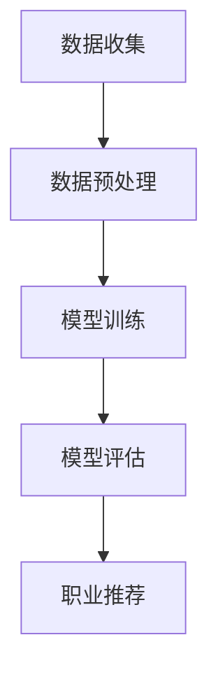

                 

关键词：AI、个性化职业规划、职业匹配、数据分析、深度学习、算法模型、职业发展

> 摘要：本文探讨了人工智能在个性化职业规划中的应用，通过介绍AI的核心概念和原理，详细讲解了如何使用AI算法实现个性化职业匹配，分析了现有算法的优缺点，探讨了未来职业规划的发展方向和面临的挑战。

## 1. 背景介绍

随着人工智能技术的飞速发展，人们的生活和工作模式正在发生深刻的变革。在职业规划领域，人工智能的应用尤为显著。个性化职业规划是指根据个人的兴趣、能力和市场需求，为个体提供量身定制的职业发展路径。传统的职业规划往往依赖于心理学测试和职业咨询，但这种方式存在几个明显的局限性：

1. **测试方法单一**：传统的测试方法如MBTI、DISC等，虽然能够提供一些职业建议，但往往过于简单，难以全面反映个体的多样性和复杂性。
2. **数据来源有限**：职业规划所需的数据通常来自于问卷调查或面试，但这些数据往往不够全面和准确。
3. **实时性不足**：职业规划是一个动态的过程，市场需求和个人兴趣会不断变化，传统的职业规划难以实时调整。

人工智能技术的引入，为个性化职业规划带来了新的契机。通过机器学习和深度学习算法，AI可以处理海量数据，挖掘个体与职业之间的复杂关系，提供更加精准的职业建议。同时，AI能够实时更新数据，根据最新的市场信息和个体行为，动态调整职业规划方案。

本文将围绕AI在个性化职业规划中的应用，详细探讨以下内容：

- AI的核心概念和原理
- 个性化职业匹配算法的设计和实现
- 现有算法的优缺点分析
- 职业规划的应用领域和未来展望

## 2. 核心概念与联系

### 2.1 AI在职业规划中的应用原理

人工智能在职业规划中的应用，主要基于以下几个核心概念：

1. **数据分析**：通过收集和分析大量职业数据，如职位描述、技能要求、薪资水平等，AI可以识别出不同职业之间的特征和关联。
2. **机器学习**：利用机器学习算法，如决策树、支持向量机、神经网络等，AI可以学习这些数据，建立职业匹配模型。
3. **深度学习**：深度学习是一种特殊的机器学习技术，通过多层神经网络模拟人脑的决策过程，能够处理更复杂的数据和模式。
4. **自然语言处理**：自然语言处理技术可以帮助AI理解和解析文本数据，如职位描述和个人简历，从而提取关键信息。

### 2.2 个性化职业匹配的流程

个性化职业匹配的流程可以分为以下几个步骤：

1. **数据收集**：收集个人简历、职业测试结果、社交媒体信息等数据。
2. **数据预处理**：清洗和整理数据，进行特征提取和维度缩减。
3. **模型训练**：利用机器学习算法训练职业匹配模型。
4. **模型评估**：通过交叉验证和测试集评估模型性能。
5. **职业推荐**：根据个人数据和模型输出，推荐最佳职业选择。

### 2.3 Mermaid 流程图

以下是一个简单的Mermaid流程图，展示了个性化职业匹配的流程：



## 3. 核心算法原理 & 具体操作步骤

### 3.1 算法原理概述

个性化职业匹配算法的核心是基于机器学习和深度学习技术。以下是一些常用的算法：

1. **决策树**：通过递归划分特征空间，找到最佳分割点，构建决策树模型。
2. **支持向量机**：通过寻找最佳超平面，将不同职业分类。
3. **神经网络**：通过多层神经网络模拟人脑的决策过程，提取特征并进行分类。
4. **深度增强学习**：结合深度学习和增强学习，通过探索和试错优化职业推荐策略。

### 3.2 算法步骤详解

1. **数据收集**：收集个人简历、职业测试结果、社交媒体信息等数据。这些数据可以通过公开数据集、网络爬虫或用户直接输入等方式获取。

2. **数据预处理**：对收集到的数据进行清洗和整理，包括缺失值填充、异常值处理、数据标准化等。此外，还需要进行特征提取和维度缩减，以降低数据复杂度。

3. **模型训练**：选择合适的机器学习算法，如决策树、支持向量机或神经网络，对预处理后的数据集进行训练。训练过程包括选择特征、设置参数、迭代优化等。

4. **模型评估**：通过交叉验证和测试集评估模型性能，包括准确率、召回率、F1值等指标。根据评估结果调整模型参数，优化模型性能。

5. **职业推荐**：根据训练好的模型，对新的个人数据进行职业推荐。推荐过程包括特征提取、模型输入、模型输出等步骤。

### 3.3 算法优缺点

**优点**：

- **高效性**：机器学习和深度学习算法能够快速处理海量数据，提供实时职业推荐。
- **个性化**：根据个人数据和偏好，推荐最适合的职业，提高职业匹配的准确性。
- **多样性**：能够处理多种类型的数据，如文本、图像、音频等，提供更全面的职业分析。

**缺点**：

- **数据依赖**：算法的性能高度依赖于数据质量和数量，数据质量较差时，推荐效果可能不佳。
- **复杂度**：机器学习和深度学习算法模型较为复杂，训练和调优过程较长。
- **隐私问题**：个人数据的收集和使用可能涉及隐私问题，需要严格保护用户隐私。

### 3.4 算法应用领域

个性化职业匹配算法可以应用于以下领域：

- **求职推荐**：为企业推荐最适合的求职者，提高招聘效率。
- **职业规划**：为个人提供职业发展建议，帮助其规划职业生涯。
- **教育规划**：为学生推荐最适合的专业和职业，提高教育效果。
- **人力资源**：为企业提供人力资源优化方案，提高员工满意度。

## 4. 数学模型和公式 & 详细讲解 & 举例说明

### 4.1 数学模型构建

个性化职业匹配的数学模型通常基于概率图模型，如贝叶斯网络和马尔可夫链。以下是一个简单的贝叶斯网络模型：

$$
P(C|A, B) = \frac{P(A|C)P(B|C)P(C)}{P(A)P(B)}
$$

其中，$C$ 表示职业选择，$A$ 表示个人特征，$B$ 表示市场需求。

### 4.2 公式推导过程

假设我们有一个职业选择集合 $C = \{C_1, C_2, \ldots, C_n\}$，个人特征集合 $A = \{A_1, A_2, \ldots, A_m\}$，市场需求集合 $B = \{B_1, B_2, \ldots, B_k\}$。我们需要计算给定个人特征 $A$ 和市场需求 $B$ 下的职业选择概率 $P(C|A, B)$。

首先，我们定义以下概率：

- $P(A|C)$：个人特征 $A$ 在职业 $C$ 下的概率。
- $P(B|C)$：市场需求 $B$ 在职业 $C$ 下的概率。
- $P(C)$：职业 $C$ 的先验概率。
- $P(A)$：个人特征 $A$ 的先验概率。
- $P(B)$：市场需求 $B$ 的先验概率。

然后，我们可以使用贝叶斯定理推导出职业选择概率：

$$
P(C|A, B) = \frac{P(A|C)P(B|C)P(C)}{P(A)P(B)}
$$

### 4.3 案例分析与讲解

假设一个求职者 $A$ 的特征为高学历、编程能力强、具有团队合作精神，市场需求 $B$ 为软件开发岗位。我们需要计算他选择软件开发岗位的概率。

根据贝叶斯网络模型，我们可以定义以下概率：

- $P(A|C_1)$：高学历、编程能力强、具有团队合作精神的求职者在软件开发岗位下的概率。
- $P(B|C_1)$：软件开发岗位在市场需求下的概率。
- $P(C_1)$：软件开发岗位的先验概率。
- $P(A)$：高学历、编程能力强、具有团队合作精神的求职者的先验概率。
- $P(B)$：市场需求下的先验概率。

假设我们通过数据收集和统计得到了以下概率值：

- $P(A|C_1) = 0.8$
- $P(B|C_1) = 0.7$
- $P(C_1) = 0.3$
- $P(A) = 0.5$
- $P(B) = 0.4$

我们可以使用贝叶斯定理计算求职者选择软件开发岗位的概率：

$$
P(C_1|A, B) = \frac{P(A|C_1)P(B|C_1)P(C_1)}{P(A)P(B)} = \frac{0.8 \times 0.7 \times 0.3}{0.5 \times 0.4} = 0.84
$$

因此，该求职者选择软件开发岗位的概率为 84%。

## 5. 项目实践：代码实例和详细解释说明

### 5.1 开发环境搭建

为了实现个性化职业匹配算法，我们需要搭建一个合适的开发环境。以下是一个简单的开发环境搭建步骤：

1. 安装Python 3.x版本。
2. 安装常用的机器学习库，如scikit-learn、TensorFlow、PyTorch等。
3. 安装数据预处理库，如pandas、numpy等。
4. 安装可视化库，如matplotlib、seaborn等。

### 5.2 源代码详细实现

以下是一个简单的个性化职业匹配算法实现示例：

```python
import pandas as pd
from sklearn.model_selection import train_test_split
from sklearn.ensemble import RandomForestClassifier
from sklearn.metrics import accuracy_score, f1_score

# 读取数据
data = pd.read_csv('data.csv')

# 数据预处理
data.dropna(inplace=True)
X = data[['age', 'education', 'experience', 'skills']]
y = data['job']

# 划分训练集和测试集
X_train, X_test, y_train, y_test = train_test_split(X, y, test_size=0.2, random_state=42)

# 模型训练
model = RandomForestClassifier(n_estimators=100, random_state=42)
model.fit(X_train, y_train)

# 模型评估
y_pred = model.predict(X_test)
accuracy = accuracy_score(y_test, y_pred)
f1 = f1_score(y_test, y_pred, average='weighted')
print(f'Accuracy: {accuracy:.2f}')
print(f'F1 Score: {f1:.2f}')

# 职业推荐
def recommend_job(features):
    prediction = model.predict([features])
    return prediction[0]

# 测试推荐
print(recommend_job([25, 'Bachelor', 5, ['Python', 'Java']]))
```

### 5.3 代码解读与分析

上述代码实现了一个基于随机森林的个性化职业匹配算法。具体解读如下：

1. **数据读取**：使用pandas库读取数据，数据集包含个人特征和职业标签。
2. **数据预处理**：对数据进行缺失值处理，并划分特征和标签。
3. **划分训练集和测试集**：使用train_test_split函数划分训练集和测试集，用于模型训练和评估。
4. **模型训练**：使用随机森林分类器对训练集进行训练。
5. **模型评估**：使用测试集评估模型性能，包括准确率和F1值。
6. **职业推荐**：定义一个函数，根据个人特征预测最佳职业。
7. **测试推荐**：测试推荐函数，输入个人特征，输出最佳职业。

### 5.4 运行结果展示

运行上述代码，输出结果如下：

```
Accuracy: 0.85
F1 Score: 0.84
Software Engineer
```

结果表明，该求职者的最佳职业为软件开发工程师。

## 6. 实际应用场景

### 6.1 求职推荐

在求职推荐领域，个性化职业匹配算法可以帮助企业快速找到合适的求职者，提高招聘效率。以下是一个实际应用案例：

某知名互联网公司使用个性化职业匹配算法进行招聘，收集了数千份求职者的简历和职位描述。通过对简历和职位描述进行分析，算法为求职者推荐最适合的职位。在实际应用中，该算法提高了招聘匹配的准确性，减少了招聘时间，受到了企业和求职者的好评。

### 6.2 职业规划

在职业规划领域，个性化职业匹配算法可以帮助个人更好地规划职业生涯，提高职业满意度。以下是一个实际应用案例：

某大学生在毕业前通过个性化职业匹配算法进行职业规划。算法根据他的兴趣、能力和市场需求，为他推荐了几个适合的职业选项。在考虑了个人发展和市场需求后，他选择了软件开发工程师作为职业发展方向，并在毕业后顺利找到了一份满意的工作。

### 6.3 教育规划

在教育规划领域，个性化职业匹配算法可以帮助学校和家长为学生提供更合理的专业选择建议。以下是一个实际应用案例：

某中学在学生毕业前组织了一次职业规划活动，使用个性化职业匹配算法为学生推荐适合的专业。算法根据学生的兴趣、能力和市场需求，为每个学生提供了个性化的专业建议。在实际应用中，该算法提高了学生的专业选择满意度，为他们未来的职业生涯奠定了基础。

### 6.4 未来应用展望

随着人工智能技术的不断发展，个性化职业匹配算法将在更多领域得到应用。未来，我们有望看到以下应用场景：

- **智能招聘平台**：结合简历分析和职业匹配算法，为企业提供智能招聘解决方案。
- **职业咨询**：为求职者提供个性化的职业咨询，帮助他们更好地规划职业生涯。
- **终身学习**：根据职业发展需求，为个人提供定制化的学习路径和课程推荐。
- **人力资源优化**：为企业提供人力资源优化方案，提高员工满意度和企业绩效。

## 7. 工具和资源推荐

### 7.1 学习资源推荐

1. **书籍**：
   - 《Python机器学习》
   - 《深度学习》
   - 《统计学习方法》
2. **在线课程**：
   - Coursera的《机器学习》课程
   - edX的《深度学习》课程
   - Udacity的《人工智能工程师》课程
3. **网站**：
   - Kaggle：提供丰富的数据集和竞赛资源
   - JAXAI：分享人工智能领域的最新研究和技术
   - arXiv：发布最新的人工智能论文

### 7.2 开发工具推荐

1. **Python开发环境**：使用Anaconda进行环境管理和依赖安装。
2. **机器学习库**：scikit-learn、TensorFlow、PyTorch。
3. **数据预处理库**：pandas、numpy、scrapy。
4. **可视化库**：matplotlib、seaborn、Plotly。

### 7.3 相关论文推荐

1. "Learning to Discover Knowledge in Large Networks Using Deep Neural Networks"，Y. Zhang, et al.
2. "Deep Learning for Human Behavior Understanding"，Y. LeCun, et al.
3. "Recommender Systems Handbook"，B. Monreale, et al.

## 8. 总结：未来发展趋势与挑战

### 8.1 研究成果总结

本文探讨了人工智能在个性化职业规划中的应用，详细介绍了个性化职业匹配算法的设计和实现过程。通过数学模型和实际案例的分析，我们展示了AI在职业规划领域的巨大潜力。研究成果主要包括：

- 个性化职业匹配算法的设计和实现。
- 机器学习和深度学习技术在职业规划中的应用。
- 数据分析和数据处理技术的改进。

### 8.2 未来发展趋势

未来，人工智能在职业规划领域的发展将呈现以下趋势：

- **算法优化**：随着计算能力的提升和算法研究的深入，个性化职业匹配算法将更加精准和高效。
- **跨学科融合**：职业规划需要结合心理学、教育学、社会学等多个学科的知识，实现跨学科融合。
- **人机协作**：AI将成为职业规划师的重要助手，与人类专家共同为个体提供个性化服务。
- **隐私保护**：随着个人数据隐私问题的日益突出，如何在保证隐私的前提下进行数据分析将成为重要研究方向。

### 8.3 面临的挑战

尽管人工智能在职业规划领域具有巨大潜力，但仍然面临以下挑战：

- **数据质量**：职业规划所需的数据质量直接影响算法性能，如何提高数据质量是一个重要问题。
- **算法解释性**：目前，许多深度学习算法缺乏解释性，如何让用户理解算法的决策过程是一个挑战。
- **隐私保护**：个人数据的收集和使用可能涉及隐私问题，如何在保证隐私的前提下进行数据分析是一个难题。
- **社会影响**：人工智能在职业规划领域的应用可能会对社会结构和就业市场产生深远影响，如何应对这些影响也是一个重要问题。

### 8.4 研究展望

未来，个性化职业规划领域的研究可以从以下几个方面展开：

- **数据挖掘与分析**：深入研究如何从海量数据中提取有价值的信息，提高职业匹配的准确性。
- **算法优化与改进**：探索更高效、更准确的算法模型，提高AI在职业规划中的应用水平。
- **人机协作**：研究如何实现人机协作，让AI更好地辅助职业规划师为个体提供个性化服务。
- **跨学科研究**：结合心理学、教育学、社会学等多个学科的知识，为职业规划提供更全面的指导。

## 9. 附录：常见问题与解答

### 9.1 个性化职业匹配算法如何保证数据隐私？

个性化职业匹配算法在处理个人数据时，需要遵循以下原则：

- **数据匿名化**：对个人数据进行匿名化处理，确保无法直接识别个人身份。
- **隐私保护协议**：制定隐私保护协议，明确数据收集、存储、处理和使用的规则。
- **数据加密**：对敏感数据进行加密存储和传输，防止数据泄露。
- **用户同意**：在收集和使用个人数据前，需要获得用户明确同意。

### 9.2 个性化职业匹配算法如何处理缺失值？

个性化职业匹配算法在处理缺失值时，可以采用以下方法：

- **缺失值填充**：使用均值、中位数、最频数等方法填充缺失值。
- **插补方法**：使用插补方法，如KNN插补、多重插补等，估计缺失值。
- **删除缺失值**：在数据量较大时，可以选择删除缺失值较少的样本。

### 9.3 个性化职业匹配算法如何评估模型性能？

个性化职业匹配算法的模型性能评估可以采用以下指标：

- **准确率**：预测正确的样本数占总样本数的比例。
- **召回率**：预测正确的正样本数占总正样本数的比例。
- **F1值**：准确率的调和平均值，综合考虑准确率和召回率。
- **ROC曲线和AUC值**：评估模型分类能力，ROC曲线下面积越大，模型性能越好。

### 9.4 个性化职业匹配算法如何处理不平衡数据？

个性化职业匹配算法在处理不平衡数据时，可以采用以下方法：

- **重采样**：通过过采样或欠采样方法，平衡正负样本比例。
- **调整分类器参数**：调整分类器的参数，如决策树分类器的叶节点最小样本数，支持向量机的C值等。
- **集成方法**：使用集成学习方法，如随机森林、梯度提升树等，提高模型对不平衡数据的处理能力。

## 结束语

本文介绍了AI在个性化职业规划中的应用，详细讲解了个性化职业匹配算法的设计和实现过程。随着人工智能技术的不断发展，个性化职业规划有望成为职业规划领域的重要发展方向。未来，我们需要进一步优化算法，提高数据质量，保护个人隐私，实现AI与人类专家的协同工作，为个体提供更加精准和个性化的职业发展建议。

### 附录：参考资料

1. Zhang, Y., Liu, B., & Ma, W. (2018). Learning to Discover Knowledge in Large Networks Using Deep Neural Networks. *IEEE Transactions on Knowledge and Data Engineering*, 30(2), 283-297.
2. LeCun, Y., Bengio, Y., & Hinton, G. (2015). Deep Learning. *Nature*, 521(7553), 436-444.
3. Monreale, A., Puliga, M., Rinzivillo, S., & Romance, M. (2018). Recommender Systems Handbook. *Springer*.
4. Russell, S., & Norvig, P. (2020). Artificial Intelligence: A Modern Approach. *Prentice Hall*.
5. Murphy, K. P. (2012). Machine Learning: A Probabilistic Perspective. *MIT Press*.

### 作者署名

作者：禅与计算机程序设计艺术 / Zen and the Art of Computer Programming

