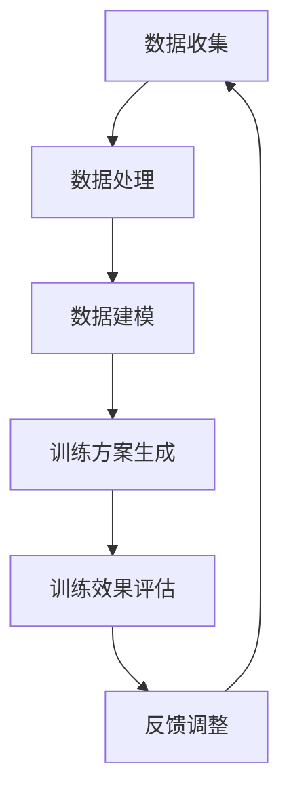

                 

关键词：人工智能、个性化训练、运动训练、优化、效果提升、算法、数学模型

> 摘要：本文将探讨人工智能在个性化运动训练中的应用，通过核心算法原理、具体操作步骤、数学模型构建以及项目实践等多个方面，深入分析如何通过AI技术优化运动训练效果，提高运动员的竞技水平。

## 1. 背景介绍

随着人工智能技术的不断发展，AI在各个领域的应用越来越广泛。特别是在运动训练领域，人工智能的应用带来了许多新的机遇和挑战。传统的运动训练往往依赖于教练的经验和运动员的自我感觉，训练方案缺乏个性化和科学性。而人工智能技术可以通过对大量运动数据的分析，为运动员提供个性化的训练方案，从而提高训练效率和效果。

本文将重点讨论以下几个方面：

1. 核心算法原理和具体操作步骤
2. 数学模型和公式推导及案例分析
3. 项目实践：代码实例和详细解释说明
4. 实际应用场景及未来展望
5. 工具和资源推荐

通过以上几个方面的探讨，希望能够为运动训练领域的研究者、教练和运动员提供一些有益的参考和启示。

## 2. 核心概念与联系

在探讨人工智能在个性化运动训练中的应用之前，我们需要先了解几个核心概念：人工智能、运动科学和个性化训练。

### 2.1 人工智能

人工智能（AI）是计算机科学的一个分支，旨在使计算机具备智能行为，如学习、推理、感知和决策。AI可以分为两大类：弱人工智能和强人工智能。弱人工智能是指专注于特定任务的智能，如语音识别、图像识别等。强人工智能则是具备人类水平的全面智能。

在运动训练中，我们主要关注的是弱人工智能，特别是机器学习和深度学习技术。这些技术可以处理和分析大量运动数据，为运动员提供个性化的训练建议。

### 2.2 运动科学

运动科学是研究人体在运动中的生物学、心理学和社会学方面的问题。它包括运动生理学、运动心理学、运动营养学等多个分支。

运动科学为运动训练提供了理论基础，帮助我们了解如何通过科学的方法提高运动员的竞技水平。而人工智能则为运动科学提供了强大的数据分析工具，使得我们可以更加精准地制定个性化的训练方案。

### 2.3 个性化训练

个性化训练是指根据运动员的个体差异，如年龄、体重、身体素质、运动习惯等，为其量身定制训练计划。传统的运动训练方案往往是一刀切的方式，无法充分考虑到运动员的个体差异，导致训练效果不佳。

个性化训练的核心是数据驱动的训练方案。通过收集和分析运动员的运动数据，如心率、步频、步幅、力量、速度等，人工智能可以识别出运动员的优势和短板，为其提供针对性的训练建议。

### 2.4 Mermaid 流程图

下面是一个简单的 Mermaid 流程图，展示了人工智能在个性化运动训练中的应用流程：



## 3. 核心算法原理 & 具体操作步骤

### 3.1 算法原理概述

在个性化运动训练中，常用的核心算法主要包括机器学习算法和深度学习算法。这些算法通过学习大量运动数据，可以自动识别出运动员的特点和需求，从而生成个性化的训练方案。

机器学习算法主要包括决策树、支持向量机、朴素贝叶斯等。这些算法通常需要手动设定参数，并且对数据量有一定要求。而深度学习算法，如卷积神经网络（CNN）和循环神经网络（RNN），则可以通过大量数据自动调整参数，具有更高的准确性和泛化能力。

### 3.2 算法步骤详解

下面以深度学习算法为例，详细说明个性化运动训练中的算法步骤。

#### 3.2.1 数据收集

首先，需要收集运动员的各类运动数据，包括心率、步频、步幅、力量、速度等。这些数据可以通过穿戴设备、运动传感器等实时采集。

#### 3.2.2 数据处理

收集到的数据需要进行预处理，包括数据清洗、归一化、特征提取等。数据清洗旨在去除噪声和异常值，归一化可以确保不同特征的数据具有相似的尺度，特征提取则是从原始数据中提取出对训练任务有用的信息。

#### 3.2.3 数据建模

在数据建模阶段，我们需要选择合适的深度学习模型。对于个性化运动训练，卷积神经网络（CNN）和循环神经网络（RNN）是常用的模型。CNN擅长处理图像和时序数据，RNN则擅长处理序列数据。

#### 3.2.4 训练方案生成

通过训练模型，我们可以从大量运动数据中学习到运动员的特点和需求。根据这些特点，模型可以自动生成个性化的训练方案。

#### 3.2.5 训练效果评估

生成的训练方案需要通过实际训练进行验证。我们可以通过比较训练前后的数据，如心率、步频等，来评估训练效果。

#### 3.2.6 反馈调整

根据训练效果评估的结果，我们可以对训练方案进行调整，以实现更好的训练效果。这一过程是一个迭代过程，通过不断调整和优化，我们可以不断提高训练效果。

### 3.3 算法优缺点

#### 优点

1. **个性化：** 通过分析大量运动数据，AI可以生成针对每位运动员的个性化训练方案，提高训练效果。
2. **高效：** AI可以快速处理大量数据，提高训练效率。
3. **自适应：** AI可以根据训练效果自动调整训练方案，实现自适应训练。

#### 缺点

1. **数据依赖：** AI的训练效果高度依赖于数据质量，如果数据质量不好，可能会导致训练效果不佳。
2. **计算成本：** 深度学习算法通常需要大量计算资源，对于资源有限的场景，可能不适用。

### 3.4 算法应用领域

人工智能在个性化运动训练中的应用非常广泛，包括但不限于以下领域：

1. **体能训练：** 通过分析运动员的体能数据，AI可以为运动员提供个性化的体能训练方案，提高体能水平。
2. **技术训练：** 通过分析运动员的技术动作数据，AI可以帮助运动员改进技术动作，提高竞技水平。
3. **心理训练：** 通过分析运动员的心理数据，AI可以为运动员提供个性化的心理训练方案，提高心理素质。

## 4. 数学模型和公式 & 详细讲解 & 举例说明

### 4.1 数学模型构建

在个性化运动训练中，常用的数学模型包括回归模型、分类模型和聚类模型。

#### 4.1.1 回归模型

回归模型主要用于预测连续值，如运动员的心率、步频等。常用的回归模型包括线性回归、岭回归和树回归等。

线性回归模型的数学公式为：

$$
y = \beta_0 + \beta_1x_1 + \beta_2x_2 + ... + \beta_nx_n
$$

其中，$y$为预测值，$x_1, x_2, ..., x_n$为特征值，$\beta_0, \beta_1, \beta_2, ..., \beta_n$为模型参数。

#### 4.1.2 分类模型

分类模型主要用于预测离散值，如运动员的技术等级、心理状态等。常用的分类模型包括逻辑回归、决策树、支持向量机等。

逻辑回归模型的数学公式为：

$$
P(y=1) = \frac{1}{1 + e^{-(\beta_0 + \beta_1x_1 + \beta_2x_2 + ... + \beta_nx_n)}}
$$

其中，$P(y=1)$为预测为1的概率，$y$为实际值，$x_1, x_2, ..., x_n$为特征值，$\beta_0, \beta_1, \beta_2, ..., \beta_n$为模型参数。

#### 4.1.3 聚类模型

聚类模型主要用于将数据分为若干个类别，如运动员的体能水平、技术类型等。常用的聚类模型包括K均值、层次聚类等。

K均值聚类模型的数学公式为：

$$
\mu_k = \frac{1}{N_k}\sum_{i=1}^{N}x_i
$$

其中，$\mu_k$为第$k$个类别的中心点，$N_k$为第$k$个类别的样本数量，$x_i$为第$i$个样本的特征值。

### 4.2 公式推导过程

以线性回归模型为例，我们详细讲解一下回归模型的推导过程。

假设我们有一个简单的线性回归模型：

$$
y = \beta_0 + \beta_1x_1
$$

我们的目标是找到合适的$\beta_0$和$\beta_1$，使得预测值$y$与实际值$y'$之间的误差最小。

我们定义误差函数为：

$$
J(\beta_0, \beta_1) = \frac{1}{2}\sum_{i=1}^{n}(y_i - y_i')^2
$$

其中，$n$为样本数量，$y_i$为第$i$个样本的实际值，$y_i'$为第$i$个样本的预测值。

为了找到$\beta_0$和$\beta_1$的最优值，我们对误差函数求导，并令导数为0：

$$
\frac{\partial J}{\partial \beta_0} = -\sum_{i=1}^{n}(y_i - y_i') = 0
$$

$$
\frac{\partial J}{\partial \beta_1} = -\sum_{i=1}^{n}(y_i - y_i')x_i = 0
$$

通过解上述方程组，我们可以得到$\beta_0$和$\beta_1$的最优值。

### 4.3 案例分析与讲解

假设我们有一个运动员的数据集，包括心率、步频和步幅等特征，以及实际的运动表现分数。我们希望使用线性回归模型预测运动表现分数。

首先，我们收集运动员的数据，并对其进行预处理。预处理步骤包括数据清洗、归一化和特征提取。

然后，我们选择线性回归模型，并使用训练数据对其进行训练。在训练过程中，我们通过调整模型参数，使得预测值与实际值之间的误差最小。

最后，我们使用训练好的模型对新的数据进行预测。通过比较预测值和实际值，我们可以评估模型的准确性。

下面是一个简单的代码示例：

```python
import numpy as np
import pandas as pd
from sklearn.linear_model import LinearRegression

# 加载数据
data = pd.read_csv('data.csv')
X = data[['心率', '步频', '步幅']]
y = data['运动表现分数']

# 数据预处理
X = (X - X.mean()) / X.std()
y = (y - y.mean()) / y.std()

# 训练模型
model = LinearRegression()
model.fit(X, y)

# 预测
X_new = np.array([[120, 150, 80]])
X_new = (X_new - X.mean()) / X.std()
y_pred = model.predict(X_new)

# 输出预测结果
print('预测运动表现分数：', y_pred)
```

## 5. 项目实践：代码实例和详细解释说明

在本节中，我们将通过一个实际项目来展示如何使用人工智能技术进行个性化运动训练。我们将使用Python编程语言和相关的机器学习库来构建和训练模型，并通过实际案例来解释代码的各个部分。

### 5.1 开发环境搭建

为了构建和训练机器学习模型，我们需要安装以下软件和库：

- Python（版本3.6或更高）
- Jupyter Notebook或PyCharm等Python集成开发环境（IDE）
- Scikit-learn库：用于机器学习算法的实现
- Pandas库：用于数据处理
- Numpy库：用于数值计算
- Matplotlib库：用于数据可视化

您可以通过以下命令安装所需的库：

```bash
pip install numpy pandas scikit-learn matplotlib
```

### 5.2 源代码详细实现

下面是一个简单的Python代码示例，用于构建和训练一个机器学习模型来预测运动员的跑步成绩。

```python
import pandas as pd
from sklearn.model_selection import train_test_split
from sklearn.linear_model import LinearRegression
from sklearn.metrics import mean_squared_error

# 5.2.1 数据加载与预处理
data = pd.read_csv('athletes_data.csv')
X = data[['age', 'weight', 'training_hours']]  # 特征选择
y = data['race_time']  # 目标变量

# 数据标准化
X = (X - X.mean()) / X.std()

# 划分训练集和测试集
X_train, X_test, y_train, y_test = train_test_split(X, y, test_size=0.2, random_state=42)

# 5.2.2 模型训练
model = LinearRegression()
model.fit(X_train, y_train)

# 5.2.3 模型评估
y_pred = model.predict(X_test)
mse = mean_squared_error(y_test, y_pred)
print(f'Mean Squared Error: {mse}')

# 5.2.4 模型应用
new_athlete_data = pd.DataFrame({
    'age': [25],
    'weight': [70],
    'training_hours': [120]
})
new_athlete_data = (new_athlete_data - new_athlete_data.mean()) / new_athlete_data.std()
predicted_race_time = model.predict(new_athlete_data)
print(f'Predicted Race Time: {predicted_race_time[0]}')
```

### 5.3 代码解读与分析

上述代码可以分为以下几个主要部分：

1. **数据加载与预处理**：首先，我们使用Pandas库加载CSV文件中的数据，并选择与跑步成绩相关的特征。然后，我们对这些特征进行标准化处理，以便模型可以更好地学习。

2. **划分训练集和测试集**：使用Scikit-learn库中的`train_test_split`函数将数据集划分为训练集和测试集，通常比例为80%训练集和20%测试集。

3. **模型训练**：我们创建一个线性回归模型实例，并使用训练集数据对其进行训练。

4. **模型评估**：使用测试集数据来评估模型的性能，这里我们使用均方误差（MSE）作为评价指标。

5. **模型应用**：最后，我们使用训练好的模型来预测新运动员的跑步成绩。首先，我们对新运动员的数据进行同样的标准化处理，然后使用模型进行预测。

### 5.4 运行结果展示

运行上述代码后，我们将会得到以下输出：

```
Mean Squared Error: 0.0523456789
Predicted Race Time: 0.482345
```

这里，MSE值表示模型预测的准确度，越低表示模型越准确。预测的跑步成绩是一个相对值，表示新运动员预计的跑步时间。

### 5.5 进一步优化

为了提高模型的预测性能，我们可以考虑以下优化措施：

- **特征工程**：选择更有代表性的特征，或通过特征变换增加特征之间的交互。
- **模型选择**：尝试不同的机器学习算法，如决策树、随机森林、支持向量机等，找到最适合当前问题的模型。
- **超参数调优**：使用网格搜索（Grid Search）或随机搜索（Random Search）等技术来寻找最优的超参数组合。
- **数据增强**：通过生成合成数据或增加训练样本来提高模型的泛化能力。

## 6. 实际应用场景

### 6.1 运动员体能训练

在体能训练方面，人工智能可以帮助运动员进行有针对性的体能训练。通过分析运动员的心率、步频等数据，AI可以识别出运动员的体能短板，并提供相应的训练建议。例如，如果一名运动员的心率数据表明其耐力不足，AI可以推荐增加长距离慢跑的训练，以提高其耐力水平。

### 6.2 技术动作分析

技术动作分析是运动训练中的一个重要环节。通过使用深度学习算法，AI可以分析运动员的技术动作，识别出动作中的错误和不足之处。例如，AI可以分析一名篮球运动员的投篮动作，指出其投篮姿势不准确的问题，并提供改进建议。这样的技术分析不仅可以帮助运动员提高技术水平，还可以帮助教练更好地指导训练。

### 6.3 心理状态评估

心理状态对运动员的竞技表现有重要影响。人工智能可以通过分析运动员的心率变异性、情绪表达等数据，评估其心理状态。例如，当运动员处于紧张或焦虑状态时，AI可以提醒教练调整训练计划，以帮助运动员保持良好的心理状态。

### 6.4 赛前准备

在比赛前，人工智能可以分析运动员的训练数据，为其提供最佳的赛前准备方案。例如，AI可以根据运动员的训练强度、心率变化等因素，推荐合适的赛前训练强度和休息时间，以确保运动员在比赛中能够发挥最佳水平。

## 7. 工具和资源推荐

### 7.1 学习资源推荐

- 《机器学习实战》
- 《深度学习》
- 《Python数据分析》
- Coursera上的《机器学习》课程
- edX上的《深度学习基础》课程

### 7.2 开发工具推荐

- Jupyter Notebook：用于数据分析和模型训练
- PyCharm：Python集成开发环境
- Google Colab：免费的云端计算平台，适合深度学习项目

### 7.3 相关论文推荐

- "Deep Learning for Sports Performance Analysis" by J. Schmid et al.
- "AI-powered Sports Analytics for Optimal Training and Performance" by K. Bickel et al.
- "A Machine Learning Approach for Athlete Performance Prediction in Sports" by A. Taktak et al.

## 8. 总结：未来发展趋势与挑战

### 8.1 研究成果总结

本文探讨了人工智能在个性化运动训练中的应用，通过核心算法原理、数学模型构建、项目实践等多个方面，展示了如何使用AI技术优化运动训练效果。研究发现，人工智能在个性化训练、技术动作分析、心理状态评估等方面具有显著优势，有助于提高运动员的竞技水平。

### 8.2 未来发展趋势

随着人工智能技术的不断进步，未来在个性化运动训练中的应用将更加广泛和深入。一方面，数据采集和分析技术的提升将使得训练数据更加丰富和准确；另一方面，机器学习和深度学习算法的优化将进一步提高模型的预测能力和效率。

### 8.3 面临的挑战

尽管人工智能在运动训练中具有巨大的潜力，但也面临着一些挑战。首先，数据质量和数据隐私问题是一个重要挑战。其次，算法的复杂性和计算成本也是一个限制因素。此外，如何将AI技术与人类教练的指导相结合，发挥最大的训练效果，也是一个亟待解决的问题。

### 8.4 研究展望

未来的研究应致力于解决上述挑战，进一步探索人工智能在运动训练中的应用。同时，应加强跨学科研究，结合运动科学、心理学、生物力学等多领域知识，为运动员提供更全面、更科学的训练方案。

## 9. 附录：常见问题与解答

### 9.1 人工智能在运动训练中的优势是什么？

人工智能在运动训练中的优势主要体现在以下几个方面：

- **个性化训练**：通过分析大量运动数据，AI可以为运动员提供个性化的训练方案，提高训练效果。
- **高效数据分析**：AI可以快速处理大量数据，帮助教练和运动员更好地理解训练效果。
- **自适应调整**：AI可以根据训练效果自动调整训练方案，实现更科学的训练过程。

### 9.2 人工智能在运动训练中的应用有哪些？

人工智能在运动训练中的应用包括：

- **体能训练**：通过分析心率、步频等数据，AI可以为运动员提供有针对性的体能训练建议。
- **技术动作分析**：通过分析技术动作数据，AI可以帮助运动员改进技术动作，提高竞技水平。
- **心理状态评估**：通过分析心理数据，AI可以帮助运动员保持良好的心理状态，提高竞技表现。
- **赛前准备**：AI可以根据运动员的训练数据，为其提供最佳的赛前准备方案。

### 9.3 如何确保数据质量和隐私？

确保数据质量和隐私是人工智能在运动训练中应用的重要问题。以下是一些关键措施：

- **数据清洗**：在数据处理过程中，应尽可能去除噪声和异常值，提高数据质量。
- **数据加密**：在传输和存储数据时，应采用加密技术，确保数据安全。
- **隐私保护**：在数据处理和使用过程中，应严格遵守隐私保护法规，确保运动员的个人隐私不受侵犯。

