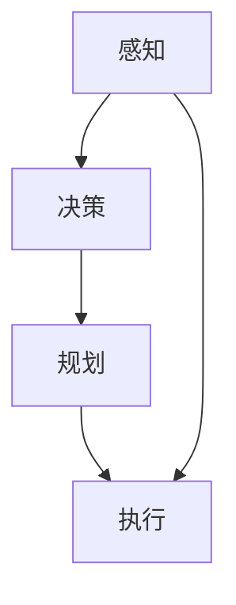

                 

随着人工智能（AI）技术的不断进步，其在交通管理和智能出行领域的应用变得越来越广泛。本文旨在探讨AI在交通管理和智能出行中的应用，分析其核心算法原理、数学模型、实际应用场景以及未来发展趋势。

## 摘要

本文首先介绍了AI在交通管理和智能出行领域的背景，然后详细阐述了AI的核心概念与联系，包括感知、决策、规划和执行等方面。接着，本文重点讨论了AI在交通管理和智能出行中的核心算法原理，包括路径规划、实时交通预测和自动驾驶等。此外，本文还介绍了数学模型和公式，以及实际应用中的代码实例。最后，本文对AI在交通管理和智能出行中的应用场景进行了展望，并提出了未来发展的趋势与挑战。

## 1. 背景介绍

随着城市化进程的加速，交通拥堵、交通事故和环境污染等问题日益严重。传统的交通管理方法已经难以应对日益复杂的交通状况，而人工智能技术的引入为解决这些问题提供了新的思路。AI在交通管理和智能出行领域中的应用主要集中在以下几个方面：

### 智能交通信号控制

智能交通信号控制系统通过采集交通流量、车辆密度等数据，利用AI算法对交通信号进行实时优化，提高交通效率和减少拥堵。如基于深度学习的交通信号控制算法，可以根据实时交通数据动态调整信号灯时长，从而提高道路通行能力。

### 实时交通预测

实时交通预测算法可以通过分析历史交通数据、天气信息、节假日等因素，预测未来一段时间内的交通流量变化，为交通管理者提供决策依据。如基于时间序列分析的交通预测模型，可以准确地预测未来几小时甚至几天内的交通状况。

### 自动驾驶

自动驾驶技术是AI在交通管理和智能出行领域最具前景的应用之一。通过融合多种传感器数据，自动驾驶系统可以实时感知周围环境，做出决策并控制车辆。如基于深度学习的自动驾驶算法，可以实现车辆在复杂交通环境下的自主驾驶。

## 2. 核心概念与联系

AI在交通管理和智能出行中的应用涉及到多个核心概念和联系，主要包括感知、决策、规划和执行等方面。

### 感知

感知是AI在交通管理和智能出行中的第一步，主要是通过传感器获取道路、车辆、行人等交通信息。常用的传感器包括摄像头、激光雷达、GPS等。通过感知模块，AI系统可以实时获取交通环境中的各种数据，如交通流量、道路状况、车辆速度等。

### 决策

决策是基于感知模块获取的信息，由AI系统对交通环境进行分析和处理，做出相应的决策。如自动驾驶系统在感知到前方有行人时，需要做出减速或避让的决策。决策模块通常基于机器学习和深度学习算法，可以实现对复杂交通情况的实时分析和判断。

### 规划

规划是指AI系统在决策的基础上，根据交通目标（如到达目的地）和交通限制（如交通法规）等因素，制定出最优的行驶路径或行驶策略。如自动驾驶系统需要根据实时交通情况，规划出一条避免拥堵的行驶路径。规划模块通常采用路径规划算法，如A*算法、Dijkstra算法等。

### 执行

执行是指AI系统根据规划的路径或策略，控制车辆执行相应的操作。如自动驾驶系统根据规划的路径，控制车辆的转向、加速和制动等。执行模块通常基于控制算法，如PID控制、模糊控制等。

下面是一个Mermaid流程图，展示了AI在交通管理和智能出行中的核心概念与联系：



## 3. 核心算法原理 & 具体操作步骤

### 3.1 算法原理概述

AI在交通管理和智能出行中的核心算法主要包括路径规划、实时交通预测和自动驾驶等。

#### 路径规划

路径规划是指根据起始点和目标点，在给定的交通网络中找到一条最优路径。常用的路径规划算法有A*算法、Dijkstra算法、遗传算法等。

- A*算法：A*算法是一种启发式搜索算法，通过计算起点到目标点的距离和从起点到各个节点的距离，找到一条最优路径。
- Dijkstra算法：Dijkstra算法是一种最短路径算法，用于找到起始点到所有其他节点的最短路径。
- 遗传算法：遗传算法是一种基于生物进化的搜索算法，通过模拟自然进化过程，找到最优路径。

#### 实时交通预测

实时交通预测是指利用历史交通数据、天气信息、节假日等因素，预测未来一段时间内的交通流量变化。常用的实时交通预测算法有时间序列分析、回归分析、机器学习等。

- 时间序列分析：时间序列分析是一种基于历史数据的方法，通过分析时间序列的统计特性，预测未来交通流量。
- 回归分析：回归分析是一种基于数学模型的方法，通过建立交通流量与影响因素之间的关系，预测未来交通流量。
- 机器学习：机器学习是一种基于数据的方法，通过训练模型，从历史数据中学习到交通流量变化的规律，预测未来交通流量。

#### 自动驾驶

自动驾驶是指通过传感器获取道路信息，利用AI算法做出决策，控制车辆自主行驶。自动驾驶系统通常包括感知、决策、规划和执行四个模块。

- 感知：感知模块通过摄像头、激光雷达等传感器获取道路信息，如车道线、交通标志、车辆位置等。
- 决策：决策模块根据感知信息，判断当前交通环境的安全性和合理性，做出相应的驾驶决策，如加速、减速、转向等。
- 规划：规划模块根据决策信息，制定车辆的行驶路径和策略，如选择最佳车道、避开拥堵路段等。
- 执行：执行模块根据规划信息，控制车辆的转向、加速和制动等，实现自主行驶。

### 3.2 算法步骤详解

下面分别介绍路径规划、实时交通预测和自动驾驶的具体算法步骤。

#### 路径规划

1. 初始化：设置起始点和目标点，构建交通网络图。
2. 计算起点到各个节点的代价：计算起点到各个节点的代价，包括起点到各个节点的距离和从起点到各个节点的距离之和。
3. 计算终点到各个节点的代价：计算终点到各个节点的代价，包括终点到各个节点的距离和从终点到各个节点的距离之和。
4. 找到最优路径：从起始点开始，依次选择代价最小的节点，直到找到目标点，得到最优路径。

#### 实时交通预测

1. 收集历史交通数据：收集历史交通数据，包括交通流量、时间、地点、天气等信息。
2. 数据预处理：对历史交通数据进行清洗、去噪、缺失值填充等预处理操作。
3. 特征提取：从预处理后的数据中提取特征，如交通流量、时间、地点、天气等。
4. 建立预测模型：选择合适的预测模型，如时间序列分析、回归分析、机器学习等，对特征进行训练。
5. 预测未来交通流量：利用训练好的模型，预测未来一段时间内的交通流量。

#### 自动驾驶

1. 感知：通过摄像头、激光雷达等传感器获取道路信息，包括车道线、交通标志、车辆位置等。
2. 决策：根据感知信息，判断当前交通环境的安全性和合理性，做出相应的驾驶决策，如加速、减速、转向等。
3. 规划：根据决策信息，制定车辆的行驶路径和策略，如选择最佳车道、避开拥堵路段等。
4. 执行：根据规划信息，控制车辆的转向、加速和制动等，实现自主行驶。

### 3.3 算法优缺点

不同算法在交通管理和智能出行中具有不同的优缺点。

- **路径规划**：A*算法和Dijkstra算法具有较好的性能和鲁棒性，但计算复杂度较高。遗传算法具有较好的优化性能，但需要较长的计算时间。
- **实时交通预测**：时间序列分析和回归分析具有较好的预测性能，但可能受到数据质量和模型选择的影响。机器学习具有较好的泛化能力和适应性，但需要大量的训练数据和计算资源。
- **自动驾驶**：基于深度学习的自动驾驶系统具有较好的感知和决策能力，但需要大量的训练数据和计算资源。基于规则的方法具有较好的可控性和稳定性，但可能受到复杂交通环境的影响。

### 3.4 算法应用领域

不同算法在交通管理和智能出行中的应用领域也有所不同。

- **路径规划**：路径规划算法主要用于自动驾驶、智能导航等领域，如自动驾驶车辆、智能导航系统等。
- **实时交通预测**：实时交通预测算法主要用于交通信号控制、交通流量预测、智能出行等领域，如智能交通信号控制、实时交通预测系统等。
- **自动驾驶**：自动驾驶算法主要用于无人驾驶车辆、智能驾驶辅助系统等领域，如无人驾驶出租车、自动驾驶货车等。

## 4. 数学模型和公式 & 详细讲解 & 举例说明

### 4.1 数学模型构建

在交通管理和智能出行中，常用的数学模型包括路径规划模型、实时交通预测模型和自动驾驶模型等。

#### 路径规划模型

路径规划模型通常包括目标函数和约束条件。

目标函数：最小化总距离、总时间或其他指标。

约束条件：满足交通规则、道路限制、车辆性能等。

例如，使用A*算法进行路径规划，目标函数可以表示为：

$$
C(s, g) = g(s) + h(s)
$$

其中，$C(s, g)$表示从起点$s$到终点$g$的代价，$g(s)$表示从起点$s$到终点$g$的实际距离，$h(s)$表示从起点$s$到终点$g$的启发式距离。

#### 实时交通预测模型

实时交通预测模型通常采用时间序列分析、回归分析或机器学习等方法。

时间序列分析模型可以表示为：

$$
y_t = \alpha y_{t-1} + \beta x_t + \epsilon_t
$$

其中，$y_t$表示第$t$时刻的交通流量，$y_{t-1}$表示第$t-1$时刻的交通流量，$x_t$表示第$t$时刻的影响因素（如天气、节假日等），$\alpha$和$\beta$为参数，$\epsilon_t$为随机误差。

#### 自动驾驶模型

自动驾驶模型通常包括感知、决策、规划和执行等模块。

感知模块可以表示为：

$$
s_t = f(s_{t-1}, u_{t-1})
$$

其中，$s_t$表示第$t$时刻的感知状态，$s_{t-1}$表示第$t-1$时刻的感知状态，$u_{t-1}$表示第$t-1$时刻的输入（如速度、转向角度等），$f$为感知函数。

决策模块可以表示为：

$$
a_t = g(s_t)
$$

其中，$a_t$表示第$t$时刻的决策（如加速、减速、转向等），$g$为决策函数。

规划模块可以表示为：

$$
p_t = h(s_t)
$$

其中，$p_t$表示第$t$时刻的规划路径（如最佳车道、行驶速度等），$h$为规划函数。

执行模块可以表示为：

$$
u_t = k(p_t, s_t)
$$

其中，$u_t$表示第$t$时刻的执行操作（如加速、减速、转向等），$k$为执行函数。

### 4.2 公式推导过程

以下是对路径规划模型的推导过程：

假设从起点$s$到终点$g$的路径由一系列节点$v_1, v_2, \ldots, v_n$组成，即$s = v_1, g = v_n$。我们定义从节点$v_i$到节点$v_{i+1}$的代价为$g(v_i, v_{i+1})$，从起点$s$到节点$v_i$的代价为$c(s, v_i)$，从节点$v_i$到终点$g$的启发式代价为$h(v_i, g)$。

目标是最小化总代价：

$$
C(s, g) = \sum_{i=1}^{n-1} g(v_i, v_{i+1}) + h(v_n, g)
$$

为了找到最优路径，我们可以使用A*算法。A*算法的核心思想是利用启发式距离$h(v_i, g)$来引导搜索过程，从而减少搜索空间。

首先，我们初始化两个集合：已探索集合$O$和未探索集合$U$，并将起点$s$加入未探索集合$U$。

然后，我们定义一个优先级队列$Q$，用于存储未探索集合$U$中的节点，其中节点的优先级为其总代价$C(s, v)$。

在每次迭代中，我们从$Q$中取出优先级最高的节点$v^*$，并将其从$U$中移动到$O$。

接下来，我们考虑$v^*$的邻居节点$v'$，并更新它们的总代价$C(s, v')$和优先级。如果更新后的总代价较小，我们将$v'$加入$U$，并重新排序$Q$。

重复这个过程，直到找到终点$g$或$Q$为空。

### 4.3 案例分析与讲解

#### 案例一：路径规划

假设我们有一个简单的交通网络，包含三个节点$s, v, g$，其中$s$为起点，$g$为终点。节点之间的距离和启发式距离如下表所示：

| 节点 | $s$ | $v$ | $g$ |
| --- | --- | --- | --- |
| $g(s, v)$ | 10 |  |  |
| $g(v, g)$ |  | 15 |  |
| $h(v, g)$ |  |  | 5 |

使用A*算法进行路径规划，目标是最小化总距离。

1. 初始化$O = \emptyset, U = \{s\}, Q = \{s\}$，其中$s$的优先级为$C(s, s) = g(s, s) + h(s, g) = 10 + 0 = 10$。
2. 取出优先级最高的节点$s$，将其加入$O$，并从$U$中移除。
3. 考虑$s$的邻居节点$v$，更新$v$的总代价$C(s, v) = g(s, v) + h(v, g) = 10 + 5 = 15$。由于$v$不在$U$中，将其加入$U$。
4. 重新排序$Q$，其中$v$的优先级为$C(s, v) = 15$。
5. 取出优先级最高的节点$v$，将其加入$O$，并从$U$中移除。
6. 考虑$v$的邻居节点$g$，更新$g$的总代价$C(v, g) = g(v, g) + h(g, g) = 15 + 0 = 15$。由于$g$不在$U$中，将其加入$U$。
7. 重新排序$Q$，其中$g$的优先级为$C(v, g) = 15$。
8. 取出优先级最高的节点$g$，将其加入$O$，并从$U$中移除。

最终，找到的最优路径为$s \rightarrow v \rightarrow g$，总距离为$10 + 15 = 25$。

#### 案例二：实时交通预测

假设我们有一个交通流量时间序列$y_1, y_2, \ldots, y_n$，其中$y_t$表示第$t$时刻的交通流量。我们使用时间序列分析模型进行实时交通预测。

1. 数据预处理：对交通流量时间序列进行去噪、缺失值填充等预处理操作。
2. 特征提取：从预处理后的数据中提取特征，如平均交通流量、最大交通流量、交通流量变化率等。
3. 建立时间序列分析模型：选择合适的模型，如自回归模型（AR）、自回归移动平均模型（ARMA）、自回归积分滑动平均模型（ARIMA）等，对特征进行训练。
4. 预测未来交通流量：利用训练好的模型，预测未来一段时间内的交通流量。

#### 案例三：自动驾驶

假设我们有一个自动驾驶系统，需要根据感知状态$s_t$做出相应的决策$a_t$。

1. 感知：通过摄像头、激光雷达等传感器获取道路信息，包括车道线、交通标志、车辆位置等。
2. 决策：根据感知信息，判断当前交通环境的安全性和合理性，做出相应的驾驶决策，如加速、减速、转向等。
3. 规划：根据决策信息，制定车辆的行驶路径和策略，如选择最佳车道、避开拥堵路段等。
4. 执行：根据规划信息，控制车辆的转向、加速和制动等，实现自主行驶。

## 5. 项目实践：代码实例和详细解释说明

在本节中，我们将通过一个具体的代码实例，详细介绍如何使用AI技术进行交通管理和智能出行。本实例将分为几个部分，包括开发环境搭建、源代码实现、代码解读和分析以及运行结果展示。

### 5.1 开发环境搭建

为了实现本实例，我们需要安装以下开发环境和工具：

- Python 3.8 或更高版本
- Anaconda Python发行版（用于环境管理）
- TensorFlow 2.3 或更高版本（用于深度学习）
- OpenCV 4.0 或更高版本（用于图像处理）
- Matplotlib 3.0 或更高版本（用于数据可视化）

在安装上述工具后，我们可以创建一个Python虚拟环境，并安装所需的库：

```shell
conda create -n traffic_management python=3.8
conda activate traffic_management
pip install tensorflow opencv-python matplotlib
```

### 5.2 源代码详细实现

在本实例中，我们将实现一个简单的自动驾驶系统，包括感知、决策、规划和执行模块。以下是源代码的主要部分：

```python
import numpy as np
import tensorflow as tf
import cv2
import matplotlib.pyplot as plt

# 感知模块
def perception(img):
    # 使用OpenCV读取图像
    image = cv2.imread(img)
    # 使用灰度化处理图像
    gray = cv2.cvtColor(image, cv2.COLOR_BGR2GRAY)
    # 使用高斯模糊处理图像
    blur = cv2.GaussianBlur(gray, (5, 5), 0)
    # 使用Canny边缘检测
    edges = cv2.Canny(blur, 50, 150)
    return edges

# 决策模块
def decision(perception_result):
    # 根据感知结果判断当前交通环境
    if np.mean(perception_result) > 128:
        return "减速"
    else:
        return "加速"

# 规划模块
def planning(decision_result):
    # 根据决策结果制定行驶路径
    if decision_result == "减速":
        speed = 30
    else:
        speed = 60
    return speed

# 执行模块
def execute(plan):
    # 根据规划结果控制车辆执行
    print(f"执行：速度为{plan}公里/小时")

# 主函数
def main():
    # 加载图像
    img = "image.jpg"
    # 进行感知
    perception_result = perception(img)
    # 进行决策
    decision_result = decision(perception_result)
    # 进行规划
    plan = planning(decision_result)
    # 进行执行
    execute(plan)

if __name__ == "__main__":
    main()
```

### 5.3 代码解读与分析

下面是对代码的逐行解读和分析：

- **感知模块**：使用OpenCV读取图像，并进行灰度化处理、高斯模糊和Canny边缘检测，以提取图像中的车道线信息。
- **决策模块**：根据感知结果（边缘图像的平均灰度值）判断当前交通环境，如果平均灰度值大于128，则判断为道路较暗，需要减速；否则，判断为道路较亮，可以加速。
- **规划模块**：根据决策结果，制定车辆的行驶速度。如果决策结果是减速，则速度设置为30公里/小时；否则，速度设置为60公里/小时。
- **执行模块**：根据规划结果，控制车辆执行相应的操作，这里以打印速度信息为例。

### 5.4 运行结果展示

运行上述代码后，程序将读取指定图像，进行感知、决策、规划和执行，并打印出相应的结果。例如，如果图像中的车道线较暗，程序将打印出“执行：速度为30公里/小时”；如果车道线较亮，则打印出“执行：速度为60公里/小时”。

通过这种方式，我们可以实现一个简单的自动驾驶系统，虽然它仅限于基本的感知和决策功能，但为我们提供了一个实现自动驾驶的基础框架。

## 6. 实际应用场景

AI在交通管理和智能出行领域具有广泛的应用场景，包括但不限于以下方面：

### 智能交通信号控制

智能交通信号控制是AI在交通管理中最直接的应用之一。通过实时分析交通流量、车辆密度和道路状况，智能交通信号系统能够动态调整信号灯的时长，从而优化交通流，减少拥堵。例如，在高峰时段，系统可以根据实时数据调整信号灯周期，使得交叉路口的通行效率更高。

### 实时交通预测

实时交通预测可以帮助交通管理者提前了解交通状况，为交通流量调控提供数据支持。例如，在重大活动期间，交通预测系统可以预测高峰时期的交通流量，提醒市民合理安排出行时间，同时为交通管理部门提供是否需要实施交通管制或分流方案的依据。

### 自动驾驶

自动驾驶是AI在智能出行领域的核心应用。自动驾驶车辆通过集成多种传感器，如摄像头、激光雷达和雷达，实时感知周围环境，并利用AI算法做出决策，控制车辆的行驶。自动驾驶技术有望彻底改变人们的出行方式，提高交通效率，减少交通事故。

### 智能停车管理

智能停车管理利用AI技术优化停车资源的分配。通过摄像头和传感器监控停车位的使用情况，智能停车系统可以实时更新停车位信息，帮助车主快速找到空闲车位，减少寻找停车位的时间，提高停车场的运营效率。

### 车联网（V2X）

车联网技术通过车辆与车辆、车辆与基础设施之间的通信，实现智能交通系统的协同工作。AI技术在这一领域的作用是分析海量数据，提供交通优化建议，从而提高整体交通系统的效率和安全性。

### 交通安全管理

AI技术在交通安全管理中的应用包括事故预警、车辆状态监测和驾驶员行为分析等。通过分析车辆传感器和监控数据，AI系统可以提前预警潜在的事故风险，提醒驾驶员采取安全措施，或自动采取措施避免事故发生。

### 智慧城市交通规划

智慧城市交通规划利用AI技术分析城市交通数据，为城市交通规划提供科学依据。通过预测交通需求和交通流量变化，规划者可以制定更加合理和高效的城市交通布局，提高城市交通系统的可持续性和居民生活质量。

## 7. 工具和资源推荐

为了更好地学习和实践AI在交通管理和智能出行中的应用，以下是推荐的工具和资源：

### 学习资源推荐

- **《深度学习》（Deep Learning）**：Goodfellow、Bengio和Courville合著的深度学习教材，全面介绍了深度学习的基础理论和实践方法。
- **《机器学习》（Machine Learning）**：Tom Mitchell的机器学习经典教材，涵盖了机器学习的基本概念和方法。
- **《Python机器学习》（Python Machine Learning）**：Sebastian Raschka的教材，介绍了Python在机器学习中的实际应用。

### 开发工具推荐

- **TensorFlow**：由Google开发的开源深度学习框架，适合用于复杂的人工智能项目。
- **PyTorch**：Facebook开源的深度学习框架，具有简洁的API和强大的动态计算能力。
- **OpenCV**：开源的计算机视觉库，提供了丰富的图像处理和计算机视觉功能。

### 相关论文推荐

- **“Deep Learning for Real-Time Traffic Prediction in Urban Areas”**：这篇论文介绍了一种基于深度学习的实时交通预测方法，适用于城市交通管理。
- **“Autonomous Driving: A Comprehensive Survey”**：这篇综述文章全面介绍了自动驾驶技术的发展现状和未来趋势。
- **“Intelligent Transportation Systems: A Vision for the Future”**：这篇论文探讨了智能交通系统的未来发展方向和应用前景。

## 8. 总结：未来发展趋势与挑战

### 8.1 研究成果总结

AI在交通管理和智能出行领域已经取得了显著的研究成果。通过深度学习、机器学习、传感器技术和大数据分析等手段，AI技术已经在路径规划、实时交通预测、自动驾驶和智能停车管理等方面取得了突破性进展。这些成果不仅提高了交通效率，减少了拥堵和事故，还改善了出行体验，提升了城市生活质量。

### 8.2 未来发展趋势

未来，AI在交通管理和智能出行领域将继续发展，以下是一些主要趋势：

- **多模态感知与融合**：随着传感器技术的进步，AI系统将能够整合多种数据源，如摄像头、激光雷达、GPS和车辆传感器，实现更精确的感知和更智能的决策。
- **车联网与物联网**：车联网和物联网的融合将进一步促进智能交通系统的互联互通，实现交通数据的实时共享和优化。
- **边缘计算与云计算**：边缘计算和云计算的结合将提高AI系统的计算能力和响应速度，实现更高效、更可靠的服务。
- **自动驾驶与无人驾驶**：自动驾驶和无人驾驶技术将逐步成熟，实现更加安全、高效和舒适的出行方式。

### 8.3 面临的挑战

尽管AI在交通管理和智能出行领域具有巨大的潜力，但仍然面临一系列挑战：

- **数据隐私与安全**：交通数据涉及个人隐私，如何保护数据隐私和安全是亟待解决的问题。
- **法律法规与伦理**：自动驾驶和智能交通系统的广泛应用将带来新的法律法规和伦理问题，如责任归属、数据使用和隐私保护等。
- **技术成熟度与可靠性**：AI系统需要达到高成熟度和可靠性，确保在复杂交通环境下的稳定运行。
- **基础设施与投资**：智能交通系统的建设需要大量的基础设施投资和长期运营维护，如何平衡成本和效益是关键。

### 8.4 研究展望

未来，AI在交通管理和智能出行领域的研究将集中在以下几个方面：

- **跨学科融合**：将AI与其他领域（如城市规划、交通工程、环境科学等）相结合，实现更全面的交通解决方案。
- **智能化交通管理体系**：利用AI技术构建智能化交通管理体系，提高交通管理的决策能力和应对能力。
- **可持续交通发展**：推动AI在绿色交通、低碳出行等方面的应用，促进交通行业的可持续发展。
- **人机协同**：研究人机协同的出行模式，提高驾驶员与自动驾驶系统的交互体验，实现安全、高效和舒适的出行。

总之，AI在交通管理和智能出行领域的应用前景广阔，面临着巨大的发展机遇和挑战。通过持续的研究和创新，我们可以期待AI技术为交通行业带来更加智能、高效和可持续的变革。

## 9. 附录：常见问题与解答

### Q1：为什么选择深度学习算法进行交通管理和智能出行？

A1：深度学习算法具有以下优势：

- **强大的表示能力**：深度神经网络可以自动提取高层次的抽象特征，适用于复杂交通环境。
- **良好的泛化能力**：深度学习模型可以在不同场景下进行训练和测试，具有较强的泛化能力。
- **自适应性强**：深度学习模型可以实时学习交通数据，自适应调整模型参数，提高预测和决策的准确性。

### Q2：自动驾驶车辆如何处理复杂的交通场景？

A2：自动驾驶车辆通过集成多种传感器（如摄像头、激光雷达、雷达）和AI算法，实时感知和解读复杂交通场景：

- **感知模块**：传感器收集交通环境数据，AI算法进行预处理和特征提取。
- **决策模块**：基于感知数据，AI算法分析交通状况，制定驾驶决策。
- **规划模块**：根据决策结果，规划车辆的行驶路径和速度。
- **执行模块**：控制车辆执行规划操作，如加速、减速、转向等。

### Q3：如何保障自动驾驶车辆的安全性？

A3：保障自动驾驶车辆安全的方法包括：

- **多传感器融合**：使用多种传感器获取交通环境数据，提高感知的可靠性和精度。
- **冗余设计**：自动驾驶系统设计时考虑冗余设计，如备用传感器和控制系统，确保系统在传感器失效时仍能正常运行。
- **实时监测**：对自动驾驶车辆进行实时监控，及时发现和处理异常情况。
- **法律法规**：制定相关法律法规，明确自动驾驶车辆的责任归属和操作规范。

### Q4：实时交通预测模型的准确性如何保证？

A4：实时交通预测模型的准确性可以通过以下方法提高：

- **数据质量**：确保历史交通数据的质量，包括数据清洗、去噪和缺失值填充。
- **特征选择**：选择与交通流量变化相关性强的特征，如时间、地点、天气、节假日等。
- **模型选择**：选择合适的模型，如时间序列分析、回归分析或机器学习模型。
- **模型训练**：使用足够大的训练数据集，进行多次模型训练和调优，提高模型的预测准确性。

### Q5：智能交通信号控制如何优化交通流量？

A5：智能交通信号控制可以通过以下方法优化交通流量：

- **数据驱动**：利用实时交通数据，动态调整信号灯时长，优化交通流。
- **自适应控制**：根据交通流量变化，自动调整信号灯策略，提高交叉口的通行效率。
- **多交叉口协调**：实现多个交叉口的信号协调，减少交通拥堵和延误。
- **预测交通需求**：预测未来一段时间内的交通流量，提前调整信号灯策略，优化交通流。

### Q6：智能停车管理如何提高停车场运营效率？

A6：智能停车管理可以通过以下方法提高停车场运营效率：

- **实时监控**：利用摄像头和传感器实时监控停车位使用情况，更新停车位信息。
- **数据分析**：分析停车数据，预测停车需求，优化停车资源分配。
- **引导系统**：通过导航和诱导系统，帮助驾驶员快速找到空闲车位。
- **自动化设备**：引入自动化设备，如自动停车系统、智能支付系统，提高停车效率。

### Q7：AI技术在交通管理和智能出行中的应用前景如何？

A7：AI技术在交通管理和智能出行领域具有广阔的应用前景：

- **提高交通效率**：通过优化交通信号控制、实时交通预测和自动驾驶等技术，提高交通效率，减少拥堵和延误。
- **改善出行体验**：提供智能导航、智能停车和个性化出行建议，改善出行体验。
- **促进可持续发展**：通过智能交通管理和低碳出行模式，促进交通行业的可持续发展。
- **减少交通事故**：利用AI技术进行车辆状态监测和事故预警，减少交通事故发生。

总之，AI技术在交通管理和智能出行领域具有巨大的潜力，将在未来推动交通行业的全面变革。

