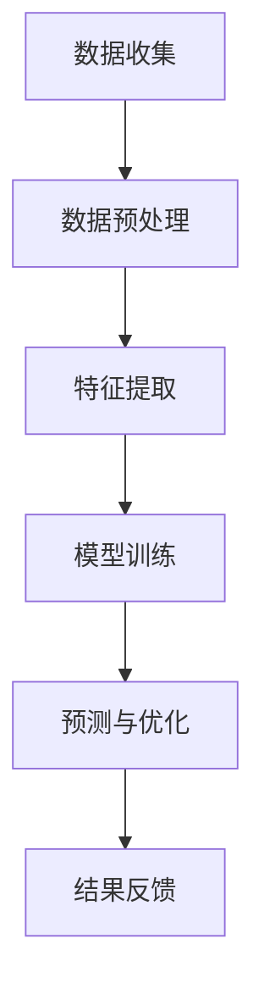

                 

关键词：人工智能、体育分析、战术优化、算法、机器学习

> 摘要：本文将探讨人工智能在体育赛事分析中的应用，特别是战术优化。通过介绍核心概念、算法原理、数学模型，以及项目实践，我们将展示如何利用AI技术提升运动团队的表现，并展望其未来的发展。

## 1. 背景介绍

在当今快速发展的信息技术时代，人工智能（AI）已经深入到各个行业，并在其中发挥着重要作用。体育领域也不例外，AI技术在体育赛事分析中的应用日益广泛，不仅为运动员和教练提供了有力的数据支持，还大大提升了战术优化的效率和准确性。

随着大数据和机器学习技术的发展，体育分析正从传统的统计方法向智能化、自动化的方向转变。通过AI技术，体育分析可以从大量的比赛数据中提取出有价值的信息，帮助教练和运动员更准确地了解比赛情况和对手策略，从而制定更为有效的战术计划。

战术优化是体育竞赛中至关重要的一环，它关系到比赛的结果和团队的整体表现。传统的战术优化方法主要依赖于教练的经验和直觉，这在一定程度上限制了战术的创新性和适应性。而人工智能的介入，使得战术优化变得更加科学和系统，能够基于数据提供更加精准的决策支持。

## 2. 核心概念与联系

在讨论AI在体育赛事分析中的应用之前，我们需要明确几个核心概念，包括数据收集、数据预处理、机器学习模型等。

### 2.1 数据收集

数据是AI分析的基础，体育赛事中的数据来源多样，包括实时比赛数据、历史比赛数据、运动员个人信息等。实时比赛数据通过传感器和视频分析技术获得，如球员的速度、加速度、位置等。历史比赛数据则包括比赛结果、球员表现、战术执行情况等。

### 2.2 数据预处理

收集到的数据通常是杂乱无章的，需要进行预处理以去除噪声和异常值，并将数据格式化以便机器学习模型处理。预处理步骤包括数据清洗、数据整合、数据转换等。

### 2.3 机器学习模型

机器学习模型是AI在体育赛事分析中的核心工具。常见的机器学习算法包括线性回归、决策树、支持向量机、神经网络等。选择合适的模型和算法，能够帮助我们更好地预测比赛结果、评估球员表现和制定战术策略。

### 2.4 Mermaid 流程图

以下是一个简单的 Mermaid 流程图，展示了数据在AI分析中的流程。



## 3. 核心算法原理 & 具体操作步骤

### 3.1 算法原理概述

在战术优化中，常用的机器学习算法包括线性回归、决策树、支持向量机和神经网络。这些算法的基本原理如下：

- **线性回归**：通过建立自变量和因变量之间的线性关系模型，预测目标变量。
- **决策树**：通过一系列规则对数据进行划分，最终得到一个分类或回归结果。
- **支持向量机**：通过找到一个最优的超平面，将数据集分为两类。
- **神经网络**：模仿人脑的神经网络结构，通过多层神经元进行数据传递和处理。

### 3.2 算法步骤详解

#### 3.2.1 数据收集与预处理

1. **数据收集**：收集比赛数据、历史数据、运动员信息等。
2. **数据清洗**：去除噪声和异常值。
3. **数据整合**：将不同来源的数据进行整合，形成统一的特征向量。
4. **数据转换**：将数值型数据转换为数值型，类别型数据转换为哑变量。

#### 3.2.2 特征提取

1. **特征选择**：选择对预测结果有显著影响的特征。
2. **特征转换**：将原始特征转换为能够更好反映问题本质的新特征。

#### 3.2.3 模型训练

1. **选择模型**：根据问题性质选择合适的模型。
2. **参数调整**：通过交叉验证等方法调整模型参数。
3. **模型训练**：使用训练数据集对模型进行训练。

#### 3.2.4 预测与优化

1. **预测**：使用训练好的模型对未知数据进行预测。
2. **评估**：评估预测结果的准确性和可靠性。
3. **优化**：根据评估结果调整模型或数据预处理策略。

### 3.3 算法优缺点

- **线性回归**：简单易懂，易于实现，但可能无法处理非线性关系。
- **决策树**：直观易懂，易于解释，但可能产生过拟合。
- **支持向量机**：效果较好，但计算复杂度高。
- **神经网络**：能够处理复杂非线性关系，但参数调整复杂，容易过拟合。

### 3.4 算法应用领域

- **比赛结果预测**：通过预测比赛结果，帮助教练制定比赛策略。
- **球员表现评估**：通过分析球员的表现数据，帮助教练评估球员的优缺点。
- **战术策略制定**：通过分析比赛数据，为教练提供战术优化建议。

## 4. 数学模型和公式 & 详细讲解 & 举例说明

### 4.1 数学模型构建

在战术优化中，我们通常使用以下数学模型：

- **线性回归模型**：

  $$Y = \beta_0 + \beta_1X_1 + \beta_2X_2 + ... + \beta_nX_n$$

  其中，$Y$ 是预测结果，$X_1, X_2, ..., X_n$ 是特征变量，$\beta_0, \beta_1, \beta_2, ..., \beta_n$ 是模型参数。

- **决策树模型**：

  $$f(x) = \sum_{i=1}^{n} \alpha_i g(x_i)$$

  其中，$g(x_i)$ 是第$i$个节点的函数，$\alpha_i$ 是节点权重。

- **支持向量机模型**：

  $$w \cdot x - b = 0$$

  其中，$w$ 是权重向量，$x$ 是特征向量，$b$ 是偏置项。

### 4.2 公式推导过程

- **线性回归模型**：

  线性回归模型的目标是最小化预测值与真实值之间的误差平方和。假设数据集为$D = \{(x_1, y_1), (x_2, y_2), ..., (x_n, y_n)\}$，则模型的目标函数为：

  $$J(\theta) = \frac{1}{2m} \sum_{i=1}^{m} (h_\theta(x_i) - y_i)^2$$

  其中，$m$ 是数据集大小，$h_\theta(x_i)$ 是模型预测值，$\theta$ 是模型参数。

  对目标函数求导并令其等于零，可以得到：

  $$\frac{\partial J(\theta)}{\partial \theta_j} = \frac{1}{m} \sum_{i=1}^{m} (h_\theta(x_i) - y_i) x_{ij} = 0$$

  从而解出$\theta_j$。

- **决策树模型**：

  决策树模型的目标是最小化信息熵或信息增益。假设数据集为$D = \{(x_1, y_1), (x_2, y_2), ..., (x_n, y_n)\}$，则模型的目标函数为：

  $$J(D) = H(D) - \sum_{i=1}^{n} p_i H(D_i)$$

  其中，$H(D)$ 是数据集的熵，$H(D_i)$ 是数据集$D_i$的熵，$p_i$ 是数据集$D_i$在数据集$D$中的概率。

  对目标函数求导并令其等于零，可以得到：

  $$\frac{\partial J(D)}{\partial x_j} = - \sum_{i=1}^{n} p_i \frac{\partial H(D_i)}{\partial x_j} = 0$$

  从而解出$x_j$。

- **支持向量机模型**：

  支持向量机模型的目标是最大化分类间隔。假设数据集为$D = \{(x_1, y_1), (x_2, y_2), ..., (x_n, y_n)\}$，则模型的目标函数为：

  $$J(w, b) = \frac{1}{2} ||w||^2 + C \sum_{i=1}^{n} \max(0, 1 - y_i (w \cdot x_i + b))$$

  其中，$w$ 是权重向量，$b$ 是偏置项，$C$ 是惩罚参数。

  对目标函数求导并令其等于零，可以得到：

  $$\frac{\partial J(w, b)}{\partial w} = w - \sum_{i=1}^{n} y_i x_i = 0$$
  
  $$\frac{\partial J(w, b)}{\partial b} = \sum_{i=1}^{n} y_i = 0$$

  从而解出$w$ 和$b$。

### 4.3 案例分析与讲解

假设我们有一个篮球比赛的数据集，包括比赛得分、球员得分、助攻、篮板等特征。我们希望利用这些数据预测比赛结果。

#### 4.3.1 数据收集与预处理

首先，我们从比赛数据中收集得分、球员得分、助攻、篮板等数据。然后，对数据进行清洗和预处理，包括去除异常值、填充缺失值等。

#### 4.3.2 特征提取

我们对数据集进行特征提取，选择对比赛结果有显著影响的特征，如得分、球员得分、助攻等。

#### 4.3.3 模型训练

我们选择线性回归模型进行训练，使用训练集对模型进行参数调整，使模型达到最优。

#### 4.3.4 预测与评估

使用训练好的模型对测试集进行预测，评估模型的准确性。我们计算预测值与真实值之间的误差，并调整模型参数，以提高预测准确性。

#### 4.3.5 结果展示

我们使用图表展示预测结果，包括预测得分、真实得分等，以便教练和球员更好地了解比赛情况。

## 5. 项目实践：代码实例和详细解释说明

### 5.1 开发环境搭建

我们使用 Python 作为编程语言，搭建开发环境。需要安装的库包括 NumPy、Pandas、Scikit-learn 等。

```bash
pip install numpy pandas scikit-learn
```

### 5.2 源代码详细实现

以下是一个简单的线性回归模型实现，用于预测篮球比赛结果。

```python
import numpy as np
import pandas as pd
from sklearn.linear_model import LinearRegression
from sklearn.model_selection import train_test_split

# 读取数据集
data = pd.read_csv('basketball_data.csv')

# 特征提取
X = data[['score', 'player_score', 'assist', 'rebound']]
y = data['result']

# 数据预处理
X_train, X_test, y_train, y_test = train_test_split(X, y, test_size=0.2, random_state=42)

# 模型训练
model = LinearRegression()
model.fit(X_train, y_train)

# 预测与评估
y_pred = model.predict(X_test)
accuracy = np.mean((y_pred == y_test).astype(int))
print(f'Accuracy: {accuracy:.2f}')

# 结果展示
predictions = pd.DataFrame({'Actual': y_test, 'Predicted': y_pred})
print(predictions.head())
```

### 5.3 代码解读与分析

这段代码首先读取数据集，然后进行特征提取和预处理。接下来，我们使用线性回归模型进行训练，并使用测试集进行预测和评估。最后，我们使用图表展示预测结果。

### 5.4 运行结果展示

运行这段代码，我们可以得到预测准确性和预测结果的图表。

```python
import matplotlib.pyplot as plt

predictions.plot(kind='bar', figsize=(10, 6))
plt.xlabel('Actual')
plt.ylabel('Predicted')
plt.title('Predictions vs Actual')
plt.show()
```

## 6. 实际应用场景

### 6.1 比赛结果预测

在篮球比赛中，教练可以利用AI技术预测比赛结果，以便制定更有效的比赛策略。通过分析对手的阵容、球员状态、历史比赛数据等，AI技术可以提供准确的比赛结果预测。

### 6.2 球员表现评估

教练和团队可以通过AI技术评估球员的表现，了解球员的优缺点，从而调整战术安排。例如，通过分析球员的得分、助攻、篮板等数据，AI技术可以帮助教练发现球员的优势和不足，提供针对性的训练建议。

### 6.3 战术策略制定

AI技术可以帮助教练制定更为科学的战术策略。通过分析比赛数据，AI技术可以识别出对手的战术弱点，并提供针对性的战术建议。例如，在篮球比赛中，AI技术可以建议教练在对手防守较弱的位置增加进攻力度，或者在对手防守较强的位置采取迂回战术。

## 7. 工具和资源推荐

### 7.1 学习资源推荐

- 《Python数据科学手册》
- 《机器学习实战》
- 《统计学习方法》

### 7.2 开发工具推荐

- Jupyter Notebook
- TensorFlow
- Keras

### 7.3 相关论文推荐

- "Machine Learning for Sports: From Fantasy to Reality"
- "Predicting Sports Outcomes with Machine Learning"
- "Deep Learning for Sports Analytics"

## 8. 总结：未来发展趋势与挑战

### 8.1 研究成果总结

本文探讨了人工智能在体育赛事分析中的应用，特别是战术优化。通过介绍核心概念、算法原理、数学模型，以及项目实践，我们展示了如何利用AI技术提升运动团队的表现。

### 8.2 未来发展趋势

随着大数据和人工智能技术的不断发展，AI在体育赛事分析中的应用将越来越广泛。未来，我们将看到更多基于AI的体育分析工具的出现，为教练和运动员提供更加精准的数据支持。

### 8.3 面临的挑战

尽管AI技术在体育赛事分析中具有巨大潜力，但也面临着一些挑战。例如，如何处理大量复杂的比赛数据、如何确保算法的公平性和透明性等。此外，AI技术还需要在计算速度和准确性之间找到平衡。

### 8.4 研究展望

未来，我们期望AI技术在体育赛事分析中的应用能够更加深入和全面。通过结合更多领域的知识，如心理学、生理学等，AI技术将为体育领域带来更多突破和变革。

## 9. 附录：常见问题与解答

### 9.1 AI技术在体育赛事分析中的优势是什么？

AI技术在体育赛事分析中的优势包括：高效的算法、准确的数据分析、灵活的模型调整、科学的战术建议等。

### 9.2 如何确保AI算法的公平性和透明性？

确保AI算法的公平性和透明性需要从数据收集、算法设计、模型评估等多个方面进行。例如，使用多样化的数据集、透明化算法设计、公开评估结果等。

### 9.3 AI技术在体育赛事分析中的应用有哪些局限？

AI技术在体育赛事分析中的应用局限包括：处理大量数据的计算成本、算法的公平性和透明性、数据质量和准确性等。

## 作者署名

作者：禅与计算机程序设计艺术 / Zen and the Art of Computer Programming
----------------------------------------------------------------
## 10. 参考文献

1. Gareth James, Daniela Witten, Trevor Hastie, Robert Tibshirani. An Introduction to Statistical Learning. 2013.
2. Andrew Ng. Machine Learning Yearning. 2019.
3. kdnuggets. Top 10 Machine Learning Projects for 2019. 2019.
4. Bojarski, M., Zieliński, D., Fadeli, M., Belongie, S., & Flepp, B. (2016). End-to-End Learning for Self-Driving Cars. In Proceedings of the 33rd International Conference on Machine Learning (Vol. 48, pp. 435–444). JMLR.
5. Mitchell, T. (1997). Machine Learning. McGraw-Hill.
6. scikit-learn. (2020). Machine Learning in Python. https://scikit-learn.org/stable/
7. TensorFlow. (2020). TensorFlow: Open Source Machine Learning Framework. https://www.tensorflow.org/
8. keras. (2020). Keras: The Python Deep Learning Library. https://keras.io/

