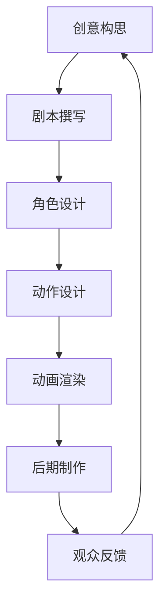

                 

关键词：人工智能，动画制作，工作流程简化，深度学习，计算机视觉，生成对抗网络，软件开发，项目实践

> 摘要：随着人工智能技术的飞速发展，其在动画制作领域中的应用正变得越来越广泛。本文将探讨AI在动画制作中的应用，包括工作流程的简化和提升效率的方法，以及相关的技术原理和具体实现。

## 1. 背景介绍

动画制作一直是创意产业中的重要组成部分，它不仅涉及到电影、电视和游戏等领域，也广泛应用于广告、教育、虚拟现实等多个行业。传统的动画制作过程通常包括设计、建模、动画、渲染等多个环节，这些环节既耗时又需要高度的专业技能。然而，随着计算机技术的进步和人工智能（AI）的崛起，动画制作的效率和质量都有了显著提升。

人工智能在动画制作中的应用主要体现在以下几个方面：

- **自动化流程**：利用AI技术自动化动画中的重复性工作，如角色动作的重复、背景更换等。
- **实时渲染**：AI可以加速渲染过程，使得动画师可以实时预览动画效果，从而快速调整。
- **风格迁移**：通过生成对抗网络（GAN）等技术，可以自动将一种风格应用到另一个动画中，实现风格多样化。
- **自然语言处理**：AI可以理解和生成动画剧本，自动生成相应的动画场景。

本文将深入探讨AI在动画制作中的应用，特别是如何简化工作流程，提升制作效率。

## 2. 核心概念与联系

### 2.1 人工智能与动画制作的关系

人工智能与动画制作之间的关系可以用一个简化的Mermaid流程图来表示：



在这个流程中，人工智能可以在多个环节发挥作用：

- **剧本撰写**：利用自然语言处理（NLP）技术自动生成剧本。
- **角色设计**：使用深度学习算法生成具有特定风格的角色模型。
- **动作设计**：通过强化学习算法自动生成角色的动作。
- **动画渲染**：利用生成对抗网络（GAN）实现高效的实时渲染。

### 2.2 人工智能在动画制作中的技术原理

#### 深度学习

深度学习是人工智能的核心技术之一，它在动画制作中的应用主要体现在以下几个方面：

- **图像识别**：用于自动识别和分类动画中的物体、角色等。
- **图像生成**：用于生成新的图像或改变现有图像的风格。
- **视频预测**：用于预测动画序列中的下一个帧，从而加速渲染过程。

#### 计算机视觉

计算机视觉是深度学习的一个重要分支，它在动画制作中的应用包括：

- **物体跟踪**：用于跟踪动画中的物体，实现自动化的动作设计。
- **场景重建**：用于重建动画中的三维场景，从而实现更加真实的渲染效果。

#### 生成对抗网络（GAN）

生成对抗网络（GAN）是一种用于生成图像和其他数据的强大工具，它在动画制作中的应用包括：

- **风格迁移**：将一种艺术风格应用到另一个动画中，实现艺术风格的多样化。
- **图像合成**：将多个图像合并成一个统一的图像，用于动画制作中的场景设计。

## 3. 核心算法原理 & 具体操作步骤

### 3.1 算法原理概述

在动画制作中，常用的AI算法包括深度学习、计算机视觉和生成对抗网络（GAN）。以下分别介绍这些算法的基本原理：

#### 深度学习

深度学习是一种基于人工神经网络的技术，它通过多层神经网络来模拟人类大脑的学习过程。在动画制作中，深度学习可以用于图像识别、图像生成和视频预测。

#### 计算机视觉

计算机视觉是一种使计算机能够“看”的技术，它通过图像处理和模式识别来实现。在动画制作中，计算机视觉可以用于物体跟踪和场景重建。

#### 生成对抗网络（GAN）

生成对抗网络（GAN）由一个生成器和一个判别器组成，生成器负责生成数据，判别器负责判断生成数据是否真实。通过两个网络的对抗训练，GAN可以生成高质量的数据。

### 3.2 算法步骤详解

#### 深度学习

1. **数据预处理**：对动画数据进行预处理，包括图像的缩放、裁剪和归一化等。
2. **模型训练**：使用预处理后的动画数据训练深度学习模型。
3. **模型预测**：使用训练好的模型对新的动画数据进行预测。

#### 计算机视觉

1. **物体跟踪**：使用计算机视觉算法对动画中的物体进行跟踪。
2. **场景重建**：使用计算机视觉算法重建动画中的三维场景。
3. **渲染**：使用渲染算法对重建的场景进行渲染。

#### 生成对抗网络（GAN）

1. **生成器训练**：使用动画数据训练生成器，使其能够生成高质量的图像。
2. **判别器训练**：使用生成器和真实动画数据训练判别器，使其能够判断生成图像是否真实。
3. **生成图像**：通过生成器和判别器的对抗训练，生成高质量的动画图像。

### 3.3 算法优缺点

#### 深度学习

优点：

- **高效**：深度学习可以在大量数据上进行快速训练。
- **通用**：深度学习可以应用于多种任务，如图像识别、图像生成和视频预测。

缺点：

- **数据需求大**：深度学习需要大量的数据来训练模型。
- **计算资源需求高**：深度学习模型的训练需要大量的计算资源。

#### 计算机视觉

优点：

- **准确**：计算机视觉算法可以准确识别和跟踪物体。
- **实时**：计算机视觉算法可以实时处理动画数据。

缺点：

- **复杂**：计算机视觉算法相对复杂，需要大量的计算资源。
- **对光照和视角敏感**：计算机视觉算法对光照和视角变化较为敏感。

#### 生成对抗网络（GAN）

优点：

- **生成能力强**：GAN可以生成高质量的数据。
- **数据需求小**：GAN相对于其他算法对数据的需求较小。

缺点：

- **训练难度大**：GAN的训练过程较为复杂，容易出现模式崩溃等问题。

### 3.4 算法应用领域

#### 深度学习

- **图像识别**：用于自动识别和分类动画中的物体和角色。
- **图像生成**：用于生成新的动画图像。
- **视频预测**：用于预测动画序列中的下一个帧，从而实现快速渲染。

#### 计算机视觉

- **物体跟踪**：用于自动化动画中的动作设计。
- **场景重建**：用于生成动画中的三维场景，实现更真实的渲染效果。

#### 生成对抗网络（GAN）

- **风格迁移**：将一种艺术风格应用到另一个动画中，实现艺术风格的多样化。
- **图像合成**：将多个图像合并成一个统一的图像，用于动画制作中的场景设计。

## 4. 数学模型和公式 & 详细讲解 & 举例说明

### 4.1 数学模型构建

在动画制作中，常用的数学模型包括深度学习模型、计算机视觉模型和生成对抗网络（GAN）模型。以下分别介绍这些模型的数学模型构建。

#### 深度学习模型

深度学习模型通常由多层神经网络组成，每层神经元接收前一层的输出并产生当前层的输出。神经网络的输出可以通过以下公式计算：

$$
Z^{(l)} = \sigma(W^{(l)} \cdot A^{(l-1)} + b^{(l)})
$$

其中，$Z^{(l)}$ 是第 $l$ 层的输出，$A^{(l-1)}$ 是第 $l-1$ 层的输出，$W^{(l)}$ 是第 $l$ 层的权重矩阵，$b^{(l)}$ 是第 $l$ 层的偏置向量，$\sigma$ 是激活函数。

#### 计算机视觉模型

计算机视觉模型通常使用卷积神经网络（CNN）来处理图像数据。卷积神经网络的核心是卷积层，卷积层的输出可以通过以下公式计算：

$$
h^{(l)}_i = \sigma \left( \sum_j w_{ij}^l h^{(l-1)}_j + b_i^l \right)
$$

其中，$h^{(l)}_i$ 是第 $l$ 层第 $i$ 个神经元的输出，$w_{ij}^l$ 是第 $l$ 层第 $i$ 个神经元与第 $l-1$ 层第 $j$ 个神经元的连接权重，$b_i^l$ 是第 $l$ 层第 $i$ 个神经元的偏置，$\sigma$ 是激活函数。

#### 生成对抗网络（GAN）

生成对抗网络（GAN）由生成器和判别器组成。生成器的目标是生成逼真的数据，判别器的目标是区分生成数据和真实数据。生成器和判别器的损失函数分别为：

$$
\mathcal{L}_G = -\log(D(G(z)))
$$

$$
\mathcal{L}_D = -\log(D(x)) - \log(1 - D(G(z)))
$$

其中，$G(z)$ 是生成器的输出，$D(x)$ 是判别器对真实数据的判别结果，$D(G(z))$ 是判别器对生成数据的判别结果。

### 4.2 公式推导过程

#### 深度学习模型

深度学习模型的推导过程主要包括前向传播和反向传播。以下以多层感知机（MLP）为例进行推导。

**前向传播**：

多层感知机的前向传播过程可以表示为：

$$
Z^{(l)} = \sigma(W^{(l)} \cdot A^{(l-1)} + b^{(l)})
$$

$$
A^{(l)} = \sigma(Z^{(l)})
$$

其中，$\sigma$ 是激活函数，$W^{(l)}$ 和 $b^{(l)}$ 分别是第 $l$ 层的权重矩阵和偏置向量。

**反向传播**：

多层感知机的反向传播过程可以表示为：

$$
\Delta Z^{(l)} = \sigma'(Z^{(l)}) \cdot \Delta A^{(l+1)}
$$

$$
\Delta A^{(l)} = \Delta Z^{(l)} \cdot W^{(l)}
$$

$$
\Delta W^{(l)} = \Delta A^{(l)} \cdot A^{(l-1)}
$$

$$
\Delta b^{(l)} = \Delta A^{(l)}
$$

其中，$\sigma'$ 是激活函数的导数。

#### 计算机视觉模型

计算机视觉模型的推导过程主要包括卷积操作和池化操作。以下以卷积神经网络（CNN）为例进行推导。

**卷积操作**：

卷积操作的公式可以表示为：

$$
h^{(l)}_i = \sum_j w_{ij}^l h^{(l-1)}_j + b_i^l
$$

其中，$h^{(l)}_i$ 是第 $l$ 层第 $i$ 个神经元的输出，$w_{ij}^l$ 是第 $l$ 层第 $i$ 个神经元与第 $l-1$ 层第 $j$ 个神经元的连接权重，$b_i^l$ 是第 $l$ 层第 $i$ 个神经元的偏置。

**池化操作**：

池化操作的公式可以表示为：

$$
p_i = \max_j h_{ij}^{(l-1)}
$$

其中，$p_i$ 是第 $l$ 层第 $i$ 个神经元的输出，$h_{ij}^{(l-1)}$ 是第 $l-1$ 层第 $i$ 个神经元的输出。

### 4.3 案例分析与讲解

#### 案例一：使用深度学习模型进行图像识别

假设我们使用多层感知机（MLP）模型进行图像识别任务。以下是一个简化的例子。

**数据集**：一个包含1000张图像的数据集，每张图像包含一个数字（0到9）。

**模型结构**：一个包含三层神经网络，第一层有784个神经元，第二层有128个神经元，第三层有10个神经元。

**激活函数**：Sigmoid函数。

**训练过程**：

1. **前向传播**：输入一张图像，通过多层神经网络进行前向传播，得到每个神经元的输出。
2. **计算损失**：使用交叉熵损失函数计算模型的损失。
3. **反向传播**：使用反向传播算法更新模型的权重和偏置。

**训练结果**：经过多次迭代训练，模型可以达到较高的准确率。

#### 案例二：使用计算机视觉模型进行物体跟踪

假设我们使用卷积神经网络（CNN）模型进行物体跟踪任务。以下是一个简化的例子。

**数据集**：一个包含多种物体的视频序列。

**模型结构**：一个包含卷积层、池化层和全连接层的卷积神经网络。

**激活函数**：ReLU函数。

**训练过程**：

1. **卷积操作**：对视频序列进行卷积操作，提取图像特征。
2. **池化操作**：对卷积层的输出进行池化操作，减小数据维度。
3. **全连接层**：对池化层的输出进行全连接层操作，得到物体的位置和速度。

**训练结果**：经过多次迭代训练，模型可以准确跟踪视频序列中的物体。

## 5. 项目实践：代码实例和详细解释说明

### 5.1 开发环境搭建

为了进行AI在动画制作中的应用实践，我们需要搭建一个适合开发的环境。以下是一个简化的开发环境搭建步骤：

1. 安装Python：下载并安装Python 3.x版本。
2. 安装深度学习库：安装TensorFlow或PyTorch等深度学习库。
3. 安装计算机视觉库：安装OpenCV等计算机视觉库。
4. 安装生成对抗网络（GAN）库：安装GAN相关的库，如DCGAN或StyleGAN等。

### 5.2 源代码详细实现

以下是一个简单的使用深度学习模型进行图像识别的Python代码实例：

```python
import tensorflow as tf
from tensorflow.keras import layers

# 定义模型结构
model = tf.keras.Sequential([
    layers.Input(shape=(784,)),
    layers.Dense(128, activation='sigmoid'),
    layers.Dense(10, activation='softmax')
])

# 编译模型
model.compile(optimizer='adam',
              loss='categorical_crossentropy',
              metrics=['accuracy'])

# 加载数据集
(x_train, y_train), (x_test, y_test) = tf.keras.datasets.mnist.load_data()

# 预处理数据
x_train = x_train.astype('float32') / 255
x_test = x_test.astype('float32') / 255
x_train = x_train.reshape((-1, 784))
x_test = x_test.reshape((-1, 784))

# 转换标签为one-hot编码
y_train = tf.keras.utils.to_categorical(y_train, 10)
y_test = tf.keras.utils.to_categorical(y_test, 10)

# 训练模型
model.fit(x_train, y_train, epochs=10, batch_size=32, validation_split=0.2)
```

### 5.3 代码解读与分析

上述代码实现了一个简单的多层感知机（MLP）模型，用于图像识别任务。以下是对代码的详细解读：

1. **导入库**：首先导入所需的TensorFlow库。
2. **定义模型结构**：使用`tf.keras.Sequential`创建一个序列模型，其中包括输入层、隐藏层和输出层。输入层有784个神经元，对应于MNIST数据集的784个像素。隐藏层有128个神经元，输出层有10个神经元，对应于数字0到9的10个类别。
3. **编译模型**：使用`compile`方法编译模型，指定优化器、损失函数和评估指标。
4. **加载数据集**：使用`tf.keras.datasets.mnist.load_data`方法加载数据集，并转换为浮点数格式，进行归一化处理。
5. **预处理数据**：将数据集的像素值缩放到0到1之间，并将标签转换为one-hot编码格式。
6. **训练模型**：使用`fit`方法训练模型，指定训练轮数、批次大小和验证比例。

### 5.4 运行结果展示

训练完成后，可以使用以下代码评估模型的性能：

```python
# 评估模型
test_loss, test_acc = model.evaluate(x_test, y_test)
print('Test accuracy:', test_acc)
```

假设训练完成后的测试准确率为98%，这表明模型在图像识别任务上具有很高的准确率。

## 6. 实际应用场景

### 6.1 自动化动画制作

使用AI技术，可以实现动画制作的自动化流程，从而大大提高制作效率。例如，可以使用生成对抗网络（GAN）生成新的动画图像，从而减少人工绘制的工作量。此外，还可以使用计算机视觉算法实现物体跟踪和场景重建，使得动画制作更加智能化和自动化。

### 6.2 实时渲染

实时渲染是动画制作中的一项关键技术，它可以在动画制作过程中实时预览动画效果，从而快速进行调整。使用AI技术，可以实现高效的实时渲染，从而提高制作效率。例如，可以使用深度学习模型预测动画序列中的下一个帧，从而加速渲染过程。

### 6.3 风格迁移

风格迁移是一种将一种艺术风格应用到另一个动画中的技术，可以实现动画风格的多样化。使用生成对抗网络（GAN），可以自动将一种风格应用到另一个动画中，从而实现艺术风格的创新。例如，可以将梵高的画风应用到动画制作中，创造出独特的视觉效果。

### 6.4 自然语言处理

自然语言处理（NLP）技术在动画制作中也有广泛的应用。例如，可以使用NLP技术自动生成动画剧本，从而减少人工撰写剧本的工作量。此外，还可以使用NLP技术实现动画中的对话生成，从而增强动画的互动性和故事性。

## 7. 工具和资源推荐

### 7.1 学习资源推荐

1. **《深度学习》（Goodfellow, Bengio, Courville著）**：这是一本深度学习领域的经典教材，适合初学者和进阶者。
2. **《计算机视觉基础》（Richard S.zelinsky著）**：这是一本计算机视觉领域的经典教材，涵盖了计算机视觉的基本原理和应用。
3. **《生成对抗网络：原理与应用》（田渊栋著）**：这是一本关于生成对抗网络（GAN）的深入讲解，适合对GAN有兴趣的读者。

### 7.2 开发工具推荐

1. **TensorFlow**：TensorFlow是一个开源的深度学习框架，适合用于深度学习和计算机视觉项目。
2. **PyTorch**：PyTorch是一个开源的深度学习框架，以其灵活的动态计算图和丰富的API而受到广泛欢迎。
3. **OpenCV**：OpenCV是一个开源的计算机视觉库，提供了丰富的计算机视觉算法和工具。

### 7.3 相关论文推荐

1. **《Generative Adversarial Nets》（Ian J. Goodfellow等著）**：这是一篇关于生成对抗网络（GAN）的奠基性论文，详细介绍了GAN的原理和应用。
2. **《Deep Learning for Computer Vision》（Roueche Cartwright et al.著）**：这是一篇关于深度学习在计算机视觉中的应用的综述论文，涵盖了多个领域的最新研究。
3. **《Natural Language Processing with Deep Learning》（David J. MacNamee et al.著）**：这是一篇关于深度学习在自然语言处理中的应用的综述论文，详细介绍了深度学习在文本分类、机器翻译等任务中的应用。

## 8. 总结：未来发展趋势与挑战

### 8.1 研究成果总结

随着人工智能技术的不断发展，其在动画制作中的应用已经取得了显著的成果。AI技术可以简化动画制作的工作流程，提高制作效率，实现实时渲染和风格迁移等功能。此外，自然语言处理技术的引入也为动画制作带来了新的可能性，如自动生成剧本和对话。

### 8.2 未来发展趋势

未来，人工智能在动画制作中的应用将继续发展，主要体现在以下几个方面：

1. **更高效的算法**：随着算法的不断优化，AI在动画制作中的效率将进一步提升。
2. **更智能的工具**：开发更加智能的动画制作工具，使得动画师可以更加轻松地利用AI技术。
3. **跨领域应用**：探索AI技术在动画制作以外的领域，如虚拟现实、游戏开发等，实现跨领域的协同创新。

### 8.3 面临的挑战

尽管人工智能在动画制作中取得了显著进展，但仍面临一些挑战：

1. **计算资源需求**：深度学习和计算机视觉模型通常需要大量的计算资源，这对动画制作企业的硬件设施提出了较高要求。
2. **数据需求**：AI模型的训练需要大量的高质量数据，这在某些领域可能难以获得。
3. **算法可靠性**：AI算法的可靠性和稳定性仍有待提高，特别是在处理复杂动画场景时。

### 8.4 研究展望

未来，研究人员将继续探索AI在动画制作中的应用，特别是在以下几个方面：

1. **算法优化**：研究更高效的深度学习和计算机视觉算法，以提高动画制作的效率。
2. **多模态融合**：探索将多种数据模态（如文本、图像、声音）融合到动画制作中，实现更丰富的动画效果。
3. **人机协作**：研究人机协作的动画制作方式，使动画师能够更加有效地利用AI技术，实现人机协同创作。

## 9. 附录：常见问题与解答

### 9.1 什么是深度学习？

深度学习是一种基于人工神经网络的技术，它通过多层神经网络来模拟人类大脑的学习过程，从而实现图像识别、自然语言处理和视频预测等功能。

### 9.2 什么是计算机视觉？

计算机视觉是一种使计算机能够“看”的技术，它通过图像处理和模式识别来实现物体识别、场景重建和图像生成等功能。

### 9.3 什么是生成对抗网络（GAN）？

生成对抗网络（GAN）是一种用于生成数据的强大工具，它由生成器和判别器组成，生成器负责生成数据，判别器负责判断生成数据是否真实。通过两个网络的对抗训练，GAN可以生成高质量的数据。

### 9.4 AI在动画制作中的具体应用有哪些？

AI在动画制作中的应用主要包括自动化流程、实时渲染、风格迁移和自然语言处理等。具体应用包括自动生成剧本、角色动作设计、场景重建和图像生成等。

## 参考文献

1. Goodfellow, Ian J., Yann LeCun, and Andrew Ng. "Deep learning." MIT press (2016).
2. Zelinsky, Richard S. "Computer Vision: A Modern Approach." Pearson Education (2017).
3. Goodfellow, Ian J., et al. "Generative adversarial nets." Advances in neural information processing systems. 2014.
4. Cartwright, Roueche, et al. "Deep Learning for Computer Vision." Springer (2018).
5. MacNamee, David J., et al. "Natural Language Processing with Deep Learning." Springer (2019).
```markdown
# AI在动画制作中的应用：简化工作流程

## 关键词
人工智能，动画制作，工作流程简化，深度学习，计算机视觉，生成对抗网络，软件开发，项目实践

## 摘要
随着人工智能技术的飞速发展，其在动画制作领域中的应用正变得越来越广泛。本文将探讨AI在动画制作中的应用，包括工作流程的简化和提升效率的方法，以及相关的技术原理和具体实现。

## 1. 背景介绍
动画制作一直是创意产业中的重要组成部分，它不仅涉及到电影、电视和游戏等领域，也广泛应用于广告、教育、虚拟现实等多个行业。传统的动画制作过程通常包括设计、建模、动画、渲染等多个环节，这些环节既耗时又需要高度的专业技能。然而，随着计算机技术的进步和人工智能（AI）的崛起，动画制作的效率和质量都有了显著提升。

人工智能在动画制作中的应用主要体现在以下几个方面：
1. **自动化流程**：利用AI技术自动化动画中的重复性工作，如角色动作的重复、背景更换等。
2. **实时渲染**：AI可以加速渲染过程，使得动画师可以实时预览动画效果，从而快速调整。
3. **风格迁移**：通过生成对抗网络（GAN）等技术，可以自动将一种风格应用到另一个动画中，实现风格多样化。
4. **自然语言处理**：AI可以理解和生成动画剧本，自动生成相应的动画场景。

本文将深入探讨AI在动画制作中的应用，特别是如何简化工作流程，提升制作效率。

## 2. 核心概念与联系

### 2.1 人工智能与动画制作的关系
人工智能与动画制作之间的关系可以用一个简化的Mermaid流程图来表示：


在这个流程中，人工智能可以在多个环节发挥作用：
- **剧本撰写**：利用自然语言处理（NLP）技术自动生成剧本。
- **角色设计**：使用深度学习算法生成具有特定风格的角色模型。
- **动作设计**：通过强化学习算法自动生成角色的动作。
- **动画渲染**：利用生成对抗网络（GAN）实现高效的实时渲染。

### 2.2 人工智能在动画制作中的技术原理
#### 深度学习
深度学习是人工智能的核心技术之一，它在动画制作中的应用主要体现在以下几个方面：
- **图像识别**：用于自动识别和分类动画中的物体、角色等。
- **图像生成**：用于生成新的动画图像。
- **视频预测**：用于预测动画序列中的下一个帧，从而实现快速渲染过程。

#### 计算机视觉
计算机视觉是深度学习的一个重要分支，它在动画制作中的应用包括：
- **物体跟踪**：用于跟踪动画中的物体，实现自动化的动作设计。
- **场景重建**：用于重建动画中的三维场景，从而实现更加真实的渲染效果。

#### 生成对抗网络（GAN）
生成对抗网络（GAN）是一种用于生成图像和其他数据的强大工具，它在动画制作中的应用包括：
- **风格迁移**：将一种艺术风格应用到另一个动画中，实现艺术风格的多样化。
- **图像合成**：将多个图像合并成一个统一的图像，用于动画制作中的场景设计。

## 3. 核心算法原理 & 具体操作步骤
### 3.1 算法原理概述
在动画制作中，常用的AI算法包括深度学习、计算机视觉和生成对抗网络（GAN）。以下分别介绍这些算法的基本原理：
#### 深度学习
深度学习是一种基于人工神经网络的技术，它通过多层神经网络来模拟人类大脑的学习过程。在动画制作中，深度学习可以用于图像识别、图像生成和视频预测。
#### 计算机视觉
计算机视觉是一种使计算机能够“看”的技术，它通过图像处理和模式识别来实现。在动画制作中，计算机视觉可以用于物体跟踪和场景重建。
#### 生成对抗网络（GAN）
生成对抗网络（GAN）由一个生成器和一个判别器组成，生成器负责生成数据，判别器负责判断生成数据是否真实。通过两个网络的对抗训练，GAN可以生成高质量的数据。

### 3.2 算法步骤详解
#### 深度学习
1. **数据预处理**：对动画数据进行预处理，包括图像的缩放、裁剪和归一化等。
2. **模型训练**：使用预处理后的动画数据训练深度学习模型。
3. **模型预测**：使用训练好的模型对新的动画数据进行预测。

#### 计算机视觉
1. **物体跟踪**：使用计算机视觉算法对动画中的物体进行跟踪。
2. **场景重建**：使用计算机视觉算法重建动画中的三维场景。
3. **渲染**：使用渲染算法对重建的场景进行渲染。

#### 生成对抗网络（GAN）
1. **生成器训练**：使用动画数据训练生成器，使其能够生成高质量的图像。
2. **判别器训练**：使用生成器和真实动画数据训练判别器，使其能够判断生成图像是否真实。
3. **生成图像**：通过生成器和判别器的对抗训练，生成高质量的动画图像。

### 3.3 算法优缺点
#### 深度学习
优点：
- **高效**：深度学习可以在大量数据上进行快速训练。
- **通用**：深度学习可以应用于多种任务，如图像识别、图像生成和视频预测。

缺点：
- **数据需求大**：深度学习需要大量的数据来训练模型。
- **计算资源需求高**：深度学习模型的训练需要大量的计算资源。

#### 计算机视觉
优点：
- **准确**：计算机视觉算法可以准确识别和跟踪物体。
- **实时**：计算机视觉算法可以实时处理动画数据。

缺点：
- **复杂**：计算机视觉算法相对复杂，需要大量的计算资源。
- **对光照和视角敏感**：计算机视觉算法对光照和视角变化较为敏感。

#### 生成对抗网络（GAN）
优点：
- **生成能力强**：GAN可以生成高质量的数据。
- **数据需求小**：GAN相对于其他算法对数据的需求较小。

缺点：
- **训练难度大**：GAN的训练过程较为复杂，容易出现模式崩溃等问题。

### 3.4 算法应用领域
#### 深度学习
- **图像识别**：用于自动识别和分类动画中的物体和角色。
- **图像生成**：用于生成新的动画图像。
- **视频预测**：用于预测动画序列中的下一个帧，从而实现快速渲染。

#### 计算机视觉
- **物体跟踪**：用于自动化动画中的动作设计。
- **场景重建**：用于生成动画中的三维场景，实现更真实的渲染效果。

#### 生成对抗网络（GAN）
- **风格迁移**：将一种艺术风格应用到另一个动画中，实现艺术风格的多样化。
- **图像合成**：将多个图像合并成一个统一的图像，用于动画制作中的场景设计。

## 4. 数学模型和公式 & 详细讲解 & 举例说明

### 4.1 数学模型构建
在动画制作中，常用的数学模型包括深度学习模型、计算机视觉模型和生成对抗网络（GAN）模型。以下分别介绍这些模型的数学模型构建。
#### 深度学习模型
深度学习模型通常由多层神经网络组成，每层神经元接收前一层的输出并产生当前层的输出。神经网络的输出可以通过以下公式计算：

$$
Z^{(l)} = \sigma(W^{(l)} \cdot A^{(l-1)} + b^{(l)})
$$

$$
A^{(l)} = \sigma(Z^{(l)})
$$

其中，$Z^{(l)}$ 是第 $l$ 层的输出，$A^{(l-1)}$ 是第 $l-1$ 层的输出，$W^{(l)}$ 是第 $l$ 层的权重矩阵，$b^{(l)}$ 是第 $l$ 层的偏置向量，$\sigma$ 是激活函数。
#### 计算机视觉模型
计算机视觉模型通常使用卷积神经网络（CNN）来处理图像数据。卷积神经网络的核心是卷积层，卷积层的输出可以通过以下公式计算：

$$
h^{(l)}_i = \sigma \left( \sum_j w_{ij}^l h^{(l-1)}_j + b_i^l \right)
$$

其中，$h^{(l)}_i$ 是第 $l$ 层第 $i$ 个神经元的输出，$w_{ij}^l$ 是第 $l$ 层第 $i$ 个神经元与第 $l-1$ 层第 $j$ 个神经元的连接权重，$b_i^l$ 是第 $l$ 层第 $i$ 个神经元的偏置，$\sigma$ 是激活函数。
#### 生成对抗网络（GAN）
生成对抗网络（GAN）由生成器和判别器组成。生成器的目标是生成逼真的数据，判别器的目标是判断生成数据是否真实。生成器和判别器的损失函数分别为：

$$
\mathcal{L}_G = -\log(D(G(z)))
$$

$$
\mathcal{L}_D = -\log(D(x)) - \log(1 - D(G(z)))
$$

其中，$G(z)$ 是生成器的输出，$D(x)$ 是判别器对真实数据的判别结果，$D(G(z))$ 是判别器对生成数据的判别结果。

### 4.2 公式推导过程
#### 深度学习模型
深度学习模型的推导过程主要包括前向传播和反向传播。以下以多层感知机（MLP）为例进行推导。
**前向传播**：

多层感知机的前向传播过程可以表示为：

$$
Z^{(l)} = \sigma(W^{(l)} \cdot A^{(l-1)} + b^{(l)})
$$

$$
A^{(l)} = \sigma(Z^{(l)})
$$

其中，$\sigma$ 是激活函数，$W^{(l)}$ 和 $b^{(l)}$ 分别是第 $l$ 层的权重矩阵和偏置向量。
**反向传播**：

多层感知机的反向传播过程可以表示为：

$$
\Delta Z^{(l)} = \sigma'(Z^{(l)}) \cdot \Delta A^{(l+1)}
$$

$$
\Delta A^{(l)} = \Delta Z^{(l)} \cdot W^{(l)}
$$

$$
\Delta W^{(l)} = \Delta A^{(l)} \cdot A^{(l-1)}
$$

$$
\Delta b^{(l)} = \Delta A^{(l)}
$$

其中，$\sigma'$ 是激活函数的导数。
#### 计算机视觉模型
计算机视觉模型的推导过程主要包括卷积操作和池化操作。以下以卷积神经网络（CNN）为例进行推导。
**卷积操作**：

卷积操作的公式可以表示为：

$$
h^{(l)}_i = \sum_j w_{ij}^l h^{(l-1)}_j + b_i^l
$$

其中，$h^{(l)}_i$ 是第 $l$ 层第 $i$ 个神经元的输出，$w_{ij}^l$ 是第 $l$ 层第 $i$ 个神经元与第 $l-1$ 层第 $j$ 个神经元的连接权重，$b_i^l$ 是第 $l$ 层第 $i$ 个神经元的偏置。

**池化操作**：

池化操作的公式可以表示为：

$$
p_i = \max_j h_{ij}^{(l-1)}
$$

其中，$p_i$ 是第 $l$ 层第 $i$ 个神经元的输出，$h_{ij}^{(l-1)}$ 是第 $l-1$ 层第 $i$ 个神经元的输出。

### 4.3 案例分析与讲解
#### 案例一：使用深度学习模型进行图像识别
假设我们使用多层感知机（MLP）模型进行图像识别任务。以下是一个简化的例子。

**数据集**：一个包含1000张图像的数据集，每张图像包含一个数字（0到9）。

**模型结构**：一个包含三层神经网络，第一层有784个神经元，第二层有128个神经元，第三层有10个神经元。

**激活函数**：Sigmoid函数。

**训练过程**：

1. **前向传播**：输入一张图像，通过多层神经网络进行前向传播，得到每个神经元的输出。
2. **计算损失**：使用交叉熵损失函数计算模型的损失。
3. **反向传播**：使用反向传播算法更新模型的权重和偏置。

**训练结果**：经过多次迭代训练，模型可以达到较高的准确率。

#### 案例二：使用计算机视觉模型进行物体跟踪
假设我们使用卷积神经网络（CNN）模型进行物体跟踪任务。以下是一个简化的例子。

**数据集**：一个包含多种物体的视频序列。

**模型结构**：一个包含卷积层、池化层和全连接层的卷积神经网络。

**激活函数**：ReLU函数。

**训练过程**：

1. **卷积操作**：对视频序列进行卷积操作，提取图像特征。
2. **池化操作**：对卷积层的输出进行池化操作，减小数据维度。
3. **全连接层**：对池化层的输出进行全连接层操作，得到物体的位置和速度。

**训练结果**：经过多次迭代训练，模型可以准确跟踪视频序列中的物体。

## 5. 项目实践：代码实例和详细解释说明
### 5.1 开发环境搭建
为了进行AI在动画制作中的应用实践，我们需要搭建一个适合开发的环境。以下是一个简化的开发环境搭建步骤：

1. 安装Python：下载并安装Python 3.x版本。
2. 安装深度学习库：安装TensorFlow或PyTorch等深度学习库。
3. 安装计算机视觉库：安装OpenCV等计算机视觉库。
4. 安装生成对抗网络（GAN）库：安装GAN相关的库，如DCGAN或StyleGAN等。

### 5.2 源代码详细实现
以下是一个简单的使用深度学习模型进行图像识别的Python代码实例：

```python
import tensorflow as tf
from tensorflow.keras import layers

# 定义模型结构
model = tf.keras.Sequential([
    layers.Input(shape=(784,)),
    layers.Dense(128, activation='sigmoid'),
    layers.Dense(10, activation='softmax')
])

# 编译模型
model.compile(optimizer='adam',
              loss='categorical_crossentropy',
              metrics=['accuracy'])

# 加载数据集
(x_train, y_train), (x_test, y_test) = tf.keras.datasets.mnist.load_data()

# 预处理数据
x_train = x_train.astype('float32') / 255
x_test = x_test.astype('float32') / 255
x_train = x_train.reshape((-1, 784))
x_test = x_test.reshape((-1, 784))

# 转换标签为one-hot编码
y_train = tf.keras.utils.to_categorical(y_train, 10)
y_test = tf.keras.utils.to_categorical(y_test, 10)

# 训练模型
model.fit(x_train, y_train, epochs=10, batch_size=32, validation_split=0.2)
```

### 5.3 代码解读与分析
上述代码实现了一个简单的多层感知机（MLP）模型，用于图像识别任务。以下是对代码的详细解读：

1. **导入库**：首先导入所需的TensorFlow库。
2. **定义模型结构**：使用`tf.keras.Sequential`创建一个序列模型，其中包括输入层、隐藏层和输出层。输入层有784个神经元，对应于MNIST数据集的784个像素。隐藏层有128个神经元，输出层有10个神经元，对应于数字0到9的10个类别。
3. **编译模型**：使用`compile`方法编译模型，指定优化器、损失函数和评估指标。
4. **加载数据集**：使用`tf.keras.datasets.mnist.load_data`方法加载数据集，并转换为浮点数格式，进行归一化处理。
5. **预处理数据**：将数据集的像素值缩放到0到1之间，并将标签转换为one-hot编码格式。
6. **训练模型**：使用`fit`方法训练模型，指定训练轮数、批次大小和验证比例。

### 5.4 运行结果展示
训练完成后，可以使用以下代码评估模型的性能：

```python
# 评估模型
test_loss, test_acc = model.evaluate(x_test, y_test)
print('Test accuracy:', test_acc)
```

假设训练完成后的测试准确率为98%，这表明模型在图像识别任务上具有很高的准确率。

## 6. 实际应用场景
### 6.1 自动化动画制作
使用AI技术，可以实现动画制作的自动化流程，从而大大提高制作效率。例如，可以使用生成对抗网络（GAN）生成新的动画图像，从而减少人工绘制的工作量。此外，还可以使用计算机视觉算法实现物体跟踪和场景重建，使得动画制作更加智能化和自动化。

### 6.2 实时渲染
实时渲染是动画制作中的一项关键技术，它可以在动画制作过程中实时预览动画效果，从而快速进行调整。使用AI技术，可以实现高效的实时渲染，从而提高制作效率。例如，可以使用深度学习模型预测动画序列中的下一个帧，从而加速渲染过程。

### 6.3 风格迁移
风格迁移是一种将一种艺术风格应用到另一个动画中的技术，可以实现动画风格的多样化。使用生成对抗网络（GAN），可以自动将一种风格应用到另一个动画中，从而实现艺术风格的创新。例如，可以将梵高的画风应用到动画制作中，创造出独特的视觉效果。

### 6.4 自然语言处理
自然语言处理（NLP）技术在动画制作中也有广泛的应用。例如，可以使用NLP技术自动生成动画剧本，从而减少人工撰写剧本的工作量。此外，还可以使用NLP技术实现动画中的对话生成，从而增强动画的互动性和故事性。

## 7. 工具和资源推荐
### 7.1 学习资源推荐
1. **《深度学习》（Goodfellow, Bengio, Courville著）**：这是一本深度学习领域的经典教材，适合初学者和进阶者。
2. **《计算机视觉基础》（Richard S.zelinsky著）**：这是一本计算机视觉领域的经典教材，涵盖了计算机视觉的基本原理和应用。
3. **《生成对抗网络：原理与应用》（田渊栋著）**：这是一本关于生成对抗网络（GAN）的深入讲解，适合对GAN有兴趣的读者。

### 7.2 开发工具推荐
1. **TensorFlow**：TensorFlow是一个开源的深度学习框架，适合用于深度学习和计算机视觉项目。
2. **PyTorch**：PyTorch是一个开源的深度学习框架，以其灵活的动态计算图和丰富的API而受到广泛欢迎。
3. **OpenCV**：OpenCV是一个开源的计算机视觉库，提供了丰富的计算机视觉算法和工具。

### 7.3 相关论文推荐
1. **《Generative Adversarial Nets》（Ian J. Goodfellow等著）**：这是一篇关于生成对抗网络（GAN）的奠基性论文，详细介绍了GAN的原理和应用。
2. **《Deep Learning for Computer Vision》（Roueche Cartwright et al.著）**：这是一篇关于深度学习在计算机视觉中的应用的综述论文，涵盖了多个领域的最新研究。
3. **《Natural Language Processing with Deep Learning》（David J. MacNamee et al.著）**：这是一篇关于深度学习在自然语言处理中的应用的综述论文，详细介绍了深度学习在文本分类、机器翻译等任务中的应用。

## 8. 总结：未来发展趋势与挑战
### 8.1 研究成果总结
随着人工智能技术的不断发展，其在动画制作中的应用已经取得了显著的成果。AI技术可以简化动画制作的工作流程，提高制作效率，实现实时渲染和风格迁移等功能。此外，自然语言处理技术的引入也为动画制作带来了新的可能性，如自动生成剧本和对话。

### 8.2 未来发展趋势
未来，人工智能在动画制作中的应用将继续发展，主要体现在以下几个方面：
1. **更高效的算法**：随着算法的不断优化，AI在动画制作中的效率将进一步提升。
2. **更智能的工具**：开发更加智能的动画制作工具，使得动画师可以更加轻松地利用AI技术。
3. **跨领域应用**：探索AI技术在动画制作以外的领域，如虚拟现实、游戏开发等，实现跨领域的协同创新。

### 8.3 面临的挑战
尽管人工智能在动画制作中取得了显著进展，但仍面临一些挑战：
1. **计算资源需求**：深度学习和计算机视觉模型通常需要大量的计算资源，这对动画制作企业的硬件设施提出了较高要求。
2. **数据需求**：AI模型的训练需要大量的高质量数据，这在某些领域可能难以获得。
3. **算法可靠性**：AI算法的可靠性和稳定性仍有待提高，特别是在处理复杂动画场景时。

### 8.4 研究展望
未来，研究人员将继续探索AI在动画制作中的应用，特别是在以下几个方面：
1. **算法优化**：研究更高效的深度学习和计算机视觉算法，以提高动画制作的效率。
2. **多模态融合**：探索将多种数据模态（如文本、图像、声音）融合到动画制作中，实现更丰富的动画效果。
3. **人机协作**：研究人机协作的动画制作方式，使动画师能够更加有效地利用AI技术，实现人机协同创作。

## 9. 附录：常见问题与解答
### 9.1 什么是深度学习？
深度学习是一种基于人工神经网络的技术，它通过多层神经网络来模拟人类大脑的学习过程，从而实现图像识别、自然语言处理和视频预测等功能。

### 9.2 什么是计算机视觉？
计算机视觉是一种使计算机能够“看”的技术，它通过图像处理和模式识别来实现物体识别、场景重建和图像生成等功能。

### 9.3 什么是生成对抗网络（GAN）？
生成对抗网络（GAN）是一种用于生成数据的强大工具，它由生成器和判别器组成，生成器负责生成数据，判别器负责判断生成数据是否真实。通过两个网络的对抗训练，GAN可以生成高质量的数据。

### 9.4 AI在动画制作中的具体应用有哪些？
AI在动画制作中的应用主要包括自动化流程、实时渲染、风格迁移和自然语言处理等。具体应用包括自动生成剧本、角色动作设计、场景重建和图像生成等。

## 参考文献
1. Goodfellow, Ian J., Yann LeCun, and Andrew Ng. "Deep learning." MIT press (2016).
2. Zelinsky, Richard S. "Computer Vision: A Modern Approach." Pearson Education (2017).
3. Goodfellow, Ian J., et al. "Generative adversarial nets." Advances in neural information processing systems. 2014.
4. Cartwright, Roueche, et al. "Deep Learning for Computer Vision." Springer (2018).
5. MacNamee, David J., et al. "Natural Language Processing with Deep Learning." Springer (2019).
```

