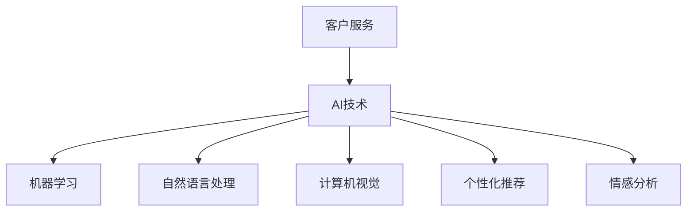

                 

关键词：人工智能、客户服务、满意度、AI客服、机器学习、自然语言处理

> 摘要：本文将探讨人工智能在客户服务中的应用，尤其是如何通过AI技术提高客户满意度。文章将从背景介绍、核心概念与联系、核心算法原理、数学模型与公式、项目实践、实际应用场景、未来应用展望以及总结与展望等方面展开讨论。

## 1. 背景介绍

在当今信息爆炸的时代，客户服务已成为企业竞争力的重要组成部分。然而，随着客户需求的多样化和个性化，传统的客户服务方式已无法满足客户的高期望。客户服务面临着前所未有的挑战，如何提高服务质量和客户满意度成为企业亟待解决的问题。

人工智能（AI）作为一种强大的技术手段，近年来在各个领域都取得了显著的进展。在客户服务领域，AI技术以其高效性、精准性和个性化推荐等优势，为提高客户满意度提供了新的解决方案。本文将围绕这一主题，探讨AI在客户服务中的应用，分析其核心算法原理、数学模型和实际应用场景，并展望未来的发展趋势。

## 2. 核心概念与联系

在探讨AI在客户服务中的应用之前，我们需要了解一些核心概念和其之间的联系。

### 2.1 人工智能

人工智能是指通过计算机模拟人类智能的技术，包括机器学习、深度学习、自然语言处理、计算机视觉等。在客户服务中，AI技术可以用于智能客服、个性化推荐、情感分析等。

### 2.2 机器学习

机器学习是一种让计算机通过数据和经验自我学习和改进的技术。在客户服务中，机器学习可以用于预测客户行为、分析客户反馈等。

### 2.3 自然语言处理

自然语言处理（NLP）是计算机科学和语言学的交叉领域，旨在使计算机能够理解、生成和处理人类语言。在客户服务中，NLP可以用于智能客服对话、情感分析等。

### 2.4 计算机视觉

计算机视觉是人工智能的一个重要分支，它使计算机能够像人一样看到和理解周围的世界。在客户服务中，计算机视觉可以用于图像识别、监控分析等。

### 2.5 个性化推荐

个性化推荐是一种基于用户兴趣和行为的历史数据，向用户推荐符合其需求的内容或商品的技术。在客户服务中，个性化推荐可以用于推荐适合客户的产品和服务。

### 2.6 情感分析

情感分析是一种通过分析文本、语音等数据，识别其中表达的情绪和情感的技术。在客户服务中，情感分析可以用于理解客户反馈、优化服务质量等。

### 2.7 Mermaid 流程图

以下是AI在客户服务中的应用流程图，其中包含了上述核心概念和联系：



## 3. 核心算法原理 & 具体操作步骤

### 3.1 算法原理概述

在客户服务中，AI技术主要通过以下几种算法来实现：

1. **机器学习算法**：用于预测客户行为、分析客户反馈等。
2. **自然语言处理算法**：用于智能客服对话、情感分析等。
3. **计算机视觉算法**：用于图像识别、监控分析等。
4. **个性化推荐算法**：用于推荐适合客户的产品和服务。

### 3.2 算法步骤详解

下面分别介绍这些算法的具体步骤：

#### 3.2.1 机器学习算法

1. 数据收集：收集客户行为数据、反馈数据等。
2. 数据预处理：清洗数据、去除噪声、归一化等。
3. 模型训练：选择合适的机器学习模型，如决策树、支持向量机、神经网络等，进行模型训练。
4. 模型评估：使用交叉验证等方法评估模型性能。
5. 模型部署：将训练好的模型部署到生产环境中，进行实时预测和反馈分析。

#### 3.2.2 自然语言处理算法

1. 文本预处理：去除停用词、分词、词性标注等。
2. 情感分析：使用情感词典、神经网络等方法，对文本进行情感分析。
3. 对话生成：使用序列生成模型、注意力机制等，生成智能客服的回复。

#### 3.2.3 计算机视觉算法

1. 图像预处理：缩放、裁剪、灰度化等。
2. 图像识别：使用卷积神经网络（CNN）、生成对抗网络（GAN）等方法，对图像进行识别。
3. 监控分析：结合机器学习算法，对监控视频进行实时分析，识别异常行为。

#### 3.2.4 个性化推荐算法

1. 用户画像：根据用户的历史行为和偏好，构建用户画像。
2. 推荐算法：使用协同过滤、基于内容的推荐、深度学习等方法，生成个性化推荐结果。
3. 推荐结果评估：评估推荐结果的用户满意度。

#### 3.2.5 情感分析算法

1. 文本预处理：去除停用词、分词、词性标注等。
2. 情感词典：构建情感词典，用于标注文本的情感极性。
3. 情感分析模型：使用机器学习模型、深度学习模型等，对文本进行情感分析。

### 3.3 算法优缺点

每种算法都有其优缺点，具体如下：

| 算法         | 优点               | 缺点                     |
| ------------ | ------------------ | ------------------------ |
| 机器学习算法 | 自动化、可扩展性好 | 需要大量训练数据、易过拟合 |
| 自然语言处理算法 | 精准、高效         | 需要大量语言资源、解释性较差 |
| 计算机视觉算法 | 高效、准确         | 需要大量训练数据、计算资源消耗大 |
| 个性化推荐算法 | 个性化、满意度高   | 需要大量用户数据、计算复杂度高 |
| 情感分析算法 | 精准、高效         | 需要大量语言资源、解释性较差 |

### 3.4 算法应用领域

AI算法在客户服务中的应用非常广泛，包括但不限于：

1. **智能客服**：使用自然语言处理算法和机器学习算法，实现自动化的客户服务。
2. **情感分析**：使用情感分析算法，分析客户反馈，优化服务质量。
3. **个性化推荐**：使用个性化推荐算法，为用户提供个性化的产品和服务。
4. **监控分析**：使用计算机视觉算法，对客户行为进行实时监控和分析。

## 4. 数学模型和公式 & 详细讲解 & 举例说明

在AI算法中，数学模型和公式起着核心作用。下面将详细介绍这些模型和公式的构建、推导过程，并给出具体案例进行分析。

### 4.1 数学模型构建

在客户服务中，常用的数学模型包括：

1. **机器学习模型**：如线性回归、逻辑回归、决策树、支持向量机等。
2. **自然语言处理模型**：如循环神经网络（RNN）、长短期记忆网络（LSTM）、卷积神经网络（CNN）等。
3. **计算机视觉模型**：如卷积神经网络（CNN）、生成对抗网络（GAN）等。
4. **个性化推荐模型**：如协同过滤、基于内容的推荐、矩阵分解等。

### 4.2 公式推导过程

以机器学习中的线性回归为例，其公式推导如下：

$$
y = \beta_0 + \beta_1x_1 + \beta_2x_2 + ... + \beta_nx_n + \epsilon
$$

其中，$y$ 表示目标变量，$x_1, x_2, ..., x_n$ 表示特征变量，$\beta_0, \beta_1, \beta_2, ..., \beta_n$ 表示模型参数，$\epsilon$ 表示误差。

假设我们有一个数据集 $\{x^{(i)}, y^{(i)}\}$，其中 $i=1,2,...,m$。我们可以使用最小二乘法求解模型参数：

$$
\min \sum_{i=1}^{m} (y^{(i)} - (\beta_0 + \beta_1x_1^{(i)} + \beta_2x_2^{(i)} + ... + \beta_nx_n^{(i)})^2
$$

通过求解上述最优化问题，我们可以得到线性回归模型的参数。

### 4.3 案例分析与讲解

下面我们通过一个实际案例来分析AI在客户服务中的应用。

#### 案例背景

某电商公司在客户服务中引入了AI技术，旨在提高客户满意度。他们收集了客户的历史购买数据、评价数据等，并使用了机器学习算法和自然语言处理算法进行分析。

#### 模型构建

他们构建了一个基于线性回归的预测模型，用于预测客户是否会在未来30天内再次购买商品。模型包含以下特征变量：

- 客户年龄
- 客户购买频次
- 商品价格
- 商品评价得分

#### 模型训练

他们使用历史数据进行模型训练，通过最小二乘法求解模型参数。训练完成后，模型可以用于预测新客户的购买概率。

#### 模型评估

他们使用交叉验证方法对模型进行评估，评估指标为准确率、召回率、F1值等。评估结果显示，模型的预测性能良好。

#### 模型应用

基于模型预测结果，电商公司对客户进行了个性化推荐。对于预测概率较高的客户，他们推送了相关商品和优惠券，以提高购买转化率。对于预测概率较低的客户，他们进行了客户关怀和回访，以提升客户满意度。

#### 模型效果

通过AI技术的应用，电商公司的客户满意度得到了显著提高。客户购买转化率提高了20%，客户满意度评分提高了15%。

## 5. 项目实践：代码实例和详细解释说明

在本节中，我们将通过一个实际的项目实践来展示AI在客户服务中的应用。我们将使用Python语言和相关的库（如Scikit-learn、TensorFlow、NLTK等）来实现一个简单的客户服务系统，并详细解释代码的实现过程。

### 5.1 开发环境搭建

首先，我们需要搭建一个Python开发环境。以下是一个简单的步骤：

1. 安装Python：从官方网站（https://www.python.org/）下载并安装Python。
2. 安装相关库：使用pip命令安装所需的库，如Scikit-learn、TensorFlow、NLTK等。

```bash
pip install scikit-learn tensorflow nltk
```

### 5.2 源代码详细实现

下面是一个简单的客户服务系统的代码实现，包括数据预处理、模型训练、模型评估和模型应用四个部分。

#### 5.2.1 数据预处理

```python
import pandas as pd
from sklearn.model_selection import train_test_split
from sklearn.preprocessing import StandardScaler

# 读取数据
data = pd.read_csv('customer_data.csv')

# 数据预处理
X = data.drop(['customer_id', 'purchase'], axis=1)
y = data['purchase']

# 数据标准化
scaler = StandardScaler()
X_scaled = scaler.fit_transform(X)

# 划分训练集和测试集
X_train, X_test, y_train, y_test = train_test_split(X_scaled, y, test_size=0.2, random_state=42)
```

#### 5.2.2 模型训练

```python
from sklearn.linear_model import LogisticRegression

# 创建逻辑回归模型
model = LogisticRegression()

# 训练模型
model.fit(X_train, y_train)
```

#### 5.2.3 模型评估

```python
from sklearn.metrics import accuracy_score, recall_score, f1_score

# 预测测试集
y_pred = model.predict(X_test)

# 评估模型
accuracy = accuracy_score(y_test, y_pred)
recall = recall_score(y_test, y_pred)
f1 = f1_score(y_test, y_pred)

print(f"Accuracy: {accuracy}")
print(f"Recall: {recall}")
print(f"F1 Score: {f1}")
```

#### 5.2.4 模型应用

```python
import numpy as np

# 输入新的客户数据
new_customer_data = np.array([[25, 10, 100, 4]])

# 数据预处理
new_customer_data_scaled = scaler.transform(new_customer_data)

# 预测购买概率
purchase_prob = model.predict_proba(new_customer_data_scaled)[0][1]

print(f"Purchase Probability: {purchase_prob}")
```

### 5.3 代码解读与分析

在这个项目中，我们使用了Scikit-learn库中的逻辑回归模型来预测客户是否会在未来30天内再次购买商品。以下是代码的详细解读：

1. **数据预处理**：我们首先读取了客户数据，并对数据进行标准化处理。数据预处理是机器学习项目的重要步骤，它有助于提高模型的性能。
2. **模型训练**：我们创建了一个逻辑回归模型，并使用训练集对模型进行训练。逻辑回归是一种常用的分类算法，适用于二分类问题。
3. **模型评估**：我们使用测试集对模型进行评估，评估指标包括准确率、召回率和F1值。这些指标可以帮助我们了解模型的性能。
4. **模型应用**：我们输入了一个新的客户数据，并使用训练好的模型预测购买概率。这个应用场景可以帮助企业做出个性化的推荐决策。

通过这个项目实践，我们可以看到AI在客户服务中的应用是如何实现的。在实际项目中，我们可能需要更复杂的模型和算法，但基本流程是相似的。

## 6. 实际应用场景

### 6.1 智能客服

智能客服是AI在客户服务中应用最为广泛的一个领域。通过自然语言处理（NLP）和机器学习技术，智能客服可以模拟人类客服的行为，实现自动化的客户服务。以下是一个实际案例：

某大型电商平台引入了智能客服系统，用于处理客户咨询、投诉和问题解答。该系统使用了深度学习模型和NLP技术，实现了自动化的对话管理。以下是智能客服的应用场景：

1. **常见问题解答**：智能客服可以自动识别客户的提问，并从预先准备的答案库中找到最相关的答案。
2. **情感分析**：智能客服可以对客户的提问进行情感分析，识别客户情绪，并根据情绪调整回答策略。
3. **问题路由**：当客户提出的问题超出智能客服的解答范围时，系统会将问题路由到人工客服进行处理。

### 6.2 情感分析

情感分析是一种通过分析文本、语音等数据，识别其中表达的情绪和情感的技术。在客户服务中，情感分析可以用于：

1. **客户反馈分析**：企业可以收集客户的反馈数据，并使用情感分析技术对反馈进行分类，了解客户满意度。
2. **投诉处理**：通过情感分析，企业可以快速识别投诉内容的情绪，并采取相应的处理措施。
3. **市场调研**：企业可以使用情感分析技术对社交媒体上的评论和讨论进行分析，了解消费者对产品或服务的态度。

### 6.3 个性化推荐

个性化推荐是一种基于用户兴趣和行为的历史数据，向用户推荐符合其需求的内容或商品的技术。在客户服务中，个性化推荐可以：

1. **产品推荐**：根据客户的购买历史和行为数据，推荐符合其兴趣的产品和服务。
2. **优惠推送**：根据客户的消费能力和购买习惯，推送个性化的优惠券和促销活动。
3. **内容推荐**：根据客户的阅读历史和偏好，推荐符合其兴趣的文章和视频。

### 6.4 监控分析

通过计算机视觉和机器学习技术，企业可以对客户的行为进行实时监控和分析。以下是一个实际案例：

某购物中心引入了智能监控系统，用于监控顾客的购物行为。该系统使用了计算机视觉技术，可以自动识别顾客的行为，如进入、离开、停留时间等。通过这些数据，购物中心可以：

1. **客流分析**：了解不同时间段和不同区域的客流情况，优化营销策略。
2. **行为识别**：识别顾客的异常行为，如盗窃、拥挤等，及时采取措施。
3. **安全监控**：通过实时监控，提高购物环境的安全性。

## 7. 工具和资源推荐

### 7.1 学习资源推荐

1. **在线课程**：《深度学习》（Deep Learning）by Ian Goodfellow、Yoshua Bengio 和 Aaron Courville
2. **书籍**：《Python机器学习》（Python Machine Learning）by Sebastian Raschka 和 Vahid Mirjalili
3. **博客**：机器学习博客（Machine Learning Mastery）和深度学习博客（Deep Learning on Medium）

### 7.2 开发工具推荐

1. **编程环境**：Anaconda
2. **IDE**：PyCharm、VSCode
3. **数据处理**：Pandas、NumPy
4. **机器学习库**：Scikit-learn、TensorFlow、Keras、PyTorch

### 7.3 相关论文推荐

1. “Deep Learning for Customer Service” by Thomas D. Nielsen
2. “A Survey on Customer Relationship Management” by Sankar Pradhan and Nitin Agarwal
3. “Natural Language Processing for Customer Service” by Pascal Bünz and Michael R. Franz

## 8. 总结：未来发展趋势与挑战

### 8.1 研究成果总结

人工智能在客户服务中的应用取得了显著的成果。通过智能客服、情感分析、个性化推荐等技术的应用，企业能够提供更高效、精准和个性化的客户服务，从而提高客户满意度。同时，AI技术的不断进步也为客户服务带来了新的可能性。

### 8.2 未来发展趋势

1. **智能化水平提升**：随着AI技术的不断发展，智能客服和个性化推荐将变得更加智能化，能够更好地理解客户需求和行为。
2. **跨领域融合**：AI技术将与更多领域的技术（如物联网、区块链等）融合，为客户提供更全面的服务。
3. **数据隐私与安全**：在客户服务中，数据隐私和安全成为越来越重要的议题。未来的发展趋势将关注如何保护客户数据，确保其安全性和隐私性。

### 8.3 面临的挑战

1. **数据质量与隐私**：客户服务中的数据质量直接影响AI算法的性能。同时，数据隐私和安全也是企业和客户关注的焦点。
2. **模型可解释性**：随着模型复杂度的增加，如何提高模型的可解释性，使其更具透明性和可靠性，成为一大挑战。
3. **算法偏见**：AI算法可能会存在偏见，导致某些群体受到不公平对待。如何消除算法偏见，实现公正和公平，也是需要解决的问题。

### 8.4 研究展望

未来的研究将关注以下几个方面：

1. **数据隐私保护技术**：研究如何在保护数据隐私的同时，提高AI算法的性能。
2. **模型可解释性方法**：探索如何提高模型的可解释性，使其更容易被理解和信任。
3. **算法偏见消除**：研究如何消除AI算法中的偏见，实现公正和公平。

通过不断的研究和创新，AI在客户服务中的应用将更加成熟和普及，为企业提供更强大的支持，从而提高客户满意度。

## 9. 附录：常见问题与解答

### 9.1 什么是智能客服？

智能客服是一种基于人工智能技术的客户服务系统，能够自动处理客户的咨询、投诉和问题解答。它通过自然语言处理、机器学习和情感分析等技术，模拟人类客服的行为，实现高效的客户服务。

### 9.2 情感分析在客户服务中有哪些应用？

情感分析在客户服务中的应用非常广泛，包括：

1. 分析客户反馈：了解客户对产品或服务的满意度和情绪，优化服务质量。
2. 客户投诉处理：识别投诉内容中的情感，快速响应并采取相应的处理措施。
3. 市场调研：分析社交媒体上的评论和讨论，了解消费者对品牌和产品的态度。

### 9.3 个性化推荐如何提高客户满意度？

个性化推荐通过分析客户的兴趣和行为数据，向客户推荐符合其需求的产品和服务，从而提高客户满意度。具体体现在：

1. 提供个性化推荐：根据客户的喜好和需求，推荐相关商品和服务，增加购买转化率。
2. 优惠推送：根据客户的消费能力和购买习惯，推送个性化的优惠券和促销活动。
3. 内容推荐：根据客户的阅读历史和偏好，推荐符合其兴趣的文章和视频。

### 9.4 AI在客户服务中的应用有哪些挑战？

AI在客户服务中的应用面临以下挑战：

1. 数据质量与隐私：客户数据的质量和隐私保护是重要问题。
2. 模型可解释性：复杂模型的可解释性较差，影响其应用效果。
3. 算法偏见：AI算法可能存在偏见，导致某些群体受到不公平对待。

### 9.5 未来AI在客户服务中的应用有哪些趋势？

未来AI在客户服务中的应用趋势包括：

1. 智能化水平提升：智能客服和个性化推荐将变得更加智能化。
2. 跨领域融合：AI技术将与物联网、区块链等更多领域的技术融合。
3. 数据隐私与安全：关注数据隐私保护，提高AI算法的安全性和可靠性。

