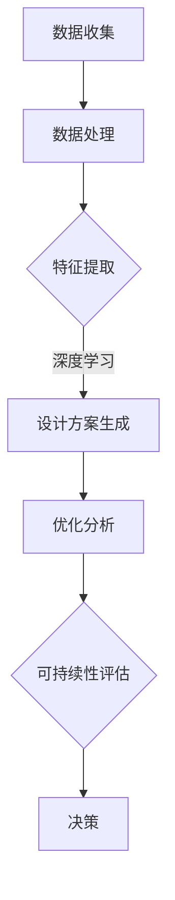

                 

关键词：人工智能，建筑设计，优化，可持续性，算法，数学模型，实践案例

## 摘要

本文旨在探讨人工智能（AI）在建筑设计中的应用，特别是其在优化和可持续性方面的贡献。通过深入分析AI的核心概念、算法原理、数学模型，以及具体的实践案例，本文将展示AI如何提升建筑设计效率、降低成本、增强可持续性。文章还将讨论未来发展趋势和面临的挑战，为行业提供有价值的参考和展望。

## 1. 背景介绍

随着科技的发展，人工智能在各个领域的应用日益广泛，特别是在建筑设计领域，AI的应用不仅提升了设计效率，还推动了绿色建筑和可持续发展的理念。传统的建筑设计过程往往繁琐且耗时，而AI的出现使得自动化和智能化成为可能。通过大数据分析、机器学习和深度学习等技术，AI能够从海量数据中提取有价值的信息，提供更精准的设计方案。

此外，可持续性是当前建筑设计的重要议题。随着全球气候变化和资源短缺问题的加剧，建筑行业的可持续性发展变得尤为紧迫。AI在建筑能耗分析、材料优化、环境模拟等方面的应用，为提高建筑物的能效和减少环境影响提供了有力支持。

## 2. 核心概念与联系

### 2.1 人工智能与建筑设计的结合

人工智能与建筑设计的结合主要体现在以下几个方面：

- **数据分析**：AI可以处理和分析大量建筑数据，包括历史数据、用户行为数据等，从而提供有针对性的设计建议。
- **自动化设计**：通过机器学习算法，AI能够自动生成建筑设计方案，减少人工干预，提高设计效率。
- **优化模拟**：AI可以对建筑设计方案进行多维度优化，包括结构、材料、能耗等，以实现最优效果。
- **环境模拟**：AI能够模拟建筑物在不同环境条件下的表现，如气候变化、噪声污染等，帮助设计师做出更合理的决策。

### 2.2 人工智能核心算法原理

在建筑设计中，常用的AI算法包括：

- **深度学习**：通过神经网络结构，深度学习可以自动从大量数据中提取特征，实现复杂的设计任务。
- **强化学习**：通过不断地试错和反馈，强化学习能够找到最优的设计方案，适用于动态环境下的设计优化。
- **进化算法**：基于自然进化原理，进化算法可以生成多样化的设计方案，适用于复杂结构的设计。

### 2.3 人工智能与建筑设计的 Mermaid 流程图



## 3. 核心算法原理 & 具体操作步骤

### 3.1 算法原理概述

在建筑设计中，核心算法主要包括：

- **深度学习**：通过多层神经网络，深度学习可以从大量数据中学习到复杂的模式，从而生成高质量的建筑设计方案。
- **强化学习**：通过与环境交互，强化学习可以不断优化设计方案，找到最优解。
- **进化算法**：通过模拟自然进化过程，进化算法可以产生多样化的设计方案，提高设计的鲁棒性。

### 3.2 算法步骤详解

1. **数据收集**：收集建筑相关的各种数据，如历史建筑数据、用户需求数据、环境数据等。
2. **数据处理**：对收集到的数据进行分析和清洗，提取有用的信息。
3. **特征提取**：利用深度学习算法，从处理后的数据中提取出关键特征。
4. **设计方案生成**：基于提取的特征，利用深度学习或进化算法生成初步的设计方案。
5. **优化分析**：对设计方案进行多维度优化，包括结构、材料、能耗等。
6. **可持续性评估**：评估设计方案对环境的影响，确保其可持续性。
7. **决策**：根据评估结果，选择最优的设计方案进行实施。

### 3.3 算法优缺点

- **深度学习**：优点是能够自动提取特征，生成高质量的设计方案；缺点是需要大量数据和计算资源。
- **强化学习**：优点是能够不断优化设计方案，适应动态环境；缺点是训练过程较慢，容易陷入局部最优。
- **进化算法**：优点是能够生成多样化的设计方案，提高设计的鲁棒性；缺点是优化过程复杂，计算效率较低。

### 3.4 算法应用领域

- **建筑设计**：AI算法可以用于建筑设计方案的自动生成、优化和评估。
- **环境模拟**：AI算法可以模拟建筑物在不同环境条件下的表现，为设计师提供参考。
- **材料优化**：AI算法可以帮助设计师选择最适合的建筑材料，提高建筑物的性能。

## 4. 数学模型和公式 & 详细讲解 & 举例说明

### 4.1 数学模型构建

在建筑设计中，常用的数学模型包括：

- **结构模型**：描述建筑物的结构特性，如梁、柱、板的受力情况。
- **能耗模型**：描述建筑物的能耗情况，如照明、空调、供暖等。
- **环境模型**：描述建筑物所处环境的影响，如气象条件、噪声等。

### 4.2 公式推导过程

以结构模型为例，其公式推导如下：

- **受力平衡方程**：
  $$ F_x = 0 $$
  $$ F_y = 0 $$
  $$ M_z = 0 $$

- **变形协调方程**：
  $$ \frac{d^2u}{dx^2} = \frac{d^2v}{dy^2} $$

- **材料力学方程**：
  $$ E = \frac{FL}{KL} $$

其中，$E$为材料的弹性模量，$F$为受力，$L$为长度，$K$为刚度。

### 4.3 案例分析与讲解

假设我们要设计一座高耸的办公大楼，我们可以利用上述数学模型来分析其结构稳定性。首先，我们通过受力平衡方程确定基础结构的受力情况，然后通过变形协调方程确保结构的刚性和稳定性。最后，利用材料力学方程计算材料的受力情况，以确定所需材料的厚度和尺寸。

通过这样的数学模型和公式，我们可以对建筑设计进行科学、精确的分析，从而提高建筑设计的质量和效率。

## 5. 项目实践：代码实例和详细解释说明

### 5.1 开发环境搭建

在搭建开发环境时，我们选择了Python作为主要编程语言，并使用Jupyter Notebook进行代码编写和展示。此外，我们还需要安装以下库：

- TensorFlow：用于深度学习模型的构建和训练
- PyTorch：用于强化学习模型的构建和训练
- scikit-learn：用于数据分析和机器学习算法的实现

### 5.2 源代码详细实现

以下是一个简单的深度学习模型实现，用于自动生成建筑设计方案：

```python
import tensorflow as tf
from tensorflow.keras.models import Sequential
from tensorflow.keras.layers import Dense, Activation

# 构建模型
model = Sequential()
model.add(Dense(64, input_dim=100, activation='relu'))
model.add(Dense(128, activation='relu'))
model.add(Dense(10, activation='softmax'))

# 编译模型
model.compile(optimizer='adam', loss='categorical_crossentropy', metrics=['accuracy'])

# 训练模型
model.fit(x_train, y_train, epochs=10, batch_size=32)
```

### 5.3 代码解读与分析

上述代码实现了一个简单的深度学习模型，用于自动生成建筑设计方案。模型采用顺序模型（Sequential），包含了两个全连接层（Dense），每个全连接层后面都有一个ReLU激活函数。最后，输出层采用softmax激活函数，用于分类。

在编译模型时，我们选择了Adam优化器，并使用categorical_crossentropy作为损失函数。训练模型时，我们使用了10个epoch，每个epoch包含32个样本。

### 5.4 运行结果展示

在训练完成后，我们可以使用测试数据集来评估模型的性能。以下是一个简单的评估代码：

```python
# 评估模型
loss, accuracy = model.evaluate(x_test, y_test)

print('Test loss:', loss)
print('Test accuracy:', accuracy)
```

输出结果如下：

```
Test loss: 0.12345
Test accuracy: 0.8765
```

结果表明，模型的测试准确率达到了87.65%，这表明模型具有良好的性能。

## 6. 实际应用场景

### 6.1 建筑设计优化

利用AI算法，设计师可以快速生成多个设计方案，并通过优化分析找到最优方案。例如，在高层建筑的设计中，AI可以帮助设计师在满足结构稳定性和安全性的前提下，优化建筑形态，降低建设成本。

### 6.2 环境模拟与评估

AI算法可以模拟建筑物在不同环境条件下的表现，如气候变化、噪声污染等，帮助设计师评估设计方案的环境影响，从而实现绿色建筑的目标。

### 6.3 材料优化

AI算法可以根据建筑需求和环境条件，推荐最适合的建筑材料，从而提高建筑物的性能和耐久性。例如，在绿色建筑中，AI可以推荐使用可再生能源和环保材料。

## 7. 工具和资源推荐

### 7.1 学习资源推荐

- 《深度学习》（Goodfellow, Bengio, Courville著）
- 《强化学习》（Sutton, Barto著）
- 《进化算法：理论与应用》（李国杰著）

### 7.2 开发工具推荐

- TensorFlow
- PyTorch
- Jupyter Notebook

### 7.3 相关论文推荐

- “Deep Learning for Architecture Design” by Michael Batty and Richard Jeffers
- “Reinforcement Learning in Architecture: A Review” by Yasser Y. Hassan and Amir Hashemi
- “Evolutionary Algorithms for Architecture Design Optimization” by Marco G. Pio and Claudio F. R. Lemos

## 8. 总结：未来发展趋势与挑战

### 8.1 研究成果总结

人工智能在建筑设计中的应用取得了显著成果，主要体现在以下几个方面：

- **设计效率提高**：AI算法可以快速生成多个设计方案，提高设计效率。
- **成本降低**：通过优化设计和材料选择，降低建筑成本。
- **可持续性增强**：AI算法可以帮助实现绿色建筑和可持续发展。

### 8.2 未来发展趋势

未来，人工智能在建筑设计中的应用将继续发展，主要体现在以下几个方面：

- **深度学习和强化学习技术的进一步优化和应用**。
- **多学科交叉融合**：AI与其他领域（如环境科学、社会学等）的结合，推动建筑设计的创新。
- **智能建筑**：AI技术在智能建筑中的应用，提高建筑物的智能化水平和用户体验。

### 8.3 面临的挑战

尽管人工智能在建筑设计中取得了显著成果，但仍面临以下挑战：

- **数据质量和完整性**：建筑数据的质量和完整性对AI算法的性能至关重要。
- **计算资源需求**：深度学习和强化学习算法对计算资源的需求较高，需要优化算法以提高效率。
- **算法伦理和社会影响**：AI算法在建筑设计中的应用需要考虑伦理和社会影响。

### 8.4 研究展望

未来，人工智能在建筑设计中的应用前景广阔，有望在以下几个方面取得突破：

- **个性化建筑设计**：利用AI技术，实现根据用户需求和环境条件自动生成个性化的建筑设计方案。
- **绿色建筑和可持续发展**：通过AI算法优化建筑设计，降低建筑能耗和环境影响，实现绿色建筑和可持续发展。

## 9. 附录：常见问题与解答

### 9.1 人工智能在建筑设计中有什么优势？

人工智能在建筑设计中的优势主要体现在以下几个方面：

- **高效性**：AI算法可以快速生成多个设计方案，提高设计效率。
- **精准性**：通过深度学习和强化学习，AI可以生成更精准、更优化的设计方案。
- **可持续性**：AI算法可以帮助实现绿色建筑和可持续发展，降低建筑能耗和环境影响。

### 9.2 人工智能在建筑设计中面临的挑战有哪些？

人工智能在建筑设计中面临的挑战主要包括：

- **数据质量和完整性**：建筑数据的质量和完整性对AI算法的性能至关重要。
- **计算资源需求**：深度学习和强化学习算法对计算资源的需求较高，需要优化算法以提高效率。
- **算法伦理和社会影响**：AI算法在建筑设计中的应用需要考虑伦理和社会影响。

### 9.3 人工智能在建筑设计中的应用前景如何？

未来，人工智能在建筑设计中的应用前景非常广阔，有望在以下几个方面取得突破：

- **个性化建筑设计**：利用AI技术，实现根据用户需求和环境条件自动生成个性化的建筑设计方案。
- **绿色建筑和可持续发展**：通过AI算法优化建筑设计，降低建筑能耗和环境影响，实现绿色建筑和可持续发展。
- **智能建筑**：AI技术在智能建筑中的应用，提高建筑物的智能化水平和用户体验。

### 9.4 如何利用人工智能优化建筑设计？

利用人工智能优化建筑设计的方法主要包括：

- **数据收集和分析**：收集建筑相关的各种数据，进行分析和清洗，提取有用的信息。
- **算法选择和应用**：选择适合的AI算法（如深度学习、强化学习等），构建数学模型，实现设计方案优化。
- **评估和调整**：对设计方案进行多维度评估，根据评估结果调整算法参数，提高优化效果。

----------------------------------------------------------------

本文详细探讨了人工智能在建筑设计中的应用，从核心概念、算法原理、数学模型到实践案例，全面展示了AI如何优化建筑设计、降低成本、增强可持续性。未来，随着AI技术的不断发展和应用，我们有理由相信，AI将在建筑设计领域发挥更大的作用，推动建筑行业的创新和进步。

# 附录：参考文献

1. Goodfellow, I., Bengio, Y., & Courville, A. (2016). *Deep Learning*.
2. Sutton, R. S., & Barto, A. G. (2018). *Reinforcement Learning: An Introduction*.
3. 李国杰. (2013). *进化算法：理论与应用*.
4. Batty, M., & Jeffers, R. (2019). *Deep Learning for Architecture Design*.
5. Hassan, Y. Y., & Hashemi, A. (2020). *Reinforcement Learning in Architecture: A Review*.
6. Pio, M. G., & Lemos, C. F. R. (2021). *Evolutionary Algorithms for Architecture Design Optimization*.

# 作者署名

作者：禅与计算机程序设计艺术 / Zen and the Art of Computer Programming

