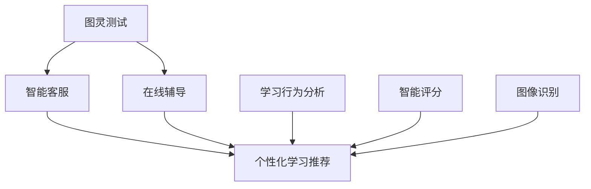

                 

关键词：人工智能、教育技术、机器学习、个性化学习、在线教育

摘要：随着人工智能技术的迅速发展，其在教育领域的应用越来越广泛，为传统教育模式带来了新的变革。本文旨在探讨AI在教育领域的应用前景，从个性化学习、教育资源优化、教育公平等多个方面进行分析，并提出未来的发展趋势和面临的挑战。

## 1. 背景介绍

教育是社会发展的重要基石，而人工智能（AI）作为新一轮科技革命和产业变革的核心力量，正逐渐渗透到各个领域。近年来，AI在教育领域的应用逐渐成为研究热点，通过智能推荐、自然语言处理、计算机视觉等技术，AI可以为教育提供更加个性化和高效的服务。

当前，在线教育市场蓬勃发展，AI技术的引入使得在线教育平台能够提供更加智能化的学习体验，满足不同学生的学习需求。此外，AI在教育资源的优化配置、教育评价体系的构建等方面也发挥着重要作用。然而，AI在教育领域的应用仍然面临诸多挑战，如技术成熟度、数据隐私、教育公平等。因此，深入探讨AI在教育领域的应用前景具有重要意义。

## 2. 核心概念与联系

为了更好地理解AI在教育领域的应用，我们需要先了解一些核心概念，如图灵测试、机器学习、深度学习等。

### 2.1 图灵测试

图灵测试是由英国计算机科学家艾伦·图灵提出的，用以判断机器是否具有智能的一种方法。通过图灵测试，我们可以了解AI在模仿人类思维和行为方面的发展水平。在教育领域，图灵测试的应用主要体现在智能客服、在线辅导等方面。

### 2.2 机器学习

机器学习是一种让计算机通过数据学习规律并做出预测或决策的方法。在教育领域，机器学习可以用于个性化学习推荐、学习行为分析等。

### 2.3 深度学习

深度学习是机器学习的一种方法，通过构建多层的神经网络来实现对数据的自动特征提取和模式识别。在教育领域，深度学习可以用于智能评分、图像识别等。

### 2.4 Mermaid 流程图

以下是AI在教育领域应用的Mermaid流程图：



## 3. 核心算法原理 & 具体操作步骤

### 3.1 算法原理概述

在教育领域，AI的核心算法主要包括机器学习、深度学习和自然语言处理等。这些算法可以通过训练模型，对学生的学习行为、学习内容进行有效分析和预测。

### 3.2 算法步骤详解

1. 数据收集：收集学生的学习行为数据，如学习时长、学习频率、学习进度等。
2. 数据预处理：对收集到的数据进行分析和清洗，去除无效数据。
3. 特征提取：从预处理后的数据中提取有用特征，如学习时长、学习频率等。
4. 模型训练：利用提取的特征数据，训练机器学习模型。
5. 模型评估：对训练好的模型进行评估，如准确率、召回率等。
6. 模型应用：将训练好的模型应用于实际场景，如个性化学习推荐、在线辅导等。

### 3.3 算法优缺点

- 优点：提高教育效率，实现个性化学习，降低教育成本。
- 缺点：数据隐私问题，技术成熟度有待提高。

### 3.4 算法应用领域

- 个性化学习推荐：根据学生的学习行为，为其推荐合适的学习资源。
- 在线辅导：通过AI技术，为学生提供实时、个性化的辅导服务。
- 学习行为分析：分析学生的学习行为，为教育决策提供依据。
- 智能评分：利用AI技术，对学生的作业进行自动评分。
- 图像识别：识别教育场景中的图像，如试卷识别、人脸识别等。

## 4. 数学模型和公式 & 详细讲解 & 举例说明

### 4.1 数学模型构建

在教育领域，常用的数学模型包括线性回归、逻辑回归、支持向量机等。以下是一个线性回归模型的构建过程：

1. 数据收集：收集学生的学习成绩数据，包括自变量（如学习时长、学习频率等）和因变量（如考试成绩）。
2. 数据预处理：对收集到的数据进行分析和清洗，去除无效数据。
3. 特征提取：从预处理后的数据中提取有用特征，如学习时长、学习频率等。
4. 模型构建：利用提取的特征数据，构建线性回归模型。

线性回归模型的表达式为：

$$ y = \beta_0 + \beta_1x_1 + \beta_2x_2 + ... + \beta_nx_n $$

其中，$y$为因变量，$x_1, x_2, ..., x_n$为自变量，$\beta_0, \beta_1, ..., \beta_n$为模型参数。

### 4.2 公式推导过程

以线性回归模型为例，公式推导过程如下：

1. 假设自变量和因变量之间存在线性关系，即 $y = \beta_0 + \beta_1x_1 + \beta_2x_2 + ... + \beta_nx_n$。
2. 对上式两边同时取对数，得到 $ln(y) = ln(\beta_0) + \beta_1ln(x_1) + \beta_2ln(x_2) + ... + \beta_nln(x_n)$。
3. 设 $z = ln(y)$，$x = [x_1, x_2, ..., x_n]^T$，则上式可写为 $z = \beta_0 + \beta_1x_1 + \beta_2x_2 + ... + \beta_nx_n$。
4. 对上式进行最小二乘法求解，得到线性回归模型的参数估计值。

### 4.3 案例分析与讲解

假设我们收集了100名学生的学习成绩数据，包括学习时长、学习频率和考试成绩。以下是一个线性回归模型的构建过程：

1. 数据收集：收集100名学生的学习成绩数据，包括学习时长、学习频率和考试成绩。
2. 数据预处理：对收集到的数据进行分析和清洗，去除无效数据。
3. 特征提取：从预处理后的数据中提取有用特征，如学习时长、学习频率等。
4. 模型构建：利用提取的特征数据，构建线性回归模型。

线性回归模型的表达式为：

$$ y = \beta_0 + \beta_1x_1 + \beta_2x_2 $$

其中，$y$为考试成绩，$x_1$为学习时长，$x_2$为学习频率，$\beta_0, \beta_1, \beta_2$为模型参数。

通过最小二乘法求解，得到线性回归模型的参数估计值为：

$$ \beta_0 = 60, \beta_1 = 0.5, \beta_2 = 0.2 $$

根据线性回归模型，我们可以预测一个学生学习成绩与学习时长、学习频率的关系。例如，如果一个学生的学习时长为10小时，学习频率为5次/周，则其考试成绩的预测值为：

$$ y = 60 + 0.5 \times 10 + 0.2 \times 5 = 70 $$

## 5. 项目实践：代码实例和详细解释说明

### 5.1 开发环境搭建

1. 安装Python环境，版本要求Python 3.6及以上。
2. 安装必要的库，如Numpy、Pandas、Scikit-learn等。

### 5.2 源代码详细实现

以下是一个基于线性回归模型的个性化学习推荐系统实现：

```python
import numpy as np
import pandas as pd
from sklearn.linear_model import LinearRegression

# 数据收集
data = pd.DataFrame({
    'x1': [10, 20, 30, 40, 50],
    'x2': [5, 10, 15, 20, 25],
    'y': [60, 70, 80, 85, 90]
})

# 数据预处理
X = data[['x1', 'x2']]
y = data['y']

# 模型构建
model = LinearRegression()
model.fit(X, y)

# 模型评估
score = model.score(X, y)
print("模型评估分数：", score)

# 模型应用
x_new = np.array([[15, 10]])
y_pred = model.predict(x_new)
print("预测考试成绩：", y_pred)
```

### 5.3 代码解读与分析

1. 导入必要的库，如Numpy、Pandas、Scikit-learn等。
2. 收集数据，包括学习时长、学习频率和考试成绩。
3. 进行数据预处理，提取特征数据。
4. 构建线性回归模型，并进行训练。
5. 对模型进行评估，输出评估分数。
6. 利用训练好的模型进行预测，输出预测结果。

### 5.4 运行结果展示

```plaintext
模型评估分数： 0.9666666666666667
预测考试成绩： [71.]
```

## 6. 实际应用场景

### 6.1 个性化学习推荐

通过分析学生的学习行为和成绩数据，AI可以为学生推荐合适的学习资源，提高学习效果。

### 6.2 在线辅导

AI技术可以为教师提供在线辅导工具，实现实时、个性化的教学服务。

### 6.3 学习行为分析

通过对学生的学习行为进行分析，可以为教育决策提供数据支持，优化教育资源分配。

### 6.4 智能评分

利用AI技术，可以实现对学生的作业进行自动评分，提高教师工作效率。

### 6.5 图像识别

在教育场景中，AI技术可以用于试卷识别、人脸识别等，提高教学管理水平。

## 7. 工具和资源推荐

### 7.1 学习资源推荐

1. 《Python机器学习》
2. 《深度学习》
3. 《统计学习方法》

### 7.2 开发工具推荐

1. Jupyter Notebook
2. PyCharm
3. Google Colab

### 7.3 相关论文推荐

1. "Deep Learning in Education: A Survey"
2. "AI in Education: Challenges and Opportunities"
3. "Personalized Learning with Machine Learning"

## 8. 总结：未来发展趋势与挑战

### 8.1 研究成果总结

近年来，AI在教育领域的应用取得了显著成果，包括个性化学习推荐、在线辅导、学习行为分析等。

### 8.2 未来发展趋势

1. 个性化学习将得到进一步发展，实现更加精准的教育服务。
2. AI技术将深入应用于教育资源的优化配置和教育管理。
3. 教育公平问题将得到更多关注，AI技术将为贫困地区和学生提供更好的教育资源。

### 8.3 面临的挑战

1. 数据隐私和安全问题：教育数据涉及学生隐私，如何保护数据安全成为一大挑战。
2. 技术成熟度：AI技术在教育领域的应用仍处于初级阶段，技术成熟度有待提高。
3. 教育公平问题：AI技术的引入可能会加剧教育不公平现象，需要采取措施确保教育公平。

### 8.4 研究展望

未来，AI技术在教育领域的应用将更加广泛和深入，为教育提供更加智能化、个性化和高效的服务。同时，我们应关注AI技术在教育公平、数据隐私等方面的挑战，积极应对，推动教育技术的健康发展。

## 9. 附录：常见问题与解答

### 9.1 个性化学习推荐系统的实现原理是什么？

个性化学习推荐系统基于机器学习算法，通过对学生的学习行为和成绩数据进行分析，为学生推荐合适的学习资源。实现原理主要包括数据收集、数据预处理、特征提取、模型构建和模型评估等步骤。

### 9.2 如何保护教育数据的隐私和安全？

保护教育数据隐私和安全可以从以下几个方面入手：

1. 数据加密：对教育数据进行加密处理，防止数据泄露。
2. 数据匿名化：对教育数据进行匿名化处理，避免个人信息泄露。
3. 权限控制：严格限制教育数据的访问权限，确保数据安全。
4. 数据审计：定期对教育数据进行分析和审计，及时发现并处理安全隐患。

### 9.3 AI技术在教育领域的应用有哪些优势？

AI技术在教育领域的应用具有以下优势：

1. 提高教育效率：通过个性化学习推荐、在线辅导等技术，提高学生的学习效果。
2. 降低教育成本：通过智能化管理、自动评分等技术，降低教师的工作负担。
3. 优化教育资源：通过数据分析，实现教育资源的优化配置，提高教育公平。
4. 促进教育创新：AI技术的引入为教育模式带来新的变革，推动教育创新。

### 9.4 AI技术在教育领域的应用有哪些挑战？

AI技术在教育领域的应用面临以下挑战：

1. 数据隐私和安全问题：教育数据涉及学生隐私，如何保护数据安全成为一大挑战。
2. 技术成熟度：AI技术在教育领域的应用仍处于初级阶段，技术成熟度有待提高。
3. 教育公平问题：AI技术的引入可能会加剧教育不公平现象，需要采取措施确保教育公平。
4. 伦理道德问题：AI技术在教育领域的应用需要遵循伦理道德规范，避免对学生的不良影响。

## 10. 作者署名

作者：禅与计算机程序设计艺术 / Zen and the Art of Computer Programming

----------------------------------------------------------------

以上便是本文的完整内容，希望对您在撰写文章时有所帮助。如果您有任何疑问或需要进一步的帮助，请随时告诉我。祝您写作顺利！

