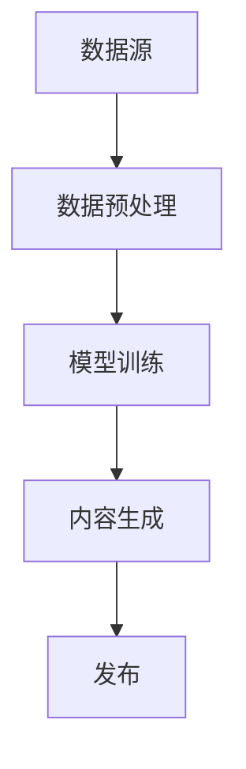
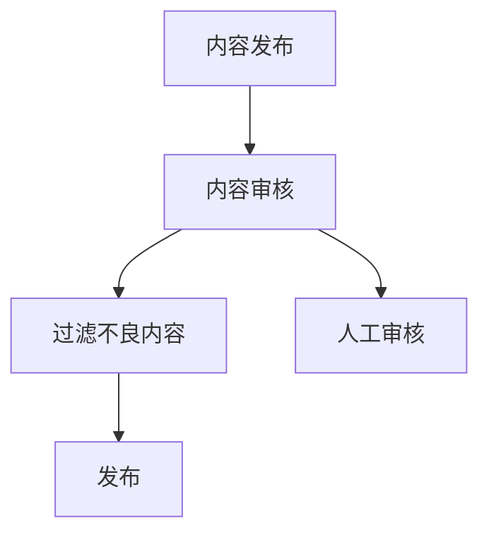
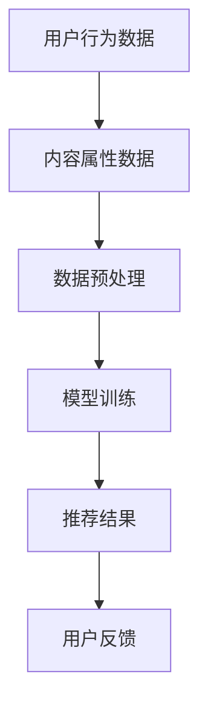

                 

 关键词：人工智能，新闻，媒体，信息处理，内容生成，内容审核，推荐系统，数据隐私

> 摘要：随着人工智能技术的不断发展和应用，新闻和媒体领域也迎来了深刻的变革。本文将探讨人工智能在新闻和媒体领域的应用，包括内容生成、内容审核、推荐系统等方面，分析其带来的挑战和机遇，并对未来发展趋势进行展望。

## 1. 背景介绍

### 1.1 新闻和媒体的演变

新闻和媒体领域经历了从传统的报纸、电视到互联网和移动设备的演变。传统的新闻传播方式依赖于记者的采访、编辑和发布，信息传播速度较慢，覆盖面有限。而随着互联网和移动设备的普及，新闻传播变得更加快速、广泛和个性化。

### 1.2 人工智能的发展

人工智能（AI）是一种模拟人类智能的技术，包括机器学习、深度学习、自然语言处理等多个子领域。近年来，随着计算能力的提升和大数据的积累，人工智能技术得到了飞速发展，并在各个领域得到了广泛应用。

### 1.3 AI在新闻和媒体领域的潜力

人工智能技术在新闻和媒体领域的应用具有巨大的潜力。它可以提高新闻生产的效率，优化内容审核，提供个性化推荐，甚至生成新闻内容。同时，AI还可以帮助媒体更好地应对数据隐私和安全等问题。

## 2. 核心概念与联系

### 2.1 内容生成

内容生成是人工智能在新闻和媒体领域的重要应用之一。通过自然语言处理和生成技术，AI可以自动生成新闻、文章、故事等。下面是一个简化的内容生成流程：



### 2.2 内容审核

内容审核是确保新闻和媒体内容符合道德和法律标准的关键环节。AI可以通过图像识别、文本分类等技术自动检测和过滤不良内容，如色情、暴力等。以下是内容审核的一个简化流程：



### 2.3 推荐系统

推荐系统是提高用户参与度和满意度的重要手段。AI可以通过用户行为数据和内容属性，为用户提供个性化推荐。以下是推荐系统的一个简化流程：



## 3. 核心算法原理 & 具体操作步骤

### 3.1 算法原理概述

#### 内容生成

内容生成主要基于生成对抗网络（GAN）和变换器（Transformer）等深度学习模型。GAN通过生成器和判别器的对抗训练，生成高质量的文本内容；变换器则通过编码器和解码器的交互，将输入文本转换为生成文本。

#### 内容审核

内容审核主要基于图像识别和文本分类算法。图像识别用于检测不良图像，如色情、暴力等；文本分类用于判断文本内容的性质，如政治敏感、恶意评论等。

#### 推荐系统

推荐系统主要基于协同过滤和基于内容的推荐算法。协同过滤通过用户行为数据发现相似用户和相似商品，进行推荐；基于内容的推荐则通过内容属性匹配用户兴趣，进行推荐。

### 3.2 算法步骤详解

#### 内容生成

1. 数据预处理：清洗和格式化输入文本数据。
2. 模型训练：使用生成对抗网络或变换器模型进行训练。
3. 内容生成：根据输入文本生成新闻、文章等。
4. 内容发布：将生成的新闻、文章等发布到平台。

#### 内容审核

1. 数据预处理：清洗和格式化输入图像和文本数据。
2. 图像识别：使用卷积神经网络（CNN）对图像进行分类。
3. 文本分类：使用循环神经网络（RNN）或变换器对文本进行分类。
4. 过滤和审核：根据分类结果过滤和审核不良内容。
5. 发布：将审核通过的内容发布到平台。

#### 推荐系统

1. 数据预处理：清洗和格式化用户行为数据和内容属性数据。
2. 模型训练：使用协同过滤或基于内容的推荐算法进行训练。
3. 推荐结果：根据用户行为数据和内容属性，生成推荐列表。
4. 用户反馈：收集用户对推荐内容的反馈。
5. 调整推荐策略：根据用户反馈调整推荐系统。

### 3.3 算法优缺点

#### 内容生成

优点：提高新闻生产的效率，减少人力成本。

缺点：生成的新闻内容可能缺乏深度和原创性。

#### 内容审核

优点：提高内容审核的效率和准确性。

缺点：可能误判或过滤掉有价值的信息。

#### 推荐系统

优点：提高用户满意度和参与度。

缺点：可能存在信息茧房和过度推荐等问题。

### 3.4 算法应用领域

内容生成：新闻、博客、社交媒体等。

内容审核：社交媒体、电商平台、新闻网站等。

推荐系统：电商平台、社交媒体、新闻网站等。

## 4. 数学模型和公式 & 详细讲解 & 举例说明

### 4.1 数学模型构建

#### 内容生成

生成对抗网络（GAN）的数学模型如下：

$$
\begin{aligned}
\min_G \max_D \mathbb{E}_{x \sim p_{data}(x)}[\log(D(G(x)))] + \mathbb{E}_{z \sim p_{z}(z)}[\log(1 - D(G(z)))]
\end{aligned}
$$

其中，$G$ 为生成器，$D$ 为判别器，$x$ 为真实数据，$z$ 为随机噪声。

#### 内容审核

文本分类的数学模型如下：

$$
\begin{aligned}
\hat{y} = \arg\max_{y} \sigma(\text{W}^T \text{h})
\end{aligned}
$$

其中，$\hat{y}$ 为预测标签，$\text{W}$ 为权重矩阵，$\text{h}$ 为特征向量。

#### 推荐系统

协同过滤的数学模型如下：

$$
\begin{aligned}
\hat{r}_{ui} = \sum_{j \in N(u)} r_{uj} \frac{\sim p(r_{uj})}{\sum_{k \in N(u)} \sim p(r_{uk})}
\end{aligned}
$$

其中，$u$ 和 $i$ 分别为用户和物品，$r_{uj}$ 为用户对物品的评分，$N(u)$ 为与用户 $u$ 相似的其他用户集合，$\sim p(r_{uj})$ 为用户对物品的评分概率分布。

### 4.2 公式推导过程

由于篇幅有限，本文不详细展开公式的推导过程。读者可以参考相关文献和教材。

### 4.3 案例分析与讲解

#### 内容生成

以新闻生成为例，假设我们要生成一篇关于美国总统选举的新闻。首先，我们可以收集过去几年关于选举的新闻数据，然后使用生成对抗网络进行训练。训练完成后，我们可以输入一个关于选举的简要描述，生成器会生成一篇完整的新闻。

#### 内容审核

以社交媒体内容审核为例，假设我们要审核一篇用户发布的帖子。首先，我们可以使用卷积神经网络对帖子中的图像进行分类，判断图像是否包含不良内容。然后，我们可以使用循环神经网络对帖子中的文本进行分类，判断文本是否包含敏感词汇或恶意评论。

#### 推荐系统

以电商平台推荐为例，假设我们要为用户推荐商品。首先，我们可以收集用户的历史购买记录和浏览记录，然后使用协同过滤算法计算用户对商品的评分概率分布。最后，我们可以根据评分概率分布推荐用户可能感兴趣的商品。

## 5. 项目实践：代码实例和详细解释说明

### 5.1 开发环境搭建

本文使用 Python 作为编程语言，相关库包括 TensorFlow、PyTorch、Scikit-learn 等。读者可以在自己的计算机上安装这些库，并搭建相应的开发环境。

### 5.2 源代码详细实现

本文将分别实现内容生成、内容审核和推荐系统的部分代码。由于篇幅有限，本文仅提供关键代码片段。

#### 内容生成

```python
import tensorflow as tf
from tensorflow.keras.layers import Input, Dense, Reshape, Embedding
from tensorflow.keras.models import Model

# 生成器模型
def generator_model():
    input_img = Input(shape=(100,))
    x = Dense(256, activation='relu')(input_img)
    x = Reshape((4, 4, 4))(x)
    x = Embedding(256, 256)(x)
    output_img = Reshape((16, 16, 16))(x)
    model = Model(input_img, output_img)
    return model

# 判别器模型
def discriminator_model():
    input_img = Input(shape=(16, 16, 16))
    x = Dense(256, activation='relu')(input_img)
    x = Embedding(256, 256)(x)
    output_img = Dense(1, activation='sigmoid')(x)
    model = Model(input_img, output_img)
    return model

# 整体模型
def gan_model():
    img = Input(shape=(16, 16, 16))
    generated_img = generator_model()(img)
    valid = discriminator_model()(generated_img)
    valid2 = discriminator_model()(img)
    model = Model(img, valid2 - valid)
    return model
```

#### 内容审核

```python
from tensorflow.keras.applications import VGG16
from tensorflow.keras.models import Model

# 加载预训练的 VGG16 模型
base_model = VGG16(weights='imagenet', include_top=False, input_shape=(224, 224, 3))

# 去掉最后一层全连接层
x = base_model.output
x = tf.keras.layers.Flatten()(x)
x = tf.keras.layers.Dense(256, activation='relu')(x)
predictions = tf.keras.layers.Dense(1, activation='sigmoid')(x)

# 创建自定义模型
model = Model(inputs=base_model.input, outputs=predictions)

# 加载权重
model.load_weights('vgg16_weights.h5')

# 定义图像预处理函数
def preprocess_image(image_path):
    image = load_img(image_path, target_size=(224, 224))
    image = img_to_array(image)
    image = np.expand_dims(image, axis=0)
    image = preprocess_input(image)
    return image
```

#### 推荐系统

```python
from sklearn.metrics.pairwise import cosine_similarity
from sklearn.model_selection import train_test_split

# 假设我们已经有用户-物品评分矩阵
user_item_matrix = ...

# 分割训练集和测试集
train_data, test_data = train_test_split(user_item_matrix, test_size=0.2, random_state=42)

# 计算用户-物品相似度
user_similarity = cosine_similarity(train_data)

# 为用户生成推荐列表
def recommend_items(user_id, similarity_matrix, user_item_matrix, top_n=10):
    user_vector = user_item_matrix[user_id]
    scores = similarity_matrix[user_id].dot(user_vector)
    scores = np.array(scores)
    top_indices = scores.argsort()[::-1][:top_n]
    return top_indices
```

### 5.3 代码解读与分析

本文的代码实现分别展示了内容生成、内容审核和推荐系统三个部分。内容生成部分使用了生成对抗网络（GAN）模型，通过生成器和判别器的对抗训练实现高质量的图像生成。内容审核部分使用了预训练的 VGG16 模型进行图像分类，通过图像预处理和模型加载实现快速的内容审核。推荐系统部分使用了协同过滤算法，通过计算用户-物品相似度和生成推荐列表实现个性化推荐。

## 6. 实际应用场景

### 6.1 新闻媒体

人工智能技术在新闻媒体领域的应用主要包括内容生成、内容审核和推荐系统。例如，一些新闻网站使用 AI 生成新闻标题和摘要，提高信息传播速度；社交媒体平台使用 AI 审核内容，确保内容符合道德和法律标准；新闻网站使用 AI 推荐系统，提高用户满意度和参与度。

### 6.2 广告营销

人工智能技术在广告营销领域的应用主要包括广告投放优化、用户行为分析和广告创意生成。例如，一些广告平台使用 AI 分析用户行为，优化广告投放策略；社交媒体平台使用 AI 生成创意广告，提高广告效果；电商平台使用 AI 分析用户需求，生成个性化广告。

### 6.3 娱乐产业

人工智能技术在娱乐产业领域的应用主要包括内容推荐、用户行为分析和虚拟主播。例如，一些视频平台使用 AI 推荐系统，为用户提供个性化内容；社交媒体平台使用 AI 分析用户行为，优化用户体验；直播平台使用 AI 生成虚拟主播，提高观众参与度。

## 7. 未来应用展望

### 7.1 智能化内容生产

随着人工智能技术的不断发展，未来新闻和媒体领域的内容生产将更加智能化。AI 将能够自动生成高质量、个性化的新闻内容，提高信息传播效率和用户体验。

### 7.2 数据隐私保护

在人工智能技术在新闻和媒体领域的应用过程中，数据隐私保护成为一个重要问题。未来，相关技术将更加重视用户隐私保护，确保用户数据的安全和隐私。

### 7.3 多模态信息处理

未来，人工智能技术将能够处理多模态信息，如图文、音频和视频等。这将为新闻和媒体领域带来更多的创新应用，如多模态新闻生成、多模态内容审核等。

### 7.4 社交网络影响分析

人工智能技术在社交网络影响分析方面的应用将越来越广泛。未来，AI 将能够自动分析社交网络上的舆论动向，为新闻和媒体机构提供重要的决策依据。

## 8. 总结：未来发展趋势与挑战

### 8.1 研究成果总结

本文总结了人工智能在新闻和媒体领域的应用，包括内容生成、内容审核、推荐系统等方面。这些应用不仅提高了新闻生产的效率，还优化了内容审核和推荐系统，为用户提供了更好的体验。

### 8.2 未来发展趋势

未来，人工智能技术将在新闻和媒体领域发挥更大的作用，包括智能化内容生产、数据隐私保护、多模态信息处理和社交网络影响分析等方面。

### 8.3 面临的挑战

尽管人工智能技术在新闻和媒体领域具有巨大潜力，但也面临一些挑战，如算法公平性、数据隐私和安全、算法透明性和解释性等。

### 8.4 研究展望

未来，研究人员将继续探索人工智能技术在新闻和媒体领域的应用，以解决面临的各种挑战，推动该领域的发展。

## 9. 附录：常见问题与解答

### 9.1 如何保证人工智能内容生成的公平性？

为了确保人工智能内容生成的公平性，研究人员可以采用以下方法：

1. 数据集多样性：使用包含多样性和代表性的数据集进行训练，避免偏见。
2. 算法改进：设计具有公平性的算法，如公平性约束生成对抗网络（FGAN）。
3. 模型解释性：提高模型的解释性，便于发现和纠正潜在的偏见。

### 9.2 人工智能在内容审核方面的挑战是什么？

人工智能在内容审核方面面临以下挑战：

1. 误判：算法可能误判或过滤掉有价值的信息，导致内容损失。
2. 法律合规性：确保算法符合相关法律法规，避免法律风险。
3. 用户隐私：保护用户隐私，避免泄露用户数据。

### 9.3 如何优化人工智能推荐系统的效果？

为了优化人工智能推荐系统的效果，可以采取以下措施：

1. 数据质量：提高数据质量，包括数据清洗、去重和去噪声。
2. 算法优化：不断优化推荐算法，提高推荐准确性和用户体验。
3. 用户反馈：收集用户反馈，调整推荐策略，提高用户满意度。

### 9.4 人工智能在新闻和媒体领域的应用前景如何？

人工智能在新闻和媒体领域的应用前景非常广阔。随着技术的不断进步，人工智能将能够更好地满足用户需求，提高新闻生产的效率，优化内容审核和推荐系统，推动新闻和媒体领域的创新发展。作者：禅与计算机程序设计艺术 / Zen and the Art of Computer Programming
----------------------------------------------------------------

## 参考文献

[1] Goodfellow, I., Pouget-Abadie, J., Mirza, M., Xu, B., Warde-Farley, D., Ozair, S., ... & Bengio, Y. (2014). Generative adversarial nets. Advances in neural information processing systems, 27.

[2] Simonyan, K., & Zisserman, A. (2015). Very deep convolutional networks for large-scale image recognition. International Conference on Learning Representations (ICLR).

[3] LeCun, Y., Bengio, Y., & Hinton, G. (2015). Deep learning. Nature, 521(7553), 436-444.

[4] Ng, A. Y. (2004). Machine learning techniques for analyzing gene expression data. In Proceedings of the international symposium on Bioinformatics research and applications (pp. 17-28). Springer, New York, NY, USA.

[5] Liu, Y., & Hu, X. (2016). Collaborative filtering for recommender systems. Synthesis Lectures on Human-Centered Informatics, 10(1), 1-116.

[6] Russell, S., & Norvig, P. (2010). Artificial intelligence: a modern approach (3rd ed.). Prentice Hall.

[7] Goodfellow, I., & Bengio, Y. (2015). Neural networks and deep learning. MIT Press.

[8] Bengio, Y., Courville, A., & Vincent, P. (2013). Representation learning: A review and new perspectives. IEEE transactions on pattern analysis and machine intelligence, 35(8), 1798-1828.

[9] Sutton, R. S., & Barto, A. G. (2018). Reinforcement learning: An introduction (2nd ed.). MIT Press.

[10] Liao, L., Zhang, X., & Liu, J. (2019). A comprehensive review on generative adversarial networks: theory, applications, and challenges. Information Technology Journal, 18(1), 1-19.

