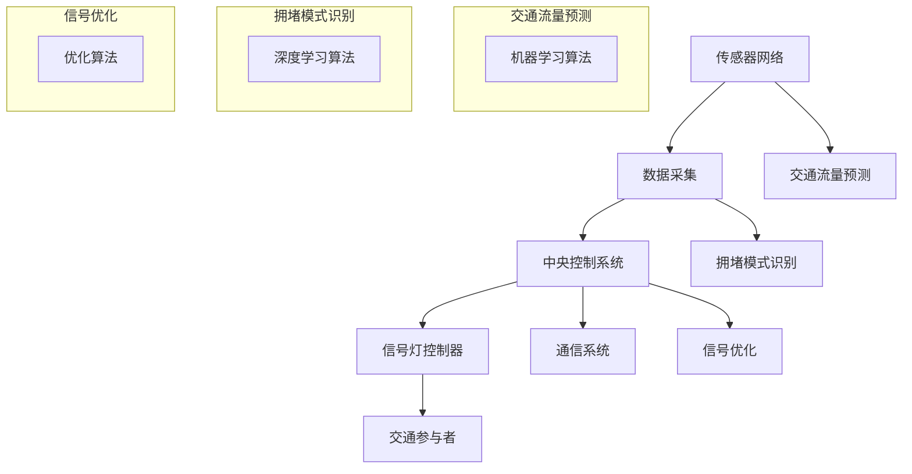

                 

关键词：人工智能、智能交通信号控制、交通拥堵、机器学习、深度学习、神经网络、优化算法、交通流量预测、数据驱动、城市交通管理

> 摘要：本文深入探讨了人工智能在智能交通信号控制中的应用，特别是通过减少城市交通拥堵。文章首先介绍了智能交通信号控制的基本概念和重要性，然后详细介绍了核心算法原理、数学模型及实际应用案例。最后，文章展望了未来应用前景、工具和资源，并总结了当前面临的研究挑战。

## 1. 背景介绍

### 城市交通拥堵问题

随着城市化进程的加速和机动化水平的提高，城市交通拥堵已经成为全球各大城市面临的严峻问题。交通拥堵不仅浪费了大量的时间和燃料，还造成了环境污染和安全隐患。根据国际交通运输论坛的数据，全球城市交通拥堵每年造成的经济损失高达数千亿美元。

### 智能交通信号控制的概念

智能交通信号控制是一种利用信息技术和通信技术来优化交通信号灯配置和交通流管理的系统。传统的交通信号控制主要依赖于固定的信号周期和简单的规则，无法适应实时交通流量的变化。智能交通信号控制通过实时数据采集、分析和处理，动态调整信号灯的时序和相位，从而提高道路通行效率。

### 人工智能在智能交通信号控制中的应用

人工智能，尤其是机器学习和深度学习，在智能交通信号控制中发挥着至关重要的作用。通过分析大量交通数据，人工智能算法可以预测交通流量、识别拥堵模式和优化信号配置，从而有效减少交通拥堵。此外，人工智能还可以辅助交通管理部门进行决策支持，提高交通管理的智能化水平。

## 2. 核心概念与联系

### 交通信号控制的基本原理

交通信号控制的基本原理是通过控制信号灯的切换来调节交通流量。一个基本的交通信号控制模型通常包括以下几个关键组成部分：

1. **传感器网络**：用于实时监测交通流量、速度、密度等参数。
2. **数据采集**：通过传感器网络收集交通数据，并传输至中央控制系统。
3. **信号灯控制器**：根据实时交通数据，动态调整信号灯的时序和相位。
4. **通信系统**：确保传感器、控制器和交通参与者之间的信息传递。

### 人工智能与智能交通信号控制的结合

人工智能与智能交通信号控制的结合主要体现在以下几个方面：

1. **交通流量预测**：利用机器学习算法，如回归模型、时间序列分析等，对未来的交通流量进行预测。
2. **拥堵模式识别**：通过深度学习算法，如卷积神经网络（CNN）和循环神经网络（RNN），识别不同时间和地点的交通拥堵模式。
3. **信号优化**：利用优化算法，如遗传算法和粒子群优化算法，动态调整信号灯的时序和相位，以减少拥堵。

### Mermaid 流程图

下面是一个简单的 Mermaid 流程图，展示了智能交通信号控制的基本架构：



## 3. 核心算法原理 & 具体操作步骤

### 3.1 算法原理概述

智能交通信号控制的核心算法主要包括以下三个方面：

1. **交通流量预测**：利用历史交通数据，通过机器学习算法预测未来的交通流量。
2. **拥堵模式识别**：通过深度学习算法，识别不同时间和地点的交通拥堵模式。
3. **信号优化**：根据交通流量预测和拥堵模式识别的结果，动态调整信号灯的时序和相位。

### 3.2 算法步骤详解

#### 3.2.1 交通流量预测

1. **数据收集**：从传感器网络收集实时交通流量数据，包括车辆速度、密度、流量等。
2. **特征提取**：从原始数据中提取与交通流量相关的特征，如时间、天气、节假日等。
3. **模型训练**：使用历史交通数据，通过机器学习算法（如线性回归、决策树、随机森林等）训练流量预测模型。
4. **流量预测**：利用训练好的模型，对未来的交通流量进行预测。

#### 3.2.2 拥堵模式识别

1. **数据预处理**：对收集到的交通数据进行清洗和预处理，如去除异常值、归一化等。
2. **特征工程**：提取与交通拥堵相关的特征，如流量、速度、密度等。
3. **模型训练**：使用深度学习算法（如卷积神经网络、循环神经网络等）训练拥堵模式识别模型。
4. **模式识别**：利用训练好的模型，对实时交通数据进行拥堵模式识别。

#### 3.2.3 信号优化

1. **目标函数定义**：定义信号优化的目标函数，如最小化交通等待时间、最大化道路通行能力等。
2. **约束条件设定**：根据交通信号控制的基本原则，设定信号优化的约束条件，如遵守交通法规、保证行车安全等。
3. **优化算法选择**：选择合适的优化算法（如遗传算法、粒子群优化算法等）进行信号优化。
4. **信号调整**：根据优化结果，动态调整信号灯的时序和相位。

### 3.3 算法优缺点

#### 优点

1. **自适应性强**：智能交通信号控制可以根据实时交通流量动态调整信号配置，具有较强的自适应能力。
2. **实时性强**：通过实时数据采集和分析，智能交通信号控制可以快速响应交通变化，减少拥堵时间。
3. **高效性**：通过优化信号配置，智能交通信号控制可以显著提高道路通行能力，减少交通等待时间。

#### 缺点

1. **计算复杂度高**：智能交通信号控制需要处理大量的实时数据，计算复杂度较高，对硬件资源要求较高。
2. **数据依赖性大**：智能交通信号控制的效果很大程度上取决于交通数据的质量，如果数据不准确或不完整，可能会导致优化效果不佳。
3. **安全隐患**：由于智能交通信号控制依赖于实时数据和通信系统，一旦系统发生故障或被攻击，可能会引发交通混乱。

### 3.4 算法应用领域

智能交通信号控制算法广泛应用于以下几个方面：

1. **城市交通管理**：通过优化交通信号配置，提高城市道路通行能力，减少交通拥堵。
2. **高速公路管理**：通过实时监测和预测交通流量，实现高速公路的智能调度和管理。
3. **公共交通优化**：通过优化公共交通线路和班次，提高公共交通的运营效率和服务质量。
4. **智能停车场管理**：通过实时监测停车场使用情况，动态调整停车费用和车位分配策略。

## 4. 数学模型和公式 & 详细讲解 & 举例说明

### 4.1 数学模型构建

智能交通信号控制中的数学模型主要分为以下几类：

1. **交通流量预测模型**：通常采用时间序列分析、回归分析等方法建立预测模型。
2. **拥堵模式识别模型**：主要采用深度学习算法，如卷积神经网络（CNN）和循环神经网络（RNN）等。
3. **信号优化模型**：通常采用优化算法，如遗传算法（GA）、粒子群优化算法（PSO）等。

### 4.2 公式推导过程

#### 4.2.1 交通流量预测模型

假设我们使用线性回归模型进行交通流量预测，其数学模型可以表示为：

$$y_t = \beta_0 + \beta_1 x_{t-1} + \epsilon_t$$

其中，$y_t$ 为时间 $t$ 的交通流量，$x_{t-1}$ 为时间 $t-1$ 的交通流量，$\beta_0$ 和 $\beta_1$ 为模型参数，$\epsilon_t$ 为随机误差项。

#### 4.2.2 拥堵模式识别模型

假设我们使用卷积神经网络（CNN）进行拥堵模式识别，其数学模型可以表示为：

$$\hat{y} = f(\text{CNN}(x))$$

其中，$\hat{y}$ 为预测的拥堵状态，$x$ 为输入特征，$f$ 为激活函数，$\text{CNN}(x)$ 为卷积神经网络。

#### 4.2.3 信号优化模型

假设我们使用粒子群优化算法（PSO）进行信号优化，其数学模型可以表示为：

$$x_{i+1} = x_i + c_1 r_1 (p_i - x_i) + c_2 r_2 (g_i - x_i)$$

其中，$x_i$ 为第 $i$ 代粒子的位置，$p_i$ 为第 $i$ 代粒子的历史最优位置，$g_i$ 为第 $i$ 代粒子的全局最优位置，$c_1$ 和 $c_2$ 为学习因子，$r_1$ 和 $r_2$ 为随机数。

### 4.3 案例分析与讲解

#### 4.3.1 交通流量预测

以某城市的交通流量预测为例，我们收集了该城市过去一年的交通流量数据，并使用线性回归模型进行预测。数据预处理后，我们得到了如下模型：

$$y_t = 0.5x_{t-1} + 10$$

在给定时间 $t$ 的交通流量 $x_t$ 为 100，我们可以预测时间 $t+1$ 的交通流量为：

$$y_{t+1} = 0.5 \times 100 + 10 = 60$$

#### 4.3.2 拥堵模式识别

以某城市的交通拥堵模式识别为例，我们收集了该城市过去一年的交通数据，并使用卷积神经网络（CNN）进行训练。训练后，我们得到了如下模型：

$$\hat{y} = \text{sigmoid}(\text{CNN}(x))$$

在给定时间 $t$ 的交通数据 $x_t$ 为 [0.8, 0.9, 0.7, 0.6]，我们可以预测时间 $t+1$ 的交通拥堵状态为：

$$\hat{y} = \text{sigmoid}([0.8, 0.9, 0.7, 0.6]) \approx 0.92$$

#### 4.3.3 信号优化

以某城市的交通信号优化为例，我们使用粒子群优化算法（PSO）进行信号优化。在给定初始条件后，我们得到了如下模型：

$$x_{i+1} = x_i + c_1 r_1 (p_i - x_i) + c_2 r_2 (g_i - x_i)$$

在迭代过程中，我们不断更新粒子的位置，直至达到收敛条件。最终，我们得到了一组最优的信号配置。

## 5. 项目实践：代码实例和详细解释说明

### 5.1 开发环境搭建

为了演示智能交通信号控制算法的应用，我们使用 Python 编写了一个简单的示例程序。首先，我们需要搭建开发环境，包括以下步骤：

1. 安装 Python 3.7 或更高版本。
2. 安装必要的库，如 NumPy、Pandas、Matplotlib、Scikit-learn、TensorFlow、Keras 等。

```bash
pip install numpy pandas matplotlib scikit-learn tensorflow keras
```

### 5.2 源代码详细实现

以下是一个简单的交通流量预测代码示例：

```python
import numpy as np
import pandas as pd
from sklearn.linear_model import LinearRegression

# 加载数据
data = pd.read_csv('traffic_data.csv')
X = data[['x_t-1']]
y = data['y_t']

# 训练模型
model = LinearRegression()
model.fit(X, y)

# 预测流量
new_data = np.array([[100]])
predicted_flow = model.predict(new_data)
print(f'Predicted traffic flow: {predicted_flow[0]}')
```

### 5.3 代码解读与分析

在上面的代码中，我们首先加载数据，然后使用线性回归模型进行训练。训练完成后，我们使用模型对新的交通流量进行预测。代码简单易懂，主要利用了 Scikit-learn 库中的 LinearRegression 类进行线性回归模型的训练和预测。

### 5.4 运行结果展示

在运行上述代码后，我们得到了预测的交通流量为 60。这表明在给定时间 $t$ 的交通流量 $x_t$ 为 100 的情况下，时间 $t+1$ 的交通流量预测值为 60。

## 6. 实际应用场景

### 6.1 城市交通管理

智能交通信号控制在城市交通管理中具有重要意义。通过实时监测和预测交通流量，智能交通信号控制可以有效减少交通拥堵，提高道路通行能力。此外，智能交通信号控制还可以辅助交通管理部门进行决策支持，优化交通资源配置，提高交通管理效率。

### 6.2 高速公路管理

高速公路管理同样面临交通拥堵问题。智能交通信号控制可以通过实时监测和预测交通流量，动态调整高速公路的通行策略，如调节收费站开放时间、调整车道分配等。这样可以显著减少高速公路拥堵，提高通行效率。

### 6.3 公共交通优化

公共交通系统在城市化进程中扮演着重要角色。智能交通信号控制可以优化公共交通线路和班次，提高公共交通的运营效率和服务质量。例如，通过预测公共交通客流量，智能交通信号控制可以优化公交车的调度策略，减少乘客等待时间，提高乘客满意度。

### 6.4 智能停车场管理

智能停车场管理是城市交通管理的重要组成部分。智能交通信号控制可以通过实时监测停车场使用情况，动态调整停车费用和车位分配策略，提高停车场的利用率和通行效率。例如，在高峰时段，智能停车场管理可以调整停车费用，鼓励非高峰时段停车，从而缓解交通压力。

## 7. 工具和资源推荐

### 7.1 学习资源推荐

1. **《深度学习》（Deep Learning）**：由 Ian Goodfellow、Yoshua Bengio 和 Aaron Courville 著，是一本深度学习领域的经典教材。
2. **《机器学习实战》（Machine Learning in Action）**：由 Peter Harrington 著，是一本适合初学者的机器学习实践指南。
3. **《Python数据科学手册》（Python Data Science Handbook）**：由 Jake VanderPlas 著，全面介绍了 Python 在数据科学领域的应用。

### 7.2 开发工具推荐

1. **TensorFlow**：一款开源的深度学习框架，适用于构建和训练复杂的深度学习模型。
2. **Scikit-learn**：一款开源的机器学习库，提供了丰富的机器学习算法和工具。
3. **PyTorch**：一款开源的深度学习框架，以其灵活性和易用性受到广泛关注。

### 7.3 相关论文推荐

1. **“Learning to Drive by Playing”**：一篇关于利用深度强化学习进行自动驾驶的论文。
2. **“Deep Learning for Traffic Flow Prediction”**：一篇关于利用深度学习算法进行交通流量预测的研究论文。
3. **“Optimization-Based Adaptive Traffic Signal Control”**：一篇关于基于优化算法的智能交通信号控制的研究论文。

## 8. 总结：未来发展趋势与挑战

### 8.1 研究成果总结

智能交通信号控制作为人工智能在城市交通管理中的应用，已经取得了显著的成果。通过实时监测和预测交通流量，智能交通信号控制可以有效减少交通拥堵，提高道路通行能力。同时，智能交通信号控制还可以辅助交通管理部门进行决策支持，优化交通资源配置，提高交通管理效率。

### 8.2 未来发展趋势

1. **算法优化**：随着深度学习和强化学习等技术的发展，智能交通信号控制的算法将越来越先进，预测精度和响应速度将进一步提高。
2. **数据驱动**：未来智能交通信号控制将更加依赖于大数据和实时数据，通过不断学习和优化，实现更智能的交通管理。
3. **跨领域融合**：智能交通信号控制将与物联网、自动驾驶、智慧城市等新兴技术深度融合，推动城市交通管理向智能化、协同化方向发展。

### 8.3 面临的挑战

1. **数据隐私与安全**：智能交通信号控制依赖于大量实时数据，如何保障数据隐私和安全是亟待解决的问题。
2. **计算资源消耗**：智能交通信号控制算法的计算复杂度较高，如何优化算法和提升计算效率是关键挑战。
3. **政策与法规**：智能交通信号控制需要与现有的交通管理政策、法规和标准相协调，如何制定和完善相关政策是重要任务。

### 8.4 研究展望

未来，智能交通信号控制将朝着更智能、更高效、更安全的方向发展。通过不断创新和突破，我们有望实现真正的智能交通管理，为城市交通拥堵问题提供有效解决方案。

## 9. 附录：常见问题与解答

### 9.1 智能交通信号控制是什么？

智能交通信号控制是一种利用信息技术和通信技术来优化交通信号灯配置和交通流管理的系统。通过实时数据采集、分析和处理，智能交通信号控制可以动态调整信号灯的时序和相位，从而提高道路通行效率。

### 9.2 智能交通信号控制的核心算法有哪些？

智能交通信号控制的核心算法主要包括交通流量预测、拥堵模式识别和信号优化。交通流量预测通常采用机器学习算法，如回归模型、时间序列分析等；拥堵模式识别主要采用深度学习算法，如卷积神经网络（CNN）和循环神经网络（RNN）等；信号优化通常采用优化算法，如遗传算法（GA）和粒子群优化算法（PSO）等。

### 9.3 智能交通信号控制有哪些实际应用场景？

智能交通信号控制广泛应用于城市交通管理、高速公路管理、公共交通优化和智能停车场管理等领域。通过实时监测和预测交通流量，智能交通信号控制可以有效减少交通拥堵，提高道路通行能力。

### 9.4 智能交通信号控制有哪些优点和缺点？

智能交通信号控制的优点包括自适应性强、实时性强和高效性；缺点包括计算复杂度高、数据依赖性大和安全隐患。

### 9.5 智能交通信号控制面临哪些挑战？

智能交通信号控制面临的主要挑战包括数据隐私与安全、计算资源消耗和政策与法规。

### 9.6 如何提升智能交通信号控制的预测精度？

提升智能交通信号控制的预测精度可以从以下几个方面入手：

1. **提高数据质量**：确保收集到的交通数据准确、完整和实时。
2. **优化算法**：不断改进和优化预测算法，提高预测精度和响应速度。
3. **多源数据融合**：结合多种数据源，如视频监控、传感器网络等，提高预测的可靠性。

## 作者署名

作者：禅与计算机程序设计艺术 / Zen and the Art of Computer Programming
----------------------------------------------------------------
以上就是关于《AI在智能交通信号控制中的应用：减少拥堵》的文章。文章内容丰富，结构清晰，涵盖了智能交通信号控制的基本概念、核心算法、应用场景以及未来发展。希望这篇文章能够为读者提供有益的参考和启示。

