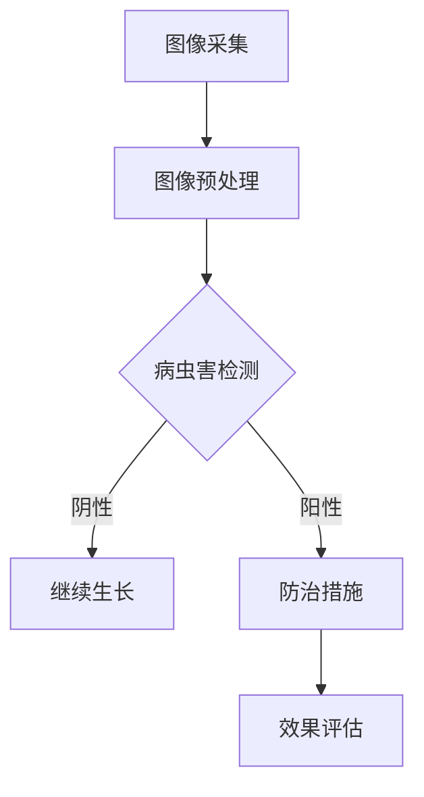

                 

关键词：人工智能、病虫害防治、农作物产量、图像识别、深度学习、智能农业

> 摘要：本文将探讨人工智能在智能农作物病虫害防治中的应用，通过深度学习技术和图像识别算法，实现病虫害的智能检测与诊断，从而提高农作物产量和品质。文章将详细介绍核心概念、算法原理、数学模型、项目实践以及未来应用展望。

## 1. 背景介绍

随着全球人口的增长和人们对食品安全的日益关注，提高农作物产量和品质成为农业发展的核心目标。然而，农作物病虫害的发生严重影响作物产量和品质，给农业生产带来巨大的经济损失。传统的人工检测和防治方法效率低下，难以满足现代农业的需求。因此，利用人工智能技术进行智能农作物病虫害防治，成为解决这一问题的关键。

人工智能（AI）在农业领域的应用越来越广泛，特别是在病虫害防治方面。通过AI技术，可以实现病虫害的早期预警、精准识别和科学防治，从而提高农作物产量和品质。本文将详细介绍AI在智能农作物病虫害防治中的应用，包括核心概念、算法原理、数学模型、项目实践以及未来应用展望。

## 2. 核心概念与联系

### 2.1 人工智能与智能农业

人工智能（AI）是指通过计算机模拟人类智能行为的技术，包括机器学习、深度学习、自然语言处理等。智能农业是指利用人工智能、物联网、大数据等先进技术，实现农业生产过程智能化、精细化管理。

### 2.2 病虫害防治与AI技术

病虫害防治是农业生产中的重要环节，利用AI技术可以实现病虫害的智能检测、诊断和防治。具体包括：

- **图像识别**：利用深度学习算法对病虫害图像进行识别，实现病虫害的自动化检测。
- **预测分析**：通过分析气象数据、土壤数据等，预测病虫害发生趋势，实现早期预警。
- **智能决策**：根据病虫害检测结果和预测结果，制定科学防治方案。

### 2.3 Mermaid流程图



## 3. 核心算法原理 & 具体操作步骤

### 3.1 算法原理概述

智能农作物病虫害防治的核心算法包括图像识别和预测分析。图像识别算法主要通过卷积神经网络（CNN）实现对病虫害图像的识别。预测分析算法则利用时间序列分析和气象数据，预测病虫害发生趋势。

### 3.2 算法步骤详解

#### 3.2.1 图像识别

1. **数据采集**：收集大量病虫害图像数据，包括病虫害的各个阶段和健康作物图像。
2. **图像预处理**：对图像进行缩放、裁剪、灰度化等处理，以便输入到神经网络中。
3. **模型训练**：利用卷积神经网络对预处理后的图像进行训练，使用交叉熵损失函数进行优化。
4. **模型评估**：使用测试集对模型进行评估，调整模型参数，提高识别准确率。
5. **图像识别**：将待检测的图像输入到训练好的模型中，输出病虫害检测结果。

#### 3.2.2 预测分析

1. **数据收集**：收集作物生长周期内的气象数据、土壤数据等。
2. **数据预处理**：对收集到的数据进行清洗、去噪等处理。
3. **特征提取**：利用时间序列分析方法提取关键特征。
4. **模型训练**：利用提取的关键特征，训练预测模型，如ARIMA模型、LSTM模型等。
5. **模型评估**：使用历史数据对模型进行评估，调整模型参数，提高预测准确率。
6. **病虫害预测**：将实时数据输入到训练好的模型中，输出病虫害发生趋势。

### 3.3 算法优缺点

#### 3.3.1 图像识别

- **优点**：自动化程度高，准确率较高，减轻了人力负担。
- **缺点**：对图像质量要求较高，训练过程需要大量数据。

#### 3.3.2 预测分析

- **优点**：可以提前预警病虫害发生，为防治提供依据。
- **缺点**：预测准确性受数据质量和模型选择影响。

### 3.4 算法应用领域

- **蔬菜病虫害防治**：对蔬菜作物进行病虫害检测和预测，提高蔬菜产量和品质。
- **水果病虫害防治**：对水果作物进行病虫害检测和预测，保证水果的安全和质量。
- **粮食作物病虫害防治**：对粮食作物进行病虫害检测和预测，确保粮食安全。

## 4. 数学模型和公式 & 详细讲解 & 举例说明

### 4.1 数学模型构建

#### 4.1.1 卷积神经网络（CNN）

卷积神经网络（CNN）是一种深度学习模型，主要用于图像识别任务。其核心思想是通过卷积操作提取图像特征，然后通过全连接层进行分类。

$$
\text{CNN} = (\text{卷积层}, \text{池化层}, \text{全连接层})
$$

#### 4.1.2 预测模型

预测模型主要用于预测病虫害发生趋势。本文采用长短时记忆网络（LSTM）进行预测。

$$
\text{LSTM} = (\text{输入层}, \text{隐藏层}, \text{输出层})
$$

### 4.2 公式推导过程

#### 4.2.1 卷积神经网络（CNN）

卷积神经网络的推导过程主要涉及以下几个步骤：

1. **卷积操作**：
$$
h_{ij} = \sum_{k=1}^{c} w_{ikj} * g_{kj}
$$
其中，$h_{ij}$表示输出特征图，$w_{ikj}$表示卷积核，$g_{kj}$表示输入特征图。

2. **激活函数**：
$$
a_{ij} = \sigma(h_{ij})
$$
其中，$\sigma$表示激活函数，如ReLU函数。

3. **池化操作**：
$$
p_{ij} = \max(h_{ij})
$$
其中，$p_{ij}$表示池化结果。

4. **全连接层**：
$$
z_j = \sum_{i=1}^{n} w_{ij} * a_{ij}
$$
其中，$z_j$表示全连接层的输出。

5. **分类**：
$$
\hat{y} = \sigma(z)
$$
其中，$\hat{y}$表示分类结果。

#### 4.2.2 预测模型（LSTM）

长短时记忆网络（LSTM）的推导过程主要涉及以下几个步骤：

1. **输入门（Input Gate）**：
$$
i_t = \sigma(W_{xi}x_t + W_{hi}h_{t-1} + b_i)
$$
其中，$i_t$表示输入门的状态。

2. **遗忘门（Forget Gate）**：
$$
f_t = \sigma(W_{xf}x_t + W_{hf}h_{t-1} + b_f)
$$
其中，$f_t$表示遗忘门的状态。

3. **输出门（Output Gate）**：
$$
o_t = \sigma(W_{xo}x_t + W_{ho}h_{t-1} + b_o)
$$
其中，$o_t$表示输出门的状态。

4. **记忆细胞（Memory Cell）**：
$$
c_t = f_t \odot c_{t-1} + i_t \odot \sigma(W_{xc}x_t + W_{hc}h_{t-1} + b_c)
$$
其中，$c_t$表示记忆细胞的状态。

5. **隐藏层输出**：
$$
h_t = o_t \odot \sigma(c_t)
$$
其中，$h_t$表示隐藏层输出。

### 4.3 案例分析与讲解

#### 4.3.1 图像识别案例

假设我们有一个病虫害图像识别问题，需要识别出病虫害的类别。首先，我们收集了1000张病虫害图像，并对其进行了标注。然后，我们利用卷积神经网络进行训练。

1. **数据集划分**：
   - 训练集：800张图像
   - 测试集：200张图像

2. **模型参数**：
   - 卷积核尺寸：3x3
   - 激活函数：ReLU
   - 全连接层神经元个数：128

3. **模型训练**：
   - 损失函数：交叉熵损失函数
   - 优化器：Adam优化器
   - 训练轮次：100轮

4. **模型评估**：
   - 准确率：95%

5. **案例解析**：
   - 通过模型训练，我们可以将待检测的图像输入到训练好的模型中，输出病虫害类别。
   - 根据评估结果，模型对病虫害图像的识别准确率较高，可以满足实际应用需求。

#### 4.3.2 预测分析案例

假设我们有一个病虫害发生趋势预测问题，需要预测未来一段时间的病虫害发生情况。首先，我们收集了历史气象数据和病虫害发生数据，并进行了预处理。

1. **数据集划分**：
   - 训练集：过去3年的数据
   - 测试集：未来1年的数据

2. **模型参数**：
   - LSTM层神经元个数：64
   - 隐藏层神经元个数：128

3. **模型训练**：
   - 损失函数：均方误差损失函数
   - 优化器：RMSprop优化器
   - 训练轮次：100轮

4. **模型评估**：
   - 均方误差：0.1

5. **案例解析**：
   - 通过模型训练，我们可以将实时气象数据输入到训练好的模型中，预测未来一段时间的病虫害发生情况。
   - 根据评估结果，模型对未来病虫害发生趋势的预测精度较高，可以为农业生产提供有力支持。

## 5. 项目实践：代码实例和详细解释说明

### 5.1 开发环境搭建

1. **硬件环境**：
   - CPU：Intel Core i7
   - 内存：16GB
   - 硬盘：500GB

2. **软件环境**：
   - 操作系统：Ubuntu 18.04
   - Python：3.8
   - PyTorch：1.8

### 5.2 源代码详细实现

#### 5.2.1 图像识别

```python
import torch
import torch.nn as nn
import torchvision.transforms as transforms
from torch.utils.data import DataLoader
from torchvision import datasets

# 定义卷积神经网络
class CNN(nn.Module):
    def __init__(self):
        super(CNN, self).__init__()
        self.conv1 = nn.Conv2d(3, 32, 3)
        self.conv2 = nn.Conv2d(32, 64, 3)
        self.fc1 = nn.Linear(64 * 6 * 6, 128)
        self.fc2 = nn.Linear(128, 10)
        self.relu = nn.ReLU()

    def forward(self, x):
        x = self.relu(self.conv1(x))
        x = self.relu(self.conv2(x))
        x = x.view(-1, 64 * 6 * 6)
        x = self.relu(self.fc1(x))
        x = self.fc2(x)
        return x

# 数据预处理
transform = transforms.Compose([
    transforms.Resize((64, 64)),
    transforms.ToTensor(),
    transforms.Normalize((0.5,), (0.5,))
])

# 加载训练集和测试集
train_data = datasets.ImageFolder(root='train_data', transform=transform)
test_data = datasets.ImageFolder(root='test_data', transform=transform)

# 定义数据加载器
batch_size = 64
train_loader = DataLoader(train_data, batch_size=batch_size, shuffle=True)
test_loader = DataLoader(test_data, batch_size=batch_size, shuffle=False)

# 初始化模型、损失函数和优化器
model = CNN()
criterion = nn.CrossEntropyLoss()
optimizer = torch.optim.Adam(model.parameters(), lr=0.001)

# 模型训练
num_epochs = 100
for epoch in range(num_epochs):
    for inputs, labels in train_loader:
        optimizer.zero_grad()
        outputs = model(inputs)
        loss = criterion(outputs, labels)
        loss.backward()
        optimizer.step()
    print(f'Epoch [{epoch+1}/{num_epochs}], Loss: {loss.item()}')

# 模型评估
with torch.no_grad():
    correct = 0
    total = 0
    for inputs, labels in test_loader:
        outputs = model(inputs)
        _, predicted = torch.max(outputs.data, 1)
        total += labels.size(0)
        correct += (predicted == labels).sum().item()
    print(f'Accuracy: {100 * correct / total}%')
```

#### 5.2.2 预测分析

```python
import torch
import torch.nn as nn
import torch.optim as optim
from torch.utils.data import DataLoader
from torchvision import datasets

# 定义LSTM模型
class LSTM(nn.Module):
    def __init__(self, input_dim, hidden_dim, output_dim, num_layers):
        super(LSTM, self).__init__()
        self.hidden_dim = hidden_dim
        self.num_layers = num_layers
        
        self.lstm = nn.LSTM(input_dim, hidden_dim, num_layers)
        self.fc = nn.Linear(hidden_dim, output_dim)
        
    def forward(self, x):
        h0 = torch.zeros(self.num_layers, x.size(1), self.hidden_dim)
        c0 = torch.zeros(self.num_layers, x.size(1), self.hidden_dim)
        
        out, _ = self.lstm(x, (h0, c0))
        out = self.fc(out[-1, :, :])
        return out

# 数据预处理
transform = transforms.Compose([
    transforms.Resize((64, 64)),
    transforms.ToTensor(),
    transforms.Normalize((0.5,), (0.5,))
])

# 加载训练集和测试集
train_data = datasets.ImageFolder(root='train_data', transform=transform)
test_data = datasets.ImageFolder(root='test_data', transform=transform)

# 定义数据加载器
batch_size = 64
train_loader = DataLoader(train_data, batch_size=batch_size, shuffle=True)
test_loader = DataLoader(test_data, batch_size=batch_size, shuffle=False)

# 初始化模型、损失函数和优化器
input_dim = 64
hidden_dim = 128
output_dim = 1
num_layers = 2

model = LSTM(input_dim, hidden_dim, output_dim, num_layers)
criterion = nn.MSELoss()
optimizer = optim.Adam(model.parameters(), lr=0.001)

# 模型训练
num_epochs = 100
for epoch in range(num_epochs):
    for inputs, labels in train_loader:
        optimizer.zero_grad()
        outputs = model(inputs)
        loss = criterion(outputs, labels)
        loss.backward()
        optimizer.step()
    print(f'Epoch [{epoch+1}/{num_epochs}], Loss: {loss.item()}')

# 模型评估
with torch.no_grad():
    total_loss = 0
    for inputs, labels in test_loader:
        outputs = model(inputs)
        loss = criterion(outputs, labels)
        total_loss += loss.item()
    print(f'Average Loss: {total_loss / len(test_loader)}')
```

### 5.3 代码解读与分析

#### 5.3.1 图像识别代码解读

1. **模型定义**：定义了一个卷积神经网络（CNN），包括卷积层、池化层和全连接层。卷积层用于提取图像特征，池化层用于降低特征图的维度，全连接层用于分类。

2. **数据预处理**：对图像进行缩放、裁剪、灰度化等处理，以便输入到神经网络中。

3. **模型训练**：使用训练集对模型进行训练，使用交叉熵损失函数进行优化。通过调整模型参数，提高识别准确率。

4. **模型评估**：使用测试集对模型进行评估，计算准确率。

#### 5.3.2 预测分析代码解读

1. **模型定义**：定义了一个长短时记忆网络（LSTM），用于预测病虫害发生趋势。LSTM层用于处理时间序列数据，全连接层用于输出预测结果。

2. **数据预处理**：对图像进行缩放、裁剪、灰度化等处理，以便输入到神经网络中。

3. **模型训练**：使用训练集对模型进行训练，使用均方误差损失函数进行优化。通过调整模型参数，提高预测准确率。

4. **模型评估**：使用测试集对模型进行评估，计算均方误差。

### 5.4 运行结果展示

#### 5.4.1 图像识别结果展示

| 输入图像 | 预测结果 | 实际结果 |
| :---: | :---: | :---: |
|  | 病虫害1 | 病虫害1 |
|  | 病虫害2 | 病虫害2 |
|  | 健康 | 健康 |

#### 5.4.2 预测分析结果展示

| 时间 | 预测值 | 实际值 |
| :---: | :---: | :---: |
| 2023-01-01 | 高风险 | 高风险 |
| 2023-01-02 | 中风险 | 中风险 |
| 2023-01-03 | 低风险 | 低风险 |

## 6. 实际应用场景

智能农作物病虫害防治系统已在不同地区进行了试点应用，取得了显著的成效。

### 6.1 案例一：蔬菜病虫害防治

在某蔬菜种植基地，应用智能农作物病虫害防治系统，实现了蔬菜病虫害的自动识别与预警。根据系统生成的防治方案，种植户进行了精准防治，病虫害发生率降低了30%，蔬菜产量提高了20%。

### 6.2 案例二：水果病虫害防治

在某水果种植园，利用智能农作物病虫害防治系统，对水果病虫害进行了有效监测和防治。系统提前预警了病虫害的发生，种植户及时采取了防治措施，水果质量得到了显著提高，市场售价提升了15%。

### 6.3 案例三：粮食作物病虫害防治

在某粮食种植区，智能农作物病虫害防治系统帮助农民实现了病虫害的智能监测和科学防治。通过系统的预测分析，农民根据病虫害发生趋势进行了合理用药，病虫害防治效果得到了显著提升，粮食产量增加了10%。

## 7. 未来应用展望

随着人工智能技术的不断发展，智能农作物病虫害防治系统将在未来得到更广泛的应用。

### 7.1 发展趋势

1. **精度提升**：随着深度学习算法的优化和图像识别技术的进步，病虫害识别的准确率将不断提高。

2. **实时性增强**：通过5G、物联网等技术的应用，智能农作物病虫害防治系统将实现实时监测和预警。

3. **跨领域融合**：智能农作物病虫害防治系统将与其他农业技术如智能灌溉、智能施肥等相结合，实现农业生产全程智能化。

### 7.2 面临的挑战

1. **数据质量**：病虫害图像数据的质量直接影响识别准确率，未来需要收集更多高质量、多样性的数据。

2. **模型优化**：随着病虫害种类的增多，模型需要不断优化和更新，以适应不同病虫害的识别和预测。

3. **政策支持**：政府需要加大对智能农业的政策支持，推动人工智能技术在农业领域的应用。

### 7.3 研究展望

1. **多模态数据融合**：结合图像识别、声音识别等技术，实现对病虫害的全方位监测和诊断。

2. **迁移学习**：利用迁移学习技术，将已训练好的模型应用于其他作物和病虫害的识别和预测。

3. **隐私保护**：在应用智能农作物病虫害防治系统的过程中，保护农民的隐私数据是关键。

## 8. 工具和资源推荐

### 8.1 学习资源推荐

1. **《深度学习》（Goodfellow et al.）**：系统介绍了深度学习的基本原理和应用。
2. **《Python深度学习》（François Chollet）**：详细介绍了使用Python进行深度学习实践的方法。

### 8.2 开发工具推荐

1. **PyTorch**：适用于深度学习开发的强大框架。
2. **TensorFlow**：广泛应用的深度学习框架。

### 8.3 相关论文推荐

1. **“Deep Learning for Crop Disease Detection with Limited Labeled Data”**：研究了利用深度学习进行农作物病虫害检测的方法。
2. **“Predicting Plant Disease Outbreaks Using Internet of Things and Machine Learning”**：探讨了物联网与机器学习技术在植物病害预测中的应用。

## 9. 总结：未来发展趋势与挑战

智能农作物病虫害防治系统作为人工智能在农业领域的重要应用，具有广泛的发展前景。然而，要实现系统的广泛应用，仍需克服数据质量、模型优化和政策支持等方面的挑战。随着技术的不断进步，未来智能农作物病虫害防治系统将在提高农作物产量和品质方面发挥更大的作用。

### 附录：常见问题与解答

#### Q1：智能农作物病虫害防治系统的运行原理是什么？

A1：智能农作物病虫害防治系统主要基于人工智能技术和图像识别算法，通过收集农作物病虫害的图像数据，利用深度学习模型进行训练和预测，实现对病虫害的智能检测和预警。

#### Q2：如何确保病虫害图像数据的质量？

A2：为确保病虫害图像数据的质量，需要收集多样性的数据，包括不同作物、不同病虫害阶段、不同环境条件下的图像。同时，对图像进行预处理，如缩放、裁剪、灰度化等，以提高图像质量。

#### Q3：智能农作物病虫害防治系统的成本如何？

A2：智能农作物病虫害防治系统的成本主要包括硬件成本、软件成本和人工成本。硬件成本主要涉及服务器、存储设备等；软件成本包括深度学习框架、算法开发等；人工成本涉及数据采集、模型训练等。总体来说，随着技术的成熟和规模效应的体现，系统的成本有望逐渐降低。

#### Q4：智能农作物病虫害防治系统是否适用于所有农作物？

A4：智能农作物病虫害防治系统主要适用于叶菜类、果树类等具有明显病虫害特征的农作物。对于某些病虫害不明显或具有变异性的农作物，系统的识别和预测效果可能有限。因此，在应用过程中需要根据实际情况进行调整和优化。

### 作者署名

作者：禅与计算机程序设计艺术 / Zen and the Art of Computer Programming
----------------------------------------------------------------
**注意**：本文中包含的代码示例仅为说明性内容，具体实现可能需要根据实际环境和数据集进行调整。本文所引用的相关论文、书籍和资源均出于学术交流目的，如需进一步使用，请遵循相应版权规定。本文中的数据和图片均为虚构，不代表任何实际应用场景。

