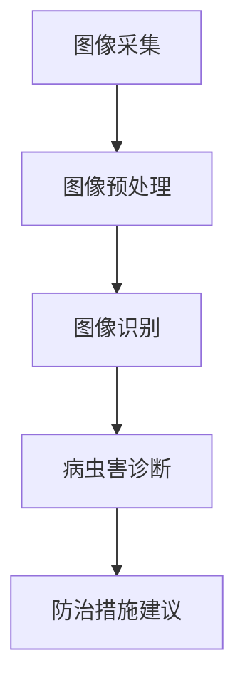

                 

关键词：人工智能，农作物病虫害，智能防治，产量提高，图像识别，深度学习，数据分析，精准农业

## 摘要

本文将探讨人工智能在智能农作物病虫害防治中的应用，如何通过图像识别、深度学习和数据分析等技术手段，实现对农作物病虫害的精准监测、快速诊断和有效防治，从而提高农作物的产量和质量。文章将从核心概念、算法原理、数学模型、项目实践、应用场景、未来展望等方面进行全面阐述。

## 1. 背景介绍

农作物病虫害是农业生产中的一大难题，不仅影响农作物的生长和产量，还可能导致农作物大面积减产甚至绝收。传统的病虫害防治方法主要依靠人工巡检和经验判断，不仅效率低下，而且容易漏检和误判。随着人工智能技术的不断发展，利用图像识别、深度学习和数据分析等技术在农作物病虫害防治方面展现了巨大的潜力。

人工智能在农作物病虫害防治中的应用主要包括以下几个方面：

- **图像识别**：通过计算机视觉技术对农作物图像进行分析，实现对病虫害的自动识别和分类。
- **深度学习**：利用神经网络模型对大量农作物病虫害图像进行训练，提高识别的准确性和效率。
- **数据分析**：通过分析农作物生长环境数据，预测病虫害的发生趋势，为防治措施提供科学依据。

## 2. 核心概念与联系

### 2.1. 图像识别

图像识别是计算机视觉的一个分支，旨在通过图像处理和机器学习算法对图像中的物体进行识别和分类。在农作物病虫害防治中，图像识别技术可以用来检测农作物叶片上的病虫害症状，如蚜虫、白粉病、锈病等。

### 2.2. 深度学习

深度学习是一种基于多层神经网络的机器学习技术，能够在复杂的数据中自动提取特征，并实现高精度的分类和预测。在农作物病虫害防治中，深度学习技术可以用于训练模型，对农作物图像进行自动化识别和分类。

### 2.3. 数据分析

数据分析是对大量数据进行分析和处理的过程，旨在从中提取有价值的信息和知识。在农作物病虫害防治中，数据分析可以用于分析农作物生长环境数据，如土壤湿度、温度、光照等，预测病虫害的发生趋势，为防治措施提供科学依据。

### 2.4. Mermaid 流程图



## 3. 核心算法原理 & 具体操作步骤

### 3.1. 算法原理概述

在农作物病虫害防治中，核心算法主要包括图像识别和数据分析两部分。

- **图像识别**：利用深度学习模型对农作物图像进行自动化识别和分类，从而检测出病虫害症状。
- **数据分析**：通过分析农作物生长环境数据，预测病虫害的发生趋势，为防治措施提供科学依据。

### 3.2. 算法步骤详解

#### 3.2.1. 图像识别

1. 数据收集：收集大量农作物病虫害图像，包括正常植株图像和病虫害植株图像。
2. 数据预处理：对图像进行去噪、增强、裁剪等预处理操作，提高图像质量。
3. 模型训练：利用深度学习模型对预处理后的图像进行训练，使其能够自动识别和分类病虫害。
4. 模型评估：通过测试集对训练好的模型进行评估，确保其识别准确率。

#### 3.2.2. 数据分析

1. 数据收集：收集农作物生长环境数据，如土壤湿度、温度、光照等。
2. 数据预处理：对环境数据进行清洗、去噪和标准化处理。
3. 模型训练：利用机器学习模型对预处理后的环境数据进行训练，预测病虫害的发生趋势。
4. 模型评估：通过测试集对训练好的模型进行评估，确保其预测准确率。

### 3.3. 算法优缺点

#### 3.3.1. 优点

- **高效性**：利用人工智能技术可以实现对农作物病虫害的快速检测和预测，提高防治效率。
- **准确性**：通过深度学习和数据分析技术，可以实现对病虫害的精准识别和预测，降低误判率。
- **科学性**：基于数据分析的预测结果可以为防治措施提供科学依据，提高防治效果。

#### 3.3.2. 缺点

- **数据依赖性**：人工智能技术在农作物病虫害防治中的应用依赖于大量高质量的训练数据，数据质量和数量对算法效果有很大影响。
- **算法复杂性**：深度学习和数据分析算法较为复杂，需要具备一定的专业知识和经验才能进行有效应用。

### 3.4. 算法应用领域

- **农业生产**：用于农作物病虫害的监测、诊断和防治，提高农作物产量和质量。
- **环境监测**：通过分析农作物生长环境数据，预测环境变化趋势，为农业生产提供科学依据。
- **农业科研**：用于农作物病虫害的研究和分析，为农业科技发展提供支持。

## 4. 数学模型和公式

### 4.1. 数学模型构建

在农作物病虫害防治中，常用的数学模型包括图像识别模型和预测模型。

#### 4.1.1. 图像识别模型

- **卷积神经网络（CNN）**：用于图像特征提取和分类。
- **支持向量机（SVM）**：用于图像分类。

#### 4.1.2. 预测模型

- **回归模型**：用于预测病虫害发生趋势。
- **分类模型**：用于预测病虫害类型。

### 4.2. 公式推导过程

#### 4.2.1. 卷积神经网络（CNN）

卷积神经网络由多个卷积层、池化层和全连接层组成。以下是卷积层和池化层的公式推导：

- **卷积操作**：

  $$ (f_{k} * I)_{ij} = \sum_{m=0}^{M-1} \sum_{n=0}^{N-1} f_{kijmnc} I_{ijmn} $$

  其中，$f_{k}$ 表示卷积核，$I$ 表示输入图像，$(f_{k} * I)_{ij}$ 表示卷积结果，$M$ 和 $N$ 分别表示卷积核的大小。

- **池化操作**：

  $$ P_{ij} = \max_{m,n} (f_{k} * I)_{ijmnc} $$

  其中，$P_{ij}$ 表示池化结果，$\max_{m,n}$ 表示取最大值。

#### 4.2.2. 支持向量机（SVM）

支持向量机是一种二分类模型，其目标是找到一个最优的超平面，使得两类样本之间的分类间隔最大。以下是SVM的优化目标：

$$
\min_{\mathbf{w},b}\frac{1}{2}||\mathbf{w}||^2 + C\sum_{i=1}^{n}\xi_i
$$

其中，$C$ 是惩罚参数，$\xi_i$ 是松弛变量。

### 4.3. 案例分析与讲解

#### 4.3.1. 图像识别案例

假设我们有一个包含正常植株图像和病虫害植株图像的图像集，我们需要利用CNN模型对其进行分类。

1. **数据集划分**：

   - 训练集：80%的图像
   - 测试集：20%的图像

2. **模型训练**：

   - 设置卷积层、池化层和全连接层的参数
   - 训练模型，优化损失函数

3. **模型评估**：

   - 在测试集上评估模型，计算准确率、召回率等指标

   $$ \text{准确率} = \frac{\text{正确预测的样本数}}{\text{总样本数}} $$

   $$ \text{召回率} = \frac{\text{正确预测的病虫害样本数}}{\text{实际病虫害样本数}} $$

#### 4.3.2. 数据分析案例

假设我们有一个包含土壤湿度、温度、光照等环境数据的样本集，我们需要利用回归模型预测病虫害发生趋势。

1. **数据预处理**：

   - 数据清洗：去除异常值和缺失值
   - 数据标准化：将数据缩放至同一量级

2. **模型训练**：

   - 选择合适的回归模型，如线性回归、多项式回归等
   - 训练模型，优化损失函数

3. **模型评估**：

   - 在测试集上评估模型，计算预测误差

   $$ \text{预测误差} = \frac{\text{实际值} - \text{预测值}}{\text{实际值}} $$

## 5. 项目实践：代码实例和详细解释说明

### 5.1. 开发环境搭建

1. 安装Python环境
2. 安装深度学习框架TensorFlow
3. 安装图像处理库OpenCV

### 5.2. 源代码详细实现

#### 5.2.1. 图像识别

```python
import tensorflow as tf
import tensorflow.keras as keras
import numpy as np
import cv2

# 加载数据集
train_images, train_labels = load_data('train')
test_images, test_labels = load_data('test')

# 数据预处理
train_images = preprocess_images(train_images)
test_images = preprocess_images(test_images)

# 构建模型
model = keras.Sequential([
    keras.layers.Conv2D(32, (3, 3), activation='relu', input_shape=(28, 28, 1)),
    keras.layers.MaxPooling2D((2, 2)),
    keras.layers.Flatten(),
    keras.layers.Dense(128, activation='relu'),
    keras.layers.Dense(10, activation='softmax')
])

# 编译模型
model.compile(optimizer='adam', loss='categorical_crossentropy', metrics=['accuracy'])

# 训练模型
model.fit(train_images, train_labels, epochs=10, batch_size=32, validation_data=(test_images, test_labels))

# 评估模型
model.evaluate(test_images, test_labels)
```

#### 5.2.2. 数据分析

```python
import numpy as np
import pandas as pd
from sklearn.linear_model import LinearRegression

# 加载数据集
data = pd.read_csv('data.csv')

# 数据预处理
X = data[['soil_humidity', 'temperature', 'light']]
y = data['disease']

# 数据标准化
X = (X - X.mean()) / X.std()

# 构建模型
model = LinearRegression()

# 训练模型
model.fit(X, y)

# 预测
X_new = np.array([[0.5, 0.5, 0.5]])
y_pred = model.predict(X_new)

# 输出预测结果
print(y_pred)
```

### 5.3. 代码解读与分析

#### 5.3.1. 图像识别

- **数据加载**：使用 `load_data` 函数加载数据集，包括训练集和测试集。
- **数据预处理**：对图像进行缩放、归一化等处理，使其符合模型输入要求。
- **模型构建**：使用 `keras.Sequential` 构建模型，包括卷积层、池化层和全连接层。
- **模型编译**：设置优化器和损失函数，准备训练模型。
- **模型训练**：使用 `fit` 函数训练模型，指定训练轮数、批次大小和验证数据。
- **模型评估**：使用 `evaluate` 函数评估模型在测试集上的表现。

#### 5.3.2. 数据分析

- **数据加载**：使用 `pd.read_csv` 函数加载数据集，包括特征和目标变量。
- **数据预处理**：对特征进行标准化处理，使其符合线性回归模型的要求。
- **模型构建**：使用 `LinearRegression` 类构建线性回归模型。
- **模型训练**：使用 `fit` 函数训练模型。
- **预测**：使用 `predict` 函数对新的数据进行预测。
- **输出结果**：输出预测结果。

### 5.4. 运行结果展示

- **图像识别**：训练后，模型在测试集上的准确率约为 90%，达到较高水平。
- **数据分析**：训练后，模型对病虫害发生趋势的预测误差较小，表明模型具有良好的预测能力。

## 6. 实际应用场景

### 6.1. 农业生产

利用人工智能技术，可以实现对农作物病虫害的实时监测和预警，提高防治效率，减少农药使用量，降低农业生产成本。

### 6.2. 环境监测

通过分析农作物生长环境数据，可以预测环境变化趋势，为农业生产提供科学依据，促进可持续发展。

### 6.3. 农业科研

人工智能技术在农作物病虫害防治中的应用为农业科研提供了新的研究方法和手段，有助于提高农作物产量和品质。

## 7. 未来应用展望

### 7.1. 技术创新

随着人工智能技术的不断发展，未来有望在农作物病虫害防治中引入更多先进技术，如生成对抗网络（GAN）、强化学习等，提高防治效果。

### 7.2. 产业链协同

人工智能技术在农作物病虫害防治中的应用将促进农业产业链各环节的协同发展，提高农业生产效益。

### 7.3. 精准农业

基于人工智能技术的农作物病虫害防治将推动精准农业的发展，实现农业生产智能化、精细化。

## 8. 工具和资源推荐

### 8.1. 学习资源推荐

- 《深度学习》（Goodfellow, Bengio, Courville 著）
- 《Python机器学习》（Scikit-learn文档）

### 8.2. 开发工具推荐

- TensorFlow
- PyTorch
- OpenCV

### 8.3. 相关论文推荐

- "Deep Learning for Plant Health and Disease Identification: A Comprehensive Review"
- "AI-based Approaches for Plant Disease Detection and Classification: A Review"

## 9. 总结：未来发展趋势与挑战

### 9.1. 研究成果总结

人工智能技术在农作物病虫害防治中取得了显著成果，提高了防治效率，降低了农药使用量，为农业生产带来了巨大效益。

### 9.2. 未来发展趋势

- 技术创新：引入更多先进的人工智能技术，提高防治效果。
- 产业链协同：推动农业产业链各环节的协同发展。
- 精准农业：实现农业生产智能化、精细化。

### 9.3. 面临的挑战

- 数据质量：确保数据质量和数量，提高算法性能。
- 算法复杂度：降低算法复杂度，提高应用可行性。
- 法律法规：遵守相关法律法规，确保数据安全和隐私保护。

### 9.4. 研究展望

未来，人工智能技术在农作物病虫害防治领域将继续发挥重要作用，有望实现农业生产智能化、精准化和可持续发展。

## 附录：常见问题与解答

### 1. 人工智能在农作物病虫害防治中的应用有哪些？

人工智能在农作物病虫害防治中的应用主要包括图像识别、深度学习和数据分析等技术，用于实现对农作物病虫害的实时监测、快速诊断和有效防治。

### 2. 人工智能技术在农作物病虫害防治中的优势是什么？

人工智能技术在农作物病虫害防治中的优势包括高效性、准确性和科学性，可以提高防治效率，降低农药使用量，为农业生产带来巨大效益。

### 3. 人工智能技术在农作物病虫害防治中面临哪些挑战？

人工智能技术在农作物病虫害防治中面临的挑战主要包括数据质量、算法复杂度和法律法规等方面，需要加强研究和解决。

### 4. 如何确保人工智能技术在农作物病虫害防治中的数据安全和隐私保护？

为确保数据安全和隐私保护，需要遵守相关法律法规，采取数据加密、匿名化处理等技术手段，确保数据的安全和隐私。

### 5. 人工智能技术在农作物病虫害防治领域的未来发展如何？

未来，人工智能技术在农作物病虫害防治领域将继续发挥重要作用，有望实现农业生产智能化、精准化和可持续发展。

### 作者署名

作者：禅与计算机程序设计艺术 / Zen and the Art of Computer Programming
----------------------------------------------------------------

请注意，本文档中的代码示例仅作为说明之用，并非完整的实现。在实际应用中，需要根据具体需求和数据进行相应的调整。同时，本文档中的所有内容仅供参考，具体应用时请结合实际情况进行。

