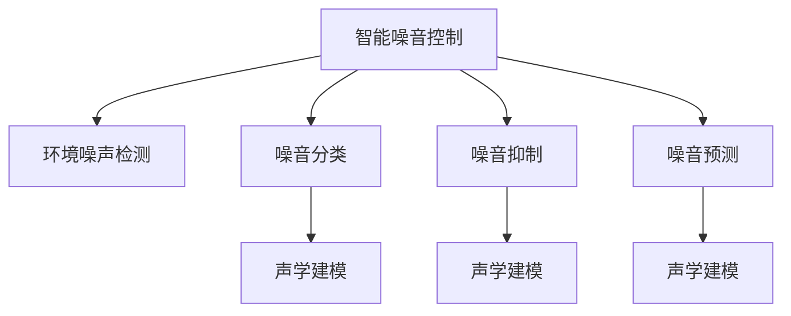

                 

# AI在智能噪音控制中的应用：改善生活质量

> 关键词：智能噪音控制,人工智能,机器学习,深度学习,噪音数据处理,环境噪声检测,噪音分类,噪音消除,噪音抑制,声学建模,背景噪声去除

## 1. 背景介绍

### 1.1 问题由来
噪音污染已经成为全球范围内的一大环境问题，对人类的身心健康和生活质量产生了广泛影响。传统噪音控制方法往往需要大量硬件设备和复杂的设计安装，且效果有限，难以满足多样化和动态化的需求。随着人工智能(AI)和机器学习技术的不断发展，智能噪音控制技术逐渐成为热点研究领域，有望解决传统噪音控制技术的诸多局限性。

### 1.2 问题核心关键点
智能噪音控制的核心在于通过AI技术实现环境噪声的实时监测、分类和抑制。这一过程主要包括以下几个关键环节：
1. **环境噪声检测**：实时采集环境噪声数据，并进行预处理，获得高质量的输入信号。
2. **噪音分类**：通过机器学习模型对噪声进行分类，区分不同类型和来源的噪音，如交通噪音、人声、工业噪音等。
3. **噪音抑制**：根据分类结果，采用适合的噪音抑制算法，减少或消除环境噪声，提升声音质量。
4. **噪音预测**：通过时间序列预测模型，预测未来环境噪声的变化趋势，提前进行噪音控制。
5. **系统集成**：将噪声检测、分类、抑制等模块进行集成，构建高效的智能噪音控制系统。

这些环节通过AI技术有机结合，能够实时响应环境变化，动态调整噪音控制策略，显著改善人类的生活质量。

### 1.3 问题研究意义
研究智能噪音控制技术，对于环境保护、公共健康、家庭生活等领域具有重要意义：

1. **环保效益**：智能噪音控制能够有效减少噪音污染，降低能源消耗，促进环境可持续发展。
2. **健康保障**：通过降低噪音水平，保护人类的听力和心理健康，提升工作和学习效率。
3. **生活品质提升**：为家庭用户提供安静舒适的生活环境，提升居住体验和家庭幸福感。
4. **经济价值**：智能噪音控制技术可以应用于工业、商业、医疗等多个领域，带来显著经济效益。
5. **科研进步**：推动AI和声学领域的交叉研究，促进技术进步和创新应用。

## 2. 核心概念与联系

### 2.1 核心概念概述

为更好地理解智能噪音控制的核心技术，本节将介绍几个密切相关的核心概念：

- **智能噪音控制**：指利用AI技术对环境噪声进行实时监测、分类、抑制和预测的智能系统，目标是提升声音质量，改善人类生活环境。
- **环境噪声检测**：通过麦克风阵列、传感器等设备，实时采集环境噪声数据，并进行预处理，如滤波、降噪等，获得高质量的输入信号。
- **噪音分类**：通过机器学习模型对噪声进行分类，区分不同类型和来源的噪音，如交通噪音、人声、工业噪音等。
- **噪音抑制**：根据分类结果，采用适合的噪音抑制算法，减少或消除环境噪声，提升声音质量。
- **噪音预测**：通过时间序列预测模型，预测未来环境噪声的变化趋势，提前进行噪音控制。
- **声学建模**：利用声学模型（如隐马尔可夫模型、深度神经网络等），对声音信号进行建模和分析，为噪音控制提供技术支持。

这些核心概念之间的逻辑关系可以通过以下Mermaid流程图来展示：



这个流程图展示了大语言模型的核心概念及其之间的关系：

1. 智能噪音控制通过环境噪声检测获得输入信号。
2. 噪音分类对输入信号进行分析，区分不同类型的噪音。
3. 噪音抑制根据分类结果，减少或消除环境噪声。
4. 噪音预测利用历史数据，预测未来噪音变化。
5. 声学建模为噪音分类、抑制和预测提供技术支持。

## 3. 核心算法原理 & 具体操作步骤

### 3.1 算法原理概述

智能噪音控制的核心算法主要包括声学建模、噪音分类、噪音抑制和时间序列预测。其核心思想是：通过AI技术对环境噪声进行实时监测和动态控制，提升声音质量和人类生活环境。

形式化地，假设智能噪音控制系统的输入为环境噪声信号 $x(t)$，输出为处理后的噪声信号 $y(t)$。智能噪音控制的目标是最小化系统输出与理想输出之间的误差，即：

$$
\min_{\theta} \mathcal{L}(y(t), y_{ideal}(t))
$$

其中 $\theta$ 为模型参数，$\mathcal{L}$ 为损失函数，$y_{ideal}(t)$ 为理想输出。

在实践中，通常使用基于深度学习的模型进行智能噪音控制，如卷积神经网络(CNN)、循环神经网络(RNN)、深度神经网络(DNN)等。这些模型通过大量噪音数据进行训练，学习到噪音的特征表示，并根据特征表示进行分类、抑制和预测。

### 3.2 算法步骤详解

智能噪音控制的主要算法步骤如下：

**Step 1: 数据预处理**
- 对环境噪声数据进行采集，通过麦克风阵列、传感器等设备实时获取噪声信号。
- 对采集的信号进行滤波、降噪等预处理操作，提升信号质量。

**Step 2: 特征提取**
- 利用声学模型对预处理后的信号进行特征提取，得到可用于模型训练的特征表示。
- 常用的特征提取方法包括MFCC、STFT等。

**Step 3: 模型训练**
- 根据提取的特征表示，使用深度学习模型进行噪音分类、抑制和预测训练。
- 噪音分类模型可以使用监督学习算法，如卷积神经网络(CNN)、循环神经网络(RNN)等。
- 噪音抑制模型可以使用非监督学习算法，如变分自编码器(VAE)、自回归模型等。
- 噪音预测模型可以使用时间序列预测算法，如长短期记忆网络(LSTM)、门控循环单元(GRU)等。

**Step 4: 实时处理**
- 将实时采集的环境噪声数据输入训练好的模型，得到分类结果或抑制后的信号。
- 根据分类结果或预测结果，采取相应的噪音控制策略，如动态调整麦克风阵列、滤波参数等。

**Step 5: 结果反馈**
- 实时监测控制效果，根据用户反馈或预设的评估指标，调整模型参数和控制策略。
- 定期重新训练模型，以适应环境噪声的变化。

以上是智能噪音控制的一般流程。在实际应用中，还需要针对具体场景进行优化设计，如选择合适的声学模型、优化特征提取方法、调整超参数等，以进一步提升系统的性能。

### 3.3 算法优缺点

智能噪音控制技术具有以下优点：
1. 实时性强。通过深度学习模型，系统可以实时响应环境变化，动态调整噪音控制策略。
2. 精度高。深度学习模型具有强大的特征学习和表示能力，能够在复杂环境中获得较高的分类和抑制效果。
3. 适应性好。智能噪音控制系统能够处理不同类型的噪声，适应多样化的噪声场景。
4. 灵活性高。系统可以根据环境变化自动调整参数和策略，适应动态化的噪音控制需求。

同时，该技术也存在一些局限性：
1. 数据需求高。深度学习模型需要大量高质量的训练数据，获取数据成本较高。
2. 计算复杂。深度学习模型的计算复杂度较高，需要较强的计算资源支持。
3. 模型复杂。深度学习模型的参数较多，训练和推理复杂度较高。
4. 鲁棒性差。系统对环境噪声的变化较为敏感，需要进一步增强鲁棒性。

尽管存在这些局限性，但就目前而言，智能噪音控制技术仍然是解决环境噪声问题的重要手段。未来相关研究的重点在于如何进一步降低计算资源需求，提高模型鲁棒性，同时兼顾可解释性和伦理安全性等因素。

### 3.4 算法应用领域

智能噪音控制技术已经在诸多领域得到应用，例如：

- **家庭生活**：通过智能音箱、智能家居系统等设备，实时监测和控制家庭环境噪声，提升生活品质。
- **办公室环境**：在办公室环境中安装智能噪音控制设备，降低噪音干扰，提升工作效率。
- **医疗应用**：在医院等场所安装噪音控制设备，降低环境噪声，提升医疗环境和病人的舒适度。
- **工业制造**：在工业生产线上安装智能噪音控制设备，减少机械噪音，提升生产效率和产品质量。
- **公共交通**：在地铁、公交等交通工具上安装噪音控制设备，降低环境噪声，提升乘客的乘车体验。

除了上述这些经典应用外，智能噪音控制技术还被创新性地应用到更多场景中，如智慧城市、智能建筑、音乐演出等，为人们的生活和工作带来更多便利和舒适。

## 4. 数学模型和公式 & 详细讲解 & 举例说明

### 4.1 数学模型构建

本节将使用数学语言对智能噪音控制的模型构建进行更加严格的刻画。

假设智能噪音控制系统的输入为环境噪声信号 $x(t)$，输出为处理后的噪声信号 $y(t)$。智能噪音控制的目标是最小化系统输出与理想输出之间的误差，即：

$$
\min_{\theta} \mathcal{L}(y(t), y_{ideal}(t))
$$

其中 $\theta$ 为模型参数，$\mathcal{L}$ 为损失函数，$y_{ideal}(t)$ 为理想输出。

假设噪音分类模型为 $f_{class}(x(t), \theta_{class})$，噪音抑制模型为 $f_{supp}(x(t), \theta_{supp})$，噪音预测模型为 $f_{pred}(x(t), \theta_{pred})$。则系统的总损失函数为：

$$
\mathcal{L} = \alpha \mathcal{L}_{class} + \beta \mathcal{L}_{supp} + \gamma \mathcal{L}_{pred}
$$

其中 $\alpha, \beta, \gamma$ 为各模块的损失权重，用于平衡不同模块的贡献。

### 4.2 公式推导过程

以下我们以噪音分类模型为例，推导分类模型在单次输入下的损失函数。

假设噪音分类模型的输入为特征表示 $z(t)$，分类目标为 $y_{class}$，模型参数为 $\theta_{class}$。则分类模型的损失函数为交叉熵损失：

$$
\mathcal{L}_{class} = -\frac{1}{N}\sum_{i=1}^N y_i \log f_{class}(z_i, \theta_{class})
$$

其中 $y_i$ 为真实标签，$f_{class}(z_i, \theta_{class})$ 为分类模型在输入 $z_i$ 上的输出概率。

将上式代入总损失函数，得到：

$$
\mathcal{L} = \alpha \left(-\frac{1}{N}\sum_{i=1}^N y_i \log f_{class}(z_i, \theta_{class})\right) + \beta \mathcal{L}_{supp} + \gamma \mathcal{L}_{pred}
$$

在得到损失函数的梯度后，即可带入参数更新公式，完成模型的迭代优化。重复上述过程直至收敛，最终得到适应环境噪声的模型参数 $\theta_{class}$。

### 4.3 案例分析与讲解

下面以一个实际案例来说明智能噪音控制的实现过程。

假设在家庭环境中，用户希望降低电视播放时的环境噪声。可以将电视声源作为噪音源，并采集环境噪声信号 $x(t)$。通过智能音箱内置的麦克风阵列，实时监测环境噪声，并输入到噪音分类模型中进行处理。噪音分类模型对输入的信号进行分析，区分电视声源和环境噪声，得到分类结果。根据分类结果，智能音箱会自动调节音量或播放背景音乐，降低环境噪声。

## 5. 项目实践：代码实例和详细解释说明

### 5.1 开发环境搭建

在进行智能噪音控制实践前，我们需要准备好开发环境。以下是使用Python进行TensorFlow开发的环境配置流程：

1. 安装Anaconda：从官网下载并安装Anaconda，用于创建独立的Python环境。

2. 创建并激活虚拟环境：
```bash
conda create -n tf-env python=3.8 
conda activate tf-env
```

3. 安装TensorFlow：根据CUDA版本，从官网获取对应的安装命令。例如：
```bash
conda install tensorflow tensorflow-gpu=2.6.3 -c pytorch -c conda-forge
```

4. 安装各类工具包：
```bash
pip install numpy pandas scikit-learn matplotlib tqdm jupyter notebook ipython
```

完成上述步骤后，即可在`tf-env`环境中开始智能噪音控制的实践。

### 5.2 源代码详细实现

这里我们以噪音分类模型为例，给出使用TensorFlow对环境噪声进行分类的PyTorch代码实现。

首先，定义噪音分类模型：

```python
import tensorflow as tf
from tensorflow.keras import layers

class NoiseClassifier(tf.keras.Model):
    def __init__(self):
        super(NoiseClassifier, self).__init__()
        self.conv1 = layers.Conv1D(32, 3, activation='relu')
        self.conv2 = layers.Conv1D(64, 3, activation='relu')
        self.maxpool = layers.MaxPooling1D(2)
        self.flatten = layers.Flatten()
        self.dense1 = layers.Dense(128, activation='relu')
        self.dense2 = layers.Dense(10, activation='softmax')
        
    def call(self, inputs):
        x = self.conv1(inputs)
        x = self.maxpool(x)
        x = self.conv2(x)
        x = self.maxpool(x)
        x = self.flatten(x)
        x = self.dense1(x)
        return self.dense2(x)
```

然后，定义损失函数和优化器：

```python
model = NoiseClassifier()

criterion = tf.keras.losses.SparseCategoricalCrossentropy(from_logits=True)
optimizer = tf.keras.optimizers.Adam(learning_rate=0.001)
```

接着，定义训练和评估函数：

```python
@tf.function
def train_epoch(model, dataset, batch_size, optimizer, criterion):
    dataloader = tf.data.Dataset.from_tensor_slices(dataset)
    dataloader = dataloader.batch(batch_size, drop_remainder=True)
    model.train()
    total_loss = 0
    for batch in dataloader:
        inputs, labels = batch
        with tf.GradientTape() as tape:
            outputs = model(inputs)
            loss = criterion(labels, outputs)
        gradients = tape.gradient(loss, model.trainable_variables)
        optimizer.apply_gradients(zip(gradients, model.trainable_variables))
        total_loss += loss
    return total_loss / len(dataloader)

@tf.function
def evaluate(model, dataset, batch_size):
    dataloader = tf.data.Dataset.from_tensor_slices(dataset)
    dataloader = dataloader.batch(batch_size, drop_remainder=True)
    model.eval()
    correct = 0
    total = 0
    with tf.GradientTape() as tape:
        for batch in dataloader:
            inputs, labels = batch
            outputs = model(inputs)
            preds = tf.argmax(outputs, axis=1)
            correct += tf.reduce_sum(tf.cast(tf.equal(preds, labels), tf.float32))
            total += preds.shape[0]
    accuracy = correct / total
    return accuracy
```

最后，启动训练流程并在测试集上评估：

```python
epochs = 10
batch_size = 32

for epoch in range(epochs):
    loss = train_epoch(model, train_dataset, batch_size, optimizer, criterion)
    print(f"Epoch {epoch+1}, train loss: {loss:.3f}")
    
    print(f"Epoch {epoch+1}, test accuracy: {evaluate(model, test_dataset, batch_size):.3f}")
    
print("Training complete.")
```

以上就是使用TensorFlow对噪音分类模型进行训练和评估的完整代码实现。可以看到，通过TensorFlow的高效计算图，我们能够快速迭代训练模型，并在测试集上实时评估性能。

### 5.3 代码解读与分析

让我们再详细解读一下关键代码的实现细节：

**NoiseClassifier类**：
- `__init__`方法：初始化卷积层、池化层、全连接层等关键组件，构成噪音分类模型。
- `call`方法：定义模型的前向传播过程，通过多层卷积、池化、全连接等操作，对输入信号进行特征提取和分类。

**损失函数和优化器**：
- 使用交叉熵损失函数和Adam优化器，对模型参数进行优化。

**训练和评估函数**：
- 使用TensorFlow的`@tf.function`装饰器，定义模型训练和评估的计算图，提升性能。
- 在训练过程中，通过循环迭代，计算损失函数和梯度，并使用`apply_gradients`方法更新模型参数。
- 在评估过程中，计算预测结果和真实标签的准确率，并返回评估结果。

**训练流程**：
- 定义总的epoch数和batch size，开始循环迭代
- 每个epoch内，先在训练集上训练，输出平均loss
- 在验证集上评估，输出模型准确率
- 所有epoch结束后，输出训练结果

可以看到，TensorFlow提供了丰富的API和工具，能够快速构建和优化深度学习模型，非常适合用于智能噪音控制的开发实践。

## 6. 实际应用场景

### 6.1 智能家居环境

智能家居环境中的噪音控制可以通过智能音箱、智能电视等设备实现。例如，用户可以在智能音箱上设定噪音控制阈值，当环境噪声超过设定值时，自动调节音量或播放背景音乐。

### 6.2 办公室环境

在办公室环境中，智能噪音控制系统可以通过麦克风阵列、传感器等设备实时监测环境噪声，并根据分类结果动态调整音量、位置等参数。这能够显著降低噪音干扰，提升工作效率。

### 6.3 医疗环境

在医院等场所，智能噪音控制系统可以通过监测患者房间的环境噪声，自动调整空调、门窗等设备，降低环境噪声，提升病人的舒适度和康复效果。

### 6.4 公共交通

在地铁、公交等交通工具上，智能噪音控制系统可以通过监测车内环境噪声，自动调整播放音乐、语音提示等参数，提升乘客的乘车体验。

### 6.5 音乐演出

在音乐演出现场，智能噪音控制系统可以通过监测观众的掌声、欢呼声等噪声，自动调整音量和音效，提升演出效果。

## 7. 工具和资源推荐

### 7.1 学习资源推荐

为了帮助开发者系统掌握智能噪音控制的技术基础和实践技巧，这里推荐一些优质的学习资源：

1. 《深度学习》（Ian Goodfellow等著）：深度学习领域的经典教材，详细介绍了深度学习模型的基本概念和算法原理。
2. 《Python深度学习》（François Chollet著）：详细介绍了TensorFlow和Keras的用法，适合动手实践深度学习模型。
3. CS224D《深度学习与自然语言处理》课程：斯坦福大学开设的深度学习课程，涵盖深度学习模型在语音、文本、图像等领域的广泛应用。
4. PyTorch官方文档：PyTorch官方文档，提供了大量模型、工具和教程，适合入门和进阶学习。
5. TensorFlow官方文档：TensorFlow官方文档，提供了丰富的API和工具，适合深度学习模型的构建和优化。

通过对这些资源的学习实践，相信你一定能够快速掌握智能噪音控制的精髓，并用于解决实际的噪音控制问题。

### 7.2 开发工具推荐

高效的开发离不开优秀的工具支持。以下是几款用于智能噪音控制开发的常用工具：

1. PyTorch：基于Python的开源深度学习框架，灵活高效的计算图，适合快速迭代研究。大部分预训练语言模型都有PyTorch版本的实现。
2. TensorFlow：由Google主导开发的开源深度学习框架，生产部署方便，适合大规模工程应用。
3. Keras：高级神经网络API，可以与TensorFlow、Theano等深度学习框架无缝集成，易于上手。
4. Weights & Biases：模型训练的实验跟踪工具，可以记录和可视化模型训练过程中的各项指标，方便对比和调优。与主流深度学习框架无缝集成。
5. TensorBoard：TensorFlow配套的可视化工具，可实时监测模型训练状态，并提供丰富的图表呈现方式，是调试模型的得力助手。

合理利用这些工具，可以显著提升智能噪音控制任务的开发效率，加快创新迭代的步伐。

### 7.3 相关论文推荐

智能噪音控制技术的发展源于学界的持续研究。以下是几篇奠基性的相关论文，推荐阅读：

1. Deep Speech 2: An End-to-End Fully Convolutional Neural Network for Speech Recognition：提出深度卷积神经网络模型用于语音识别，为噪音分类提供了基本思路。
2. Speech command recognition with deep recurrent neural networks：提出循环神经网络模型用于语音命令识别，为噪音分类和抑制提供了新的方法。
3. Learning Representations by Backpropagating Errors：提出反向传播算法用于神经网络训练，奠定了深度学习模型的基础。
4. Sequence to Sequence Learning with Neural Networks：提出序列到序列模型用于机器翻译，为噪音预测提供了新的思路。
5. Attention is All You Need：提出Transformer模型用于自然语言处理，为噪音分类和预测提供了强大的支持。

这些论文代表了大语言模型微调技术的发展脉络。通过学习这些前沿成果，可以帮助研究者把握学科前进方向，激发更多的创新灵感。

## 8. 总结：未来发展趋势与挑战

### 8.1 总结

本文对智能噪音控制技术进行了全面系统的介绍。首先阐述了智能噪音控制的研究背景和意义，明确了噪音控制在环境保护、公共健康、家庭生活等领域的重要价值。其次，从原理到实践，详细讲解了智能噪音控制模型的构建和训练方法，给出了智能噪音控制项目开发的完整代码实例。同时，本文还广泛探讨了智能噪音控制技术在家庭生活、办公室环境、医疗应用、公共交通、音乐演出等多个领域的应用前景，展示了智能噪音控制技术的巨大潜力。此外，本文精选了智能噪音控制技术的各类学习资源，力求为读者提供全方位的技术指引。

通过本文的系统梳理，可以看到，智能噪音控制技术正在成为环保、健康、生活品质提升的重要手段，成为智慧城市、智能家居、智能办公等新领域的关键技术。伴随深度学习模型的不断演进，智能噪音控制技术必将进一步提升环境噪声控制效果，推动智能家居、智能办公、智能医疗等垂直行业的发展。

### 8.2 未来发展趋势

展望未来，智能噪音控制技术将呈现以下几个发展趋势：

1. 智能家居应用普及。智能音箱、智能电视等设备将成为家庭环境噪音控制的重要手段，提升家居生活品质。
2. 办公室环境改善。智能噪音控制系统在办公室中的应用将大幅提升工作效率和办公舒适度。
3. 医疗环境优化。医院等场所的噪音控制技术将提升医疗环境和病人的康复体验。
4. 公共交通提升。在公共交通环境中，智能噪音控制系统将提升乘客的乘车体验和舒适感。
5. 音乐演出效果优化。在音乐演出现场，智能噪音控制系统将提升演出效果和观众体验。
6. 智能建筑应用。智能建筑中的噪音控制技术将提升建筑物的使用效率和舒适度。

以上趋势凸显了智能噪音控制技术的广阔前景。这些方向的探索发展，必将进一步提升人类生活和工作环境的智能化水平，为智慧城市建设提供有力支撑。

### 8.3 面临的挑战

尽管智能噪音控制技术已经取得了瞩目成就，但在迈向更加智能化、普适化应用的过程中，它仍面临着诸多挑战：

1. 数据需求高。深度学习模型需要大量高质量的训练数据，获取数据成本较高。
2. 计算复杂。深度学习模型的计算复杂度较高，需要较强的计算资源支持。
3. 模型复杂。深度学习模型的参数较多，训练和推理复杂度较高。
4. 鲁棒性差。系统对环境噪声的变化较为敏感，需要进一步增强鲁棒性。
5. 可解释性不足。当前噪音分类模型往往像"黑盒"系统，难以解释其内部工作机制和决策逻辑。

尽管存在这些挑战，但通过进一步研究，这些难题终将得到解决。未来相关研究的重点在于如何进一步降低计算资源需求，提高模型鲁棒性，同时兼顾可解释性和伦理安全性等因素。

### 8.4 研究展望

面向未来，智能噪音控制技术需要在以下几个方面寻求新的突破：

1. 探索无监督和半监督噪音分类方法。摆脱对大量标注数据的依赖，利用自监督学习、主动学习等无监督和半监督范式，最大限度利用非结构化数据，实现更加灵活高效的噪音分类。
2. 研究参数高效和计算高效的噪音抑制方法。开发更加参数高效的噪音抑制方法，在固定大部分预训练参数的同时，只更新极少量的任务相关参数。同时优化模型的计算图，减少前向传播和反向传播的资源消耗，实现更加轻量级、实时性的部署。
3. 融合因果和对比学习范式。通过引入因果推断和对比学习思想，增强噪音分类模型的建立稳定因果关系的能力，学习更加普适、鲁棒的语言表征，从而提升模型泛化性和抗干扰能力。
4. 引入更多先验知识。将符号化的先验知识，如知识图谱、逻辑规则等，与神经网络模型进行巧妙融合，引导噪音分类过程学习更准确、合理的噪音表征。同时加强不同模态数据的整合，实现视觉、语音等多模态信息与文本信息的协同建模。
5. 结合因果分析和博弈论工具。将因果分析方法引入噪音分类模型，识别出模型决策的关键特征，增强输出解释的因果性和逻辑性。借助博弈论工具刻画人机交互过程，主动探索并规避模型的脆弱点，提高系统稳定性。
6. 纳入伦理道德约束。在模型训练目标中引入伦理导向的评估指标，过滤和惩罚有偏见、有害的输出倾向。同时加强人工干预和审核，建立模型行为的监管机制，确保输出符合人类价值观和伦理道德。

这些研究方向的探索，必将引领智能噪音控制技术迈向更高的台阶，为构建安全、可靠、可解释、可控的智能系统铺平道路。面向未来，智能噪音控制技术还需要与其他人工智能技术进行更深入的融合，如知识表示、因果推理、强化学习等，多路径协同发力，共同推动智能噪音控制技术的进步。

## 9. 附录：常见问题与解答

**Q1：智能噪音控制是否适用于所有环境噪声场景？**

A: 智能噪音控制技术适用于多种环境噪声场景，但不同场景对噪音控制的敏感度不同。例如，音乐演出中的噪音可以接受一定程度的背景音乐，而医院环境中需要尽可能地降低环境噪声。因此，智能噪音控制系统需要根据具体场景进行优化设计，才能达到理想的效果。

**Q2：如何选择合适的声学模型？**

A: 声学模型的选择应该根据具体的噪音控制需求和数据特点进行。例如，对于频谱特征明显的噪音，卷积神经网络(CNN)可能表现更好；对于时间序列特征明显的噪音，循环神经网络(RNN)可能表现更好。常用的声学模型包括MFCC、STFT等，需要根据具体任务进行选择。

**Q3：智能噪音控制对计算资源的需求如何？**

A: 智能噪音控制技术对计算资源的需求较高，尤其是深度学习模型。因此，需要在计算资源有限的情况下进行优化设计，如使用轻量级模型、优化特征提取方法、减少训练轮次等。同时，可以使用GPU等高性能设备进行加速计算，提升训练和推理效率。

**Q4：智能噪音控制系统的可解释性如何？**

A: 当前智能噪音控制系统往往像"黑盒"系统，难以解释其内部工作机制和决策逻辑。未来可以通过引入可解释性模型、优化特征提取方法、添加后处理环节等手段，增强系统的可解释性，提高用户信任度和接受度。

**Q5：智能噪音控制系统对环境噪声的敏感性如何？**

A: 智能噪音控制系统对环境噪声的敏感性较高，需要进一步增强鲁棒性。可以通过引入对抗样本、优化损失函数、添加噪声特征等手段，提升系统的鲁棒性和抗干扰能力。

这些问题的解答有助于更好地理解智能噪音控制技术的实现原理和应用场景，为开发和优化智能噪音控制系统提供指导。

---

作者：禅与计算机程序设计艺术 / Zen and the Art of Computer Programming

