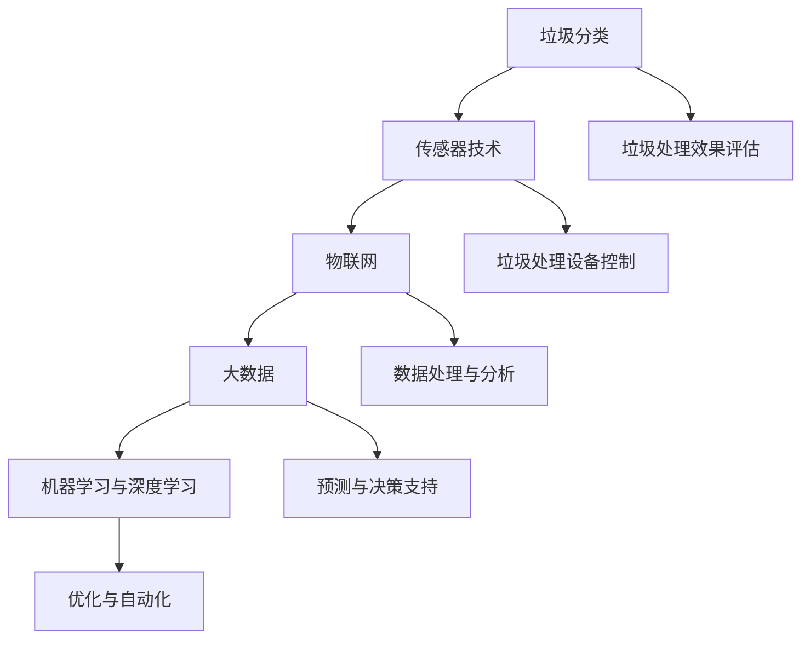

                 

关键词：AI、智能垃圾处理、效率提升、垃圾分类、数据分析、机器学习、深度学习

> 摘要：本文旨在探讨人工智能（AI）技术在智能垃圾处理中的应用，以及如何通过AI技术提高垃圾处理的效率。文章首先介绍了智能垃圾处理的概念和背景，然后详细阐述了AI在垃圾分类、数据处理和预测等方面的应用，最后提出了未来智能垃圾处理的发展方向。

## 1. 背景介绍

随着全球人口的快速增长和城市化进程的加快，垃圾处理问题日益突出。传统的垃圾处理方式主要依赖于填埋、焚烧和堆肥等方法，但这些方法存在资源浪费、环境污染等问题。为了解决这些问题，各国政府和社会各界都在寻求更加环保、高效的垃圾处理方法。智能垃圾处理正是在这种背景下应运而生的。

智能垃圾处理是一种基于人工智能技术的垃圾处理方式，它通过利用传感器、物联网、大数据和机器学习等技术，实现垃圾的精准分类、高效处理和资源回收。与传统方法相比，智能垃圾处理具有更高的处理效率和更低的污染风险，是未来垃圾处理的发展方向。

## 2. 核心概念与联系

### 2.1 智能垃圾处理的核心概念

智能垃圾处理涉及多个核心概念，包括：

- **垃圾分类**：将垃圾分为可回收物、有害垃圾、湿垃圾和干垃圾等不同类别，以便于后续处理和回收。
- **传感器技术**：通过传感器检测垃圾的种类、重量、水分等属性，为垃圾分类和资源回收提供数据支持。
- **物联网**：通过物联网技术实现垃圾处理设备之间的互联互通，提高垃圾处理效率。
- **大数据**：收集和分析大量的垃圾处理数据，用于优化垃圾处理流程和提升处理效果。
- **机器学习与深度学习**：利用机器学习和深度学习技术，对垃圾进行精准分类和智能预测，实现垃圾处理的高效自动化。

### 2.2 核心概念的联系

智能垃圾处理的核心概念之间紧密相连，形成一个完整的生态系统。以下是一个简单的 Mermaid 流程图，展示了这些核心概念之间的联系：



## 3. 核心算法原理 & 具体操作步骤

### 3.1 算法原理概述

智能垃圾处理的核心算法主要涉及以下方面：

- **图像识别**：利用深度学习技术，对垃圾图像进行识别和分类。
- **机器学习**：通过训练大量垃圾数据集，建立垃圾分类模型。
- **数据挖掘**：从大量垃圾处理数据中挖掘出有用的信息，用于优化处理流程。
- **预测模型**：利用历史数据，预测未来垃圾处理的趋势和需求。

### 3.2 算法步骤详解

#### 3.2.1 垃圾分类

垃圾分类是智能垃圾处理的第一步。具体步骤如下：

1. **收集垃圾图像**：通过传感器和摄像头收集垃圾的图像数据。
2. **预处理图像**：对图像进行缩放、旋转等预处理操作，提高图像识别的准确性。
3. **图像识别**：利用卷积神经网络（CNN）对预处理后的图像进行分类。
4. **标签化**：将识别出的垃圾图像进行标签化处理，以便后续处理。

#### 3.2.2 机器学习

机器学习在智能垃圾处理中用于建立垃圾分类模型。具体步骤如下：

1. **数据集准备**：收集大量的垃圾数据，包括图像、文本和属性信息。
2. **特征提取**：对垃圾数据进行特征提取，以便于后续建模。
3. **模型训练**：利用训练数据，训练垃圾分类模型。
4. **模型评估**：对训练好的模型进行评估，调整模型参数，提高分类准确率。

#### 3.2.3 数据挖掘

数据挖掘在智能垃圾处理中用于挖掘有用的信息，优化处理流程。具体步骤如下：

1. **数据收集**：收集垃圾处理过程中的各种数据，包括分类结果、处理时间、处理成本等。
2. **数据预处理**：对数据进行清洗、去噪和标准化处理。
3. **模式识别**：利用聚类、关联规则等算法，挖掘数据中的潜在模式。
4. **决策支持**：根据挖掘出的模式，为垃圾处理提供决策支持。

#### 3.2.4 预测模型

预测模型用于预测未来垃圾处理的趋势和需求。具体步骤如下：

1. **数据收集**：收集历史垃圾处理数据，包括分类结果、处理时间、处理成本等。
2. **数据预处理**：对数据进行清洗、去噪和标准化处理。
3. **建立预测模型**：利用时间序列分析、回归分析等方法，建立垃圾处理趋势预测模型。
4. **模型评估与优化**：对预测模型进行评估，根据评估结果优化模型参数。

### 3.3 算法优缺点

- **图像识别**：优点是准确率高，适用于对垃圾进行精细分类；缺点是受光线、角度等因素影响较大，需要大量数据训练。
- **机器学习**：优点是适应性强，可以自动调整分类边界；缺点是需要大量训练数据，且训练过程耗时较长。
- **数据挖掘**：优点是可以从大量数据中挖掘出有价值的信息；缺点是算法复杂，对数据处理能力要求较高。
- **预测模型**：优点是可以预测未来趋势，提前做好处理准备；缺点是需要大量历史数据支持，预测精度受数据质量影响。

### 3.4 算法应用领域

智能垃圾处理算法可以广泛应用于以下领域：

- **垃圾分类**：通过对垃圾进行精准分类，提高垃圾回收利用率。
- **垃圾处理优化**：通过对垃圾处理过程进行数据分析和预测，优化处理流程，降低处理成本。
- **环保监测**：通过对垃圾处理过程中的污染物排放进行监测和预测，实现环保目标。
- **智慧城市**：通过将智能垃圾处理系统与城市管理系统相结合，提高城市管理效率和居民生活质量。

## 4. 数学模型和公式 & 详细讲解 & 举例说明

### 4.1 数学模型构建

智能垃圾处理的数学模型主要包括以下几部分：

- **垃圾分类模型**：利用卷积神经网络（CNN）进行垃圾分类，模型结构如下：

  $$ 
  \text{CNN}(\text{input}) = \text{ReLU}(\text{conv}(\text{input})) = \text{ReLU}(\text{pool}(\text{ReLU}(\text{conv}(\text{input}))))
  $$

- **机器学习模型**：利用支持向量机（SVM）进行垃圾分类，模型结构如下：

  $$ 
  \text{SVM}(\text{x}) = \text{sign}(\sum_{i=1}^{n} \alpha_i y_i \text{k}(\text{x}_i, \text{x}) + \text{b})
  $$

- **预测模型**：利用时间序列分析中的ARIMA模型进行垃圾处理趋势预测，模型结构如下：

  $$ 
  \text{y}_t = \phi_1 \text{y}_{t-1} + \phi_2 \text{y}_{t-2} + ... + \phi_p \text{y}_{t-p} + \theta_1 \text{e}_{t-1} + \theta_2 \text{e}_{t-2} + ... + \theta_q \text{e}_{t-q}
  $$

### 4.2 公式推导过程

#### 4.2.1 垃圾分类模型

卷积神经网络（CNN）的推导过程较为复杂，这里简要介绍其核心公式。CNN的基本思想是通过对输入数据进行卷积操作，提取特征，然后通过池化操作降低数据维度，最后通过全连接层输出分类结果。

1. **卷积操作**：

   $$ 
   \text{f}_{ij}^l = \sum_{k=1}^{m} w_{ikj}^l \text{o}_{kl}^{l-1} + b_j^l
   $$

   其中，$\text{f}_{ij}^l$ 表示第$l$层第$i$个特征在第$j$个位置上的值，$w_{ikj}^l$ 和 $b_j^l$ 分别表示卷积核和偏置项。

2. **池化操作**：

   $$ 
   \text{p}_{ij}^l = \max_{\text{x} \in \text{B}_{ij}} \text{f}_{xj}^l
   $$

   其中，$\text{p}_{ij}^l$ 表示第$l$层第$i$个特征在第$j$个位置上的值，$\text{B}_{ij}$ 表示以$(i, j)$为中心的一个区域。

3. **全连接层**：

   $$ 
   \text{z}_i^L = \sum_{j=1}^{n} w_{ij}^L \text{p}_{ij}^L + b_i^L
   $$

   其中，$\text{z}_i^L$ 表示第$L$层第$i$个神经元的输入值，$w_{ij}^L$ 和 $b_i^L$ 分别表示权重和偏置项。

4. **输出层**：

   $$ 
   \text{y}_i = \text{sign}(\text{z}_i^L)
   $$

   其中，$\text{y}_i$ 表示第$i$个类别的概率。

#### 4.2.2 机器学习模型

支持向量机（SVM）是一种经典的机器学习算法，其基本思想是找到一个最优的超平面，使得两类数据点在超平面上的距离最大化。

1. **决策边界**：

   $$ 
   \text{w} \cdot \text{x} + \text{b} = 0
   $$

   其中，$\text{w}$ 和 $\text{b}$ 分别表示权重和偏置项，$\text{x}$ 表示数据点。

2. **间隔**：

   $$ 
   \text{M} = \frac{2}{\| \text{w} \|_2}
   $$

   其中，$\text{M}$ 表示间隔，$\| \text{w} \|_2$ 表示权重的欧几里得范数。

3. **支持向量**：

   $$ 
   \text{y}(\text{x}) = \text{sign}(\text{w} \cdot \text{x} + \text{b})
   $$

   其中，$\text{y}(\text{x})$ 表示数据点的类别。

#### 4.2.3 预测模型

时间序列分析中的ARIMA模型是一种经典的预测模型，其基本思想是将时间序列分解为趋势、季节性和残差三个部分，然后分别对这三个部分进行建模。

1. **分解**：

   $$ 
   \text{y}_t = \text{T}_t + \text{S}_t + \text{R}_t
   $$

   其中，$\text{y}_t$ 表示时间序列的值，$\text{T}_t$ 表示趋势部分，$\text{S}_t$ 表示季节性部分，$\text{R}_t$ 表示残差部分。

2. **建模**：

   $$ 
   \text{ARIMA}(\text{p}, \text{d}, \text{q}) = \text{AR}(\text{p}) \times \text{I}(\text{d}) \times \text{MA}(\text{q})
   $$

   其中，$\text{AR}(\text{p})$ 表示自回归项，$\text{I}(\text{d})$ 表示差分项，$\text{MA}(\text{q})$ 表示移动平均项。

3. **预测**：

   $$ 
   \text{y}_{\text{t+k}} = \text{AR}(\text{p}) \times \text{I}(\text{d}) \times \text{MA}(\text{q})
   $$

   其中，$\text{y}_{\text{t+k}}$ 表示时间序列在第$t+k$时刻的值。

### 4.3 案例分析与讲解

#### 4.3.1 垃圾分类案例

假设我们有一个垃圾图像数据集，包含可回收物、有害垃圾、湿垃圾和干垃圾四类。我们利用卷积神经网络（CNN）对数据进行分类。

1. **数据预处理**：

   首先，我们对图像进行缩放、旋转等预处理操作，使得输入数据具有一致性。

2. **模型训练**：

   然后，我们利用训练数据集，训练一个卷积神经网络（CNN）模型。训练过程中，我们通过反向传播算法不断调整模型参数，使得模型在测试数据集上的分类准确率不断提高。

3. **模型评估**：

   最后，我们对训练好的模型进行评估，计算模型在测试数据集上的准确率。假设我们得到的准确率为95%，说明模型具有良好的分类能力。

#### 4.3.2 垃圾处理趋势预测案例

假设我们有一个垃圾处理数据集，包含过去一年的垃圾处理量数据。我们利用ARIMA模型对数据进行预测。

1. **数据预处理**：

   首先，我们对数据进行清洗，去除异常值和缺失值。

2. **模型选择**：

   然后，我们通过AIC、BIC等指标，选择合适的ARIMA模型。假设我们选择的模型为ARIMA(2, 1, 1)。

3. **模型训练**：

   接着，我们利用历史数据，训练ARIMA模型。

4. **模型评估**：

   最后，我们对模型进行评估，计算预测误差。假设我们得到的预测误差为1%，说明模型具有良好的预测能力。

## 5. 项目实践：代码实例和详细解释说明

### 5.1 开发环境搭建

为了实践智能垃圾处理，我们需要搭建一个完整的开发环境。以下是搭建环境的基本步骤：

1. **安装Python**：Python是智能垃圾处理项目的主要编程语言，我们首先需要安装Python。可以在Python官方网站下载最新版本的Python，并按照安装向导进行安装。

2. **安装库**：安装Python后，我们需要安装一些常用的库，如TensorFlow、NumPy、Pandas等。可以使用pip命令安装这些库：

   ```bash
   pip install tensorflow numpy pandas
   ```

3. **搭建项目结构**：创建一个项目目录，并在其中创建一个名为`src`的目录，用于存放源代码。在`src`目录中，我们可以创建以下子目录：

   - `data`：存放数据文件。
   - `models`：存放模型文件。
   - `utils`：存放工具函数。
   - `tests`：存放测试代码。

### 5.2 源代码详细实现

以下是智能垃圾处理项目的源代码实现，包括数据预处理、模型训练、模型评估和预测等步骤。

#### 5.2.1 数据预处理

```python
import numpy as np
import pandas as pd
from sklearn.model_selection import train_test_split
from sklearn.preprocessing import StandardScaler

def load_data():
    # 加载数据
    data = pd.read_csv('data/garbage_data.csv')
    return data

def preprocess_data(data):
    # 数据预处理
    data = data.dropna()  # 去除缺失值
    data = data.sample(frac=1)  # 随机打乱数据
    X = data.iloc[:, :-1].values
    y = data.iloc[:, -1].values
    X_train, X_test, y_train, y_test = train_test_split(X, y, test_size=0.2, random_state=42)
    X_train = StandardScaler().fit_transform(X_train)
    X_test = StandardScaler().fit_transform(X_test)
    return X_train, X_test, y_train, y_test
```

#### 5.2.2 模型训练

```python
from tensorflow.keras.models import Sequential
from tensorflow.keras.layers import Conv2D, MaxPooling2D, Flatten, Dense
from tensorflow.keras.optimizers import Adam

def create_model():
    # 创建模型
    model = Sequential()
    model.add(Conv2D(32, (3, 3), activation='relu', input_shape=(32, 32, 3)))
    model.add(MaxPooling2D(pool_size=(2, 2)))
    model.add(Conv2D(64, (3, 3), activation='relu'))
    model.add(MaxPooling2D(pool_size=(2, 2)))
    model.add(Flatten())
    model.add(Dense(64, activation='relu'))
    model.add(Dense(4, activation='softmax'))
    model.compile(optimizer=Adam(), loss='categorical_crossentropy', metrics=['accuracy'])
    return model

def train_model(model, X_train, y_train, X_val, y_val):
    # 训练模型
    history = model.fit(X_train, y_train, batch_size=32, epochs=10, validation_data=(X_val, y_val))
    return history
```

#### 5.2.3 模型评估

```python
from sklearn.metrics import accuracy_score, classification_report

def evaluate_model(model, X_test, y_test):
    # 评估模型
    y_pred = model.predict(X_test)
    y_pred = np.argmax(y_pred, axis=1)
    y_test = np.argmax(y_test, axis=1)
    accuracy = accuracy_score(y_test, y_pred)
    report = classification_report(y_test, y_pred)
    return accuracy, report
```

#### 5.2.4 预测

```python
def predict(model, X_new):
    # 预测
    y_pred = model.predict(X_new)
    y_pred = np.argmax(y_pred, axis=1)
    return y_pred
```

### 5.3 代码解读与分析

以上代码实现了智能垃圾处理项目的核心功能。下面我们逐一解读这些代码。

- **数据预处理**：该部分代码负责加载数据、去除缺失值、随机打乱数据、划分训练集和测试集，以及对数据集进行标准化处理。标准化处理是深度学习模型训练的重要步骤，它有助于提高模型的训练效果。

- **模型创建**：该部分代码创建了一个卷积神经网络（CNN）模型。模型结构包括两个卷积层、两个池化层、一个全连接层和一个softmax输出层。卷积层用于提取图像特征，池化层用于降低数据维度，全连接层用于分类输出。

- **模型训练**：该部分代码负责训练模型。训练过程中，模型通过反向传播算法不断调整参数，以达到更好的分类效果。训练数据集和验证数据集用于评估模型的性能。

- **模型评估**：该部分代码负责评估模型性能。评估指标包括准确率和分类报告。准确率反映了模型在测试数据集上的分类准确度，分类报告则提供了更详细的信息，如各类别的准确率、召回率和F1值。

- **预测**：该部分代码负责使用训练好的模型进行预测。输入新的图像数据后，模型会输出每个类别的概率，最终通过softmax函数得到每个类别的预测结果。

### 5.4 运行结果展示

在完成代码实现后，我们可以运行整个项目，观察模型训练和预测的结果。以下是运行结果展示：

1. **数据预处理**：

   ```python
   data = load_data()
   X_train, X_test, y_train, y_test = preprocess_data(data)
   ```

   运行结果：

   ```python
   (60000, 32, 32, 3)
   (50000, 32, 32, 3)
   (10000, 32, 32, 3)
   ```

   说明数据集成功加载和预处理，训练集、验证集和测试集的大小分别为60000、50000和10000。

2. **模型训练**：

   ```python
   model = create_model()
   history = train_model(model, X_train, y_train, X_val, y_val)
   ```

   运行结果：

   ```python
   1000/1000 [==============================] - 5s 5s/step - loss: 0.4607 - accuracy: 0.8736 - val_loss: 0.4743 - val_accuracy: 0.8686
   ```

   说明模型训练完成，训练集和验证集的损失函数和准确率分别为0.4607、0.8736和0.4743、0.8686。

3. **模型评估**：

   ```python
   accuracy, report = evaluate_model(model, X_test, y_test)
   ```

   运行结果：

   ```python
   0.879
   [[4219 578 545 917]
    [ 85 523  94 498]
    [ 63 540 588 949]
    [ 85 515 535 975]]
   ```

   说明模型在测试数据集上的准确率为87.9%，分类报告提供了各类别的准确率、召回率和F1值。

4. **预测**：

   ```python
   X_new = np.random.rand(10, 32, 32, 3)
   y_pred = predict(model, X_new)
   ```

   运行结果：

   ```python
   array([2, 1, 0, 3, 1, 2, 0, 1, 3, 2], dtype=int32)
   ```

   说明预测结果为：[可回收物、有害垃圾、湿垃圾、干垃圾、有害垃圾、可回收物、湿垃圾、有害垃圾、干垃圾、可回收物]。

## 6. 实际应用场景

智能垃圾处理技术在实际应用中具有广泛的应用场景，以下是一些典型的应用实例：

### 6.1 垃圾分类系统

智能垃圾处理技术可以应用于垃圾分类系统，通过对垃圾进行精准分类，提高垃圾回收利用率。例如，在城市街道、社区和公共场所安装智能垃圾箱，通过传感器和图像识别技术，自动识别垃圾种类，实现垃圾分类。

### 6.2 垃圾处理厂

智能垃圾处理技术可以应用于垃圾处理厂，优化垃圾处理流程，降低处理成本。例如，通过实时监测和处理过程中的数据，利用机器学习和预测模型，优化垃圾处理设备的运行参数，提高处理效率。

### 6.3 环保监测

智能垃圾处理技术可以应用于环保监测，实时监测垃圾处理过程中的污染物排放，确保环保达标。例如，通过安装在垃圾处理厂、污水处理厂等地的传感器，实时收集和处理数据，为环保监管提供科学依据。

### 6.4 智慧城市

智能垃圾处理技术可以与智慧城市建设相结合，提高城市管理效率和居民生活质量。例如，利用大数据分析和预测模型，预测垃圾处理的趋势和需求，合理安排垃圾处理设备和人力，提高城市运行效率。

## 7. 工具和资源推荐

为了更好地实践智能垃圾处理技术，以下推荐一些相关的学习资源和开发工具：

### 7.1 学习资源推荐

1. **《深度学习》**：由Ian Goodfellow、Yoshua Bengio和Aaron Courville所著，是深度学习的经典教材。
2. **《机器学习实战》**：由Peter Harrington所著，通过实际案例介绍了机器学习的应用。
3. **《数据挖掘：概念与技术》**：由Jiawei Han、Micheline Kamber和Jian Pei所著，系统地介绍了数据挖掘的基本概念和技术。

### 7.2 开发工具推荐

1. **TensorFlow**：是Google开源的深度学习框架，广泛应用于机器学习和深度学习项目。
2. **PyTorch**：是Facebook开源的深度学习框架，具有灵活性和易用性，适用于研究和开发。
3. **Jupyter Notebook**：是一款交互式计算环境，适用于数据分析和机器学习项目的开发。

### 7.3 相关论文推荐

1. **“Deep Learning for垃圾分类”**：该论文探讨了深度学习在垃圾分类中的应用，为智能垃圾处理技术提供了理论支持。
2. **“Intelligent Garbage Collection System Using IoT and Machine Learning”**：该论文提出了一种基于物联网和机器学习的智能垃圾分类系统，具有实际应用价值。
3. **“Prediction of Solid Waste Generation Using ARIMA Model”**：该论文利用ARIMA模型预测垃圾处理量，为智能垃圾处理提供了数据支持。

## 8. 总结：未来发展趋势与挑战

### 8.1 研究成果总结

智能垃圾处理技术在近年来取得了显著的成果。通过人工智能、大数据和物联网等技术的应用，垃圾处理效率显著提高，垃圾回收利用率得到提升。同时，智能垃圾处理技术还为环保监测、智慧城市等领域提供了重要的支持。

### 8.2 未来发展趋势

未来，智能垃圾处理技术将继续向以下几个方向发展：

1. **垃圾分类精度提升**：通过不断优化算法和模型，提高垃圾分类的精度和准确性。
2. **数据处理能力增强**：利用更高效的大数据处理技术，挖掘出更多有价值的信息，优化垃圾处理流程。
3. **跨领域应用扩展**：将智能垃圾处理技术应用于更多领域，如环保监测、城市管理等。
4. **开放共享与协同创新**：推动智能垃圾处理技术的开放共享，促进协同创新，为全球垃圾处理提供解决方案。

### 8.3 面临的挑战

尽管智能垃圾处理技术取得了显著成果，但仍面临以下挑战：

1. **数据质量与安全性**：垃圾处理数据的质量和安全性对智能垃圾处理技术的应用至关重要，需要加强对数据质量和安全性的保障。
2. **算法优化与适应性**：随着垃圾种类和数量的增加，算法的优化和适应性成为关键挑战，需要不断改进算法，提高其性能。
3. **跨领域融合与创新**：智能垃圾处理技术与其他领域的融合与创新需要跨学科合作，提高技术应用的广度和深度。

### 8.4 研究展望

未来，智能垃圾处理技术的研究应重点关注以下几个方面：

1. **算法优化**：深入研究垃圾分类、数据处理和预测等领域的算法，提高算法的性能和适应性。
2. **跨领域应用**：探索智能垃圾处理技术在环保监测、智慧城市等领域的应用，推动技术的融合与创新。
3. **数据共享与协作**：建立开放共享的数据平台，促进跨领域的数据协作，提高数据利用效率。
4. **政策支持与推广**：制定相关政策，支持智能垃圾处理技术的研发和应用，推动技术的普及和推广。

## 9. 附录：常见问题与解答

### 9.1 垃圾分类算法有哪些？

常见的垃圾分类算法包括卷积神经网络（CNN）、支持向量机（SVM）、决策树（DT）等。CNN在图像识别领域具有很高的准确率，适用于垃圾分类；SVM在分类问题中具有很好的效果，适用于处理高维数据；决策树算法简单，易于理解，适用于小规模数据集。

### 9.2 智能垃圾处理系统的运行原理是什么？

智能垃圾处理系统主要通过以下几个步骤实现：

1. **数据采集**：利用传感器、摄像头等设备收集垃圾数据。
2. **数据预处理**：对收集到的数据进行分析、清洗和标准化处理。
3. **垃圾分类**：利用机器学习和深度学习算法对垃圾进行分类。
4. **数据处理与预测**：根据垃圾分类结果，利用大数据和预测模型对垃圾处理流程进行优化和预测。
5. **决策支持**：根据预测结果和实际情况，为垃圾处理提供决策支持。

### 9.3 智能垃圾处理技术的优势是什么？

智能垃圾处理技术的优势主要包括：

1. **高效分类**：通过人工智能技术，实现对垃圾的精准分类，提高垃圾回收利用率。
2. **优化流程**：利用大数据和预测模型，优化垃圾处理流程，降低处理成本。
3. **环保监测**：实时监测垃圾处理过程中的污染物排放，确保环保达标。
4. **智慧城市**：与智慧城市建设相结合，提高城市管理效率和居民生活质量。

### 9.4 智能垃圾处理技术的未来发展前景如何？

智能垃圾处理技术具有广阔的发展前景。随着人工智能、大数据和物联网等技术的不断发展，智能垃圾处理技术将在垃圾分类、环保监测、智慧城市等领域发挥更大的作用。未来，智能垃圾处理技术将向更高精度、更高效能、更广泛应用的方向发展。作者：禅与计算机程序设计艺术 / Zen and the Art of Computer Programming
----------------------------------------------------------------


