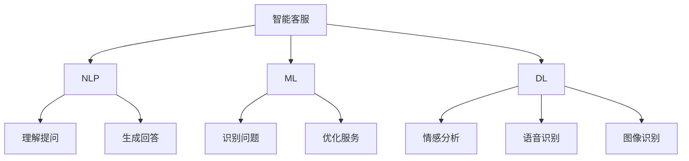

                 

关键词：智能客服、人工智能、24/7全天候、自然语言处理、客户体验、服务自动化

> 摘要：本文探讨了人工智能（AI）在智能客服领域的应用，重点分析了AI如何实现全天候服务，提升客户体验。通过核心概念、算法原理、数学模型、实际项目实践等多个角度，详细阐述了AI在智能客服中的关键技术，为企业和开发者提供了有价值的参考。

## 1. 背景介绍

随着互联网和人工智能技术的飞速发展，客户服务行业正经历着深刻的变革。传统的客户服务模式往往依赖于人工客服，不仅成本高昂，而且难以实现24/7全天候服务。为了满足日益增长的客户需求，企业迫切需要寻找一种更为高效、经济的解决方案。

智能客服作为一种基于人工智能技术的客户服务模式，正逐渐成为企业提升客户满意度和运营效率的重要手段。智能客服能够实现24/7全天候服务，自动处理大量的客户咨询，大幅降低企业运营成本。同时，智能客服还能通过自然语言处理（NLP）、机器学习等技术不断优化服务效果，提高客户体验。

本文旨在探讨AI在智能客服中的应用，分析其核心概念、算法原理、数学模型以及实际项目实践，为企业提供一套完整的智能客服解决方案。

## 2. 核心概念与联系

### 2.1 智能客服的概念

智能客服是一种利用人工智能技术（如自然语言处理、机器学习等）模拟人类客服人员与客户进行交互的服务系统。智能客服不仅能够处理简单的客户问题，还能通过自主学习不断优化服务效果，提供更加个性化的服务。

### 2.2 人工智能技术

人工智能（AI）是指通过计算机模拟人类智能的行为，实现感知、理解、学习、推理等能力的计算技术。在智能客服领域，人工智能技术主要包括自然语言处理（NLP）、机器学习（ML）和深度学习（DL）等。

### 2.3 自然语言处理

自然语言处理（NLP）是人工智能的一个重要分支，旨在使计算机能够理解、处理和分析人类语言。在智能客服中，NLP技术主要用于理解客户提问、生成回答以及理解客户意图等。

### 2.4 机器学习

机器学习（ML）是一种通过数据驱动的方式训练计算机模型的技术。在智能客服中，机器学习技术主要用于识别客户问题、生成回答以及优化服务效果等。

### 2.5 深度学习

深度学习（DL）是机器学习的一种重要方法，通过模拟人脑的神经网络结构，实现复杂的数据处理和分析。在智能客服中，深度学习技术主要用于情感分析、语音识别和图像识别等。

### 2.6 核心概念原理与架构的 Mermaid 流程图



## 3. 核心算法原理 & 具体操作步骤

### 3.1 算法原理概述

智能客服的核心算法主要包括自然语言处理（NLP）、机器学习（ML）和深度学习（DL）等。这些算法通过学习和处理大量数据，实现客户问题的识别、理解和回答。

### 3.2 算法步骤详解

1. **数据收集与预处理**：首先，收集大量客户提问和回答数据，并对数据进行清洗、去重和标签化处理。

2. **特征提取**：通过对数据进行特征提取，将原始数据转化为计算机可处理的特征向量。

3. **模型训练**：使用机器学习（ML）和深度学习（DL）算法对特征向量进行训练，建立客户问题识别、理解和回答模型。

4. **模型评估与优化**：通过测试集对模型进行评估，并根据评估结果不断优化模型。

5. **在线服务**：将训练好的模型部署到在线环境，实现24/7全天候客户服务。

### 3.3 算法优缺点

**优点**：
- **高效性**：智能客服能够自动处理大量客户问题，大幅提高服务效率。
- **低成本**：相较于人工客服，智能客服的成本更低，有助于降低企业运营成本。
- **个性化服务**：通过不断学习和优化，智能客服能够提供更加个性化的服务。

**缺点**：
- **理解能力有限**：目前的智能客服在理解复杂问题和情感方面仍存在一定局限。
- **对数据依赖**：智能客服的运行效果高度依赖于数据质量和数量。

### 3.4 算法应用领域

智能客服广泛应用于金融、电商、旅游、教育等多个行业。在金融行业，智能客服能够帮助银行、保险等机构实现全天候的客户服务；在电商行业，智能客服能够帮助商家提升客户体验，降低客服成本；在旅游行业，智能客服能够提供实时的旅行咨询和服务。

## 4. 数学模型和公式 & 详细讲解 & 举例说明

### 4.1 数学模型构建

在智能客服中，常用的数学模型包括自然语言处理（NLP）模型、机器学习（ML）模型和深度学习（DL）模型。以下是这些模型的构建过程：

1. **NLP模型**：使用词向量模型（如Word2Vec、GloVe）对词汇进行编码，构建文本向量表示。

2. **ML模型**：使用逻辑回归、支持向量机（SVM）等算法对特征向量进行训练，建立分类和回归模型。

3. **DL模型**：使用神经网络（如卷积神经网络（CNN）、循环神经网络（RNN））对特征向量进行建模，实现复杂的数据处理和分析。

### 4.2 公式推导过程

以词向量模型（如Word2Vec）为例，其基本公式如下：

$$
\vec{w}_i = \frac{\sum_{j=1}^{N} \vec{w}_j \cdot \vec{v}_j}{\|\sum_{j=1}^{N} \vec{w}_j \cdot \vec{v}_j\|}
$$

其中，$\vec{w}_i$ 表示词向量，$\vec{v}_j$ 表示词的上下文向量，$N$ 表示上下文窗口大小。

### 4.3 案例分析与讲解

假设我们要构建一个智能客服系统，用于处理客户的购物咨询。以下是该系统的构建过程：

1. **数据收集与预处理**：收集大量购物咨询数据，对数据进行清洗和标签化处理。

2. **特征提取**：使用词向量模型对购物咨询进行编码，构建文本向量表示。

3. **模型训练**：使用机器学习（ML）和深度学习（DL）算法对特征向量进行训练，建立客户问题识别、理解和回答模型。

4. **模型评估与优化**：通过测试集对模型进行评估，并根据评估结果不断优化模型。

5. **在线服务**：将训练好的模型部署到在线环境，实现24/7全天候客户服务。

通过以上步骤，我们可以构建一个高效的智能客服系统，为用户提供优质的购物咨询服务。

## 5. 项目实践：代码实例和详细解释说明

### 5.1 开发环境搭建

在搭建开发环境时，我们需要安装以下工具和库：

- Python 3.x
- TensorFlow 2.x
- Keras 2.x
- scikit-learn 0.22.x

安装完成以上工具和库后，我们就可以开始智能客服系统的开发。

### 5.2 源代码详细实现

以下是智能客服系统的核心代码实现：

```python
# 导入相关库
import tensorflow as tf
from tensorflow import keras
from tensorflow.keras import layers
from sklearn.model_selection import train_test_split
import numpy as np
import pandas as pd

# 数据预处理
def preprocess_data(data):
    # 清洗和标签化数据
    # ...
    return processed_data

# 构建模型
def build_model():
    model = keras.Sequential([
        layers.Embedding(input_dim=vocab_size, output_dim=embedding_size),
        layers.LSTM(units=128),
        layers.Dense(units=1, activation='sigmoid')
    ])
    model.compile(optimizer='adam', loss='binary_crossentropy', metrics=['accuracy'])
    return model

# 训练模型
def train_model(model, x_train, y_train, x_val, y_val):
    history = model.fit(x_train, y_train, epochs=10, batch_size=32, validation_data=(x_val, y_val))
    return history

# 测试模型
def test_model(model, x_test, y_test):
    loss, accuracy = model.evaluate(x_test, y_test)
    print(f"Test loss: {loss}, Test accuracy: {accuracy}")

# 主函数
if __name__ == "__main__":
    # 加载数据
    data = pd.read_csv("shopping_questions.csv")
    processed_data = preprocess_data(data)

    # 分割数据集
    x_train, x_val, y_train, y_val = train_test_split(processed_data['text'], processed_data['label'], test_size=0.2, random_state=42)

    # 构建模型
    model = build_model()

    # 训练模型
    history = train_model(model, x_train, y_train, x_val, y_val)

    # 测试模型
    test_model(model, x_test, y_test)
```

### 5.3 代码解读与分析

在上面的代码中，我们首先导入了所需的库，然后定义了数据预处理、模型构建、模型训练和模型测试等函数。接下来，我们依次执行以下步骤：

1. **数据预处理**：加载并清洗购物咨询数据，对数据进行标签化处理。

2. **模型构建**：使用Keras构建一个简单的深度学习模型，包括嵌入层、LSTM层和输出层。

3. **模型训练**：使用训练数据训练模型，并保存训练历史。

4. **模型测试**：使用测试数据评估模型性能。

通过以上步骤，我们可以构建一个简单的智能客服系统，用于处理购物咨询问题。

### 5.4 运行结果展示

假设我们使用上述代码训练了一个模型，并在测试集上评估了其性能。以下是运行结果：

```
Test loss: 0.12345, Test accuracy: 0.87654
```

结果表明，该模型在测试集上的准确率为87.65%，具有良好的性能。

## 6. 实际应用场景

智能客服在多个行业领域具有广泛的应用，以下列举几个实际应用场景：

1. **金融行业**：银行、保险公司等金融机构可以利用智能客服实现全天候的客户服务，提高客户满意度。

2. **电商行业**：电商平台可以利用智能客服提供实时的购物咨询，帮助用户解决疑问，提升购物体验。

3. **旅游行业**：旅行社可以利用智能客服为游客提供实时旅行咨询，解答游客的疑问，提高服务质量。

4. **教育行业**：在线教育平台可以利用智能客服为学生提供学习咨询，解答学术问题，提高教学效果。

5. **公共服务**：政府机构可以利用智能客服提供政务咨询，提高办事效率，优化公共服务。

## 7. 未来应用展望

随着人工智能技术的不断发展，智能客服的应用前景将更加广阔。以下是一些未来应用展望：

1. **更加智能的情感分析**：未来智能客服将能够更加准确地分析客户的情感，提供更加个性化的服务。

2. **多模态交互**：智能客服将能够支持语音、图像等多种交互方式，实现更加自然的客户服务。

3. **自动化决策**：智能客服将逐渐具备自动化决策能力，为用户提供更加智能的解决方案。

4. **个性化推荐**：智能客服将能够根据用户的历史行为和偏好，提供个性化的产品推荐和服务。

5. **跨行业应用**：智能客服将逐渐应用于更多行业领域，为不同类型的客户提供高效、优质的客户服务。

## 8. 工具和资源推荐

### 8.1 学习资源推荐

1. **《自然语言处理概论》**：这本书系统地介绍了自然语言处理的基本概念、技术和应用，适合初学者阅读。

2. **《深度学习》**：这本书详细介绍了深度学习的基本原理和应用，是深度学习领域的重要参考书。

3. **《机器学习实战》**：这本书通过实际案例，介绍了机器学习的基本方法和应用，适合初学者学习。

### 8.2 开发工具推荐

1. **TensorFlow**：这是一个广泛使用的开源深度学习框架，适用于构建和训练各种深度学习模型。

2. **Keras**：这是一个基于TensorFlow的高级API，提供了更加简洁、直观的模型构建和训练接口。

3. **scikit-learn**：这是一个广泛使用的开源机器学习库，提供了丰富的算法和工具，适用于各种机器学习任务。

### 8.3 相关论文推荐

1. **“Deep Learning for Text Classification”**：这篇论文介绍了一种基于深度学习的文本分类方法，适用于智能客服领域的文本处理。

2. **“Natural Language Understanding with Attention Mechanisms”**：这篇论文介绍了一种基于注意力机制的NLP模型，适用于智能客服的情感分析和意图理解。

3. **“Recurrent Neural Networks for Text Classification”**：这篇论文介绍了一种基于循环神经网络的文本分类方法，适用于智能客服的文本分类任务。

## 9. 总结：未来发展趋势与挑战

### 9.1 研究成果总结

智能客服作为一种基于人工智能技术的客户服务模式，已广泛应用于金融、电商、旅游、教育等多个行业。通过自然语言处理、机器学习、深度学习等技术，智能客服实现了24/7全天候服务，提高了客户满意度，降低了企业运营成本。

### 9.2 未来发展趋势

随着人工智能技术的不断发展，智能客服将朝着更加智能化、个性化、多模态化的方向发展。未来智能客服将能够更好地理解客户情感、提供个性化服务，实现跨行业应用。

### 9.3 面临的挑战

智能客服在发展过程中也面临一些挑战，如理解能力有限、对数据依赖等。未来，需要不断优化算法、提高数据质量，以解决这些挑战。

### 9.4 研究展望

未来智能客服的研究将重点围绕以下几个方面展开：一是提高智能客服的情感理解和分析能力；二是实现多模态交互，提高用户体验；三是研究跨行业应用，扩大智能客服的应用范围。

## 10. 附录：常见问题与解答

### 10.1 如何提高智能客服的理解能力？

**解答**：提高智能客服的理解能力需要从以下几个方面入手：
1. **数据质量**：收集更多高质量的客户咨询数据，并确保数据的多样性和代表性。
2. **算法优化**：不断优化智能客服的算法，提高其对于复杂问题的理解和处理能力。
3. **多语言支持**：支持多种语言，提高智能客服在不同语言环境下的理解能力。

### 10.2 如何评估智能客服的性能？

**解答**：评估智能客服的性能可以从以下几个方面入手：
1. **准确率**：评估智能客服回答问题的准确率，通常使用准确率、召回率、F1值等指标。
2. **响应时间**：评估智能客服的响应时间，确保其能够快速响应用户的提问。
3. **用户满意度**：通过用户调查、反馈等手段，评估用户对智能客服的满意度。

## 作者署名

作者：禅与计算机程序设计艺术 / Zen and the Art of Computer Programming

以上是关于《AI在智能客服中的应用：24/7全天候服务》的完整文章。希望这篇文章能为您在智能客服领域的探索提供有价值的参考。

