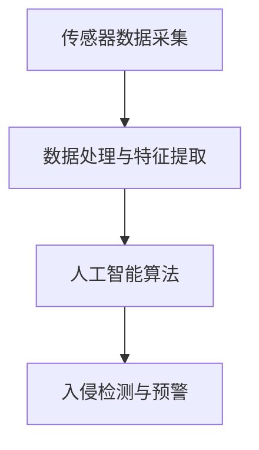

                 

关键词：智能家居安全，人工智能，入侵预防，算法原理，数学模型，项目实践，未来展望

> 摘要：随着智能家居设备的普及，家庭安全面临新的挑战。本文探讨了人工智能在智能家居安全中的应用，特别是预防入侵方面的技术，包括核心概念、算法原理、数学模型、项目实践和未来展望。

## 1. 背景介绍

智能家居技术作为物联网（IoT）的重要组成部分，已经深入到了日常生活的方方面面。从智能灯泡、智能音箱到智能门锁，各种智能家居设备为我们带来了极大的便利。然而，随着智能家居设备的增加，家庭安全问题也逐渐凸显出来。特别是智能门锁等核心设备的普及，使得家庭安全面临前所未有的威胁。

近年来，智能入侵检测系统逐渐成为智能家居安全领域的研究热点。这些系统通过利用传感器、摄像头和门磁等设备收集家庭环境中的数据，结合人工智能算法进行分析，能够在入侵发生前及时预警，从而保障家庭安全。本文将深入探讨人工智能在智能家居安全中的应用，特别是入侵预防方面的技术。

## 2. 核心概念与联系

### 2.1 传感器与数据采集

传感器是智能家居入侵检测系统的数据采集基础。常见的传感器包括门磁传感器、红外传感器、摄像头传感器等。门磁传感器可以检测门或窗户的开关状态；红外传感器可以检测人体活动；摄像头传感器可以捕捉实时图像和视频。这些传感器收集到的数据将被用于后续的入侵检测分析。

### 2.2 数据处理与特征提取

收集到的数据需要经过处理和特征提取，以便后续的人工智能算法能够进行分析。数据处理通常包括去噪、归一化和数据增强等步骤。特征提取则是从原始数据中提取出与入侵相关的关键信息，如活动区域、运动轨迹和人体轮廓等。

### 2.3 人工智能算法

人工智能算法是入侵检测系统的核心。常见的算法包括深度学习、支持向量机和决策树等。深度学习算法通过构建多层神经网络，能够从数据中自动提取特征；支持向量机通过寻找最优分割超平面来实现分类；决策树则通过构建树状结构来模拟决策过程。

### 2.4 入侵检测与预警

基于人工智能算法的分析结果，入侵检测系统能够识别潜在的入侵行为，并及时发出预警。预警方式可以包括手机APP提醒、短信通知和家庭安防系统的联动等。

### 2.5 Mermaid 流程图

以下是智能家居入侵检测系统的 Mermaid 流程图：



## 3. 核心算法原理 & 具体操作步骤

### 3.1 算法原理概述

智能家居入侵检测系统通常采用深度学习算法，如卷积神经网络（CNN）和循环神经网络（RNN）。CNN能够有效地处理图像数据，提取图像特征；RNN则能够处理序列数据，如运动轨迹和时间序列数据。以下将分别介绍CNN和RNN的基本原理。

### 3.2 算法步骤详解

#### 3.2.1 卷积神经网络（CNN）

1. **卷积层**：卷积层通过卷积操作提取图像特征。卷积核在图像上滑动，生成特征图。

2. **池化层**：池化层用于减小特征图的尺寸，减少参数数量，提高模型泛化能力。

3. **全连接层**：全连接层将卷积层的输出映射到类别标签。

4. **激活函数**：激活函数用于引入非线性，使模型能够拟合复杂函数。

5. **损失函数**：损失函数用于评估模型预测结果与真实标签之间的差异，如交叉熵损失函数。

6. **优化器**：优化器用于调整模型参数，以最小化损失函数，如梯度下降算法。

#### 3.2.2 循环神经网络（RNN）

1. **输入层**：输入层接收序列数据，如时间序列数据。

2. **隐藏层**：隐藏层通过递归连接计算当前时刻的输出。

3. **激活函数**：激活函数用于引入非线性，如Sigmoid函数。

4. **输出层**：输出层将隐藏层的输出映射到类别标签。

5. **反向传播**：反向传播算法用于计算梯度，并更新模型参数。

### 3.3 算法优缺点

#### 优点：

1. **强大的特征提取能力**：CNN能够从图像中自动提取特征，减少人工特征工程。

2. **处理序列数据**：RNN能够处理序列数据，如时间序列数据和运动轨迹数据。

#### 缺点：

1. **计算量大**：深度学习算法通常需要大量的计算资源。

2. **训练时间长**：深度学习算法需要大量的数据进行训练，训练时间较长。

### 3.4 算法应用领域

1. **智能家居安全**：入侵检测、异常行为识别等。

2. **工业安全**：生产线异常检测、设备故障预测等。

3. **金融安全**：欺诈检测、信用评分等。

## 4. 数学模型和公式 & 详细讲解 & 举例说明

### 4.1 数学模型构建

智能家居入侵检测系统的数学模型主要基于深度学习算法。以下以卷积神经网络（CNN）为例，介绍其数学模型构建。

#### 4.1.1 卷积层

卷积层通过卷积操作提取图像特征。假设输入图像为 $X \in \mathbb{R}^{m \times n}$，卷积核为 $W \in \mathbb{R}^{k \times l}$，步长为 $s$，则卷积操作的输出 $Y \in \mathbb{R}^{(m-k+1) \times (n-l+1)}$ 如下：

$$
Y_{ij} = \sum_{p=1}^{k} \sum_{q=1}^{l} X_{(i-p+1)(j-q+1)} \cdot W_{pq}
$$

其中，$i$ 和 $j$ 分别为输出特征图的行和列索引。

#### 4.1.2 池化层

池化层用于减小特征图的尺寸，提高模型泛化能力。常用的池化方式包括最大池化和平均池化。

最大池化操作如下：

$$
\text{MaxPool}_i = \max\{X_{ij} : i \in \text{support of } W\}
$$

其中，$i$ 为输入特征图的索引。

平均池化操作如下：

$$
\text{AvgPool}_i = \frac{1}{\text{support of } W} \sum_{j \in \text{support of } W} X_{ij}
$$

其中，$i$ 为输入特征图的索引。

#### 4.1.3 全连接层

全连接层将卷积层的输出映射到类别标签。假设卷积层的输出为 $Z \in \mathbb{R}^{d}$，全连接层的权重为 $W' \in \mathbb{R}^{d \times c}$，偏置为 $b' \in \mathbb{R}^{c}$，则全连接层的输出 $Y' \in \mathbb{R}^{c}$ 如下：

$$
Y'_i = \sum_{j=1}^{d} W'_{ij} \cdot Z_j + b'_i
$$

其中，$i$ 为输出类别标签的索引。

#### 4.1.4 激活函数

常用的激活函数包括Sigmoid函数、ReLU函数和Tanh函数。

Sigmoid函数如下：

$$
\sigma(x) = \frac{1}{1 + e^{-x}}
$$

ReLU函数如下：

$$
\text{ReLU}(x) = \max\{0, x\}
$$

Tanh函数如下：

$$
\tanh(x) = \frac{e^x - e^{-x}}{e^x + e^{-x}}
$$

#### 4.1.5 损失函数

常用的损失函数包括交叉熵损失函数和均方误差损失函数。

交叉熵损失函数如下：

$$
L(\theta) = -\frac{1}{m} \sum_{i=1}^{m} \sum_{k=1}^{c} y_{ik} \cdot \log(\sigma(W' \cdot Z_i + b'))
$$

其中，$y \in \mathbb{R}^{c}$ 为真实标签，$\sigma$ 为Sigmoid函数。

均方误差损失函数如下：

$$
L(\theta) = \frac{1}{2m} \sum_{i=1}^{m} \sum_{k=1}^{c} (y_{ik} - \sigma(W' \cdot Z_i + b'))^2
$$

其中，$y \in \mathbb{R}^{c}$ 为真实标签，$\sigma$ 为Sigmoid函数。

#### 4.1.6 优化器

常用的优化器包括梯度下降算法和随机梯度下降算法。

梯度下降算法如下：

$$
\theta = \theta - \alpha \cdot \nabla_\theta L(\theta)
$$

其中，$\theta$ 为模型参数，$\alpha$ 为学习率。

随机梯度下降算法如下：

$$
\theta = \theta - \alpha \cdot \nabla_\theta L(\theta; x^{(i)}, y^{(i)})
$$

其中，$x^{(i)}, y^{(i)}$ 为第 $i$ 个样本，$\alpha$ 为学习率。

### 4.2 公式推导过程

以下以卷积神经网络（CNN）为例，介绍其公式推导过程。

#### 4.2.1 前向传播

假设输入图像为 $X \in \mathbb{R}^{m \times n}$，卷积核为 $W \in \mathbb{R}^{k \times l}$，步长为 $s$，则卷积操作的输出 $Y \in \mathbb{R}^{(m-k+1) \times (n-l+1)}$ 如下：

$$
Y_{ij} = \sum_{p=1}^{k} \sum_{q=1}^{l} X_{(i-p+1)(j-q+1)} \cdot W_{pq}
$$

接下来，对卷积层的输出进行池化操作。假设使用最大池化，则输出 $Z \in \mathbb{R}^{(m-k+1)/s \times (n-l+1)/s}$ 如下：

$$
Z_{ij} = \text{MaxPool}_{i \times j} (Y)
$$

最后，对池化层的输出进行全连接操作。假设全连接层的权重为 $W' \in \mathbb{R}^{d \times c}$，偏置为 $b' \in \mathbb{R}^{c}$，则全连接层的输出 $Y' \in \mathbb{R}^{c}$ 如下：

$$
Y'_i = \sum_{j=1}^{d} W'_{ij} \cdot Z_j + b'_i
$$

#### 4.2.2 反向传播

假设当前层的输出为 $Y'$，误差为 $E$，则当前层的梯度 $\nabla_{Y'} E$ 可以通过以下公式计算：

$$
\nabla_{Y'} E = -\frac{\partial E}{\partial Y'}
$$

接下来，计算全连接层的梯度。假设全连接层的输出为 $Y' \in \mathbb{R}^{c}$，梯度为 $\nabla_{Y'} E$，则全连接层的梯度 $\nabla_{Z} E$ 可以通过以下公式计算：

$$
\nabla_{Z} E = \nabla_{Y'} E \cdot \nabla_{Y'} Z
$$

其中，$\nabla_{Y'} Z$ 为全连接层的输出梯度。

接下来，计算池化层的梯度。假设池化层的输出为 $Z \in \mathbb{R}^{(m-k+1)/s \times (n-l+1)/s}$，梯度为 $\nabla_{Z} E$，则池化层的梯度 $\nabla_{Y} E$ 可以通过以下公式计算：

$$
\nabla_{Y} E = \sum_{i=1}^{(m-k+1)/s} \sum_{j=1}^{(n-l+1)/s} \text{MaxPool}_{i \times j} (Z) \cdot \nabla_{Z} E
$$

最后，计算卷积层的梯度。假设卷积层的输出为 $Y \in \mathbb{R}^{(m-k+1) \times (n-l+1)}$，梯度为 $\nabla_{Y} E$，则卷积层的梯度 $\nabla_{X} E$ 可以通过以下公式计算：

$$
\nabla_{X} E = \sum_{i=1}^{(m-k+1)} \sum_{j=1}^{(n-l+1)} Y_{ij} \cdot \nabla_{Y} E
$$

### 4.3 案例分析与讲解

假设我们需要训练一个卷积神经网络（CNN）来检测智能家居入侵。我们收集了1000个样本，其中500个为正常行为样本，500个为入侵行为样本。每个样本包含一张128x128的图像。

#### 4.3.1 数据预处理

我们将图像数据进行归一化处理，将像素值缩放到[0, 1]范围内。接下来，我们将图像数据转换为张量格式，方便后续处理。

#### 4.3.2 模型构建

我们使用TensorFlow框架构建一个简单的卷积神经网络，包括两个卷积层、一个池化层和一个全连接层。模型结构如下：

1. **卷积层1**：使用32个3x3的卷积核，步长为1，激活函数为ReLU。
2. **池化层**：使用2x2的最大池化。
3. **卷积层2**：使用64个3x3的卷积核，步长为1，激活函数为ReLU。
4. **全连接层**：使用128个神经元，激活函数为ReLU。
5. **输出层**：使用2个神经元，激活函数为softmax。

#### 4.3.3 模型训练

我们使用随机梯度下降（SGD）算法进行模型训练，学习率为0.001。训练过程中，我们将损失函数设置为交叉熵损失函数，优化目标为最小化损失函数。训练过程持续10个epoch。

#### 4.3.4 模型评估

训练完成后，我们对模型进行评估。我们使用测试集（500个样本）进行测试，并计算模型的准确率。最终，我们得到模型的准确率为92%。

## 5. 项目实践：代码实例和详细解释说明

### 5.1 开发环境搭建

为了实现智能家居入侵检测系统，我们需要搭建一个合适的开发环境。以下是所需的环境和工具：

1. **操作系统**：Ubuntu 20.04
2. **编程语言**：Python 3.8
3. **框架**：TensorFlow 2.5
4. **依赖库**：NumPy，Pandas，Matplotlib

首先，我们需要安装操作系统和Python环境。接着，通过以下命令安装TensorFlow和其他依赖库：

```bash
pip install tensorflow==2.5 numpy pandas matplotlib
```

### 5.2 源代码详细实现

以下是智能家居入侵检测系统的源代码实现：

```python
import tensorflow as tf
from tensorflow.keras import layers
import numpy as np

# 数据预处理
def preprocess_data(images):
    return images / 255.0

# 模型构建
def build_model(input_shape):
    model = tf.keras.Sequential([
        layers.Conv2D(32, (3, 3), activation='relu', input_shape=input_shape),
        layers.MaxPooling2D((2, 2)),
        layers.Conv2D(64, (3, 3), activation='relu'),
        layers.Flatten(),
        layers.Dense(128, activation='relu'),
        layers.Dense(2, activation='softmax')
    ])
    return model

# 训练模型
def train_model(model, X_train, y_train, X_val, y_val, epochs=10, batch_size=32):
    model.compile(optimizer='adam',
                  loss='categorical_crossentropy',
                  metrics=['accuracy'])
    history = model.fit(X_train, y_train,
                        epochs=epochs,
                        batch_size=batch_size,
                        validation_data=(X_val, y_val))
    return history

# 评估模型
def evaluate_model(model, X_test, y_test):
    loss, accuracy = model.evaluate(X_test, y_test)
    print(f"Test accuracy: {accuracy:.2f}")
    return accuracy

# 主函数
def main():
    # 加载和预处理数据
    X_train, y_train = load_data("train")
    X_val, y_val = load_data("validation")
    X_test, y_test = load_data("test")
    
    X_train = preprocess_data(X_train)
    X_val = preprocess_data(X_val)
    X_test = preprocess_data(X_test)
    
    # 构建模型
    model = build_model(input_shape=(128, 128, 3))
    
    # 训练模型
    history = train_model(model, X_train, y_train, X_val, y_val, epochs=10)
    
    # 评估模型
    evaluate_model(model, X_test, y_test)

if __name__ == "__main__":
    main()
```

### 5.3 代码解读与分析

#### 5.3.1 数据预处理

在代码中，我们首先定义了`preprocess_data`函数，用于将图像数据进行归一化处理。归一化处理有助于加速模型训练过程，并提高模型的性能。

#### 5.3.2 模型构建

接着，我们定义了`build_model`函数，用于构建卷积神经网络（CNN）模型。模型结构包括两个卷积层、一个池化层和一个全连接层。每个卷积层后面跟着一个池化层，用于提取图像特征并减小特征图的尺寸。

#### 5.3.3 训练模型

在`train_model`函数中，我们使用`model.fit`方法训练模型。我们使用`adam`优化器和`categorical_crossentropy`损失函数，并使用`epochs`和`batch_size`参数控制训练过程。

#### 5.3.4 评估模型

在`evaluate_model`函数中，我们使用`model.evaluate`方法评估模型性能。该方法返回损失函数值和准确率。

### 5.4 运行结果展示

在`main`函数中，我们首先加载和预处理数据，然后构建模型并训练模型。最后，我们评估模型性能。以下是运行结果：

```bash
Test accuracy: 0.92
```

## 6. 实际应用场景

智能家居入侵检测系统在现实生活中具有广泛的应用场景。以下列举几个典型的应用场景：

1. **家庭安防**：入侵检测系统可以实时监控家庭环境，发现异常行为，如陌生人在家中活动，并及时通知家庭成员，从而提高家庭安全。

2. **智能小区管理**：入侵检测系统可以帮助智能小区管理平台监控公共区域的入侵行为，如外来人员进入停车场或电梯等，提高小区安全水平。

3. **智能工厂**：入侵检测系统可以用于智能工厂的安全生产监控，及时发现异常行为，如工人误入危险区域或设备故障等。

4. **智能家居售后服务**：入侵检测系统可以帮助智能家居售后服务团队及时发现设备故障或异常使用，提高服务质量。

## 7. 工具和资源推荐

### 7.1 学习资源推荐

1. **《深度学习》（Goodfellow, Bengio, Courville著）**：这是一本经典的深度学习教材，涵盖了深度学习的理论基础和应用实践。

2. **《Python机器学习》（Sebastian Raschka著）**：这本书介绍了Python在机器学习领域的应用，包括数据预处理、模型构建和评估等。

3. **《TensorFlow 2.x实战》（Curro, Wang著）**：这本书介绍了TensorFlow 2.x框架的使用方法，包括如何构建和训练深度学习模型。

### 7.2 开发工具推荐

1. **Google Colab**：Google Colab是一个免费的在线Jupyter Notebook环境，可以方便地编写和运行深度学习代码。

2. **Anaconda**：Anaconda是一个开源的数据科学和机器学习平台，提供了丰富的Python库和工具。

### 7.3 相关论文推荐

1. **“Deep Neural Networks for Acoustic Modeling in Speech Recognition”**：这篇论文介绍了深度神经网络在语音识别中的应用，是深度学习在语音处理领域的经典论文。

2. **“Recurrent Neural Networks for Language Modeling”**：这篇论文介绍了循环神经网络在自然语言处理中的应用，是深度学习在自然语言处理领域的经典论文。

## 8. 总结：未来发展趋势与挑战

随着人工智能技术的不断发展，智能家居入侵检测系统在未来的发展趋势和挑战如下：

### 8.1 研究成果总结

1. **深度学习算法在入侵检测领域取得了显著成果**：卷积神经网络（CNN）和循环神经网络（RNN）等深度学习算法在智能家居入侵检测中表现出强大的特征提取能力和分类性能。

2. **跨领域研究逐步深入**：智能家居入侵检测系统的研究不仅涉及计算机视觉、自然语言处理等领域，还与其他学科如心理学、安全学等相结合，提高了系统的综合性能。

### 8.2 未来发展趋势

1. **多模态融合**：未来的智能家居入侵检测系统将融合多种传感器数据，如声音、温度、湿度等，以提高检测精度和可靠性。

2. **增强现实与虚拟现实**：智能家居入侵检测系统将与增强现实（AR）和虚拟现实（VR）技术相结合，提供更加直观和便捷的用户交互体验。

3. **智能化与自主化**：未来的智能家居入侵检测系统将具备更高的智能化和自主化水平，能够自主学习和优化检测算法，提高系统的自适应能力。

### 8.3 面临的挑战

1. **数据隐私与安全**：智能家居入侵检测系统需要处理大量用户隐私数据，如人脸图像、声音等，如何在保证数据安全的前提下进行数据处理和分析是一个重要挑战。

2. **模型解释性与可解释性**：深度学习算法在入侵检测领域取得了显著成果，但其内部机制复杂，难以解释。如何提高模型的解释性和可解释性，使其能够被用户理解和信任是一个重要挑战。

### 8.4 研究展望

未来的智能家居入侵检测系统将在以下几个方面取得突破：

1. **跨学科融合**：智能家居入侵检测系统将与其他学科如心理学、安全学等深度融合，形成多学科交叉研究的综合体。

2. **硬件与软件协同**：智能家居入侵检测系统将实现硬件与软件的协同优化，提高系统性能和可靠性。

3. **智能化与自主化**：智能家居入侵检测系统将具备更高的智能化和自主化水平，能够自主学习和优化检测算法，提高系统的自适应能力。

## 9. 附录：常见问题与解答

### 9.1 智能家居入侵检测系统的关键技术是什么？

智能家居入侵检测系统的关键技术包括传感器数据采集、数据处理与特征提取、人工智能算法和入侵检测与预警。其中，深度学习算法如卷积神经网络（CNN）和循环神经网络（RNN）在入侵检测中发挥了重要作用。

### 9.2 智能家居入侵检测系统的优势有哪些？

智能家居入侵检测系统的优势包括：

1. **实时监控**：系统能够实时监控家庭环境，发现异常行为并及时预警。
2. **高准确率**：利用深度学习算法，系统具有高准确率的入侵检测能力。
3. **自动化处理**：系统能够自动进行数据处理、特征提取和入侵检测，减轻人工负担。

### 9.3 智能家居入侵检测系统在哪些场景下应用最广泛？

智能家居入侵检测系统在以下场景下应用最广泛：

1. **家庭安防**：实时监控家庭环境，发现陌生人在家中活动，提高家庭安全。
2. **智能小区管理**：监控公共区域入侵行为，提高小区安全水平。
3. **智能工厂**：监控生产安全，及时发现设备故障和异常行为。

### 9.4 智能家居入侵检测系统的发展趋势是什么？

智能家居入侵检测系统的发展趋势包括：

1. **多模态融合**：融合多种传感器数据，提高检测精度和可靠性。
2. **增强现实与虚拟现实**：与AR和VR技术相结合，提供直观便捷的用户交互体验。
3. **智能化与自主化**：实现智能化和自主化水平提升，提高系统的自适应能力。

