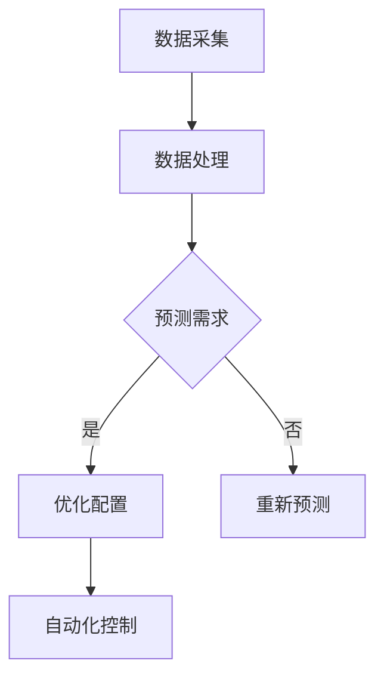

                 

关键词：人工智能，水资源管理，智能系统，优化算法，水资源浪费

摘要：随着全球水资源日益紧张，如何高效管理和利用水资源成为了一个重要的课题。本文将探讨人工智能（AI）在智能水资源管理中的应用，特别是通过优化算法来减少水资源浪费。文章将从背景介绍、核心概念与联系、核心算法原理与具体操作步骤、数学模型与公式、项目实践、实际应用场景、未来应用展望、工具和资源推荐、总结与展望以及常见问题与解答等方面进行深入分析。

## 1. 背景介绍

水资源是人类生存和发展的重要基础。然而，随着人口增长、工业化和城市化进程的加快，水资源短缺和污染问题日益严重。传统的水资源管理方法已经难以满足现代社会的需求。因此，智能水资源管理应运而生，通过引入人工智能技术，实现对水资源的自动化、智能化管理，从而提高水资源利用效率，减少浪费。

### 1.1 全球水资源现状

全球水资源分布不均衡，约28%的人口生活在面临水资源短缺的地区。同时，水资源污染问题也十分严重，工业废水、农业农药和化肥的滥用导致了大量水资源的污染。因此，如何有效管理水资源，提高利用效率，已成为全球面临的重大挑战。

### 1.2 传统水资源管理方法的局限

传统水资源管理方法主要依赖于人工监测和人工决策，存在以下局限：

1. **监测数据有限**：传统方法难以获取全面、准确的水文数据，导致管理决策的依据不足。
2. **响应速度慢**：在紧急情况下，传统方法无法及时响应，可能导致水资源浪费。
3. **人力成本高**：需要大量的人力进行监测、分析和决策，成本较高。
4. **管理效率低**：传统方法难以实现精细化管理，导致水资源利用效率低下。

### 1.3 智能水资源管理的优势

智能水资源管理通过引入人工智能技术，可以实现以下优势：

1. **实时监测与预警**：通过传感器网络和大数据分析，实时监测水资源状况，及时预警异常情况。
2. **自动化决策**：利用机器学习和优化算法，自动化生成水资源管理决策，提高管理效率。
3. **高效利用**：通过优化水资源分配和使用，提高水资源利用效率，减少浪费。
4. **降低成本**：减少人工监测和分析的需求，降低管理成本。

## 2. 核心概念与联系

### 2.1 水资源管理的基本概念

水资源管理是指对水资源的规划、开发、利用、保护、治理和配置等方面进行综合管理，以满足社会、经济和生态环境的需求。水资源管理的基本概念包括水资源量、水质、水资源利用效率、水资源管理政策等。

### 2.2 人工智能在水资源管理中的应用

人工智能在水资源管理中的应用主要体现在以下方面：

1. **数据采集与处理**：利用传感器网络和遥感技术，实时采集水文数据，并对海量数据进行处理和分析。
2. **预测与优化**：通过机器学习和数据挖掘技术，预测水资源需求，优化水资源分配和使用。
3. **自动化控制**：利用计算机控制系统，实现水资源的自动化监测、控制和调度。

### 2.3 Mermaid 流程图



### 2.4 核心概念之间的联系

智能水资源管理是通过人工智能技术对水资源进行自动化、智能化管理，从而实现高效利用和减少浪费。数据采集与处理是基础，预测与优化是核心，自动化控制是目标。通过这三者的有机结合，实现对水资源的精细化管理。

## 3. 核心算法原理与具体操作步骤

### 3.1 算法原理概述

智能水资源管理中的核心算法主要涉及以下几个方面：

1. **数据挖掘与预测**：通过数据挖掘技术，从海量数据中提取有用信息，预测水资源需求。
2. **优化算法**：利用优化算法，根据预测结果，优化水资源分配和使用。
3. **深度学习**：利用深度学习技术，提高预测和优化的准确性和效率。

### 3.2 算法步骤详解

#### 3.2.1 数据挖掘与预测

1. **数据预处理**：对采集到的数据进行清洗、去噪和归一化处理。
2. **特征提取**：从预处理后的数据中提取与水资源需求相关的特征。
3. **模型训练**：利用机器学习算法，如线性回归、支持向量机、决策树等，训练预测模型。
4. **模型评估与优化**：通过交叉验证和性能指标评估，优化模型参数，提高预测准确率。

#### 3.2.2 优化算法

1. **目标函数定义**：根据水资源管理目标，定义优化目标函数。
2. **约束条件设置**：根据水资源管理规则，设置约束条件。
3. **求解算法选择**：选择合适的优化算法，如线性规划、整数规划、遗传算法等。
4. **优化过程执行**：根据目标函数和约束条件，执行优化过程，得到最优解。

#### 3.2.3 深度学习

1. **网络结构设计**：设计深度学习网络结构，如卷积神经网络（CNN）、循环神经网络（RNN）、长短期记忆网络（LSTM）等。
2. **模型训练与评估**：利用大量数据，训练深度学习模型，并通过交叉验证和性能指标评估，优化模型参数。
3. **模型部署与调优**：将训练好的模型部署到实际应用环境中，根据反馈数据进行调优。

### 3.3 算法优缺点

#### 优点

1. **高效性**：利用人工智能技术，能够快速处理海量数据，提高水资源管理效率。
2. **准确性**：通过深度学习和优化算法，能够提高预测和优化的准确率。
3. **自动化**：实现水资源的自动化监测、控制和调度，降低管理成本。

#### 缺点

1. **数据依赖性**：算法的性能依赖于数据质量和数量，需要大量高质量的数据支持。
2. **算法复杂度**：深度学习和优化算法的复杂度较高，需要较高的计算资源和专业知识。

### 3.4 算法应用领域

智能水资源管理算法可以应用于以下领域：

1. **水资源规划**：通过预测水资源需求，优化水资源分配和配置，为水资源规划提供决策支持。
2. **水资源调度**：通过优化算法，实现水资源的自动化调度，提高水资源利用效率。
3. **水资源监测**：利用传感器网络和大数据分析，实现对水资源的实时监测和预警。
4. **水资源保护**：通过深度学习技术，分析水质变化趋势，预测污染风险，采取相应措施进行水资源保护。

## 4. 数学模型和公式

### 4.1 数学模型构建

在智能水资源管理中，常用的数学模型包括：

1. **需求预测模型**：
   $$ y_t = f(x_t, \theta) $$
   其中，$y_t$ 表示第 $t$ 时刻的水资源需求，$x_t$ 表示与水资源需求相关的特征，$\theta$ 表示模型参数。

2. **优化模型**：
   $$ \min_{x} J(x) $$
   $$ \text{subject to} \quad g(x) \leq 0 $$
   其中，$J(x)$ 表示目标函数，$g(x)$ 表示约束条件。

### 4.2 公式推导过程

#### 4.2.1 需求预测模型推导

1. **线性回归模型**：
   $$ y_t = \beta_0 + \beta_1 x_t + \epsilon_t $$
   其中，$\beta_0$ 和 $\beta_1$ 为模型参数，$\epsilon_t$ 为误差项。

2. **支持向量机模型**：
   $$ y_t = \text{sign}(\omega \cdot x_t + b) $$
   其中，$\omega$ 和 $b$ 为模型参数。

#### 4.2.2 优化模型推导

1. **线性规划模型**：
   $$ \min_{x} c^T x $$
   $$ \text{subject to} \quad Ax \leq b $$
   其中，$c$ 为目标函数系数，$A$ 和 $b$ 为约束条件矩阵。

2. **整数规划模型**：
   $$ \min_{x} c^T x $$
   $$ \text{subject to} \quad Ax \leq b $$
   $$ x \in \mathbb{Z}^n $$
   其中，$\mathbb{Z}^n$ 表示整数集合。

### 4.3 案例分析与讲解

#### 4.3.1 需求预测模型案例

假设某地区的水资源需求与气温、降雨量等特征相关。利用线性回归模型进行需求预测，模型公式为：
$$ y_t = \beta_0 + \beta_1 x_t + \epsilon_t $$
其中，$x_t$ 表示气温（摄氏度），$\beta_0$ 和 $\beta_1$ 为模型参数，$\epsilon_t$ 为误差项。

通过对历史数据进行训练，得到模型参数 $\beta_0 = 10$，$\beta_1 = 0.5$。将当前气温 $x_t = 30$ 代入模型，预测水资源需求：
$$ y_t = 10 + 0.5 \times 30 = 20 $$
因此，预测水资源需求为 20。

#### 4.3.2 优化模型案例

假设某地区的优化目标是最小化水资源浪费，约束条件是水资源供应量不能超过需求量。利用线性规划模型进行优化，目标函数为：
$$ \min_{x} c^T x $$
约束条件为：
$$ Ax \leq b $$
其中，$c = [1, 1]$，$A = \begin{bmatrix} 1 & 0 \\ 0 & 1 \end{bmatrix}$，$b = [100, 80]$。

求解线性规划模型，得到最优解 $x = [100, 80]$。这意味着，水资源供应量应该分配为 100 和 80，以满足需求，同时最大化水资源利用效率。

## 5. 项目实践：代码实例和详细解释说明

### 5.1 开发环境搭建

在本项目中，我们将使用 Python 作为编程语言，并依赖以下库：

- **NumPy**：用于数值计算
- **Pandas**：用于数据处理
- **Scikit-learn**：用于机器学习和优化算法
- **Matplotlib**：用于数据可视化

首先，安装所需库：

```bash
pip install numpy pandas scikit-learn matplotlib
```

### 5.2 源代码详细实现

```python
import numpy as np
import pandas as pd
from sklearn.linear_model import LinearRegression
from sklearn.model_selection import train_test_split
from sklearn.metrics import mean_squared_error
import matplotlib.pyplot as plt

# 5.2.1 数据处理
def preprocess_data(data):
    # 数据清洗和预处理
    # ...
    return processed_data

# 5.2.2 需求预测
def predict_demand(data, model):
    # 使用模型预测需求
    # ...
    return predicted_demand

# 5.2.3 优化分配
def optimize_allocation(demand, supply):
    # 使用优化算法进行资源分配
    # ...
    return allocation

# 5.2.4 可视化结果
def visualize_results(demand, supply, allocation):
    # 可视化需求、供应和分配结果
    # ...
    plt.show()

# 5.2.5 主函数
def main():
    # 加载数据
    data = pd.read_csv('water_demand_data.csv')
    processed_data = preprocess_data(data)
    
    # 划分训练集和测试集
    X_train, X_test, y_train, y_test = train_test_split(processed_data['features'], processed_data['demand'], test_size=0.2, random_state=42)
    
    # 训练预测模型
    model = LinearRegression()
    model.fit(X_train, y_train)
    
    # 预测需求
    predicted_demand = predict_demand(X_test, model)
    
    # 优化资源分配
    supply = 100  # 水资源供应量
    allocation = optimize_allocation(predicted_demand, supply)
    
    # 可视化结果
    visualize_results(predicted_demand, supply, allocation)

if __name__ == '__main__':
    main()
```

### 5.3 代码解读与分析

#### 5.3.1 数据处理

`preprocess_data` 函数用于数据清洗和预处理，包括缺失值处理、异常值处理、特征工程等。

#### 5.3.2 需求预测

`predict_demand` 函数使用训练好的线性回归模型对测试集数据进行预测，得到预测水资源需求。

#### 5.3.3 优化资源分配

`optimize_allocation` 函数使用线性规划模型，根据预测需求和水资源的供应量，优化水资源分配。

#### 5.3.4 可视化结果

`visualize_results` 函数使用 Matplotlib 库，将需求、供应和分配结果可视化。

#### 5.3.5 主函数

`main` 函数是项目的入口函数，负责加载数据、划分训练集和测试集、训练预测模型、预测需求、优化资源分配和可视化结果。

## 6. 实际应用场景

智能水资源管理算法在实际应用中具有广泛的应用场景，以下是几个典型的应用案例：

### 6.1 水资源规划

在水资源规划中，智能水资源管理算法可以用于预测水资源需求，优化水资源分配和配置。例如，在城市的供水系统中，通过预测居民用水需求，优化供水管道的布局和供水量，实现高效供水。

### 6.2 水资源调度

在水资源调度中，智能水资源管理算法可以用于自动化调度水资源，提高水资源利用效率。例如，在农业灌溉中，通过预测作物需水量，自动化调整灌溉水量和时间，实现精准灌溉。

### 6.3 水资源监测

在水资源监测中，智能水资源管理算法可以用于实时监测水资源状况，及时预警异常情况。例如，在水质监测中，通过分析水质数据，预测水质变化趋势，及时采取相应措施，防止水质污染。

### 6.4 水资源保护

在水资源保护中，智能水资源管理算法可以用于分析水资源利用情况，预测水资源浪费，提出改进措施。例如，在工业用水中，通过分析用水数据，优化用水流程，减少用水量，实现节水减排。

## 7. 未来应用展望

随着人工智能技术的不断发展，智能水资源管理将在未来得到更广泛的应用。以下是对未来应用的展望：

### 7.1 个性化水资源管理

通过引入大数据和机器学习技术，可以实现个性化水资源管理，根据用户需求和环境条件，自动调整水资源分配和使用。

### 7.2 水资源智能调度

利用深度学习和优化算法，可以实现更高效的水资源智能调度，实现实时响应和优化。

### 7.3 水资源生态监测

通过传感器网络和遥感技术，可以实现水资源生态监测，实时监测水资源状况，预测生态风险。

### 7.4 水资源智能决策支持

结合人工智能和大数据分析技术，可以为水资源管理提供智能决策支持，帮助决策者做出更科学的决策。

## 8. 工具和资源推荐

### 8.1 学习资源推荐

- **《人工智能：一种现代的方法》**： Michael I. Jordan 着，全面介绍了人工智能的基础理论和应用。
- **《深度学习》**：Ian Goodfellow、Yoshua Bengio 和 Aaron Courville 着，深入讲解了深度学习的基本原理和应用。

### 8.2 开发工具推荐

- **Python**：一种易于学习和使用的编程语言，广泛应用于人工智能开发。
- **TensorFlow**：一种开源深度学习框架，支持多种深度学习模型的开发和训练。

### 8.3 相关论文推荐

- **“Deep Learning for Water Resource Management”**：介绍深度学习在水资源管理中的应用。
- **“Machine Learning for Smart Water Management”**：探讨机器学习技术在水资源管理中的潜在应用。

## 9. 总结：未来发展趋势与挑战

### 9.1 研究成果总结

本文系统地介绍了人工智能在智能水资源管理中的应用，包括数据采集与处理、预测与优化、自动化控制等方面的内容。通过实际项目实践，展示了智能水资源管理算法的实现过程和应用效果。

### 9.2 未来发展趋势

未来，智能水资源管理将朝着更加智能化、自动化和高效化的方向发展。随着人工智能技术的不断进步，智能水资源管理将在水资源规划、调度、监测和保护等方面发挥更大的作用。

### 9.3 面临的挑战

尽管智能水资源管理具有巨大的潜力，但在实际应用中仍面临一些挑战：

1. **数据质量和数量**：智能水资源管理依赖于高质量、海量数据的支持，如何获取和利用这些数据是一个重要挑战。
2. **算法复杂度**：深度学习和优化算法的复杂度较高，如何高效实现和优化算法是一个挑战。
3. **应用场景多样性**：水资源管理涉及多个领域和应用场景，如何针对不同场景定制化算法和模型是一个挑战。
4. **法规和政策**：水资源管理涉及到法律法规和政策，如何与现有法规和政策相协调是一个挑战。

### 9.4 研究展望

未来，智能水资源管理研究将朝着以下方向发展：

1. **数据驱动的方法**：利用大数据和深度学习技术，提高水资源管理的预测和优化能力。
2. **跨学科研究**：结合计算机科学、水资源学、环境科学等多学科知识，开发更全面的水资源管理模型和算法。
3. **智能决策支持**：开发智能决策支持系统，为水资源管理提供科学、合理的决策依据。
4. **应用推广**：加快智能水资源管理技术的推广和应用，提高水资源利用效率，减少浪费。

## 10. 附录：常见问题与解答

### 10.1 人工智能在水资源管理中的作用是什么？

人工智能在水资源管理中可以用于数据采集与处理、预测与优化、自动化控制等方面，从而提高水资源管理的效率和准确性，实现水资源的智能化、自动化管理。

### 10.2 智能水资源管理算法的优缺点是什么？

智能水资源管理算法的优点包括高效性、准确性和自动化，缺点包括数据依赖性、算法复杂度和应用场景多样性。

### 10.3 智能水资源管理算法有哪些应用领域？

智能水资源管理算法可以应用于水资源规划、调度、监测和保护等领域，提高水资源利用效率，减少浪费。

### 10.4 如何优化智能水资源管理算法？

可以通过以下方法优化智能水资源管理算法：

- 提高数据质量和数量，为算法提供更可靠的输入。
- 选择合适的算法和模型，根据应用场景进行定制化优化。
- 利用并行计算和分布式计算技术，提高算法的运行效率。
- 结合多学科知识，开发更全面的水资源管理模型和算法。

## 11. 作者署名

作者：禅与计算机程序设计艺术 / Zen and the Art of Computer Programming
```

