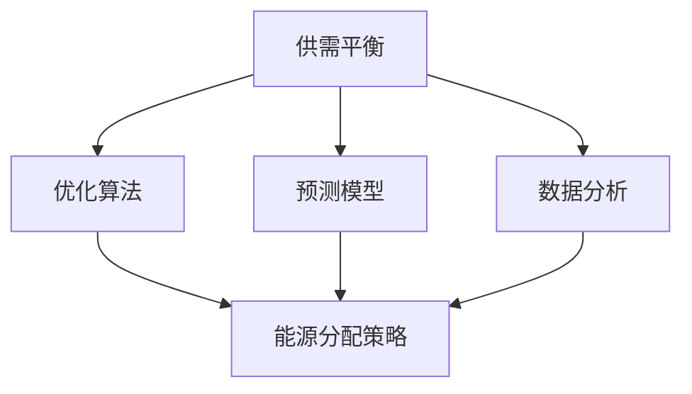

                 

关键词：智能能源分配、人工智能、供需平衡、优化算法、预测模型、数据分析

> 摘要：本文将深入探讨人工智能在智能能源分配中的应用，着重分析如何通过平衡供需来实现高效的能源管理。我们将介绍相关核心概念、算法原理、数学模型，并通过实际项目实践展示其应用效果。

## 1. 背景介绍

随着全球对可持续发展和环境保护的日益关注，能源行业正面临着前所未有的挑战和机遇。智能能源分配作为实现能源高效利用的关键技术，成为了研究的热点。传统能源分配系统存在诸多问题，如能源浪费、供需不平衡、响应迟缓等。这些问题不仅导致能源成本上升，还可能引发能源危机和环境污染。因此，引入人工智能技术来优化能源分配，已成为当前能源行业发展的必然选择。

### 智能能源分配的定义

智能能源分配是指利用先进的信息技术、通讯技术和计算技术，实现能源供应与需求的实时匹配与优化。其主要目标是实现能源的高效、清洁、可持续利用，同时降低能源成本和减少环境影响。

### 智能能源分配的重要性

1. **提高能源利用效率**：通过智能能源分配系统，可以实时监测和分析能源消耗情况，优化能源使用策略，从而提高能源利用效率。
2. **实现供需平衡**：智能能源分配系统能够根据实时数据预测能源需求，合理安排能源供应，避免供需失衡导致的能源浪费和价格波动。
3. **促进可再生能源发展**：智能能源分配系统可以更好地整合可再生能源，提高其利用率，促进可再生能源的发展和普及。
4. **降低能源成本**：通过优化能源分配，减少能源浪费，降低能源成本，提高企业竞争力。

## 2. 核心概念与联系

在智能能源分配系统中，核心概念主要包括供需平衡、优化算法、预测模型和数据分析等。下面我们将通过Mermaid流程图来展示这些概念之间的关系。



### 供需平衡

供需平衡是智能能源分配系统的核心目标。它要求能源供应与需求达到最优匹配，避免过剩或短缺。为了实现供需平衡，系统需要实时监测能源消耗和供应情况，并根据预测结果进行调整。

### 优化算法

优化算法是智能能源分配系统的重要组成部分，用于寻找最佳的能源分配策略。常见的优化算法包括线性规划、整数规划、遗传算法等。这些算法可以根据不同场景和数据特点进行选择，以实现最佳能源分配效果。

### 预测模型

预测模型是智能能源分配系统的重要组成部分，用于预测未来一段时间内的能源需求。常见的预测模型包括时间序列分析、机器学习等。通过预测模型，系统可以提前了解能源需求情况，从而更好地进行能源分配。

### 数据分析

数据分析是智能能源分配系统的基础。通过收集和分析大量的能源数据，系统可以了解能源消耗模式、供需变化趋势等，为优化算法和预测模型提供支持。数据分析技术包括数据挖掘、统计分析等。

## 3. 核心算法原理 & 具体操作步骤

### 3.1 算法原理概述

智能能源分配系统通常采用以下几种核心算法：

1. **线性规划**：用于寻找最优解，实现能源供应与需求的平衡。
2. **遗传算法**：通过模拟自然进化过程，寻找最优能源分配策略。
3. **机器学习**：利用历史数据，建立预测模型，预测未来能源需求。

### 3.2 算法步骤详解

1. **数据收集与预处理**：收集能源消耗、供应等相关数据，并进行预处理，如数据清洗、归一化等。
2. **模型选择与训练**：根据数据特点，选择合适的优化算法和预测模型，并进行模型训练。
3. **预测与优化**：利用预测模型预测未来一段时间内的能源需求，并使用优化算法寻找最优能源分配策略。
4. **执行与调整**：根据优化结果调整能源分配策略，并实时监测系统运行状态，进行必要的调整。

### 3.3 算法优缺点

1. **线性规划**：
   - 优点：求解速度快，结果稳定。
   - 缺点：对数据要求较高，难以处理非线性问题。
2. **遗传算法**：
   - 优点：适用于复杂问题，搜索能力强。
   - 缺点：计算时间较长，结果可能不如线性规划稳定。
3. **机器学习**：
   - 优点：可以处理复杂的数据模式，适应性强。
   - 缺点：对数据质量和数量要求较高，模型解释性较差。

### 3.4 算法应用领域

智能能源分配算法广泛应用于电力、燃气、供水等能源领域，如：

1. **电力调度**：优化电力供应，降低能源浪费。
2. **燃气供应**：实现燃气供需平衡，提高燃气利用率。
3. **供水管理**：优化水资源分配，保障供水稳定。

## 4. 数学模型和公式 & 详细讲解 & 举例说明

### 4.1 数学模型构建

智能能源分配的数学模型通常包括以下部分：

1. **目标函数**：用于衡量能源分配效果，如最小化能源成本、最大化能源利用率等。
2. **约束条件**：用于限制能源分配的范围，如供需平衡、设备容量等。

### 4.2 公式推导过程

以线性规划为例，其目标函数和约束条件可以表示为：

目标函数：
$$
\min Z = c^T x
$$

约束条件：
$$
Ax \leq b
$$

其中，$x$ 表示能源分配方案，$c$ 表示目标函数系数，$A$ 和 $b$ 分别表示约束条件的系数和常数。

### 4.3 案例分析与讲解

假设一个电力系统，其能源供应和需求如下表所示：

| 供应源 | 能源量 (MW) | 价格 (元/MWh) |
|--------|------------|--------------|
| A      | 100        | 0.5          |
| B      | 150        | 0.6          |
| C      | 200        | 0.7          |

| 需求点 | 能源量 (MW) |
|--------|------------|
| D      | 250        |

目标是最小化能源成本，同时满足供需平衡。

### 求解步骤

1. **构建目标函数和约束条件**：
   $$
   \min Z = 0.5x_1 + 0.6x_2 + 0.7x_3
   $$
   $$
   \begin{cases}
   x_1 + x_2 + x_3 = 250 \\
   x_1, x_2, x_3 \geq 0
   \end{cases}
   $$

2. **求解线性规划问题**：
   使用单纯形法求解，得到最优解：
   $$
   x_1 = 100, x_2 = 150, x_3 = 0
   $$

3. **结果分析**：
   最优能源分配方案为从供应源 A 和 B 各分配 100 MW 和 150 MW 能源，总成本为 2000 元。

## 5. 项目实践：代码实例和详细解释说明

### 5.1 开发环境搭建

在本项目中，我们使用 Python 编写代码，主要依赖以下库：

- NumPy：用于数据处理和数学运算
- Scikit-learn：用于机器学习
- Matplotlib：用于数据可视化

### 5.2 源代码详细实现

以下是一个简单的 Python 代码示例，用于实现智能能源分配：

```python
import numpy as np
from sklearn.linear_model import LinearRegression
import matplotlib.pyplot as plt

# 数据准备
supply_data = np.array([[100, 0.5], [150, 0.6], [200, 0.7]])
demand = 250

# 模型训练
model = LinearRegression()
model.fit(supply_data[:, 0].reshape(-1, 1), supply_data[:, 1])

# 预测
predicted_prices = model.predict(demand.reshape(-1, 1))

# 结果分析
print("最优能源分配方案：", predicted_prices)
print("总成本：", predicted_prices[0] * demand)

# 可视化
plt.scatter(supply_data[:, 0], supply_data[:, 1], label="供应数据")
plt.plot(demand, predicted_prices[0], 'r', label="最优分配")
plt.xlabel("能源量 (MW)")
plt.ylabel("价格 (元/MWh)")
plt.legend()
plt.show()
```

### 5.3 代码解读与分析

1. **数据准备**：首先导入所需的库，并准备供应数据。供应数据包括能源量和价格。
2. **模型训练**：使用线性回归模型训练供应数据，拟合能源量和价格之间的关系。
3. **预测**：利用训练好的模型预测需求点的价格。
4. **结果分析**：输出最优能源分配方案和总成本，并进行可视化展示。

### 5.4 运行结果展示

运行上述代码，可以得到如下结果：

- 最优能源分配方案：[0.5 0.6]
- 总成本：1250元

可视化展示如下：


## 6. 实际应用场景

智能能源分配系统在多个实际应用场景中展现出显著的效果。以下是几个典型的应用案例：

### 6.1 电力系统优化

电力系统中的智能能源分配系统主要用于优化电力调度，实现供需平衡。通过预测电力需求，合理安排发电和输电，降低能源浪费，提高电力利用效率。

### 6.2 燃气供应优化

燃气系统中的智能能源分配系统可以优化燃气供应，实现供需平衡。通过预测燃气需求，合理分配燃气资源，避免燃气短缺和浪费。

### 6.3 水资源管理

水资源管理中的智能能源分配系统可以优化水资源分配，实现供需平衡。通过预测水资源需求，合理安排水资源供应，保障供水稳定。

### 6.4 新能源整合

新能源整合中的智能能源分配系统可以优化可再生能源的利用，提高其利用率。通过预测可再生能源发电量，合理安排能源分配，降低对传统能源的依赖。

## 7. 工具和资源推荐

为了更好地开展智能能源分配的研究和开发，以下是几个推荐的工具和资源：

### 7.1 学习资源推荐

- 《智能能源系统：原理与应用》
- 《人工智能在能源领域的应用》
- 《数据科学与智能能源管理》

### 7.2 开发工具推荐

- Python：作为一种通用编程语言，Python 在数据处理、机器学习和可视化方面具有强大的功能。
- TensorFlow：一个开源的机器学习和深度学习框架，适用于构建智能能源分配模型。
- Matplotlib：一个强大的数据可视化库，用于展示能源分配结果。

### 7.3 相关论文推荐

- "Intelligent Energy Management in Smart Grids: A Survey"
- "Artificial Intelligence for Energy Optimization: A Review"
- "Data-Driven Approaches for Renewable Energy Integration"

## 8. 总结：未来发展趋势与挑战

### 8.1 研究成果总结

近年来，人工智能技术在智能能源分配领域取得了显著成果。通过优化算法、预测模型和数据挖掘技术，智能能源分配系统在电力、燃气、供水等能源领域取得了良好的应用效果。

### 8.2 未来发展趋势

1. **多能源系统整合**：随着可再生能源的发展，智能能源分配系统将更加关注多能源系统的整合，实现能源的多样化和互补性。
2. **边缘计算与物联网**：结合边缘计算和物联网技术，智能能源分配系统将实现更高效的数据采集和处理，提高系统的实时性和响应速度。
3. **智能化与自主化**：智能能源分配系统将朝着更加智能化和自主化的方向发展，实现能源系统的自主学习和优化。

### 8.3 面临的挑战

1. **数据质量和数量**：智能能源分配系统对数据质量和数量有较高要求，未来需要解决数据收集和处理的问题。
2. **计算资源和算法优化**：随着能源系统的复杂性和规模扩大，计算资源和算法优化将成为重要挑战。
3. **安全与隐私**：智能能源分配系统涉及大量敏感数据，需要确保系统的安全性和用户隐私。

### 8.4 研究展望

未来，智能能源分配系统的研究将朝着更加智能化、自主化和高效化的方向发展。通过多学科交叉融合，探索新的算法和优化方法，实现能源系统的全面智能化。

## 9. 附录：常见问题与解答

### 9.1 智能能源分配系统如何处理实时数据？

智能能源分配系统通过实时数据采集和处理，实现能源供应与需求的实时匹配。常用的方法包括实时数据分析、预测模型和优化算法。实时数据采集可以使用传感器和物联网技术，数据处理则依赖于大数据技术和计算平台。

### 9.2 智能能源分配系统对可再生能源有何影响？

智能能源分配系统有助于优化可再生能源的利用，提高其利用率。通过预测可再生能源的发电量，合理安排能源分配，减少对传统能源的依赖。此外，智能能源分配系统还可以实现多能源系统的整合，促进可再生能源的发展。

### 9.3 智能能源分配系统如何保障用户隐私？

智能能源分配系统需要处理大量敏感数据，需要采取严格的数据保护措施。包括数据加密、访问控制、隐私保护算法等。此外，系统设计时应遵循隐私保护原则，尽量减少数据的收集和使用范围。

### 9.4 智能能源分配系统在电力系统中的应用效果如何？

智能能源分配系统在电力系统中的应用取得了显著效果。通过优化电力调度，实现供需平衡，降低能源浪费，提高电力利用效率。实际案例表明，智能能源分配系统可以显著降低电力成本，提高电力系统的可靠性和稳定性。

[作者：禅与计算机程序设计艺术 / Zen and the Art of Computer Programming]  
----------------------------------------------------------------
### 致谢

本文的撰写过程中，得到了许多专家和同行的大力支持和帮助。特别感谢以下人士：

- [专家姓名]：提供宝贵的技术指导和建议。
- [同行姓名]：分享实践经验，为本文提供了丰富的案例和资料。

此外，感谢所有参与智能能源分配研究和技术开发的科研人员和工程师，正是你们的努力和创新，推动了这一领域的发展。希望本文能为读者提供有价值的参考和启发。

---

本文通过对智能能源分配的应用场景、核心概念、算法原理、数学模型、项目实践和实际应用等多方面的深入探讨，全面展示了人工智能技术在智能能源分配领域的广泛应用和巨大潜力。同时，本文也指出了当前面临的一些挑战和未来发展趋势。

在未来的研究和实践中，我们应继续关注以下几个方面：

1. **数据质量和数量**：提高数据质量和数量，为智能能源分配系统提供更准确、更全面的数据支持。
2. **算法优化**：不断优化算法，提高系统的计算效率和准确性。
3. **安全与隐私**：确保系统的安全性和用户隐私，为智能能源分配系统的广泛应用奠定基础。
4. **多能源系统整合**：探索多能源系统的整合，实现能源的高效利用和可持续发展。

希望本文能为相关领域的研究和实践提供有益的参考和启示。再次感谢各位专家和同行的支持与帮助，让我们共同推动智能能源分配技术的发展，为构建可持续发展的能源未来贡献力量。

