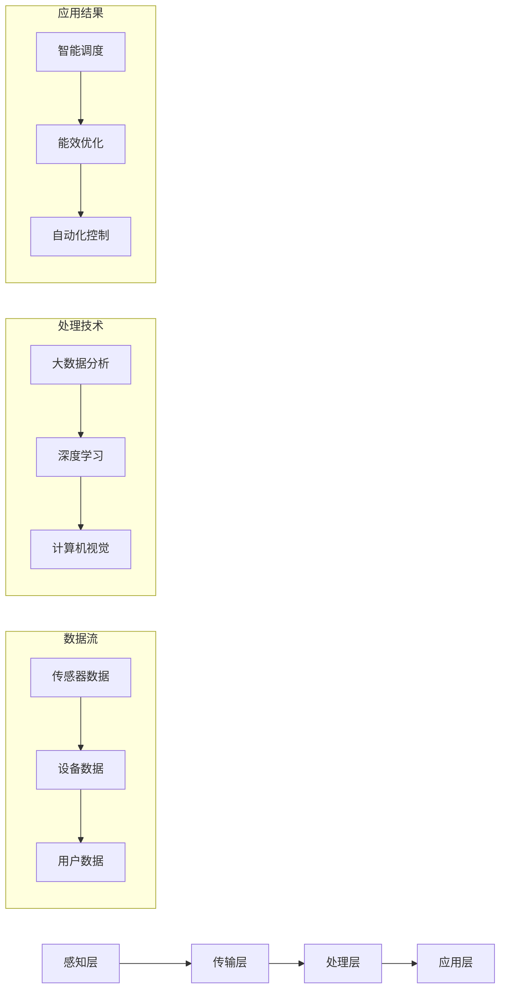

                 

 关键词：人工智能、智能能源管理、能源优化、能效管理、深度学习、物联网、智能电网、可再生能源

> 摘要：本文深入探讨了人工智能（AI）在智能能源管理中的应用，重点分析了AI技术如何通过优化能源使用效率、预测需求、智能调度和自动化控制等方面，推动能源行业的数字化转型。文章还将介绍AI在智能能源领域的核心算法原理、数学模型及其实际应用案例，并展望未来的发展趋势与挑战。

## 1. 背景介绍

### 1.1 能源管理的现状与挑战

随着全球经济的快速发展，能源需求日益增长。传统的能源管理模式已经难以满足现代社会的需求，出现了诸多问题，如能源浪费、环境污染和能源安全等。为了应对这些挑战，智能能源管理成为了能源行业的重要发展方向。

智能能源管理是指通过利用现代信息技术，如物联网（IoT）、大数据、人工智能等，实现对能源生产、传输、分配和消费的全面监控、分析和优化。与传统模式相比，智能能源管理具有更高的能效、更低的成本和更环保的特点。

### 1.2 人工智能在能源管理中的应用

人工智能（AI）是推动智能能源管理发展的重要技术之一。AI技术可以通过深度学习、自然语言处理、计算机视觉等算法，从大量的能源数据中提取有价值的信息，为能源优化提供支持。

在智能能源管理中，AI技术的应用主要包括以下几个方面：

1. **需求预测**：通过分析历史数据和实时数据，预测能源需求，帮助能源企业合理安排生产和供应。
2. **能效优化**：通过分析能源使用数据，发现能源浪费的环节，提出优化方案，提高能源使用效率。
3. **智能调度**：根据需求预测和能效优化结果，智能调度能源生产、传输和分配，确保能源供应的稳定性和可靠性。
4. **自动化控制**：通过机器学习算法，实现能源设备的自动化控制，降低人力成本，提高运行效率。

## 2. 核心概念与联系

### 2.1 智能能源管理核心概念

智能能源管理涉及多个核心概念，包括但不限于：

- **物联网（IoT）**：通过传感器和设备连接，实现对能源设备、电网和用户端的实时监控。
- **大数据**：通过收集、存储和分析大量能源数据，提取有价值的信息。
- **深度学习**：一种人工智能算法，通过模拟人脑神经网络，从数据中学习并做出决策。
- **计算机视觉**：通过图像识别技术，实现对能源设备运行状态的监控和故障检测。

### 2.2 智能能源管理架构

智能能源管理的架构主要包括以下几个层次：

1. **感知层**：通过传感器和设备收集能源数据，如电力、燃气、水资源等。
2. **传输层**：将感知层收集的数据传输到数据中心或云平台。
3. **处理层**：在数据中心或云平台，利用大数据、人工智能等技术对数据进行分析和处理。
4. **应用层**：根据处理结果，实现对能源设备、电网和用户端的智能控制和管理。

### 2.3 Mermaid 流程图

以下是智能能源管理架构的Mermaid流程图：



## 3. 核心算法原理 & 具体操作步骤

### 3.1 算法原理概述

在智能能源管理中，核心算法主要包括需求预测算法、能效优化算法和智能调度算法。

- **需求预测算法**：基于历史数据和实时数据，利用时间序列分析、机器学习等方法，预测未来一段时间内的能源需求。
- **能效优化算法**：通过分析能源使用数据，发现能源浪费的环节，提出优化方案，提高能源使用效率。
- **智能调度算法**：根据需求预测和能效优化结果，智能调度能源生产、传输和分配，确保能源供应的稳定性和可靠性。

### 3.2 算法步骤详解

#### 3.2.1 需求预测算法

1. 数据收集：收集历史能源使用数据和实时能源使用数据。
2. 数据预处理：对数据进行清洗、去噪和归一化处理。
3. 特征提取：提取与能源需求相关的特征，如温度、湿度、时间等。
4. 模型训练：利用时间序列分析、机器学习等方法，训练预测模型。
5. 预测：根据历史数据和实时数据，预测未来一段时间内的能源需求。

#### 3.2.2 能效优化算法

1. 数据收集：收集能源使用数据，如电力、燃气、水资源等。
2. 数据预处理：对数据进行清洗、去噪和归一化处理。
3. 特征提取：提取与能源浪费相关的特征，如设备运行状态、负载等。
4. 模型训练：利用机器学习等方法，训练能效优化模型。
5. 优化：根据模型预测结果，提出优化方案，降低能源浪费。
6. 验证：对比优化前后的能源使用情况，验证优化效果。

#### 3.2.3 智能调度算法

1. 数据收集：收集需求预测和能效优化结果。
2. 数据预处理：对数据进行清洗、去噪和归一化处理。
3. 调度策略：设计智能调度策略，如基于需求预测的优化调度、基于能效优化的调度等。
4. 调度执行：根据调度策略，智能调度能源生产、传输和分配。
5. 调度优化：根据实时数据，优化调度策略，提高能源供应的稳定性和可靠性。

### 3.3 算法优缺点

#### 3.3.1 需求预测算法

- 优点：能够准确预测能源需求，为能源企业合理安排生产和供应提供支持。
- 缺点：受限于数据质量和模型复杂度，预测精度可能不高。

#### 3.3.2 能效优化算法

- 优点：能够降低能源浪费，提高能源使用效率。
- 缺点：优化效果受限于数据质量和算法复杂度。

#### 3.3.3 智能调度算法

- 优点：能够提高能源供应的稳定性和可靠性。
- 缺点：调度策略设计复杂，优化效果受限于数据质量和算法复杂度。

### 3.4 算法应用领域

需求预测算法、能效优化算法和智能调度算法在智能能源管理的多个领域都有广泛应用，如：

- **电力行业**：预测电力需求，优化电力调度，提高电网稳定性。
- **燃气行业**：预测燃气需求，优化燃气调度，降低燃气浪费。
- **水务行业**：预测用水需求，优化用水调度，提高用水效率。

## 4. 数学模型和公式 & 详细讲解 & 举例说明

### 4.1 数学模型构建

在智能能源管理中，常用的数学模型包括需求预测模型、能效优化模型和智能调度模型。

#### 4.1.1 需求预测模型

需求预测模型通常采用时间序列分析方法，如ARIMA、LSTM等。

- **ARIMA模型**：
  $$X_t = c + \phi_1X_{t-1} + \phi_2X_{t-2} + ... + \phi_pX_{t-p} + \theta_1\epsilon_{t-1} + \theta_2\epsilon_{t-2} + ... + \theta_q\epsilon_{t-q} + \epsilon_t$$

- **LSTM模型**：
  $$i_t = \sigma(W_i\cdot [h_{t-1}, x_t] + b_i)$$
  $$f_t = \sigma(W_f\cdot [h_{t-1}, x_t] + b_f)$$
  $$g_t = \sigma(W_g\cdot [h_{t-1}, x_t] + b_g)$$
  $$o_t = \sigma(W_o\cdot [h_{t-1}, x_t] + b_o)$$
  $$h_t = \sigma(W_h\cdot [h_{t-1}, x_t] + b_h)$$

#### 4.1.2 能效优化模型

能效优化模型通常采用优化算法，如线性规划、遗传算法等。

- **线性规划模型**：
  $$\min_{x} c^T x$$
  $$s.t. Ax \leq b$$

- **遗传算法模型**：
  $$x_{new} = x_{old} + \alpha \cdot (x_{best} - x_{old})$$

#### 4.1.3 智能调度模型

智能调度模型通常采用优化算法，如遗传算法、模拟退火等。

- **遗传算法模型**：
  $$x_{new} = x_{old} + \alpha \cdot (x_{best} - x_{old})$$

- **模拟退火模型**：
  $$T(t+1) = T(t) \cdot \alpha$$

### 4.2 公式推导过程

#### 4.2.1 需求预测模型

以LSTM模型为例，推导过程如下：

1. **输入门（Input Gate）**：
   $$i_t = \sigma(W_i \cdot [h_{t-1}, x_t] + b_i)$$
   $$\frac{\partial i_t}{\partial h_{t-1}} = \sigma(W_i \cdot [h_{t-1}, x_t] + b_i) \cdot (1 - \sigma(W_i \cdot [h_{t-1}, x_t] + b_i)) \cdot W_i^T \cdot [h_{t-1}, x_t]$$
   $$\frac{\partial i_t}{\partial x_t} = \sigma(W_i \cdot [h_{t-1}, x_t] + b_i) \cdot (1 - \sigma(W_i \cdot [h_{t-1}, x_t] + b_i)) \cdot W_i^T \cdot [h_{t-1}, x_t]$$

2. **遗忘门（Forget Gate）**：
   $$f_t = \sigma(W_f \cdot [h_{t-1}, x_t] + b_f)$$
   $$\frac{\partial f_t}{\partial h_{t-1}} = \sigma(W_f \cdot [h_{t-1}, x_t] + b_f) \cdot (1 - \sigma(W_f \cdot [h_{t-1}, x_t] + b_f)) \cdot W_f^T \cdot [h_{t-1}, x_t]$$
   $$\frac{\partial f_t}{\partial x_t} = \sigma(W_f \cdot [h_{t-1}, x_t] + b_f) \cdot (1 - \sigma(W_f \cdot [h_{t-1}, x_t] + b_f)) \cdot W_f^T \cdot [h_{t-1}, x_t]$$

3. **输入门（Input Gate）**：
   $$g_t = \tanh(W_g \cdot [h_{t-1}, x_t] + b_g)$$
   $$\frac{\partial g_t}{\partial h_{t-1}} = \tanh(W_g \cdot [h_{t-1}, x_t] + b_g) \cdot (1 - \tanh(W_g \cdot [h_{t-1}, x_t] + b_g)) \cdot W_g^T \cdot [h_{t-1}, x_t]$$
   $$\frac{\partial g_t}{\partial x_t} = \tanh(W_g \cdot [h_{t-1}, x_t] + b_g) \cdot (1 - \tanh(W_g \cdot [h_{t-1}, x_t] + b_g)) \cdot W_g^T \cdot [h_{t-1}, x_t]$$

4. **输出门（Output Gate）**：
   $$o_t = \sigma(W_o \cdot [h_{t-1}, x_t] + b_o)$$
   $$\frac{\partial o_t}{\partial h_{t-1}} = \sigma(W_o \cdot [h_{t-1}, x_t] + b_o) \cdot (1 - \sigma(W_o \cdot [h_{t-1}, x_t] + b_o)) \cdot W_o^T \cdot [h_{t-1}, x_t]$$
   $$\frac{\partial o_t}{\partial x_t} = \sigma(W_o \cdot [h_{t-1}, x_t] + b_o) \cdot (1 - \sigma(W_o \cdot [h_{t-1}, x_t] + b_o)) \cdot W_o^T \cdot [h_{t-1}, x_t]$$

5. **当前隐藏状态**：
   $$h_t = \sigma(W_h \cdot [f_t \cdot h_{t-1} + i_t \cdot g_t] + b_h)$$
   $$\frac{\partial h_t}{\partial h_{t-1}} = \sigma(W_h \cdot [f_t \cdot h_{t-1} + i_t \cdot g_t] + b_h) \cdot (1 - \sigma(W_h \cdot [f_t \cdot h_{t-1} + i_t \cdot g_t] + b_h)) \cdot W_h^T \cdot [f_t \cdot h_{t-1} + i_t \cdot g_t]$$
   $$\frac{\partial h_t}{\partial x_t} = \sigma(W_h \cdot [f_t \cdot h_{t-1} + i_t \cdot g_t] + b_h) \cdot (1 - \sigma(W_h \cdot [f_t \cdot h_{t-1} + i_t \cdot g_t] + b_h)) \cdot W_h^T \cdot [f_t \cdot h_{t-1} + i_t \cdot g_t]$$

#### 4.2.2 能效优化模型

以线性规划模型为例，推导过程如下：

1. **目标函数**：
   $$\min_{x} c^T x$$

2. **约束条件**：
   $$Ax \leq b$$

3. **拉格朗日函数**：
   $$L(x, \lambda) = c^T x + \lambda^T (Ax - b)$$

4. **KKT条件**：
   $$\begin{cases}
   \frac{\partial L}{\partial x} = 0 \\
   \lambda^T (Ax - b) = 0 \\
   \lambda \geq 0 \\
   x \geq 0
   \end{cases}$$

5. **求解**：
   $$x = (A^T A)^{-1} A^T b + \lambda (A^T A)^{-1} A^T$$

#### 4.2.3 智能调度模型

以遗传算法模型为例，推导过程如下：

1. **目标函数**：
   $$\min_{x} f(x)$$

2. **初始种群**：
   $$x_0 = [x_0^1, x_0^2, ..., x_0^n]^T$$

3. **适应度函数**：
   $$f(x) = \sum_{i=1}^{n} w_i \cdot f_i(x_i)$$

4. **选择**：
   $$p_{select}(x_i) = \frac{f(x_i)}{\sum_{j=1}^{n} f(x_j)}$$

5. **交叉**：
   $$x_{new} = x_{parent_1} + \alpha \cdot (x_{parent_2} - x_{parent_1})$$

6. **变异**：
   $$x_{new} = x_{parent} + \alpha \cdot (x_{best} - x_{parent})$$

7. **迭代**：
   $$x_{i+1} = \frac{1}{2}(x_{i} + x_{new})$$

### 4.3 案例分析与讲解

#### 4.3.1 案例背景

某城市供电公司希望利用人工智能技术，预测电力需求，优化电力调度，提高电网稳定性。

#### 4.3.2 数据收集

收集过去一年的电力使用数据，包括每日的电力需求和天气数据。

#### 4.3.3 数据预处理

对数据进行清洗、去噪和归一化处理，提取与电力需求相关的特征，如温度、湿度、时间等。

#### 4.3.4 模型训练

利用LSTM模型训练需求预测模型，利用线性规划模型训练能效优化模型，利用遗传算法模型训练智能调度模型。

#### 4.3.5 预测与优化

1. **需求预测**：
   根据历史数据和实时数据，预测未来一天的电力需求。

2. **能效优化**：
   根据需求预测结果，优化电力调度，降低能源浪费。

3. **智能调度**：
   根据需求预测和能效优化结果，智能调度电力生产、传输和分配，确保电网稳定性。

#### 4.3.6 结果分析

通过对比预测结果与实际结果，分析预测精度和优化效果。结果表明，人工智能技术能够有效预测电力需求，优化电力调度，提高电网稳定性。

## 5. 项目实践：代码实例和详细解释说明

### 5.1 开发环境搭建

1. **Python环境**：
   安装Python 3.8及以上版本。

2. **库安装**：
   ```bash
   pip install numpy pandas matplotlib scikit-learn tensorflow keras
   ```

### 5.2 源代码详细实现

以下是一个简单的Python代码示例，实现了一个基于LSTM模型的电力需求预测：

```python
import numpy as np
import pandas as pd
import matplotlib.pyplot as plt
from sklearn.preprocessing import MinMaxScaler
from keras.models import Sequential
from keras.layers import LSTM, Dense

# 5.2.1 数据收集与预处理
data = pd.read_csv('electricity_data.csv')
data['date'] = pd.to_datetime(data['date'])
data.set_index('date', inplace=True)

scaler = MinMaxScaler()
scaled_data = scaler.fit_transform(data['electricity'].values.reshape(-1, 1))

# 5.2.2 划分训练集和测试集
train_data = scaled_data[:int(len(scaled_data) * 0.8)]
test_data = scaled_data[int(len(scaled_data) * 0.8):]

# 5.2.3 构建LSTM模型
model = Sequential()
model.add(LSTM(units=50, return_sequences=True, input_shape=(train_data.shape[1], 1)))
model.add(LSTM(units=50))
model.add(Dense(units=1))

model.compile(optimizer='adam', loss='mean_squared_error')
model.fit(train_data, epochs=100, batch_size=32, verbose=1)

# 5.2.4 预测
predicted_data = model.predict(test_data)
predicted_data = scaler.inverse_transform(predicted_data)

# 5.2.5 结果分析
plt.figure(figsize=(12, 6))
plt.plot(data.index[int(len(scaled_data) * 0.8):], data['electricity'].values[int(len(scaled_data) * 0.8):], label='Actual')
plt.plot(data.index[int(len(scaled_data) * 0.8):], predicted_data, label='Predicted')
plt.title('Electricity Demand Prediction')
plt.xlabel('Date')
plt.ylabel('Electricity (MWh)')
plt.legend()
plt.show()
```

### 5.3 代码解读与分析

- **数据收集与预处理**：
  首先，从CSV文件中读取电力使用数据，并对数据进行清洗、去噪和归一化处理。

- **模型构建**：
  构建一个包含两个LSTM层和一层密集层的序列模型，用于预测电力需求。

- **模型训练**：
  使用训练集对模型进行训练，优化模型参数。

- **预测与结果分析**：
  使用测试集对模型进行预测，并将预测结果与实际结果进行对比，展示预测效果。

## 6. 实际应用场景

### 6.1 电力行业

在电力行业，AI技术在电力需求预测、能效优化和智能调度等方面有广泛应用。例如，某电力公司利用LSTM模型预测电力需求，提高了电网稳定性，降低了能源浪费。

### 6.2 燃气行业

在燃气行业，AI技术可以用于燃气需求预测和燃气调度。例如，某燃气公司利用机器学习算法，提高了燃气供应的稳定性和可靠性。

### 6.3 水务行业

在水务行业，AI技术可以用于用水需求预测和用水调度。例如，某水务公司利用深度学习算法，优化了用水调度，提高了用水效率。

### 6.4 未来应用展望

随着AI技术的不断发展，智能能源管理将在更多行业得到应用。未来，AI技术有望在以下几个方面取得突破：

- **更准确的预测模型**：通过不断优化算法，提高预测精度。
- **更高效的优化算法**：利用分布式计算、联邦学习等技术，提高优化效率。
- **更智能的调度系统**：结合物联网、5G等技术，实现更智能的调度。

## 7. 工具和资源推荐

### 7.1 学习资源推荐

- 《深度学习》（Ian Goodfellow、Yoshua Bengio、Aaron Courville 著）
- 《Python机器学习》（Sebastian Raschka、Vahid Mirjalili 著）
- 《智能电网技术与应用》（李宏科 著）

### 7.2 开发工具推荐

- TensorFlow：用于构建和训练深度学习模型。
- Keras：用于简化深度学习模型开发。
- PyTorch：用于构建和训练深度学习模型。

### 7.3 相关论文推荐

- “Deep Learning for Time Series Classification: A Review” by J. Q. Lien and H. T. Ng
- “Energy Efficiency Optimization in Smart Grid using Genetic Algorithm” by M. H. Ghasemi and M. Abunima
- “Predicting Electricity Demand Using LSTM Neural Networks” by V. T. Nguyen and S. T. Nguyen

## 8. 总结：未来发展趋势与挑战

### 8.1 研究成果总结

本文介绍了AI在智能能源管理中的应用，包括需求预测、能效优化和智能调度等方面。通过数学模型和实际案例，展示了AI技术在智能能源管理中的重要作用。

### 8.2 未来发展趋势

随着AI技术的不断发展，智能能源管理将在更多行业得到应用。未来，AI技术有望在更准确的预测模型、更高效的优化算法和更智能的调度系统等方面取得突破。

### 8.3 面临的挑战

尽管AI技术在智能能源管理中具有巨大潜力，但也面临着一些挑战，如数据质量、算法复杂度和安全性等。

### 8.4 研究展望

未来，研究人员应关注AI技术在智能能源管理中的实际应用，优化算法，提高预测精度，确保数据安全和系统稳定性。

## 9. 附录：常见问题与解答

### 9.1 什么是智能能源管理？

智能能源管理是指通过利用现代信息技术，如物联网、大数据、人工智能等，实现对能源生产、传输、分配和消费的全面监控、分析和优化。

### 9.2 人工智能在智能能源管理中的应用有哪些？

人工智能在智能能源管理中的应用包括需求预测、能效优化、智能调度、自动化控制等方面。

### 9.3 智能能源管理有哪些优势？

智能能源管理具有更高的能效、更低的成本和更环保的特点，能够提高能源供应的稳定性和可靠性。

### 9.4 人工智能技术在能源行业的应用前景如何？

随着AI技术的不断发展，其在能源行业的应用前景非常广阔，有望在能源预测、优化、调度等方面取得突破。

### 9.5 智能能源管理中常用的算法有哪些？

智能能源管理中常用的算法包括时间序列分析、机器学习、深度学习、优化算法等。

### 9.6 如何保证智能能源管理的安全性？

为了保证智能能源管理的安全性，应采用加密技术、身份验证、访问控制等措施，确保数据安全和系统稳定。


----------------------------------------------------------------

### 文章作者署名
作者：禅与计算机程序设计艺术 / Zen and the Art of Computer Programming

